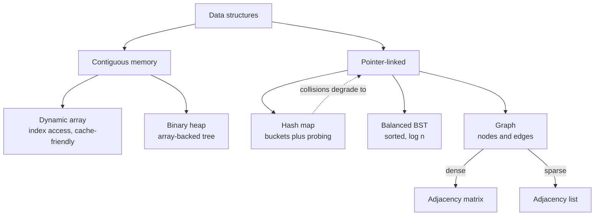
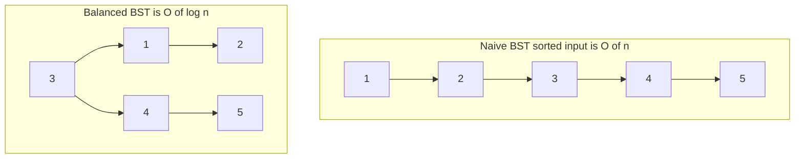

# Data structures you actually use

## Why this matters

It's a Tuesday afternoon and a batch job that used to finish in four minutes is now taking forty. Nothing in the data changed much — the input grew from 50,000 records to maybe 80,000. You profile it. The hot loop is innocent-looking: for each incoming order, check whether the customer ID is already in a `seen` collection, and if not, append it. The check is `if customer_id in seen:`. The bug is that `seen` is a Python `list`.

Membership testing in a list is O(n): Python walks the whole list looking for a match. Do that once per record and you have an O(n²) algorithm hiding inside a one-line `if`. At 50,000 records nobody noticed. At 80,000 the quadratic term bit, because (80,000/50,000)² is about 2.5x the work per record times 1.6x the records — roughly the 10x slowdown you're staring at. The fix is one character of intent: make `seen` a `set`. Membership goes from O(n) to O(1) average, and the forty minutes drop back under five.

That's the entire reason this chapter exists. The difference between a data structure that fits the access pattern and one that doesn't is rarely visible in small tests and almost always catastrophic at scale. You don't need to reimplement a red-black tree from memory. You need to know, in your bones, what each structure costs for the operation you're about to do thousands of times — and reach for the right one without thinking. The engineers who internalize this write code that scales quietly. The ones who don't ship the list-where-a-set-belongs bug, over and over, in slightly different costumes.

## Mental model

There are five structures you reach for constantly. Everything fancier is a specialization of these. Hold this table in your head:

| Structure | Lookup by key | Insert | Ordered iteration | Cache behavior |
|---|---|---|---|---|
| **Dynamic array** (`list`) | O(n) by value, O(1) by index | O(1) amortized at end | yes (insertion order) | excellent (contiguous) |
| **Hash map** (`dict`/`set`) | O(1) average, O(n) worst | O(1) average | no (insertion order in CPython) | poor (scattered) |
| **Balanced BST** | O(log n) | O(log n) | yes (sorted) | moderate |
| **Heap** (`heapq`) | O(1) peek-min only | O(log n) | no | moderate |
| **Graph** (adjacency) | depends on representation | O(1) add edge | n/a | depends |

The single most useful decision rule: **what operation am I doing in the inner loop, and how often?** If it's "is this thing present" or "give me the value for this key," you want a hash map. If it's "give me the smallest remaining item," you want a heap. If it's "give me everything in sorted order while I keep inserting," you want a balanced tree. If it's "walk these in order by position," an array wins and wins on cache locality too.

That last column matters more than most curricula admit. A modern CPU pulls memory in cache lines (commonly 64 bytes) and prefetches sequentially. An array packs its elements end to end, so iterating one is a stream of cache hits. A hash map or a pointer-based tree scatters its elements across the heap, so every access risks a cache miss that costs on the order of hundreds of cycles. A "slower" O(n) array scan can beat a "faster" O(1) hash lookup for small n purely because the array never leaves cache. Asymptotics tell you what happens eventually; cache behavior tells you what happens at the sizes you actually run.

Here's how the structures relate, from the contiguous-memory family on the left to the pointer-linked family on the right:



## In practice

### Arrays and dynamic arrays: the default, and why appends are cheap

A Python `list` is a dynamic array: a contiguous block of pointers that grows by reallocating to a bigger block when it fills. The magic is amortization. CPython overallocates — when a list fills, it grows to a larger capacity rather than adding room for exactly one more element — so most appends are O(1) and only the occasional one pays for a copy. Averaged out, append is O(1) amortized.

```python
import sys
xs = []
prev = -1
for i in range(33):
    xs.append(i)
    cap = (sys.getsizeof(xs) - sys.getsizeof([])) // 8  # 8 bytes per pointer (CPython, 64-bit)
    if cap != prev:
        print(f"len={len(xs):2d}  capacity~{cap}")
        prev = cap
```

*In TypeScript:*

```typescript
// V8 arrays also overallocate, but unlike CPython's sys.getsizeof there is no
// public, portable way to read an array's backing capacity from JS. The growth
// behavior is real; only the introspection is missing. This mirrors the loop's
// logic, printing each length where capacity *would* be observed to change.
const xs: number[] = [];
const prevLen = -1;
for (let i = 0; i < 33; i++) {
  xs.push(i);
  // No equivalent of sys.getsizeof for array capacity in JS; capacity stays an
  // engine-internal detail. We can still observe the length progression that
  // the Python code keys off of.
  if (xs.length !== prevLen) {
    console.log(`len=${String(xs.length).padStart(2)}  capacity~(engine-internal)`);
  }
}
```

```
len= 1  capacity~4
len= 5  capacity~8
len= 9  capacity~16
len=17  capacity~24
len=25  capacity~32
len=33  capacity~40
```

The exact capacities are an implementation detail and vary by CPython version, so treat the numbers above as one observed run rather than a contract. What does not vary is the shape: capacity jumps in larger-than-one steps that grow with the list, and that geometric-ish overallocation is what makes the amortization work. The two operations to avoid on a large list are `insert(0, x)` and `pop(0)` — both are O(n) because every other element must shift. If you need fast appends and pops at *both* ends, use `collections.deque`, which is O(1) at each end:

```python
from collections import deque
q = deque()
q.append(1)       # O(1) at right
q.appendleft(0)   # O(1) at left
q.popleft()       # O(1) — a list's pop(0) is O(n)
```

*The TypeScript equivalent:*

```typescript
// JS has no built-in deque; a small doubly-linked structure gives O(1) at both ends.
interface Node<T> { value: T; prev?: Node<T>; next?: Node<T>; }

class Deque<T> {
  private head?: Node<T>;
  private tail?: Node<T>;
  append(x: T): void {            // O(1) at right
    const node: Node<T> = { value: x, prev: this.tail, next: undefined };
    if (this.tail) this.tail.next = node; else this.head = node;
    this.tail = node;
  }
  appendleft(x: T): void {        // O(1) at left
    const node: Node<T> = { value: x, prev: undefined, next: this.head };
    if (this.head) this.head.prev = node; else this.tail = node;
    this.head = node;
  }
  popleft(): T | undefined {      // O(1) — Array.prototype.shift() is O(n)
    if (!this.head) return undefined;
    const v = this.head.value;
    this.head = this.head.next;
    if (this.head) this.head.prev = undefined; else this.tail = undefined;
    return v;
  }
}

const q = new Deque<number>();
q.append(1);       // O(1) at right
q.appendleft(0);   // O(1) at left
q.popleft();       // O(1) — Array.prototype.shift() is O(n)
```

### Hash maps: collisions, load factor, and resizing

A `dict` or `set` stores entries in an array of buckets. To find the bucket for a key, it hashes the key and reduces the hash to an index in the table. Two keys can land in the same bucket — a **collision** — and the table needs a strategy to cope. CPython uses *open addressing*: on collision it probes other slots in the same array until it finds a free one. (The classic textbook alternative is *separate chaining*, where each bucket holds a linked list.)

The **load factor** is `entries / buckets`. As it climbs, collisions get more frequent and probes get longer, so the table **resizes** — allocates a larger bucket array and rehashes every entry into it. CPython resizes when the table grows past a fraction of its capacity (around two-thirds full), growing the array several-fold. Resizing is O(n) for that one insert, but amortized across all inserts it keeps the average at O(1).

The thing to internalize is the worst case. If many keys hash to the same value, every lookup degrades to O(n). With well-distributed hashes that never happens by accident, but it can happen by *malice* (see the Security note). For your own classes, a good `__hash__` that spreads values across the space is what keeps `dict` fast.

Now the bug from the opening, made concrete and measured:

```python
import time

def count_unique_slow(ids):
    seen = []                     # WRONG: list membership is O(n)
    for cid in ids:
        if cid not in seen:       # O(n) scan, every iteration
            seen.append(cid)
    return len(seen)

def count_unique_fast(ids):
    seen = set()                  # RIGHT: set membership is O(1) average
    for cid in ids:
        seen.add(cid)             # add is idempotent; no need to check first
    return len(seen)

data = [i % 4000 for i in range(80_000)]

t = time.perf_counter(); count_unique_slow(data); print(f"list: {time.perf_counter()-t:.3f}s")
t = time.perf_counter(); count_unique_fast(data); print(f"set:  {time.perf_counter()-t:.4f}s")
```

*The same idea in TypeScript:*

```typescript
function countUniqueSlow(ids: number[]): number {
  const seen: number[] = [];        // WRONG: Array.includes is O(n)
  for (const cid of ids) {
    if (!seen.includes(cid)) {      // O(n) scan, every iteration
      seen.push(cid);
    }
  }
  return seen.length;
}

function countUniqueFast(ids: number[]): number {
  const seen = new Set<number>();   // RIGHT: Set membership is O(1) average
  for (const cid of ids) {
    seen.add(cid);                  // add is idempotent; no need to check first
  }
  return seen.size;
}

const data = Array.from({ length: 80_000 }, (_, i) => i % 4000);

let t = performance.now(); countUniqueSlow(data); console.log(`list: ${((performance.now() - t) / 1000).toFixed(3)}s`);
t = performance.now(); countUniqueFast(data); console.log(`set:  ${((performance.now() - t) / 1000).toFixed(4)}s`);
```

On a typical run the set version finishes in a small fraction of a second while the list version takes seconds — easily a few orders of magnitude apart at this size, and the gap widens with input length and with the number of distinct values. The two versions look almost identical in the diff. That's exactly why this bug survives code review: the cost is in the data structure choice, not in any line that looks expensive. The exact ratio depends on the machine and the number of distinct values, so measure the magnitude on your hardware with `timeit` before quoting a figure.

### Trees: why balance is the whole point

A binary search tree keeps keys ordered: everything in the left subtree is smaller, everything in the right is larger. That ordering buys you O(log n) lookup, insert, and delete *if the tree stays balanced* — if its height stays near log n.

The failure mode is inserting already-sorted data into a naive BST. Each new key is larger than everything before it, so it always goes right, and the tree degenerates into a linked list of height n. Your O(log n) operations are now O(n):



Self-balancing trees (red-black, AVL, B-trees) do extra bookkeeping on every insert to keep the height logarithmic. This is not academic: a database B-tree index is exactly this guarantee, and it's why an indexed lookup stays fast as a table grows from a thousand rows to a billion.

Python's standard library has no built-in balanced tree, which trips people up. When you need "sorted, with fast inserts," reach for one of these:

- `sorted(...)` once, then `bisect` for O(log n) lookups — if the data is static after building.
- `bisect.insort` into a list — O(log n) to find the spot, but **O(n) to insert** because of the shift. Fine for modest sizes, a trap at scale.
- The third-party `sortedcontainers` library (`SortedList`, `SortedDict`) — gives you effective O(log n) inserts and is the pragmatic production choice.

```python
import bisect
prices = [10, 23, 23, 41, 88]   # kept sorted
i = bisect.bisect_left(prices, 23)   # O(log n): leftmost index where 23 fits
print(i)                              # 1
bisect.insort(prices, 30)             # O(log n) search + O(n) shift
print(prices)                         # [10, 23, 23, 30, 41, 88]
```

*The same idea in TypeScript:*

```typescript
// JS has no bisect module; these are the standard binary-search implementations.
function bisectLeft(a: number[], x: number): number {
  let lo = 0, hi = a.length;
  while (lo < hi) {
    const mid = (lo + hi) >> 1;
    if (a[mid] < x) lo = mid + 1; else hi = mid;
  }
  return lo;
}
function insort(a: number[], x: number): void {
  a.splice(bisectLeft(a, x), 0, x);   // O(log n) search + O(n) shift
}

const prices = [10, 23, 23, 41, 88];   // kept sorted
const i = bisectLeft(prices, 23);       // O(log n): leftmost index where 23 fits
console.log(i);                         // 1
insort(prices, 30);                     // O(log n) search + O(n) shift
console.log(prices);                    // [10, 23, 23, 30, 41, 88]
```

> **Connect the dots:** The balanced-tree guarantee is the load-bearing idea behind database indexes (Part 5 — Databases). When you add an index to a column, you're asking the engine to maintain a B-tree so that `WHERE col = ?` is O(log n) instead of a full O(n) table scan. The "why balance matters" intuition here is the same intuition that explains why an index speeds up reads but slows down writes — every write now has to keep the tree balanced too.

### Heaps and priority queues: the smallest thing, fast

A binary heap is a tree that only promises one thing: the minimum (or maximum) is at the root, retrievable in O(1), and removable in O(log n). It does *not* keep everything sorted, which is exactly why it's cheaper than a tree when "sorted order" isn't what you need. It's stored as a plain array — no pointers, decent cache behavior — using the trick that node `i`'s children live at `2i+1` and `2i+2`.

Use a heap whenever you repeatedly need "the next most urgent item": task schedulers, Dijkstra's shortest path, merging k sorted streams, or keeping the top-k of a large feed. Python's `heapq` is a min-heap operating in place on a list:

```python
import heapq

# Top-3 largest from a stream, using a size-3 min-heap. O(n log k), O(k) memory.
def top_k(stream, k):
    h = []
    for x in stream:
        if len(h) < k:
            heapq.heappush(h, x)
        elif x > h[0]:          # h[0] is the smallest of the current top-k
            heapq.heapreplace(h, x)   # pop min, push x, in one O(log k) step
    return sorted(h, reverse=True)

print(top_k([5, 1, 9, 3, 7, 8, 2], 3))   # [9, 8, 7]
```

*The TypeScript equivalent:*

```typescript
// JS has no heapq; this is a minimal binary min-heap with push/peek/replace.
class MinHeap {
  private h: number[] = [];
  get size(): number { return this.h.length; }
  peek(): number { return this.h[0]; }
  push(x: number): void {
    const h = this.h;
    h.push(x);
    let i = h.length - 1;
    while (i > 0) {
      const p = (i - 1) >> 1;
      if (h[p] <= h[i]) break;
      [h[p], h[i]] = [h[i], h[p]];
      i = p;
    }
  }
  replace(x: number): void {   // pop min, push x, in one O(log k) step
    const h = this.h;
    h[0] = x;
    let i = 0;
    const n = h.length;
    while (true) {
      const l = 2 * i + 1, r = 2 * i + 2;
      let smallest = i;
      if (l < n && h[l] < h[smallest]) smallest = l;
      if (r < n && h[r] < h[smallest]) smallest = r;
      if (smallest === i) break;
      [h[smallest], h[i]] = [h[i], h[smallest]];
      i = smallest;
    }
  }
  toArray(): number[] { return [...this.h]; }
}

// Top-3 largest from a stream, using a size-3 min-heap. O(n log k), O(k) memory.
function topK(stream: number[], k: number): number[] {
  const h = new MinHeap();
  for (const x of stream) {
    if (h.size < k) {
      h.push(x);
    } else if (x > h.peek()) {   // peek() is the smallest of the current top-k
      h.replace(x);              // pop min, push x, in one O(log k) step
    }
  }
  return h.toArray().sort((a, b) => b - a);
}

console.log(topK([5, 1, 9, 3, 7, 8, 2], 3));   // [9, 8, 7]
```

The win: finding top-3 of ten million items doesn't require sorting all ten million (O(n log n) and O(n) memory). The heap holds only k items and does O(n log k) work. For a priority queue with explicit priorities, push `(priority, item)` tuples and let tuple comparison order them.

### Graphs: pick the representation for the density

A graph is nodes and edges, and the two standard representations have opposite tradeoffs:

- **Adjacency list** — a dict mapping each node to its neighbors. Space O(V + E). Iterating a node's neighbors is fast. This is the right default, especially for **sparse** graphs (most real graphs: social networks, road maps, dependency trees).
- **Adjacency matrix** — a V×V grid where `m[i][j]` marks an edge. Space O(V²). "Is there an edge from i to j?" is O(1), but you pay V² memory even if the graph has three edges. Only worth it for **dense** graphs or when you do constant-time edge existence checks constantly.

```python
from collections import defaultdict, deque

# Adjacency list: the everyday choice.
graph = defaultdict(list)
for u, v in [("a", "b"), ("a", "c"), ("b", "d"), ("c", "d")]:
    graph[u].append(v)
    graph[v].append(u)   # undirected: add both directions

def bfs(graph, start):
    seen = {start}              # a SET, not a list — membership is the inner loop
    order, q = [], deque([start])
    while q:
        node = q.popleft()      # deque: O(1), unlike list.pop(0)
        order.append(node)
        for nbr in graph[node]:
            if nbr not in seen: # O(1) because seen is a set
                seen.add(nbr)
                q.append(nbr)
    return order

print(bfs(graph, "a"))   # ['a', 'b', 'c', 'd']
```

*The same idea in TypeScript:*

```typescript
// Adjacency list: the everyday choice. Map<string, string[]> stands in for defaultdict(list).
const graph = new Map<string, string[]>();
const addEdge = (u: string, v: string) => {
  if (!graph.has(u)) graph.set(u, []);
  graph.get(u)!.push(v);
};
for (const [u, v] of [["a", "b"], ["a", "c"], ["b", "d"], ["c", "d"]]) {
  addEdge(u, v);
  addEdge(v, u);   // undirected: add both directions
}

function bfs(graph: Map<string, string[]>, start: string): string[] {
  const seen = new Set<string>([start]);   // a SET, not an array — membership is the inner loop
  const order: string[] = [];
  const q: string[] = [start];
  let head = 0;                            // index cursor: O(1) dequeue, unlike Array.shift()
  while (head < q.length) {
    const node = q[head++];
    order.push(node);
    for (const nbr of graph.get(node) ?? []) {
      if (!seen.has(nbr)) {                // O(1) because seen is a Set
        seen.add(nbr);
        q.push(nbr);
      }
    }
  }
  return order;
}

console.log(bfs(graph, "a"));   // ['a', 'b', 'c', 'd']
```

Notice that this one small function uses three of the structures correctly: an adjacency list for the graph, a `set` for visited tracking (the list-vs-set bug would make BFS O(V²) instead of O(V+E)), and a `deque` for the frontier so dequeue is O(1). That composition — right structure for each sub-job — is what good systems code looks like.

## Pitfalls and anti-patterns

**1. The list-where-a-set-belongs membership test.** The signature symptom is `if x in some_list:` inside a loop that runs many times, and a runtime that scales worse than linearly. Recognize it by profiling: the hot line is an `in` against a list or a `count`/`index` call. Fix it by switching the container to a `set` (for membership) or `dict` (for membership-plus-value). If you need both membership speed *and* insertion order, use `dict.fromkeys()` or a `set` alongside a `list`.

**2. Building a list by `insert(0, ...)` or growing the front.** Recognize it by `lst.insert(0, x)` or `lst.pop(0)` in a loop — each is O(n), so the loop is O(n²). Fix by appending to the end and reversing once at the end, or by using `collections.deque` if you genuinely need a double-ended queue.

**3. Inserting sorted data into a naive BST (or relying on `bisect.insort` at scale).** Recognize the BST version by tree operations degrading to linear time on ordered input; recognize the `insort` version by O(n) inserts dominating when the sorted list gets large. Fix by using a self-balancing structure — `sortedcontainers.SortedList` in Python, or a B-tree index in your database — never a hand-rolled unbalanced BST in production.

**4. Choosing an adjacency matrix for a sparse graph.** Recognize it by O(V²) memory blowing up on a graph that has far fewer than V² edges — a million-node social graph as a matrix needs a trillion cells. Fix by using an adjacency list (`defaultdict(list)` or `defaultdict(set)`); reserve the matrix for dense graphs or genuinely hot O(1) edge-existence checks.

**5. Mutating a dict or set while iterating over it.** Recognize it by `RuntimeError: dictionary changed size during iteration`, or subtler silent skips. The hash table may resize mid-iteration, invalidating the traversal. Fix by iterating over a snapshot (`for k in list(d):`) or by collecting changes into a separate structure and applying them after the loop.

## Production checklist

- [ ] Membership tests (`x in coll`) in hot paths use `set`/`dict`, never `list` or `tuple`
- [ ] Front-insertion / front-removal workloads use `collections.deque`, not `list.insert(0)` / `list.pop(0)`
- [ ] "Smallest/largest next" workloads use `heapq`; top-k uses a bounded heap, not a full sort
- [ ] "Sorted with ongoing inserts" uses `sortedcontainers.SortedList`, not repeated `list.sort()` or `bisect.insort` at scale
- [ ] Graphs default to adjacency lists; adjacency matrices only for dense graphs with hot edge-existence checks
- [ ] Custom classes used as dict keys define `__hash__` and `__eq__` consistently, with a well-distributed hash
- [ ] No mutation of a dict/set during iteration over it (iterate a snapshot or defer changes)
- [ ] Hot-loop data structure choices are validated with `timeit` or a profiler at realistic input sizes, not guessed
- [ ] For untrusted external keys, the runtime's hash randomization is enabled (Python's `PYTHONHASHSEED` default) — see Security note

## Exercises

1. **(Comprehension)** Without running it, predict the asymptotic time complexity of `count_unique_slow` from the chapter as a function of input length n and number of distinct values d. Then explain in one sentence why `count_unique_fast` is O(n) regardless of d. Verify your prediction with `timeit` across input sizes 10k, 20k, 40k, 80k and confirm the slow version's time roughly quadruples each doubling.

2. **(Applied)** Implement Dijkstra's shortest-path algorithm on a weighted adjacency-list graph using `heapq` as the priority queue and a `dict` for best-known distances. Test it on a small graph by hand-verifying one path. Then replace the heap with a plain list scanned for the minimum each step, measure both on a graph of 10,000 nodes, and report the speedup. Explain which complexity term the heap improved.

3. **(Design)** You're building an autocomplete service: given a prefix typed by a user, return the top 5 most-popular completions in under 10ms, over a vocabulary of 5 million phrases that updates hourly. Sketch the data structures you'd use for (a) prefix matching, (b) ranking by popularity, and (c) the hourly rebuild. Name the time and space cost of a query, and justify why you didn't just scan a sorted list. Consider a trie, a per-node bounded heap, and how you'd handle the update without blocking reads.

## Further reading

- Cormen, Leiserson, Rivest, Stein, *Introduction to Algorithms* (MIT Press) — chapters on hash tables, red-black trees, heaps, and elementary graph algorithms; the canonical reference.
- *The Python Language Reference*, "Data model" and the `collections`, `heapq`, `bisect` standard-library docs (https://docs.python.org/3/library/) — authoritative on what each structure actually guarantees.
- Grant Jenks, `sortedcontainers` documentation and performance analysis (https://grantjenks.com/docs/sortedcontainers/) — a pure-Python sorted list that beats the obvious approaches; the writeup explains why.
- Tim Peters et al., CPython `dictobject.c` and `Objects/dictnotes.txt` (https://github.com/python/cpython/blob/main/Objects/dictobject.c) — how a production open-addressing hash table is built and tuned.
- Bjarne Stroustrup, "Are lists faster than vectors?" — a short, widely-cited demonstration that contiguous arrays beat pointer-linked lists in practice due to cache behavior, even where Big-O says otherwise.

> **Security note:** A hash map's O(1) average degrades to O(n) when many keys collide, and an attacker who controls keys (HTTP headers, JSON fields, query parameters) can deliberately craft colliding keys to force every operation into the worst case — a **hash-flooding** denial-of-service. The 2011 disclosure by Klink and Wälde affected most web frameworks of the era. The fix, now standard, is hash randomization: the runtime seeds its hash function with a per-process random value so an attacker can't predict collisions. Python enables this by default (controlled by `PYTHONHASHSEED`); never disable it on a service that hashes untrusted input. For guaranteed worst-case bounds regardless of input, use a balanced-tree-backed structure instead of a hash map.
