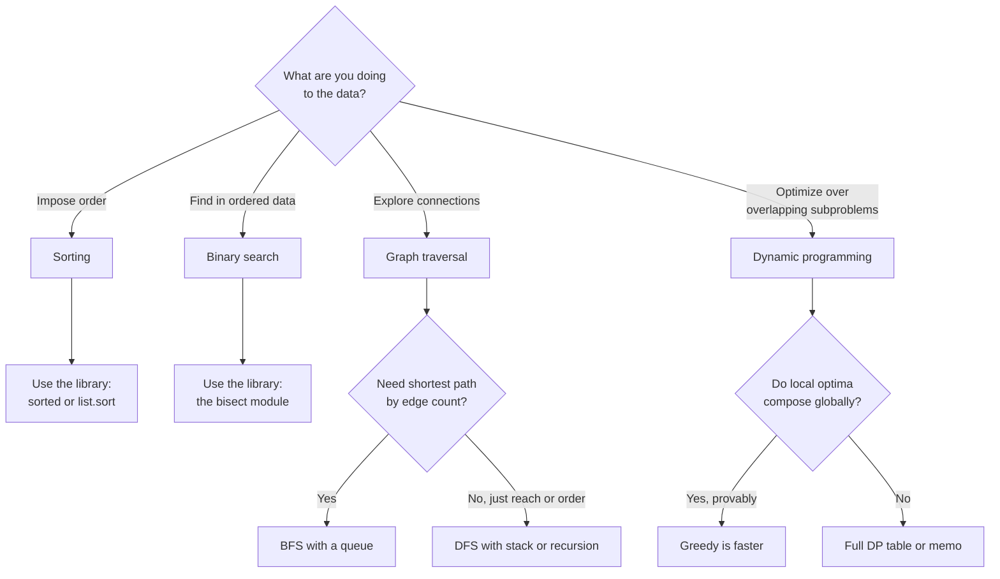
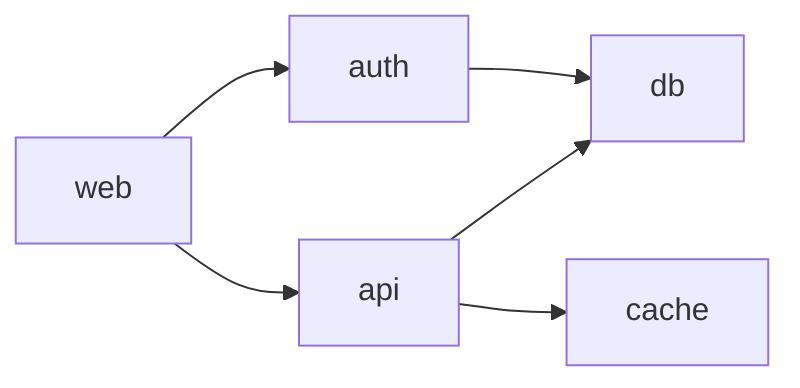

# Algorithms in working code

## Why this matters

It's a Tuesday afternoon and a teammate's "small optimization" has taken down search. The endpoint that finds the right pricing tier for an account now returns the wrong tier on a small fraction of lookups — rare enough to pass code review, common enough that finance noticed the revenue drift. You pull up the diff. Someone replaced a library call with a hand-rolled binary search over the sorted tier boundaries, and the loop says `while lo < hi` in one place and `lo <= hi` in another, with a `mid = (lo + hi) / 2` that lands on the wrong side of the boundary when the target equals a tier edge. It is the single most famous off-by-one in computing, and it shipped because the author "knew binary search."

Here's the thing: they didn't need to write binary search at all. The list of tiers was a few hundred entries. `bisect.bisect_right` from the standard library would have been correct, faster to write, and impossible to get wrong. The bug existed only because someone reached for an algorithm they half-remembered instead of the one the language already ships, correct and tested, in its standard library.

That's the spine of this chapter. Knowing algorithms in 2026 is mostly knowing two things: which ones the platform already implements correctly so you never write them yourself (sorting, almost always), and which ones you genuinely have to assemble by hand from primitives (graph traversal, dynamic programming) — and how to do that without the classic traps. We'll do all of it in Python, with code you could paste into a service, not contest puzzles.

## Mental model

Algorithms split into a few families by what they're doing to your data. You sort to impose order so later lookups go from linear to logarithmic. You search to find a position in ordered data. You traverse graphs to answer reachability and shortest-path questions. And when a problem has overlapping subproblems with optimal substructure, you use dynamic programming to avoid recomputing the same answer exponentially many times. Greedy is the cheaper cousin of DP that only works when local choices are provably globally optimal.

The decision that matters most in practice is "do I write this, or does the platform?" The answer is almost always: don't write sorting or searching; do assemble traversal and DP, because those encode your problem's structure and no library can do that for you.



Two cost facts anchor the rest. Comparison sorting cannot beat O(n log n) in the worst case — that's an information-theoretic lower bound, not a missing optimization. And binary search turns an O(n) scan into O(log n), but only over data that is already sorted, which is why sorting and searching travel together.

## In practice

### Sorting: you rarely write your own

Python's `sort` is Timsort, a hybrid of merge sort and insertion sort designed by Tim Peters for CPython. It's stable (equal elements keep their input order), adaptive (it exploits existing runs of ordered data, approaching linear time on nearly-sorted input), and worst-case O(n log n). You will not beat it with a hand-rolled quicksort, and you'll almost certainly introduce bugs trying.

The skill worth having is sorting by the right key, stably, with controlled tie-breaks:

```python
from dataclasses import dataclass

@dataclass
class Order:
    customer: str
    priority: int   # 1 = highest
    created_at: float

orders = [
    Order("acme", 2, 1718300000.0),
    Order("globex", 1, 1718300500.0),
    Order("acme", 1, 1718300100.0),
    Order("globex", 2, 1718299000.0),
]

# Sort by priority ascending, then oldest-first within a priority.
orders.sort(key=lambda o: (o.priority, o.created_at))

for o in orders:
    print(o.customer, o.priority, o.created_at)
```

```text
acme 1 1718300100.0
globex 1 1718300500.0
globex 2 1718299000.0
acme 2 1718300000.0
```

A tuple key sorts lexicographically, so `(1, 1718300100.0)` comes before `(1, 1718300500.0)`: oldest-first means the *smaller* timestamp wins, so for priority 1 you get acme (older) before globex (newer), and for priority 2 you get globex (oldest) before acme. Read the key out loud as a tuple and the order is no longer a surprise. Here's the same sort with an assertion that pins the expectation:

```python
orders.sort(key=lambda o: (o.priority, o.created_at))
result = [(o.customer, o.priority) for o in orders]
assert result == [("acme", 1), ("globex", 1), ("globex", 2), ("acme", 2)]
```

The rule: build the key as a tuple in the exact priority order you want, and remember that tuples compare left-to-right, ascending. To reverse one field while keeping another ascending, negate a numeric field (`key=lambda o: (o.priority, -o.created_at)`) rather than passing `reverse=True`, which flips everything.

When you sort by an expensive-to-compute key, `key=` is computed once per element (the decorate-sort-undecorate pattern, built in). Don't pass a `cmp`-style comparator; Python removed it in the 3.x transition for exactly this reason, and `functools.cmp_to_key` is a last resort for genuinely non-tuple-expressible orderings.

### Binary search: the library, and the off-by-ones it saves you from

The `bisect` module is the correct binary search you should reach for first. `bisect_left` returns the leftmost insertion point; `bisect_right` returns the rightmost. The difference is the entire game when duplicates or boundaries are involved.

```python
import bisect

# Tier boundaries: spend >= boundary[i] qualifies for tier i.
boundaries = [0, 100, 500, 2000, 10000]
names = ["free", "starter", "growth", "scale", "enterprise"]

def tier_for(spend: int) -> str:
    # rightmost index whose boundary is <= spend
    i = bisect.bisect_right(boundaries, spend) - 1
    return names[i]

assert tier_for(0) == "free"
assert tier_for(99) == "free"
assert tier_for(100) == "starter"     # exact boundary -> next tier up
assert tier_for(1999) == "growth"
assert tier_for(2000) == "scale"
assert tier_for(50000) == "enterprise"
```

That `bisect_right(...) - 1` is the whole correct implementation of the broken endpoint from the opening. No `lo`, no `hi`, no `mid`, no place to put the off-by-one.

You should still understand the manual version, because in interviews and in the occasional case where `bisect` doesn't fit (searching a rotated array, a 2D matrix, or an implicit predicate) you need to write it. Here it is with the invariants stated, which is how you avoid the traps:

```python
def lower_bound(a: list[int], target: int) -> int:
    """Leftmost index i where a[i] >= target. Returns len(a) if none."""
    lo, hi = 0, len(a)          # half-open: [lo, hi), hi is len(a) not len-1
    while lo < hi:              # strict <, because hi is exclusive
        mid = lo + (hi - lo) // 2   # avoids overflow in fixed-width langs; safe habit
        if a[mid] < target:
            lo = mid + 1        # mid known too small -> exclude it
        else:
            hi = mid            # mid might be the answer -> keep it in range
    return lo

a = [1, 3, 3, 3, 5, 7]
assert lower_bound(a, 3) == 1    # leftmost 3
assert lower_bound(a, 4) == 4    # insertion point between 3 and 5
assert lower_bound(a, 8) == 6    # past the end
```

Three trap-avoidance rules, learned the expensive way:

- **Pick one interval convention and never mix.** Half-open `[lo, hi)` with `hi = len(a)` and `while lo < hi` is the most robust. If you use closed `[lo, hi]` with `hi = len(a) - 1`, you must use `while lo <= hi` and `hi = mid - 1`. Mixing the two is the canonical bug.
- **Each branch must shrink the interval.** If neither `lo` nor `hi` moves on some path, you loop forever. `lo = mid + 1` and `hi = mid` both make progress; `lo = mid` does not, and is the infinite-loop trap.
- **`mid = lo + (hi - lo) // 2`, not `(lo + hi) // 2`.** Python ints don't overflow, but the habit is free insurance and it's the overflow bug Joshua Bloch documented in the JDK's `Arrays.binarySearch` (see Further reading).

### BFS and DFS on graphs

Most real graph problems aren't "find shortest path in a weighted network" — they're "what depends on what," "is there a cycle," "what's reachable from here." Represent the graph as an adjacency map and pick your traversal by the question.

BFS visits in order of distance (edge count) from the source, so it answers "fewest hops" correctly. Use an explicit queue:

```python
from collections import deque

def shortest_hops(graph: dict[str, list[str]], start: str, goal: str) -> int | None:
    """Fewest edges from start to goal, or None if unreachable."""
    if start == goal:
        return 0
    seen = {start}
    queue = deque([(start, 0)])
    while queue:
        node, dist = queue.popleft()
        for nbr in graph.get(node, ()):
            if nbr not in seen:
                if nbr == goal:
                    return dist + 1
                seen.add(nbr)
                queue.append((nbr, dist + 1))
    return None

deps = {
    "web": ["api", "auth"],
    "api": ["db", "cache"],
    "auth": ["db"],
    "cache": [],
    "db": [],
}
assert shortest_hops(deps, "web", "db") == 2
assert shortest_hops(deps, "web", "web") == 0
assert shortest_hops(deps, "cache", "db") is None
```

The critical detail: mark a node as `seen` when you *enqueue* it, not when you dequeue it. Marking on dequeue lets the same node enter the queue multiple times before it's processed, which in a dense graph blows up memory and can double-count.

DFS goes deep before wide. It's the tool for cycle detection and topological ordering — exactly the "can these services start in a valid order" question. Recursion is the natural expression, but on deep graphs Python's default recursion limit (around 1000 frames) will bite, so know the iterative form too.

```python
def topo_sort(graph: dict[str, list[str]]) -> list[str]:
    """Return nodes so every node comes before its dependents.
    Raises ValueError on a cycle."""
    WHITE, GRAY, BLACK = 0, 1, 2   # unseen, on-stack, done
    color = {n: WHITE for n in graph}
    order: list[str] = []

    def visit(n: str) -> None:
        color[n] = GRAY
        for nbr in graph.get(n, ()):
            if color.get(nbr, WHITE) == GRAY:
                raise ValueError(f"cycle through {nbr}")
            if color.get(nbr, WHITE) == WHITE:
                visit(nbr)
        color[n] = BLACK
        order.append(n)

    for n in graph:
        if color[n] == WHITE:
            visit(n)
    return order[::-1]   # reverse post-order = topological order


def is_valid_topo(graph: dict[str, list[str]], order: list[str]) -> bool:
    """Every edge u -> v must have u appear before v in the order."""
    pos = {n: i for i, n in enumerate(order)}
    return all(pos[u] < pos[v] for u, nbrs in graph.items() for v in nbrs)

# The order is valid but not unique, so assert the invariant, not one fixed list.
assert is_valid_topo(deps, topo_sort(deps))
```

The three-color scheme is what makes cycle detection correct: a back-edge to a GRAY (on the current recursion stack) node is a cycle; an edge to a BLACK (already fully processed) node is fine. A two-state "visited/not" set cannot tell those apart, which is the most common topological-sort bug.



> **Security note:** Traversal over untrusted graph data is a denial-of-service surface. A maliciously deep dependency chain crashes a recursive DFS via stack overflow; a maliciously wide or cyclic graph exhausts memory in BFS if you forget to mark-on-enqueue. For any traversal over user-supplied structure (uploaded build manifests, GraphQL query shapes, nested JSON), use the iterative form with an explicit stack and cap both depth and total node count. The same discipline shows up in the parsing and networking chapters in Parts 1 and 5.

### Dynamic programming through one real problem

Forget knapsack puzzles. Here's a problem you actually hit: computing the edit distance (Levenshtein) between two strings, which powers fuzzy search, spell-check, "did you mean," and diffing. The recursive definition is clean but exponential because subproblems overlap massively; DP makes it O(m × n).

```python
def edit_distance(a: str, b: str) -> int:
    """Minimum single-character insertions, deletions, or substitutions
    to turn a into b."""
    m, n = len(a), len(b)
    # dp[i][j] = distance between a[:i] and b[:j]
    prev = list(range(n + 1))        # transforming "" into b[:j] costs j inserts
    for i in range(1, m + 1):
        curr = [i] + [0] * n         # transforming a[:i] into "" costs i deletes
        for j in range(1, n + 1):
            cost = 0 if a[i - 1] == b[j - 1] else 1
            curr[j] = min(
                prev[j] + 1,         # delete a[i-1]
                curr[j - 1] + 1,     # insert b[j-1]
                prev[j - 1] + cost,  # match or substitute
            )
        prev = curr                  # only the previous row is needed -> O(n) space
    return prev[n]

assert edit_distance("kitten", "sitting") == 3
assert edit_distance("flaw", "lawn") == 2
assert edit_distance("", "abc") == 3
assert edit_distance("same", "same") == 0
```

The two moves that turn DP from intimidating to mechanical: first, write the recurrence (distance of prefixes depends on three smaller prefix distances), then notice each subproblem `(i, j)` is asked for many times — that's the "overlapping subproblems" signal that DP applies. Second, observe the dependency pattern: row `i` needs only row `i-1`, so you keep two rows instead of the full m × n table, dropping space from O(mn) to O(n). That space optimization is the difference between an algorithm that fits in cache and one that thrashes on long strings.

### Greedy vs DP: when the cheap thing is correct

Greedy makes the locally best choice and never reconsiders. It's faster and simpler than DP, but it's only correct when local optimality provably implies global optimality. Coin change is the classic cautionary tale.

```python
def greedy_coins(amount: int, coins: list[int]) -> int:
    """Fewest coins via greedy largest-first. CORRECT ONLY for canonical systems."""
    count = 0
    for c in sorted(coins, reverse=True):
        count += amount // c
        amount %= c
    return count if amount == 0 else -1

def dp_coins(amount: int, coins: list[int]) -> int:
    """Fewest coins, always correct. O(amount * len(coins))."""
    INF = float("inf")
    best = [0] + [INF] * amount
    for a in range(1, amount + 1):
        for c in coins:
            if c <= a and best[a - c] + 1 < best[a]:
                best[a] = best[a - c] + 1
    return best[amount] if best[amount] != INF else -1

# US/euro coins are "canonical": greedy is provably optimal.
assert greedy_coins(63, [1, 5, 10, 25]) == 6   # 25+25+10+1+1+1
assert dp_coins(63, [1, 5, 10, 25]) == 6

# Non-canonical system breaks greedy.
assert greedy_coins(6, [1, 3, 4]) == 3   # 4+1+1, WRONG
assert dp_coins(6, [1, 3, 4]) == 2       # 3+3, optimal
```

Greedy gives 4+1+1 (three coins) for 6 with denominations {1,3,4}; the optimum is 3+3 (two coins). Greedy can't see it because committing to the 4 forecloses the better path. The lesson generalizes: reach for greedy only when you can *prove* the exchange argument (swapping any optimal solution toward the greedy choice never makes it worse). When you can't prove it, use DP and pay the polynomial cost for a guaranteed-correct answer. Interval scheduling (earliest-finish-first) and Huffman coding are greedy-provable; coin change in general and knapsack are not.

> **Connect the dots:** The Big-O claims here — the O(n log n) sort lower bound, O(log n) search, O(mn) edit distance — are stated, not derived. The complexity-analysis chapter later in this Part shows how to prove them and, more usefully, how to measure whether the asymptotics even matter at your input sizes. For a few hundred tier boundaries, a linear scan is fine; the binary search matters at a million.

## Pitfalls and anti-patterns

**1. Rolling your own sort or search "for performance."** Hand-written quicksort loses to Timsort on real data (which is often partially ordered), and hand-written binary search is the single most bug-prone snippet in the canon. Recognize it in review: any `while lo <= hi` loop or partition function is a smell. Fix: delete it and call `sorted`, `list.sort`, or `bisect`. Reserve hand-rolled search for genuinely non-standard predicates (rotated arrays, search-on-answer).

**2. Mark-on-dequeue in BFS.** Symptom: memory grows faster than the graph size, or nodes get processed twice, or distances come out wrong on graphs with multiple paths to a node. Recognize it: the `seen.add(node)` sits after `popleft()` instead of before `append()`. Fix: mark a node seen at the moment you enqueue it, so it can never be enqueued twice.

**3. Two-state visited tracking for cycle detection.** Symptom: topological sort silently returns an order even when a cycle exists, or reports false cycles. A plain visited set can't distinguish "on the current path" from "already finished." Fix: use the three-color (WHITE/GRAY/BLACK) scheme; a back-edge to GRAY is a real cycle, an edge to BLACK is benign.

**4. Recursion-depth blowup on real graphs.** Symptom: `RecursionError` on production data that worked on small test fixtures. Python caps recursion near 1000 frames by default. Fix: convert deep DFS to an explicit stack, or for known-bounded depth raise the limit deliberately with `sys.setrecursionlimit` and a comment explaining the bound. Never raise the limit blindly to silence the error.

**5. Assuming greedy is correct because it works on your examples.** Symptom: an optimizer that's right in testing and subtly suboptimal in production on inputs you didn't try (the {1,3,4} coin case). Fix: either prove the greedy exchange argument or use DP. If you can't articulate why local choices compose globally, you don't have a greedy problem — you have a DP problem you got lucky on.

## Production checklist

- [ ] Default to `sorted`/`list.sort` with an explicit tuple `key`; reach for a custom comparator only via `functools.cmp_to_key` and only when the order isn't tuple-expressible
- [ ] Use `bisect` for any search over sorted data before writing a manual loop; document whether you need `bisect_left` or `bisect_right`
- [ ] If you must hand-write binary search, fix one interval convention (half-open `[lo, hi)`) and assert the empty-list, single-element, and not-found cases
- [ ] BFS marks nodes seen on enqueue, not dequeue; verified on a diamond-shaped graph with two paths to one node
- [ ] DFS/cycle detection uses three-color marking; topological sort raises (not returns) on a cycle
- [ ] Any traversal over untrusted input is iterative with explicit depth and node-count caps
- [ ] DP solutions state the recurrence in a comment and drop to rolling-array space when only the previous row/layer is needed
- [ ] Greedy solutions carry a one-line justification of why local optima compose; if absent, switch to DP
- [ ] Every algorithm has a test for the boundary inputs: empty, single element, all-equal, and the value exactly on a boundary

## Exercises

1. **(Comprehension)** Given `a = [2, 2, 2, 5, 5, 8]`, predict the return values of `bisect.bisect_left(a, 5)`, `bisect.bisect_right(a, 5)`, and `bisect.bisect_left(a, 6)` before running them. Then explain in one sentence why the difference between left and right is exactly the count of elements equal to the target.

2. **(Applied)** Take the `topo_sort` above and add a function `start_order(graph)` that returns a valid startup order for a set of services, raising a clear error naming the cycle if one exists. Feed it a graph with a deliberate cycle (`a -> b -> c -> a`) and confirm the error names a node on the cycle. Then convert the recursive `visit` to an iterative version using an explicit stack and verify both produce a valid (not necessarily identical) order on a 10,000-node chain that would overflow recursion.

3. **(Design)** You're building "did you mean" for a search box over a 2-million-term product catalog. Naively computing edit distance from the query to every term is O(terms × query × term-length) per keystroke — far too slow for interactive typing. Sketch a design that keeps suggestions responsive: consider a BK-tree or trie with bounded edit distance, an n-gram prefilter to shrink the candidate set before computing exact distances, and where you'd cache. State which structure you'd build first and the tradeoff you're accepting.

## Further reading

- Tim Peters, ["listsort.txt"](https://github.com/python/cpython/blob/main/Objects/listsort.txt) — the original description of Timsort's design and invariants, in CPython's own source
- Joshua Bloch, ["Extra, Extra — Read All About It: Nearly All Binary Searches and Mergesorts Are Broken"](https://research.google/blog/extra-extra-read-all-about-it-nearly-all-binary-searches-and-mergesorts-are-broken/) — the account of the overflow bug that sat undetected in the JDK for roughly nine years
- *Introduction to Algorithms* (CLRS), Cormen, Leiserson, Rivest, Stein — chapters on graph traversal (BFS/DFS, the three-color scheme), dynamic programming, and greedy algorithms with proofs of correctness
- Python docs, [`bisect`](https://docs.python.org/3/library/bisect.html) and [`heapq`](https://docs.python.org/3/library/heapq.html) — the standard-library searching and priority-queue primitives, with usage notes
- Jeff Erickson, [*Algorithms*](https://jeffe.cs.illinois.edu/teaching/algorithms/) — free, rigorous, and unusually clear on how to recognize when a problem is greedy-solvable versus genuinely requiring DP
