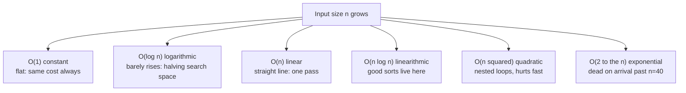

# Complexity analysis without hand-waving

## Why this matters

It's a Tuesday afternoon and a feature that worked fine in the demo is timing out in production. The endpoint takes a list of user IDs and returns which ones are in a "blocked" set. In the demo the list had 12 IDs and the blocked set had 30. In production the list has 8,000 IDs and the blocked set has 200,000. The code looks innocent: for each ID, check whether it's in the blocked list with a linear scan. That's a nested loop nobody noticed, because at demo scale `12 × 30 = 360` comparisons finish before you can blink. At production scale it's `8000 × 200000 = 1.6 billion` comparisons per request, and your p99 latency just walked off a cliff.

The fix is one line: put the blocked IDs in a hash set first, then each membership check is O(1) instead of O(n). The endpoint drops from 1.6 billion operations to roughly 208,000 — 200,000 to build the set once, plus 8,000 to probe it. That's the entire bug. It wasn't a slow database, a missing index, or a GC pause. It was an O(n²) algorithm hiding behind small test data.

This is the gap complexity analysis closes. Big O is not an interview ritual you forget after you're hired. It's the tool that lets you look at a loop and predict, before you ship, whether it will survive contact with real data. But Big O alone is a blunt instrument: two algorithms with identical Big O can differ by 10x in wall-clock time because of constant factors and cache behavior. The engineers who only memorized the notation get blindsided by exactly those cases. This chapter is about using complexity analysis precisely — knowing what it tells you, what it hides, and when to stop calculating and start measuring.

## Mental model

Big O describes how the cost of an algorithm grows as the input grows, ignoring constant factors and lower-order terms. It's a statement about the *shape* of the curve, not its exact height. O(n) means "double the input, roughly double the work." O(n²) means "double the input, quadruple the work." O(log n) means "double the input, add one step."

The reason we drop constants is that they don't change the shape. `3n + 50` and `n` are both O(n): for large enough n, the linear term dominates and a faster-growing function always overtakes a slower-growing one regardless of constants. This is the formal definition: `f(n)` is `O(g(n))` if there exist constants `c` and `n₀` such that `f(n) ≤ c·g(n)` for all `n ≥ n₀`.

Here's how the common growth classes diverge as input grows:



Three refinements separate people who *say* Big O from people who *use* it.

**Worst vs. average vs. best case.** Big O usually refers to the worst case, but the average case is often what you live with. Quicksort is O(n²) worst case (already-sorted input with a naive pivot) but O(n log n) average case, and in practice it beats mergesort because of its constant factors. Hash map lookup is O(1) average but O(n) worst case when every key collides into one bucket. Knowing both tells you what to defend against.

**Amortized analysis.** Some operations are usually cheap but occasionally expensive, and amortized analysis asks for the *average cost per operation across a long sequence*, not the worst single operation. The canonical example is the dynamic array (Go's slice, Python's list, C++'s `vector`). Appending is O(1) most of the time, but when the backing array fills, it allocates a bigger one and copies everything — an O(n) operation. Because the array doubles in size, those expensive copies happen rarely enough that the *amortized* cost per append is still O(1). We'll prove this below.

**Space complexity.** The same growth analysis applies to memory. An algorithm that builds a hash set of all inputs is O(n) space; one that scans in place is O(1) space. Space and time often trade against each other — the blocked-set fix from the opening spent O(n) extra memory to buy a huge time win.

> **Connect the dots:** The cache behavior that makes two same-Big-O algorithms differ by 10x comes straight from the memory hierarchy covered in Part 1's operating systems chapter. Big O counts operations; it has no idea that a sequential array read is far faster than a pointer chase that misses L1, L2, and L3 cache and hits main memory.

## In practice

### Proving amortized O(1) for dynamic array append

When a Python list or Go slice runs out of capacity, it allocates a larger backing array (commonly 2x, sometimes a smaller factor for large sizes) and copies the existing elements. Let's count the total work for `n` appends starting from capacity 1, doubling each time.

The expensive copies happen at sizes 1, 2, 4, 8, …, up to n. The total number of elements copied across all resizes is:

```text
1 + 2 + 4 + 8 + ... + n  =  2n - 1  <  2n
```

So `n` appends cost at most `n` cheap writes plus fewer than `2n` copies — under `3n` operations total. Divide by `n` appends and you get less than 3 operations per append on average. That's the amortized O(1) result: the rare O(n) copy is paid for by the many O(1) appends that preceded it. The doubling is essential. If the array grew by a *fixed* amount (say +1 each time), you'd copy `1 + 2 + 3 + ... + n = n(n+1)/2` elements total, which is O(n²) for n appends, or O(n) amortized per append. Growth factor is what makes the difference between a list that scales and one that doesn't.

You can watch Python's growth empirically. The trick is to call `.append()` in a real loop and measure the live list, because `[0] * n` would allocate an exactly-sized array and hide the over-allocation:

```python
import sys

lst = []
prev = -1
for n in range(100):
    size = sys.getsizeof(lst)
    if size != prev:
        print(f"len={n:3d}  bytes={size}")
        prev = size
    lst.append(0)
```

*In TypeScript:*

```typescript
import v8 from "node:v8";

// V8 doesn't expose an array's backing capacity the way CPython's
// sys.getsizeof reveals a list's over-allocation. v8.serialize gives us a
// stable per-call byte size of the live array's contents so we can still
// watch the size change as we push.
const lst: number[] = [];
let prev = -1;
for (let n = 0; n < 100; n++) {
  const size = v8.serialize(lst).length;
  if (size !== prev) {
    console.log(`len=${String(n).padStart(3)}  bytes=${size}`);
    prev = size;
  }
  lst.push(0);
}
```

The byte count jumps in chunks, not on every append — each jump is a reallocation to a larger backing array. The jumps get further apart as the list grows, which is the doubling-style growth that keeps amortized append at O(1). Between jumps, appends are pure O(1) writes into spare capacity.

### Hash maps: O(1) average, and what breaks it

A hash map gives O(1) average lookup, insert, and delete by hashing the key to a bucket index. The "average" qualifier matters. The guarantees hold only when (a) the hash function distributes keys evenly and (b) the load factor (entries ÷ buckets) stays bounded, which the map maintains by resizing and rehashing — itself an amortized O(n) operation, just like the dynamic array.

The worst case is O(n): if every key hashes to the same bucket, lookups degrade to a linear scan of one long chain. This isn't theoretical. It's the basis of **hash-flooding denial-of-service attacks**, where an attacker sends crafted keys (e.g., HTTP form fields or JSON keys) that all collide, turning your O(1) map into an O(n) one and your O(n) request handler into O(n²).

> **Security note:** Hash flooding — popularized by Klink and Wälde's 2011 "Efficient Denial of Service Attacks on Web Application Platforms" work at 28C3 — is why modern languages randomize their hash seeds per process. Go's map and Python's `str`/`bytes` hashing both use a random seed (Python's is controlled by `PYTHONHASHSEED` and enabled by default since 3.3) so an attacker can't predict which keys collide. If you implement your own hash table or use a non-randomized hash for untrusted input, you reintroduce the vulnerability. For untrusted keys, use the language's built-in map, not a hand-rolled one with a fixed hash.

### Two algorithms, same Big O, very different speed

This is the part that hand-waving misses. Consider summing a 2D matrix in Go. Both versions visit every element exactly once, so both are O(n²) for an n×n matrix — identical Big O. But one is dramatically faster because of cache behavior.

```go
package main

import (
	"fmt"
	"time"
)

const N = 8192

func main() {
	m := make([][]int, N)
	for i := range m {
		m[i] = make([]int, N)
	}

	// Row-major: inner loop walks contiguous memory.
	start := time.Now()
	sum := 0
	for i := 0; i < N; i++ {
		for j := 0; j < N; j++ {
			sum += m[i][j]
		}
	}
	fmt.Printf("row-major:    %v (sum=%d)\n", time.Since(start), sum)

	// Column-major: inner loop jumps N ints between each access.
	start = time.Now()
	sum = 0
	for j := 0; j < N; j++ {
		for i := 0; i < N; i++ {
			sum += m[i][j]
		}
	}
	fmt.Printf("column-major: %v (sum=%d)\n", time.Since(start), sum)
}
```

*The TypeScript equivalent:*

```typescript
const N = 8192;

// A row of Int32Array is contiguous; the array-of-rows mirrors Go's [][]int.
const m: Int32Array[] = [];
for (let i = 0; i < N; i++) {
  m[i] = new Int32Array(N);
}

// Row-major: inner loop walks contiguous memory.
let start = process.hrtime.bigint();
let sum = 0;
for (let i = 0; i < N; i++) {
  for (let j = 0; j < N; j++) {
    sum += m[i][j];
  }
}
let elapsed = Number(process.hrtime.bigint() - start) / 1e6;
console.log(`row-major:    ${elapsed}ms (sum=${sum})`);

// Column-major: inner loop jumps N ints between each access.
start = process.hrtime.bigint();
sum = 0;
for (let j = 0; j < N; j++) {
  for (let i = 0; i < N; i++) {
    sum += m[i][j];
  }
}
elapsed = Number(process.hrtime.bigint() - start) / 1e6;
console.log(`column-major: ${elapsed}ms (sum=${sum})`);
```

Both loops perform exactly N² additions. The only difference is the order of access. The row-major version reads memory sequentially: when the CPU loads `m[i][0]`, it pulls a whole cache line (typically 64 bytes, eight int64s) into L1, and the next seven accesses are free. The column-major version jumps N elements between each read, so almost every access misses the cache and stalls waiting on main memory.

On a typical machine the row-major version runs several times faster. Big O cannot see this difference; both are O(n²). The constant factor, driven entirely by the memory hierarchy, is the whole story. This is why "we'll just optimize the Big O" is sometimes the wrong move: when both candidates are O(n), the cache-friendly one wins, and that's something you measure, not derive.

A second flavor of the same lesson: for small n, a "worse" Big O often wins. Binary search is O(log n); linear search is O(n). But on a small, contiguous array (say 16 elements), linear search is frequently *faster* because it's branch-predictor-friendly and cache-friendly, while binary search jumps around and mispredicts branches. This is exactly why production sort implementations (Go's `sort`, Python's Timsort, C++ `std::sort`) switch to insertion sort — an O(n²) algorithm — for small subarrays. The asymptotically worse algorithm has smaller constants in the regime that matters.

### "Fast enough" is a measurement

The conclusion is not "ignore Big O." Big O tells you which algorithms will fall off a cliff at scale — and that you must get right by analysis, because you can't always test at production scale. But once two candidates are in the same complexity class, the choice between them is empirical. Benchmark with realistic input sizes and realistic data.

```go
func BenchmarkRowMajor(b *testing.B) {
	m := makeMatrix(N)
	b.ResetTimer()
	for n := 0; n < b.N; n++ {
		sumRowMajor(m)
	}
}
```

*The same idea in TypeScript:*

```typescript
import { performance } from "node:perf_hooks";

function benchmarkRowMajor(iterations: number): void {
  const m = makeMatrix(N);
  const start = performance.now(); // analogous to b.ResetTimer()
  for (let n = 0; n < iterations; n++) {
    sumRowMajor(m);
  }
  const nsPerOp = ((performance.now() - start) * 1e6) / iterations;
  console.log(`rowMajor: ${nsPerOp.toFixed(0)} ns/op`);
}
```

Run it with `go test -bench=. -benchmem`. The `-benchmem` flag reports allocations, which is your space complexity made concrete. Measure; don't guess.

## Pitfalls and anti-patterns

**1. The hidden quadratic.** A loop that calls an O(n) operation inside is O(n²), and the inner operation is often invisible. `if x in my_list` is O(n) in Python; doing it inside a loop over n items is the opening-scenario bug. Building a string with `result += chunk` in a loop is O(n²) in many languages because each `+=` copies the whole accumulated string. *Recognize it:* nested iteration, or a "simple" operation (`in`, slice copy, `.index()`, repeated string concat) inside a loop. *Fix it:* hoist set/dict construction out of the loop; use `"".join(parts)` or a `strings.Builder`; ask "what is the cost of this one line, really?"

**2. Big-O theater on tiny n.** Replacing a 10-element linear scan with a balanced tree or hash map because "O(log n) / O(1) beats O(n)" adds allocation, indirection, and cache misses that make the code *slower* and harder to read. *Recognize it:* micro-optimizing data structures for collections that are small and bounded. *Fix it:* know your n. If it's small and capped, the simple contiguous array usually wins. Optimize the Big O only where n is genuinely large or unbounded.

**3. Forgetting the amortized cost is amortized.** Amortized O(1) append means cheap *on average over many appends*, not cheap *every time*. In a latency-sensitive hot path (a real-time loop, an audio callback), the occasional O(n) resize causes a latency spike. *Recognize it:* tail-latency spikes that correlate with collection growth. *Fix it:* preallocate with the known final size (`make([]T, 0, n)` in Go, a list comprehension or `[None] * n` in Python), so no resize happens mid-loop.

**4. Confusing average case with worst case on adversarial input.** Trusting hash map O(1) or quicksort O(n log n) when the input comes from an untrusted source. *Recognize it:* user-controlled keys feeding a map, or user-controlled data feeding a sort with a predictable pivot. *Fix it:* use randomized-seed maps (the language default) and introspective sorts (which fall back to heapsort to guarantee O(n log n)). Both are the standard library defaults precisely for this reason.

**5. Counting operations while ignoring memory layout.** Concluding two algorithms are equivalent because they're both O(n), without accounting for cache locality. A linked list traversal and an array traversal are both O(n), but the array can be far faster because it's contiguous. *Recognize it:* pointer-heavy structures (linked lists, trees of small nodes, maps of pointers) in a performance-critical scan. *Fix it:* prefer contiguous storage (arrays, slices, struct-of-arrays) for data you iterate hot; measure with a cache profiler if it matters.

## Production checklist

- [ ] For every loop in a hot path, state its time complexity out loud — including the cost of any function called inside it
- [ ] No O(n) membership test (`in list`, linear `.find`) inside a loop over n items; convert to a set/map built once outside the loop
- [ ] String building in loops uses `strings.Builder` / `"".join()` / a buffer, never repeated `+=`
- [ ] Slices and lists with a known final size are preallocated (`make([]T, 0, n)`) to avoid mid-loop reallocation
- [ ] Maps and sorts that touch untrusted input rely on the language's randomized-seed map and introsort default, not a hand-rolled fixed hash
- [ ] "Fast enough" claims are backed by a benchmark at realistic input size, not by eyeballing the Big O
- [ ] Benchmarks report memory (`-benchmem` or equivalent) so space complexity is visible
- [ ] Hot-path data that gets scanned linearly is stored contiguously, not as a graph of pointers
- [ ] Worst-case complexity is documented for anything exposed to adversarial or unbounded input

## Exercises

1. **(Comprehension)** Without running it, give the worst-case and average-case time complexity of: (a) checking membership in a Python `set`, (b) checking membership in a Python `list`, (c) appending to a list, (d) inserting at index 0 of a list. For each, explain in one sentence what drives the worst case. Then explain why the dynamic array's amortized append cost stays O(1) even though individual appends can be O(n).

2. **(Applied)** Take the opening scenario's bug: an endpoint that, for each of n incoming IDs, scans a blocked list of m entries. Write both the O(n·m) version and the O(n+m) hash-set version in your language of choice, then benchmark both at n=8000, m=200000 with random data. Report the speedup. Then add timing for the hash-set *construction* alone and explain at what input size the construction cost stops mattering relative to the lookups.

3. **(Design)** You're designing an in-memory index for autocomplete: given a prefix, return up to 10 matching strings from a corpus of 5 million entries, p99 under 5ms. Two candidates are a sorted array with binary search (O(log n) to find the prefix range) and a trie (O(prefix length) per query). Both are "fast enough" by Big O. Argue which you'd ship, accounting for memory footprint, cache behavior, build time, and how each handles updates. State what you'd measure to confirm your choice before committing to it.

## Further reading

- Cormen, Leiserson, Rivest, Stein, *Introduction to Algorithms* (CLRS), 4th ed. — Chapter 3 (asymptotic notation) and Chapter 16 (amortized analysis, including the dynamic-table doubling proof) are the canonical treatment.
- Jon Bentley, *Programming Pearls*, 2nd ed. — Column 8 on algorithm design and the gap between asymptotic and real performance; still the best short read on the topic.
- Ulrich Drepper, ["What Every Programmer Should Know About Memory"](https://www.akkadia.org/drepper/cpumemory.pdf) — the definitive explanation of why cache behavior dominates constant factors.
- Python documentation, [TimeComplexity wiki](https://wiki.python.org/moin/TimeComplexity) — the per-operation complexity table for built-in `list`, `dict`, and `set`.
- Klink and Wälde, ["Efficient Denial of Service Attacks on Web Application Platforms"](https://fahrplan.events.ccc.de/congress/2011/Fahrplan/events/4680.en.html) (28C3, 2011) — the hash-flooding talk that changed how every major language seeds its hash maps.
- The Go Blog, ["Slices: usage and internals"](https://go.dev/blog/slices-intro) — how Go's slice growth and the underlying array reallocation actually work.
