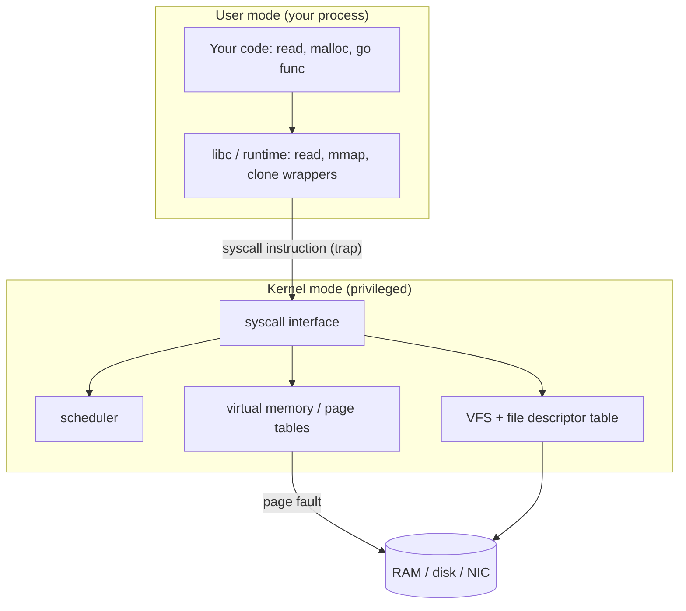

# The operating system from a programmer's seat

## Why this matters

It's a Tuesday afternoon. Your Go service that handles webhook deliveries has been fine for months, but today it falls over under a traffic spike. CPU sits at 30%, memory is nowhere near the limit, yet p99 latency has jumped from 40ms to 4 seconds and the pod keeps getting OOM-killed in a way that makes no sense given the heap graph. You add more replicas. It helps for ten minutes, then the same wall.

You finally `strace -f -p` the process and the truth is right there: tens of thousands of `clone()` calls. The code spawns a goroutine *and* a fresh OS thread per webhook because every handler makes a synchronous DNS lookup through cgo, and cgo calls block the OS thread, so the Go runtime keeps minting new threads to keep the scheduler fed. The "memory" that got you OOM-killed wasn't your heap. It was a couple of megabytes of stack per thread times thousands of threads. The latency wasn't your code. It was the kernel scheduler thrashing across more runnable threads than you have cores.

None of that is visible from the language runtime alone. It only makes sense one layer down, where processes, threads, the scheduler, virtual memory, and system calls actually live. The engineers who treat the OS as an opaque platform spend incidents guessing. The ones who can read a stack trace down through the syscall boundary, glance at `/proc`, and reach for `strace` or `perf` operate with the same casual confidence as someone who's read the inside of `.git/`. This chapter is that bridge for the operating system.

## Mental model

A **process** is an address space plus a set of resources the kernel tracks on your behalf: a page table mapping virtual addresses to physical frames, a file descriptor table, signal handlers, a process ID. A **thread** is a schedulable flow of execution *inside* a process. All threads in a process share the same address space and file descriptors; each has its own stack, registers, and program counter. That sharing is the whole tradeoff: threads are cheap to create and communicate through shared memory, but they can corrupt each other's data and there's no memory isolation between them.

Your code never touches hardware directly. It runs in **user mode**, a restricted CPU state where privileged instructions (talk to disk, map memory, send a packet) are forbidden. To do anything real, you make a **system call**, which traps into the **kernel** running in privileged mode. That boundary crossing is the single most important structural fact about the OS from a programmer's seat: everything interesting your program does — reading a file, opening a socket, allocating memory, creating a thread — is ultimately a syscall, and you can watch every one of them.



Two costs fall out of this picture, and both show up in real latency numbers. First, the **context switch**: when the scheduler moves the CPU from one thread to another, it saves registers, swaps the page table (on a cross-process switch), and the new thread arrives to cold caches and a flushed-or-tagged TLB. The raw switch is fast — on the order of a microsecond on commodity hardware — but the cache and TLB pollution that follows is often the larger, invisible cost. Second, **virtual memory**: every address your program uses is virtual, translated to physical RAM through the page table, cached in the TLB. When you touch a page that isn't resident, the CPU raises a **page fault** and the kernel either maps a zero page (minor fault) or pulls it from disk/swap (major fault). A major fault is roughly a disk I/O hiding inside what looks like a plain memory access.

> **Connect the dots:** The user/kernel boundary is the same shape as the syscall-vs-library distinction you'll meet again in Part 6 (Concurrency). A mutex that never contends stays in user space and costs nanoseconds; a contended one makes a `futex` syscall and pays the kernel-crossing tax. Same boundary, different layer.

## In practice

The fastest way to make the OS legible is to watch the syscalls a program makes. On Linux that's `strace`; on macOS, `dtruss`/Instruments; the concepts are identical.

### Watching the syscall boundary with strace

Here's a trivial Go program and what the kernel sees it do:

```go
package main

import "os"

func main() {
	f, _ := os.Open("/etc/hostname")
	buf := make([]byte, 64)
	n, _ := f.Read(buf)
	os.Stdout.Write(buf[:n])
	f.Close()
}
```

*The same idea in TypeScript:*

```typescript
import { openSync, readSync, closeSync } from "node:fs";

const fd = openSync("/etc/hostname", "r");
const buf = Buffer.alloc(64);
const n = readSync(fd, buf, 0, 64, null);
process.stdout.write(buf.subarray(0, n));
closeSync(fd);
```

```bash
$ strace -f -e trace=openat,read,write,close ./readhost
openat(AT_FDCWD, "/etc/hostname", O_RDONLY|O_CLOEXEC) = 3
read(3, "webhook-7d9c\n", 64)                = 13
write(1, "webhook-7d9c\n", 13)               = 13
close(3)                                     = 0
```

Read this line by line. `openat` returns `3` — the **file descriptor**, a small non-negative integer that indexes into your process's open-file table. (0, 1, 2 are stdin, stdout, stderr, which is why `write(1, ...)` is the print.) `read(3, ...)` asks the kernel to fill your buffer from fd 3 and returns the byte count actually read. `close(3)` releases the descriptor. Every file, socket, pipe, and event source your program touches is one of these integers. When a long-running service "leaks file descriptors" and eventually dies with `EMFILE: too many open files`, this table is what filled up.

### Seeing the cost of crossing the boundary

The syscall boundary is not free, and you can measure it. Compare reading a file one byte at a time versus in 64KB chunks:

```bash
$ strace -c -e trace=read ./read_1byte    bigfile  # unbuffered, 1 byte at a time
$ strace -c -e trace=read ./read_buffered bigfile  # 64KB buffer
```

The unbuffered version makes one `read` syscall per byte; the buffered version makes one per 64KB. The `-c` flag prints a summary table of syscall counts and time. The difference is large enough to dominate the run, and it is the entire reason buffered I/O (`bufio.Reader` in Go, `BufferedReader` in Java, stdio in C) exists: amortize the kernel crossing over many bytes. The lesson generalizes — if a profiler shows time dominated by a syscall you make in a tight loop, the fix is usually "make the same call less often with more data," not "make the call faster."

### Processes vs threads, concretely

On Linux, both `fork()` (new process) and thread creation go through the same underlying `clone()` syscall; what differs is which resources get shared. A process gets a copy of the address space (copy-on-write); a thread shares it. You can watch this directly:

```go
package main

import (
	"fmt"
	"runtime"
	"sync"
)

func main() {
	fmt.Println("GOMAXPROCS:", runtime.GOMAXPROCS(0))
	var wg sync.WaitGroup
	for i := 0; i < 4; i++ {
		wg.Add(1)
		go func(id int) {
			defer wg.Done()
			sum := 0
			for j := 0; j < 1e8; j++ {
				sum += j
			}
			fmt.Println("worker", id, "done")
		}(i)
	}
	wg.Wait()
}
```

*The TypeScript equivalent:*

```typescript
import {
  Worker,
  isMainThread,
  workerData,
} from "node:worker_threads";
import { availableParallelism } from "node:os";
import { fileURLToPath } from "node:url";

if (isMainThread) {
  console.log("GOMAXPROCS:", availableParallelism());
  const self = fileURLToPath(import.meta.url);
  const workers: Promise<void>[] = [];
  for (let i = 0; i < 4; i++) {
    workers.push(
      new Promise<void>((resolve, reject) => {
        const w = new Worker(self, { workerData: i });
        w.on("exit", () => resolve());
        w.on("error", reject);
      }),
    );
  }
  await Promise.all(workers);
} else {
  const id = workerData as number;
  let sum = 0;
  for (let j = 0; j < 1e8; j++) {
    sum += j;
  }
  console.log("worker", id, "done");
}
```

Goroutines are not OS threads. The Go runtime multiplexes many goroutines (M:N) onto a small pool of OS threads, one per CPU by default (`GOMAXPROCS`). Run this under `strace -f` and you'll see a handful of `clone()` calls at startup, not one per goroutine. That M:N design is exactly why the opening incident was surprising: a *blocking cgo call* pins an OS thread, so the runtime spawns a new one to keep the others running, and a per-goroutine blocking call quietly becomes a per-goroutine OS thread.

```bash
$ GODEBUG=schedtrace=1000 ./workers
SCHED 1003ms: gomaxprocs=8 idleprocs=0 threads=11 spinningthreads=0 runqueue=0 ...
```

`schedtrace` makes the Go scheduler print its state once per second: how many OS threads it's holding, how many are idle, how deep the run queue is. When `threads` climbs without bound, you have the thread-explosion bug, and the cause is almost always something blocking the OS thread — cgo, a blocking syscall the runtime can't make async, or `runtime.LockOSThread`.

### Reading virtual memory from /proc

Linux exposes every process's memory map as a file. This is the most useful thing most engineers have never looked at:

```bash
$ cat /proc/self/maps
561e... r-xp ...  /usr/bin/cat        # code, executable, not writable
561e... r--p ...  /usr/bin/cat        # read-only data
561e... rw-p ...  /usr/bin/cat        # writable data + BSS
7f3a... rw-p ...  [heap]
7f3a... r-xp ...  /lib/x86_64-linux-gnu/libc.so.6
7ffd... rw-p ...  [stack]
```

Each line is a contiguous virtual-memory region with permissions. Code is `r-xp` (read, execute, *not* writable — which is why you can't accidentally overwrite your own instructions). The heap and stack are `rw-p` but not executable, which is the W^X policy that stops a buffer overflow from running injected code. When a stack trace ends in `SIGSEGV`, the kernel raised it because you touched a virtual address with no valid mapping, or wrote to a read-only one. `/proc/<pid>/maps` tells you exactly which regions are legal.

The distinction between virtual and resident memory is where the OOM-killer lives:

```bash
$ grep -E 'VmSize|VmRSS' /proc/self/status
VmSize:   712304 kB     # virtual: everything mapped, incl. unused
VmRSS:     18452 kB     # resident: actually backed by physical RAM
```

`VmSize` is what you *mapped* (with `mmap`); `VmRSS` is what you're *touching* (backed by real pages). A Go or JVM process routinely reserves a huge virtual address space it never fully uses. The OOM-killer cares about RSS plus swap, not VmSize. Confusing the two leads to false-alarm capacity planning — and, in the opening story, to chasing the heap when the real growth was thread stacks counted in RSS.

> **Security note:** The user/kernel boundary is a security boundary, and syscalls are where untrusted input meets privileged code. This is why sandboxing technologies restrict syscalls rather than API calls: **seccomp-bpf** on Linux lets a process drop the right to make whole classes of syscalls (no `execve`, no `ptrace`, no raw sockets), so even a fully compromised process can't escalate. Container runtimes apply a default seccomp profile for exactly this reason. If you ship code that runs untrusted input — a build runner, a code sandbox — restrict syscalls at this boundary; don't rely on language-level checks above it.

## Pitfalls and anti-patterns

**1. Thread-per-request under load (the C10K trap).** Spawning one OS thread per connection or request feels natural and works fine at small scale. At thousands of concurrent requests it collapses: each thread costs roughly a megabyte or more of stack address space, and the scheduler spends more time context-switching than working when runnable threads vastly outnumber cores. *Recognize it* by RSS growth tracking connection count, rising context-switch rate (`vmstat 1`, the `cs` column), and `clone()` storms under `strace`. *Fix it* with an event loop (epoll/kqueue) or an M:N runtime (goroutines, async/await, virtual threads) that multiplexes many logical tasks onto a bounded thread pool sized near your core count.

**2. Ignoring blocking calls inside an async or M:N runtime.** A single synchronous `read()`, DNS lookup, or cgo call inside a goroutine or an async event loop stalls everything sharing that OS thread. In Node's single event-loop thread, one synchronous `fs.readFileSync` in a hot path freezes the whole server. *Recognize it* by latency spikes that correlate with a specific call, plus (in Go) `threads` climbing in `schedtrace`. *Fix it* by moving blocking work to a dedicated thread pool, using the async variant of the call, or marking it so the runtime can hand off the thread.

**3. File descriptor leaks.** Every `open`, `socket`, `accept`, and `pipe` consumes an fd; forget to `close` and the table fills until `accept` and `open` fail with `EMFILE`. *Recognize it* by `ls /proc/<pid>/fd | wc -l` climbing monotonically, or `lsof -p <pid>` showing thousands of sockets in `CLOSE_WAIT`. *Fix it* with `defer f.Close()` / try-with-resources / context managers at the point of acquisition, and never trust a code path that opens in a loop without a matching close. Raise the `ulimit -n` ceiling only after you've confirmed it's a real concurrency need, not a leak.

**4. Treating virtual size as memory usage.** Alarming on `VmSize` or top's `VIRT` column produces phantom incidents — a process can map gigabytes it never touches. *Recognize it* by a scary virtual number with flat RSS and no actual pressure. *Fix it* by alarming on RSS (and, for containers, the cgroup `memory.current`), and remember the OOM-killer's target is resident memory plus swap.

**5. Thrashing under memory pressure instead of failing fast.** When RSS exceeds RAM and swap kicks in, ordinary memory accesses turn into major page faults — disk I/O on every miss — and throughput craters while CPU looks busy in `iowait`. *Recognize it* with `vmstat 1` showing nonzero `si`/`so` (swap in/out) and high `wa`. *Fix it* by sizing memory to working set, setting container memory limits so you get a clean OOM-kill and restart rather than a slow swap-death, and (for latency-critical services) considering disabling swap entirely so failure is fast and observable.

## Production checklist

- [ ] Thread/worker pools sized relative to core count (`runtime.NumCPU()`, `nproc`), not to expected request volume
- [ ] No synchronous blocking calls (sync file I/O, blocking DNS, cgo) on hot paths of an event loop or M:N runtime
- [ ] `ulimit -n` (open file descriptors) raised appropriately for the connection count, and monitored via `/proc/<pid>/fd`
- [ ] Every descriptor-acquiring call paired with a guaranteed close (`defer`, RAII, context manager)
- [ ] Alarms keyed on **RSS** / cgroup `memory.current`, not virtual size
- [ ] Container memory limits set so the runtime gets a clean OOM-kill instead of swap-thrashing
- [ ] Buffered I/O for any read/write loop, to amortize the syscall crossing
- [ ] `strace -f -c`, `perf`, and `/proc/<pid>/{maps,status,fd}` familiar before an incident, not during one
- [ ] For untrusted-input workloads: a seccomp profile restricting the syscall surface
- [ ] Context-switch rate (`vmstat` `cs` column) and swap activity (`si`/`so`) on your dashboards

## Exercises

1. **(Comprehension)** Write a 10-line program in any language that opens a file, reads it, and prints it. Run it under `strace` (or `dtruss` on macOS) and identify, for each syscall, the file descriptor involved and what the return value means. Explain why the same program shows `read` returning fewer bytes than you asked for, and what your code must do about it.

2. **(Applied)** Write two versions of a program that reads a 100MB file: one that reads 1 byte per syscall, one that reads 64KB per syscall. Measure both with `strace -c` and with wall-clock time. Report the syscall counts and the speedup, then explain in terms of the user/kernel boundary why the gap is what it is. Bonus: find the buffer size beyond which the speedup flattens, and explain why.

3. **(Design)** You're designing a service that must hold 100,000 concurrent idle WebSocket connections on a single host with 8 cores and 16GB RAM. Compare a thread-per-connection design against an epoll/async design across three axes: memory (do the arithmetic on stack size times connections), scheduler/context-switch cost, and code complexity. State which you'd pick and the specific resource limit (`ulimit -n`, memory, ephemeral ports) you'd hit first in each design, and how you'd verify it before launch.

## Further reading

- Remzi and Andrea Arpaci-Dusseau, *Operating Systems: Three Easy Pieces* — free online (https://pages.cs.wisc.edu/~remzi/OSTEP/); the Virtualization section covers processes, scheduling, and virtual memory with unusual clarity
- `man 2 syscalls`, `man 2 clone`, `man 2 mmap`, `man 7 epoll` — the primary sources for the Linux syscall interface
- Brendan Gregg, *Systems Performance* (2nd ed.) and his website (https://www.brendangregg.com/) — the canonical reference for `strace`, `perf`, and reasoning about OS-level latency
- The Linux kernel `proc(5)` man page (`man 5 proc`) — documents every file under `/proc/<pid>/`, including `maps`, `status`, and `fd`
- Dan Kegel, ["The C10K problem"](http://www.kegel.com/c10k.html) — the essay that framed thread-per-connection vs. event-driven I/O; dated in specifics, evergreen in framing
- "The Go scheduler" — the design doc and `runtime/proc.go` comments in the Go source, plus `GODEBUG=schedtrace` output, for how M:N multiplexing works in practice
