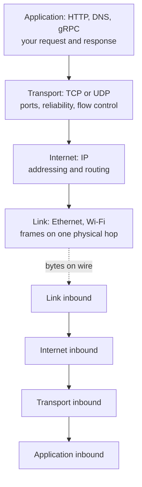
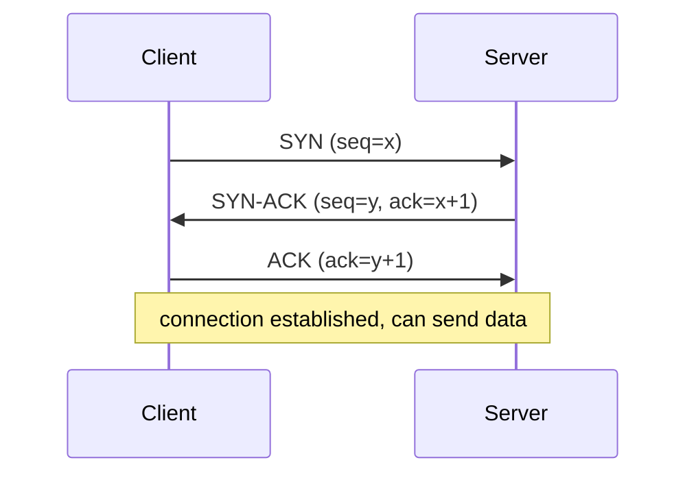
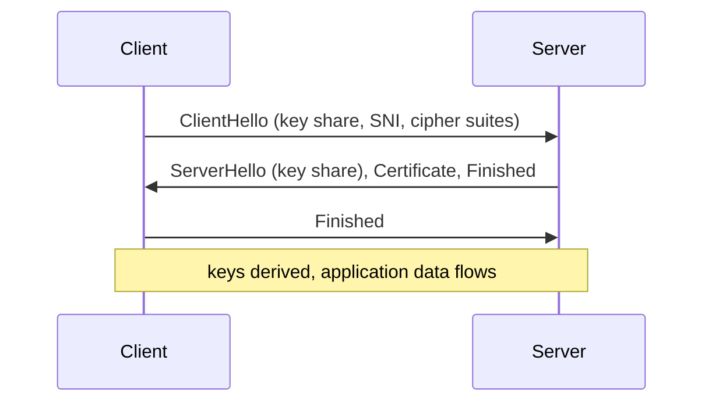

# Networking up the stack

## Why this matters

It's a Tuesday afternoon and a deploy that touched nothing but a frontend CSS file has somehow made your checkout API slow for users in Singapore. p99 latency jumped from a couple hundred milliseconds to well over a second, but only in one region, and only intermittently. The app code is identical. The database is healthy. Your dashboards are green except for that one ugly latency line.

You spend an hour staring at application traces before someone runs `dig` against your API hostname from a Singapore box and notices the CDN started returning a new edge IP — one that terminates TLS in a different region, adding a full extra round trip across an ocean for every connection that can't be reused. The "slow API" was never the API. It was a connection setup cost: a DNS answer pointing somewhere far, a TCP handshake across high latency, and a TLS handshake on top of that, all paid before a single byte of your JSON moved.

This is the gap this chapter closes. Most application bugs that look mysterious — tail latency, intermittent timeouts, "it works on my machine but not in prod" — are actually the network layer doing exactly what it's specified to do, just not what you assumed. You cannot debug what you cannot see, and the layers between `fetch()` and the response body are invisible until you learn to name them. Once you can trace a single request from a hostname to bytes on the wire and back, slow tail latencies stop being ghosts. They become a specific round trip you can point at, measure, and remove.

## Mental model

A network request is a stack of envelopes. Your HTTP request is the letter. TLS is the tamper-proof, sealed outer envelope. TCP is the postal service that guarantees ordered, complete delivery and retries lost pages. IP is the addressing and routing that gets a packet from your machine to a specific host across arbitrary intermediate networks. Each layer wraps the one above it and knows nothing about its contents — TCP has no idea it's carrying HTTP; IP has no idea it's carrying TCP.

The classic teaching model is the OSI seven layers; the model that actually matches the internet is the four-layer TCP/IP model from [RFC 1122](https://www.rfc-editor.org/rfc/rfc1122). It's the one worth holding in your head:



Two transport choices sit on top of IP. **TCP** gives you a reliable, ordered byte stream: it numbers every byte, acknowledges receipt, retransmits losses, and slows down when the network is congested. **UDP** gives you almost nothing — fire a datagram and hope — which is exactly what you want when you'd rather drop a late packet than wait for it (DNS, video, games) or when you want to build your own reliability on top (QUIC, the foundation of HTTP/3).

The single most important number in this whole chapter is the **round trip time** (RTT): how long a packet takes to reach the peer and come back. Every handshake costs RTTs, and you can't beat the speed of light — a trip between continents is on the order of a couple hundred milliseconds round trip at best, set by physics and fiber routing, not by your server. A naive HTTPS request over TCP and TLS 1.2 costs you a DNS lookup, a TCP handshake, a TLS handshake, and then the request itself: several round trips before your server logic runs. Almost everything modern protocols do is an attempt to delete round trips.

## In practice

### Tracing one HTTPS request end to end

Type `https://api.example.com/orders` and hit enter. Here's what actually happens, in order.

**1. DNS resolution — name to address.** The hostname `api.example.com` means nothing to IP, which routes by number. Your resolver walks the hierarchy: root servers point to the `.com` nameservers, which point to `example.com`'s authoritative nameservers, which return the address. In practice your OS stub resolver asks a recursive resolver (your ISP's, or `8.8.8.8`, or `1.1.1.1`) that caches aggressively. Watch it:

```bash
$ dig +trace api.example.com A
# ... root -> .com -> authoritative, then:
api.example.com.   60   IN   A   93.184.216.34
```

That `60` is the TTL in seconds — how long this answer may be cached. Short TTLs let you fail over fast; long TTLs cut latency and load. DNS runs over UDP port 53 for the common case (one small datagram, one response) and falls back to TCP for large answers (DNSSEC, big record sets).

**2. TCP three-way handshake — establish the stream.** With an IP address in hand, the kernel opens a TCP connection. Three packets, one round trip:



The `SYN` carries the client's initial sequence number; the `SYN-ACK` acknowledges it and carries the server's; the final `ACK` confirms. Sequence numbers are how TCP reassembles a byte stream in order and detects loss. You can watch the handshake live:

```bash
$ sudo tcpdump -n -i any 'tcp port 443 and host 93.184.216.34'
IP 10.0.0.5.51234 > 93.184.216.34.443: Flags [S],  seq 1829374650
IP 93.184.216.34.443 > 10.0.0.5.51234: Flags [S.], seq 882910, ack 1829374651
IP 10.0.0.5.51234 > 93.184.216.34.443: Flags [.],  ack 882911
```

**3. TLS handshake — establish trust and keys.** Now the encrypted layer. In TLS 1.3 ([RFC 8446](https://www.rfc-editor.org/rfc/rfc8446)) this is one round trip, down from two in TLS 1.2:



The client sends supported cipher suites, a key-exchange share, and the **SNI** (Server Name Indication) — the hostname in cleartext, so a server hosting many sites knows which certificate to present. The server returns its share and its certificate chain; the client verifies that chain against its trusted root store and that the cert covers the requested hostname. Both sides derive the same symmetric key via Diffie-Hellman and start encrypting. After this point everything, including the HTTP request, is ciphertext.

**4. The HTTP request and response — finally.** Only now do your actual bytes move:

```http
GET /orders HTTP/1.1
Host: api.example.com
Accept: application/json
```

```http
HTTP/1.1 200 OK
Content-Type: application/json
Content-Length: 87

{"orders": []}
```

The `Host` header is mandatory in HTTP/1.1 for the same reason as SNI: one IP can serve many hostnames. The response status line, headers, and body come back over the same TCP stream.

### TCP flow control vs. congestion control

These get conflated constantly; they solve different problems. **Flow control** stops a fast sender from overwhelming a slow *receiver* — the receiver advertises a window (`rwnd`) saying "I have this much buffer left," and the sender never sends more unacked data than that. **Congestion control** stops senders from overwhelming the *network in between* — there's no field advertising this, so TCP infers congestion from packet loss and delay, maintaining a separate congestion window (`cwnd`). The sender may use only `min(rwnd, cwnd)` at any moment.

Congestion control is why a fresh connection starts slow. **Slow start** opens `cwnd` exponentially until loss occurs, then **congestion avoidance** grows it linearly. The practical consequence: a brand-new TCP connection can't use your full bandwidth immediately — it has to ramp. This is the single biggest reason connection reuse matters so much. A connection that has already been carrying traffic for a while has a large, validated congestion window; a fresh one starts from a small initial window and has to earn its bandwidth back round trip by round trip. Tearing down a warm connection and building a cold one throws that earned state away.

### HTTP/1.1 vs 2 vs 3: deleting round trips and head-of-line blocking

```python
# The cost model, made explicit. Times are illustrative RTT counts,
# not benchmarks -- the point is the relative shape.
setup_cost = {
    "http1.1_new":  "DNS + TCP(1) + TLS1.2(2) = ~4 RTT before first byte",
    "http2_new":    "DNS + TCP(1) + TLS1.3(1) = ~2 RTT, then multiplexed",
    "http3_new":    "DNS + QUIC(1, TLS built in) = ~1 RTT, 0-RTT on resume",
}
```

**HTTP/1.1** uses one request per connection at a time. Pipelining was specified but never worked in practice, so browsers open several parallel TCP connections per host, each paying its own handshake and slow-start tax. Worse, a slow response blocks everything behind it on that connection — **head-of-line (HOL) blocking** at the application layer.

**HTTP/2** ([RFC 9113](https://www.rfc-editor.org/rfc/rfc9113)) fixes application-layer HOL blocking with **multiplexing**: many independent streams over one TCP connection, interleaved as binary frames. One connection, one handshake, one slow-start ramp, full concurrency. But it has a subtle remaining flaw: because all streams share one TCP byte stream, a single lost TCP segment stalls *every* stream until it's retransmitted — **TCP-level HOL blocking**. On a clean network you never notice; on a lossy mobile link it hurts.

**HTTP/3** ([RFC 9114](https://www.rfc-editor.org/rfc/rfc9114)) solves that by abandoning TCP entirely and running over **QUIC** ([RFC 9000](https://www.rfc-editor.org/rfc/rfc9000)), a transport built on UDP. QUIC implements its own streams with independent loss recovery, so a lost packet only stalls the one stream it belonged to. It folds the transport and TLS 1.3 handshakes together into a single round trip, and supports 0-RTT resumption where a returning client sends application data in its very first packet. QUIC also survives a changing IP (Wi-Fi to cellular) via connection IDs, so your video call doesn't drop when you walk out the door.

The honest tradeoff: HTTP/3 is genuinely better on lossy, high-latency, mobile networks and at high concurrency. It's more work to operate — UDP is sometimes throttled or blocked by middleboxes, and it tends to be more CPU-intensive because QUIC's loss recovery and crypto run in userspace rather than in the kernel's TCP stack. My default: enable HTTP/2 everywhere as table stakes, and turn on HTTP/3 at your CDN/edge where the mobile-network wins are largest and the operational cost is someone else's problem.

### Why connection reuse dominates

```go
// WRONG: a fresh client (and connection pool) per request.
// Every call eats DNS + TCP + TLS setup. Under load this also
// leaks file descriptors and exhausts ephemeral ports.
func fetchBad(url string) (*http.Response, error) {
	client := &http.Client{} // new pool, thrown away immediately
	return client.Get(url)
}

// RIGHT: one shared client with a tuned, reused connection pool.
// Keep-alive connections skip handshakes entirely on later requests.
var client = &http.Client{
	Timeout: 10 * time.Second,
	Transport: &http.Transport{
		MaxIdleConns:        100,
		MaxIdleConnsPerHost: 10,
		IdleConnTimeout:     90 * time.Second,
		ForceAttemptHTTP2:   true,
	},
}

func fetchGood(url string) (*http.Response, error) {
	return client.Get(url) // reuses a warm connection when available
}
```

The first request to a host pays the full DNS + TCP + TLS + slow-start cost. Every subsequent request on a kept-alive connection pays zero setup and runs at the already-ramped congestion window. This one change — share the client, reuse the pool — routinely cuts service-to-service tail latency more than any application-level optimization, and it costs you a few lines of initialization.

> **Connect the dots:** The reason `MaxIdleConnsPerHost` matters is the same reason database connection pools matter (Part 6): handshakes are expensive, connections are reusable, and exhaustion is a real failure mode. TCP's congestion window is a feedback control loop — the same control-theory shape you'll meet again in load shedding and backpressure (Part 9).

## Pitfalls and anti-patterns

**1. Creating a new HTTP client per request.** Recognize it by ephemeral-port exhaustion (`cannot assign requested address`), file-descriptor leaks, and latency that's dominated by handshake time even though your server is idle. Each new client gets its own connection pool that's discarded immediately, so nothing is ever reused. Fix: construct one client at process startup, share it everywhere, and tune `MaxIdleConnsPerHost` to your real concurrency. In Go specifically, you must also fully read and close every response body or the connection can't return to the pool.

**2. Trusting DNS TTLs you don't control — or caching them forever.** Long-lived clients (JVMs historically, connection pools, sidecars) sometimes resolve a hostname once and cache the IP for the life of the process. When the backend fails over to a new IP, the client keeps hammering the dead one. The mirror-image bug is a TTL set so long that an emergency failover takes a long time to propagate. Recognize it by traffic stuck on an old IP after a documented failover. Fix: respect TTLs in long-running clients, and keep TTLs on failover-critical records short (on the order of tens of seconds) while you accept the extra lookup cost.

**3. Assuming HTTP/2 multiplexing removed all head-of-line blocking.** Teams migrate to HTTP/2, see great numbers in the datacenter, and are baffled when mobile users still see stalls. The cause is TCP-level HOL blocking: one lost segment freezes all multiplexed streams. Recognize it by latency that degrades sharply with packet loss but is fine on a clean LAN. Fix: this is the actual use case for HTTP/3/QUIC at the edge; for internal datacenter traffic on clean links, HTTP/2 is fine and the switch isn't worth it.

**4. Setting timeouts on the wrong thing, or not at all.** A single `Timeout` covering DNS + connect + TLS + the entire response body is blunt: a large legitimate download trips the same timeout as a hung connect. No timeout at all means one stuck upstream exhausts your whole pool and the failure cascades. Recognize it by goroutine/thread pileups all blocked on network reads, or healthy-looking services that hang under partial upstream failure. Fix: set granular timeouts — separate dial, TLS-handshake, response-header, and idle timeouts — so "can't connect" fails fast while "slow large body" is allowed to finish.

**5. Reaching for UDP and reinventing TCP badly.** UDP looks tempting for "low latency," then you discover you need ordering, retransmission, and congestion control, and you implement the first two while skipping the third — becoming a bad network citizen that collapses under loss and worsens congestion for everyone else. Recognize it by a custom UDP protocol that works in the lab and melts on the real internet. Fix: use UDP only when you genuinely tolerate loss (telemetry, media) or use QUIC, which gives you UDP's flexibility with battle-tested reliability and congestion control already built in.

## Production checklist

- [ ] One shared HTTP client per process with a tuned connection pool (`MaxIdleConnsPerHost` sized to real concurrency); response bodies always fully read and closed
- [ ] Granular timeouts set: dial, TLS handshake, response-header, idle, and an overall request budget — never a single catch-all on long bodies
- [ ] Keep-alive enabled and verified (confirm connection reuse with `ss -t` or by watching for absent handshakes in `tcpdump`)
- [ ] TLS 1.3 enabled and TLS 1.0/1.1 disabled; certificate chain complete (no missing intermediates) and auto-renewing well before expiry
- [ ] HTTP/2 enabled end to end; HTTP/3 enabled at the CDN/edge for mobile-heavy traffic
- [ ] DNS TTLs short (tens of seconds) on failover-critical records; long-lived clients confirmed to re-resolve and not pin a stale IP
- [ ] Retries are bounded, jittered, and applied only to idempotent requests; combined with timeouts to avoid retry storms
- [ ] Health checks and load balancers configured to drain connections gracefully on deploy (so in-flight requests finish)
- [ ] Observability: per-hop timing exposed (DNS, connect, TLS, TTFB, total) via `httptrace`, OpenTelemetry, or `curl -w`

## Exercises

1. **(Comprehension)** Run `curl -w "dns:%{time_namelookup} connect:%{time_connect} tls:%{time_appconnect} ttfb:%{time_starttransfer} total:%{time_total}\n" -o /dev/null -s https://example.com` twice in a row against the same host. Explain why the second run's `connect` and `tls` numbers can differ from the first, and identify which phases a kept-alive connection would eliminate entirely.

2. **(Applied)** Capture a real HTTPS request with `sudo tcpdump -n 'tcp port 443'` while running `curl`. Identify the three packets of the TCP handshake by their flags, then find where TLS application data begins. Now repeat with `curl --http1.1` vs `curl --http2` against an HTTP/2-capable host and count the number of TCP connections each opens for a page with several sub-resources.

3. **(Design)** You operate a global API with users in North America, Europe, and Southeast Asia, and your single origin is in us-east. p99 latency for the far regions is dominated by connection setup, not compute. Design a plan to cut it. Consider: anycast DNS, edge TLS termination / CDN, HTTP/3 with 0-RTT resumption, connection reuse and keep-alive tuning, and regional read replicas. State which lever you'd pull first and what you'd measure to prove it worked.

## Further reading

- [RFC 9293](https://www.rfc-editor.org/rfc/rfc9293) — the consolidated, current TCP specification; the section on the state machine and sequence numbers is the canonical source
- [RFC 8446](https://www.rfc-editor.org/rfc/rfc8446) — TLS 1.3, including the 1-RTT and 0-RTT handshake flows
- [RFC 9000](https://www.rfc-editor.org/rfc/rfc9000) and [RFC 9114](https://www.rfc-editor.org/rfc/rfc9114) — QUIC transport and HTTP/3, the modern stack
- [*High Performance Browser Networking*](https://hpbn.co/) by Ilya Grigorik (free online) — the single best end-to-end treatment of everything in this chapter, with the latency math worked out
- [Cloudflare Learning Center: What is DNS?](https://www.cloudflare.com/learning/dns/what-is-dns/) — clear, accurate diagrams of recursive resolution and the nameserver hierarchy
- *Computer Networking: A Top-Down Approach*, Kurose and Ross — the standard textbook, strongest on flow vs. congestion control if you want the underlying theory

> **Security note:** The SNI field and DNS queries travel in cleartext even when the page content is encrypted, leaking which sites you visit to anyone on-path. Encrypted Client Hello (ECH) and DNS-over-HTTPS/TLS (DoH/DoT, [RFC 8484](https://www.rfc-editor.org/rfc/rfc8484)) close those gaps. Separately: always verify the certificate chain *and* that it covers the requested hostname — disabling verification (`InsecureSkipVerify: true`, `curl -k`) to "make it work" turns your encrypted channel into one a machine-in-the-middle can read and rewrite at will. It is the single most common way teams ship a TLS hole to production.
