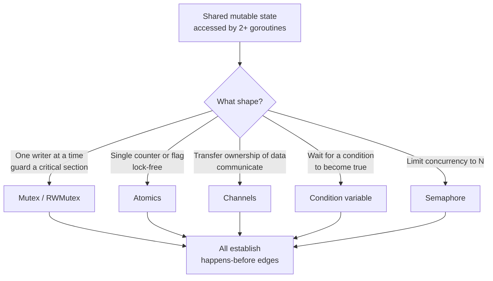

# Concurrency primitives

## Why this matters

It's a Tuesday afternoon. Your payment service has been live for six months, and the on-call dashboard shows a metric that can't be true: the daily transaction counter reports 4,981,203 settlements, but the ledger has 4,981,217 rows. Fourteen transactions were counted but never... no, that's backwards. The rows are right. The counter is wrong. It's been drifting low for months, and nobody noticed because the drift is tiny and random. Finance noticed when the reconciliation report stopped balancing.

You pull up the code. There's a goroutine per worker, and each one does `c.total++` after a successful settlement. Looks fine. It is not fine. `c.total++` is three machine operations — load, add, store — and when two workers run it at the same instant, one of them reads a stale value, adds to it, and writes back over the other's increment. The lost write is invisible. There's no crash, no log line, no stack trace. The only evidence is a number that's slightly too small, discovered weeks later by someone in another department.

That's the defining property of concurrency bugs: they don't announce themselves. A data race doesn't throw. A deadlock doesn't log "I am deadlocked." A subtle memory-ordering bug passes every test on your laptop and corrupts data only on the 64-core production box under load. The engineers who ship reliable concurrent code aren't smarter; they've internalized a small set of primitives and a few hard rules about when each one applies. This chapter is that toolkit: mutexes, atomics, channels, condition variables, semaphores, the memory model that explains why your intuition about "the order things happen" is wrong, and the two failure modes — races and deadlocks — that those primitives exist to prevent.

## Mental model

Start with the uncomfortable truth: **there is no single, global order in which your program's memory operations happen.** You write code top to bottom and imagine it executing that way. The compiler reorders instructions for speed. The CPU executes them out of order and retires them out of order. Each core has its own store buffer and cache, so a write you made on core 0 may not be visible to core 1 for some unknowable number of nanoseconds. "The value of `x`" is not a fact every core agrees on at every instant.

What restores sanity is the **happens-before relation**, the spine of the Go memory model (and Java's, and C++'s). Happens-before is a partial order over memory operations. If event A happens-before event B, then A's effects are guaranteed visible to B. If neither happens-before the other, they are *concurrent*, and if they touch the same memory and at least one is a write, you have a **data race** — and the language makes no promise whatsoever about what value you'll read. In Go, a program with a data race is not "slightly wrong"; it is *undefined*. The race detector exists because no amount of staring will reliably find these.

Concurrency primitives are exactly the tools that *create* happens-before edges across goroutines. That's the unifying idea. Each primitive is a different ergonomic shape over the same job — establishing ordering and mutual exclusion:



Go's design opinion, inherited from Hoare's Communicating Sequential Processes, is **"do not communicate by sharing memory; instead, share memory by communicating."** Channels are the headline feature. But the headline oversells it: mutexes and atomics are not second-class citizens, and for guarding a piece of shared state that several goroutines must mutate in place — a cache, a counter, a connection pool — a mutex is usually simpler and faster than threading the state through a channel. Pick the primitive that matches the *shape* of the problem, not the one with the best marketing.

## In practice

### The bug, made reproducible

Here is the counter from the incident, distilled. Two goroutines each increment a shared integer a thousand times. The correct answer is 2000.

```go
package main

import (
	"fmt"
	"sync"
)

func main() {
	var counter int
	var wg sync.WaitGroup
	for i := 0; i < 2; i++ {
		wg.Add(1)
		go func() {
			defer wg.Done()
			for j := 0; j < 1000; j++ {
				counter++ // load, add, store — not atomic
			}
		}()
	}
	wg.Wait()
	fmt.Println(counter)
}
```

*In TypeScript:*

```typescript
import { Worker, isMainThread, workerData, parentPort } from "node:worker_threads";

if (isMainThread) {
  // A SharedArrayBuffer is the only memory two threads can both touch.
  const sab = new SharedArrayBuffer(4);
  const counter = new Int32Array(sab);

  const workers = Array.from({ length: 2 }, () =>
    new Promise<void>((resolve) => {
      const w = new Worker(__filename, { workerData: sab });
      w.on("exit", () => resolve());
    }),
  );

  Promise.all(workers).then(() => {
    console.log(counter[0]); // you might get 2000 — or a too-small number
  });
} else {
  const counter = new Int32Array(workerData as SharedArrayBuffer);
  for (let j = 0; j < 1000; j++) {
    counter[0]++; // load, add, store — not atomic
  }
  parentPort!.postMessage("done");
}
```

Run it and you might get 2000. Run it many times and you'll see a different, too-small number each run. The bug is real but intermittent, which is the worst kind. Go ships the tool that makes it deterministic to *detect*:

```text
$ go run -race counter.go
==================
WARNING: DATA RACE
Write at 0x00c0000a4018 by goroutine 8:
  main.main.func1()
      counter.go:18 +0x6c
Previous write at 0x00c0000a4018 by goroutine 7:
  main.main.func1()
      counter.go:18 +0x6c
==================
```

The race detector instruments memory accesses at runtime and flags any pair of concurrent unsynchronized accesses where one is a write. It has no false positives — if it reports a race, there is a race. It only catches races on code paths that actually execute, so run your test suite and load tests under `-race`. The rule on my teams: **CI runs `go test -race` on every PR.** It costs several times the runtime and memory of an uninstrumented run, which is why it's a test-time tool, not a production one.

### Fix 1: a mutex

The most direct fix. Wrap the critical section so only one goroutine can be inside it at a time.

```go
type Counter struct {
	mu    sync.Mutex
	total int
}

func (c *Counter) Inc() {
	c.mu.Lock()
	defer c.mu.Unlock()
	c.total++
}

func (c *Counter) Value() int {
	c.mu.Lock()
	defer c.mu.Unlock()
	return c.total
}
```

*The same idea in TypeScript:*

```typescript
import { Mutex } from "async-mutex";

class Counter {
  private mu = new Mutex();
  private total = 0;

  async inc(): Promise<void> {
    const release = await this.mu.acquire();
    try {
      this.total++;
    } finally {
      release();
    }
  }

  async value(): Promise<number> {
    const release = await this.mu.acquire();
    try {
      return this.total;
    } finally {
      release();
    }
  }
}
```

`Lock()` blocks until the goroutine holds the lock; `Unlock()` releases it. The `Unlock` happens-before the next `Lock` returns, so every increment sees all prior increments. Note that `Value()` also locks — reading shared state concurrently with a write is itself a race, even though reading "feels" safe. The `defer` guarantees release even if the critical section panics.

A few rules that prevent most mutex pain:

- **Embed the mutex next to the data it guards**, and write a comment naming what it protects. A `sync.Mutex` floating in a struct with no documented scope is a future bug.
- **Never copy a struct that contains a `sync.Mutex`.** `go vet` catches this. A copied mutex is a different lock, so the copy provides no mutual exclusion.
- **Keep critical sections short.** Don't do I/O, don't call into code that might block or grab another lock, while holding a lock.

If reads vastly outnumber writes, `sync.RWMutex` lets any number of readers hold the lock simultaneously, blocking only for writers. It's a win only under genuinely read-heavy contention; for short critical sections a plain `Mutex` is often faster because `RWMutex` has more bookkeeping. Measure before you switch — the right answer depends on your read/write ratio and how long the critical section runs.

### Fix 2: an atomic

For a single counter, a mutex is overkill. The hardware can do an atomic read-modify-write in one uninterruptible instruction. Go 1.19+ gives typed atomics:

```go
import "sync/atomic"

type Counter struct {
	total atomic.Int64
}

func (c *Counter) Inc()         { c.total.Add(1) }
func (c *Counter) Value() int64 { return c.total.Load() }
```

*The TypeScript equivalent:*

```typescript
// `total` lives in shared memory; Atomics provides indivisible RMW ops.
class Counter {
  private total: BigInt64Array;

  constructor(sab: SharedArrayBuffer) {
    this.total = new BigInt64Array(sab);
  }

  inc(): void {
    Atomics.add(this.total, 0, 1n);
  }

  value(): bigint {
    return Atomics.load(this.total, 0);
  }
}
```

`Add` and `Load` are indivisible and establish happens-before edges, so there's no lost-update window. This is lock-free, faster than a mutex for the single-word case, and impossible to misuse with a forgotten `Unlock`. The limit: atomics protect *one word*. The moment your invariant spans two fields — "decrement balance *and* append to ledger, together" — atomics can't express it and you need a mutex (or a channel) around the compound operation.

### Fix 3: a channel

The CSP-flavored fix moves the state out of shared memory entirely. One goroutine *owns* the counter; everyone else sends it messages.

```go
func main() {
	inc := make(chan int)   // increment requests
	done := make(chan int)  // final result
	var wg sync.WaitGroup

	go func() { // sole owner of `total`
		total := 0
		for d := range inc {
			total += d
		}
		done <- total
	}()

	for i := 0; i < 2; i++ {
		wg.Add(1)
		go func() {
			defer wg.Done()
			for j := 0; j < 1000; j++ {
				inc <- 1
			}
		}()
	}
	wg.Wait()
	close(inc)          // owner's range loop ends
	fmt.Println(<-done) // always 2000
}
```

*In TypeScript:*

```typescript
import { Worker, isMainThread, parentPort } from "node:worker_threads";

if (isMainThread) {
  let total = 0; // sole owner of `total`, lives on the main thread
  let pending = 2;

  const result = new Promise<number>((resolve) => {
    for (let i = 0; i < 2; i++) {
      const w = new Worker(__filename);
      // Each message is one increment request, delivered to the owner.
      w.on("message", (d: number) => {
        total += d;
      });
      w.on("exit", () => {
        if (--pending === 0) resolve(total);
      });
    }
  });

  result.then((t) => console.log(t)); // always 2000
} else {
  for (let j = 0; j < 1000; j++) {
    parentPort!.postMessage(1);
  }
}
```

A send on a channel happens-before the corresponding receive completes, which is what makes this race-free. No mutex appears anywhere; the channel *is* the synchronization. This is more code than the atomic for a mere counter, and it's slower. But the pattern earns its keep when the owned state is complex (a whole connection registry, a rate limiter's bucket) and you'd otherwise sprinkle locks across many methods. **Channels for transferring ownership and orchestrating; mutexes/atomics for guarding in-place state.** Both are correct; the choice is about which makes the code clearer.

### Condition variables and semaphores

A **condition variable** lets goroutines wait until some predicate becomes true, without busy-polling. The canonical use is a bounded queue where consumers must wait for items:

```go
type Queue struct {
	mu    sync.Mutex
	cond  *sync.Cond
	items []int
}

func NewQueue() *Queue {
	q := &Queue{}
	q.cond = sync.NewCond(&q.mu)
	return q
}

func (q *Queue) Put(x int) {
	q.mu.Lock()
	q.items = append(q.items, x)
	q.cond.Signal() // wake one waiter
	q.mu.Unlock()
}

func (q *Queue) Get() int {
	q.mu.Lock()
	defer q.mu.Unlock()
	for len(q.items) == 0 { // MUST be a loop, not an if
		q.cond.Wait() // atomically unlocks, sleeps, re-locks on wake
	}
	x := q.items[0]
	q.items = q.items[1:]
	return x
}
```

*The TypeScript equivalent:*

```typescript
class Queue {
  private items: number[] = [];
  private waiters: Array<() => void> = []; // resolvers for sleeping getters

  put(x: number): void {
    this.items.push(x);
    const wake = this.waiters.shift(); // signal one waiter
    if (wake) wake();
  }

  async get(): Promise<number> {
    while (this.items.length === 0) {
      // MUST be a loop: re-check the predicate after each wake.
      await new Promise<void>((resolve) => this.waiters.push(resolve));
    }
    return this.items.shift()!;
  }
}
```

The non-negotiable rule: **always re-check the predicate in a `for` loop, never an `if`.** `Wait()` can return spuriously, and even a correct `Signal` may race another consumer that drains the item first. Re-checking on wake is what makes it correct. In idiomatic Go you'd usually reach for a buffered channel instead of `sync.Cond` — channels handle blocking and signaling for you — but condition variables are the right tool when waiters need to test a complex predicate, and you'll meet `pthread_cond_t` everywhere in C.

A **semaphore** limits concurrency to N. Go has no built-in type, but a buffered channel *is* a counting semaphore — acquire by sending, release by receiving:

```go
sem := make(chan struct{}, 10) // at most 10 concurrent
for _, job := range jobs {
	sem <- struct{}{} // acquire (blocks if 10 in flight)
	go func(j Job) {
		defer func() { <-sem }() // release
		process(j)
	}(job)
}
```

*The same idea in TypeScript:*

```typescript
import { Semaphore } from "async-mutex";

const sem = new Semaphore(10); // at most 10 concurrent
for (const job of jobs) {
  // runExclusive acquires (resolving later if 10 are in flight) and
  // releases automatically when the callback settles.
  sem.runExclusive(() => process(job));
}
```

This is how you stop a fan-out from opening 10,000 simultaneous database connections. `golang.org/x/sync/semaphore` offers a weighted version when jobs have different costs.

> **Connect the dots:** These primitives are the floor every higher layer stands on. The goroutine scheduler that decides who runs when is the OS-level material from Part 1's operating-systems chapter; a blocked `Lock()` ultimately parks on a futex. The connection pools and worker queues in Part 4's backend services are semaphores and mutexes wearing application-level clothes. Learn the primitives once and you'll recognize them in every async runtime, event loop, and actor framework you ever touch.

## Pitfalls and anti-patterns

**The lost update (unguarded read-modify-write).** The opening incident. Any `x++`, `m[k] = m[k] + 1`, or `slice = append(slice, v)` touched by more than one goroutine without synchronization will silently lose writes. *Recognize it:* a counter, total, or map that drifts low under load, with no crash. *Fix it:* `go test -race` in CI catches it deterministically; then guard with an atomic (single word) or a mutex (compound invariant).

**The check-then-act race (TOCTOU).** Code that tests a condition and then acts on it, with a gap between, where another goroutine can change the condition in the gap. Classic form: `if !cache.has(k) { cache.set(k, compute()) }` — two goroutines both see `!has`, both compute, one's write is lost or you do double work. *Recognize it:* duplicated work, occasional overwrites, "this should be impossible" log lines. *Fix it:* make check-and-act a single atomic step under one lock, or use `sync.Once` / `LoadOrStore` on `sync.Map`.

**The deadlock from lock-ordering inversion.** Goroutine A locks mutex 1 then waits for 2; goroutine B locks 2 then waits for 1. Both block forever. Go's runtime detects the special case where *all* goroutines are asleep (`fatal error: all goroutines are asleep - deadlock!`) but cannot detect a partial deadlock where the rest of the program keeps running. *Recognize it:* a subset of requests hang forever; goroutine count climbs; a `pprof` goroutine dump shows many parked on `Lock`. *Fix it:* establish a **global lock ordering** — always acquire locks in the same order everywhere — and never hold a lock while calling code that may acquire another. Prefer not holding two locks at once.

**The forgotten `Unlock` on the error path.** `Lock()`, then an early `return` on error before `Unlock()`. The lock leaks; the next goroutine blocks forever. *Recognize it:* same hang signature as a deadlock, triggered only by an error branch. *Fix it:* `defer c.mu.Unlock()` immediately after `Lock()` — it runs on every return path including panics. If you must release early, that's the rare case to unlock explicitly, and audit every branch.

**The goroutine leak from an abandoned channel.** A goroutine blocked on `<-ch` or `ch <- v` where the other end never appears (often after the consumer returned early on `ctx` cancellation) sits parked forever, holding its stack and any captured references. *Recognize it:* memory and goroutine count grow without bound over hours; `runtime.NumGoroutine()` only rises. *Fix it:* give every send/receive an escape via `select` with a `<-ctx.Done()` case, and make sure every goroutine you start has a guaranteed path to exit.

> **Security note:** Data races are a memory-safety hole, not just a correctness bug. A race on a multi-word value — an interface, a slice header, a map — can be exploited to produce a torn value: a slice with one goroutine's pointer and another's length, yielding out-of-bounds reads from memory you never allocated. This has been a real source of CVEs. Treat the race detector's output as a security finding, not a flaky-test annoyance, and never ship code with a known race "because it only loses a few counts."

## Production checklist

- [ ] CI runs `go test -race ./...` on every pull request, and load/integration tests run under `-race` at least nightly
- [ ] `go vet` runs in CI (catches copied mutexes, bad `WaitGroup` use, and lock misuse)
- [ ] Every shared mutable field has a documented guard: a comment naming which mutex protects it, or a type that is itself safe (`atomic.*`, a channel)
- [ ] All `sync.Cond.Wait()` calls re-check their predicate inside a `for` loop, never an `if`
- [ ] Every `Lock()` is paired with a `defer Unlock()` unless there's a documented reason to unlock early
- [ ] A consistent global lock-ordering is written down, and no lock is held across calls that may acquire another lock or do I/O
- [ ] Every goroutine has a guaranteed exit path; blocking channel ops are paired with a `<-ctx.Done()` case in a `select`
- [ ] Fan-out work is bounded by a semaphore (buffered channel or `x/sync/semaphore`), never unbounded `go` in a loop
- [ ] A `pprof` goroutine-dump endpoint is wired up so you can diagnose a hang in production
- [ ] Structs containing a `sync.Mutex` are passed by pointer, never by value

## Exercises

1. **(Comprehension)** Take the unguarded counter from the start of "In practice." Without running it, explain precisely which machine-level steps of `counter++` interleave to lose an update, and why the final value is *always ≤ 2000* and never greater. Then run it under `go run -race` and confirm the reported addresses and line numbers match your explanation.

2. **(Applied)** Build a bounded worker pool: a function `Process(ctx context.Context, jobs []Job, workers int) ([]Result, error)` that runs at most `workers` jobs concurrently, returns results in input order, and stops promptly if `ctx` is cancelled. Use a semaphore to bound concurrency and a mutex or per-index slice to collect results without a race. Verify it passes `go test -race`, then deliberately introduce a lost-update bug in result collection and confirm the detector catches it.

3. **(Design)** You're designing the synchronization for an in-memory LRU cache that will be read by thousands of goroutines and written by a few. Compare three designs: (a) a single `sync.Mutex` around the whole map, (b) a `sync.RWMutex`, (c) sharding the keyspace across N independently-locked maps. For each, reason about contention, the eviction-list update problem (eviction mutates state even on a read), and memory-ordering correctness. State which you'd ship first and what metric would make you switch.

## Further reading

- [The Go Memory Model](https://go.dev/ref/mem) — the authoritative, surprisingly short specification of happens-before in Go; read it twice
- Leslie Lamport, ["Time, Clocks, and the Ordering of Events in a Distributed System"](https://lamport.azurewebsites.net/pubs/time-clocks.pdf) (1978) — the origin of happens-before; concurrency and distributed systems are the same problem at different scales
- C. A. R. Hoare, ["Communicating Sequential Processes"](https://www.cs.cmu.edu/~crary/819-f09/Hoare78.pdf) (1978) — the theoretical root of Go's channels
- [Go Data Race Detector](https://go.dev/doc/articles/race_detector) — official docs on how `-race` works and how to integrate it
- [`sync` package documentation](https://pkg.go.dev/sync) and [`sync/atomic`](https://pkg.go.dev/sync/atomic) — the primitives themselves, with the precise contract for each
- Dmitry Vyukov, ["Go: Introduction to the Race Detector"](https://go.dev/blog/race-detector) — from the author of Go's race detector and many of its lock-free internals
