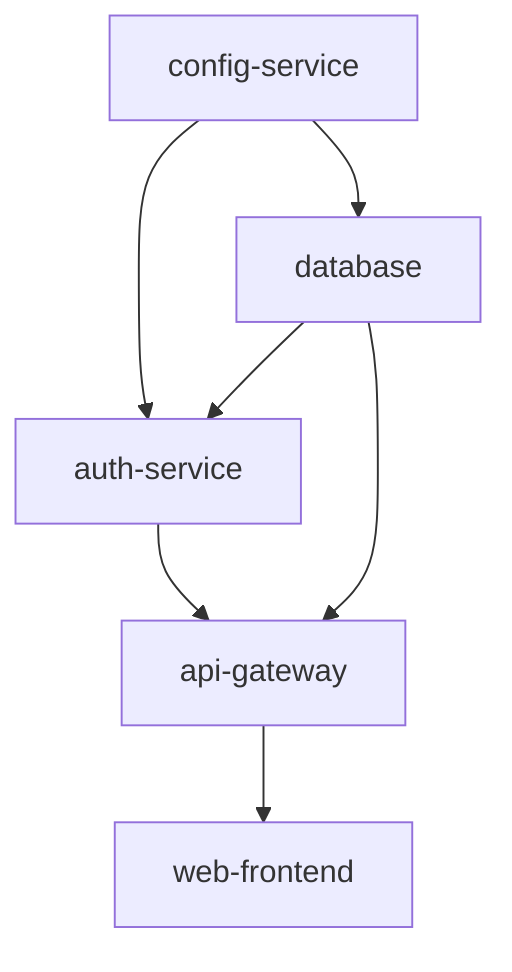

# The discrete math you'll reach for

## Why this matters

It's a Tuesday afternoon and a single endpoint is timing out. Users in one region see 504s; everyone else is fine. You pull up the cache cluster dashboard and there it is: one of your eight Redis nodes is at 95% CPU and 90% memory while the other seven idle around 30%. You didn't change the traffic pattern. You added a node last week to handle growth, and somehow that made things *worse*.

The bug isn't in your code. It's in your sharding function. Someone wrote `node = hash(key) % N`, and when `N` went from 7 to 8, almost every key remapped to a different node, so the warm cache evaporated and one unlucky node inherited a hot keyspace. The fix is consistent hashing, and you can't reason about why it works — or why the naive version failed — without modular arithmetic. Not the proof-heavy version from a textbook. The working version: what `mod` does to a key distribution when the divisor changes.

This is the pattern with discrete math in application engineering. You almost never *do* a proof. But the day a capacity estimate is off by an order of magnitude, a permission check has a subtle logic bug, a graph of service dependencies has a cycle that deadlocks startup, or a hash collision turns an O(1) lookup into O(n) under attacker control — on that day, the people who can model the problem in sets, logic, counting, graphs, or modular arithmetic solve it in an hour. Everyone else stares at a dashboard. This chapter is the working subset: the five tools you'll actually reach for, each tied to a problem you'll actually hit.

## Mental model

Five small bodies of math cover the overwhelming majority of what application engineers reach for. None of them require the formal machinery you may remember from a course. Each maps to a concrete engineering question:

| Tool | The question it answers | Where you hit it |
|---|---|---|
| **Sets & set operations** | "What's in A but not B?" | permissions, diffing, deduplication, feature flags |
| **Boolean logic** | "When exactly is this condition true?" | access control, query filters, validation |
| **Combinatorics** | "How many possible values / how likely is a collision?" | capacity planning, ID space sizing, probability |
| **Graph theory** | "What depends on what, and is there a cycle?" | dependencies, routing, schedulers, social graphs |
| **Modular arithmetic** | "How do I map a huge space onto a small one fairly?" | hashing, sharding, ring buffers, crypto |

The unifying idea is that each gives you a *vocabulary* precise enough to catch bugs that natural language hides. "Show me users who are admins but not on the suspended list" is a set difference, `admins - suspended`, and the moment you write it that way you notice the edge case: what about a user who is both? Set notation forces the question. English lets you skip it.

These tools also reinforce each other. A truth table is a tiny exhaustive enumeration — combinatorics applied to boolean logic. A hash function is a map from a large set onto a small one, evaluated by modular arithmetic and judged by combinatorics (how likely is a collision?). A dependency graph is a relation, and a relation is a set of pairs. You don't need to hold the formal connections in your head, but noticing that the same five ideas keep recombining is why a little fluency pays off across so many unrelated problems.

Here is how the graph piece — the one most likely to bite you in a distributed system — looks structurally. A dependency graph that must be a DAG (directed acyclic graph) for startup ordering to exist:



If you can topologically sort this graph, you have a valid boot order: `config, db, auth, api, web`. If you *can't* — if some edge points backward and creates a cycle — then there is no order in which every service starts after its dependencies, and your orchestrator will either deadlock or crash-loop. Cycle detection is the same algorithm whether the nodes are microservices, Terraform resources, npm packages, or database migrations. Learn it once.

## In practice

### Sets: the permission check you'll write a hundred times

Most permission and diffing logic is set algebra wearing a business costume. Spell it out with real set operations and the bugs surface before code review does.

```python
# Effective permissions = roles the user has, expanded to their grants,
# minus anything explicitly revoked.
def effective_permissions(user_roles, role_grants, explicit_revocations):
    granted = set()
    for role in user_roles:
        granted |= role_grants.get(role, set())   # union
    return granted - explicit_revocations          # difference

role_grants = {
    "editor":  {"read", "write", "comment"},
    "viewer":  {"read"},
    "auditor": {"read", "export"},
}

perms = effective_permissions(
    user_roles={"editor", "auditor"},
    role_grants=role_grants,
    explicit_revocations={"export"},
)
print(sorted(perms))   # ['comment', 'read', 'write']
```

The four operations you need: union (`|`, "either"), intersection (`&`, "both"), difference (`-`, "in the first not the second"), and symmetric difference (`^`, "in exactly one"). Symmetric difference is the one people forget and the one that powers diffing:

```python
desired = {"svc-a", "svc-b", "svc-c"}      # what config says should run
running = {"svc-b", "svc-c", "svc-d"}      # what's actually up

to_start = desired - running               # {'svc-a'}
to_stop  = running - desired               # {'svc-d'}
churn    = desired ^ running               # {'svc-a', 'svc-d'}
```

That `to_start` / `to_stop` pattern is the core of every reconciliation loop in Kubernetes-style control planes. The controller computes the set difference between desired and observed state and acts only on the delta. Sets also give you `O(1)` membership versus `O(n)` for a list scan — using a `list` where you meant a `set` is one of the most common quiet performance bugs in glue code. The trap usually hides inside an innocent-looking `if x in collection` on a hot path: it reads identically whether `collection` is a list or a set, but the cost per call differs by orders of magnitude as the collection grows.

### Boolean logic: De Morgan's law saves an access-control bug

Access-control conditions are where fuzzy boolean reasoning ships security holes. Consider a guard that should block a request unless the user is *both* authenticated *and* verified:

```python
# WRONG: "block if not authenticated or not verified" got mangled.
def can_access_wrong(authenticated, verified):
    if not (authenticated and verified):   # intended
        return False
    return True

# A teammate "simplifies" it during review and gets it subtly wrong:
def can_access_buggy(authenticated, verified):
    if not authenticated and not verified:   # WRONG negation
        return False
    return True
```

`can_access_buggy` lets through a user who is authenticated but *not* verified, because `not authenticated and not verified` is only true when *both* are false. The correct distribution of the negation is De Morgan's law:

```text
not (A and B)  ==  (not A) or (not B)
not (A or B)   ==  (not A) and (not B)
```

So the right rewrite is `if (not authenticated) or (not verified): return False`. The cheapest way to never ship this bug is to build the truth table — four rows for two variables, eight for three — and check every row:

| authenticated | verified | want | buggy gives |
|---|---|---|---|
| F | F | block | block |
| F | T | block | allow ← bug |
| T | F | block | allow ← bug |
| T | T | allow | allow |

Two wrong rows. A truth table is four lines of mental work and it is exhaustive in a way that "looks right to me" never is. The number of rows doubles with each variable — two variables give four rows, three give eight, four give sixteen — which is itself the counting principle in miniature, and a good reason to keep auth predicates down to a handful of inputs. For any condition gating money or access, write the table.

> **Security note:** Boolean bugs in authorization are not theoretical — they are a recurring source of real CVEs (privilege escalation, authentication bypass). The dangerous shape is almost always a mis-distributed negation or an `&&` that should be `||`. Two defenses: (1) write the truth table for every auth predicate and assert it in a unit test, one assertion per row; (2) default-deny — structure the code so the *only* path that returns "allow" is the one where every required condition is explicitly true, rather than enumerating the deny cases. Deny-by-default means a logic slip fails closed, not open.

### Combinatorics: sizing an ID space and a collision probability

Combinatorics is how you answer "is this big enough?" without guessing. The counting principle: if you make a string of `L` characters from an alphabet of size `k`, there are `k^L` possible strings. That single rule sizes ID spaces, password entropy, and cardinality estimates.

```python
# How many distinct 8-char codes from [A-Z0-9] (36 symbols)?
alphabet = 36
length = 8
total = alphabet ** length
print(f"{total:,}")   # 2,821,109,907,456  (~2.8 trillion)
```

Plenty for human-facing coupon codes. But raw count is not the question you usually care about. The real question is *collision probability* — when you generate IDs randomly, when do two collide? That's the birthday problem, and the answer surprises everyone: collisions become likely at roughly the *square root* of the space size, not the size itself.

```python
import math

def collision_probability(space_size, num_drawn):
    """Approx P(at least one collision) drawing num_drawn IDs from space_size."""
    # 1 - exp(-n^2 / 2N), the standard birthday approximation
    return 1 - math.exp(-(num_drawn ** 2) / (2 * space_size))

space = 36 ** 8                      # ~2.8e12
for n in (10_000, 100_000, 1_000_000):
    p = collision_probability(space, n)
    print(f"{n:>9,} IDs -> P(collision) = {p:.4%}")
```

```text
   10,000 IDs -> P(collision) = 0.0018%
  100,000 IDs -> P(collision) = 0.1771%
1,000,000 IDs -> P(collision) = 16.2417%
```

A 2.8-trillion space sounds collision-proof, yet at a million IDs you're already at roughly a one-in-six chance of a duplicate. This is exactly why UUIDv4 uses 122 random bits (`2^122` ≈ 5.3×10^36): the space is large enough that even generating billions of IDs keeps collision probability negligible. When someone proposes "let's just use an 8-character random string for primary keys," the birthday approximation is the one-line rebuttal. The same math governs hash table sizing and the false-positive rate of Bloom filters.

A useful rule of thumb falls straight out of the formula: collisions reach roughly 50% probability when `n ≈ 1.2 · √N`. So a space of size `N` only safely absorbs on the order of `√N` random draws, not `N`. Halve the danger by doubling the bit length, not the character count — every extra bit doubles `N` and so multiplies the safe draw count by `√2`. That single relationship is why ID schemes are sized in bits.

### Graphs: detect the dependency cycle before it deadlocks startup

Back to the boot-order graph. The question "can these services start at all?" is "is this graph a DAG?" — and the answer is a topological sort that fails loudly on a cycle. Kahn's algorithm is the readable one: repeatedly remove nodes with no remaining incoming edges.

```python
from collections import deque

def topological_order(graph):
    """graph: {node: set(dependencies it must start AFTER)}.
    Returns a valid order, or raises if there's a cycle."""
    # Build in-degree: how many deps each node is still waiting on.
    indegree = {n: 0 for n in graph}
    for node, deps in graph.items():
        for _ in deps:
            indegree[node] += 1

    # Start with everything that depends on nothing.
    ready = deque(n for n, d in indegree.items() if d == 0)
    order = []

    # Reverse map: who is waiting on me?
    dependents = {n: [] for n in graph}
    for node, deps in graph.items():
        for dep in deps:
            dependents[dep].append(node)

    while ready:
        n = ready.popleft()
        order.append(n)
        for m in dependents[n]:
            indegree[m] -= 1
            if indegree[m] == 0:
                ready.append(m)

    if len(order) != len(graph):
        cyclic = [n for n in graph if indegree[n] > 0]
        raise ValueError(f"dependency cycle involving: {sorted(cyclic)}")
    return order

services = {
    "config": set(),
    "db":     {"config"},
    "auth":   {"config", "db"},
    "api":    {"auth", "db"},
    "web":    {"api"},
}
print(topological_order(services))
# ['config', 'db', 'auth', 'api', 'web']
```

Introduce a cycle (`config` now depends on `web`) and the function raises `dependency cycle involving: ['api', 'auth', 'config', 'db', 'web']` instead of silently producing a broken order. This is the same machine under `make`, `terraform apply`'s resource graph, build systems, task schedulers, and database migration ordering. The two graph traversals you must own are BFS (shortest path in unweighted graphs, level-order, this topological sort) and DFS (cycle detection, reachability, connected components). Almost everything else is a variation. Both run in `O(V + E)` time — linear in the number of nodes plus edges — which is why running cycle detection in CI on a dependency graph of thousands of nodes costs milliseconds and is never the thing you trade away.

> **Connect the dots:** This is the same graph from the Data Structures chapter (Part 1) and the same DAG idea behind Git's commit history (Part 3) — a commit's parents are its dependencies, and `git log` is a graph traversal. Once the DAG model clicks here, it transfers directly to build pipelines (Part 8) and event-sourcing causality.

### Modular arithmetic: from the broken shard to consistent hashing

Now the opening incident. The naive shard `node = hash(key) % N` works until `N` changes. When you go from 7 to 8 nodes, a key lands on the same node only if `hash(key) % 7 == hash(key) % 8`, which is rare — so almost every key moves, and every cache is cold at once.

```python
import hashlib

def h(key: str) -> int:
    return int(hashlib.md5(key.encode()).hexdigest(), 16)

# How many keys keep their node when N goes 7 -> 8?
keys = [f"user:{i}" for i in range(100_000)]
stayed = sum(1 for k in keys if h(k) % 7 == h(k) % 8)
print(f"{stayed / len(keys):.1%} of keys keep their node")  # ~12.6%
```

Only about an eighth of keys keep their node; the rest — roughly 87% — remap, and their cache entries are instantly cold. Consistent hashing fixes this by hashing both nodes *and* keys onto the same circular space (`mod 2^32`), then assigning each key to the first node clockwise. Adding or removing a node only disturbs the arc it sits on — on average `K/N` keys move instead of nearly all of them.

```python
import bisect

class ConsistentHashRing:
    def __init__(self, nodes, vnodes=100):
        self.vnodes = vnodes
        self.ring = {}            # point on circle -> node
        self.sorted_points = []
        for node in nodes:
            self._add(node)

    def _point(self, label):
        return int(hashlib.md5(label.encode()).hexdigest(), 16) % (2**32)

    def _add(self, node):
        for i in range(self.vnodes):       # virtual nodes spread load evenly
            p = self._point(f"{node}#{i}")
            self.ring[p] = node
            bisect.insort(self.sorted_points, p)

    def node_for(self, key):
        p = self._point(key)
        idx = bisect.bisect(self.sorted_points, p) % len(self.sorted_points)
        return self.ring[self.sorted_points[idx]]

ring7 = ConsistentHashRing([f"node{i}" for i in range(7)])
ring8 = ConsistentHashRing([f"node{i}" for i in range(8)])
moved = sum(1 for k in keys if ring7.node_for(k) != ring8.node_for(k))
print(f"{moved / len(keys):.1%} of keys move with consistent hashing")  # ~15%
```

The drop from roughly 87% of keys moving to roughly 15% is the whole reason consistent hashing exists, and it lives entirely in how `mod` interacts with the ring. The *virtual nodes* (`vnodes`) matter too: without them, a few nodes own huge arcs and load is lopsided — the same hot-node symptom from the incident, for a different reason. The same `mod` arithmetic underpins ring buffers (`index = (head + 1) % capacity`), and the same modular exponentiation underpins RSA and Diffie-Hellman. When you see `% N` in sharding code review, that's your cue to ask whether `N` is ever allowed to change.

## Pitfalls and anti-patterns

**1. The modulo-rehash trap.** Sharding with `hash(key) % N` and then changing `N`. Recognize it by a cache hit rate that craters or one node going hot right after a scaling event. Fix: use consistent hashing (with virtual nodes) or rendezvous/HRW hashing so that resizing moves only `~K/N` keys instead of nearly all of them.

**2. Mis-distributed negation in boolean logic.** A `not (A and B)` rewritten as `not A and not B`, or an `||` that should be `&&` in an authorization check. Recognize it when an access test "mostly works" but lets through one specific combination of flags. Fix: apply De Morgan's law deliberately, write the full truth table, and assert one test per row. Default-deny so a slip fails closed.

**3. Underestimating collisions (ignoring the birthday bound).** Assuming a "huge" random ID space is collision-proof. Recognize it by sporadic duplicate-key errors that grow with traffic, not with code changes. Fix: size the space against the birthday approximation (collisions get likely near `√N`), not against `N`. For primary keys, use UUIDv4/v7 or a coordinated generator (Snowflake), not a short random string.

**4. Hash flooding — letting attacker-controlled keys collide on purpose.** An attacker who knows your hash function feeds inputs that all land in one bucket, turning an O(1) hash map into an O(n) linked list and a CPU-exhaustion DoS. Recognize it as a request flood that spikes CPU far out of proportion to request count. Fix: use a keyed/randomized hash (SipHash, which modern language runtimes adopted as the default string hash for exactly this reason) so the bucket layout isn't predictable from outside.

**5. The hidden dependency cycle.** Two services, modules, or Terraform resources that each depend on the other, discovered only when startup deadlocks or `terraform apply` errors. Recognize it as a boot order that "sometimes works" depending on timing. Fix: model dependencies as a directed graph and run cycle detection (topological sort) in CI so the cycle is caught at merge time, not 2 a.m.

> **Security note:** Items 3 and 4 are the security-critical pair. Hash flooding was disclosed broadly around 2011 and mitigated industry-wide by switching default string hashing to keyed hashes such as SipHash; ID-space sizing is the other side of the same coin. Both come down to "an attacker reasons about your math better than you did." Never use a fast, unkeyed, predictable hash for anything an adversary can feed inputs to, and never use a non-cryptographic hash (MD5, CRC, FNV) for security tokens or signatures — those need a CSPRNG or an HMAC.

## Production checklist

- [ ] Every authorization predicate has a truth-table-derived unit test, one assertion per row, and is written default-deny
- [ ] Set operations (`union`/`intersection`/`difference`) used for permission and reconciliation logic instead of hand-rolled loops; membership checks use `set`/hash structures, not list scans
- [ ] Sharding/partitioning uses consistent or rendezvous hashing if the node count can ever change; `% N` with a mutable `N` is banned in review
- [ ] Random ID spaces sized against the birthday bound (`√N`), not against `N`; primary keys use UUIDv4/v7 or Snowflake, never short random strings
- [ ] String/dict hashing in request-handling paths uses a keyed hash (SipHash default) to resist hash-flooding DoS
- [ ] Security tokens and signatures use a CSPRNG or HMAC, never MD5/CRC/FNV/`hash()`
- [ ] Dependency graphs (services, migrations, IaC, build targets) run topological-sort cycle detection in CI
- [ ] Capacity estimates written down with the counting assumptions explicit, so a 10x error is visible in the math, not buried in a spreadsheet

## Exercises

1. **(Comprehension)** Given `A = {1,2,3,4}` and `B = {3,4,5,6}`, compute by hand then verify in code: `A | B`, `A & B`, `A - B`, `B - A`, and `A ^ B`. Then state in one sentence each which engineering question (dedup, reconciliation diff, "in exactly one") each operation answers.

2. **(Applied)** Take the `ConsistentHashRing` above. Generate 1,000,000 keys and measure the load distribution across nodes with `vnodes=1` versus `vnodes=200`. Quantify the imbalance (max-load / mean-load ratio) for each. Then remove one node and measure what fraction of keys move, confirming it's near `1/N`. Explain why virtual nodes flatten the distribution.

3. **(Design)** You're designing the ID scheme for a new events table expected to ingest 50 billion rows over five years, written from many machines with no central coordinator, and you want IDs to be roughly time-ordered for index locality. Choose an approach (UUIDv7, Snowflake-style, ULID, or something else), size the random/sequence component against the birthday bound and your peak per-millisecond write rate, and state the failure mode of your scheme if write rate spikes 100x. Defend the tradeoff between collision safety, ordering, and ID length.

## Further reading

- Karger et al., ["Consistent Hashing and Random Trees"](https://www.akamai.com/site/en/documents/research-paper/consistent-hashing-and-random-trees-distributed-caching-protocols-for-relieving-hot-spots-on-the-world-wide-web-technical-publication.pdf) (STOC 1997) — the original consistent-hashing paper, the foundation of every modern sharding scheme
- Aumasson and Bernstein, ["SipHash: a fast short-input PRF"](https://www.aumasson.jp/siphash/siphash.pdf) — the keyed hash that runtimes adopted to stop hash-flooding DoS
- *Concrete Mathematics*, Graham, Knuth, and Patashnik — the canonical reference for the combinatorics and modular arithmetic in this chapter; dense but authoritative
- Jeff Erickson, [*Algorithms*](https://jeffe.cs.illinois.edu/teaching/algorithms/) (free) — chapters on graph traversal, topological sort, and DFS/BFS, with rigor and clarity
- RFC 9562, ["Universally Unique IDentifiers (UUIDs)"](https://www.rfc-editor.org/rfc/rfc9562.html) — the current spec, including time-ordered UUIDv7, with the bit-layout reasoning behind collision resistance
- Donald Knuth, *The Art of Computer Programming, Vol. 3* — section on hashing and the birthday paradox applied to hash table sizing
