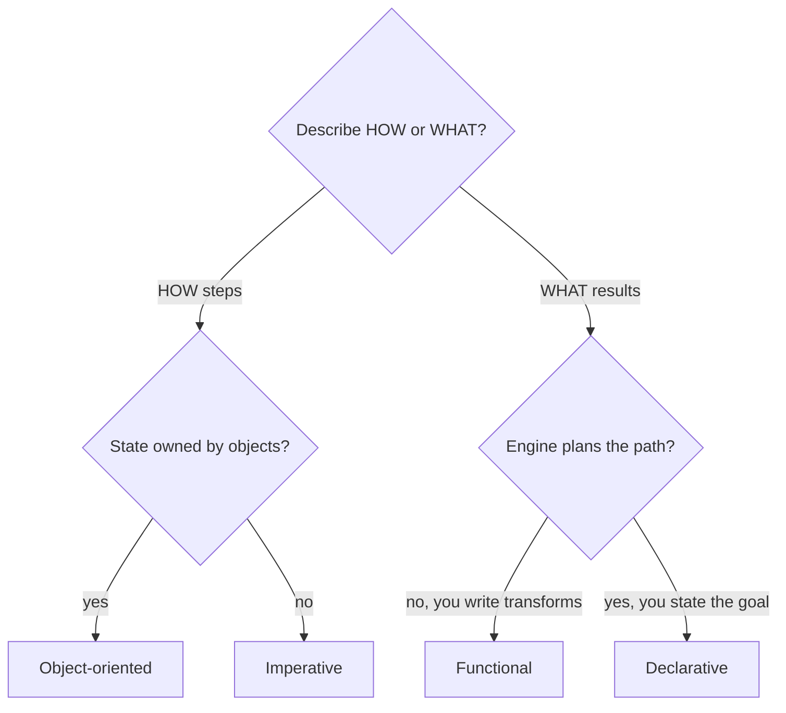

# Paradigms and when to mix them

## Why this matters

It's a Tuesday afternoon and you're staring at a function called `processOrders`. It's 240 lines long. It loops over orders, mutates a running `total`, pushes to three different arrays, flips a `hasError` boolean, and occasionally `break`s out of the loop early when a flag is set inside a nested `if`. A bug report says the tax total is wrong for orders with mixed regions. You start reading at line 1 to figure out what the state looks like by line 130, and you realize you can't — the only way to know `total`'s value at any point is to mentally execute every iteration. Three engineers have touched this function and each one added another mutable variable rather than risk understanding the existing ones.

The function isn't wrong because it's imperative. It's hard because it conflates a dozen independent computations into one mutable timeline. The same logic, expressed as a pipeline — filter the orders, group them by region, map each group to a tax subtotal, sum the subtotals — would let you point at the tax bug in one named step and unit-test it in isolation. The fix isn't "use functional programming." The fix is knowing that *this particular shape of problem* (a data transformation) reads better as a series of transformations than as a stateful loop, and recognizing when the reverse is true.

That recognition is the skill this chapter is about. Paradigms are not tribes you join. They're tools with different ergonomics for different shapes of problem, and a senior engineer fluidly mixes four of them in a single file without ceremony. The cost of not knowing this is the 240-line function — code that works but that nobody can safely change, written by people who only had one hammer.

## Mental model

Strip away the marketing and there are four paradigms you'll actually use, distinguished by two questions: *do you describe steps or results?* and *where does state live?*

| Paradigm | You describe | State | Reads best for |
|---|---|---|---|
| **Imperative** | the steps (how) | mutable, explicit | tight loops, performance-critical inner code, low-level I/O |
| **Object-oriented** | objects that own state + behavior | encapsulated in objects | domain modeling, stateful entities with invariants, plugin boundaries |
| **Functional** | transformations of values (what) | immutable, passed through | data pipelines, transformations, anything you want to test in isolation |
| **Declarative** | the desired result, not the path | hidden in the engine | queries, configuration, UI as a function of state, build rules |

These aren't four points; they're a gradient. Object-oriented is imperative-with-encapsulation. Declarative is functional-taken-further, where you don't even write the transformation steps — you state the goal and let an engine (SQL planner, React reconciler, the OS scheduler) figure out the path.



The load-bearing insight: **the boundary between WHAT and HOW is the seam where bugs hide.** Imperative code interleaves what you want with how you get it, so to understand the *what* you must simulate the *how* in your head. Functional and declarative code separate them, so you can read intent without tracing execution. That separation is the entire reason to reach for a different paradigm — not purity, not fashion. You pay for it with indirection and sometimes performance, which is why imperative never goes away.

A second axis sits underneath the table and is worth making explicit, because it predicts how a paradigm behaves under pressure: **how much state is reachable from any given line.** In a deeply imperative function, the reachable state is every mutable local plus everything those locals point at — the surface a bug can hide in grows with each variable you add. In a pure function, the reachable state is exactly the arguments; nothing else can affect the result and the result can affect nothing else. Object orientation shrinks the reachable state to one object's fields behind a method boundary. Declarative code hands the state to an engine entirely. When you choose a paradigm, you are really choosing how large a blast radius each line gets, and that choice is what makes code easy or impossible to change six months later.

## In practice

### The same problem, two ways

Take a concrete task: given a list of orders, compute the total revenue from completed orders over $100, grouped by region. First, imperatively, in TypeScript:

```typescript
function revenueByRegion(orders: Order[]): Map<string, number> {
  const result = new Map<string, number>();
  for (const order of orders) {
    if (order.status !== "completed") continue;
    if (order.amount <= 100) continue;
    const current = result.get(order.region) ?? 0;
    result.set(order.region, current + order.amount);
  }
  return result;
}
```

Now functionally, with the same language:

```typescript
function revenueByRegion(orders: Order[]): Map<string, number> {
  return orders
    .filter((o) => o.status === "completed")
    .filter((o) => o.amount > 100)
    .reduce((acc, o) => {
      acc.set(o.region, (acc.get(o.region) ?? 0) + o.amount);
      return acc;
    }, new Map<string, number>());
}
```

Both are correct. The functional version names each stage — *filter by status, filter by amount, fold into a map* — so when the bug report says "the $100 threshold should be inclusive," you change one line whose intent is obvious. The imperative version fuses the stages into one loop body where a `continue` and a guard live three lines apart from the accumulation, and you have to read the whole body to know what it does.

But the imperative version has a real advantage: it makes **one pass** over the data. The chained `.filter().filter()` allocates two intermediate arrays. For ten orders, nobody cares. For ten million in a hot path, the imperative loop (or a lazy iterator) wins decisively. This is the actual tradeoff, stated plainly: functional reads better and tests better; imperative controls allocation and short-circuiting. Pick by context, not by ideology.

A subtle point hides in the functional version: its `.reduce` mutates the `Map` accumulator on every iteration. That is fine — the mutation never escapes the function, so callers can't observe it — but it shows that "functional" is about *observable* immutability at the boundary, not a religious ban on every `=`. Local mutation inside a function with no escaping references is functional in spirit. The thing you are protecting is the caller's ability to reason about your function as `input -> output` with nothing else moving.

### When imperative is the right answer

Here's the inverse — code that fights you when forced into a functional mold. A binary search:

```python
def binary_search(items: list[int], target: int) -> int:
    lo, hi = 0, len(items) - 1
    while lo <= hi:
        mid = (lo + hi) // 2
        if items[mid] == target:
            return mid
        if items[mid] < target:
            lo = mid + 1
        else:
            hi = mid - 1
    return -1
```

*The same idea in TypeScript:*

```typescript
function binarySearch(items: number[], target: number): number {
  let lo = 0;
  let hi = items.length - 1;
  while (lo <= hi) {
    const mid = Math.floor((lo + hi) / 2);
    if (items[mid] === target) {
      return mid;
    }
    if (items[mid] < target) {
      lo = mid + 1;
    } else {
      hi = mid - 1;
    }
  }
  return -1;
}
```

This is intrinsically about *mutating two indices in a loop until they converge*. There is no natural list of values to transform. A "functional" binary search via recursion is fine, but the loop-and-mutate version is the clearest expression of the algorithm, and pretending otherwise produces worse code. Algorithms with index arithmetic, in-place sorts, and state machines are imperative at heart. Don't fight that.

### Object-oriented where invariants live

Objects earn their keep when state has rules that must always hold. A bank account can't go negative; that invariant should live in one place that owns the balance:

```typescript
class Account {
  #balance: number;
  constructor(initial: number) {
    if (initial < 0) throw new Error("initial balance must be >= 0");
    this.#balance = initial;
  }
  withdraw(amount: number): void {
    if (amount > this.#balance) throw new Error("insufficient funds");
    this.#balance -= amount;
  }
  get balance(): number {
    return this.#balance;
  }
}
```

The private `#balance` is unreachable except through methods that enforce the rule. This is OO doing the one thing it does better than anything else: bundling state with the invariants that protect it, behind a boundary. Notice it's still imperative *inside* — `this.#balance -= amount` is a mutation. OO is imperative code with a guard rail around the state. The payoff is that the invariant "balance is never negative" is enforced in exactly one place; no caller can break it, and a reviewer who wants to trust that rule only has to read this class, not every call site.

### Declarative: state the goal, not the path

You write declarative code constantly without naming it. SQL is the purest example:

```sql
SELECT region, SUM(amount) AS revenue
FROM orders
WHERE status = 'completed' AND amount > 100
GROUP BY region;
```

This is the *exact same computation* as the TypeScript above, but you never wrote a loop or a fold. You stated the result and the query planner chose the path — index scan, hash aggregate, parallel workers. React is the same idea applied to UI: you declare what the DOM should look like for a given state, and the reconciler computes the mutations. The win is enormous when the engine is smart; the cost is that when it's *not* doing what you want, you're debugging someone else's optimizer instead of your own loop.

### Mixing them in one file, on purpose

Real code blends all four. A request handler is typically declarative at the edges, functional in the middle, imperative in the hot spots, and OO around stateful resources:

```python
# declarative: the route is a config, not code you execute
@app.post("/orders/{order_id}/refund")
def refund(order_id: int):
    order = repo.get(order_id)           # OO: repo owns the connection + caching
    refundable = compute_refundable_lines(order.lines)  # functional: pure, testable
    total = 0                            # imperative: a simple, clear fold
    for line in refundable:
        total += line.amount
    return {"refund_total": total}       # declarative again: serializer decides the path
```

*The TypeScript equivalent:*

```typescript
// declarative: the route is a config, not code you execute
app.post("/orders/:orderId/refund", (req, res) => {
  const order = repo.get(Number(req.params.orderId)); // OO: repo owns the connection + caching
  const refundable = computeRefundableLines(order.lines); // functional: pure, testable
  let total = 0; // imperative: a simple, clear fold
  for (const line of refundable) {
    total += line.amount;
  }
  res.json({ refund_total: total }); // declarative again: serializer decides the path
});
```

This is not paradigm soup. Each layer uses the paradigm that fits its job: routing is declared, business logic is a pure function you can test without a database, the accumulation is a plain loop because it's clearer than a marginally faster `sum(...)`, and the repository encapsulates a stateful connection. The skill is choosing per-region, not per-codebase. The seams between these regions are where you put your tests: the pure `compute_refundable_lines` gets fast unit tests with no fixtures, the OO `repo` gets an integration test against a real database, and the declarative route gets a contract test. When paradigms are mixed on purpose, the test strategy falls out of the structure for free.

> **Connect the dots:** The push toward immutability and pure functions here is the same force behind Git's content-addressable store in Part 3 (immutable objects keyed by hash) and behind functional reactive UI in Part 6. "Don't mutate; derive a new value" is one idea wearing different clothes across the stack.

> **Security note:** Paradigm choice is a security boundary more often than it looks. Shared mutable state passed across a trust boundary is a classic source of time-of-check-to-time-of-use bugs: validate an object in one function, and if anything else holds a reference and mutates it before use, your check is stale. Pure functions and immutable values close that hole by construction. Declarative engines carry the opposite risk — a leaky abstraction can turn user input into the path itself, which is exactly what SQL injection is: a string that was meant to be data becomes part of the query the engine executes. The defense is the same in both directions: keep data as data, make mutation visible, and parameterize anything the engine will interpret.

## Pitfalls and anti-patterns

**1. The 240-line imperative megafunction.** One function, a dozen mutable locals, nested loops, early `break`s gated by flags set fifty lines earlier. *Recognize it* when you can't say what a variable holds without mentally executing from the top. *Fix it* by extracting each independent computation into a named pure function, then composing them; the mutable timeline becomes a readable pipeline, and each piece becomes unit-testable in isolation.

**2. Functional cargo-culting (`.reduce` for everything).** Reaching for `.map`/`.filter`/`.reduce` even when a `for` loop is clearer, especially a `reduce` that rebuilds an object every iteration just to avoid a visible mutation. *Recognize it* when readers have to decode the reduce's accumulator to understand a simple sum or grouping. *Fix it* by using the plain loop — local mutation inside a function with no escaping references is perfectly functional in spirit and far clearer. Purity that nobody can read is a net loss.

**3. Kingdom-of-nouns over-objectification.** Wrapping every verb in a class — `OrderProcessor`, `RefundCalculatorFactory`, `TaxStrategyManager` — when a plain function would do. *Recognize it* by classes with no fields and a single method, or names ending in `-er`/`-Manager`/`-Factory` that only ever hold one method. *Fix it* by making them functions. Reserve classes for things that genuinely own state with invariants.

**4. Leaky declarative abstractions you can't debug.** Trusting a declarative engine (ORM, query builder, reactive framework) until it generates a catastrophic query or an infinite re-render, then having no mental model of what it's doing underneath. *Recognize it* in the production incident where the ORM emits an N+1 query storm. *Fix it* by always knowing the imperative path your declarative code compiles to — read the generated SQL, the render trace — and dropping to a lower level when the engine guesses wrong.

**5. Shared mutable state across paradigm boundaries.** Passing a mutable object into a "pure" function that quietly mutates it, so callers get spooky action at a distance. *Recognize it* when a function with a value-returning signature also changes its arguments. *Fix it* by making the boundary explicit: either return a new value and don't touch the input, or name the function so the mutation is obvious (`sortInPlace`, not `sorted`).

## Production checklist

- [ ] Default to immutable data and pure functions for business logic; reserve mutation for local, non-escaping scope and measured hot paths
- [ ] Keep classes for state-with-invariants; if a class has no fields or one method, make it a function
- [ ] Push side effects (I/O, mutation, logging) to the edges; keep the core a pure transformation you can test without mocks
- [ ] For data transformations, prefer a named pipeline of stages over one fused loop — unless profiling shows the allocations matter
- [ ] When using a declarative engine (ORM, query builder, reactive UI), be able to see and reason about the imperative path it generates
- [ ] Never pass a mutable value into a function that looks pure; name in-place mutators so the side effect is visible at the call site
- [ ] Don't refactor a working imperative function to functional purely for style; refactor when it's hard to change or hard to test
- [ ] In code review, flag paradigm chosen for fashion over fit (gratuitous `reduce`, needless factory classes) the same way you'd flag a bug

## Exercises

1. **(Comprehension)** Take the `revenueByRegion` function in both its imperative and functional forms above. Without running them, identify exactly which line you'd change to make the `$100` threshold inclusive in each version, and explain why the change is easier to locate in one than the other. Then state the runtime cost the functional version pays that the imperative one doesn't.

2. **(Applied)** Find a function in your own codebase longer than ~80 lines that mixes looping, mutation, and branching. Extract the independent computations into named pure functions and recompose them into a pipeline. Write a unit test for one extracted function that would have been impossible to write against the original. Measure: did total line count go up or down, and did the bug surface area shrink?

3. **(Design)** You're building a rules engine that lets non-engineers configure discount logic (e.g., "10% off orders over $200 from new customers in the EU"). Sketch which paradigm governs each layer: how the rules are *expressed* (declarative config? a small DSL?), how they're *evaluated* (functional predicates? an OO strategy hierarchy?), and where imperative code is unavoidable. Name the tradeoffs of letting non-engineers write declarative rules versus giving them a constrained UI that generates the rules, and state which you'd ship first and why.

## Further reading

- John Backus, ["Can Programming Be Liberated from the von Neumann Style?"](https://dl.acm.org/doi/10.1145/359576.359579) — the 1977 Turing Award lecture that framed functional programming as an escape from imperative state; still the clearest argument for the *why*.
- Harold Abelson and Gerald Jay Sussman, *Structure and Interpretation of Computer Programs* (free at https://mitpress.mit.edu/sites/default/files/sicp/index.html) — chapters 1–3 build the imperative/functional contrast from first principles.
- John Hughes, ["Why Functional Programming Matters"](https://www.cs.kent.ac.uk/people/staff/dat/miranda/whyfp90.pdf) — makes the case for composition and laziness as engineering tools, not academic toys.
- Sandi Metz, *Practical Object-Oriented Design in Ruby* — the most pragmatic treatment of when objects earn their keep and when they don't.
- Brian Kernighan and Dennis Ritchie, *The C Programming Language* — read it to internalize when imperative, index-level code is simply the right tool.
- E. F. Codd, ["A Relational Model of Data for Large Shared Data Banks"](https://dl.acm.org/doi/10.1145/362384.362685) — the origin of declarative querying; SQL is its direct descendant.
