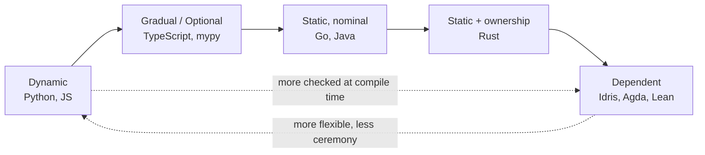

# Type systems, from dynamic to dependent

## Why this matters

It's a Tuesday afternoon. A checkout service has been running fine for months, and then orders from one region start failing with a 500. The stack trace points at a single line: `total = subtotal + shipping`. Both values came back from a JSON API. `subtotal` is a number. `shipping`, for this one carrier, came back as the string `"0"`. In JavaScript, `19.99 + "0"` is `"19.990"`, which flows downstream into a Stripe charge as a malformed amount, and the payment gateway rejects it. The bug isn't in your logic. It's in your assumption that a value was a number when the runtime never promised that.

This is the entire subject of type systems in one incident. A type checker exists to turn a class of "the value wasn't the shape I thought" runtime failures into compile-time errors you fix before shipping. The string-concatenation bug above is caught for free by TypeScript the moment you declare `shipping: number` and the API client returns `string`. It costs you nothing at runtime and a few minutes of annotation. The cost of not having it was a production incident, a postmortem, and a refund batch.

But types are not free, and they are not omnipotent. They add annotation overhead, they constrain how fast you can prototype, and there is a hard ceiling on what they can prove. A type system can guarantee `shipping` is a `number`. It cannot, in mainstream languages, guarantee that number is non-negative, or that it's in the same currency as `subtotal`, or that the array index you're about to use is in bounds. Knowing exactly where that ceiling sits — and how to raise it when the stakes justify the cost — is the difference between an engineer who fights the type checker and one who uses it as leverage.

## Mental model

A type system is a lightweight, automated proof checker. You write down claims about your values ("this is a `User`", "this returns a `Promise<number>`"), and the checker verifies those claims are internally consistent before the code runs. The richer the claims a system can express, the more bugs it can rule out — and the more work you do to convince it.

Languages sit on a gradient. At one end, dynamic typing checks nothing until a value is actually used at runtime. At the other, dependent types let a type depend on a *value*, so you can encode "a vector of length `n`" or "a sorted list" directly in the type and have the compiler prove it. Mainstream production languages live in the middle.



Two orthogonal distinctions cut across this gradient and cause most confusion:

**When checking happens.** *Dynamic* systems (Python, JavaScript, Ruby) attach types to values at runtime and check on use. *Static* systems (Go, Rust, Java, TypeScript) check types at compile time against the program text. *Gradual* systems (TypeScript over JS, Python with type hints + mypy) let the two coexist: annotated regions are checked statically, unannotated regions fall back to dynamic, and an explicit boundary (`any` in TS, untyped code in mypy) marks where the guarantee stops.

**How types are compared.** *Nominal* typing (Go, Java, Rust, C#) says two types are compatible only if they share a declared name or explicit relationship. *Structural* typing (TypeScript, Go's interfaces) says they're compatible if their shapes match, regardless of name. A `Point2D` and a `Vector2D` with the same fields are interchangeable structurally but distinct nominally.

Hold these two axes — *when* and *how* — separately. "Static vs. dynamic" is about timing. "Nominal vs. structural" is about identity. TypeScript is static and structural. Go is static and mostly nominal (with structural interfaces). Conflating the two is why people say contradictory things about the same language.

A third concept rides on top of both: **inference**. A static type system does not require you to annotate every binding. TypeScript, Rust, and modern C++ all infer the type of a local from its initializer, so `const x = first([1, 2, 3])` gives `x` the type `number | undefined` without a single annotation. The practical rule is to annotate the *boundaries* — function parameters, return types, exported values — and let inference fill the interior. That keeps signatures self-documenting (the parts other code depends on) while sparing you from restating types the compiler already knows.

## In practice

### The dynamic-to-static gradient on one bug

Here is the same defect — passing a misshapen object to a function — in four languages, ordered by how early each catches it.

Python, no annotations. Nothing is checked until the attribute access fails at runtime, possibly deep in production:

```python
def greet(user):
    return f"Hello, {user.name}"

greet({"name": "Ada"})   # AttributeError: 'dict' has no attribute 'name'
                         # ...but only when this line actually runs
```

Python with type hints, checked by `mypy` before running:

```python
from dataclasses import dataclass

@dataclass
class User:
    name: str

def greet(user: User) -> str:
    return f"Hello, {user.name}"

greet({"name": "Ada"})
# mypy: error: Argument 1 to "greet" has incompatible type
#        "dict[str, str]"; expected "User"
```

The hints are optional and erased at runtime — Python still runs the broken call if you skip `mypy`. That's gradual typing: the guarantee exists only where you opt in and run the checker.

TypeScript, where the check is part of the normal build:

```typescript
interface User { name: string }

function greet(user: User): string {
  return `Hello, ${user.name}`;
}

greet({ nam: "Ada" });
// error TS2561: Object literal may only specify known properties,
// and 'nam' does not exist in type 'User'. Did you mean 'name'?
```

Rust, where the program will not compile at all:

```rust
struct User { name: String }

fn greet(user: &User) -> String {
    format!("Hello, {}", user.name)
}

fn main() {
    greet(&User { nam: "Ada".into() });
    // error[E0560]: struct `User` has no field named `nam`
}
```

Same conceptual bug, four points on the gradient: Python catches it never (or at runtime), mypy catches it if you run it, TypeScript catches it during `tsc`, Rust refuses to produce a binary.

### Structural vs. nominal, made concrete

TypeScript is structural. If the shape fits, it's accepted — no declaration of intent required:

```typescript
interface Named { name: string }

function printName(x: Named) { console.log(x.name); }

class Dog { constructor(public name: string, public breed: string) {} }

printName(new Dog("Rex", "Corgi")); // OK — Dog structurally satisfies Named
printName({ name: "Rex" });          // OK — plain object also fits
```

Go interfaces are also structural — a type satisfies an interface by having the methods, with no `implements` keyword — but Go *struct* types are nominal:

```go
type Celsius float64
type Fahrenheit float64

func freezing() Celsius { return 0 }

var f Fahrenheit = freezing() // compile error: cannot use Celsius as Fahrenheit
```

Both are `float64` underneath, but the names make them incompatible. This is a feature: it stops you from adding a temperature in Celsius to one in Fahrenheit, the same way nominal typing would have caught a currency mismatch in the checkout bug. Structural typing buys flexibility and easy mocking; nominal typing buys *meaning* — the ability to say "these bytes are not interchangeable even though they're the same primitive."

> Connect the dots: structural typing is why TypeScript meshes so naturally with JSON APIs and React props (Part 4) — you describe the shape you expect and any matching object flows through. Nominal newtypes are the type-level version of the value-object discipline you'll see in domain modeling and database schema design (Part 5).

### Generics: writing code once over many types

Without generics you either duplicate code per type or fall back to an untyped escape hatch (`any`, `interface{}`, `Object`) and lose the guarantee. Generics let you write the code once while keeping the types connected:

```typescript
function first<T>(xs: T[]): T | undefined {
  return xs[0];
}

const n = first([1, 2, 3]);     // n: number | undefined
const s = first(["a", "b"]);    // s: string | undefined
```

The `T` ties input to output: pass `number[]`, get `number | undefined`. The `| undefined` is the type system being honest that an empty array has no first element — a thing dynamic code silently ignores until it explodes.

Rust generics add *bounds* — constraints proven at compile time — and monomorphize to zero-cost concrete code:

```rust
fn largest<T: PartialOrd + Copy>(list: &[T]) -> T {
    let mut max = list[0];
    for &item in list {
        if item > max { max = item; }
    }
    max
}
```

The `T: PartialOrd + Copy` bound says "this works for any type that can be compared and copied." Try to call `largest` on a type that can't be ordered and the compiler rejects it with a clear message, before any code runs.

Generics also raise a subtler question the type system has to answer for you: **variance**. If a `Dog` is a `Animal`, is a `List<Dog>` a `List<Animal>`? Sometimes yes (you only read from it), sometimes no (you might write a `Cat` into it and break the `Dog` invariant). Languages encode this differently — TypeScript infers variance from how a type parameter is used, Java has call-site wildcards (`? extends`, `? super`), Rust ties it to ownership and lifetimes. You rarely write the word "variance," but it's the reason an assignment between two generic types that "look compatible" is sometimes rejected. When that happens, ask whether the position you're using the value in is a *read* (covariant) or a *write* (contravariant), and the error usually explains itself.

### Sum types and exhaustiveness

The generics above are about reusing one piece of code over many types. The other half of a good type vocabulary is modeling a value that is *exactly one of* several shapes — a result that is a success or an error, a UI state that is loading, loaded, or failed. These are *sum types* (also called tagged unions, discriminated unions, or enums with data), and they pay off most when the compiler forces you to handle every case:

```rust
enum Shape {
    Circle { radius: f64 },
    Rect { w: f64, h: f64 },
}

fn area(s: &Shape) -> f64 {
    match s {
        Shape::Circle { radius } => std::f64::consts::PI * radius * radius,
        Shape::Rect { w, h } => w * h,
    } // add a third variant and this match fails to compile until you handle it
}
```

The win is *exhaustiveness*: when someone adds a `Triangle` variant next quarter, the compiler points at every `match` that no longer covers all cases, instead of letting a forgotten branch fall through to a wrong default at runtime. TypeScript gets the same property from discriminated unions plus a `never`-typed default branch, and it converts a whole category of "I forgot to handle that state" bugs into compile errors.

### A bug a type system catches, and one it cannot

Types catch *shape* errors. Watch one disappear. This compiles in plain JS and returns `NaN` at runtime; TypeScript stops it cold:

```typescript
function area(r: { width: number; height: number }): number {
  return r.width * r.heigth; // typo
  // error TS2551: Property 'heigth' does not exist on type
  //   '{ width: number; height: number; }'. Did you mean 'height'?
}
```

Now a bug the *same* type system cannot catch. The shapes are perfect; the *logic* is wrong:

```typescript
function area(r: { width: number; height: number }): number {
  return r.width + r.height; // should be *, not + — but types are fine
}
```

Every type is correct. `width` is a `number`, `height` is a `number`, their sum is a `number`, the return type matches. The checker is satisfied and the rectangle's "area" is its half-perimeter. No mainstream type system in production catches this, because it requires reasoning about *what the value should be*, not its shape.

This is the ceiling. To raise it you need *dependent types*, where types can talk about values. In Idris you can index a vector by its length and have the compiler reject a program that confuses the two:

```idris
-- A Vect carries its length in its type.
-- append produces a vector whose length is provably the sum.
append : Vect n a -> Vect m a -> Vect (n + m) a

-- This will not typecheck — the lengths don't add up:
-- bad : Vect 3 Int
-- bad = append [1, 2] [3, 4]   -- 2 + 2 = 4, not 3
```

Here the type `Vect (n + m) a` is a proof obligation: the compiler checks the arithmetic. This is enormously powerful and almost nobody uses it in production, because the proof burden is high and most teams get better return from tests for value-level correctness. The pragmatic lesson: push *shape* correctness into the type system, where it's nearly free, and cover *value* correctness with tests, assertions, and runtime validation at trust boundaries.

### Validating at the boundary

The string-vs-number checkout bug teaches the most important practical rule: static types describe your *program's* internals, but data crossing a boundary (HTTP, JSON, env vars, a database row) is untyped at runtime. A TypeScript annotation is erased before the network ever responds. You need a runtime validator at the edge:

```typescript
import { z } from "zod";

const Order = z.object({
  subtotal: z.number(),
  shipping: z.number(), // rejects the string "0" at runtime
});

const order = Order.parse(await res.json()); // throws on bad shape
// order is now typed AND verified: { subtotal: number; shipping: number }
```

`zod` checks the shape at runtime and hands TypeScript a verified static type. This is the seam where the dynamic outside world meets your statically-typed code, and it's where the original incident would have been stopped.

> Security note: the trust boundary where you validate shape is the same boundary where injection and resource-exhaustion attacks arrive. A validator that only checks types is not a security control on its own — `z.string()` happily accepts a 50 MB string or a value carrying a SQL/command payload. Pair shape validation with bounds (max length, allowed enum values, numeric ranges) and treat validated-but-untrusted data as still untrusted for the purposes of escaping and parameterization. A second, related leak: rich compiler and validator error messages are wonderful in development and dangerous in production — echoing a raw parser error or a full stack trace back to a caller can disclose internal types, field names, and library versions. Log the detail server-side; return a generic, non-revealing error to the client.

## Pitfalls and anti-patterns

**The `any` escape hatch that quietly disables checking.** In TypeScript, `any` turns off type checking for that value and everything it touches downstream — a single `any` returned from a helper can silently un-type an entire call chain. Recognize it by `noImplicitAny` errors you "fixed" with explicit `any`, or by autocomplete mysteriously going dead. Fix it by using `unknown` instead (which forces you to narrow before use) and reserving `any` for genuine interop edges, flagged with a comment.

**Trusting annotations on data you didn't validate.** Casting an API response with `as User` or annotating a parsed JSON as a typed object tells the compiler to *assume* the shape — it proves nothing at runtime. The checkout bug lived exactly here. Recognize it by `as` casts near `fetch`, `JSON.parse`, `process.env`, or ORM raw queries. Fix it with a runtime schema validator (`zod`, `pydantic`, `io-ts`) at every trust boundary, and ban casts in code review.

**Over-modeling with types you have to fight.** Reaching for deeply nested generics, conditional types, or dependent-type-style encodings for a problem a test would cover in three lines. Recognize it by type signatures longer than the function body, or teammates who can't read the error messages. Fix it by asking whether the property you're encoding is *shape* (worth a type) or *value/logic* (worth a test). Default to the simplest type that catches shape errors.

**Confusing structural compatibility with intent.** In structurally-typed languages, two unrelated types with the same fields are interchangeable, so you can pass a `UserId` where a `ProductId` was meant if both are `string`. Recognize it by ID-mixup bugs and functions that accept far more than they should. Fix it with branded/nominal types (`type UserId = string & { readonly __brand: "UserId" }` in TS, newtype structs in Go/Rust) for values whose meaning matters.

**Letting the gradual boundary rot.** In a gradually-typed codebase, untyped (`any`/untyped Python) regions spread because the path of least resistance is to add another `any` at the interface. Recognize it by a `tsconfig` with `strict: false` that never gets tightened, or a mypy run with hundreds of ignored files. Fix it by enabling `strict` mode for new code, ratcheting coverage with per-file overrides, and treating each removed `any` as forward progress that's never given back.

## Production checklist

- [ ] TypeScript `strict: true` (or at minimum `noImplicitAny`, `strictNullChecks`) enabled in `tsconfig.json`
- [ ] Python projects run `mypy --strict` (or `pyright`) in CI, not just locally
- [ ] Type checking is a required CI gate that blocks merge, not an advisory warning
- [ ] Runtime validation (`zod`, `pydantic`, `io-ts`) at every trust boundary: HTTP handlers, queue consumers, env var parsing, `JSON.parse` — with bounds (length, range, enum), not just shape
- [ ] `any` / `interface{}` / untyped escape hatches are lint-flagged and require an inline justification comment
- [ ] Domain identifiers that share a primitive (`UserId`, `OrderId`, money amounts) use branded or newtype wrappers
- [ ] Generated types for external contracts (OpenAPI, GraphQL, DB schema) regenerated in CI so types track reality
- [ ] `strictNullChecks` on: nullable values are modeled explicitly (`T | undefined`, `Option<T>`), not assumed away
- [ ] Sum-typed states (result/error, loading/loaded/failed) are handled exhaustively, with a `never` default branch in TS
- [ ] Validator and compiler error detail is logged server-side, never returned verbatim to untrusted callers
- [ ] New modules start in strict mode; legacy `any` is ratcheted down, never added back

## Exercises

1. **(Comprehension)** For each of Python (no hints), TypeScript, Go, and Rust, state at exactly which moment the `r.heigth` typo from the chapter would be caught: never, at runtime, when a checker is run, or at compile time. Then explain in two sentences why "static vs. dynamic" and "nominal vs. structural" are independent axes, using TypeScript and Go as your examples.

2. **(Applied)** Take the checkout bug. Write a TypeScript function that fetches an order from an API and computes `subtotal + shipping`, where the API can return `shipping` as either a number or the string `"0"`. First reproduce the `"19.990"` concatenation bug. Then fix it two ways: (a) a `zod` schema that coerces or rejects at the boundary, and (b) a branded `Money` type that makes mixing currencies a compile error. Note which class of bug each fix addresses, and which it does not.

3. **(Design)** You maintain a 200k-line JavaScript codebase with frequent shape-mismatch incidents. Design a migration to gradual typing that delivers value incrementally and never blocks feature work. Decide: do you start with `tsc --checkJs` and JSDoc, or rename files to `.ts`? How do you prevent `any` from spreading? What's your CI ratchet? Where do runtime validators go, and how do you choose the first 5% of files to type? Defend your ordering.

## Further reading

- Benjamin C. Pierce, *Types and Programming Languages* (MIT Press, 2002) — the canonical textbook; chapters 1, 8, and 22 cover the foundations and parametric polymorphism.
- Jeremy Siek and Walid Taha, "Gradual Typing for Functional Languages" (Scheme and Functional Programming Workshop, 2006) — the paper that introduced and formalized gradual typing.
- [The TypeScript Handbook](https://www.typescriptlang.org/docs/handbook/2/everyday-types.html) — official docs; the sections on structural typing, generics, and narrowing are essential.
- [The Rust Programming Language](https://doc.rust-lang.org/book/ch10-00-generics.html), chapters 10 and 17 — generics, trait bounds, and how the type system enforces ownership.
- Edwin Brady, "Idris 2: Quantitative Type Theory in Practice" (ECOOP 2021) — dependent types in a usable language, including the length-indexed vector example.
- [PEP 484 — Type Hints](https://peps.python.org/pep-0484/) — the proposal that brought gradual typing to Python, with the rationale for erasure-at-runtime semantics.
