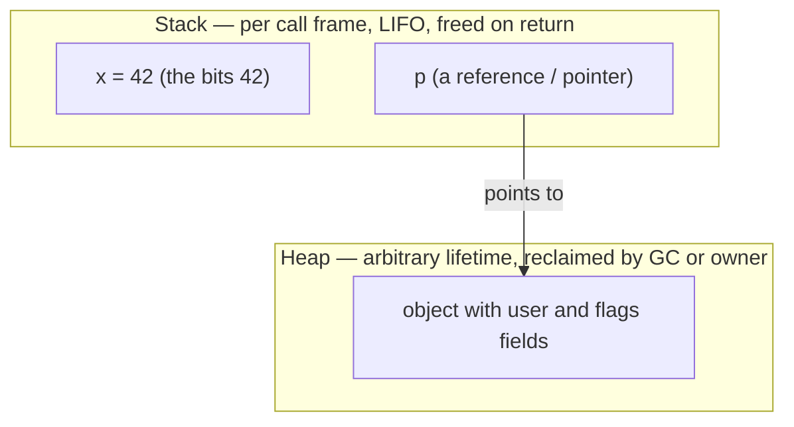

# Memory models in three languages

## Why this matters

It's a Tuesday afternoon and your Node service is returning the wrong default config to a small fraction of users. The function looks innocent: `getConfig(overrides = {})` merges some defaults into an options object and returns it. Tests pass. Code review approved it. But in production, requests are bleeding settings into each other — user B sees a flag that user A flipped two requests ago.

You finally find it. Somewhere, a default value is a shared object literal, and the merge mutated it in place instead of copying. Every caller has been handed the *same* object, so every "local" change is global. The bug isn't in your logic. It's in your mental model of what `=` does to an object versus what it does to a number. You assumed assignment copies the value. In JavaScript, for objects, it copies a *reference*.

This class of bug — aliasing, shared mutable state, accidental capture of a reference you thought was a value — is one of the most expensive in software because it's invisible at the call site and intermittent at runtime. The fix is rarely clever. It's almost always "understand whether you're holding the thing or a pointer to the thing." Go, Python, and JavaScript each answer that question differently, and they each clean up memory differently. This chapter puts the three side by side so that "is this a copy or a reference?" stops being a thing you guess and becomes a thing you know.

## Mental model

Two questions decide almost everything about how a language treats your data:

1. **Where does it live** — on the stack (cheap, scoped, automatically reclaimed when the function returns) or on the heap (flexible lifetime, must be reclaimed somehow)?
2. **What does a variable hold** — the value itself, or a reference to a value living elsewhere?



A value-semantics variable (`x = 42`) holds the bits directly; assigning it elsewhere copies the bits, and the two copies are independent. A reference-semantics variable holds an address; assigning it copies the *address*, and now two variables alias one heap object. Mutate through one, and the other sees the change. That single distinction is the root of the opening bug.

The three languages sit at different points:

- **Go** — value semantics by default. A `struct` is copied on assignment and on function call. You opt into sharing explicitly with pointers (`*T`, `&x`). Memory is reclaimed by a concurrent tracing garbage collector. The compiler's *escape analysis* decides whether a given allocation can live on the stack or must go to the heap.
- **Python** — everything is a reference to a heap object; "variables" are names bound to objects. Immutable objects (`int`, `str`, `tuple`) *feel* like value semantics because you can't mutate them in place; mutable ones (`list`, `dict`, custom objects) expose aliasing directly. Memory is reclaimed primarily by reference counting, with a cycle-detecting tracing collector as backstop.
- **JavaScript** — primitives (`number`, `string`, `boolean`, `bigint`, `symbol`, `null`, `undefined`) have value semantics; objects, arrays, and functions have reference semantics. Memory is reclaimed by a tracing GC (V8's generational mark-and-sweep).

Garbage collection itself comes in two broad families. **Reference counting** keeps a live count of references on each object and frees it the instant the count hits zero — predictable, incremental, but it can't reclaim reference cycles on its own. **Tracing** periodically walks the graph of reachable objects from a set of roots (stack, globals) and reclaims everything it can't reach — handles cycles, but introduces pauses and needs to run at unpredictable times. CPython uses both: refcounting for the common case, tracing for cycles.

There is a deeper reason this matters beyond correctness. Value semantics buy you *local reasoning*: when you can prove a function received its own copy, you can reason about that function without thinking about every other place the data might be visible. Reference semantics trade that away for cheap sharing — passing a pointer is O(1) regardless of how large the structure is, and two parts of a program can observe one mutation. Neither is universally better. The skill is knowing which contract you are operating under at each line, because the language will not warn you when you guess wrong.

> **Connect the dots:** The "is it a copy or a reference?" question reappears one layer up in Part 4 (databases) as the difference between passing a row by value versus holding a cursor, and again in Part 5 (distributed systems) as value vs. reference replication. The instinct you build here transfers.

## In practice

### The aliasing bug, three ways

Here is the opening bug, minimal, in JavaScript:

```javascript
function addItem(cart = { items: [] }, item) {
  cart.items.push(item);
  return cart;
}

const a = addItem(undefined, "apple");  // default object created
const b = addItem(undefined, "banana"); // FRESH default each call -- fine
console.log(a.items, b.items); // ['apple'] ['banana']  -- correct
```

Default *parameter* values in JS are re-evaluated per call, so that version is actually safe. The real footgun is a default defined *once*, at module scope:

```javascript
const DEFAULTS = { items: [] };

function addItemBad(cart = DEFAULTS, item) {
  cart.items.push(item);
  return cart;
}

const a = addItemBad(undefined, "apple");
const b = addItemBad(undefined, "banana");
console.log(a.items); // ['apple', 'banana']  -- BUG: both calls aliased DEFAULTS
console.log(a === b); // true -- same object
```

Both calls received the *same* heap object because the default copies a reference, not the structure. Python has the exact same trap, and it's more famous there because the default is evaluated **once at function definition time**:

```python
def add_item_bad(item, cart=[]):  # the [] is created ONCE, at def time
    cart.append(item)
    return cart

print(add_item_bad("apple"))   # ['apple']
print(add_item_bad("banana"))  # ['apple', 'banana']  -- BUG: shared default list
```

The fix in both languages is the same idea: don't share a mutable default; create a fresh one inside the call.

```python
def add_item(item, cart=None):
    if cart is None:
        cart = []        # fresh list per call
    cart.append(item)
    return cart
```

```javascript
function addItem(item, cart) {
  cart = cart ?? { items: [] };                     // fresh per call
  return { ...cart, items: [...cart.items, item] }; // and don't mutate the input
}
```

The second JS version goes further: it never mutates its argument at all, returning a new object instead. That's the most robust fix, because it removes the aliasing hazard regardless of what the caller passed.

Now Go. Go's value semantics make the *struct* case safe by default — but a slice inside a struct still shares a backing array, so the trap returns the moment a reference type is involved:

```go
type Cart struct {
	Items []string
}

func addItem(c Cart, item string) Cart {
	c.Items = append(c.Items, item) // c is a COPY of the struct...
	return c                        // ...but Items may share a backing array
}
```

Passing `Cart` by value copies the struct header — including the slice header (pointer, length, capacity) — but **not** the underlying array. If two carts were sliced from the same array with spare capacity, `append` can write into shared memory. The safe pattern is to copy explicitly when you need isolation:

```go
func addItemSafe(c Cart, item string) Cart {
	items := make([]string, len(c.Items), len(c.Items)+1)
	copy(items, c.Items)            // independent backing array
	items = append(items, item)
	return Cart{Items: items}
}
```

The Go case is the most instructive of the three because it shows that "value semantics" is not a single guarantee that covers a whole object — it covers exactly the top-level value and stops at the first reference type inside it. A `struct` is copied; a slice, map, channel, or pointer field inside that struct still points at shared memory. This is why "Go passes by value" is true but dangerously incomplete advice.

### Value vs. reference, made visible

```python
# Python: names bind to objects; mutables alias
a = [1, 2, 3]
b = a            # b and a name the SAME list
b.append(4)
print(a)         # [1, 2, 3, 4]  -- aliased

c = a[:]         # slice copies the list (shallow)
c.append(5)
print(a)         # [1, 2, 3, 4]  -- unaffected
```

```go
// Go: structs copy on assignment
type Point struct{ X, Y int }
p := Point{1, 2}
q := p           // q is an independent COPY
q.X = 99
fmt.Println(p.X) // 1 -- p is untouched

r := &p          // r is a pointer; *r aliases p
r.X = 99
fmt.Println(p.X) // 99 -- mutated through the pointer
```

```javascript
// JavaScript: primitives copy, objects alias
let n = 42, m = n;       // copy
m = 99;
console.log(n);          // 42

let o = { x: 1 }, p = o; // alias
p.x = 99;
console.log(o.x);        // 99
```

Notice that the Python `c = a[:]` copy is *shallow*: it makes a new list, but the elements inside are still shared references. If the list held mutable objects rather than integers, mutating one of those objects through `c` would still be visible through `a`. The same caveat applies to JavaScript's `{ ...obj }` spread and `Object.assign` — one level deep. Deep isolation costs a deep copy (`copy.deepcopy` in Python, `structuredClone` in modern JS), and you should reach for it only when you actually need it, because copying a large graph is not free.

### Stack, heap, and escape analysis in Go

In Go you don't choose stack vs. heap; the compiler does, via escape analysis. If a value's lifetime can't be proven to end with the function, it "escapes" to the heap. You can see the decision:

```go
func stackAlloc() int {
	x := 42      // stays on the stack -- never escapes
	return x
}

func heapAlloc() *int {
	x := 42      // escapes: a pointer to x outlives the frame
	return &x
}
```

```text
$ go build -gcflags='-m' ./...
./main.go:8:2: moved to heap: x   # in heapAlloc
```

Returning `&x` from a function is perfectly safe in Go (unlike C), precisely because escape analysis promotes `x` to the heap and the GC keeps it alive as long as a reference exists. The cost is a heap allocation and eventual GC work instead of a free stack pop. This is the practical payoff of understanding the model: in a hot loop, an accidental escape (often caused by passing a value to an `interface{}` parameter, or capturing it in a closure) turns a free stack allocation into heap traffic the garbage collector must later reclaim. You won't see it in correctness tests; you'll see it as allocation pressure in a profile. `go build -gcflags='-m'` and `go test -benchmem` are how you make that visible before it reaches production.

### Watching reference counts in CPython

```python
import sys

a = []
print(sys.getrefcount(a))  # the count is current refs plus the temporary arg
b = a
print(sys.getrefcount(a))  # one higher than before
del b
print(sys.getrefcount(a))  # back down by one
```

The absolute numbers `getrefcount` reports are implementation details and shift between CPython versions, so treat the *deltas*, not the absolute values, as the lesson: binding another name raises the count, dropping a name lowers it. When the count drops to zero, CPython frees the object immediately — deterministic, unlike a tracing GC. But cycles defeat pure refcounting:

```python
import gc
a = {}
a["self"] = a          # a references itself: refcount never hits 0
del a                  # object is now unreachable but still counted
gc.collect()           # the cycle detector reclaims it
```

This is why CPython ships *both* mechanisms. The refcounter handles the common case promptly; the cyclic collector sweeps the cases refcounting can't. The tradeoff is real: refcounting gives you prompt, predictable cleanup (a file handle held by an object closes the moment the last reference drops) at the cost of touching a counter on every assignment, while tracing collectors avoid that per-assignment cost but reclaim memory only when they run.

## Pitfalls and anti-patterns

**1. The mutable default argument (Python) / shared default object (JS).** Recognize it when a function "remembers" data across calls it should treat as fresh, or when two independent calls return `===`/`is`-identical objects. Fix: default to `None`/`undefined` and construct a fresh mutable inside the function body. Never put a `[]`, `{}`, or `dict()` directly in a default slot.

**2. Mutating a shared argument instead of returning a new value.** A function does `obj.field = ...` or `arr.push(...)` on something the caller still holds. Recognize it when callers see "spooky action at a distance" after calling your function. Fix: prefer pure functions that return new values (`{...obj, field}`, `[...arr, x]`, a copied struct). If you must mutate in place, name the function so it's obvious (`mutateInPlace`, `sortMut`) and document it.

**3. Assuming Go's value semantics make slices and maps safe.** A function takes a `[]T` or `map[K]V` by value and assumes the callee can't affect the caller. But slice headers and maps are reference-like — the callee shares the backing array / hash table. Recognize it when a "pass by value" Go function still mutates caller data. Fix: `copy()` into a fresh slice, or clone the map, when you need isolation; document when a function retains or mutates a passed slice.

**4. Reference cycles that pin memory in refcounted runtimes.** Two objects reference each other (parent and child, or a closure capturing the object that holds it). In pure-refcount contexts the objects never reach zero. Recognize it via steadily climbing memory and objects that "should" be gone. Fix: break cycles explicitly, or use weak references (`weakref` in Python, `WeakMap`/`WeakRef` in JS) for back-pointers so they don't keep the target alive.

**5. Leaking via long-lived references you forgot about.** A growing cache, a global registry, or an event listener that captures a large closure keeps objects reachable, so a tracing GC will never collect them. Recognize it as a slow memory climb under steady load, no crash, eventual OOM. Fix: bound caches (LRU with a max size), remove event listeners on teardown, and use `WeakMap` keys so entries vanish when the key object is collected.

> **Security note:** Aliasing and lifetime bugs are not only correctness problems — they are a security surface. A mutable object shared across requests can leak one user's data into another user's response (the opening scenario, one HTTP request away from a cross-tenant data exposure). A use-after-free or buffer over-read in a memory-unsafe language is the classic root cause of information-disclosure and remote-code-execution CVEs; Go, Python, and JavaScript spare you the raw pointer arithmetic, but a retained reference to freed-in-spirit data (a closure holding a request's credentials in a long-lived cache) achieves the same leak at a higher level. Treat "who else can still see this object, and for how long?" as a security question, not just a memory one — and never log or serialize an object whose full contents you haven't audited, since shared references can pull in fields you didn't intend to expose.

## Production checklist

- [ ] No mutable literals (`[]`, `{}`, `dict()`, `set()`) as default argument values; default to `None`/`undefined` and construct inside
- [ ] Functions document whether they mutate arguments or return new values; "mutates in place" is named explicitly
- [ ] Hot paths in Go checked with `go build -gcflags='-m'` to confirm intended stack/heap allocation, and benchmarked with `-benchmem`
- [ ] Slices and maps passed across API boundaries are copied (or explicitly documented as shared) when the callee must not affect the caller
- [ ] Back-references and observer registrations use weak references (`weakref`, `WeakMap`, `WeakRef`) to avoid retention cycles and listener leaks
- [ ] Caches are bounded (max size or TTL); no unbounded global registries holding request-scoped data
- [ ] Request-scoped objects are never stored in module-level or process-global state that outlives the request (cross-tenant leak risk)
- [ ] Memory tested under sustained load (soak test), watching RSS for a slow climb, not just a single snapshot
- [ ] Python services that allocate large short-lived graphs have GC behavior reviewed (`gc.set_threshold`, or `gc.disable()` only with a deliberate manual-collect strategy)

## Exercises

1. **(Comprehension)** Predict the output of each of the three "value vs. reference" snippets above *before* running them, then run them and explain any surprise. For the Go `Point` example, change `r := &p` to `r := p` and explain in one sentence why the final `Println` changes.

2. **(Applied)** Take the Python `add_item_bad` function and write a test that fails because of the shared-default bug (two calls, asserting the first list is unchanged after the second call). Then fix the function and confirm the test passes. Repeat the exercise in JavaScript with the module-scope `DEFAULTS` object. Bonus: write the Go `addItem` (by-value, sharing backing array) variant that demonstrates the slice-aliasing trap, and a test that catches it.

3. **(Design)** You're designing a `Config` type that callers will pass around, occasionally override locally, and never expect to affect global state. Specify the API in all three languages: decide for each whether you'll use value semantics, deep copy on read, immutability (frozen objects / read-only types), or a builder that returns new instances. State the tradeoffs (allocation cost vs. safety, ergonomics vs. enforcement) and which approach you'd ship as the default, and why.

## Further reading

- *The Go Programming Language*, Donovan & Kernighan — Chapter 2 (variables, pointers) and the treatment of slices and maps as reference types
- Go team, ["Frequently Asked Questions: stack or heap"](https://go.dev/doc/faq#stack_or_heap) and the `-gcflags=-m` escape-analysis docs
- CPython docs, [`gc` module](https://docs.python.org/3/library/gc.html) and [`weakref` module](https://docs.python.org/3/library/weakref.html) — the reference-counting + cycle-collector design described directly
- MDN, ["Memory management"](https://developer.mozilla.org/en-US/docs/Web/JavaScript/Memory_management) — JS reachability, the tracing GC model, and `WeakMap`/`WeakRef`
- Richard Jones, Antony Hosking, Eliot Moss, *The Garbage Collection Handbook* — the canonical reference on tracing vs. reference counting and the algorithms behind each
- Ned Batchelder, ["Facts and myths about Python names and values"](https://nedbatchelder.com/text/names.html) — the clearest explanation of why Python "variables" are names bound to objects
