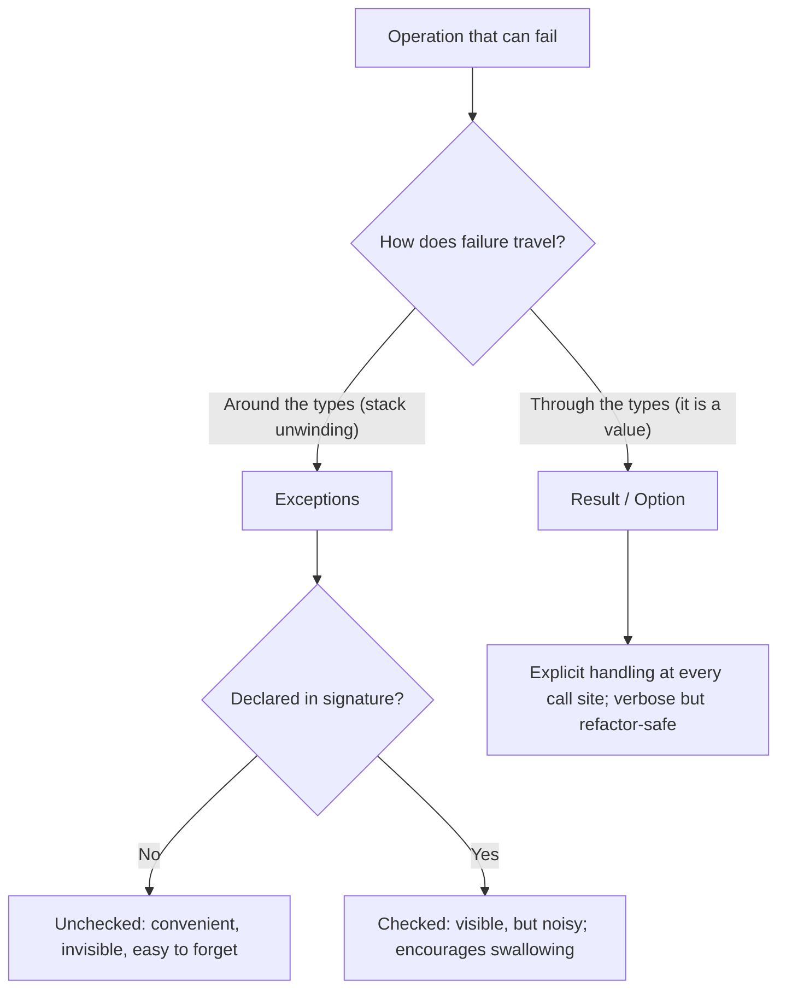

# Error handling that survives refactors

## Why this matters

It's a Tuesday afternoon. A payment endpoint that worked fine in staging is silently dropping about one charge in two hundred in production. No exception in the logs, no 500s, no alert. The on-call engineer eventually finds it: three months ago someone wrapped a `chargeCard()` call in a `try { ... } catch (e) { /* TODO */ }` to make a flaky integration test pass. The catch block swallowed a `NetworkTimeoutError`, returned a default `{ success: false }` that nobody checked, and the calling code happily marked the order as paid. The bug was invisible because the error was handled — handled into oblivion.

The cost here wasn't the timeout. Timeouts are normal. The cost was that the error stopped propagating at exactly the wrong layer, and the type system had nothing to say about it because the function's signature claimed it always returned a result. Weeks of reconciliation work followed. The fix was four lines.

This is the failure mode that this chapter exists to prevent. Error handling is not about catching errors; it's about making the *possibility* of failure visible in the places that have to deal with it, and invisible everywhere else. The deep question is who decides where an error is handled — the compiler, or a human's discipline at 4pm under deadline. When the answer is "human discipline," errors get swallowed during refactors, because a refactor is precisely the moment when nobody is thinking about the unhappy path. Someone extracts a function, inlines another, moves a call up a layer — and the failure path, which lived only in a convention nobody enforced, quietly evaporates. The strategies in this chapter — exceptions, result types, error returns, wrapping with context — are all answers to one question: *when someone moves this code six months from now, will the failure path move with it, or get lost?*

The engineers who get this right are not the ones who write the most `try/catch`. They are the ones who arrange for the type checker, the linter, and the compiler to refuse to let a failure be ignored. The discipline lives in the tools, not in the person, because the person will be tired, rushed, or simply absent the day the refactor happens.

## Mental model

There are three mechanisms a language gives you for signaling "this operation can fail," and they sit on a spectrum from implicit to explicit:

| Mechanism | Failure is | Visible in the type? | Easy to ignore? | Examples |
|---|---|---|---|---|
| **Unchecked exceptions** | a side channel that unwinds the stack | No | Yes (silently propagates) | Python, JavaScript, C#, Java `RuntimeException` |
| **Checked exceptions** | a declared part of the signature | Yes (`throws`) | No (compiler forces a decision) | Java checked exceptions |
| **Result / Option types** | an ordinary value you must unpack | Yes (the return type) | No (can't use the value without handling) | Rust `Result<T, E>`, Haskell `Either`, Go-ish wrappers |
| **Error returns** | a second return value | By convention | Yes (you can ignore it) | Go `(T, error)`, C return codes |

The crucial axis is not "exceptions versus results." It's: *does the failure travel through the type system or around it?* An unchecked exception travels around it — the function `parseConfig()` has the same type whether or not it throws, so the caller has no compiler-enforced reason to think about failure. A `Result<Config, ParseError>` travels through it — you literally cannot get the `Config` out without first confronting the `ParseError`. This distinction is the whole game. A failure that travels through the types survives refactoring because the compiler re-checks it at the new location; a failure that travels around the types survives only as long as a human keeps remembering it.

Checked exceptions, in the middle row, were Java's attempt to drag exceptions onto the visible side of that line, and they are worth studying precisely because they are a cautionary tale. Forcing every caller to declare or handle a `throws IOException` sounds like the right idea, but in practice the friction pushed a generation of developers toward two bad habits: declaring `throws Exception` to escape the specificity, and writing empty `catch` blocks to make the compiler stop complaining. The lesson is not "visibility is bad" — it is that visibility has to come with ergonomics good enough that the path of least resistance is *handling* the error, not *suppressing* it. Result types succeed where checked exceptions struggled largely because propagating a result (`?` in Rust, an early `return` in Go) is as cheap as suppressing it.



The pragmatic synthesis most senior engineers converge on: **use exceptions for truly exceptional, unrecoverable conditions** (programmer bugs, invariant violations, out-of-memory) and **use result/error values for expected, recoverable failures** (a network call failed, a file was missing, user input didn't parse). The mistake is using exceptions for the second category, because expected failures are exactly the ones a caller needs to handle locally, and exceptions let the caller forget. The distinction that matters is the one between a *bug* and a *recoverable error*: a bug means your code is wrong and the correct response is to crash loudly so you find out; a recoverable error means the world is wrong in a way you anticipated, and the correct response is a deliberate branch in your logic. Joe Duffy's retrospective on the Midori project's error model argues this point at length — conflating the two categories is the root of most error-handling pain, and almost every anti-pattern below is a symptom of that confusion.

## In practice

### The swallowed-exception anti-pattern

Here is the original sin, in TypeScript:

```typescript
async function chargeOrder(order: Order): Promise<ChargeResult> {
  try {
    const charge = await paymentGateway.chargeCard(order.card, order.total);
    return { success: true, chargeId: charge.id };
  } catch (e) {
    // swallowed: the caller cannot tell a declined card
    // from a network timeout from a bug in our own code
    return { success: false };
  }
}

// Caller, written during a refactor by someone who never saw the catch block:
const result = await chargeOrder(order);
if (result.success) {
  await markOrderPaid(order);   // runs even when the gateway timed out
}
```

Three distinct failures — a declined card (expected, recoverable), a network timeout (expected, retryable), and a `TypeError` from our own broken code (a bug) — all collapse into a single `{ success: false }`. The bug is reported identically to the decline. Worse, the `catch (e)` also catches the programmer error and hides it, so the real bug never surfaces in monitoring. The function's signature, `Promise<ChargeResult>`, is now a lie: it promises a result and quietly delivers a shrug. Nothing about the type tells the next reader that three categories of disaster are hiding behind that boolean.

### The explicit-error approach with a Result type

Model the failures you actually expect as data, and let unexpected ones (bugs) keep propagating:

```typescript
type ChargeError =
  | { kind: "card_declined"; reason: string }
  | { kind: "gateway_timeout" }
  | { kind: "insufficient_funds" };

type Result<T, E> =
  | { ok: true; value: T }
  | { ok: false; error: E };

async function chargeOrder(
  order: Order,
): Promise<Result<ChargeId, ChargeError>> {
  const res = await paymentGateway.charge(order.card, order.total);
  switch (res.status) {
    case "ok":        return { ok: true, value: res.chargeId };
    case "declined":  return { ok: false, error: { kind: "card_declined", reason: res.reason } };
    case "timeout":   return { ok: false, error: { kind: "gateway_timeout" } };
    case "no_funds":  return { ok: false, error: { kind: "insufficient_funds" } };
  }
  // a thrown TypeError here is a *bug* and SHOULD crash loudly — not be caught
}
```

Now the caller cannot reach `value` without first checking `ok`, and the switch over `ChargeError` is exhaustive — add a new failure kind and the compiler flags every call site that doesn't handle it. The refactor that broke things in the opening scenario becomes impossible: there is no `result.success` shortcut that skips the error.

```typescript
const r = await chargeOrder(order);
if (!r.ok) {
  switch (r.error.kind) {
    case "card_declined":      return notifyCustomer(order, r.error.reason);
    case "insufficient_funds": return offerInstallments(order);
    case "gateway_timeout":    return scheduleRetry(order);
  }
}
await markOrderPaid(order, r.value); // only reachable when r.ok is true
```

The exhaustiveness check is the load-bearing part. With TypeScript's `strict` mode and a discriminated union, omitting a `case` is a compile error if you add a `default: assertNever(r.error)` clause, or a flagged narrowing failure if the function is supposed to return on every branch. The failure path is no longer a convention you hope survives the next edit; it is a constraint the type checker re-validates every time the file is touched.

### Rust: the same idea with the compiler enforcing it

Rust bakes this into the language. `Result<T, E>` is the standard return type for fallible operations, and the `?` operator propagates errors upward without ceremony:

```rust
use std::fs;

#[derive(Debug)]
enum ConfigError {
    Read(std::io::Error),
    Parse(String),
}

fn load_config(path: &str) -> Result<Config, ConfigError> {
    let text = fs::read_to_string(path).map_err(ConfigError::Read)?;
    let cfg: Config = toml::from_str(&text)
        .map_err(|e| ConfigError::Parse(e.to_string()))?;
    Ok(cfg)
}
```

The `?` means "if this is an `Err`, return it from the enclosing function now; otherwise unwrap the `Ok`." You get exception-like propagation ergonomics with full type visibility. You physically cannot ignore the error: there is no way to get the `String` out of `read_to_string` without acknowledging the `io::Error` branch. The cost is verbosity in the error-type plumbing, which crates like `thiserror` (for libraries) and `anyhow` (for applications) exist to reduce. The reason `?` works at all is that propagation is *cheaper to type than suppression* — the opposite of the checked-exception trap, where escaping the type was easier than honoring it.

### Go: error returns and the wrapping discipline

Go takes the explicit path without sum types. Every fallible call returns `(value, error)`, and the convention is to check immediately:

```go
func LoadConfig(path string) (*Config, error) {
    data, err := os.ReadFile(path)
    if err != nil {
        return nil, fmt.Errorf("load config %q: %w", path, err)
    }
    var cfg Config
    if err := toml.Unmarshal(data, &cfg); err != nil {
        return nil, fmt.Errorf("parse config %q: %w", path, err)
    }
    return &cfg, nil
}
```

*The same idea in TypeScript:*

```typescript
import { readFile } from "node:fs/promises";
import { parse as parseToml } from "@iarna/toml";

async function loadConfig(path: string): Promise<Config> {
  let data: string;
  try {
    data = await readFile(path, "utf8");
  } catch (err) {
    // Error.cause preserves the underlying error, like %w
    throw new Error(`load config ${JSON.stringify(path)}`, { cause: err });
  }
  try {
    return parseToml(data) as Config;
  } catch (err) {
    throw new Error(`parse config ${JSON.stringify(path)}`, { cause: err });
  }
}
```

The `%w` verb is the load-bearing detail. It *wraps* the underlying error while adding context, so the caller gets a message like `load config "app.toml": open app.toml: no such file or directory` — the full causal chain, top to bottom. And because it wraps rather than reformats, `errors.Is(err, os.ErrNotExist)` and `errors.As(err, &pathErr)` still work up the stack. You add human-readable context without destroying the machine-readable type. Go's weakness is the other side of this coin: nothing in the language *forces* you to check `err`, so the discipline has to be imposed by tooling. That is what `errcheck` and `go vet` are for, and why they belong in CI rather than in a style guide nobody reads.

### Python: chain, never flatten

Python's exceptions are unchecked, so the same swallowing risk applies — but Python gives you first-class tools to preserve causal chains, and the discipline is to use them. The `raise ... from` syntax attaches the original exception as `__cause__`, and matters most exactly when you translate a low-level error into a domain-level one:

```python
class ProfileLoadError(Exception):
    pass

def load_user_profile(user_id: str) -> Profile:
    try:
        return db.fetch_profile(user_id)
    except DatabaseError as e:
        # `from e` preserves the original traceback and __cause__
        raise ProfileLoadError(f"load profile for user {user_id}") from e
```

*In TypeScript:*

```typescript
class ProfileLoadError extends Error {}

async function loadUserProfile(userId: string): Promise<Profile> {
  try {
    return await db.fetchProfile(userId);
  } catch (e) {
    if (e instanceof DatabaseError) {
      // { cause: e } preserves the original error and its stack, like `from e`
      throw new ProfileLoadError(`load profile for user ${userId}`, { cause: e });
    }
    throw e;
  }
}
```

When this propagates, Python prints both frames with "The above exception was the direct cause of the following exception," so the log shows the business intent and the root cause together. Dropping the `from e` — or worse, catching `Exception` and re-raising a bare string — throws that chain away. The catch you should be most suspicious of in Python is `except Exception:` without a re-raise, because it also swallows the programmer-error category that should have crashed.

### Error wrapping: add context, preserve the cause

This is the single highest-leverage habit, and it applies in every language. The rule: **when an error crosses a layer boundary, wrap it with what *this* layer was trying to do, but never discard the original.**

```typescript
// TypeScript: Error.cause (standardized in ES2022) is the equivalent of %w
async function loadUserProfile(id: string): Promise<Profile> {
  try {
    return await db.profiles.fetch(id);
  } catch (e) {
    throw new Error(`load profile for user ${id}`, { cause: e });
  }
}
```

The wrong way is to flatten: `throw new Error("could not load profile")` discards the stack and the cause, and your incident channel fills with a hundred identical useless messages. The right way preserves the chain so the log line tells you both the business intent (*loading a profile*) and the root cause (*connection pool exhausted*). Each layer adds one clause of context — what *it* was attempting — and the accumulated chain reads like a stack trace written in domain language, from the request handler down to the syscall.

> **Security note:** Error context is for *you*, not for the client. Wrapping `os.ReadFile` failure with the absolute path, or returning a database driver's raw error to an HTTP response, leaks internals: filesystem layout, table names, library versions, sometimes credentials in connection strings. Keep the rich, wrapped error in your server-side logs (keyed by a request ID) and return a generic message plus that ID to the client. The pattern is "log the cause, return the correlation." See OWASP's guidance on improper error handling (CWE-209, Information Exposure Through an Error Message).

> **Connect the dots:** Where an error gets handled is a distributed-systems decision once your call crosses a network boundary (Part 7). A `gateway_timeout` is ambiguous — the charge may or may not have happened — which is exactly why idempotency keys and retries belong in the same design conversation as your error types. The shape of `ChargeError` here is the same shape your retry policy reads.

## Pitfalls and anti-patterns

**1. The catch-all swallow (`catch (e) {}`).** The opening scenario. Recognize it by an empty catch block, a catch that returns a default value, or a `except Exception: pass` in Python. It converts every failure — including bugs in your own code — into silent wrong behavior. Fix: catch only the specific exception types you can actually handle, let the rest propagate, and never have a catch block that doesn't either recover, re-raise, or log-and-rethrow. A bare `except:` that catches `KeyboardInterrupt` and `SystemExit` is a special circle of this.

**2. Catching too broadly, too high.** A top-level `try/catch` around an entire request handler that maps any exception to a 500 feels safe but destroys information: a validation error (should be 400), a missing record (404), and a real bug (500) all become the same response. Recognize it by exception handling that's far from where the error originated. Fix: handle each error category at the layer that has enough context to choose the right response, and let a thin outer boundary handle only the truly-unexpected as a last resort.

**3. Exceptions for control flow.** Using `try/except` to drive normal, expected branches — catching `StopIteration` to end a loop, throwing to break out of nested logic, using exceptions where an `if` would do. Recognize it by exceptions thrown and caught within the same function for non-exceptional cases. It is generally slower (capturing a stack trace has a cost), and it teaches readers that exceptions are normal, which trains them to swallow. Fix: reserve exceptions for the genuinely exceptional; model expected branches as return values.

**4. Lossy re-wrapping.** Catching an error and throwing a *new* one without attaching the original as the cause (`throw new Error("operation failed")` after a caught DB error). Recognize it by error messages in production that have no stack trace pointing at the real origin. Fix: always chain — `{ cause: e }` in JS, `%w` in Go, `.map_err`/`source()` in Rust, `raise NewError(...) from e` in Python.

**5. Ignored error returns in Go.** Writing `result, _ := doThing()` to discard the error, or forgetting to check `err` at all. Recognize it with `errcheck` or `go vet`. The blank-identifier discard is the Go equivalent of the empty catch block. Fix: enable `errcheck` in CI; treat an unchecked `error` as a build failure, not a style nit.

## Production checklist

- [ ] Distinguish **expected/recoverable** failures (modeled as values or specific exception types) from **bugs** (allowed to crash loudly) — write this distinction down in your error-handling guide
- [ ] No empty catch blocks; lint for them (`no-empty` / `no-useless-catch` in ESLint, bare-`except` in `flake8`/`ruff`, `errcheck` in Go)
- [ ] Every cross-layer error is **wrapped with context and preserves its cause** (`%w`, `{ cause }`, `from e`, `thiserror #[source]`)
- [ ] Errors returned to clients are **sanitized**; full detail goes to server logs keyed by a request/correlation ID
- [ ] Domain error types are **closed/exhaustive** where the language allows (sum types, sealed classes) so adding a variant forces every handler to update
- [ ] A single **outermost boundary** (request middleware, top-level handler) catches the truly-unexpected, logs with full context, and returns a safe generic response
- [ ] Retryable vs. terminal failures are **distinguishable from the error type** so retry/backoff logic doesn't guess
- [ ] Tests cover the **unhappy paths**, not just the happy one — assert on error *kind*, not just that "something threw"

## Exercises

1. **(Comprehension)** Take the swallowed-exception TypeScript example and list every distinct runtime failure that gets collapsed into `{ success: false }`. For each, state whether it is expected-and-recoverable or a bug, and what the *correct* caller behavior would be. Explain in one sentence why the `catch (e)` makes the bug-category failure the most dangerous of the three.

2. **(Applied)** Refactor a function in a codebase you work in that currently throws (or returns a bare boolean) into one that returns a `Result<T, E>` with a closed set of error variants. Update at least two call sites to handle each variant exhaustively. Then add a new error variant and confirm the compiler (or your test suite, in a dynamic language) points you at every site that needs updating. Measure: how many places had silently been ignoring failure?

3. **(Design)** You're designing the error model for a service-to-service API that other teams depend on. Decide: which failures are part of the public contract (and so must be stable, documented error codes) versus internal details that may change. Specify how a `timeout` is represented given that the operation may have partially succeeded, how clients distinguish retryable from terminal errors, and what an error response body contains versus what stays in your logs. State the tradeoff you're making between a rich, granular error taxonomy (precise but brittle to evolve) and a coarse one (stable but forces clients to guess).

## Further reading

- Joe Duffy, ["The Error Model"](http://joeduffyblog.com/2016/02/07/the-error-model/) — the definitive essay on bugs vs. recoverable errors, from the Midori project; shapes the whole modern debate
- *The Rust Programming Language*, ["Error Handling"](https://doc.rust-lang.org/book/ch09-00-error-handling.html) — `panic!` vs. `Result`, the `?` operator, and when to use each (official docs)
- Andrew Gerrand, ["Error handling and Go"](https://go.dev/blog/error-handling-and-go) and the follow-up ["Working with Errors in Go 1.13"](https://go.dev/blog/go1.13-errors) — the canonical sources on `%w`, `errors.Is`, and `errors.As`
- John Ousterhout, *A Philosophy of Software Design*, ch. 10, "Define Errors Out of Existence" — the contrarian, valuable argument for designing APIs so fewer things can fail at all
- OWASP, [Improper Error Handling](https://owasp.org/www-community/Improper_Error_Handling) and CWE-209 — why error messages are a security surface
- Python docs, [exception chaining (`raise ... from`)](https://docs.python.org/3/tutorial/errors.html#exception-chaining) — the standard library's take on preserving cause
