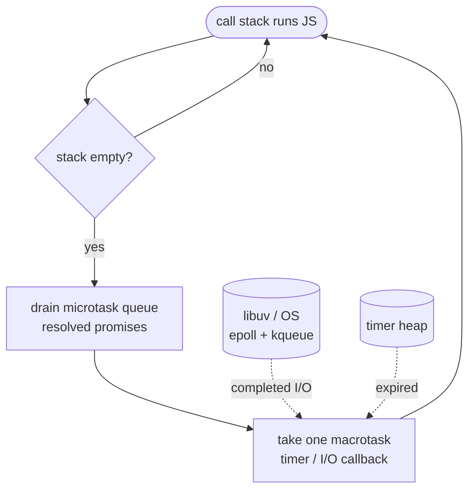

# Async, threads, and the event loop

## Why this matters

It's a Tuesday afternoon. Your Node.js API has been fast for months, then a new "export to CSV" endpoint ships and the whole service falls over. Not just the export endpoint — *everything*. Health checks time out. The load balancer pulls the instance. Pages that do nothing but return `{ "ok": true }` start taking seconds. Nobody touched those pages.

You add logging and find the culprit: someone wrote a loop that serializes a large result set into a CSV string synchronously, on the request handler, on the main thread. For the entire time that loop runs, the event loop is *frozen*. Not "busy" — frozen. No other request can be accepted, no timer can fire, no socket can be read. A single user clicking "export" makes every other user wait. The fix is a handful of lines: stream the rows and yield to the loop between chunks. But you can't write those lines until you understand what "the event loop" is and why a tight CPU loop is the one thing you must never do on it.

This is the most expensive gap in a full-stack developer's mental model, because the failure is non-local. A blocking call in one corner of the code degrades the entire process, and the symptom (slow unrelated endpoints) points nowhere near the cause. The engineers who understand concurrency know, on sight, which operations are safe to `await` and which will jam the runtime. The ones who don't ship a CSV exporter on Tuesday and spend Wednesday in an incident review. This chapter is the difference between those two outcomes.

## Mental model

Start with the two words people use interchangeably and shouldn't: **concurrent** and **parallel**.

- **Concurrency** is dealing with many things at once — structuring a program so multiple tasks are *in progress*, interleaved on possibly one core. A single barista taking orders, starting one coffee, taking the next order while the machine runs, is concurrent.
- **Parallelism** is doing many things at once — multiple tasks executing *simultaneously* on multiple cores. Two baristas on two machines is parallel.

Rob Pike's framing is the canonical one: concurrency is about *structure*, parallelism is about *execution*. You can have concurrency on a single core (the event loop) and you need multiple cores for true parallelism (threads, processes).

Most workloads split cleanly into two kinds, and the kind decides the tool:

- **I/O-bound**: the program spends its time *waiting* — on the network, the disk, a database. The CPU is idle during the wait. The win is to overlap the waits. This is what an **event loop** does brilliantly with one thread.
- **CPU-bound**: the program spends its time *computing* — hashing, parsing, image resizing, the CSV loop above. There is no wait to overlap. The only win is more cores, which means **threads** or **processes**.

The event loop is a simple machine. It runs your code until that code voluntarily yields (by awaiting something or finishing). Then it checks a queue of completed I/O events and ready callbacks, and runs the next one. Forever.



The single most important property of this diagram: **the loop only advances when the call stack is empty.** While your synchronous code runs, *nothing else happens*. Microtasks don't fire, timers don't fire, new connections aren't accepted. `await` is how your function says "I'm waiting on something, pop me off the stack and come back when it's ready" — it returns control to the loop. A `for` loop crunching numbers never says that, so the loop never gets a turn.

The diagram shows two queues, and the gap between them is where most "why did this log in that order?" confusion lives. **Microtasks** (resolved promise callbacks, `queueMicrotask`, and in Node `process.nextTick`) are drained *completely* before the loop takes a single **macrotask** (a timer callback, an I/O completion, a `setImmediate`). The rule is: whenever the call stack empties, the runtime empties the entire microtask queue, *then* takes exactly one macrotask, *then* drains microtasks again. That's why a promise that resolves "immediately" still runs after the current synchronous code but before a `setTimeout(fn, 0)` you scheduled earlier — the timer is a macrotask and has to wait behind the whole microtask drain. Pile up enough microtasks (a promise that recursively schedules another promise) and you can starve the macrotask queue entirely, so timers and I/O callbacks never run. The queues are a priority system, not a single FIFO.

**`await` is not parallelism.** This trips up nearly everyone the first time. Writing `await` makes a coroutine *pause* and hand control back to the loop; it does not make two things run at the same time. If you `await a()` and then `await b()`, `b` does not even start until `a` has finished. You get concurrency — overlapping waits — only when multiple operations are *in flight* at the same moment, which means you have to start them before you await any of them. Keep that distinction sharp: a single thread running an event loop is concurrent, never parallel, no matter how many `await`s you sprinkle in.

**Threads vs. coroutines.** A thread is a unit of execution the OS schedules preemptively — it can interrupt your code at any instruction to run another thread, and threads can run on different cores (true parallelism). A coroutine (the thing `async/await` builds on) is a function that can suspend and resume *cooperatively* — it only yields at explicit points (`await`), and many coroutines share one thread. Coroutines are cheap (thousands per process, kilobytes each); OS threads are expensive (megabyte stacks, context-switch cost). Coroutines give you concurrency without parallelism; threads give you both, plus data races.

## In practice

### JavaScript: blocking the loop, then fixing it

Here's the bug from the opening, distilled. A handler that does real CPU work synchronously:

```javascript
import express from "express";
const app = express();

// ANTI-PATTERN: synchronous CPU work on the event loop
app.get("/report", (req, res) => {
  let total = 0;
  // simulate heavy CPU: a tight loop that never yields
  for (let i = 0; i < 5_000_000_000; i++) {
    total += i % 7;
  }
  res.json({ total });
});

app.get("/health", (_req, res) => res.json({ ok: true }));

app.listen(3000);
```

Hit `/report` in one terminal and `/health` in another while it runs:

```bash
$ curl localhost:3000/health   # instant... until someone hits /report
{"ok":true}
$ curl localhost:3000/report & curl localhost:3000/health
# /health now hangs for the entire duration of the /report loop
```

`/health` does nothing, yet it blocks. The CPU loop owns the single thread and the event loop never gets a turn to accept the `/health` request. Adding `async` to the handler **does not help** — `async` only matters at `await` points, and there are none here. There is nothing to await; it's pure computation.

The fix depends on the work. For genuinely CPU-bound work, move it off the main thread to a **worker thread**:

```javascript
// report-worker.js
import { parentPort, workerData } from "node:worker_threads";

let total = 0;
for (let i = 0; i < workerData.limit; i++) {
  total += i % 7;
}
parentPort.postMessage(total);
```

```javascript
// server.js
import express from "express";
import { Worker } from "node:worker_threads";
const app = express();

function runReport(limit) {
  return new Promise((resolve, reject) => {
    const w = new Worker("./report-worker.js", { workerData: { limit } });
    w.on("message", resolve);
    w.on("error", reject);
  });
}

app.get("/report", async (req, res) => {
  const total = await runReport(5_000_000_000); // runs on another thread
  res.json({ total });
});

app.get("/health", (_req, res) => res.json({ ok: true })); // stays responsive

app.listen(3000);
```

Now `/report` runs on a separate OS thread (real parallelism), the main thread's event loop stays free, and `/health` answers instantly even while a report computes. The `await` is the hinge: it pops the handler off the stack and lets the loop serve other requests until the worker posts back.

For the CSV case — which is *I/O-bound output with light per-row CPU* — you don't need a worker at all. You need to **stop building one giant string in memory and stream instead**, yielding between chunks:

```javascript
app.get("/export", async (req, res) => {
  res.setHeader("Content-Type", "text/csv");
  const rows = db.streamRows(); // async iterator, yields rows as they arrive
  res.write("id,name,total\n");
  for await (const row of rows) {
    res.write(`${row.id},${row.name},${row.total}\n`);
  }
  res.end();
});
```

`for await` yields to the event loop on every iteration that hits a pending I/O read, so other requests interleave. Memory stays flat regardless of row count. This is the small fix the opening promised.

One subtlety worth internalizing: streaming only stays memory-flat if you respect **backpressure**. `res.write()` returns `false` when the kernel's send buffer is full — the client is reading slower than you're producing. A naive `for await` loop that ignores the return value will keep pulling rows from the database and buffering them in Node's memory, recreating the OOM you were trying to avoid, just one layer down. In practice you let the runtime handle this for you by piping a readable stream into the response (`pipeline(rowStream, csvTransform, res)`), which pauses the source when the destination is full and resumes when it drains. The lesson generalizes: "stream it" is only a fix if the producer can be *slowed*, not just chunked.

### Python: the same loop, with a GIL twist

Python's `asyncio` is the same event-loop model. Here's the equivalent blocking bug:

```python
import asyncio
import time
from aiohttp import web

# ANTI-PATTERN: a blocking call inside an async handler
async def report(request):
    # time.sleep blocks the OS thread — the whole event loop stalls
    time.sleep(3)
    return web.json_response({"done": True})

async def health(request):
    return web.json_response({"ok": True})

app = web.Application()
app.add_routes([web.get("/report", report), web.get("/health", health)])
web.run_app(app, port=8080)
```

The function is `async`, but `time.sleep(3)` is a **synchronous, blocking** call. It does not yield to the loop. For three seconds, `/health` is dead. This is the most common asyncio mistake: calling blocking library functions (`requests.get`, `time.sleep`, synchronous DB drivers, `open().read()` on a big file) from inside a coroutine. The `async` keyword is a promise you break the moment you call something blocking.

The fix for a true wait is the async-native primitive:

```python
async def report(request):
    await asyncio.sleep(3)   # yields to the loop; /health stays alive
    return web.json_response({"done": True})
```

But what about blocking work you *can't* avoid — a legacy synchronous library, or actual CPU work? Push it off the event loop thread with an executor:

```python
import asyncio
from concurrent.futures import ProcessPoolExecutor
from aiohttp import web

def heavy_cpu(limit: int) -> int:
    return sum(i % 7 for i in range(limit))

async def report(request):
    loop = asyncio.get_running_loop()
    # ProcessPoolExecutor for CPU work — sidesteps the GIL via separate processes
    with ProcessPoolExecutor() as pool:
        total = await loop.run_in_executor(pool, heavy_cpu, 50_000_000)
    return web.json_response({"total": total})
```

The choice of executor matters and exposes Python's defining constraint: the **Global Interpreter Lock (GIL)**. In the standard CPython build, one process can execute Python bytecode on only one thread at a time. So:

- **`ThreadPoolExecutor`** is correct for *blocking I/O* (a synchronous HTTP client, a blocking DB driver). The thread releases the GIL while waiting on the OS, so other threads run. You get concurrency.
- **`ProcessPoolExecutor`** is correct for *CPU-bound work*. Threads won't help because the GIL serializes bytecode execution — two CPU threads take turns, no faster than one. Separate processes have separate interpreters and separate GILs, giving real parallelism.

This is the inverse of the rule in many languages, and it trips up everyone once. In CPython, threads are for waiting, processes are for computing.

> **Connect the dots:** This maps directly onto the I/O-bound vs. CPU-bound distinction from the Mental model, and onto the memory models of Part 2, Chapter 3 — processes don't share memory (you pay serialization cost to pass data, but get isolation and no data races), while threads share an address space (cheap data sharing, but you inherit locks, races, and the GIL). The concurrency tool you reach for is a memory-model decision in disguise.

> **Security note:** Blocking the event loop is a denial-of-service vector, not just a performance bug. If any user-controllable input (an uploaded file, a regex, a JSON payload) can make a synchronous handler run for seconds, a single request can take down the whole process for every other user. Regular-expression denial of service (ReDoS) is the classic case: a catastrophically backtracking regex on user input freezes the Node.js or Python event loop. Bound input sizes, set timeouts, and run untrusted CPU work in a worker/process with limits.

### A note on the GIL's future

CPython 3.13 introduced an experimental free-threaded build (PEP 703) that removes the GIL, and later releases continue to mature it. When free-threading becomes the default, `ThreadPoolExecutor` will become viable for CPU work in pure Python. Until your production interpreter ships it as default and your dependencies support it, write code as if the GIL is there — because on the interpreter you're shipping today, it is.

## Pitfalls and anti-patterns

**1. The hidden synchronous call inside an `async` function.** The function signature says `async`, so it *feels* non-blocking, but it calls `time.sleep`, `requests.get`, `fs.readFileSync`, `JSON.parse` on a huge payload, or a tight loop. How to recognize: unrelated endpoints slow down or time out under load, and a CPU profile shows one long synchronous frame on the loop thread. How to fix: replace with the async-native equivalent (`asyncio.sleep`, `fetch`/`aiohttp`, `fs.promises.readFile`), or push the work to a worker thread / process pool.

**2. `async` cargo-culting — awaiting things that aren't actually concurrent.** Writing `await`s in a sequence when the operations are independent: `const a = await fetchA(); const b = await fetchB();` runs them one after another. How to recognize: a handler's latency equals the *sum* of its I/O calls, not the *max*. How to fix: start them together and await jointly — `Promise.all([fetchA(), fetchB()])` in JS, `asyncio.gather(fetch_a(), fetch_b())` in Python. Concurrency only happens when work is in flight simultaneously.

**3. Choosing threads for CPU-bound work in CPython.** Spinning up a `ThreadPoolExecutor` to parallelize a number-crunching loop and seeing little or no speedup (sometimes a slowdown from contention). How to recognize: CPU stays pinned at roughly one core's worth despite N threads. How to fix: use `ProcessPoolExecutor` (or `multiprocessing`) so each worker has its own GIL; or move the hot path to a native extension (NumPy, Rust via PyO3) that releases the GIL.

**4. Unbounded concurrency / fan-out.** Firing thousands of `fetch`es with `Promise.all(urls.map(fetch))` and exhausting sockets, file descriptors, or the downstream service. How to recognize: `EMFILE`/`ECONNRESET` errors, downstream 429s, or your own service OOMing from buffered responses. How to fix: bound concurrency with a pool/semaphore (`p-limit` in JS, `asyncio.Semaphore` in Python) so only N requests are in flight at once.

**5. Swallowed errors in fire-and-forget tasks.** Calling an `async` function without awaiting it (`doWork();` not `await doWork();`) so a rejected promise becomes an unhandled rejection, or an asyncio task is garbage-collected with its exception silently lost. How to recognize: work that "sometimes doesn't happen" with no error in logs; `UnhandledPromiseRejection` warnings. How to fix: always `await` or attach a `.catch`/handler; keep references to background tasks; in Python use `asyncio.TaskGroup` (3.11+) which propagates child exceptions.

## Production checklist

- [ ] No synchronous CPU loops, `*Sync` file calls, or blocking sleeps inside request handlers or `async` functions on the main thread
- [ ] CPU-bound work runs in worker threads (Node) or a `ProcessPoolExecutor`/`multiprocessing` (Python), never on the event loop
- [ ] Blocking-but-I/O legacy calls in Python wrapped in `loop.run_in_executor` with a `ThreadPoolExecutor`
- [ ] Independent I/O issued concurrently (`Promise.all` / `asyncio.gather`), not awaited in sequence
- [ ] All fan-out bounded by a semaphore or concurrency-limit pool sized to downstream capacity
- [ ] Streaming responses respect backpressure (honor `res.write()` return value or use `pipeline`), so a slow client can't balloon memory
- [ ] Every async call site either `await`ed or given an explicit error handler; no orphan promises/tasks
- [ ] Timeouts on every network call (`AbortController` / `asyncio.timeout`) so one slow dependency can't pin a coroutine forever
- [ ] User-controllable input that drives CPU work (regex, parsing, decompression) is size-bounded and time-bounded to prevent DoS
- [ ] Event-loop lag monitored in production (e.g. a periodic timer measuring its own delay) and alerted on
- [ ] Graceful shutdown drains in-flight tasks before exit (`SIGTERM` handler that stops accepting and awaits outstanding work)

## Exercises

1. **(Comprehension)** Without running it, predict the exact output order of this snippet, then run it to check: `console.log(1); setTimeout(() => console.log(2), 0); Promise.resolve().then(() => console.log(3)); console.log(4);`. Explain the order in terms of the call stack, the microtask queue, and the macrotask (timer) queue from the Mental model diagram. Why does the `0`-ms timer fire *after* the resolved promise?

2. **(Applied)** Take the blocking `/report` handler (the 5-billion-iteration loop) and measure event-loop responsiveness: while a request to `/report` is in flight, time how long `/health` takes to respond. Then refactor `/report` onto a worker thread (Node) or `ProcessPoolExecutor` (Python) and measure `/health` again. Report both numbers and explain the difference in one paragraph.

3. **(Open-ended design)** You're building an image-thumbnail service: it accepts an upload, downloads three source variants from object storage, resizes each to four sizes (CPU-heavy), and writes twelve outputs back to storage. Design the concurrency model. Which steps are I/O-bound vs. CPU-bound? Where do you use the event loop, where do you use a process/worker pool, and how do you bound concurrency so 100 simultaneous uploads don't exhaust memory or CPU? Sketch the data flow and justify each choice against the failure modes in Pitfalls.

## Further reading

- Rob Pike, ["Concurrency Is Not Parallelism"](https://go.dev/blog/waza-talk) — the talk that made the distinction crisp; foundational.
- Node.js docs, ["The Node.js Event Loop"](https://nodejs.org/en/learn/asynchronous-work/event-loop-timers-and-nexttick) and ["Don't Block the Event Loop"](https://nodejs.org/en/learn/asynchronous-work/dont-block-the-event-loop) — the official, precise account of phases, timers, and `process.nextTick`.
- Python documentation, [`asyncio` developing guide](https://docs.python.org/3/library/asyncio-dev.html) — including the explicit list of "things you must not do" inside coroutines.
- Sam Gross, [PEP 703 — Making the Global Interpreter Lock Optional in CPython](https://peps.python.org/pep-0703/) — the design and rationale for free-threaded Python.
- *The Linux Programming Interface*, Michael Kerrisk — chapters on `epoll`/`select` (what libuv and asyncio sit on top of) and on threads vs. processes, for the OS-level picture.
- Jake Archibald, ["Tasks, microtasks, queues and schedules"](https://jakearchibald.com/2015/tasks-microtasks-queues-and-schedules/) — the definitive walkthrough of why Exercise 1's output is what it is.
