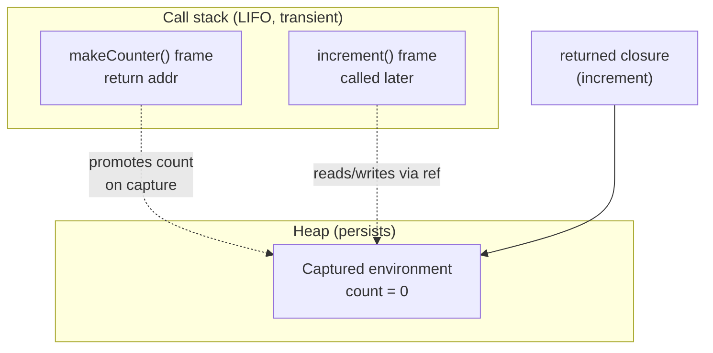

# Functions, closures, and the call stack

## Why this matters

It's a Tuesday afternoon. You wired up a dashboard with three buttons — "Edit", "Delete", "Archive" — by looping over a config array and attaching a click handler to each. You test it. Every button logs `archive`. All three. The first two buttons are lying about what they do.

You stare at the loop. The handler clearly references the right item; you can see `actions[i]` right there in the closure. Except `i` isn't `actions[i]` — `i` is a variable, and by the time anyone clicks a button, the loop has finished and `i` holds its final value. Every handler closed over the same `i`. You didn't capture three values; you captured one variable three times.

This is the single most common closure bug in the language, and it has shipped to production in roughly every JavaScript codebase ever written. The fix is one keyword. But the keyword only makes sense if you understand what a closure actually captures — not a value, but a binding — and how the call stack creates and destroys the scopes those bindings live in. That understanding is the difference between memorizing "use `let` not `var`" and knowing why, which is the difference between fixing this bug and fixing the next three variants of it you haven't seen yet. Functions are the unit of composition in every language you'll touch. Closures are how functions remember. The call stack is where they run and where they blow up. Get these three right and higher-order code stops being clever and starts being obvious.

## Mental model

A function is three things bundled together: code to run, a list of parameters, and — this is the part people skip — a reference to the environment it was defined in. That last part is what makes a *closure*. A closure is a function plus the lexical scope it captured at definition time. It captures *bindings* (the variable slots), not *values* (the contents at that instant). This distinction is the whole game.

"Lexical" means the scope is determined by where the function appears in the source text, not by where or how it's later called. This is worth pinning down because it's the opposite of how `this` works in JavaScript: a closure's captured variables are fixed at definition, while `this` (in a regular `function`) is rebound on every call depending on the call site. Arrow functions don't have their own `this` — they close over the surrounding `this` lexically, like any other variable. Mixing the two models is a perennial source of "why is `this` undefined" bugs. Closures over plain variables are predictable; `this` is the special case that follows different rules.

When a function is *called*, the runtime pushes a **stack frame**: a region of memory holding that call's parameters, local variables, and a return address. When the function returns, its frame is popped. The stack is strictly last-in-first-out, which is why it's fast (allocation is just bumping a pointer, deallocation just moves it back) and why infinite recursion crashes with a stack overflow — you keep pushing frames and never pop, until you run off the end of the fixed-size region the OS gave the thread.

So how can a closure outlive the function that created it, if frames are destroyed on return? Because captured variables don't live on the stack. When a runtime sees that an inner function references an outer variable, it promotes that variable to the heap so it survives after the outer frame is popped. The closure holds a reference to that heap-allocated environment. The stack is for the call that's running *right now*; the heap is for anything that must outlive its creating call. That single split — transient stack, persistent heap — explains both why closures work and why they can leak memory.



The mental model in one sentence: **the stack runs functions; the heap remembers what closures captured; a closure captures the variable, not the value.** Hold those three clauses and every example below is predictable.

## In practice

### First-class functions

A function is "first-class" when it's an ordinary value: you can store it in a variable, pass it as an argument, return it, and put it in a data structure. This is the foundation everything else builds on.

```typescript
// Stored in a variable
const double = (n: number) => n * 2;

// Passed as an argument (higher-order: takes a function)
const apply = (fn: (x: number) => number, x: number) => fn(x);
apply(double, 21); // 42

// Returned from a function (higher-order: returns a function)
const multiplier = (factor: number) => (n: number) => n * factor;
const triple = multiplier(3);
triple(5); // 15

// Stored in a data structure — a dispatch table beats a switch
const ops: Record<string, (a: number, b: number) => number> = {
  add: (a, b) => a + b,
  sub: (a, b) => a - b,
};
ops["add"](2, 3); // 5
```

`multiplier` already shows a closure: the returned arrow function captures `factor`, which was a parameter of `multiplier`. By the time you call `triple(5)`, `multiplier`'s frame is long gone, but `factor` survives on the heap because the inner function referenced it. The dispatch table in the last example is worth internalizing on its own: once functions are values, a `Record` of them replaces a `switch`, and adding a case becomes adding a key rather than editing control flow.

### What a closure captures

Here is the proof that closures capture bindings, not values. Both returned functions share *one* `count`:

```typescript
function makeCounter() {
  let count = 0;
  return {
    inc: () => ++count,
    get: () => count,
  };
}

const c = makeCounter();
c.inc();          // 1
c.inc();          // 2
c.get();          // 2 — same binding, not a snapshot
```

If closures captured values, `get` would have frozen `count` at `0`. It didn't, because `inc` and `get` close over the same live variable slot. Note also that each call to `makeCounter()` creates a brand-new `count` on the heap, so two counters are fully independent. The factory function is the unit of isolation — same shared binding within one call, separate bindings across calls.

### The classic loop-capture bug

Now the bug from the opening. In JavaScript, `var` is function-scoped, so a single `i` exists for the entire loop. Every closure captures that one `i`:

```javascript
// WRONG — all three log 3
var handlers = [];
for (var i = 0; i < 3; i++) {
  handlers.push(() => console.log(i));
}
handlers[0](); // 3
handlers[1](); // 3
handlers[2](); // 3
```

By the time any handler runs, the loop has exited and `i` is `3`. There was only ever one `i`.

The modern fix is `let`, which is block-scoped. The language specifies that each loop iteration gets a *fresh binding* of the loop variable, so each closure captures a different `i`:

```javascript
// RIGHT — fresh binding per iteration
const handlers = [];
for (let i = 0; i < 3; i++) {
  handlers.push(() => console.log(i));
}
handlers[0](); // 0
handlers[1](); // 1
handlers[2](); // 2
```

Before `let` existed (ES5 and earlier), the idiomatic fix was an IIFE that created a new scope per iteration, copying the value into a parameter:

```javascript
for (var i = 0; i < 3; i++) {
  handlers.push((function (captured) {
    return () => console.log(captured);
  })(i)); // pass i by value into a new frame
}
```

Same idea both ways: give each closure its own binding to capture. This is not a JavaScript quirk; it's a consequence of variable-vs-value capture that shows up wherever closures meet mutable loop variables. Python has the exact same trap, and the same default-argument fix that forces a per-iteration copy:

```python
# WRONG — late binding; all return 2
fns = [lambda: i for i in range(3)]
[f() for f in fns]            # [2, 2, 2]

# RIGHT — default arg captures the value now, at definition time
fns = [lambda i=i: i for i in range(3)]
[f() for f in fns]            # [0, 1, 2]
```

*The same idea in TypeScript:*

```typescript
const range3 = [0, 1, 2];

// WRONG — late binding via one shared var; all return 2
var i: number;
let fns: Array<() => number> = range3.map(n => { i = n; return () => i; });
fns.map(f => f());            // [2, 2, 2]

// RIGHT — bind the value now, at definition time
fns = range3.map(i => () => i);
fns.map(f => f());            // [0, 1, 2]
```

Python closures are *late-binding*: they look up `i` when called, by which point the comprehension's `i` is `2`. The `i=i` default argument is evaluated at definition time, snapshotting the value. Different mechanism from JavaScript's per-iteration `let`, same lesson: when a closure outlives the loop, decide explicitly whether you want the live variable or a copy of its current value.

### The call stack and recursion

Each call pushes a frame; each return pops one. You can watch the stack directly in a thrown error:

```python
def a(): return b()
def b(): return c()
def c(): raise RuntimeError("boom")

a()
# Traceback (most recent call last):
#   File "x.py", line 5, in <module>  a()
#   File "x.py", line 1, in a         return b()
#   File "x.py", line 2, in b         return c()
#   File "x.py", line 3, in c         raise RuntimeError("boom")
# RuntimeError: boom
```

*In TypeScript:*

```typescript
function a(): never { return b(); }
function b(): never { return c(); }
function c(): never { throw new Error("boom"); }

a();
// Error: boom
//     at c (x.ts:3:34)
//     at b (x.ts:2:27)
//     at a (x.ts:1:27)
//     at Object.<anonymous> (x.ts:5:1)
```

The traceback *is* the stack, printed bottom-up. Recursion is just a function pushing frames of itself. Each pending recursive call holds a frame until its child returns, so depth costs memory:

```python
def factorial(n):
    if n <= 1:
        return 1
    return n * factorial(n - 1)   # frame for n waits on n-1
```

*The TypeScript equivalent:*

```typescript
function factorial(n: number): number {
  if (n <= 1) return 1;
  return n * factorial(n - 1);   // frame for n waits on n-1
}
```

Compute `factorial(10000)` and Python raises `RecursionError: maximum recursion depth exceeded` — its default limit is around 1000 frames, a deliberate guard against blowing the C stack underneath. The frames pile up because the multiplication `n * ...` happens *after* the recursive call returns; nothing can be discarded early.

One subtlety worth holding onto: the call stack you reason about is per-thread and synchronous. Asynchronous work breaks the chain. When a callback fires from `setTimeout` or a promise resolution, it runs on a *fresh* stack — the original caller's frames are long gone. That's why a stack trace from inside an async callback often shows only the event-loop machinery and not the code that scheduled the work, and why "where did this get called from?" is genuinely hard to answer in async code. The closure the callback carries is what preserves context across that gap; the stack does not.

> **Security note:** Tracebacks and stack-overflow errors are diagnostic gold for you and reconnaissance gold for an attacker. A raw traceback leaks file paths, function names, library versions, and sometimes argument values into a response or log. Never return raw stack traces to an untrusted client — catch, log server-side, and return a generic error with a correlation ID. Separately, recursion driven by untrusted input is a denial-of-service vector: a request that nests JSON or XML thousands of levels deep can exhaust the stack and crash the process. Bound the depth before you recurse, reject input past the limit, and prefer an explicit-stack iterative parser for any format whose nesting an attacker controls.

### Tail calls and why most languages don't optimize them

A call is in *tail position* when it's the last thing a function does — its result is returned directly, with no pending work. A *tail-call optimization* (TCO) reuses the current frame instead of pushing a new one, turning recursion into a loop and making it run in constant stack space.

```typescript
// Tail-recursive: the recursive call IS the return value
function factorial(n: number, acc: number = 1): number {
  if (n <= 1) return acc;
  return factorial(n - 1, acc * n); // nothing pending after this call
}
```

Here the multiply happens *before* the recursive call, threaded through `acc`, so the caller's frame has no remaining work and could in principle be reused. Whether it actually is depends on the language. Scheme and other functional languages mandate TCO. Rust does not guarantee it (rely on loops for unbounded depth). The JavaScript spec (ES2015) *requires* proper tail calls, but in practice only JavaScriptCore (Safari) ships it; V8 and SpiderMonkey do not, so you cannot rely on it in Node or Chrome. Python's creator rejected TCO deliberately, arguing it harms debuggability by erasing frames from tracebacks — exactly the frames you just saw make a traceback readable.

The practical rule: if recursion depth is bounded and small (tree traversal, parsing nested JSON a few levels deep), recursion is clear and fine. If depth scales with input size (a linked list of many thousands of nodes, a deeply nested structure), convert to an explicit loop with your own stack rather than betting on an optimization your runtime may not perform.

### Higher-order patterns

Once functions are values, the standard transforms — `map`, `filter`, `reduce` — replace whole categories of loop. Each takes a function and applies it across data:

```typescript
const nums = [1, 2, 3, 4, 5];
nums.filter(n => n % 2 === 0)      // [2, 4]
    .map(n => n * n);               // [4, 16]
nums.reduce((sum, n) => sum + n, 0); // 15
```

Closures power the most useful higher-order pattern in production code: behavior that carries private state. A debounce wraps a function and closes over a timer that survives between calls:

```typescript
function debounce<A extends unknown[]>(
  fn: (...args: A) => void,
  ms: number,
): (...args: A) => void {
  let timer: ReturnType<typeof setTimeout> | undefined; // captured, private
  return (...args: A) => {
    clearTimeout(timer);
    timer = setTimeout(() => fn(...args), ms);
  };
}

const onSearch = debounce((q: string) => fetchResults(q), 300);
```

`timer` is genuinely private — no caller can reach it — yet it persists across every invocation of the returned function because the closure holds the binding. This is the closure-as-object pattern: data and behavior bundled, with encapsulation enforced by scope rather than by a `private` keyword. The same shape underlies memoization (cache held in a captured `Map`), throttling (last-run timestamp), and rate limiters (a counter and a window). In each case the captured variable is the object's private field, and the returned function is its single method.

> **Connect the dots:** The closure-captures-a-binding rule is the root cause of a whole class of React bugs (Part 5). A `useEffect` or event handler closes over the props and state from the render it was created in — the "stale closure" problem — which is the loop-capture bug wearing a framework costume. The fix there (dependency arrays, functional state updates) is the same move: control which binding the closure captures.

## Pitfalls and anti-patterns

**1. Loop-variable capture (the stale closure).** You create functions inside a loop, and they all observe the loop variable's final value instead of the per-iteration value. Recognize it when every callback in a generated list behaves identically — the last one's behavior. Fix it by giving each iteration its own binding: `let` in JavaScript, a default-argument snapshot (`i=i`) in Python, or an IIFE/factory function that copies the value into a fresh scope. The general principle: if you need the value, force a copy at definition time; don't rely on the variable still meaning what you think when the closure finally runs.

**2. Unbounded recursion where depth scales with input.** A recursive function that's clean on small inputs blows the stack on large ones: `RecursionError` in Python, `RangeError: Maximum call stack size exceeded` in JavaScript, a segfault or abort in C/Rust. Recognize it when crashes correlate with input size, not input content. Fix by converting to iteration with an explicit heap-allocated stack/queue, or restructure to tail form *only if* your runtime guarantees TCO (most don't — verify before relying on it).

**3. Capturing more than you meant — the accidental memory leak.** A closure keeps its entire captured environment alive, including large objects you only borrowed one field from. A single event listener that closes over a giant DOM node or a multi-megabyte buffer pins that memory for as long as the listener lives. Recognize it with a heap snapshot showing retained objects you expected to be collected. Fix by extracting the one value you need into a local before creating the closure, so the closure captures the small thing, not the big container — and remove listeners when done.

**4. Mutating captured state from multiple closures and being surprised.** Because closures share bindings, two functions over the same variable see each other's writes. That's a feature for counters and caches, a bug when you assumed independence. Recognize it when "separate" handlers interfere. Fix by being deliberate: if you want shared state, share the binding; if you want independence, create a new scope (a fresh `makeThing()` call) per consumer.

**5. Relying on tail-call optimization that isn't there.** You write elegant tail-recursive code, test it on V8 or CPython, and it overflows in production at scale because the runtime never eliminated the frames. Recognize it when "but it's tail-recursive" code still overflows. Fix by not assuming TCO outside Scheme/Lua/Safari's JSC; write the loop.

## Production checklist

- [ ] Loops that create closures use a per-iteration binding (`let`, not `var`; `i=i` default-arg in Python comprehensions)
- [ ] Any recursion whose depth scales with input size is converted to iteration or verified against the runtime's stack limit
- [ ] No reliance on tail-call optimization unless the target runtime guarantees it (Scheme, Lua, Safari/JSC — not V8/Node, not CPython)
- [ ] Closures over large objects extract the minimal needed value first, to avoid retaining the whole environment
- [ ] Long-lived event listeners and subscriptions are explicitly removed to free their captured scope
- [ ] Shared-vs-independent state across closures is intentional, not accidental (one factory call per independent consumer)
- [ ] Debounce/throttle/memoize helpers store their private state in a closure, not on a shared global
- [ ] Recursive depth limits are documented or guarded where untrusted input controls nesting (parsers, JSON, recursive schemas)
- [ ] Raw stack traces are never returned to untrusted callers; errors are logged server-side and surfaced as generic messages with a correlation ID

## Exercises

1. **(Comprehension)** Without running it, predict the output of the `var` loop and the `let` loop from the "classic loop-capture bug" section, then run both and explain, in terms of bindings versus values, why they differ. Then explain why Python's `lambda i=i: i` fix works for a different reason than JavaScript's `let`.

2. **(Applied)** Implement a `memoize(fn)` higher-order function that caches results in a closure-held `Map` keyed by the stringified arguments. Verify the cache is private (unreachable from outside) and that a second `memoize(fn)` call produces an independent cache. Then break it on purpose: memoize a recursive `fibonacci` and observe whether the *internal* recursive calls hit your cache — and fix it so they do.

3. **(Design)** You're parsing arbitrarily deeply nested user-supplied JSON (think a config format that allows nesting). A naive recursive walker overflows the stack on malicious or pathological input. Design a parser that is immune to stack overflow regardless of nesting depth. Specify your explicit-stack data structure, how you bound resource use, what error you return on excessive depth, and the tradeoffs of an explicit stack versus trusting recursion plus a depth counter.

## Further reading

- Harold Abelson and Gerald Jay Sussman, *Structure and Interpretation of Computer Programs*, ch. 1 & 3 — first-class procedures, environments, and state as closures (free at https://mitp-content-server.mit.edu/books/content/sectbyfn/books_pres_0/6515/sicp.zip/index.html)
- ECMAScript Language Specification, §14.7.4 (`for` statement) and §27.5 (proper tail calls) — the normative source for per-iteration `let` bindings and tail-call semantics (https://tc39.es/ecma262/)
- MDN Web Docs, ["Closures"](https://developer.mozilla.org/en-US/docs/Web/JavaScript/Closures) — the clearest practical treatment, including the loop pitfall
- Guido van Rossum, ["Final Words on Tail Calls"](https://neopythonic.blogspot.com/2009/04/final-words-on-tail-calls.html) — why Python deliberately omits TCO, straight from the language's designer
- *The Rust Programming Language*, ["Closures: Anonymous Functions that Capture Their Environment"](https://doc.rust-lang.org/book/ch13-01-closures.html) — capture semantics made explicit by a language that forces you to choose `Fn`, `FnMut`, or `FnOnce`
