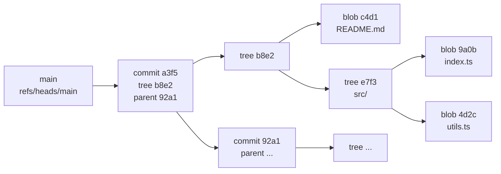

# Git internals: how Git actually stores your history

## Why this matters

It's a Tuesday afternoon. A colleague force-pushed to your shared feature branch and your local commits — three hours of work — appear to be gone. `git log` shows the branch tip pointing at their commit, not yours. You panic, you Slack the team, you start wondering if you'll be writing it all again.

Five minutes later, someone says: "Did you check the reflog?" You run `git reflog`, see your commits sitting there, run `git reset --hard HEAD@{3}`, and you're whole again. The cost of those five minutes was almost nothing. The cost of not knowing where to look would have been the rest of your afternoon.

That's the gap this chapter closes. Git is not a magic system that occasionally loses your work. It's a content-addressable filesystem with a few conventions on top, and once you understand what it actually stores on disk, every advanced operation — rebase, cherry-pick, reset, recovery from a "lost" commit — becomes a tree walk through a graph you can see and reason about. The advanced commands stop being incantations. They become tools.

The engineers who treat Git as a black box live in fear of merge conflicts and refuse to rebase. The ones who've read the inside of `.git/` operate with a kind of casual confidence. This chapter is the bridge.

## Mental model

Git is, at its core, a content-addressable object store. Every piece of data you've ever committed lives in `.git/objects/` as an immutable, hash-keyed blob. There are only four object types:

| Type | What it represents | Key fields |
|---|---|---|
| **blob** | The contents of a single file | the bytes of the file |
| **tree** | A directory listing | pointers (hashes) to blobs and other trees, plus filenames and modes |
| **commit** | A snapshot of a tree at a moment | pointer to a tree, pointer(s) to parent commit(s), author, committer, message |
| **tag** | A named, signable pointer to any object | pointer to target object, tag name, tagger, message |

That's it. Branches, tags, the working directory, the staging area — all of it is bookkeeping on top of these four primitives.

Here's how the pieces connect:



Notice two things. First, every node is identified by its hash (SHA-1 in classic Git, SHA-256 in newer repos). Change one byte of `README.md` and its blob hash changes, which means the parent tree's hash changes, which means the commit hash changes — but only that subtree gets new objects. Identical files across commits share the same blob.

Second, `main` is just a ref — a file at `.git/refs/heads/main` containing the hash of the latest commit on the branch. There's nothing magical about it. To "move the branch" is to rewrite that one file.

The staging area — what `git add` writes to — is a flat index at `.git/index` that records the next tree you're about to commit. The working directory is the actual files on disk. The relationship between these three (working tree, index, repository) is the source of about 80% of confusion about Git's behavior. Once you can hold "these three views can disagree, and Git commands move data between them" in your head, the rest follows.

## In practice

Let's open the hood. Make a fresh repo and watch the objects appear.

```bash
$ mkdir hello && cd hello && git init -q
$ ls .git/objects/
info  pack
```

No objects yet — the repo is empty. Now create a file and stage it:

```bash
$ echo "hello world" > hello.txt
$ git add hello.txt
$ ls .git/objects/
3b  info  pack
$ ls .git/objects/3b/
18e512dba79e4c8300dd08aeb37f8e728b8dad
```

Git wrote one object: a blob containing `hello world\n`, identified by the SHA-1 `3b18e512dba79e4c8300dd08aeb37f8e728b8dad`. The first two characters are the directory; the remaining 38 are the filename. This sharding keeps any single directory from growing past a few hundred files.

Read the blob with `git cat-file`:

```bash
$ git cat-file -t 3b18e5
blob
$ git cat-file -p 3b18e5
hello world
```

`-t` returns the type. `-p` pretty-prints the contents. You only need the first 6–8 characters of a hash as long as they're unambiguous.

Now commit and inspect the result:

```bash
$ git commit -q -m "first commit"
$ ls .git/objects/
3b  6c  e6  info  pack
```

Two new objects appeared. The commit object is pointed to by `HEAD`:

```bash
$ cat .git/HEAD
ref: refs/heads/main
$ cat .git/refs/heads/main
e6c6f3e8a5cc4f1b8c8a44ef0aa3d3a1f8a2b7c5
$ git cat-file -p e6c6f3
tree 6c0e8d2b9c4f7e1a2d6f5b8c3a9e0d4f1b7a2c8e
author Gaurav Jain <gjgaurav9@users.noreply.github.com> 1747380000 +0530
committer Gaurav Jain <gjgaurav9@users.noreply.github.com> 1747380000 +0530

first commit
```

That's the entire commit object: a pointer to a tree, no parents (root commit), author and committer with timestamps, and the message. The tree it points to:

```bash
$ git cat-file -p 6c0e8d
100644 blob 3b18e512dba79e4c8300dd08aeb37f8e728b8dad	hello.txt
```

One entry: mode `100644` (regular file), pointing at our blob, named `hello.txt`. The tree is the directory listing. If we had `src/index.ts`, the root tree would have an entry pointing at a child tree for `src/`, and that child tree would have an entry pointing at the blob for `index.ts`.

That is the entire mechanism. Every `git commit` writes new blobs for changed files, new trees for changed directories, and one new commit object pointing at the new root tree and at the previous commit. Files that didn't change reuse their existing blob hashes — that's why Git is fast and storage-efficient even over years of history.

Watch what happens when we make a tiny change:

```bash
$ echo "hello there" >> hello.txt
$ git commit -aq -m "add a line"
$ git log --oneline
4f2a8b3 add a line
e6c6f3e first commit
$ git cat-file -p 4f2a8b
tree 9d3e2c1a4b5f8e7c0d9a6b3f2e1c8d4a5b6c7e8f
parent e6c6f3e8a5cc4f1b8c8a44ef0aa3d3a1f8a2b7c5
author Gaurav Jain <gjgaurav9@users.noreply.github.com> 1747380120 +0530
committer Gaurav Jain <gjgaurav9@users.noreply.github.com> 1747380120 +0530

add a line
```

Now we have a `parent` field. The new commit knows its predecessor. A linear chain of commits is just `commit → parent → parent → ...` walking backwards through these objects. A merge commit has two parents. A graph traversal of these parent pointers is exactly what `git log` does.

### Branches are one-line files

```bash
$ git branch experiment
$ ls .git/refs/heads/
experiment  main
$ cat .git/refs/heads/experiment
4f2a8b3c5d6e7f8a9b0c1d2e3f4a5b6c7d8e9f0a
```

Creating a branch wrote one file. Switching branches updates `.git/HEAD`. Deleting a branch deletes one file. There is no "branch object" in Git — and once you internalize that, `git checkout -b`, `git branch -d`, and the difference between `HEAD` and a branch ref stop being mysterious.

### The reflog: Git's undo buffer

Every time `HEAD` moves — every commit, checkout, reset, rebase, merge — Git appends a line to `.git/logs/HEAD`:

```bash
$ cat .git/logs/HEAD
0000000... e6c6f3e... Gaurav Jain <...> 1747380000 +0530	commit (initial): first commit
e6c6f3e... 4f2a8b3... Gaurav Jain <...> 1747380120 +0530	commit: add a line
```

That's your safety net. If you `git reset --hard` to the wrong place, you can recover with `git reset --hard HEAD@{1}`. If a teammate force-pushes over your work, your local reflog still knows where your commit was. Unreachable objects sit in `.git/objects/` for ~30 days (the default for `gc.reflogExpireUnreachable`) before garbage collection sweeps them up.

### Recovering "lost" work in 60 seconds

```bash
$ git reflog              # find the commit you want back
$ git reset --hard HEAD@{3}   # or use the commit's hash directly
```

That's the whole recipe. The reflog has saved more careers than any other Git feature.

## Pitfalls and anti-patterns

**1. Treating `git push --force` as a normal operation on shared branches.** Force-pushing rewrites the remote ref. Anyone who has the old commits as ancestors of their local branch now has divergent history, which silently propagates as broken merges and lost work for teammates. Use `git push --force-with-lease` instead — it refuses to push if the remote has moved since you last fetched, so you can't overwrite work you haven't seen. On long-lived shared branches, don't force-push at all; revert with a new commit.

**2. Believing files are "lost" after a botched rebase.** If a commit was ever in your local repo, it almost certainly lives on in `.git/objects/` until garbage collection runs (~30 days by default). `git reflog` finds it. `git fsck --lost-found` finds it too, by enumerating unreachable objects. Treat "lost commit" as a search problem, not a recovery problem.

**3. Confusing the index with the working directory.** `git add` writes to the index. `git commit` writes the index to a new tree. The working directory is independent. That's why `git status` has three sections (staged, unstaged, untracked) — they correspond to differences between (index vs. `HEAD`), (working vs. index), and (working vs. nothing). Once you can name which two views a `git status` line is comparing, the output stops being a puzzle.

**4. Ignoring `.gitignore` precedence rules.** `.gitignore` is consulted only for files Git doesn't already track. If you commit a file, then later add it to `.gitignore`, the file stays tracked. `git rm --cached <file>` removes it from the index without deleting from disk. Many "why isn't my secret file ignored?" tickets are this exact bug.

**5. Storing large binaries directly in Git.** Every commit that touches a binary stores a new blob. Repos balloon. Clones get slow. Even if you delete the file later, the blob lives in history forever. Use Git LFS for binaries you must version, and a separate artifact store (S3, GCS, Artifactory) for binaries you only need the latest of.

## Production checklist

- [ ] `git config --global user.name` and `user.email` set per-machine, with a per-repo override for work vs. personal identity
- [ ] `git config --global push.default current` (push only the current branch, never accidentally push all branches)
- [ ] `git config --global pull.rebase true` (rebase on pull by default; keeps history linear)
- [ ] `git config --global rerere.enabled true` ("reuse recorded resolution" — Git remembers conflict resolutions and replays them on the same conflict)
- [ ] Default to `git push --force-with-lease` over `--force` for any branch already pushed
- [ ] A `.gitignore` that covers `node_modules/`, build outputs, IDE files, OS junk (`.DS_Store`), and `.env*`
- [ ] Pre-commit hook (via `husky` or `pre-commit`) that runs lint, format, and secret scanning before every commit
- [ ] Branch protection on `main`: required reviews, required status checks, no direct pushes, no force-pushes
- [ ] For monorepos: `core.sparseCheckout` and partial clone (`--filter=blob:none`) to keep operations fast
- [ ] Familiarity with `git reflog`, `git fsck --lost-found`, and `git stash` before you need them

## Exercises

1. **(Comprehension)** Create a new repo, commit one file, and use `git cat-file -p HEAD` to walk from the commit to the tree to the blob. Then change the file, commit again, and verify that the blob hash for any *unchanged* file (add a `LICENSE` to the first commit, then change `README.md` for the second) is identical across both commits.

2. **(Applied)** Simulate the disaster from the opening scenario. In a test repo with five commits, run `git reset --hard HEAD~3` to throw away the last three. Then recover them using only `git reflog` and `git reset`. Confirm the working tree and history match what you had before the reset. Bonus: do the same recovery using `git fsck --lost-found` and explain when you'd prefer one tool over the other.

3. **(Design)** Your team has a 50GB monorepo and clones take 20 minutes for new hires. Sketch a plan that brings clone time under 2 minutes without losing history. Consider: shallow clones, partial clones (`--filter=blob:none`), sparse checkout, Git LFS migration for large binaries, and how each tradeoff affects daily workflow (blame, bisect, log). Identify which option you'd pick first and why.

## Further reading

- *Pro Git*, Scott Chacon and Ben Straub — chapter 10, "Git Internals" (free at https://git-scm.com/book/en/v2)
- Linus Torvalds, [the initial Git commit](https://github.com/git/git/commit/e83c5163316f89bfbde7d9ab23ca2e25604af290) — the seed of the entire system, 1,244 lines of C, readable in one sitting
- *Git from the Bottom Up*, John Wiegley — short PDF that builds the object model from scratch (https://jwiegley.github.io/git-from-the-bottom-up/)
- `man gitrevisions` — every notation Git accepts for naming a commit (`HEAD@{2}`, `main..feature`, `:/fix typo`)
- Aditya Mukerjee, ["Implementing 'git clone' in Haskell from the bottom up"](https://stefan.saasen.me/articles/git-clone-in-haskell-from-the-bottom-up/) — writing a tiny Git client is the fastest way to internalize the model

> **Connect the dots:** The content-addressable storage trick — hash the data, key it by the hash, share blobs across commits — is the same idea behind Docker image layers (Part 8) and IPFS. Understand it once here and the same mental model unlocks both.

> **Security note:** SHA-1 collisions have been demonstrated against carefully-crafted inputs (Google's SHAttered attack, 2017). Git mitigates this by detecting known collision patterns in incoming objects and is migrating to SHA-256 for new repositories. The practical risk to existing repos is low, but for any new high-stakes repo (regulated industries, compliance-bound work), enable SHA-256 at init time: `git init --object-format=sha256`. Once chosen, the object format can't be changed in place — it's a one-shot decision at repo creation.
