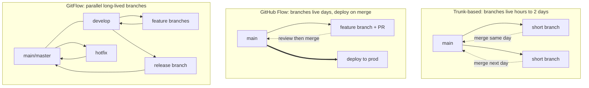

# Branching strategies that scale

## Why this matters

Your team is fifteen engineers. Six months ago someone created `develop`, then `release/2.0`, then a `feature/new-billing` branch that's been open for eleven weeks. This morning the billing feature finally merged, and it touched forty files that have since changed on `develop`. The merge took a senior engineer the entire afternoon, produced three regressions that slipped past review because the diff was 4,000 lines, and blocked the release everyone was waiting on.

None of that was a Git problem. Git did exactly what it was told. It was a *branching strategy* problem — the team picked a model designed for quarterly shrink-wrapped releases and tried to run continuous delivery on top of it. The branches drifted, the merges got expensive, and the cost showed up as shipped bugs and a frustrated release manager.

The strategy you choose decides how often you feel that pain. Get it right and integration is a non-event that happens dozens of times a day. Get it wrong and every merge is a small negotiation with history. This chapter is about choosing deliberately instead of inheriting whatever the first engineer set up.

## Mental model

Every branching strategy is a position on one axis: **how long do branches live before they rejoin the mainline?** Short-lived branches integrate constantly, so divergence stays small and merges stay cheap. Long-lived branches accumulate divergence, and the cost of merging grows with the square of the time they stay open.

There are three models worth knowing, and they sit at different points on that axis:



**Trunk-based development** keeps one shared branch (`main`, the "trunk") always releasable. Engineers commit small changes directly or through branches that live a day at most. Incomplete features hide behind feature flags rather than living on a branch. This is what Google, and most high-throughput teams, actually do. It demands strong CI and feature flagging, and in return it nearly eliminates merge pain.

**GitHub Flow** is trunk-based with a mandatory pull request: branch off `main`, open a PR, get review, merge, deploy. Branches live a few days. It's the pragmatic default for web apps and SaaS where you deploy continuously and there's only ever one version in production.

**GitFlow** maintains parallel long-lived branches: `develop` for integration, `main` for released code, plus `release/*` and `hotfix/*` branches. It was designed in 2009 for software with multiple versions in the wild — desktop apps, libraries, anything with explicit version numbers and support windows. Its own author later added a note saying it's the wrong default for continuously delivered web apps. People kept using it anyway, which is the source of a lot of the pain in the opening scenario.

The opinionated take: **for any team that deploys to a single production environment, use trunk-based development or GitHub Flow.** Reserve GitFlow for software you ship as versioned artifacts to people who choose when to upgrade. Most teams are in the first category and using the second category's tool.

## In practice

### GitHub Flow, the pragmatic default

The whole workflow is four commands and a review:

```bash
$ git switch -c fix-checkout-rounding main   # branch off the latest main
# ... make small, focused commits ...
$ git push -u origin fix-checkout-rounding
# open a PR, get it reviewed, let CI run
$ gh pr merge --squash --delete-branch        # merge and clean up in one step
```

The rules that make it work:

- Branch names describe the change, not the person (`fix-checkout-rounding`, not `gaurav-wip`).
- Keep branches small. A PR that takes more than a day to review is a PR that's too big.
- `main` is always deployable. CI runs on every PR and merge.
- Delete the branch on merge. Stale branches are noise; the history lives in `main`.

### Trunk-based development with feature flags

The hard part of trunk-based isn't the branching — it's shipping incomplete work without breaking production. Feature flags are how. You merge the half-built feature to `main` behind a flag that's off in production:

```typescript
// The new checkout flow is merged to main but dark in production.
// Internal users see it; everyone else gets the old path.
if (featureFlags.isEnabled("new-checkout-flow", { user })) {
  return renderNewCheckout(cart);
}
return renderLegacyCheckout(cart);
```

Now the code integrates continuously — no eleven-week branch — and you control rollout independently of deployment. Turn the flag on for 1% of users, watch your metrics, ramp to 100%. Turn it off instantly if something breaks, with no rollback or revert. Once the feature is fully live and stable, you delete the flag and the old path in a follow-up PR.

### Release branches, when you actually need versions

If you ship versioned releases (a library on npm, a mobile app through an app store), you do need a place to stabilize a version while `main` keeps moving. That's a release branch — but a short-lived one, cut close to release:

```bash
$ git switch -c release/2.4 main
# only bug fixes go here; new features keep landing on main
$ git switch release/2.4 && git cherry-pick <hotfix-sha>   # backport a fix
$ git tag -a v2.4.0 -m "Release 2.4.0" && git push --tags
```

The discipline: features go to `main`, fixes get cherry-picked *to* the release branch, never the reverse. The release branch is a stabilization staging area, not a parallel universe where development happens.

### Choosing, concretely

| Your situation | Use |
|---|---|
| SaaS / web app, one prod environment, deploy daily | GitHub Flow |
| High-throughput team, strong CI, feature flags in place | Trunk-based |
| Library, SDK, mobile, or desktop app with versioned releases | Trunk-based for `main` + short release branches |
| Regulated release with formal QA gates | GitHub Flow + a `release/*` branch per cycle |
| "We use GitFlow because we always have" | Re-evaluate — you probably don't need `develop` |

## Pitfalls and anti-patterns

**1. The long-lived feature branch.** The eleven-week branch from the opening. Divergence compounds: while your branch sits, `main` moves, and the eventual merge has to reconcile every conflicting change at once. The fix is structural, not procedural — break the feature into small pieces that each merge within a day or two, hidden behind a feature flag if they're not yet user-ready. "We'll merge it when it's done" is the phrase that precedes the bad afternoon.

**2. Branching by environment.** Teams create `dev`, `staging`, and `production` branches and "promote" code by merging between them. This guarantees the three branches drift, because hotfixes land on `production` and never make it back to `dev`. Environments are a *deployment* concern (which commit is deployed where), not a *branching* concern. One branch, many deploy targets.

**3. Cherry-pick as a routine workflow.** Cherry-picking copies a commit's changes as a *new* commit with a new hash. Do it routinely between long-lived branches and Git loses track of what's already been applied, so future merges re-conflict on changes that are logically already there. Cherry-pick is a surgical tool for backporting a specific fix, not a substitute for merging.

**4. Never deleting merged branches.** A repo with 400 stale branches is a repo where nobody can tell what's active. Worse, an old branch can hide an unmerged commit that someone assumes is in `main`. Delete branches on merge (`--delete-branch` does it automatically), and periodically prune: `git branch --merged main | grep -v main | xargs git branch -d`.

**5. Running GitFlow under continuous deployment.** If you deploy on every merge to `main` but also maintain a `develop` branch, the two are in permanent tension — `develop` is "integrated but not released," which is a meaningless state when release happens automatically. You get the overhead of GitFlow with none of its benefit. Either you ship versioned releases (keep the model) or you don't (drop `develop`).

## Production checklist

- [ ] One mainline branch (`main`) that is always releasable
- [ ] Branch protection on `main`: required PR reviews, required passing CI, no direct pushes, no force-pushes
- [ ] Branches are short-lived — a team norm of "merge within two days or split it up"
- [ ] Branch names describe the change, with an optional team prefix convention (`fix/`, `feat/`)
- [ ] A feature-flag system in place so incomplete work can merge without shipping
- [ ] Branches auto-deleted on merge (`gh pr merge --delete-branch`, or the repo setting)
- [ ] CI runs on every PR and on every push to `main`
- [ ] A documented, written branching policy in the repo's `CONTRIBUTING.md` so the strategy survives team turnover
- [ ] If you ship versions: a release-branch + tagging convention, with fixes cherry-picked *to* the release branch only
- [ ] A periodic stale-branch cleanup (manual or automated)

## Exercises

1. **(Comprehension)** Explain in two or three sentences why a feature branch that lives for two months is more expensive to merge than the same total amount of change split across ten branches that each live two days. What specifically grows, and why does it grow faster than linearly?

2. **(Applied)** Take a feature you'd normally build on a long branch — say, replacing a payment provider — and write a merge plan that lands it on `main` in at least four increments, each independently mergeable and shippable, using a feature flag to keep the new path dark until it's ready. List the increments in order and note which one introduces the flag and which one removes it.

3. **(Design)** Your company is splitting one product into two: a continuously-deployed web app and a versioned SDK that customers embed and upgrade on their own schedule. Design the branching strategy for each, in the same monorepo. Address: how releases are cut for the SDK without slowing web-app deploys, how a security fix reaches both an old supported SDK version and `main`, and what branch protection rules each needs.

## Further reading

- Paul Hammant, [*Trunk Based Development*](https://trunkbaseddevelopment.com/) — the definitive reference site, including the "scaled trunk-based development" pattern for larger teams
- Vincent Driessen, ["A successful Git branching model"](https://nvie.com/posts/a-successful-git-branching-model/) — the original 2009 GitFlow post; read the 2020 note at the top where the author explains when *not* to use it
- Forsgren, Humble, and Kim, *Accelerate* (2018) — the DORA research linking short-lived branches and trunk-based development to elite delivery performance
- GitHub, ["Understanding the GitHub flow"](https://docs.github.com/en/get-started/using-github/github-flow) — the concise official description
- Winters, Manshreck, and Wright, *Software Engineering at Google* (2020), chapter on version control — why a near-trunk-based monorepo model works at extreme scale

> **Connect the dots:** Branching strategy and deployment strategy are two halves of the same decision. Trunk-based development is only safe if your CI/CD pipeline (Part 8) can catch regressions before they reach users, and feature flags only pay off if you have the observability (Part 9) to watch a 1% rollout and the metrics to decide whether to ramp or roll back. Choosing a branching model without the pipeline to support it is how teams end up "doing trunk-based" while shipping broken `main` builds.

> **Security note:** Branch protection on `main` is a security control, not just a process nicety. Without "no force-push" enabled, a compromised or careless contributor can rewrite history to hide a malicious commit, or erase the audit trail of who changed what. Require signed commits (`git config commit.gpgsign true` plus a verified key) on protected branches for any repo where provenance matters, and require status checks so a secret-scanning CI job (Part 10) runs before code can merge. A branch that anyone can force-push is a branch whose history you cannot trust.
