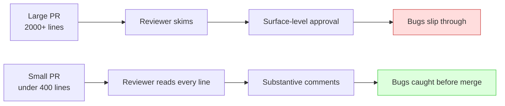

# The pull-request workflow

## Why this matters

A pull request lands in your queue at 4:45 on a Thursday. It's 2,100 lines across thirty-one files, titled "Refactor billing + add invoices + misc fixes." You have a meeting in fifteen minutes. You skim it, see that CI is green, leave a "LGTM 👍", and merge. Two weeks later a customer is double-charged, and the post-incident review traces it to a three-line change buried on page nineteen of that diff — a change that flipped a comparison operator, that no human actually read.

That PR failed before you ever opened it. Not because you were lazy, but because a 2,100-line, three-purpose pull request is physically unreviewable in the time anyone has. The research is consistent here: review effectiveness collapses past a few hundred lines, and defect-detection drops sharply when reviewers process more than that in a sitting. The author set the reviewer up to rubber-stamp.

The pull request is the single most important quality gate most teams have — the one place where a second human looks at a change before it reaches users. How you write PRs and how you review them determines whether that gate catches bugs or just adds latency. This chapter is about making it catch bugs.

## Mental model

A pull request is two things at once, and most teams only think about the first. It's a **mechanism** — a branch proposed for merging, with CI and a merge button. It's also a **communication artifact** — one engineer explaining a change to another, and to everyone who reads the history later. The mechanism is automatic. The communication is the part that takes skill, and the part that pays off.

The core dynamic is the relationship between PR size and review quality:



Smaller PRs aren't just easier to review — they're reviewed *differently*. Under a few hundred lines, a reviewer reads every line and reasons about it. Past that, they pattern-match and trust CI. The same reviewer produces dramatically different review quality depending only on what you handed them. The most effective thing an author can do for review quality is keep the diff small and single-purpose.

The lifecycle has a shape worth internalizing: branch → draft → ready for review → review rounds → approval → merge → delete. Each transition is a signal. Opening as a draft says "not ready, but here's the direction." Marking ready says "I've self-reviewed, this is your turn." Approving says "I've read this and I'd ship it." When those signals are honest, the workflow is fast. When they're noise — drafts that are actually done, approvals that mean "I trust you" — the gate stops working.

## In practice

### Writing a PR that gets a real review

The description does the reviewer's loading work for them. A good one answers three questions before they read a single line of code:

```markdown
## What
Fix double-charge when a payment retry races with a webhook.

## Why
Stripe can deliver the `charge.succeeded` webhook before our synchronous
retry returns. Both paths created a Payment row, so the customer was
charged once but billed twice. Repro steps in PAY-1423.

## How
Make payment creation idempotent on the Stripe charge ID via a unique
constraint, and upsert instead of insert. The webhook and the retry now
converge on the same row.

## Testing
- Added a test that fires both paths concurrently and asserts one Payment row.
- Manually reproduced the race on staging, confirmed fixed.
```

Then the discipline that earns fast reviews:

- **One purpose per PR.** "Refactor billing" and "add invoices" are two PRs. If your title needs an "and," split it.
- **Self-review first.** Open your own diff on GitHub before requesting review. You'll catch the debug `console.log`, the commented-out block, the file you didn't mean to commit. Reviewing your own PR is the cheapest review there is.
- **Keep it under ~400 lines of real change.** Generated files and lockfiles don't count; logic does. If you can't get under that, it's usually a sign the change should be staged across several PRs behind a feature flag (see [branching strategies](02-branching-strategies.md)).
- **Leave inline comments on your own tricky bits.** A one-line "this looks odd but it's load-bearing because X" pre-empts a round-trip.

### Reviewing well

A good review is not a search for style violations — the linter does that. It's a search for the things only a human can catch:

- **Correctness:** Does this do what the description claims? What input breaks it? Is the concurrent case handled?
- **Missing cases:** What happens on null, on empty, on the error path, on a retry?
- **Design:** Is this the right place for this logic? Will the next person find it?
- **Security and data:** Does this trust user input? Log a secret? Widen access?

Phrase comments so they teach instead of scold. "Consider extracting this — it's the third place we compute tax" lands better than "this is duplicated." The [Conventional Comments](https://conventionalcomments.org/) convention helps: prefix with intent so the author knows what's blocking versus optional.

```
nit: this variable could be `const` — non-blocking
question: what happens if `items` is empty here?
issue (blocking): this query runs inside the loop — N+1 on the orders page
```

Distinguish **blocking** from **non-blocking** explicitly. A review full of nitpicks with one buried real bug trains authors to skim your comments — the same failure mode as the unreviewable PR, in reverse.

### Merge strategies

Three buttons, three different histories:

| Strategy | What it does | Use when |
|---|---|---|
| **Merge commit** | Keeps every branch commit, adds a merge commit | You want the full development history preserved |
| **Squash** | Collapses the branch into one commit on `main` | The default for most teams — one PR, one tidy commit, clean `main` history |
| **Rebase** | Replays branch commits onto `main`, no merge commit | You want linear history *and* meaningful individual commits |

Squash is the sane default: it makes `main`'s history one-commit-per-PR, which is easy to read, easy to revert (`git revert <sha>` undoes exactly one PR), and easy to bisect. Reserve merge commits for when the intermediate commits genuinely matter.

### Stacked PRs, for when work must be sequential

Sometimes a change genuinely depends on another that's still in review. Rather than one giant PR, stack them: branch B off branch A, open B against A. Each PR stays small and reviewable, and they merge bottom-up. Tools like Graphite or `git town` automate the restacking when the base changes, but the core idea is just branching off a branch.

### CODEOWNERS

A `CODEOWNERS` file routes review requests automatically and enforces that the right people see sensitive changes:

```
# .github/CODEOWNERS
/billing/        @payments-team
/infra/          @platform-team
*.tf             @platform-team
/SECURITY.md     @security-team
```

Combined with branch protection, this means a change to `/billing/` *cannot* merge without a payments-team approval, regardless of who opened it.

## Pitfalls and anti-patterns

**1. The mega-PR.** Covered above, but it's the root cause of most review failures, so it's first. The fix is cultural: a team norm that PRs over ~400 lines need a justification, and that "split this up" is a legitimate review response. Authors resist because splitting feels like overhead; it's cheaper than the incident.

**2. Rubber-stamp approval.** "LGTM" thirty seconds after a 500-line PR opens is not a review — it's a signature on an unread document. If you genuinely trust the author and the change is low-risk, say so explicitly ("trusting you on the test changes, read the API change closely") rather than implying you reviewed what you didn't. Honest signals keep the gate meaningful.

**3. The nitpick swarm.** A review with fifteen style comments and no substantive ones. It feels thorough and is nearly worthless — the linter should own style, freeing humans for logic. Configure the formatter and linter to auto-fix style on commit, and spend review attention on correctness.

**4. PR ping-pong from slow turnaround.** A PR that gets one comment a day takes a week to merge a day's work, and by then `main` has moved and the branch needs rebasing. Treat review as interrupt-priority work, not "when I get to it." A team SLA — review within a few hours during the workday — does more for delivery speed than almost any tooling.

**5. Approving your own escape hatch.** Letting authors merge their own PRs without review "just this once" for urgent fixes. Urgent fixes are exactly when mistakes happen. Keep the required-review rule even for hotfixes; if speed is the concern, make review fast, don't make it optional.

## Production checklist

- [ ] Branch protection on `main` requires at least one approving review before merge
- [ ] CI status checks are required and must pass before the merge button activates
- [ ] A PR template (`.github/pull_request_template.md`) prompts for What / Why / How / Testing
- [ ] `CODEOWNERS` routes reviews and enforces approval on sensitive paths
- [ ] Squash-merge is the default; branches auto-delete on merge
- [ ] A documented team norm on PR size (~400 lines of logic) and a culture that splitting is fine
- [ ] Linting and formatting run automatically (pre-commit and CI) so reviews aren't about style
- [ ] A review-turnaround expectation written down (e.g., within the workday)
- [ ] Authors self-review their diff before requesting review
- [ ] "Blocking" vs "non-blocking" is an explicit convention in review comments

## Exercises

1. **(Comprehension)** A teammate argues that PR size doesn't matter because CI catches bugs anyway, so big PRs are fine if the tests pass. Give two specific classes of defect that a human reviewer catches but a typical test suite does not, and explain why review quality still depends on PR size.

2. **(Applied)** Take a real PR you've opened (or write a 300-line change) and produce: a description following the What/Why/How/Testing template, three inline self-review comments on the trickiest parts, and a list of the specific things you'd want a reviewer to scrutinize. Then review it as if you were the reviewer and write the comments you'd leave, labeled blocking vs non-blocking.

3. **(Design)** Design a PR workflow for a 40-engineer org with three teams sharing one monorepo, where some directories are security-sensitive (auth, payments) and some changes need to ship within an hour (incident hotfixes). Specify: branch protection rules, CODEOWNERS structure, merge strategy, how hotfixes get reviewed quickly without bypassing review, and how you'd measure whether the workflow is helping or just adding latency.

## Further reading

- Google, [*Code Review Developer Guide*](https://google.github.io/eng-practices/review/) — the most complete public guide to reviewing and authoring changes, from a company that reviews everything
- [Conventional Comments](https://conventionalcomments.org/) — a small convention that makes review comments unambiguous about intent and severity
- Michael Lynch, ["How to Make Your Code Reviewer Fall in Love with You"](https://mtlynch.io/code-review-love/) — the author's side of the workflow, concrete and practical
- SmartBear, *Best Kept Secrets of Peer Code Review* — the source of the widely-cited finding that review effectiveness drops past ~400 lines per review
- GitHub, [*About protected branches*](https://docs.github.com/en/repositories/configuring-branches-and-merges-in-your-repository/managing-protected-branches/about-protected-branches) — the reference for the enforcement side

> **Connect the dots:** This chapter is the *mechanics* of pull requests — the workflow, the protection rules, the merge buttons. The *craft* of giving review feedback that grows engineers rather than just gating code is its own skill, covered in [Code review as a teaching act](../part-14-craft-career/README.md) in Part 14. The two reinforce each other: good mechanics make room for good craft, and good craft is wasted if the mechanics let unreviewed code through.

> **Security note:** The PR is a security boundary, and three settings make it real. Require reviews so no single person can ship code alone — that's both a quality control and a defense against a compromised account pushing malicious code unseen. Use `CODEOWNERS` to force security-team review on sensitive paths (auth, crypto, infra, CI configuration). And never let authors approve their own PRs: self-approval defeats the entire point of a second set of eyes. For supply-chain-sensitive repos, also require that CI config changes get extra scrutiny — a PR that quietly edits the build pipeline (Part 10) can exfiltrate secrets without touching any application code.
