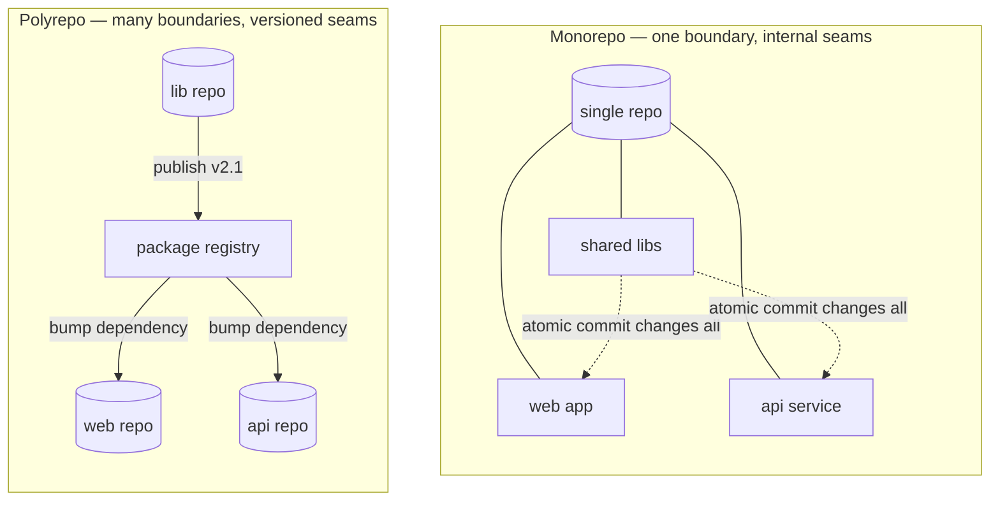

# Monorepos vs. polyrepos

## Why this matters

Your company has twenty-three repositories. A shared logging library lives in one of them. This morning you shipped a fix to that library, cut a new version, and now you need every service to pick it up. So you open twenty-two pull requests to bump the dependency, each with its own CI run, its own reviewer, its own merge. Three of them have conflicting lockfile changes. Two services are pinned to an old major version and break on upgrade. A week later, four services are still on the buggy version because nobody got to their PR.

The same week, a friend at another company makes the identical fix in their monorepo. One commit changes the library and all twenty-two call sites together. CI runs once, against everything. The change is atomic — there is no window where the library is fixed but the services aren't. It merges in an hour.

Neither setup is "correct." The monorepo traded away independent versioning and bought atomic cross-cutting changes. The polyrepo traded away atomicity and bought hard isolation between teams. Most engineers inherit one or the other and never realize it was a choice with consequences they feel every week. This chapter is about understanding the trade so you can choose deliberately — and operate whichever one you're in without fighting it.

## Mental model

The question is not "one repo or many." It's **where do you put the boundary that forces coordination?** Every codebase has seams where one team's change affects another. A monorepo puts those seams *inside* one repository, where a single commit can cross them. A polyrepo puts them *between* repositories, where crossing them means versioned releases and dependency bumps.



The trade comes down to four properties:

| Property | Monorepo | Polyrepo |
|---|---|---|
| **Cross-cutting change** | Atomic — one commit, one review | Coordinated — N PRs, version bumps |
| **Isolation between teams** | Weak — everyone shares one history | Strong — a repo is a hard boundary |
| **Tooling burden** | High — needs build/CI tooling that scales | Low — standard tools work per-repo |
| **Dependency versioning** | One version of everything, always | Each repo pins what it wants |

The opinionated take: **a monorepo is the better default for a single organization building a connected product**, because most of the cost is cross-cutting changes and shared-code reuse, and the monorepo makes those cheap. The polyrepo wins when you have genuinely independent units — open-source libraries with external consumers, products with separate release cadences, or teams that *must* be isolated for compliance or acquisition reasons. The mistake is picking polyrepo by default because "microservices = many repos," which conflates a deployment-architecture decision with a source-control decision. You can run fifty microservices out of one monorepo; Google, and many others, do.

## In practice

### Running a monorepo without it falling over

The thing that kills naive monorepos is that standard tooling assumes "the repo is the unit of work." At scale, you need tooling that understands *which part* of the repo changed and only builds and tests that. The package layout comes first:

```
my-monorepo/
├── apps/
│   ├── web/          # Next.js app
│   └── api/          # backend service
├── packages/
│   ├── logging/      # the shared lib from the opening
│   ├── ui/           # shared components
│   └── config/       # shared tsconfig, eslint
├── pnpm-workspace.yaml
└── turbo.json
```

A JS/TS workspace ties the packages together so `logging` is a local dependency, not a published one:

```yaml
# pnpm-workspace.yaml
packages:
  - "apps/*"
  - "packages/*"
```

Now `apps/web` depends on `logging` with `"@acme/logging": "workspace:*"` — it always uses the in-repo version, so the fix from the opening is atomic by construction.

The second piece is a build system that only does work for what changed. Turborepo, Nx, and Bazel all do this; here's the Turborepo idea:

```json
// turbo.json — define the task graph; the tool figures out what to skip
{
  "tasks": {
    "build": { "dependsOn": ["^build"], "outputs": ["dist/**"] },
    "test":  { "dependsOn": ["build"] },
    "lint":  {}
  }
}
```

```bash
# Only builds/tests packages affected by the diff against main, using cache
$ turbo run test --filter='...[origin/main]'
```

That `--filter` is the whole game: a change to `packages/ui` tests `ui` and the apps that depend on it, and skips `api` entirely. Without affected-only builds, every PR runs the entire test suite and CI time grows with the repo.

The third piece is `CODEOWNERS` (from the [PR workflow chapter](03-pull-request-workflow.md)) doing the isolation work that separate repos would otherwise do — routing `apps/api/` reviews to the API team, `packages/ui/` to design systems.

### Keeping a monorepo fast as it grows

Git itself slows down on huge repos. The mitigations, in rough order of when you'll need them:

```bash
# Partial clone — skip historical file contents, fetch on demand
$ git clone --filter=blob:none <url>

# Sparse checkout — only materialize the directories you work in
$ git sparse-checkout init --cone
$ git sparse-checkout set apps/web packages/ui

# Shallow clone for CI — no history needed to build
$ git clone --depth=1 <url>
```

For very large repos, Git's own `scalar` tool (`scalar clone`) bundles partial clone, sparse checkout, and background maintenance into one wrapper.

### Operating well in a polyrepo

If you're in a polyrepo, the work is making cross-repo changes less painful:

- **Automate dependency bumps.** Renovate or Dependabot open the version-bump PRs for you across repos, so the opening scenario is twenty-two automated PRs you batch-merge, not twenty-two manual ones.
- **Publish to a private registry.** Shared libraries go to a registry (npm, Artifactory, GitHub Packages) with semantic versioning ([next chapter](05-conventional-commits-semver.md)) so consumers upgrade on a schedule.
- **Contract tests at the seams.** Because changes aren't atomic, you need tests that catch when a library's new version breaks a consumer *before* the consumer upgrades — consumer-driven contract testing (Part 11).

## Pitfalls and anti-patterns

**1. Polyrepo by reflex because "microservices."** The most common mistake. Service independence is about *deployment* — each service ships on its own pipeline. That has nothing to do with whether the source lives in one repo or many. Splitting into one-repo-per-service multiplies your dependency-management and cross-cutting-change cost for an isolation benefit you may not need. Decide source layout and deployment topology separately.

**2. A monorepo with no affected-only build.** A monorepo where every PR runs every test is a monorepo that gets slower every week until CI takes an hour and people stop trusting it. The build tooling (Turborepo/Nx/Bazel with caching and `--filter`) is not optional at scale — it's the thing that makes the monorepo viable. Adopt it early, not after CI is already painful.

**3. Shared code with no ownership.** In a monorepo, it's easy to drop a utility into `packages/shared` that everyone imports and nobody owns. It rots, accumulates special cases for each caller, and becomes un-changeable because every edit risks breaking ten teams. Every shared package needs a `CODEOWNERS` entry and a maintaining team, same as a published library would have.

**4. Polyrepo "shared" code copy-pasted instead of versioned.** The polyrepo failure mode: instead of publishing the logging library and depending on it, teams copy the file into each repo "to avoid the dependency." Now the same bug exists in twenty-two slightly-diverged copies and the fix has to be re-applied twenty-two times by hand. If it's shared, publish it; don't fork it.

**5. Migrating repos and losing history.** When consolidating polyrepos into a monorepo, a naive copy-paste of files discards every repo's commit history — blame, bisect, and the record of *why* code is the way it is all vanish. Use `git subtree` or a purpose-built tool (`tomono`, `git-filter-repo`) that grafts each repo's full history into a subdirectory of the monorepo.

## Production checklist

- [ ] The source-layout decision (mono vs. poly) was made deliberately, not inherited, and is written down with its rationale
- [ ] If monorepo: a workspace tool (pnpm/yarn/npm workspaces) wires internal packages as local dependencies
- [ ] If monorepo: an affected-only build system (Turborepo / Nx / Bazel) with remote caching, so CI scales with the diff, not the repo
- [ ] If monorepo: `CODEOWNERS` enforces per-directory ownership, doing the isolation work
- [ ] If monorepo at scale: partial clone + sparse checkout (or `scalar`) documented for contributors and CI
- [ ] If polyrepo: automated dependency updates (Renovate / Dependabot) across repos
- [ ] If polyrepo: shared code is published to a registry with semantic versioning, never copy-pasted
- [ ] If polyrepo: contract tests guard the seams between independently-versioned units
- [ ] Every shared package or library has a named owning team
- [ ] Any repo consolidation preserves history via `git subtree` / `git-filter-repo`, not copy-paste

## Exercises

1. **(Comprehension)** Explain why a fix to a shared library is "atomic" in a monorepo but "coordinated" in a polyrepo, and name one concrete failure that the non-atomic version makes possible that the atomic version does not.

2. **(Applied)** Set up a minimal pnpm (or npm) workspace with two apps and one shared package, where both apps import the shared package as a `workspace:*` dependency. Make a breaking change to the shared package's API and update both call sites in a single commit. Then add a Turborepo `turbo.json` and demonstrate that `turbo run test --filter='...[HEAD~1]'` only tests the affected packages.

3. **(Design)** Your org has eight microservices in eight repos, plus three shared libraries also in their own repos, and cross-cutting changes have become the team's biggest source of friction. Design a migration to a single monorepo: the package/app layout, the build-and-CI strategy so per-service deploys stay independent, how you'd preserve each repo's history, and how you'd keep the eight services deployable on their own pipelines after the move. Identify the two biggest risks and how you'd de-risk them.

## Further reading

- Rachel Potvin and Josh Levenberg, ["Why Google Stores Billions of Lines of Code in a Single Repository"](https://cacm.acm.org/magazines/2016/7/204032-why-google-stores-billions-of-lines-of-code-in-a-single-repository/fulltext) — *Communications of the ACM*, the definitive case study on monorepos at extreme scale
- [Monorepo.tools](https://monorepo.tools/) — a vendor-neutral comparison of monorepo build systems (Turborepo, Nx, Bazel, and others)
- Matt Klein, ["Monorepos: Please don't!"](https://medium.com/@mattklein123/monorepos-please-dont-e9a279be011b) — the strongest articulation of the polyrepo case; read it against the Google paper to see both sides
- Microsoft, [*Scalar* and partial clone documentation](https://github.com/microsoft/scalar) — the tooling that makes very large Git repos usable
- Winters, Manshreck, and Wright, *Software Engineering at Google* (2020) — chapters on version control and dependency management, for how the monorepo trade plays out over decades

> **Connect the dots:** The monorepo-vs-polyrepo choice ripples straight into your CI/CD design (Part 8). A monorepo demands a pipeline that detects which services a commit touched and deploys only those; a polyrepo gets a simpler per-repo pipeline but pays at integration time. It also interacts with [semantic versioning](05-conventional-commits-semver.md): polyrepos lean hard on semver to coordinate the seams between repos, while monorepos can often skip internal versioning entirely because everything moves together.

> **Security note:** Repository structure is an access-control boundary. In a polyrepo, you can grant a contractor access to exactly one repo. In a monorepo, *everyone with clone access can read everything*, so secrets, security-sensitive code, and proprietary algorithms are all exposed to the whole org by default — which is why monorepos must never contain plaintext secrets and should use path-based protections plus secret-scanning (Part 10) in CI. If you have code that genuinely must be readable by only a subset of engineers (key management, fraud heuristics, unreleased acquisitions), that's one of the few hard reasons to keep it in a separate repo regardless of your default.
