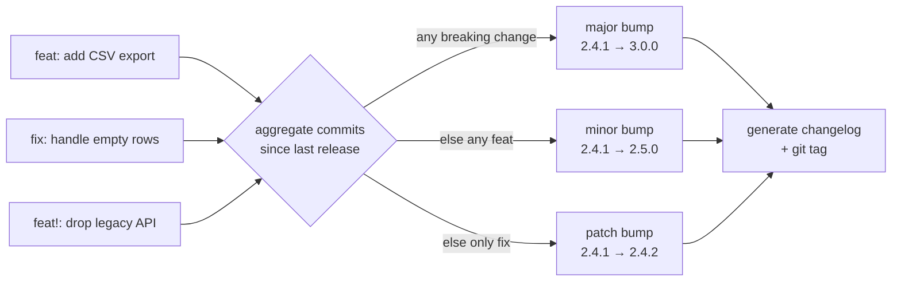

# Conventional commits and semantic versioning

## Why this matters

A customer files a bug: "your SDK broke our build after we upgraded." You check — they went from `2.4.1` to `2.5.0`, a minor bump, which by every convention means *backward-compatible, safe to take*. Except someone had renamed an exported function in that release and called it a minor change because "it's just a rename." The customer's build is red, their trust is dented, and your team spends the afternoon shipping `2.5.1` to restore the old name as an alias.

That whole incident was a versioning failure. The number `2.5.0` is a *promise* — it tells consumers "nothing you depend on was removed or changed." When the number lies, automated upgrades break, dependency ranges (`^2.4.0`) pull in incompatible code, and the entire ecosystem of tools that trusts those numbers does the wrong thing silently.

The other half of the problem is upstream: how does anyone know `2.5.0` should have been `3.0.0`? If commit messages are "fix stuff" and "wip," a human has to read every diff to decide the version — and humans are inconsistent and busy. Conventional commits make the commit history machine-readable, so the version bump and the changelog can be *computed* from the commits rather than guessed. Together, these two conventions turn release management from a manual, error-prone ritual into something automated and trustworthy. This chapter is how they fit together.

## Mental model

These are two conventions that compose into one pipeline. **Conventional Commits** is a format for commit messages that encodes *what kind* of change each commit is. **Semantic Versioning** (semver) is a format for version numbers that encodes *how compatible* a release is. The link between them is automatable: the kinds of commits since the last release determine the next version number.



Semver's three numbers — `MAJOR.MINOR.PATCH` — each carry a specific promise:

- **MAJOR** (`3.0.0`): a breaking change. Something was removed or changed incompatibly. Consumers must read the migration notes before upgrading.
- **MINOR** (`2.5.0`): new functionality, fully backward-compatible. Safe to take; nothing you used was removed.
- **PATCH** (`2.4.2`): a backward-compatible bug fix. Always safe.

The rename in the opening was a breaking change wearing a minor-version costume. Under semver's contract, removing or renaming an exported symbol is *always* a major bump, no matter how small the diff.

Conventional Commits encodes the same three tiers in the commit message prefix. `fix:` maps to PATCH, `feat:` maps to MINOR, and a `!` or a `BREAKING CHANGE:` footer maps to MAJOR. A release tool reads every commit since the last tag, takes the highest tier present, and computes the next version. The number stops being a human judgment call and becomes a function of the history.

## In practice

### The Conventional Commits format

```
<type>[optional scope][optional !]: <description>

[optional body]

[optional footer(s)]
```

The types you'll actually use:

```bash
feat: add CSV export to the reports page        # → MINOR
fix: prevent crash when the cart is empty        # → PATCH
docs: clarify the auth setup steps               # → no release
refactor: extract the tax calculation            # → no release
test: add cases for the retry path               # → no release
chore: bump CI runner to node 22                 # → no release
perf: cache the user lookup                       # → PATCH (or MINOR by policy)
```

A breaking change is marked two equivalent ways — a `!` before the colon, or a `BREAKING CHANGE:` footer (the footer is preferred when you want to explain the migration):

```
feat!: remove the deprecated v1 export API

BREAKING CHANGE: `exportLegacy()` is gone. Use `export({ format: 'v1' })`.
Migration guide: https://docs.acme.dev/migrate-v3
```

The scope, in parentheses, names the area of the change and shows up grouped in changelogs:

```
feat(billing): add proration for mid-cycle upgrades
fix(auth): reject expired refresh tokens
```

### Automating the release

Once commits follow the format, a release tool does the version bump, the changelog, the tag, and the publish. `semantic-release` and `release-please` are the common choices. The config is small:

```json
// .releaserc.json
{
  "branches": ["main"],
  "plugins": [
    "@semantic-release/commit-analyzer",
    "@semantic-release/release-notes-generator",
    "@semantic-release/changelog",
    "@semantic-release/npm",
    "@semantic-release/github"
  ]
}
```

In CI, after a merge to `main`:

```bash
$ npx semantic-release
# analyzes commits since the last tag, sees a feat! → computes 3.0.0,
# writes CHANGELOG.md, tags v3.0.0, publishes to npm, opens a GitHub release
```

The output is a changelog you didn't write by hand, grouped by type and scope, with breaking changes called out at the top — generated from the commits, so it's always accurate.

### Enforcing the format

A convention nobody follows is worse than none, because the automation silently does the wrong thing. Enforce it at commit time with a hook and in CI:

```bash
# commitlint checks the message against the Conventional Commits rules
$ echo "fixed the thing" | npx commitlint
⧗   input: fixed the thing
✖   subject may not be empty [subject-empty]
✖   type may not be empty [type-empty]
```

Wire it into a `commit-msg` hook (via husky) so a malformed message can't be committed, and add the same check as a required CI status on PRs.

### Versioning many packages in a monorepo

If you publish several packages from one [monorepo](04-monorepos-vs-polyrepos.md), the question becomes whether they share a version or each get their own. Two models: **fixed** (everything bumps together, like Babel or Angular — one `feat` anywhere moves the whole suite's version) and **independent** (each package versions on its own commits, like most of the Nx and changesets ecosystem). The `changesets` tool is the common pick for independent versioning: a contributor adds a small markdown "changeset" file declaring the bump for each package they touched, and the release job aggregates them into per-package versions and changelogs.

```bash
$ npx changeset            # interactively records which packages bump and how
$ npx changeset version    # consumes changesets, writes versions + CHANGELOGs
$ npx changeset publish     # publishes the bumped packages to the registry
```

Independent versioning keeps a consumer of one package from being forced to take a new version just because an unrelated package in the same repo changed — which matters precisely when your packages have external consumers.

### Pre-1.0 and pre-release versions

Two corners worth knowing. Before `1.0.0`, semver's rules relax — the API is considered unstable and breaking changes can land in minor bumps (`0.4.0` → `0.5.0`). Don't depend on a `0.x` library without pinning. And pre-release tags (`2.0.0-beta.1`, `2.0.0-rc.2`) let you ship a major version for testing before committing to it; tooling treats them as "newer than 1.x, older than 2.0.0 final."

## Pitfalls and anti-patterns

**1. The dishonest version bump.** The opening scenario: a breaking change shipped as minor or patch because it "felt small." Size of diff has nothing to do with semver tier — *compatibility* does. Removing an export, renaming a parameter, tightening a validation that used to pass, changing a default: all breaking, all major. The fix is to make the version computed from `feat!`/`BREAKING CHANGE` commits so a human's sense of "how big it feels" never enters the decision.

**2. Treating the commit subject as a diary.** "wip", "fixes", "address review", "actually fix it this time." These carry no information for tooling or for the next person reading `git log`. Even without full automation, a subject that completes "this commit will..." ("fix the empty-cart crash") is worth writing. Conventional Commits just gives that instinct a machine-readable shape.

**3. Putting the breaking change in the body but not the marker.** Writing a great explanation of a breaking change in the commit body but forgetting the `!` or the `BREAKING CHANGE:` footer. The release tool keys off the marker, not your prose — no marker means no major bump, and the lie ships. The marker is load-bearing; the prose is for humans.

**4. Squash-merging and losing the types.** If your team squash-merges (the common default), the *PR title* becomes the commit on `main` — so the PR title must be the conventional commit, not the messy branch commits. Configure the repo to validate PR titles against the format, or the squashed history won't drive the automation. This is the most common reason "we set up semantic-release and it never bumps anything."

**5. Caret ranges plus dishonest versions.** `"^2.4.0"` means "any `2.x` at or above `2.4.0`," which is only safe if every minor and patch release in that range is genuinely compatible. The range is built on trust in semver. One dishonest minor bump anywhere upstream and `npm install` pulls in a break with no code change on your side. This is *why* the honesty in pitfall #1 matters beyond your own repo — the whole dependency ecosystem assumes it.

## Production checklist

- [ ] Conventional Commits is the documented commit format, in `CONTRIBUTING.md`
- [ ] `commitlint` runs in a `commit-msg` hook and as a required CI check
- [ ] If you squash-merge: PR titles are validated against the conventional format
- [ ] A release tool (`semantic-release` / `release-please`) computes the version from commits in CI
- [ ] `CHANGELOG.md` is generated, never hand-edited
- [ ] Releases are git-tagged (`vX.Y.Z`) and the tag triggers the publish
- [ ] Breaking changes always use `!` or a `BREAKING CHANGE:` footer with a migration note
- [ ] The team agrees on whether `perf:` is PATCH or MINOR, and it's written down
- [ ] Pre-1.0 libraries are pinned by consumers; the `0.x` instability rule is understood
- [ ] Public API surface is explicitly defined so "what counts as breaking" is unambiguous

## Exercises

1. **(Comprehension)** For each change, give the semver tier and the conventional commit prefix: (a) adding an optional parameter with a default to a public function, (b) removing an optional parameter, (c) fixing a typo in an error message string that a consumer's test asserts on, (d) making a previously-synchronous function return a Promise. Justify the two that are most likely to be mis-classified.

2. **(Applied)** Take a small library (or make one with three exported functions) and set up `commitlint` + a release tool so that pushing a `fix:`, a `feat:`, and a `feat!:` commit each produces the correct version bump and a generated changelog entry. Verify that a non-conventional commit message is rejected by the hook.

3. **(Design)** You maintain a widely-used library and need to remove a function that 60% of your users call, but you can't break them overnight. Design a deprecation-and-release plan using semver and conventional commits: how you signal the deprecation, across which versions, what the commit and version sequence looks like from "still works with a warning" to "removed," and how you communicate the migration so an automated `^` upgrade never silently breaks someone.

## Further reading

- [Semantic Versioning 2.0.0](https://semver.org/) — the full spec by Tom Preston-Werner; short enough to read in one sitting and the canonical source of the rules
- [Conventional Commits 1.0.0](https://www.conventionalcommits.org/) — the format specification, with the exact mapping to semver
- [semantic-release documentation](https://semantic-release.gitbook.io/semantic-release/) — the reference implementation of fully-automated, commit-driven releases
- [commitlint](https://commitlint.js.org/) — the linter and the standard `@commitlint/config-conventional` ruleset
- Titus Winters, ["What is an API?"](https://abseil.io/resources/swe-book/html/ch16.html) (*Software Engineering at Google*, ch. 16) — the deeper question of what your "public surface" even is, which determines what counts as breaking

> **Connect the dots:** Semantic versioning is the contract that makes [polyrepos](04-monorepos-vs-polyrepos.md) workable — it's how independently-versioned units coordinate across repo boundaries. It also underpins API versioning and backward compatibility (Part 13): the same "what counts as a breaking change" question shows up whether you're versioning a library, a REST API, or an event schema. Get the definition of "breaking" right once and it transfers across all three.

> **Security note:** Version numbers are a supply-chain attack surface. Dependency ranges like `^2.4.0` auto-pull new releases, so a compromised upstream package can ship malware in a "patch" that your `npm install` silently takes — the basis of several real npm and PyPI attacks. Defenses: commit your lockfile so installs are reproducible and reviewable, enable a CI audit (`npm audit`, Dependabot alerts) that flags known-malicious versions, and for high-stakes dependencies pin exact versions rather than ranges. The convenience of automatic semver upgrades is exactly the mechanism an attacker exploits, so treat dependency updates as code changes that get reviewed (Part 10), not as invisible background noise.
