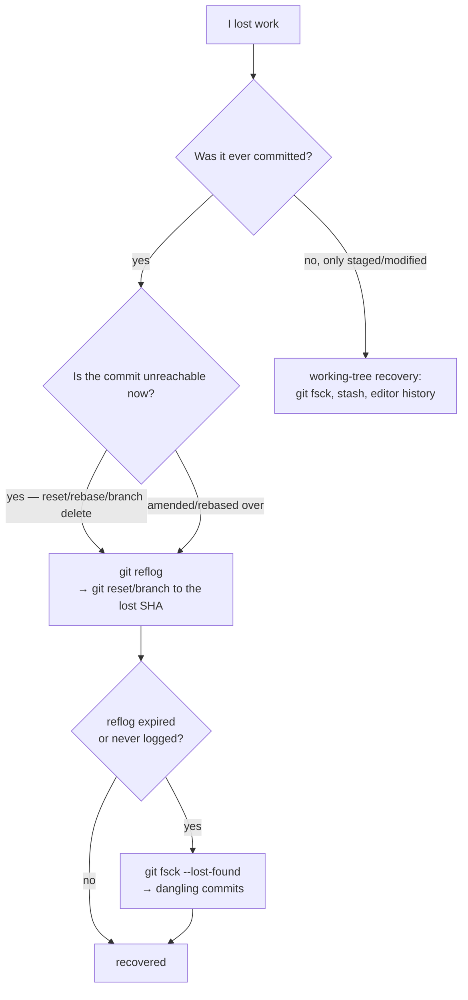

# Recovering from Git disasters

## Why this matters

It's 6 p.m. and you're cleaning up before the weekend. You meant to run `git reset --hard HEAD~1` to drop one bad commit. Your finger slips and it's `git reset --hard HEAD~10`. Ten commits — a full day's work from you and two teammates — vanish from the branch. `git log` shows them gone. `git status` says the working tree is clean. Your stomach drops.

Here is the thing almost nobody is told clearly: **that work is not gone.** Git is, at heart, an append-only object store ([the internals chapter](01-git-internals.md) walks through why). A `reset` doesn't delete commits — it just moves a pointer. The commit objects are still sitting in `.git/objects/`, fully intact, and they stay there for weeks before garbage collection even considers them. The only thing you've lost is the *reference* to them, and references are exactly what Git keeps a log of.

The difference between a five-minute recovery and a ruined weekend is entirely whether you know the three or four commands that find unreferenced commits. Engineers who know them treat a botched reset as a minor annoyance. Engineers who don't re-do the work, or worse, tell the team it's lost. This chapter is the recovery toolkit, organized by the disaster you're staring at.

## Mental model

Almost every "I lost my work" situation is really "I lost a *reference* to my work." Commits become **unreachable** — not deleted — when no branch, tag, or `HEAD` points to them or their descendants. Unreachable is a recoverable state. Actually-gone only happens after garbage collection prunes unreachable objects, which by default requires them to be both unreferenced *and* older than the reflog expiry (~90 days for reachable, ~30 for unreachable).



Two safety nets catch almost everything. The **reflog** records every move of `HEAD` and of each branch ref — every commit, checkout, reset, rebase, merge — so even when `git log` can't see a commit, the reflog remembers the SHA you were at before the disaster. When the reflog can't help (the change was never a ref move, or the reflog entry expired), **`git fsck`** enumerates every object in the store and reports the ones nothing points to — the "dangling" commits and blobs.

The mental shift that makes you calm in a disaster: stop asking "how do I undo this?" and start asking "what SHA was I at before this, and how do I point a branch back at it?" Recovery is almost always *re-pointing a reference*, not *reversing an operation*.

## In practice

### Disaster 1: hard reset to the wrong place

The opening scenario. The reflog has your previous position:

```bash
$ git reflog
a1b2c3d HEAD@{0}: reset: moving to HEAD~10
9f8e7d6 HEAD@{1}: commit: add invoice export      ← the work I want back
3c2b1a0 HEAD@{2}: commit: fix rounding
...
$ git reset --hard HEAD@{1}      # back to exactly where I was
HEAD is now at 9f8e7d6 add invoice export
```

`HEAD@{1}` means "where HEAD was one move ago." You can also reset directly to the SHA. The ten commits are back, working tree and all.

### Disaster 2: committed to the wrong branch

You made three commits on `main` that belonged on a feature branch:

```bash
$ git switch -c feature-x          # create the branch here, at the current commit
$ git switch main
$ git reset --hard HEAD~3          # rewind main; the commits live on feature-x now
```

Nothing is lost because `feature-x` now references those commits before you rewind `main`.

### Disaster 3: deleted a branch that wasn't merged

```bash
$ git branch -D feature-y          # gone from branch list
# find the tip commit it pointed at:
$ git reflog | grep feature-y
# or, if reflog doesn't show it:
$ git fsck --no-reflogs --lost-found
dangling commit 7a6b5c4...
$ git branch feature-y 7a6b5c4     # re-create the branch at that commit
```

### Disaster 4: a rebase or amend ate a commit

`git commit --amend` and `git rebase` replace commits with new ones; the originals become unreachable but survive. The reflog has the pre-operation state, and for rebases specifically there's a dedicated marker:

```bash
$ git reflog
8d7c6b5 HEAD@{0}: rebase finished: returning to refs/heads/main
...
4e3d2c1 HEAD@{5}: rebase (start): checkout main~4   ← state before the rebase
$ git reset --hard HEAD@{5}        # abandon the rebase result entirely
```

If you're *mid*-rebase and it's going wrong, `git rebase --abort` returns you to the start cleanly — no reflog archaeology needed.

### Disaster 5: lost uncommitted work

Harder, because work that was never committed or staged was never made into an object. Three angles:

```bash
# If you ran `git stash` and then `git stash drop` / `clear` by mistake:
$ git fsck --no-reflogs | grep commit          # stashes are commits; find the dangling one
$ git stash apply <dangling-sha>

# If you staged it (git add) but then lost it — staged content IS an object:
$ git fsck --lost-found                        # blobs land in .git/lost-found/

# If it was only ever in your editor: your editor's local history / autosave
# is often the only copy. Check it before anything else.
```

The lesson encoded in disaster 5: `git add` early and often, because staging turns your work into a recoverable object. Uncommitted, unstaged work is the one thing Git genuinely cannot get back.

### Disaster 6: deleted a file several commits ago

You need a file back that was deleted three commits (or three months) ago. You don't need to revert anything — just pull that one file out of the commit where it last existed:

```bash
# find the last commit that still had the file
$ git log --oneline -- path/to/deleted-file.ts
# restore it from the commit just before deletion
$ git checkout 9f8e7d6^ -- path/to/deleted-file.ts
# or with the newer restore syntax:
$ git restore --source=9f8e7d6^ path/to/deleted-file.ts
```

The `^` means "the parent of that commit" — the state just before the deletion. The file lands in your working tree, staged and ready to commit. No history rewriting, no reset.

### The general procedure

When something looks lost, in order: (1) **don't panic and don't run more destructive commands** — especially not `git gc --prune=now`, which is the one thing that actually deletes the safety net; (2) `git reflog` to find the SHA you want; (3) re-point a branch or reset to it; (4) if the reflog can't help, `git fsck --lost-found`; (5) check editor history for never-committed work.

## Pitfalls and anti-patterns

**1. Running `git gc --prune=now` while panicking.** Unreachable objects are your safety net. `git gc --prune=now` deletes them immediately instead of after the normal grace period — it is the one command that turns "recoverable" into "actually gone." Never run aggressive gc as a troubleshooting step. If you've lost something, the correct first move is to stop touching the repo, not to "clean it up."

**2. Force-pushing over a teammate's commits.** `git push --force` overwrites the remote ref, and a teammate whose commits were on that branch now has them only in their local reflog (if at all). Always use `--force-with-lease`, which refuses the push if the remote moved since your last fetch — it converts a silent overwrite into a safe error. Reserve any force-push for branches you alone own.

**3. Assuming `git checkout -- <file>` is recoverable.** `git checkout -- file` (and the newer `git restore file`) overwrites your working-copy changes with the committed version, discarding uncommitted edits *with no object created* — so there's nothing for reflog or fsck to find. This is the same trap as disaster 5. Treat discard-changes commands as irreversible and look twice before running them.

**4. Believing a deleted remote branch is gone.** Deleting a branch on GitHub doesn't delete the commits — they survive on anyone's local clone that has them, in the remote's reflog (if enabled), and often in open PRs and the GitHub API for a window. Before re-doing "lost" work that was pushed, check `git reflog` on every clone, the PR's commit list, and `git fsck` locally.

**5. No reflog because the work was on a fresh clone or CI.** The reflog is local and per-clone. A commit made in CI, or on a teammate's machine, isn't in *your* reflog. When recovering shared work, the SHA might only exist on the machine where it was created — so the recovery has to happen there, or from a clone that fetched it. Know whose reflog to look in.

## Production checklist

- [ ] You can recover a bad `reset --hard` with `git reflog` + `git reset` without looking it up
- [ ] `git push --force-with-lease` is your default over `--force`, everywhere
- [ ] `git gc --prune=now` is understood as destructive and never used as a debugging step
- [ ] Branch protection on shared branches disallows force-push (so disasters can't reach `main`)
- [ ] Commit and push frequently, so recovery points exist on more than one machine
- [ ] `git add` is habitual during long sessions, turning in-progress work into recoverable objects
- [ ] Your editor's local-history / autosave feature is enabled (the only net for never-committed work)
- [ ] You know `git rebase --abort` and `git merge --abort` for backing out mid-operation
- [ ] The team knows the "stop, don't run destructive commands, then reflog" procedure
- [ ] `git fsck --lost-found` is a known tool, not a thing you discover during the incident

## Exercises

1. **(Comprehension)** Explain why `git reset --hard HEAD~5` is recoverable but `git checkout -- file.txt` (discarding uncommitted edits to that file) usually is not. What does each command do to Git's object store, and why does that difference determine recoverability?

2. **(Applied)** In a throwaway repo with several commits, deliberately cause and then recover from each of three disasters: (a) a `reset --hard` that drops three commits, (b) a force-deleted unmerged branch, (c) a `commit --amend` that you want to undo. For each, recover using only `git reflog` and `git fsck`, and write down the exact command sequence you used.

3. **(Design)** Your team has had two incidents this quarter where someone force-pushed over shared work and it took hours to reconstruct. Design a set of guardrails — Git config defaults, server-side branch protection, hooks, and a documented recovery runbook — that makes this class of incident either impossible or trivially recoverable. Specify what you'd enforce centrally versus rely on individual config for, and how you'd verify the guardrails actually hold.

## Further reading

- [*Pro Git*](https://git-scm.com/book/en/v2), Chacon & Straub — "Git Tools – Reset Demystified" and "Maintenance and Data Recovery" are the authoritative treatment of reset and recovery
- `man git-reflog` and `man git-fsck` — the reference docs for the two tools that do most of the recovering
- Atlassian, ["git reflog" tutorial](https://www.atlassian.com/git/tutorials/rewriting-history/git-reflog) — a clear walkthrough of using the reflog for recovery
- [Oh Shit, Git!?!](https://ohshitgit.com/) (also published as *Dangit, Git!?!*) — a beloved, profanity-optional cheat sheet of recovery recipes for common disasters
- Julia Evans, ["How git cherry-pick and revert use 3-way merge"](https://jvns.ca/blog/2023/11/10/branches-intuition-mental-model/) and her Git zine work — for building the intuition that makes recovery feel routine

> **Connect the dots:** This chapter is the payoff of [Git internals](01-git-internals.md). Recovery only feels safe once you've internalized that commits are immutable, content-addressed objects and that branches are just movable pointers — then "I lost commits" obviously means "I lost a pointer," and re-pointing it is the natural move. If the recovery commands here feel like magic, re-read the internals chapter; the magic is just the object model.

> **Security note:** The same append-only durability that saves your work also means deleted secrets persist. If you commit a credential and later "remove" it in a new commit, the secret is still in history — recoverable by anyone with the repo, exactly like the commits in this chapter. Rotating the leaked credential is mandatory; scrubbing history with `git filter-repo` (or BFG) is secondary and incomplete, since clones and forks retain the old objects. Prevent the leak instead: a pre-commit secret scanner and server-side push protection (Part 10) stop the credential from becoming a durable object in the first place. Recoverability is a feature for your code and a liability for your secrets.
