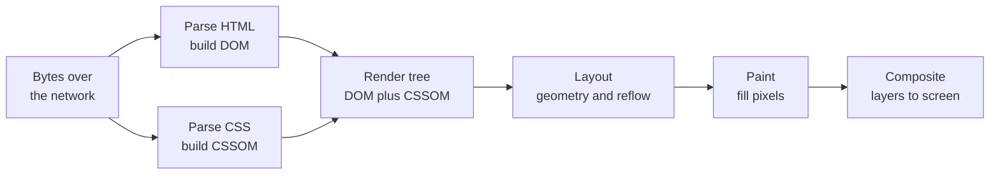

# The modern web platform

## Why this matters

It's a Tuesday afternoon. A redesign you shipped last week looks perfect on your 27-inch monitor and falls apart on the support team's laptops. The hero section's two columns have collapsed into one and overflowed sideways, a horizontal scrollbar has appeared, and the "Buy" button is now below the fold on the most common viewport in your analytics. You open DevTools, start adding `!important` to a media query, and twenty minutes later you've made it worse on a third screen size. You're fighting the layout instead of describing it.

The fix, almost always, is not more CSS. It's the realization that you reached for the wrong primitive — a float or a fixed-width column where a grid or a `flex-wrap` would have done the work for you, or a viewport media query where a container query was the honest expression of "this card lays out differently when it's narrow, regardless of how wide the window is." The modern platform gives you layout engines that solve these problems declaratively. The cost of not knowing them is measured in `!important` declarations, magic-number widths, and bugs that only reproduce on a device you don't own.

The same gap shows up one layer down. An engineer who doesn't know what the browser does between receiving HTML and painting pixels will "fix" a slow page by adding a spinner, when the real problem is a render-blocking stylesheet in the `<head>` or a layout that thrashes on every scroll event. The frontend churns — frameworks come and go — but the platform underneath is stable, specified, and the thing every framework ultimately compiles down to. React, Svelte, and the bundler du jour are conveniences layered on these primitives; when one of them behaves strangely, the answer is almost always in the layer below. This chapter is about that platform: the semantics of HTML, the layout engines of CSS, the module system JavaScript actually ships with, and the rendering pipeline that turns all three into pixels.

## Mental model

A browser is a pipeline. You hand it bytes; it hands you pixels. Between those two ends are a fixed sequence of stages, and almost every frontend performance problem is "something is blocking a stage" or "we're redoing a stage too often."



Read it left to right. The browser parses HTML into the DOM, a tree of nodes. In parallel it parses CSS into the CSSOM, a tree of style rules. It combines them into the render tree (only visible nodes; `display: none` nodes are absent). Then **layout** computes the geometry of every box — where it sits, how big it is. **Paint** fills in pixels: text, colors, borders, shadows. **Composite** assembles painted layers, possibly on the GPU, into the final frame.

Three facts about this pipeline pay for themselves repeatedly. First, **CSS is render-blocking**: the browser will not paint until it has the CSSOM, because it can't know how anything looks. A large stylesheet in the critical path delays first paint for everyone. Second, **synchronous `<script>` blocks parsing**: a classic `<script src>` without `defer` or `async` stops DOM construction until the script downloads and runs, because the script might call `document.write`. Third, the stages are ordered, so changing a property that affects geometry (`width`, `top`, `display`) forces a re-**layout**, which forces re-**paint** and re-**composite**. Changing a property that only affects pixels (`color`, `box-shadow`) skips layout. Changing `transform` or `opacity` can often be handled entirely by the compositor, skipping both layout and paint — which is why "animate `transform`, not `top`" is the single most repeated piece of frontend performance advice.

That last point deserves one more level of detail, because it's where the biggest performance wins hide. The compositor is a separate stage that works with already-painted layers — think of them as bitmaps the browser can slide, scale, and fade independently of each other. Certain properties (`transform`, `opacity`, and a handful of filters) can be applied to a layer without repainting its contents, and that work can run on the GPU and often on a separate thread from the main JavaScript thread. So an animation driven by `transform` can keep hitting the frame budget even while the main thread is busy, whereas an animation of `top` or `width` re-enters layout and paint every frame and competes for the same thread that's running your event handlers. Promoting an element to its own layer has a memory cost, though, so it's a tool you reach for after measuring, not by default.

HTML's job in this model is to be the semantic tree, not a bag of `<div>`s. The element you choose (`<button>`, `<nav>`, `<main>`, `<article>`) is what the accessibility tree, the browser's default behavior, and search crawlers read. CSS's job is to describe layout as relationships ("these children share a row and wrap when they run out of space") rather than absolute positions. And ES modules are how the JavaScript that drives all of this gets loaded as a dependency graph the browser can fetch, dedupe, and cache.

## In practice

### Semantic HTML is the cheapest accessibility you'll ever ship

Start with the markup, because everything downstream inherits from it. Here is the wrong way — markup that looks identical on screen and is invisible to assistive technology and crawlers:

```html
<!-- Anti-pattern: div soup -->
<div class="nav">
  <div class="link" onclick="go('/home')">Home</div>
  <div class="link" onclick="go('/pricing')">Pricing</div>
</div>
<div class="title">Quarterly report</div>
<div class="button" onclick="submit()">Save</div>
```

None of this is keyboard-focusable, none of it announces a role to a screen reader, and the `<div class="title">` carries no heading level. The semantic version is shorter and free:

```html
<nav aria-label="Primary">
  <a href="/home">Home</a>
  <a href="/pricing">Pricing</a>
</nav>
<h1>Quarterly report</h1>
<button type="button" onclick="submit()">Save</button>
```

A `<button>` is focusable, fires on Enter and Space, and announces itself as a button. An `<a href>` is a real link the browser can preload and middle-click. An `<h1>` gives screen-reader users a navigable document outline. Use the landmark elements — `<header>`, `<nav>`, `<main>`, `<aside>`, `<footer>` — to structure the page, and reserve `<div>` for the cases where you genuinely need a styling hook with no semantics. (Accessibility gets a full chapter later in this Part; the point here is that it begins at the tag level, before any ARIA.)

### CSS layout: pick the right engine

Modern CSS has two layout engines that cover the overwhelming majority of real designs: Flexbox for one-dimensional layouts (a row or a column), and Grid for two-dimensional layouts (rows and columns together). Reaching for `float`, absolute positioning, or fixed pixel widths to do general layout is the 2026 equivalent of parsing HTML with a regex.

The choice between the two comes down to one question: are you laying out along a single axis, where items flow and wrap as a group, or are you placing items into a two-dimensional structure where rows and columns must align? A toolbar, a row of tags, a stack of form fields — those are one-dimensional, so Flexbox. A page shell with a header, sidebar, content, and footer, or a gallery where every row's columns line up — those are two-dimensional, so Grid. When you find yourself nesting flex containers three deep to fake a grid, that's the signal to switch engines.

Flexbox, for a toolbar that should wrap gracefully:

```css
.toolbar {
  display: flex;
  flex-wrap: wrap;
  gap: 0.75rem;
  align-items: center;
}
.toolbar .spacer { margin-left: auto; } /* push the rest to the right */
```

Grid, for a responsive card layout that needs no media queries at all:

```css
.cards {
  display: grid;
  /* as many columns as fit, each at least 16rem, sharing leftover space */
  grid-template-columns: repeat(auto-fit, minmax(16rem, 1fr));
  gap: 1rem;
}
```

That `repeat(auto-fit, minmax(16rem, 1fr))` is worth memorizing. It says: make columns that are at least `16rem` wide, fit as many as the container allows, and stretch them to fill the row. On a phone you get one column; on a wide monitor you get four; the breakpoints emerge from the content instead of being hand-coded. This is the declarative ideal — you describe the constraint, the engine computes the layout.

Two habits make both engines easier to live with. Use `gap` for spacing between items rather than margins on the children — it only applies between items, never at the edges, so you stop fighting the "first child has an extra margin" problem. And prefer logical properties (`margin-inline`, `padding-block`, `inset-inline-start`) over physical ones (`margin-left`, `top`) when the design should adapt to right-to-left languages; the layout then mirrors correctly without a separate stylesheet.

### Container queries: the right axis of responsiveness

For years, "responsive" meant "respond to the viewport" via `@media`. But a component doesn't care how wide the window is; it cares how much space *it* was given. A product card in a wide main column and the same card in a narrow sidebar want different layouts at the same viewport width. Container queries express exactly that:

```css
.card-host {
  container-type: inline-size;   /* this element is now a query container */
  container-name: card;
}

.card {
  display: grid;
  grid-template-columns: 1fr;    /* stacked by default */
}

@container card (min-width: 28rem) {
  .card {
    grid-template-columns: 12rem 1fr;  /* image beside text when there's room */
  }
}
```

The card now reflows based on its own width, wherever you drop it. This is the correct mental shift: media queries are for page-level layout (the overall column structure), container queries are for component-level layout (how a component arranges itself in whatever slot it lands in). Container queries reached Baseline "newly available" across all major browser engines in 2023 and have since become widely available; reach for them by default for component CSS.

### ES modules: the dependency graph the browser understands

JavaScript spent a decade with no native module system, which is why we had AMD, CommonJS, bundler-specific `require`, and a tower of tooling to paper over the gap. The platform now has a real one. An ES module declares its dependencies with static `import`/`export`, and the browser resolves the graph for you:

```html
<script type="module" src="/app.js"></script>
```

```js
// app.js
import { formatPrice } from "./currency.js";
import { Cart } from "./cart.js";

const cart = new Cart();
document.querySelector("#total").textContent = formatPrice(cart.total());
```

```js
// currency.js
export function formatPrice(cents, locale = "en-US", currency = "USD") {
  return new Intl.NumberFormat(locale, { style: "currency", currency })
    .format(cents / 100);
}
```

Several browser behaviors come for free with `type="module"`. Modules are **deferred by default** — they execute after the HTML is parsed, so they never block DOM construction. They run in **strict mode** automatically. Each module has its **own scope** (no leaking globals). And every module is **evaluated once and cached**, no matter how many other modules import it, so shared dependencies aren't re-run. The `import` statements themselves are *static* — they're hoisted and resolved before execution — which is what lets bundlers and the browser build the dependency graph ahead of time. When you genuinely need lazy, on-demand loading (a heavy editor that only some users open), use dynamic `import()`, which returns a promise and creates a natural code-splitting boundary:

```js
button.addEventListener("click", async () => {
  const { openEditor } = await import("./editor.js"); // fetched only on click
  openEditor();
});
```

In production you'll still ship a bundler (covered later in this Part), but it now optimizes a graph the platform already understands rather than inventing one. That's a healthier place to be.

### Watching the pipeline run

You can see layout and paint happen. Open DevTools, record a Performance profile, and you'll find purple "Layout" and green "Paint" entries. The diagnostic skill is recognizing **layout thrashing**: a loop that writes a style, then reads a geometry property, forcing the browser to flush layout synchronously on every iteration.

```js
// Anti-pattern: read-write-read-write forces a layout flush each loop
for (const el of items) {
  el.style.width = el.offsetWidth + 10 + "px"; // write, then read offsetWidth -> sync layout
}

// Fix: batch reads, then batch writes
const widths = items.map((el) => el.offsetWidth);     // all reads
items.forEach((el, i) => (el.style.width = widths[i] + 10 + "px")); // all writes
```

The fixed version triggers one layout instead of N. The reason is that the browser keeps a dirty flag on the layout: writing a geometry property marks it dirty, and reading a geometry property like `offsetWidth` forces the browser to recompute layout immediately so it can return an honest answer. Interleaving reads and writes flips that flag on every iteration. Batch all reads first, then all writes, and the browser flushes once. For visual updates synchronized to the frame, wrap writes in `requestAnimationFrame` so they land once per frame rather than mid-computation.

> Connect the dots: This rendering pipeline is the client-side half of the story. Part 5 (Backend) and the chapter on Core Web Vitals later in this Part cover the server-side half — how Time to First Byte and render-blocking resources upstream determine when this pipeline can even start. The fastest layout engine can't paint bytes that haven't arrived.

> Security note: When you inject HTML at runtime (`element.innerHTML = userContent`), the browser parses it through the same DOM-construction stage described above — including any `<script>` or `onerror` handlers in that string. That's the mechanism of DOM-based XSS. Set text with `textContent`, not `innerHTML`, for untrusted data; when you must render rich HTML, sanitize it (e.g. with the Sanitizer API or a vetted library) and back it with a `Content-Security-Policy` that forbids inline scripts. CSP and XSS get full treatment in the Security part; the platform-level takeaway is that `innerHTML` is a parser entry point, not a string assignment.

## Pitfalls and anti-patterns

**1. Div soup (rebuilding native elements from scratch).** Recognize it by `<div onclick>`, `role="button"` on a `<div>`, and the absence of headings. The page works with a mouse and is unusable with a keyboard or screen reader. Fix it by using the native element — `<button>`, `<a>`, `<label>`, `<input>`, `<details>` — which brings focus management, keyboard handling, and accessibility roles for free. Reach for ARIA only to *augment* native semantics, never to *reimplement* them.

**2. Fixed-width, magic-number layouts.** Recognize it by hardcoded `width: 1140px`, layouts that break at unusual viewport sizes, and a stylesheet full of media-query overrides patching specific breakpoints. The layout describes one screen instead of a constraint. Fix it with Grid's `minmax`/`auto-fit`, Flexbox `flex-wrap`, and intrinsic sizing (`min-content`, `max-content`, `fit-content`) so layout responds to content and available space.

**3. Animating layout-triggering properties.** Recognize it by janky animations and a Performance profile full of purple Layout bars during a transition — usually animating `top`, `left`, `width`, `height`, or `margin`. Each frame forces a relayout of everything below it. Fix it by animating `transform` and `opacity`, which the compositor can handle without layout or paint. Add `will-change: transform` sparingly to promote an element to its own layer when you've measured a need.

**4. Render-blocking the critical path.** Recognize it by a slow first paint and a giant `<link rel="stylesheet">` or synchronous `<script>` in the `<head>`. The browser can't paint until the CSSOM is built, and a blocking script stalls DOM construction entirely. Fix it by shipping critical CSS inline and deferring the rest, and by loading scripts with `type="module"` or `defer` so parsing isn't blocked. Treat everything in the `<head>` as a tax on first paint.

**5. Confusing viewport and container responsiveness.** Recognize it by a component that looks right on the page it was designed for and breaks when reused in a sidebar or modal, because its breakpoints are tied to `@media` (the window) instead of the space it occupies. Fix it by moving component-internal layout to `@container` queries and reserving media queries for page-level structure.

## Production checklist

- [ ] Page uses landmark elements (`<header>`, `<nav>`, `<main>`, `<footer>`) and a single logical `<h1>` with a sensible heading hierarchy
- [ ] Interactive controls are native (`<button>`, `<a href>`, `<input>`, `<label>`); `<div>`/`<span>` carry no click handlers without a real role and keyboard support
- [ ] Layout uses Flexbox (1D) and Grid (2D); no `float`-based layout, no magic-number fixed widths for structure
- [ ] Spacing between items uses `gap`, not edge margins; layout uses logical properties where RTL support matters
- [ ] Component-internal responsiveness uses container queries; media queries are reserved for page-level layout
- [ ] CSS in the critical path is minimized/inlined; non-critical stylesheets are deferred
- [ ] Scripts load with `type="module"` or `defer`; no parser-blocking synchronous `<script>` in `<head>`
- [ ] Code-split heavy, rarely-used features behind dynamic `import()`
- [ ] Animations use `transform`/`opacity`; a Performance profile shows no Layout during transitions
- [ ] DOM writes and reads are batched (no layout thrashing in loops); per-frame visual writes go through `requestAnimationFrame`
- [ ] Untrusted content is set via `textContent` or sanitized before `innerHTML`, backed by a Content-Security-Policy

## Exercises

1. **(Comprehension)** Open any content-heavy page in DevTools and record a Performance profile while scrolling. Identify a Layout entry and a Paint entry in the flame chart. Then, in the Elements panel, change one element's `color` and observe in the profile that only Paint reruns; change its `width` and observe that Layout reruns first. Explain in two sentences why `transform` is cheaper to animate than `width`, referencing the pipeline stages.

2. **(Applied)** Build a responsive card grid with zero media queries using `grid-template-columns: repeat(auto-fit, minmax(16rem, 1fr))`. Then make each card's *internal* layout switch from stacked to side-by-side using a container query, so a card in a narrow sidebar stays stacked while the same card in a wide main column goes side-by-side at the same viewport width. Verify by resizing only the container, not the window.

3. **(Design)** You inherit a page with a large render-blocking stylesheet and a Largest Contentful Paint several seconds too slow on mid-range mobile. Design a plan to get first paint dramatically faster without a framework rewrite. Consider: extracting and inlining critical CSS, deferring the rest, splitting the bundle by route, converting blocking scripts to modules, and how you'd measure each change against real-user data. State which change you'd ship first and why.

## Further reading

- MDN Web Docs, [CSS layout guide](https://developer.mozilla.org/en-US/docs/Learn/CSS/CSS_layout) — the canonical, continuously-updated reference for Flexbox, Grid, and container queries
- WHATWG, [HTML Living Standard](https://html.spec.whatwg.org/multipage/) — the actual specification, including the content model and accessibility semantics of every element
- web.dev, ["Critical rendering path"](https://web.dev/articles/critical-rendering-path) — Google's walkthrough of parse, style, layout, paint, and composite
- TC39 / MDN, [JavaScript modules](https://developer.mozilla.org/en-US/docs/Web/JavaScript/Guide/Modules) — semantics of `import`/`export`, deferred execution, and dynamic `import()`
- [CSS Grid Layout Module Level 1](https://www.w3.org/TR/css-grid-1/) and [CSS Containment Module Level 3](https://www.w3.org/TR/css-contain-3/) — the W3C specs behind Grid and container queries
- Paul Lewis, ["Avoid large, complex layouts and layout thrashing"](https://web.dev/articles/avoid-large-complex-layouts-and-layout-thrashing) — practical guidance on the read/write batching pattern
