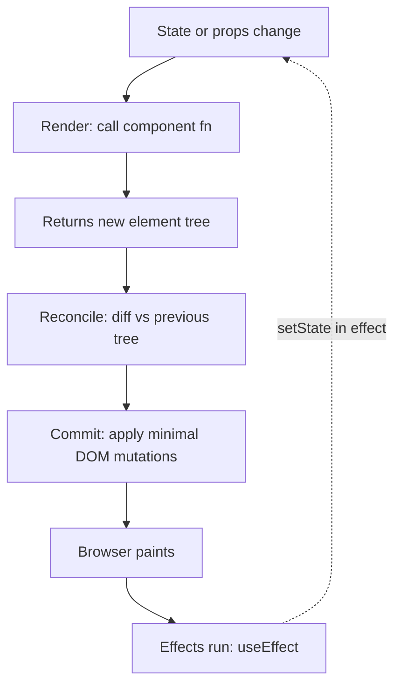
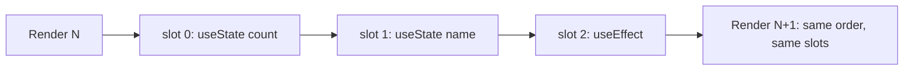

# React deeply

## Why this matters

It's a Tuesday afternoon and a bug ticket comes in: "The displayed total is sometimes one item behind." A user adds a product to the cart, the count updates, but the subtotal in the header still shows the old number until they click something else. You open the component and find the culprit immediately, because you've seen it a hundred times:

```tsx
function CartSummary({ items }: { items: CartItem[] }) {
  const [subtotal, setSubtotal] = useState(0);

  useEffect(() => {
    setSubtotal(items.reduce((sum, i) => sum + i.price * i.qty, 0));
  }, [items]);

  return <span>${subtotal.toFixed(2)}</span>;
}
```

The subtotal is stored in state and synced from `items` with an effect. The effect runs *after* render and commit, so on the render where `items` changes, the component paints the stale subtotal first, then re-renders with the new one. Most of the time the two renders happen in the same frame and nobody notices. Under load, or with a slow reducer, or when React batches differently, the user sees the gap. The bug isn't a race condition you need to defend against. It's a category error: a value that is *derived* from props was modeled as *independent state*, and an effect was hired to paper over the contradiction.

This chapter is about not making that error, and the dozen others like it. React's API surface is small — a handful of hooks and a rendering rule — but the mental model underneath determines whether your components are predictable or whether you spend Tuesdays chasing one-frame glitches. The engineers who treat React as "components plus `useEffect` for everything that's hard" ship subtle bugs forever. The ones who understand render-as-a-function, what state actually is, and when an effect is the wrong tool operate with the same casual confidence the Git chapter described. That's the gap we're closing.

## Mental model

A React component is a function from props and state to a description of UI. It does not draw anything. It returns elements — plain objects describing what the screen *should* look like — and React's job is to make the actual DOM match that description. Calling your component function is **rendering**. Comparing the new element tree to the previous one and computing the minimal DOM mutations is **reconciliation**. Applying those mutations is **commit**.



Three rules fall out of this diagram, and almost everything else is a consequence:

1. **Rendering must be pure.** Given the same props and state, your component must return the same tree and cause no side effects during the call. React may render a component multiple times before committing, may throw away a render, and in development with Strict Mode will deliberately render twice to flush out impurity. If your render mutates a ref, writes to a global, or calls an API, you've broken the contract.

2. **State is a snapshot, not a live variable.** When you call `setCount(count + 1)`, you are not mutating `count`. You are scheduling a re-render in which `count` will have a new value. Within the current render, `count` is frozen. This is why `setCount(count + 1)` three times in a row only increments by one, and why `setCount(c => c + 1)` (the updater form) increments by three — the updater receives the latest queued value, not the render's snapshot.

3. **Effects synchronize with systems outside React.** `useEffect` runs after commit and after paint. Its purpose is to reach *outside* the render world: subscribe to a WebSocket, set up an `IntersectionObserver`, sync a value to `localStorage`, fire analytics. If the thing you're computing can be computed *during* render from props and state, it is derived state and does not belong in an effect.

The deepest source of React confusion is conflating these three categories — independent state, derived values, and external synchronization. Hold them apart and most architectural questions answer themselves. A useful sorting question for any value in a component: *can I compute this from what I already have during render?* If yes, it is derived — compute it. *Does it change only because the user or another component told it to?* If yes, it is independent state — hold it in `useState` or a store. *Does it live in a system React does not control?* If yes, it needs an effect to synchronize.

There is a fourth category that trips people up because it deliberately sits outside the render model: the **escape hatch**. A `useRef` is a mutable box whose `.current` value persists across renders but does *not* trigger a re-render when you change it. Use it for things the render output should not depend on — a timeout id you need to clear later, the previous value of a prop, an imperative handle to a DOM node. The rule of thumb: if changing the value should repaint the screen, it is state; if it is bookkeeping that the UI never reads during render, it is a ref. Reaching for a ref to "avoid a re-render" of something the UI *does* display is how you reintroduce the stale-value bug from the opener by another door.

### The Rules of Hooks, and why they exist

Hooks are not magic. React keeps an ordered list of hook "slots" per component instance, and on each render it walks that list in order, matching the first `useState` call to slot 0, the second to slot 1, and so on. There is no name attached — only position. That's why hooks must be called unconditionally, at the top level, in the same order every render. Put a `useState` behind an `if`, and on the render where the condition flips, every subsequent hook reads the wrong slot.



This is also why the linter rule `react-hooks/rules-of-hooks` is not a style preference. It is enforcing an invariant the runtime depends on. The same reasoning explains a question beginners ask constantly: "why can't I call a hook inside a loop or a callback?" Because the slot order would no longer be stable across renders, and React would silently hand one hook another hook's memory.

## In practice

### Derived state: compute, don't store

Return to the opening bug. The fix is to delete the state and the effect entirely:

```tsx
function CartSummary({ items }: { items: CartItem[] }) {
  const subtotal = items.reduce((sum, i) => sum + i.price * i.qty, 0);
  return <span>${subtotal.toFixed(2)}</span>;
}
```

The subtotal is now recomputed every render, which is exactly when `items` could have changed, so it can never be stale. There is no second render, no effect, no synchronization gap. For a sum over a cart this is free. If the computation were genuinely expensive — sorting many thousands of rows, parsing a large blob — wrap it in `useMemo` so it only recomputes when its inputs change:

```tsx
const sorted = useMemo(
  () => rows.slice().sort(compareFn),
  [rows, compareFn]
);
```

`useMemo` is a performance optimization, not a correctness tool. It caches the result keyed on the dependency array. Reach for it when profiling shows the computation is hot, not reflexively. The correctness of your component must never depend on the cache surviving — React is free to discard a memo and recompute, and treating `useMemo` as a guarantee that a value is stable is its own subtle bug.

### State that belongs together: prefer a reducer over scattered flags

When several pieces of state always change in concert — `isLoading`, `error`, `data` for a fetch, or `status`, `cursor`, `selection` for an editor — splitting them across separate `useState` calls invites impossible combinations (loading *and* error true at once) and a flurry of separate updates. `useReducer` colocates the transitions:

```tsx
type State =
  | { status: "idle" }
  | { status: "loading" }
  | { status: "error"; message: string }
  | { status: "ready"; data: Result };

function reducer(state: State, action: Action): State {
  switch (action.type) {
    case "fetch": return { status: "loading" };
    case "ok":    return { status: "ready", data: action.data };
    case "fail":  return { status: "error", message: action.message };
    default:      return state;
  }
}
```

The discriminated union makes illegal states unrepresentable, and every transition is one named action you can test in isolation. This is the same modeling discipline as the derived-state rule: be deliberate about what is genuinely independent, and let everything else fall out of it.

### When you DO need an effect

Effects earn their place when you must synchronize with something React doesn't own. A live subscription is the canonical case:

```tsx
function useConnectionStatus(url: string) {
  const [online, setOnline] = useState(false);

  useEffect(() => {
    const socket = new WebSocket(url);
    socket.addEventListener("open", () => setOnline(true));
    socket.addEventListener("close", () => setOnline(false));
    return () => socket.close(); // cleanup runs before re-run and on unmount
  }, [url]);

  return online;
}
```

Three things make this a *correct* effect. It reaches outside React (a WebSocket). It returns a cleanup function so the old socket is closed before a new one opens when `url` changes. And its dependency array honestly lists every reactive value it reads. Omitting `url` from the array would leave you connected to a stale URL — the most common effect bug after the derived-state one. The cleanup function is not optional politeness: in Strict Mode, React mounts, unmounts, and remounts every component once in development precisely to surface effects that leak because they forgot to clean up.

### Events vs. effects

A frequent mistake is putting logic in an effect that should live in an event handler. If something happens *because the user did X*, it belongs in the handler for X. If something happens *because the component is displaying particular data*, it belongs in an effect. Buying a product is an event; the POST goes in `onClick`, not in an effect watching a `purchased` flag. Showing a chat room's messages is a synchronization; the subscription goes in an effect keyed on `roomId`. The tell for a misplaced effect is an effect that watches a boolean you flipped in a handler one line earlier — you already know the event happened, so do the work there.

### Reconciliation and keys

React diffs the new tree against the old one type-by-type, position-by-position. Same element type at the same position: reuse the DOM node, update changed props. Different type: tear down the subtree and rebuild. For lists, React matches children by their `key`, which is how it knows that inserting an item at the top shifted everyone down rather than changing every row.

```tsx
// Wrong: index as key. Insert at the front and React thinks
// every row's content changed, blowing away input focus and state.
{todos.map((todo, i) => <TodoRow key={i} todo={todo} />)}

// Right: a stable identity from the data.
{todos.map((todo) => <TodoRow key={todo.id} todo={todo} />)}
```

Index keys are a real bug, not a lint nit: any reorder or insertion mismatches React's notion of identity, and stateful children (an open `<input>`, a playing `<video>`) get the wrong state grafted onto them. The same `key` mechanism is also a deliberate tool — changing a component's `key` is how you tell React to throw away its state and remount it fresh, which is the cleanest way to reset a form when the entity it edits changes.

### Server Components and Suspense

React Server Components (RSC) split components into two worlds. Server Components run only on the server, never ship their code to the browser, and can `await` data directly. Client Components carry the interactivity — state, effects, event handlers — and are marked with `"use client"`.

```tsx
// app/page.tsx — a Server Component (the default in the App Router)
import { db } from "@/lib/db";
import { AddToCart } from "./add-to-cart"; // a Client Component

export default async function ProductPage({ params }: { params: { id: string } }) {
  const product = await db.product.findUnique({ where: { id: params.id } });
  return (
    <article>
      <h1>{product.name}</h1>
      <p>${product.price}</p>
      <AddToCart productId={product.id} /> {/* interactivity lives here */}
    </article>
  );
}
```

```tsx
// add-to-cart.tsx
"use client";
import { useState } from "react";

export function AddToCart({ productId }: { productId: string }) {
  const [pending, setPending] = useState(false);
  return (
    <button
      disabled={pending}
      onClick={async () => {
        setPending(true);
        await fetch(`/api/cart`, { method: "POST", body: productId });
        setPending(false);
      }}
    >
      {pending ? "Adding…" : "Add to cart"}
    </button>
  );
}
```

The data fetch happens on the server with no client-side loading waterfall and no `useEffect`-to-fetch dance. The browser receives HTML with the product already rendered, and only the small interactive leaf ships its JavaScript. The boundary is a directive, not a folder convention: `"use client"` marks the *entry point* into the client world, and everything imported below it is bundled for the browser too. Pushing that directive down to the smallest leaf that needs interactivity is the single biggest lever you have over how much JavaScript a page ships.

Suspense lets you stream the parts that are slow while showing fallbacks for the rest:

```tsx
import { Suspense } from "react";

export default function Page() {
  return (
    <>
      <Header />
      <Suspense fallback={<ReviewsSkeleton />}>
        <Reviews /> {/* awaits slow data; streams in when ready */}
      </Suspense>
    </>
  );
}
```

`<Header />` renders and ships immediately; `<Reviews />` streams in when its data resolves. Suspense moved loading states from imperative `isLoading` flags scattered across effects into a declarative boundary in the tree. The skeleton is no longer a branch you remember to write in every component — it is a property of where you draw the boundary.

> **Connect the dots:** The render-reconcile-commit pipeline mirrors the declarative model elsewhere in this book. The way React diffs a desired tree against the current DOM and applies a minimal patch is the same shape as a Kubernetes controller reconciling desired vs. actual state (Part 8), and the same shape as Terraform's plan-then-apply. Learn the pattern once and it recurs at every layer of the stack.

> **Security note:** Server Components run on the server with access to secrets, database handles, and tokens. Anything you read in a Server Component but pass as a prop into a Client Component crosses the network boundary and ends up in the browser-visible payload. Never pass an API key, full user record, or auth token down to a Client Component "just to be safe" — pass only the fields the client genuinely needs. Treat the Server/Client boundary as a trust boundary, and never use `dangerouslySetInnerHTML` with server-fetched user content without sanitizing it first, or you reintroduce XSS into an otherwise safe architecture.

## Pitfalls and anti-patterns

**1. Derived state stored in state and synced with an effect.** The opening bug. Recognize it by the shape: a `useState` whose only writer is a `useEffect` that reads other props/state. The effect causes an extra render and a one-frame stale window. Fix: delete both, compute the value inline during render, and reach for `useMemo` only if profiling proves the computation is expensive.

**2. Lying to the dependency array.** Disabling `react-hooks/exhaustive-deps` and hand-trimming the array to "make the effect stop re-running" hides the real problem: the effect closes over stale values. Recognize it by an `// eslint-disable-next-line` over a dependency array. Fix: list every reactive value the effect reads; if that makes it run too often, the real fix is usually `useCallback`/`useMemo` on the input, the updater form of `setState`, or moving the value into a ref because it genuinely shouldn't be reactive.

**3. Index as a list key.** Recognize it by `key={i}` or `key={index}` on `.map()`. It silently corrupts identity on reorder and insertion, grafting one row's DOM state (focus, scroll, uncontrolled input value) onto another. Fix: use a stable id from the data. If the data truly has no id, generate one when the item is created, not at render time.

**4. Mutating state instead of replacing it.** `state.items.push(x); setItems(state.items)` passes the *same array reference* back, so React's `Object.is` bail-out skips the re-render. Recognize it by `.push`, `.sort`, or direct property assignment on something held in state. Fix: produce a new value — `setItems([...items, x])` — or use a reducer / Immer to keep immutability ergonomic.

**5. Fetching in `useEffect` when a Server Component would do.** In an App Router codebase, a Client Component with `useEffect(() => { fetch(...) }, [])` creates a client-side waterfall, leaks loading-state flags everywhere, and ships fetching code to the browser. Recognize it by `"use client"` at the top of a component whose only interactivity is data loading. Fix: make it a Server Component that `await`s its data, and wrap slow regions in `<Suspense>`.

**6. Putting `"use client"` at the top of the tree.** Marking a layout or page `"use client"` "to be able to use a hook somewhere inside" drags the entire subtree into the client bundle, forfeiting the server-rendering benefit. Recognize it by a `"use client"` directive on a high-level layout. Fix: keep server components as the default and push the directive down to the individual interactive leaf.

## Production checklist

- [ ] `eslint-plugin-react-hooks` enabled with `rules-of-hooks` and `exhaustive-deps` as errors, never disabled inline
- [ ] No `useState` whose sole writer is a `useEffect` — audit for derived-state-in-effect
- [ ] Every effect either reaches outside React or is justified in a comment; otherwise it's deleted
- [ ] Every effect that subscribes/creates a resource returns a cleanup function
- [ ] List keys are stable data ids, never array indices
- [ ] State updates that depend on previous state use the updater form `setX(prev => …)`
- [ ] State is never mutated in place; new references are produced on every change
- [ ] Related state that changes together is modeled with `useReducer`, not scattered booleans
- [ ] Strict Mode is on in development so double-render surfaces impure components and missing cleanups
- [ ] `"use client"` lives at the lowest leaf that needs interactivity, not at the top of the tree
- [ ] No secrets, tokens, or full records pass from Server Components into Client Component props
- [ ] Expensive computations are profiled before being wrapped in `useMemo`/`useCallback`

## Exercises

1. **(Comprehension)** Explain, in terms of the render → reconcile → commit → effects pipeline, why the opening `CartSummary` shows a stale subtotal for one frame. At which step does the wrong value get painted, and which step corrects it? Then state precisely why moving the computation inline eliminates the gap entirely.

2. **(Applied)** Take a Client Component that fetches a list in `useEffect`, stores it in state, and renders it with `key={index}`. Refactor it three ways: (a) convert it to a Server Component that awaits the data; (b) wrap a slow child in `<Suspense>` with a skeleton fallback; (c) fix the keys to use stable ids. Verify with the React DevTools Profiler that the unnecessary re-render from the old effect is gone.

3. **(Design)** You're building a collaborative document editor where many users edit the same text in real time. Decide what is independent state (held in `useState`/a store), what is derived state (computed during render), and what requires an effect (synchronizing with the network and CRDT layer). Sketch the component boundaries, where `"use client"` sits, and how you'd keep the cursor position from being clobbered by remote updates. Name the tradeoff you'd make between optimistic local updates and server reconciliation.

## Further reading

- React docs, ["You Might Not Need an Effect"](https://react.dev/learn/you-might-not-need-an-effect) — the canonical guide to derived state and event-vs-effect, directly relevant to this chapter's central anti-pattern
- React docs, ["Render and Commit"](https://react.dev/learn/render-and-commit) and ["State as a Snapshot"](https://react.dev/learn/state-as-a-snapshot) — the rendering model from first principles
- React docs, ["Rules of Hooks"](https://react.dev/reference/rules/rules-of-hooks) — the invariant the runtime depends on
- React RFC, ["React Server Components"](https://github.com/reactjs/rfcs/blob/main/text/0188-server-components.md) — the original design rationale for the Server/Client split
- Dan Abramov, ["A Complete Guide to useEffect"](https://overreacted.io/a-complete-guide-to-useeffect/) — the deepest available treatment of effects, closures, and dependency arrays
- React docs, ["Suspense"](https://react.dev/reference/react/Suspense) — declarative loading boundaries and streaming
