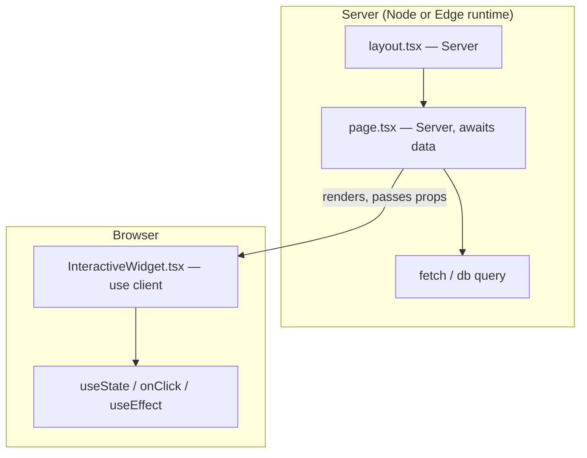
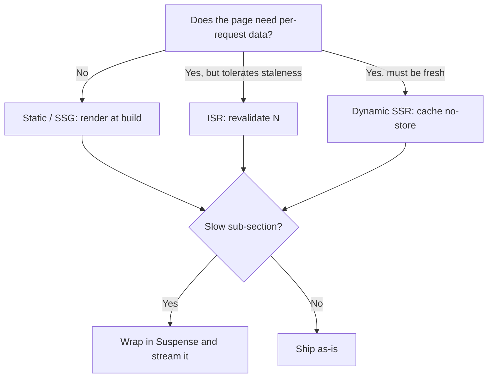

# Next.js as a production framework

## Why this matters

It's a Tuesday afternoon and the dashboard is slow. Not broken — slow. The product page renders fine in development, fine on your laptop, but production users in Sydney are staring at a spinner for a couple of seconds before anything paints. You open the network tab: the HTML document itself is slow to arrive. The page is a client component that fetches three APIs on mount, so the server sends a near-empty shell, the browser downloads a few hundred kilobytes of JavaScript, hydrates, and only then fires the fetches. Three round trips to an API in `us-east-1`, from a browser in Australia, before the first useful pixel.

Someone suggests "just add `getServerSideProps`." But you're on the App Router now, there is no `getServerSideProps`, and the actual fix is architectural: this page should be a server component that fetches its data on the server, close to the database, and streams HTML to the browser while the slow third panel resolves behind a Suspense boundary. The fix is a few dozen lines, and the page goes from a multi-second spinner to a near-instant first paint with the slow panel streaming in behind a skeleton. The cost of not knowing the rendering model was every slow page your team shipped this quarter, plus the Redux store you built to cache data the framework would have cached for you.

Next.js is one of the most widely deployed React frameworks, and the App Router (stable since Next 13.4, the default since 14) rearranged almost everything: where code runs, when data is fetched, what gets cached, and how HTML reaches the browser. The engineers who treat it as "React with file-based routing" ship waterfalls and over-fetch. The ones who understand the four caching layers and the server/client boundary ship pages that are fast by default. This chapter is that boundary.

## Mental model

The single most important idea in the App Router: **every component is a Server Component until you opt out.** Server Components run on the server (or at build time), never ship their code to the browser, and can directly `await` data. Client Components — marked with the `"use client"` directive at the top of the file — ship to the browser and run there, where they get `useState`, `useEffect`, event handlers, and access to the DOM.

The boundary is one-directional. A Server Component can import and render a Client Component. A Client Component cannot import a Server Component, but it can receive one as a `children` prop. Think of `"use client"` not as "this file runs on the client" but as "this is the entry point where the tree crosses into the browser — everything imported from here down is bundled for the client."



Layered on top of the runtime split are Next.js's caching layers. There are four, and conflating them is the source of most "why is my data stale / why isn't it caching" confusion:

| Layer | Scope | Lifetime | What it stores |
|---|---|---|---|
| **Request Memoization** | One render pass | Single request | Dedupes identical `fetch()` calls in one render |
| **Data Cache** | Server, cross-request | Until revalidated | Results of `fetch()` keyed by URL + options |
| **Full Route Cache** | Server, cross-request | Until revalidated/redeployed | Rendered HTML + RSC payload for static routes |
| **Router Cache** | Client, per-session | Seconds to a session | RSC payloads for visited routes, for instant back/forward |

A route is **static** (rendered once at build, served from the Full Route Cache) unless it uses a *dynamic API* — `cookies()`, `headers()`, `searchParams`, or an uncached `fetch`. The moment you touch one, the route becomes **dynamic** (rendered per request). This implicit switch is the rule you must hold in your head: dynamic functions opt the whole route out of static rendering.

Hold the two axes separately and the whole model snaps into focus. One axis is *where code runs* (server vs. client). The other is *when and how the output is cached* (static vs. dynamic, and across which of the four layers). A Server Component is not automatically cached, and a static route is not automatically server-only — they are independent decisions. Most confusion comes from collapsing these two axes into one. When something behaves unexpectedly, the first diagnostic question is always: which axis is this — a runtime-boundary issue, or a caching issue?

> **Connect the dots:** The Data Cache is just content-addressed caching keyed by request — the same idea as Git's content-addressable object store (Part 3) and HTTP caching (Part 5). Learn the pattern once; it reappears at every layer of the stack.

## In practice

### A server component that fetches its own data

No `getServerSideProps`, no `useEffect`. The component is `async` and you `await` directly:

```tsx
// app/products/[id]/page.tsx — a Server Component (no "use client")
import { notFound } from "next/navigation";
import { AddToCart } from "./add-to-cart"; // a Client Component

async function getProduct(id: string) {
  const res = await fetch(`https://api.shop.internal/products/${id}`, {
    next: { revalidate: 60 }, // cache this result for 60 seconds
  });
  if (res.status === 404) return null;
  if (!res.ok) throw new Error(`Upstream ${res.status}`);
  return res.json() as Promise<Product>;
}

export default async function ProductPage({
  params,
}: {
  params: Promise<{ id: string }>;
}) {
  const { id } = await params; // params is async in Next 15+
  const product = await getProduct(id);
  if (!product) notFound();

  return (
    <main>
      <h1>{product.name}</h1>
      <p>{product.description}</p>
      {/* Interactive island — only this ships JS to the browser */}
      <AddToCart productId={product.id} price={product.price} />
    </main>
  );
}
```

The `fetch` here is the Next.js-patched `fetch`, which integrates the Data Cache. `next: { revalidate: 60 }` is incremental static regeneration (ISR): the page is served from cache and rebuilt at most once every 60 seconds. Use `cache: "no-store"` for always-fresh data (makes the route dynamic), or omit options for the default. The interactive piece is a separate Client Component:

```tsx
// app/products/[id]/add-to-cart.tsx
"use client";
import { useState } from "react";

export function AddToCart({ productId, price }: { productId: string; price: number }) {
  const [pending, setPending] = useState(false);
  return (
    <button
      disabled={pending}
      onClick={async () => {
        setPending(true);
        await fetch("/api/cart", { method: "POST", body: JSON.stringify({ productId }) });
        setPending(false);
      }}
    >
      Add to cart — ${(price / 100).toFixed(2)}
    </button>
  );
}
```

Only `add-to-cart.tsx` and its dependencies ship to the browser. The product data, the formatting, the markup — all stay on the server.

### Streaming and Suspense: don't block on the slow panel

If one data source is slow, don't make the whole page wait for it. Wrap it in `<Suspense>` and Next.js streams the rest of the HTML immediately, then flushes the slow part when it resolves:

```tsx
// app/dashboard/page.tsx
import { Suspense } from "react";

export default function Dashboard() {
  return (
    <>
      <Header />                {/* renders instantly */}
      <Suspense fallback={<SkeletonChart />}>
        <RevenueChart />        {/* slow query, streamed in when ready */}
      </Suspense>
    </>
  );
}

async function RevenueChart() {
  const data = await fetch("https://api.internal/revenue", {
    next: { revalidate: 300 },
  }).then((r) => r.json());
  return <Chart data={data} />;
}
```

The browser gets the header and skeleton in the first flush, then the chart streams in. This is server-side rendering with progressive disclosure — the user sees structure immediately instead of a blank page. The mechanism underneath is the same one React uses for client-side Suspense: the framework serializes the in-progress tree, sends placeholders for the suspended boundaries, and patches them in over the same response stream as each promise resolves. You get the perceived-performance win without writing a single loading state by hand, and a slow downstream service degrades one panel instead of the whole route.

### Route handlers: your API layer

For endpoints (webhooks, the cart POST above, anything that returns data not HTML), use route handlers in `app/api/`:

```ts
// app/api/cart/route.ts
import { NextRequest, NextResponse } from "next/server";

export async function POST(req: NextRequest) {
  const { productId } = await req.json();
  // ... write to DB / session
  return NextResponse.json({ ok: true }, { status: 201 });
}

export async function GET() {
  return NextResponse.json(await getCart(), {
    headers: { "Cache-Control": "private, no-store" },
  });
}
```

For mutations triggered from your own UI, prefer **Server Actions** over hand-rolled route handlers — they give you progressive enhancement and typed args without writing a fetch by hand. Reserve route handlers for third-party webhooks and public APIs.

A Server Action is an `async` function marked with the `"use server"` directive; you can call it directly from a form's `action` prop or from an event handler, and Next.js wires up the network round trip and serialization for you:

```tsx
// app/products/[id]/actions.ts
"use server";
import { revalidateTag } from "next/cache";

export async function addFavorite(productId: string) {
  await db.favorites.insert({ productId, userId: await currentUserId() });
  revalidateTag("favorites"); // bust the Data Cache + Router Cache for this tag
}
```

Because the action runs on the server, it can talk to the database directly and call `revalidateTag`/`revalidatePath` in the same function — so the cache is fresh by the time the client re-renders. That single-function ownership of "mutate, then invalidate" is what makes Server Actions worth reaching for before route handlers.

### Edge vs. Node runtime

Each route can pick a runtime:

```ts
// app/api/geo/route.ts
export const runtime = "edge"; // default is "nodejs"

export function GET(req: Request) {
  const country = req.headers.get("x-vercel-ip-country") ?? "unknown";
  return Response.json({ country });
}
```

The **Edge runtime** runs on a lightweight V8 isolate distributed to points of presence near the user. Cold starts are minimal and latency is low, but you get a restricted API surface (Web APIs only, no native Node modules, no `fs`, limited bundle size). The **Node runtime** gives you the full Node API and any npm package, at the cost of heavier cold starts and centralized execution.

Pick Edge for middleware, geolocation, A/B redirects, auth checks, and anything latency-sensitive that only needs Web APIs. Pick Node (the default) for anything touching a native database driver, large dependencies, or long-running work. When in doubt, stay on Node — the Edge constraints tend to bite at the worst time, in production, when you add a dependency that uses a Node built-in.

### Choosing a rendering strategy



- **SSG** (static): marketing pages, docs, blog posts. Fastest possible delivery, served from CDN.
- **ISR** (`revalidate: N`): catalogs, anything that changes hourly not per-request. Static speed, bounded staleness.
- **SSR** (dynamic): dashboards, personalized or auth-gated pages. Fresh every request.
- **Streaming** is orthogonal — layer it on any of the above to avoid blocking on slow segments.

The decision is rarely all-or-nothing for a whole page. A dashboard can have a statically rendered shell, an ISR-cached summary card, and a per-request fresh activity feed, each wrapped so the slow ones stream. Reach for the most cacheable strategy a given segment can tolerate, then drop to a more dynamic one only where freshness genuinely requires it. Every step toward "dynamic, no-store" trades CDN hit rate and TTFB for freshness, so spend that budget deliberately rather than defaulting the whole route to dynamic because one widget needs live data.

## Pitfalls and anti-patterns

**1. The `"use client"` waterfall (client-fetch-on-mount).** You mark a page `"use client"` and fetch data in `useEffect`. Now the server sends an empty shell, the browser downloads JS, hydrates, and only then starts fetching — three serial steps before data appears, often from a region far from the user. Recognize it by an empty initial HTML document and fetches firing after hydration in the network waterfall. Fix it by making the data-owning component a Server Component that `await`s its data, and pushing `"use client"` down to only the interactive leaf.

**2. Accidentally dynamic routes.** You call `cookies()` or `headers()` in a layout for analytics, and suddenly *every* page under it renders per-request instead of being statically cached — your CDN hit rate collapses and TTFB climbs. Recognize it in the build output: routes you expected to be marked `○ (Static)` show as `ƒ (Dynamic)`. Fix it by moving dynamic API usage into a `<Suspense>`-wrapped child so only that segment goes dynamic, or read the header in a Client Component if it's not needed for the initial render.

**3. Trusting the Router Cache for fresh data.** A user adds an item, navigates away and back, and sees the old list — the client-side Router Cache served a stale RSC payload. Recognize it when soft navigations (clicking a `<Link>`) show stale data but a hard refresh fixes it. Fix it by calling `revalidatePath()` or `revalidateTag()` in the Server Action that performed the mutation, which busts both the Data Cache and the relevant Router Cache entries.

**4. Importing server-only code into the client bundle.** A utility that reads `process.env.DATABASE_URL` or constructs a DB client gets imported (transitively) into a Client Component, leaking secrets into the browser bundle or crashing the build. Recognize it via a bundle analyzer showing server deps client-side, or a `process is not defined` runtime error. Fix it by adding `import "server-only"` to the top of server-only modules — it turns the leak into a build-time error — and keep secrets out of any module reachable from `"use client"`.

**5. Over-fetching because you forgot fetch is memoized.** Developers thread data down through props to avoid "fetching twice," building awkward prop chains. In Server Components, identical `fetch()` calls in a single render are automatically deduped (Request Memoization). Recognize the anti-pattern as deep prop drilling of fetched data purely for dedup. Fix it by calling `fetch` (or a `cache()`-wrapped function) wherever you need the data — the framework collapses duplicates.

> **Security note:** Anything in a Server Component stays on the server *except what you pass as props to a Client Component* — those props are serialized into the RSC payload and shipped to the browser, visible in the network tab. Never pass full user records, tokens, or secrets as props to Client Components; pass only the fields the client needs. Use `import "server-only"` to fence off modules that touch secrets, and remember that `NEXT_PUBLIC_`-prefixed env vars are inlined into the client bundle by design — never put a secret behind that prefix. For auth, validate sessions in Server Components or middleware, not in client code that an attacker can simply not run.

## Production checklist

- [ ] Default to Server Components; add `"use client"` only at interactive leaves, as far down the tree as possible
- [ ] Every `fetch` has an explicit cache intent: `next: { revalidate: N }`, `cache: "no-store"`, or a documented reason for the default
- [ ] Mutations use Server Actions and call `revalidatePath`/`revalidateTag` to bust stale caches
- [ ] Slow data sources are wrapped in `<Suspense>` with a meaningful skeleton fallback
- [ ] `import "server-only"` guards every module that reads secrets or constructs DB clients
- [ ] No secrets behind `NEXT_PUBLIC_`; props to Client Components carry only what the client needs
- [ ] Build output reviewed: routes are static (`○`) vs. dynamic (`ƒ`) as intended, not accidentally dynamic
- [ ] Runtime chosen deliberately per route; Edge routes verified to use only Web APIs
- [ ] `loading.tsx` and `error.tsx` present at key route segments for streaming and graceful failure
- [ ] `not-found.tsx` and `notFound()` used instead of returning empty pages for missing resources

## Exercises

1. **(Comprehension)** Take a page that uses `cookies()` at the top level and is therefore fully dynamic. Without removing the cookie read, restructure it so the static shell is statically rendered and only the personalized segment is dynamic. Verify the change in the `next build` output by confirming the route's static/dynamic markers shift as expected, and explain which caching layer now serves the shell.

2. **(Applied)** Build a product list page with ISR (`revalidate: 30`) and an "Add to favorites" Server Action. Demonstrate the stale-Router-Cache bug: add a favorite, soft-navigate away and back, and observe stale data. Then fix it with `revalidateTag`, tagging the favorites fetch and revalidating that tag in the action. Document the before/after network behavior on soft navigation.

3. **(Design)** You're architecting a SaaS app with a marketing site, an authenticated dashboard with real-time-ish metrics, a public API, and a webhook receiver. Decide the rendering strategy (SSG/ISR/SSR/streaming) and runtime (Edge/Node) for each surface, justify each choice against latency, freshness, and cost, and identify where you'd place Suspense boundaries. Name the one decision you're least sure about and what you'd measure to settle it.

## Further reading

- [Next.js App Router documentation](https://nextjs.org/docs/app) — the canonical reference; the "Caching" and "Rendering" guides in particular
- [React Server Components RFC](https://github.com/reactjs/rfcs/blob/main/text/0188-server-components.md) — the design rationale for the server/client split, from the React team
- [Next.js "Caching" guide](https://nextjs.org/docs/app/building-your-application/caching) — the authoritative description of all four caching layers and their interactions
- [Patterns.dev — Rendering Patterns](https://www.patterns.dev/react/) — SSG/SSR/ISR/streaming compared with diagrams, vendor-neutral
- [web.dev — Rendering on the Web](https://web.dev/articles/rendering-on-the-web) — Google's foundational taxonomy of rendering strategies and their performance tradeoffs
- [Next.js Edge and Node.js runtimes](https://nextjs.org/docs/app/api-reference/edge) — the exact API surface available in each runtime
