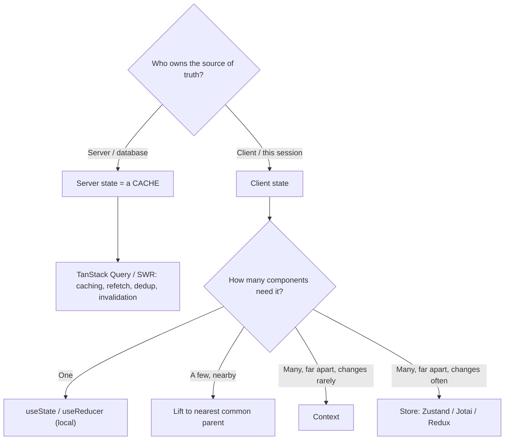

# State management without the rituals

## Why this matters

It's a Tuesday afternoon. A new engineer opens a pull request to add a "favorite" toggle to a product card. The diff touches eleven files: an action type constant, an action creator, a thunk, a reducer case, a selector, a `mapStateToProps`, a `mapDispatchToProps`, an entry in the root reducer, a slice in the store configuration, a test for the reducer, and the component itself. The actual behavior is a boolean flipping on a button. Code review takes longer than the feature did.

Three weeks later, a different bug lands: the favorite count on the product page is stale. A user favorites an item, the button updates, but the count in the header still shows the old number until a hard refresh. The team had carefully kept the server's data in their Redux store, and now they're hand-writing cache invalidation — refetching, merging, reconciling optimistic updates — to keep that copy in sync with a database they don't control. They've reinvented a cache, badly, and they're maintaining it forever.

Both problems come from the same root cause: treating "state" as one undifferentiated thing that all belongs in one global container, accessed through one ceremonial protocol. It doesn't. The state in a frontend application has at least two fundamentally different kinds with different ownership, different lifecycles, and different correct tools. Most of the ritual — the boilerplate, the stale caches, the "where does this belong?" paralysis — evaporates once you can tell those kinds apart and place each one where it actually lives. This chapter is about making that distinction sharp enough to act on.

The payoff is not aesthetic. Every piece of state you misplace becomes a recurring tax: a synchronization bug to chase, a re-render to profile, a file to touch on every change, a place for two views of the same fact to disagree. Placing state correctly is the cheapest performance and correctness work you will ever do, because it removes entire categories of bug before they can exist rather than patching them after.

## Mental model

The single most useful question to ask about any piece of state is: **who owns the source of truth?**

If your server owns it — it lives in a database, other users can change it, you fetched it over the network — then what you hold in the browser is not state. It's a *cache*. The moment you call it state and store it like state, you've signed up to solve cache invalidation, which Phil Karlton famously named one of the two hard problems in computer science. You don't want to solve that by hand. Libraries built for it (TanStack Query, SWR, RTK Query, Apollo) already have.

If your client owns it — the modal is open, the form has unsaved input, the user picked the "grid" view, the wizard is on step 2 — then it's genuinely client state. Nothing on the server knows or cares. This is the state you store and mutate directly.



Once you've split server state out, the client-state question collapses into a scope question, and the answer is almost always "smaller than you think." Start local. Lift only when a sibling needs the same value. Reach for Context only when the value is needed far away *and* changes rarely (theme, current user, locale). Reach for an external store only when the value is needed far away *and* changes often — the case where Context would re-render the entire subtree on every update.

That last distinction is the one people miss. Context is not a state manager; it's a dependency-injection mechanism for passing a value down without prop-drilling. Every consumer re-renders when the context value changes. That's fine for a theme that flips twice a day and catastrophic for a cursor position that updates sixty times a second.

Two more categories deserve a name, because misfiling them causes a surprising amount of grief. The first is **URL state**: the current route, query parameters, the active tab, a search term, pagination offset, an open detail panel. If a value should survive a page reload and be shareable by copying the address bar, the URL is its source of truth — not a store, not local state. Reading it from `useSearchParams`/the router and writing it back keeps deep links, the back button, and browser history correct for free; duplicating it into a store is how you get a tab that says one thing and an address bar that says another. The second is **derived state**, which is not really a third location but a discipline: any value computable from other state should be computed, not stored. `fullName` from `first` and `last`, `filteredItems` from `items` and `filter`, `isValid` from the form fields — store the inputs, derive the rest during render. State you store is state you can desynchronize; state you derive is correct by construction.

So the full sorting question is a short decision tree. Is the truth on the server? Cache it. Is it in the URL? Read it from the URL. Can it be computed from something else? Compute it. Only what survives all three filters is real client state, and that remainder is what the scope question above applies to.

## In practice

### Local state: the default, and usually enough

Most state is owned by exactly one component and should never leave it.

```tsx
function FavoriteButton({ initial }: { initial: boolean }) {
  const [isFavorite, setIsFavorite] = useState(initial);
  return (
    <button aria-pressed={isFavorite} onClick={() => setIsFavorite((v) => !v)}>
      {isFavorite ? "Favorited" : "Favorite"}
    </button>
  );
}
```

No store, no action, no selector. If only this component reads and writes the value, this is the entire correct implementation. The instinct to "future-proof" by putting `isFavorite` in a global store is the instinct that built the eleven-file PR.

When several pieces of local state update together or the next value depends on the previous in nontrivial ways, reach for `useReducer` — same locality, clearer transitions:

```tsx
type State = { step: number; data: Record<string, string> };
type Action =
  | { type: "next" }
  | { type: "back" }
  | { type: "set"; field: string; value: string };

function wizardReducer(state: State, action: Action): State {
  switch (action.type) {
    case "next": return { ...state, step: state.step + 1 };
    case "back": return { ...state, step: Math.max(0, state.step - 1) };
    case "set": return { ...state, data: { ...state.data, [action.field]: action.value } };
  }
}
```

This is the same reducer pattern Redux popularized, used locally without any of the global wiring. The pattern was always the good part; the ceremony was never required. A reducer also makes state transitions testable in isolation — you can assert on `wizardReducer(state, action)` as a pure function, with no component, no provider, and no render involved — which is most of the testing value people credit to Redux, available here for free.

### Lifting state: the right call, until it isn't

When two siblings need the same value, move it to their nearest common parent and pass it down. This is the React-recommended default, and for shallow trees it's the correct one.

```tsx
function ProductPage() {
  const [selectedColor, setSelectedColor] = useState("black");
  return (
    <>
      <ColorPicker value={selectedColor} onChange={setSelectedColor} />
      <ProductImage color={selectedColor} />
      <AddToCart color={selectedColor} />
    </>
  );
}
```

Lifting becomes painful only when the common parent is many levels up and the value has to be threaded through components that don't care about it (prop-drilling). That pain is the signal to consider Context or a store — not before. Note that prop-drilling is a readability and maintenance cost, not a performance one: passing a prop through five intermediate components does not, by itself, make them re-render any more than they already would. Reaching for a store to "fix" drilling that doesn't actually hurt is a common over-correction; sometimes the right move is to pass whole components as `children` so the intermediate layers never see the prop at all.

### Context: injection, not state management

Context shines for values that are read in many places and change rarely.

```tsx
const ThemeContext = createContext<"light" | "dark">("light");

function App() {
  const [theme, setTheme] = useState<"light" | "dark">("light");
  return (
    <ThemeContext.Provider value={theme}>
      <Header onToggle={() => setTheme((t) => (t === "light" ? "dark" : "light"))} />
      <Main />
    </ThemeContext.Provider>
  );
}

function ThemedCard() {
  const theme = useContext(ThemeContext); // no prop-drilling
  return <div className={theme === "dark" ? "card-dark" : "card-light"}>…</div>;
}
```

The anti-pattern is putting fast-changing or large state in Context. Because every consumer re-renders on any change to the context value, a Context holding `{ user, cart, notifications, mousePosition }` re-renders all consumers when *any* field changes. Splitting into multiple narrow contexts helps; for genuinely high-frequency shared state, use a store designed for selective subscription. One subtle trap: if the provider's `value` is an object literal created inline during render (`value={{ user, setUser }}`), it is a new reference on every parent render, so every consumer re-renders even when nothing meaningful changed. Memoize the value with `useMemo` and keep the object stable, or you get the re-render cost of a store with none of its selectivity.

### Stores: selective subscription for frequently-changing shared state

When state is shared widely *and* changes often, you want components to subscribe to just the slice they read, so only they re-render. That is exactly what external stores give you. Zustand is the smallest viable version:

```tsx
import { create } from "zustand";

type CartStore = {
  items: Record<string, number>;
  add: (id: string) => void;
  count: () => number;
};

const useCart = create<CartStore>((set, get) => ({
  items: {},
  add: (id) => set((s) => ({ items: { ...s.items, [id]: (s.items[id] ?? 0) + 1 } })),
  count: () => Object.values(get().items).reduce((a, b) => a + b, 0),
}));

// This component re-renders ONLY when the badge count changes,
// not when unrelated cart fields change.
function CartBadge() {
  const count = useCart((s) => Object.values(s.items).reduce((a, b) => a + b, 0));
  return <span>{count}</span>;
}
```

The selector (`(s) => …`) is the whole point: subscription is scoped to the derived value, so the store can hold a lot and each component pays only for what it reads. This is the structural advantage over Context, where consumption is all-or-nothing. No provider, no boilerplate file count. Jotai offers the same outcome with a bottom-up atom model — you compose small atoms and subscribe to exactly the ones you read — while Zustand takes a top-down single-store approach; pick by taste, since both solve the selective-subscription problem Context cannot. A word of caution on selectors that return fresh objects: a selector like `(s) => ({ a: s.a, b: s.b })` produces a new object each call and can defeat the bail-out unless you supply an equality function (e.g. `useShallow` in Zustand). Select primitives when you can, and shallow-compare when you must return a composite.

### Server state: stop storing it, start caching it

Here is the change that removes the most code from a typical app. The favorite count, the product list, the user's orders — none of that belongs in a client store. Hand it to a server-state library:

```tsx
import { useQuery, useMutation, useQueryClient } from "@tanstack/react-query";

function FavoriteCount({ productId }: { productId: string }) {
  const { data, isPending } = useQuery({
    queryKey: ["product", productId],
    queryFn: () => fetch(`/api/products/${productId}`).then((r) => r.json()),
    staleTime: 30_000,
  });
  if (isPending) return <span>…</span>;
  return <span>{data.favoriteCount} favorites</span>;
}

function FavoriteButton({ productId }: { productId: string }) {
  const qc = useQueryClient();
  const mutation = useMutation({
    mutationFn: () => fetch(`/api/products/${productId}/favorite`, { method: "POST" }),
    onSuccess: () => qc.invalidateQueries({ queryKey: ["product", productId] }),
  });
  return <button onClick={() => mutation.mutate()}>Favorite</button>;
}
```

The library deduplicates concurrent requests for the same key, caches by key, refetches stale data on window focus, retries failed requests, and — through `invalidateQueries` — gives you a declarative way to say "this data changed, refetch it." The stale-count bug from the opening scenario simply cannot occur here: the count and the button both read the same cache key, and invalidation refreshes both. You wrote no reducer, no selector, no manual merge logic. SWR (`useSWR`) covers the same ground with a smaller API surface; the model is identical.

When you want the UI to feel instant rather than wait for the round trip, these libraries support optimistic updates: in an `onMutate` callback you write the expected new value into the cache immediately, keep a snapshot of the previous value, and roll back to it in `onError`. That is the disciplined version of the hand-rolled "refetch, merge, reconcile" dance from the opening scenario — same goal, but with rollback and invalidation handled by code that has already been debugged by thousands of teams. The other lever worth understanding early is the difference between `staleTime` (how long a cached value is considered fresh and served without a background refetch) and the garbage-collection time (how long an unused cache entry is retained before eviction). Tuning `staleTime` per resource — long for a rarely-changing settings payload, short or zero for a live dashboard figure — is most of what separates a snappy app from one that either flickers with needless refetches or shows stale numbers. Avoid normalizing this data into a flat, relational shape in a client store the way Redux apps once did; the query cache keyed by request is simpler, and the cases where cross-entity normalization genuinely pays off are rarer than the tutorials suggest.

> Connect the dots: server state is a browser-side cache, and the same caching concerns from the backend reappear here — staleness windows, invalidation keys, and read-through population. The HTTP caching semantics in Part 5 (`ETag`, `Cache-Control`, `stale-while-revalidate`) are the protocol layer underneath what TanStack Query and SWR do in memory. And in Next.js (chapter 3 of this Part), the App Router's server-side data cache means some server state never needs a client cache at all.

> Security note: a client cache or store is readable by any script on the page, so treat it as a public surface. Don't park access tokens, refresh tokens, or another user's private data in a global store or query cache — an XSS bug then exfiltrates all of it in one read. Keep auth tokens in `httpOnly` cookies the JavaScript can't touch, scope each query to the authenticated user, and clear the cache (`queryClient.clear()`) on logout so the next user on a shared machine never sees the previous session's cached responses. If you persist a store or cache to `localStorage` for offline or reload survival, persist only non-sensitive UI state, because `localStorage` has no expiry and is trivially dumped.

## Pitfalls and anti-patterns

**The global store dumping ground.** A single Redux/Zustand store holding form inputs, modal open/closed flags, the current route, *and* fetched API data. Recognize it when "where does this go?" always has the same answer ("the store") and when half your store is a hand-maintained copy of the database. Fix it by sorting: server-owned data moves to a query library; transient UI state moves down to the components that use it; only genuinely-shared client state stays in the store.

**Server state in a client store.** The specific, most expensive version of the above. You `dispatch(fetchUsers())`, store the array, and now own refetching, loading flags, error flags, deduplication, and staleness by hand. Recognize it by the presence of `isLoading`/`error` booleans next to fetched arrays in your store, and by manual refetch calls after every mutation. Fix it by deleting all of it and using `useQuery`; the loading and error states come free and correct.

**Context as a state manager.** Putting frequently-changing or kitchen-sink state in one Context provider, then watching the whole tree re-render on every keystroke. Recognize it with the React DevTools profiler: a single context update lighting up dozens of unrelated components. Fix it by splitting into narrow, stable contexts, memoizing the provider `value`, or moving high-frequency state into a store with selectors.

**Premature global state.** Reaching for any store on a feature that one component owns, "in case we need it later." Recognize it by state that has exactly one reader and one writer but lives in a global container. Fix it by inlining it as `useState`; you can always lift later, and lifting is a five-minute refactor, while un-globalizing is a hunt across the codebase.

**Derived state stored instead of computed.** Keeping `fullName` in state alongside `firstName` and `lastName`, or `filteredItems` next to `items` and `filter`, then fighting to keep them in sync. Recognize it by state that can be wrong relative to other state. Fix it by computing during render (`const fullName = first + " " + last`) and reserving `useMemo` only for genuinely expensive derivations.

**Duplicating URL state into a store.** Mirroring the active tab, search term, or pagination offset into local or global state when the URL already holds it. Recognize it by a back button that doesn't restore the view, links that can't be shared, and two copies of "which tab" drifting apart. Fix it by reading from and writing to the router's search params as the single source of truth.

## Production checklist

- [ ] Server-owned data (anything fetched over the network) lives in a server-state library (TanStack Query, SWR, RTK Query), not a client store
- [ ] Every piece of client state lives at the narrowest scope that works: local first, lifted second, Context/store only when proven necessary
- [ ] No `isLoading` / `error` booleans sitting next to fetched data in a client store — those come from the query layer
- [ ] State that belongs in the URL (route, tab, filters, pagination) lives in the URL, not duplicated into a store
- [ ] Context providers hold stable, infrequently-changing values; `value` is memoized; large or fast-changing state is split out
- [ ] Stores expose selectors so components subscribe only to the slices they read; composite selectors use shallow comparison
- [ ] Derived values are computed during render, not stored and synced
- [ ] Query keys are structured and consistent so invalidation after mutations is reliable (`["product", id]`, not ad-hoc strings)
- [ ] `staleTime` / garbage-collection time (or SWR equivalents) set deliberately per resource, not left at defaults blindly
- [ ] No auth tokens or other users' private data in a client store or persisted cache; cache cleared on logout
- [ ] A new feature's "happy path" state addition touches one or two files, not eleven — if it doesn't, the architecture has too much ceremony

## Exercises

1. **(Comprehension)** Take a list of ten pieces of state from a real app you've worked on (e.g. "modal open", "list of orders", "selected tab", "draft comment text", "logged-in user"). For each, answer the single question "who owns the source of truth?" and assign it to one of: local, lifted, URL, Context, store, or server-state library. Explain any you found ambiguous, and flag any you currently store but could derive.

2. **(Applied)** Find a component in a codebase that fetches data and stores it in a client store (or build a small one that does, with manual `loading`/`error` flags and a refetch-after-mutation). Rewrite it using TanStack Query or SWR. Count the lines removed and verify that the stale-after-mutation bug is gone by favoriting an item and watching a count elsewhere update without a refresh. As a stretch, add an optimistic update with rollback on error.

3. **(Design)** You're advising a team starting a new dashboard app with real-time data (server-pushed updates), user-configurable layouts (persisted per user), and heavy in-page interactivity (drag-to-reorder, fast-changing). Design the state architecture: which kinds of state exist, where each lives, and which libraries you'd choose. Justify where you'd accept a store and where you'd refuse one, explain how real-time server pushes interact with a query cache (e.g. writing pushed data into the cache versus invalidating keys), and say where the persisted layout config lives and how you'd keep it from becoming a hand-rolled cache of a server resource.

## Further reading

- React docs, ["Managing State"](https://react.dev/learn/managing-state) — the official guidance on local state, lifting, and when to reach for Context; the "Choosing the State Structure" page is the canonical source for the derived-state rule.
- TanStack Query documentation, ["Important Defaults"](https://tanstack.com/query/latest/docs/framework/react/guides/important-defaults) and the overview — the clearest statement of the server-state-is-a-cache thesis.
- Kent C. Dodds, ["Application State Management with React"](https://kentcdodds.com/blog/application-state-management-with-react) — the essay that popularized splitting state by kind and scope rather than centralizing.
- SWR documentation (https://swr.vercel.app/) — `stale-while-revalidate` for React; the name comes directly from [RFC 5861](https://datatracker.ietf.org/doc/html/rfc5861), the HTTP caching extension.
- Zustand documentation (https://zustand.docs.pmnd.rs/) and Jotai (https://jotai.org/) — two minimal store models worth comparing before defaulting to Redux.
- Redux Toolkit, ["When should I use Redux?"](https://redux.js.org/faq/general#when-should-i-use-redux) — the maintainers' own honest list of when you don't need it.
