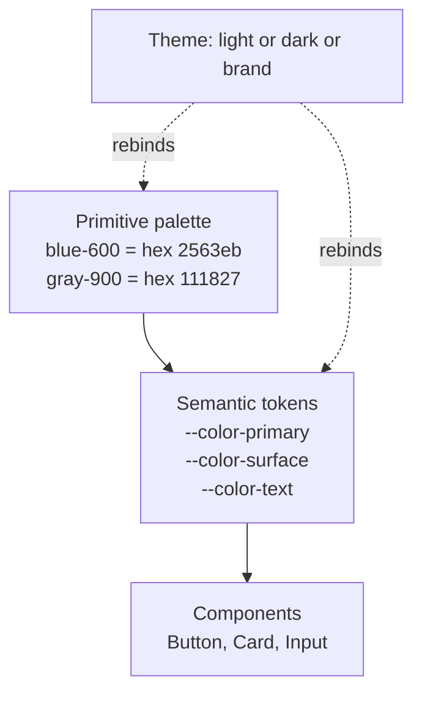

# Styling at scale

## Why this matters

It's a Tuesday afternoon and the design team just shipped a refresh. Primary blue moves from `#2563eb` to `#1d4ed8`, the corner radius on every card goes from 8px to 12px, and the spacing rhythm tightens. "Should be a quick one," the PM says. Three days later you're still finding buttons that didn't get the memo, because somewhere in the codebase there are dozens of separate hardcoded `#2563eb` literals, a `.btn-primary` whose color is overridden by a `.sidebar .btn-primary`, and a "fix" from last quarter that reads `background: #2563eb !important`. You change the value in one file, and a button two routes away turns the wrong shade, because it never read from that file in the first place.

The cost isn't the hex value. The cost is that your styling has no single source of truth, so a one-line design change becomes an archaeology project. Every override is a small bet that nobody will ever need to change this again, and the bet always loses. The codebase accumulates specificity the way a ship accumulates barnacles: slowly, invisibly, until it can't turn. Worse, the failure is silent — nothing errors, no test goes red, the wrong button just ships to production looking almost right, and a customer notices before you do.

This chapter is about styling that survives a redesign. The mechanism that makes that possible is older and simpler than any framework: name your design decisions once, reference them everywhere, and never let a component reach around the system to set a raw value. Tailwind, CSS-in-JS, and CSS custom properties are all different packagings of that one idea. Understand the idea — the cascade it rides on, and the tokens it flows through — and the framework choice becomes a tooling preference rather than an architectural gamble. The engineers who treat CSS as a pile of strings that mysteriously sometimes wins and sometimes loses live in fear of touching a stylesheet. The ones who understand the cascade as a deterministic algorithm refactor styles with the same confidence they bring to refactoring a function. This chapter is the bridge.

## Mental model

CSS resolves every property on every element through a deterministic pipeline. There is no ambiguity in it — given the same document and the same stylesheets, the same value always wins. When two rules both set `color` on the same element, the cascade decides the winner in a fixed order, and only moves to the next criterion when the current one ties:

1. **Origin and importance.** Author styles beat browser defaults; `!important` author styles beat normal author styles (and, surprisingly, an `!important` from the user-agent or user origin can beat your author `!important` — relevant for accessibility overrides).
2. **Cascade layers (`@layer`).** Within the same origin, later-declared layers win over earlier ones. Unlayered styles beat layered ones for normal rules. This is a newer tier, sitting above specificity, and it is the cleanest lever you have.
3. **Specificity.** A three-part tuple `(ID, class/attribute/pseudo-class, element/pseudo-element)` compared left to right. `.sidebar .btn` is `(0,2,0)`; `#app .btn` is `(1,1,0)` and beats it because the ID column dominates.
4. **Source order.** The last rule declared wins. This is the final tiebreaker, and relying on it makes your styles fragile to the order files happen to load.

Inline `style=""` outranks any selector (it sits just below `!important`), and `!important` jumps most of the queue. That's the entire game — four criteria, checked in order, deterministic every time.

The trap is that fighting the cascade with specificity is a ratchet: it only goes up. Once a rule wins with `.sidebar .btn-primary` (specificity `0,2,0`), the only way to override it is something more specific, which the next person overrides with something more specific still, until someone reaches for `!important` and the ladder breaks. `!important` is not a tool; it is the sound of the cascade losing. Each one you add is a debt the next engineer pays with a second `!important`, and there is no third level — after that the only move is editing the original rule, which is exactly the coupling you were trying to avoid.

The way out is to stop competing on specificity and route every visual decision through a layer of indirection — a **design token**. A token is a named variable (`--color-primary`, `--space-4`, `--radius-card`) that holds a decision. Components reference tokens; tokens reference primitives; a theme swaps the primitives. Nothing hardcodes a raw value, so there's nothing to fight over. Custom properties have a property the cascade gives you almost nowhere else: they **inherit through the DOM**. A token set on an ancestor flows down to every descendant until something closer overrides it. That means you can change a value for an entire subtree by setting one property on its container — no selector specificity involved at all.



Read it bottom-up. A component never says "blue." It says "primary." The semantic token `--color-primary` points at a primitive `blue-600`. A theme is nothing more than a different set of bindings: dark mode repoints `--color-surface` from white to near-black, and every component that referenced the token updates for free. This three-tier structure — primitives, semantic tokens, components — is the spine of every serious design system, from the W3C Design Tokens Community Group format to the internals of Tailwind's theme. The discipline that makes it work is one rule: a component is allowed to read a semantic token and nothing else. The instant a component reads a primitive directly, or worse a raw literal, the indirection has a hole in it and the redesign-proofing leaks out.

## In practice

### The wrong way: a specificity war

Here's how it starts innocently and ends badly. Three engineers, three sprints, one button.

```css
/* sprint 1: the base button */
.btn { background: #2563eb; color: white; padding: 8px 16px; }

/* sprint 2: "the button in the sidebar is too bright" */
.sidebar .btn { background: #1e40af; }

/* sprint 3: "the CTA in the sidebar promo must be green, it won't override!" */
.sidebar .promo .btn { background: #16a34a; }

/* the panic fix, two weeks later */
.btn-danger { background: #dc2626 !important; }
```

By sprint 3 the specificity is climbing (`0,1,0` then `0,2,0` then `0,3,0`) and the `!important` in the last rule means `.btn-danger` can now never be themed, disabled-styled, or dark-moded without another `!important`. Multiply this by a hundred components and you have a stylesheet nobody can change with confidence — every edit is a gamble that some descendant selector three files away won't quietly win. The root cause isn't bad engineers; each step was locally reasonable. It's that color decisions live inline in selectors that compete with each other, so the only language available for "this case is different" is "this selector is more specific."

### The right way: tokens in CSS custom properties

Lift every decision into a custom property defined once at `:root`. Components consume tokens and stop competing.

```css
:root {
  /* tier 1: primitives — raw palette, never used directly by components */
  --blue-600: #2563eb;
  --blue-800: #1e40af;
  --green-600: #16a34a;
  --red-600: #dc2626;
  --gray-0: #ffffff;
  --gray-900: #111827;

  /* tier 2: semantic tokens — what components actually reference */
  --color-primary: var(--blue-600);
  --color-surface: var(--gray-0);
  --color-text: var(--gray-900);
  --color-danger: var(--red-600);
  --radius-card: 12px;
  --space-2: 0.5rem;
  --space-4: 1rem;
}

.btn {
  background: var(--color-primary);
  color: var(--color-surface);
  padding: var(--space-2) var(--space-4);
  border-radius: var(--radius-card);
}
.btn--danger { background: var(--color-danger); }
```

No descendant selectors, no `!important`, every selector at specificity `0,1,0`. The sidebar variant is no longer "more specific" — it's a different token binding:

```css
.sidebar { --color-primary: var(--blue-800); }
```

That single line rebinds `--color-primary` for everything inside `.sidebar`, because custom properties inherit through the DOM. The button inside the sidebar reads the locally-overridden value with zero specificity escalation, and a button outside the sidebar is completely untouched. This is the whole trick: **CSS custom properties let you override by scope (inheritance) instead of by force (specificity).** The override lives on the container that owns the context, not on a selector that has to out-shout the base rule. Add a third context tomorrow and it's one more scoped binding, not one more rung on a ladder.

### Cascade layers make the priority explicit

Even with flat selectors, you still depend on source order when a reset, a vendor stylesheet, and your components all set the same property. Cascade layers remove that fragility by declaring the priority order once, independent of how files happen to load:

```css
/* declared once, anywhere — establishes the order */
@layer reset, vendor, components, utilities;

@layer reset {
  *, *::before, *::after { box-sizing: border-box; margin: 0; }
}

@layer components {
  /* even a heavy selector here loses to anything in `utilities` */
  .card .btn { background: var(--color-primary); }
}

@layer utilities {
  .bg-danger { background: var(--color-danger); }  /* always wins over components */
}
```

A later layer beats an earlier one regardless of selector specificity, so `.bg-danger` (a single class) reliably overrides `.card .btn` (two classes) without `!important`. Layers turn "who wins" from an emergent property of file order into a one-line declaration you can read.

### Theming for free

Because semantic tokens are the only thing components read, a theme is just a second set of bindings. Dark mode is a media query that repoints tokens:

```css
@media (prefers-color-scheme: dark) {
  :root {
    --color-surface: var(--gray-900);
    --color-text: var(--gray-0);
  }
}

/* or an explicit, user-toggleable theme */
[data-theme="dark"] {
  --color-surface: var(--gray-900);
  --color-text: var(--gray-0);
}
```

Toggle with one line of JS — `document.documentElement.dataset.theme = 'dark'` — and the entire app re-themes without touching a single component. No `if (theme === 'dark')` scattered through your TSX, no duplicated style objects. The cost model is what makes this scale: with N components and M themes, conditional styling forces you toward N times M code paths, while token rebinding stays at N plus M definitions. The components don't grow when you add a theme; only the binding table does.

### Where Tailwind fits

Tailwind is a token system wearing a utility-class coat. Its `theme` is the token registry; its utilities (`bg-primary`, `p-4`, `rounded-card`) are typed references to those tokens. In v4 the config is CSS-first and the tokens *are* custom properties, which makes the indirection explicit:

```css
@import "tailwindcss";

@theme {
  --color-primary: #2563eb;
  --radius-card: 0.75rem;
  --spacing-4: 1rem;
}
```

```tsx
// Button.tsx — utilities are token references, not raw values
export function Button({ variant = "primary", ...props }: ButtonProps) {
  const styles = {
    primary: "bg-primary text-white",
    danger: "bg-danger text-white",
  };
  return (
    <button
      className={`${styles[variant]} px-4 py-2 rounded-card`}
      {...props}
    />
  );
}
```

`bg-primary` compiles to `background-color: var(--color-primary)`. You get the colocation and dead-code elimination of utilities plus the single-source-of-truth of tokens. The win over hand-rolled CSS is that an unused token-class is purged from the bundle, and you can't fat-finger a value because there's no value to type — only token names that either exist or fail the build. The standard escape hatch from this discipline is the arbitrary-value syntax (`bg-[#2563eb]`), which is exactly the leak you spent the whole chapter avoiding; treat its appearance in a review as a smell, and consider disabling it for color entirely.

### Where CSS-in-JS fits, and where it doesn't

Runtime CSS-in-JS (styled-components, Emotion) lets you compute styles from props and theme in JavaScript:

```tsx
import styled from "styled-components";

const Button = styled.button<{ $variant: "primary" | "danger" }>`
  background: ${(p) => p.theme.colors[p.$variant]};
  padding: ${(p) => p.theme.space[2]} ${(p) => p.theme.space[4]};
  border-radius: ${(p) => p.theme.radius.card};
`;
```

The `theme` object here is, again, your token registry — same idea, different syntax. The cost is real: runtime CSS-in-JS serializes and injects styles during render, which adds work on every render and is awkward in React Server Components, where there's no client runtime to inject into. For new work in Next.js App Router, prefer zero-runtime options — Tailwind, CSS Modules, or a compile-time CSS-in-JS like `vanilla-extract` — that emit static CSS at build time and pass tokens as custom properties. Reach for runtime CSS-in-JS only when styles genuinely depend on values you can't know until runtime (a chart bar whose width is a data point, a brand color loaded per-tenant), and even then, prefer setting a custom property over generating a new class: `style={{ "--bar-width": pct }}` keeps a single static rule and lets the value flow through the token, instead of minting a brand-new class string on every render.

### One source feeding many platforms

The three-tier model pays off most when "everywhere" means more than one codebase. A web app, a marketing site, a native app, and a Figma library all need the same brand decisions. The portable answer is to author tokens once in a tool-agnostic source — the W3C Design Tokens format is JSON describing each token's value and type — and run a transform step (Style Dictionary is the de-facto tool) that emits platform-specific outputs: CSS custom properties for the web, a Swift or Kotlin file for native, a JS object for runtime theming. The token *names* stay identical across every output, so a rebrand is one edit to the source JSON and a rebuild, and Figma variables mapped to the same names give designers and engineers a shared vocabulary instead of a translation layer that drifts.

> **Connect the dots:** The token-binding-by-scope pattern is the same dependency-inversion idea you'll see in Part 5 — components depend on a named abstraction (`--color-primary`, an interface) rather than a concrete value (`#2563eb`, an implementation), so you can swap the implementation without touching the consumer. Naming the seam is what makes both swappable.

> **Security note:** Styling becomes an injection surface the moment a style value comes from user-controlled data. Interpolating an untrusted string into a CSS-in-JS template, a `style` attribute, or a custom property lets an attacker smuggle in declarations — and `url(...)` values, `image-set`, or legacy `expression()` in old engines can exfiltrate data or, combined with markup injection, support clickjacking and UI-redressing attacks. Never build CSS by string-concatenating user input; pass dynamic values only through a typed custom property whose use is a known, fixed declaration (`style={{ "--bar-width": clampedNumber }}`), and validate or clamp the value first. At the app level, a `style-src` directive in your Content-Security-Policy limits what inline styles can run; note that runtime CSS-in-JS that injects `<style>` tags may require `style-src 'unsafe-inline'` or a nonce, which is another point in favor of build-time CSS for security-sensitive apps.

## Pitfalls and anti-patterns

**1. The specificity arms race.** *Recognize it* by grepping for descendant selectors that target the same component (`.x .btn`, `.y .z .btn`) and any `!important` in your own code. *Fix it* by hoisting the contested value into a custom property and overriding the property by scope, not the rule by selector. Keep authored selectors at a flat `0,1,0` — one class, no nesting. Cascade layers (`@layer`) also let you declare that your component layer always loses to your utility layer, removing source-order fragility entirely.

**2. Hardcoded values that bypass the token layer.** *Recognize it* with a lint rule or a grep for hex codes and raw `px` in component files; if you find `#2563eb` anywhere outside the primitive tier, the token system has a leak. *Fix it* by adding a Stylelint rule (`declaration-property-value-disallowed-list`) or a Tailwind setup that has no arbitrary-value escape hatch for color. A token is only a source of truth if it's the *only* truth.

**3. Skipping the semantic tier.** *Recognize it* when components reference primitives directly — `color: var(--blue-600)` instead of `var(--color-primary)`. *Fix it* by treating primitives as private. The moment a component knows the brand is blue, rebranding to purple means a find-and-replace across the codebase instead of one binding change. The semantic name (`primary`) is the contract; the primitive (`blue-600`) is the implementation detail.

**4. Theming with conditionals instead of bindings.** *Recognize it* by `theme === 'dark' ? '#111' : '#fff'` ternaries in JSX or duplicated style blocks per theme. *Fix it* by making every component read one token and letting the theme rebind it at the root. N components times M themes should be N plus M definitions, not N times M.

**5. Specificity bombs from third-party and global resets.** *Recognize it* when a vendor stylesheet or an over-eager reset wins against your component and you "solve" it with `!important`. *Fix it* with cascade layers: `@layer reset, vendor, components, utilities;` declared once establishes a fixed priority order independent of specificity or load order, so your components reliably beat the reset without an escalation.

## Production checklist

- [ ] A three-tier token structure exists: primitives then semantic tokens then component styles, with primitives treated as private
- [ ] Zero `!important` in authored application CSS (vendor overrides isolated in a low-priority `@layer`)
- [ ] Authored selectors are flat — single class, no descendant chains for component styling
- [ ] All color, spacing, radius, and typography values come from tokens; a linter blocks raw hex/px in component files
- [ ] Theming (light/dark/brand) is implemented by rebinding tokens at a root scope, never by per-component conditionals
- [ ] Cascade layers (`@layer`) declare an explicit priority order for reset / vendor / components / utilities
- [ ] Dark mode respects `prefers-color-scheme` by default and offers an explicit user override persisted across sessions
- [ ] Dynamic style values from user input flow only through validated custom properties, never string-concatenated CSS; a `style-src` CSP directive is set
- [ ] Runtime CSS-in-JS is avoided in Server Components; styling is build-time (Tailwind, CSS Modules, or zero-runtime CSS-in-JS)
- [ ] Tokens are defined once in a single file/registry and consumed everywhere, including design handoff (Figma variables mapped to the same names)
- [ ] A redesign rehearsal: changing one primitive value visibly updates every consuming component with no other edits

## Exercises

1. **(Comprehension)** Given these three rules targeting one `<button class="btn">` inside `<div class="sidebar">`: `.btn { color: red }`, `.sidebar .btn { color: blue }`, `button { color: green !important }` — state the computed color and explain the resolution order (importance, specificity, source order) that produces it. Then rewrite all three so the sidebar override works *without* any descendant selector or `!important`.

2. **(Applied)** Take a component with hardcoded colors and spacing (a card or button) and refactor it onto a three-tier token system using CSS custom properties. Add a `[data-theme="dark"]` block that rebinds only the semantic tokens, and a toggle that flips `data-theme` on `<html>`. Verify that the component file itself contains no theme-specific code, and that a single primitive edit changes both themes consistently.

3. **(Design)** Your org has a web app (Tailwind), a marketing site (plain CSS), a React Native app, and a Figma library, all needing the same brand colors and spacing. Design a token pipeline so one source of truth feeds all four, surviving a rebrand with a single edit. Address the source format (consider the W3C Design Tokens spec and a tool like Style Dictionary), how each platform consumes the output, and how you'd prevent drift between Figma and code.

## Further reading

- [CSS Cascading and Inheritance Level 5](https://www.w3.org/TR/css-cascade-5/) — the normative spec for the cascade, specificity, and `@layer` (cascade layers)
- [CSS Custom Properties for Cascading Variables Module Level 1](https://www.w3.org/TR/css-variables-1/) — how custom properties inherit and resolve; the mechanism behind scoped token overrides
- [Design Tokens Format Module](https://tr.designtokens.org/format/) — the W3C Design Tokens Community Group spec for a portable, tool-agnostic token format
- [MDN: Specificity](https://developer.mozilla.org/en-US/docs/Web/CSS/Specificity) — the clearest practical reference for computing and reasoning about specificity
- [Tailwind CSS v4 documentation: Theme variables](https://tailwindcss.com/docs/theme) — how Tailwind models its theme as CSS custom properties
- [Style Dictionary](https://styledictionary.com/) — the de-facto build tool for transforming one token source into platform-specific outputs (CSS, iOS, Android, JS)
