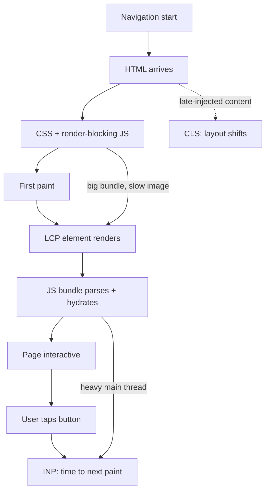

# Performance and Core Web Vitals

## Why this matters

It's a Tuesday afternoon and the marketing team is unhappy. Your e-commerce product page looks fine on your laptop — it loads instantly, the hero image snaps in, everything's crisp. But the weekly RUM report just landed and the product detail route has a 75th-percentile Largest Contentful Paint of 4.8 seconds and an Interaction to Next Paint of 380ms. Conversion on mobile is down. Someone forwards a Search Console email warning that the page group is now rated "Poor" on Core Web Vitals, and SEO is asking what that means for ranking.

You open DevTools, throttle to "Slow 4G" and 4x CPU, and reload. Now you see it. A 1.2MB hero JPEG that's actually displayed at 380px wide. A render-blocking web font with no `font-display`. A 600KB JavaScript bundle that hydrates the whole page before the "Add to cart" button will respond to a tap. A carousel that injects itself after load and shoves the whole layout down 200px. On your fast laptop on office Wi-Fi, none of this was visible. On a mid-range Android phone on a train, it's the entire experience.

This is the gap this chapter closes. Performance is not a vibe you get from reloading on your own machine — it's a measurable property of the experience real users have on real devices and real networks, and Google has standardized three numbers that capture most of what matters. The engineers who treat performance as "it feels fast to me" ship the page above. The ones who measure against field data, set budgets, and know which fix moves which metric ship pages that load in under two seconds on a phone. The difference is almost entirely knowing what to look at.

## Mental model

Core Web Vitals are three metrics, each capturing a distinct phase of the user's experience: loading, interactivity, and visual stability.

| Metric | Measures | Phase | "Good" threshold (p75) |
|---|---|---|---|
| **LCP** (Largest Contentful Paint) | When the largest visible element — usually the hero image or headline — finishes rendering | Loading | ≤ 2.5s |
| **INP** (Interaction to Next Paint) | The latency from a user interaction (tap, click, keypress) to the next visual update, across the whole visit | Interactivity | ≤ 200ms |
| **CLS** (Cumulative Layout Shift) | How much visible content shifts unexpectedly during the page's lifetime | Visual stability | ≤ 0.1 |

The thresholds are evaluated at the **75th percentile** of your users — meaning three-quarters of page loads must hit "good" for the page to pass. This is the single most important thing to internalize: the metric that matters is not your median experience, it's the experience of your slower quarter. INP replaced First Input Delay as a Core Web Vital in March 2024 because FID only measured input *delay*, not the full time to the next paint — INP captures the whole round trip, which is what users actually feel.

It helps to know what the browser is actually recording for each one, because the mechanics tell you where to look. LCP is the render timestamp of the single largest in-viewport image or text block, measured relative to navigation start; the browser keeps revising its candidate as larger elements paint and locks the value on the first user interaction. INP watches every discrete interaction over the page's lifetime, measures input delay plus processing time plus the time to the next frame for each, and reports (roughly) the worst one — so a single janky handler buried in a long session can sink the score. CLS sums "layout shift" scores across the visit, where each shift is the fraction of the viewport that moved multiplied by the distance it moved; a small banner that nudges everything down a little, repeatedly, can cost as much as one big jump. Knowing this is why you stop guessing: each number points at a specific moment you can reproduce.

Here's how the three metrics map onto the timeline of a page load and the things that hurt each one:



The mental shift: each metric has a small set of dominant causes. LCP is hurt by slow servers, render-blocking resources, and large unoptimized images. INP is hurt by long tasks on the main thread — too much JavaScript executing in one chunk, blocking the browser from painting a response. CLS is hurt by content that loads without reserved space: images without dimensions, ads, fonts that swap, banners injected above the fold. Fix the dominant cause and the number moves. Most performance work is diagnosis, not heroics.

## In practice

### A slow page, measured

Here's a Next.js App Router page that does almost everything wrong. It's representative of real code I've seen ship.

```tsx
// app/product/[id]/page.tsx — the slow version
import { Carousel } from '@/components/Carousel'; // 180KB of carousel lib
import { Reviews } from '@/components/Reviews';

export default async function ProductPage({ params }: { params: { id: string } }) {
  const product = await fetch(`https://api.shop.com/p/${params.id}`).then(r => r.json());
  return (
    <main>
      {/* No width/height: browser can't reserve space → CLS */}
      
      <h1>{product.name}</h1>
      {/* Heavy client component hydrates eagerly, blocking the main thread */}
      <Carousel images={product.gallery} />
      <Reviews productId={params.id} />
    </main>
  );
}
```

The hero `` has no dimensions, so when it loads the headline jumps down — that's CLS. The image is whatever the CMS uploaded, probably a 2000px JPEG served at full size — that's LCP. The `Carousel` is a 180KB client component that hydrates immediately even though it's below the fold — that's INP and bundle bloat.

Before fixing anything, measure. The right tool depends on whether you want lab data (reproducible, controlled) or field data (real users, what actually counts). Run a lab audit:

```bash
# Lighthouse CLI, mobile profile, simulated throttling
npx lighthouse https://shop.com/product/42 \
  --preset=desktop=false \
  --only-categories=performance \
  --output=json --output-path=./report.json --quiet
```

Lab data tells you *what's slow and why*. But Core Web Vitals as Google scores them come from **field data** — the Chrome User Experience Report (CrUX), aggregated from real Chrome users. The two can disagree, and field data is the one that affects ranking. Always reconcile both.

### Reading the Performance panel: which metric is broken

A Lighthouse score gives you a verdict; the Performance panel (or a trace) tells you the story. Record a load with throttling on, then read it metric by metric. For LCP, the panel marks the LCP element and the moment it painted — click it and you see whether the delay was the server (a long gap before the HTML even arrives), a render-blocking resource (CSS or a synchronous script holding up first paint), or the image itself downloading late because nothing told the browser to prioritize it. Those three causes have three different fixes, and the trace tells you which one you have instead of leaving you to guess.

For INP, the same trace shows long tasks as wide red-flagged blocks on the main thread. An interaction that lands during one of those blocks waits for it to finish before anything paints — that wait *is* the INP. The cause is almost always JavaScript: a giant hydration pass on load, an expensive event handler, or a third-party script monopolizing the thread. For CLS, the panel flags each layout shift and highlights the element that moved, so you can trace a 0.18 score back to the one ad slot or late-loading image that shifted everything below it. Diagnosis first, code second — most wasted performance effort is someone optimizing the thing that wasn't the bottleneck.

### Fixing LCP: ship the right image, fast

The biggest LCP win on most pages is the hero image. Use the framework's image component, which generates responsive `srcset`, modern formats (AVIF/WebP), and the right loading priority:

```tsx
import Image from 'next/image';

// The LCP element: priority hints the browser to preload it, no lazy-loading
<Image
  src={product.heroUrl}
  alt={product.name}
  width={1200}
  height={800}
  priority           // preloads; do this ONLY for the LCP element
  sizes="(max-width: 768px) 100vw, 600px"
/>
```

`priority` emits `<link rel="preload">` and `fetchpriority="high"` so the browser fetches the hero before discovering it in layout. `sizes` tells the browser the *displayed* width so it picks a 600px variant instead of the 2000px original. The explicit `width`/`height` reserve space — which also fixes CLS for free.

If you're not on Next.js, the raw platform primitives do the same job:

```html
<link rel="preload" as="image" href="/hero-600.avif" fetchpriority="high" />

```

For fonts, the LCP element is often text. A web font that blocks rendering delays the headline. Use `font-display: swap` (or `optional`) and preload the font file:

```css
@font-face {
  font-family: 'Inter';
  src: url('/fonts/inter.woff2') format('woff2');
  font-display: swap; /* render fallback immediately, swap when ready */
}
```

A note on `swap` versus `optional`: `swap` shows the fallback immediately and swaps in the web font whenever it arrives, which can itself cause a layout shift if the two faces have different metrics. `optional` gives the font a very short window to load and otherwise sticks with the fallback for that page view — no swap, no shift, at the cost of some visitors never seeing your brand font on a cold load. For headline text that is also the LCP element, that trade is often worth it. Pair either with a `preload` of the `woff2` so the font is in flight as early as possible.

### Fixing INP and bundle size: split and defer

INP is a main-thread problem. The fix is shipping less JavaScript and breaking up long tasks. Start with code splitting — the `Carousel` is below the fold, so it has no business in the initial bundle:

```tsx
import dynamic from 'next/dynamic';

// Loads the carousel's JS only when it's about to render, off the critical path
const Carousel = dynamic(() => import('@/components/Carousel'), {
  ssr: false,
  loading: () => <div style={{ height: 400 }} aria-hidden />, // reserve space → no CLS
});
```

`dynamic`/`React.lazy` produces a separate chunk fetched on demand. The 180KB no longer blocks hydration of the "Add to cart" button. For the reviews, which are below the fold and not interactive, render them as a Server Component so they ship zero client JS at all:

```tsx
// components/Reviews.tsx — Server Component (no 'use client'): zero JS to the client
export async function Reviews({ productId }: { productId: string }) {
  const reviews = await getReviews(productId);
  return <ul>{reviews.map(r => <li key={r.id}>{r.body}</li>)}</ul>;
}
```

The principle worth holding onto: client JavaScript is the most expensive thing you can ship, because the cost is not just downloading it — it's parsing, compiling, and executing it on a phone CPU that is a fraction as fast as your laptop. A component that ships zero client JS has zero hydration cost and can never block an interaction. Server Components are the default; reach for `'use client'` only at the boundary where you genuinely need state, effects, or event handlers.

When a single interaction handler is genuinely heavy — say, filtering a large list on keystroke — break the long task so the browser can paint between chunks. The platform now has a primitive for exactly this:

```ts
// Yield to the main thread so a pending paint/interaction can happen
async function processInChunks(items: Item[]) {
  for (const batch of chunk(items, 50)) {
    handleBatch(batch);
    // scheduler.yield() resumes with high priority; falls back gracefully
    if ('scheduler' in window && 'yield' in scheduler) {
      await scheduler.yield();
    } else {
      await new Promise(r => setTimeout(r, 0));
    }
  }
}
```

Yielding does not make the total work any faster; it makes the work *interruptible*, so a tap that arrives mid-computation gets a frame to respond in instead of waiting for the whole batch. That distinction is the heart of INP work: the goal is responsiveness, not raw throughput.

### Bundle budgets: make regressions fail the build

Performance rots unless you enforce it. Set a budget and wire it into CI so a 200KB dependency someone adds in a hurry breaks the build instead of the field metrics. Lighthouse CI takes a budget file:

```json
// budget.json
[{
  "path": "/*",
  "resourceSizes": [
    { "resourceType": "script", "budget": 170 },
    { "resourceType": "image", "budget": 300 },
    { "resourceType": "total", "budget": 600 }
  ],
  "timings": [{ "metric": "interactive", "budget": 3500 }]
}]
```

```bash
# In CI: assert the budget; non-zero exit fails the pipeline
npx lhci autorun --collect.url=https://staging.shop.com/product/42 \
  --assert.budgetsFile=./budget.json
```

The 170KB script budget is a defensible default for the initial JS payload on a route — it's the commonly cited ceiling for staying interactive within a few seconds on a mid-range phone. the exact number against your audience's devices, but the principle holds: pick a number, enforce it, and treat crossing it as a bug. A budget that nobody can cross silently is worth far more than a one-time optimization, because the failure mode it prevents is the slow, invisible drift that turns a fast page Poor over a year of feature work.

### Measuring with real users

Lab tools lie by omission — they can't see your users' devices, networks, or browser extensions. Collect field data with the `web-vitals` library and send it to your analytics:

```ts
// lib/vitals.ts
import { onLCP, onINP, onCLS } from 'web-vitals';

function send(metric: { name: string; value: number; id: string }) {
  // navigator.sendBeacon survives page unload, unlike fetch
  navigator.sendBeacon('/analytics/vitals', JSON.stringify(metric));
}

onLCP(send);
onINP(send);
onCLS(send);
```

These callbacks fire with the *actual* values your users experience, attributed per page load. Aggregate them at p75, segment by route and device class, and you have the same signal Google ranks you on — except you can see it daily instead of waiting 28 days for the CrUX window to roll over. The segmentation is what makes the data actionable: a healthy overall p75 can hide a checkout route that is Poor only on low-end Android, and you will never find that by staring at a single global number. Use the `web-vitals` attribution build when you need to go further — it tells you *which element* was the LCP candidate or *which* interaction produced your worst INP, turning a field number back into a line of code.

> **Connect the dots:** The image optimization here — serving AVIF/WebP variants from a CDN at the right size — leans on the caching and edge-delivery patterns from Part 3 (Next.js as a production framework) and the CDN material in Part 7. The metric *collection* pipeline is just structured logging and aggregation, the same observability stack covered in Part 9. Performance is an end-to-end property, not a frontend-only one.

> **Security note:** When you POST RUM data to your own endpoint, treat the payload as untrusted input — it comes from the client and is trivially forgeable. Validate and rate-limit it server-side, never reflect it into a page without escaping (stored XSS), and avoid putting full URLs with query strings into your beacon if those URLs can contain tokens or PII. If you use a third-party RUM provider, audit what their script can read; a performance beacon that also exfiltrates page content is a real supply-chain risk. Lock third-party scripts down with Subresource Integrity and a Content-Security-Policy that restricts `connect-src`.

## Pitfalls and anti-patterns

**1. Optimizing for lab scores while field data stays Poor.** Lighthouse runs on a simulated mid-tier device with simulated throttling; your real users have a long tail of cheap phones, flaky networks, and battery-throttled CPUs. A page can score 95 in Lighthouse and still fail CrUX. *Recognize it:* lab green, Search Console red. *Fix it:* treat field data (CrUX/RUM) as the source of truth and use lab tools only to diagnose *why* a field metric is bad. Always test in DevTools with CPU and network throttling on, never on your unthrottled laptop.

**2. Lazy-loading the LCP element.** Engineers learn "lazy-load images for performance" and apply it to everything, including the hero. Lazy-loading the LCP image means the browser waits to discover it in layout before fetching it, adding a full round trip and wrecking LCP. *Recognize it:* `loading="lazy"` on the above-the-fold hero, or `dynamic()` wrapping the largest visible element. *Fix it:* lazy-load only what's below the fold; mark the LCP element `priority`/`fetchpriority="high"` and preload it.

**3. Images and embeds without reserved dimensions.** Any element that arrives after first paint without reserved space pushes content down — images without `width`/`height`, ad slots, embeds, fonts that swap to a wider face, "cookie banner" injections. *Recognize it:* a CLS above 0.1, content visibly jumping as you load. *Fix it:* set explicit `width`/`height` (or `aspect-ratio` in CSS) on all media, reserve space for async slots with a min-height placeholder, and use `font-display: optional` for fonts where the swap reflow is costly.

**4. Shipping interactivity you don't need.** The default reflex of reaching for a client component (`'use client'`) and hydrating everything means the browser parses and executes JavaScript for content that never moves — static reviews, footers, marketing copy. This is the dominant INP killer. *Recognize it:* a large initial JS bundle, long tasks during load in the Performance panel, INP that's bad even on simple pages. *Fix it:* default to Server Components for non-interactive content; code-split and defer the rest; audit the bundle with `@next/bundle-analyzer` or `source-map-explorer`.

**5. Measuring once and walking away.** Performance is not a project, it's a property that regresses with every dependency bump and feature add. A page you tuned to green six months ago drifts back to Poor as the team ships. *Recognize it:* nobody knows the current p75 numbers without going to look. *Fix it:* enforce a bundle budget in CI, dashboard your RUM p75 by route, and alert on regressions the way you'd alert on error rate.

## Production checklist

- [ ] LCP element identified per route, marked `priority`/`fetchpriority="high"`, and preloaded
- [ ] All images served as AVIF/WebP, sized via `srcset`/`sizes`, with explicit `width`/`height`
- [ ] No `loading="lazy"` on any above-the-fold element
- [ ] Non-interactive content rendered as Server Components (zero client JS)
- [ ] Below-the-fold interactive components code-split via `dynamic()`/`React.lazy`
- [ ] Web fonts use `font-display: swap`/`optional` and are preloaded as `woff2`
- [ ] Reserved space (dimensions, `aspect-ratio`, or min-height) for every async-loaded slot
- [ ] Bundle budget defined (`budget.json`) and enforced as a failing CI check
- [ ] `web-vitals` RUM beacon shipping LCP/INP/CLS, aggregated at p75, segmented by route and device
- [ ] CrUX/Search Console monitored; field data treated as the source of truth, not lab scores
- [ ] Third-party scripts audited, deferred where possible, and constrained by CSP + Subresource Integrity
- [ ] Long interaction handlers broken up with `scheduler.yield()` or chunked work

## Exercises

1. **(Comprehension)** For each Core Web Vital — LCP, INP, CLS — name the phase of the page lifecycle it measures, its "good" p75 threshold, and the single most common cause of a bad score. Then explain in one sentence why Google evaluates at the 75th percentile rather than the median, and why INP replaced First Input Delay.

2. **(Applied)** Take the slow `ProductPage` from this chapter (or any image-heavy page you own). Run a Lighthouse audit with mobile throttling and record LCP, INP, CLS, and total JS transferred. Apply the fixes: optimized `priority` hero image with dimensions, code-split the below-fold component, convert a non-interactive section to a Server Component. Re-run and report the before/after for all four numbers. Then wire `web-vitals` into the page and confirm you can see real values arriving at your beacon endpoint.

3. **(Design)** Your company is a media site with heavy ad inventory: third-party ad scripts, an embedded video player, and a personalization script that rewrites the page above the fold after load. CLS is 0.32 and INP is 450ms, both driven mostly by code you don't own. Design a strategy to bring both into "good" without removing the revenue-generating ads. Consider: reserving ad slot dimensions, facade/lazy-loading the video player, deferring or web-worker-isolating third-party scripts, a CSP that constrains them, and how you'd negotiate budgets with the ad-ops team. Identify the first change you'd ship and why.

## Further reading

- [web.dev — Core Web Vitals](https://web.dev/articles/vitals) and the per-metric guides for [LCP](https://web.dev/articles/lcp), [INP](https://web.dev/articles/inp), and [CLS](https://web.dev/articles/cls) — the canonical definitions, thresholds, and optimization recipes, maintained by the Chrome team
- [`web-vitals` library](https://github.com/GoogleChrome/web-vitals) — the reference implementation for measuring CWV with real users, including attribution builds that tell you *which element* caused a bad score
- [Chrome User Experience Report (CrUX)](https://developer.chrome.com/docs/crux) — the field dataset Google uses to score your pages; queryable via BigQuery and the CrUX API
- [MDN — `` responsive images](https://developer.mozilla.org/en-US/docs/Web/HTML/Element/img) and [the `loading` attribute](https://developer.mozilla.org/en-US/docs/Web/Performance/Lazy_loading) — the platform primitives behind framework image components
- [Next.js Image documentation](https://nextjs.org/docs/app/api-reference/components/image) — how the `Image` component generates `srcset`, formats, and priority hints
- [`scheduler.yield()` and the Prioritized Task Scheduling API](https://developer.mozilla.org/en-US/docs/Web/API/Scheduler/yield) — breaking up long tasks to protect INP
- Addy Osmani, [*The Cost of JavaScript*](https://medium.com/@addyosmani/the-cost-of-javascript-in-2018-7d8950fbb5d4) — still the clearest explanation of why parse/execute cost, not just download size, is what hurts interactivity on real devices
