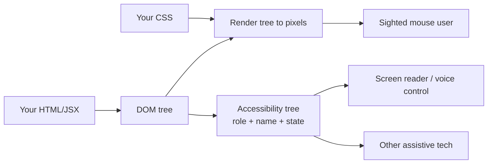

# Accessibility as a baseline

## Why this matters

It's a Tuesday afternoon and a support ticket comes in from a customer's procurement office: their accessibility auditor flagged your checkout flow as non-compliant, and the renewal — a six-figure contract — is now contingent on a remediation plan within thirty days. You open the page, everything looks fine, you click around with a mouse and it all works. Then you unplug your mouse and try to complete the purchase with only the keyboard. You can't. The "Confirm order" button is a `<div onClick>` that the Tab key skips entirely. The address modal traps nothing and dismisses nothing; pressing Escape does nothing, and Tab walks focus out the back of the dialog into the page behind it. A screen reader announces the whole thing as "clickable, clickable, clickable."

None of this showed up in your tests because your tests drive the DOM the same way your mouse does. The auditor drove it the way a blind user does, and from that angle your app is a wall. Now you're retrofitting accessibility under a deadline, which is the most expensive possible time to do it — every fix is a regression risk against code that was never built to support keyboard or assistive-technology users in the first place.

The thing that would have prevented this isn't heroics. It's a baseline: semantic HTML by default, ARIA only to fill genuine gaps, keyboard operability as a hard requirement, and an automated check in CI that fails the build on contrast and role violations. The WHO estimates that more than one in six people worldwide live with a significant disability ([WHO, Disability fact sheet](https://www.who.int/news-room/fact-sheets/detail/disability-and-health)), and the same baseline that serves them also makes your UI more robust for everyone: keyboard users, voice-control users, people on a flaky connection where images haven't loaded, and the future you who has to script against a sane DOM. Accessibility is not a feature you bolt on. It's a property of code written correctly the first time.

## Mental model

The single most useful idea in web accessibility is the **accessibility tree** — a parallel structure the browser derives from your DOM and hands to assistive technology. A screen reader does not see your CSS or your pixels. It walks this tree, and for each node it can answer three questions: what is it (its **role**), what is it called (its **accessible name**), and what state is it in (**properties** like `expanded`, `checked`, `disabled`).

When you write `<button>Save</button>`, the browser fills in all three for free: role `button`, name "Save", and the right keyboard and focus behavior. When you write `<div onClick>Save</div>`, the accessibility tree gets a generic node with no role, no name, and no keyboard handling. ARIA is the API for patching the tree when no native element exists — but every attribute you add is a manual promise you now have to keep in sync with reality.



Two laws follow from this picture, and they order everything else in the chapter.

**Use the platform first.** Native elements (`button`, `a[href]`, `input`, `select`, `dialog`, `nav`, `main`) come with correct roles, names, focus behavior, and keyboard handling built in. The [first rule of ARIA](https://www.w3.org/TR/using-aria/#firstrule) is to not use ARIA: if a native element does the job, use it. ARIA changes how an element is *reported* to assistive tech, but it never adds *behavior* — `role="button"` on a `div` does not make Enter or Space activate it, and it does not make the element focusable. You have to add all of that yourself, correctly, forever.

**Manage focus deliberately.** Focus is the keyboard user's cursor. Where it is, what moves it, and what happens when UI appears and disappears is something you are responsible for the moment you build anything more dynamic than a static page. Most serious accessibility bugs are focus bugs.

## In practice

### Start from semantic HTML

Before any framework, the highest-leverage move is choosing the right element. Here is the same UI written twice.

```html
<!-- Wrong: a div soup that looks right and reads as nothing -->
<div class="nav">
  <div class="link" onclick="go('/home')">Home</div>
  <div class="link" onclick="go('/pricing')">Pricing</div>
</div>
<div class="card">
  <div class="title">Acme Pro</div>
  <div class="btn" onclick="subscribe()">Subscribe</div>
</div>
```

```html
<!-- Right: the platform does the accessibility work for you -->
<nav aria-label="Primary">
  <a href="/home">Home</a>
  <a href="/pricing">Pricing</a>
</nav>
<section class="card" aria-labelledby="plan-title">
  <h2 id="plan-title">Acme Pro</h2>
  <button type="button" onclick="subscribe()">Subscribe</button>
</section>
```

The right version is keyboard-operable, announces landmarks and headings for navigation, and exposes correct roles — with zero ARIA except one label to disambiguate a nav landmark. The wrong version needs `tabindex`, `role`, key handlers, and focus styles bolted onto every node to reach the same place, and it will drift.

### Names come from content, then attributes

An interactive element needs an accessible name. The browser computes it through the [accessible name algorithm](https://www.w3.org/TR/accname-1.2/), roughly in this priority: `aria-labelledby` → `aria-label` → element content/`alt`/`<label>` → `title`. Prefer visible text. An icon-only button is the classic offender:

```tsx
// Wrong: screen reader announces "button" with no name
<button onClick={close}><XIcon /></button>

// Right: a programmatic name; the icon is hidden from the tree
<button onClick={close} aria-label="Close dialog">
  <XIcon aria-hidden="true" />
</button>
```

For form fields, associate a real `<label>`. Placeholder text is not a label — it vanishes on input and fails contrast.

```tsx
// Right: htmlFor ties the label to the input's id
<label htmlFor="email">Work email</label>
<input id="email" type="email" name="email" autoComplete="email" />
```

### The inaccessible modal

Modals are where accessibility goes to die, so they are the best teaching case. Here is one that looks and demos perfectly.

```tsx
// Wrong: keyboard users are stuck, screen readers announce nothing
function Modal({ open, onClose, children }: ModalProps) {
  if (!open) return null;
  return (
    <div className="overlay" onClick={onClose}>
      <div className="dialog">
        {children}
        <div className="close" onClick={onClose}>×</div>
      </div>
    </div>
  );
}
```

Count the failures. The dialog has no role, so a screen reader does not announce it as a dialog. Opening it does not move focus, so a keyboard user is still focused on the trigger behind the now-covered page. Tab walks focus straight out of the dialog into the background content, which is still in the tab order and still readable by assistive tech. Escape does nothing. The close affordance is a `div`, unreachable by keyboard. On close, focus is not restored, so the keyboard user is dumped at the top of the document.

### The accessible modal

The [WAI-ARIA Authoring Practices dialog pattern](https://www.w3.org/WAI/ARIA/apg/patterns/dialog-modal/) defines the contract. The native `<dialog>` element now implements most of it for you — `showModal()` gives you a top layer, a backdrop, Escape-to-close, and an inert background automatically. Build on it.

```tsx
import { useEffect, useRef } from "react";

interface ModalProps {
  open: boolean;
  onClose: () => void;
  titleId: string;
  children: React.ReactNode;
}

export function Modal({ open, onClose, titleId, children }: ModalProps) {
  const dialogRef = useRef<HTMLDialogElement>(null);
  const previouslyFocused = useRef<HTMLElement | null>(null);

  useEffect(() => {
    const el = dialogRef.current;
    if (!el) return;
    if (open && !el.open) {
      // Remember where focus was so we can restore it on close.
      previouslyFocused.current = document.activeElement as HTMLElement;
      el.showModal(); // top layer + backdrop + Escape + inert background
    } else if (!open && el.open) {
      el.close();
    }
  }, [open]);

  return (
    <dialog
      ref={dialogRef}
      aria-labelledby={titleId}
      onClose={onClose}                 // fires on Escape and on close()
      onClick={(e) => {                 // click on backdrop = close
        if (e.target === dialogRef.current) onClose();
      }}
      // Restore focus to the trigger when the dialog unmounts/closes.
      onTransitionEnd={() => {
        if (!open) previouslyFocused.current?.focus();
      }}
    >
      <div className="dialog-body">{children}</div>
    </dialog>
  );
}
```

```tsx
// Usage: the heading provides the accessible name via aria-labelledby
function DeleteConfirm({ open, onClose, onConfirm }: ConfirmProps) {
  return (
    <Modal open={open} onClose={onClose} titleId="delete-title">
      <h2 id="delete-title">Delete project?</h2>
      <p>This permanently removes the project and all its data.</p>
      <button type="button" onClick={onClose}>Cancel</button>
      <button type="button" onClick={onConfirm}>Delete</button>
    </Modal>
  );
}
```

What `<dialog open>` plus `showModal()` buys you, that the bad version lacked: the role `dialog` with `aria-modal` semantics, a focus trap (Tab cycles within the dialog), background content marked inert (unreachable by keyboard or screen reader), Escape-to-close, and focus moved into the dialog on open. The two things the platform does *not* do reliably and you must own are restoring focus to the trigger on close (handled above) and giving the dialog an accessible name (`aria-labelledby` pointing at the heading).

If you must support an environment without `<dialog>`, or you need fine-grained focus control, reach for a vetted primitive — [Radix UI Dialog](https://www.radix-ui.com/primitives/docs/components/dialog) or [React Aria](https://react-spectrum.adobe.com/react-aria/Dialog.html) implement the full APG pattern, including focus return and scroll locking, so you are not hand-rolling a focus trap. Hand-rolled focus traps are a common source of subtle bugs; use a library unless you have a strong reason not to.

### Keyboard and focus, beyond modals

Three rules cover the bulk of day-to-day work.

```css
/* Wrong: the single most damaging line of CSS for accessibility.
   It removes the only signal keyboard users have for where they are. */
:focus { outline: none; }

/* Right: keep a visible indicator, and use :focus-visible so it
   shows for keyboard focus but not on every mouse click. */
:focus-visible {
  outline: 3px solid #2563eb;
  outline-offset: 2px;
}
```

Never put `tabindex` greater than zero on anything — it overrides document order and creates an unmaintainable tab sequence. Use `tabindex="0"` to make a custom widget focusable and `tabindex="-1"` to make an element programmatically focusable (so you can `.focus()` it) without inserting it into the tab order. And provide a skip link as the first focusable element on the page so keyboard users can jump past the nav:

```html
<a href="#main" class="skip-link">Skip to content</a>
<!-- ...nav... -->
<main id="main" tabindex="-1">...</main>
```

### Color contrast

[WCAG 2.2](https://www.w3.org/TR/WCAG22/) requires a contrast ratio of at least 4.5:1 for normal text and 3:1 for large text (level AA), and 3:1 for the visual boundaries of interactive components and meaningful graphics. The trap is light-gray placeholder and "secondary" text that designers love and low-vision users cannot read. Check it in the browser DevTools color picker, which shows the ratio and the AA/AAA thresholds inline, and never rely on color *alone* to convey meaning — a red border on an invalid field must be paired with text or an icon for users who can't distinguish the color.

### Testing with axe

Automated tooling catches a meaningful slice of issues — missing names, bad contrast, invalid ARIA, duplicate ids — and it belongs in CI. The [axe-core](https://github.com/dequelabs/axe-core) engine is the de-facto standard and ships in `jest-axe`, `@axe-core/playwright`, and the browser DevTools.

```tsx
import { render } from "@testing-library/react";
import { axe } from "jest-axe";
import { DeleteConfirm } from "./DeleteConfirm";

test("delete dialog has no axe violations", async () => {
  const { container } = render(
    <DeleteConfirm open onClose={() => {}} onConfirm={() => {}} />,
  );
  expect(await axe(container)).toHaveNoViolations();
});
```

Run it across real flows in end-to-end tests too:

```ts
import AxeBuilder from "@axe-core/playwright";
import { test, expect } from "@playwright/test";

test("checkout page meets WCAG AA", async ({ page }) => {
  await page.goto("/checkout");
  const results = await new AxeBuilder({ page })
    .withTags(["wcag2a", "wcag2aa"])
    .analyze();
  expect(results.violations).toEqual([]);
});
```

Be clear-eyed about the ceiling: automated engines catch only a fraction of real accessibility problems — the missing-name, bad-contrast, invalid-ARIA class — and the remainder requires human judgment. Automation cannot tell you whether your focus order makes sense, whether your alt text is *meaningful*, or whether a screen reader user can actually complete the task. That remainder comes from two cheap practices: tab through every new feature with no mouse, and listen to it once with a real screen reader — VoiceOver on macOS (Cmd+F5), NVDA on Windows (free), or TalkBack on Android. The [axe-core rule descriptions](https://github.com/dequelabs/axe-core/blob/develop/doc/rule-descriptions.md) are the honest, current list of what the engine does and does not check.

> Connect the dots: The accessibility tree is to assistive technology what a well-designed API is to a client — a stable, semantic contract independent of presentation. The same `getByRole` queries that Testing Library encourages (Part 4, "React deeply") are accessibility queries: if your test can't find a button by its role and name, neither can a screen reader. Writing accessible markup and writing testable markup are the same act.

> Security note: ARIA live regions (`aria-live`, `role="alert"`) announce dynamic content to screen readers, and they will faithfully read out whatever you inject. If you pipe unsanitized user input or third-party content into a live region — or anywhere in the DOM — you have both an XSS vector and an avenue for announcing attacker-controlled text to users who can't see the screen to judge it. Sanitize content destined for the accessibility tree with the same rigor as content destined for the screen; the two share a DOM.

## Pitfalls and anti-patterns

**1. Div-as-button (the role/behavior gap).** *Recognize it* when an interactive element is a `div` or `span` with an `onClick` and no `tabindex`, `role`, or key handler — Tab skips it and screen readers call it nothing. Adding `role="button"` is worse than useless because it now *claims* to be a button while still ignoring Enter and Space. *Fix it* by using `<button type="button">`. If you genuinely cannot, you owe `role="button"`, `tabindex="0"`, and `onKeyDown` handling both Enter and Space — which is exactly the work the native element did for free.

**2. The focus blackout.** *Recognize it* by tabbing through the page and watching for the moment you can't tell where you are — almost always caused by a global `outline: none` or by UI that appears (modal, menu, toast) without moving focus into it, or disappears without restoring focus. *Fix it* with `:focus-visible` styles you never remove, and explicit focus management: move focus into new UI on open, restore it to the trigger on close.

**3. ARIA that lies.** *Recognize it* when an attribute asserts a state the DOM doesn't actually maintain — `aria-expanded="false"` that never flips to `true`, `aria-checked` on a control whose visual state changes independently, a `role="tablist"` with none of the arrow-key behavior the tab pattern requires. A screen reader reports the attribute, not the reality, so the user is actively misled. *Fix it* by treating every ARIA attribute as state you must drive from the same source of truth as the visuals — or by deleting the ARIA and using a native element or a vetted component that keeps them in sync.

**4. Inaccessible names and label drift.** *Recognize it* by running axe or tabbing with a screen reader and hearing "button," "link," or "edit text" with no name — icon-only controls, inputs labeled only by placeholder, or buttons whose visible text ("Read more," "Edit") repeats a dozen times with no context. *Fix it* with visible `<label>`s, `aria-label` for icon-only controls, and `aria-labelledby`/`aria-describedby` to compose names from existing text rather than duplicating strings that will drift.

**5. The keyboard trap.** *Recognize it* when Tab gets *stuck* — focus enters a widget (a date picker, an embedded editor, a custom menu) and can never leave by keyboard. This is the inverse of the focus blackout and a WCAG level-A failure on its own. *Fix it* by ensuring every focus container has a defined exit (Escape, or Tab cycling to a close control), and prefer the native `<dialog>` or a library focus trap that the user can always escape.

## Production checklist

- [ ] Every interactive control is a native element (`button`, `a[href]`, `input`, `select`) or a vetted primitive — no `div`/`span` with bare `onClick`
- [ ] The entire app is operable with keyboard only: Tab order is logical, nothing is unreachable, nothing is a trap
- [ ] A visible `:focus-visible` indicator exists everywhere; no global `outline: none`
- [ ] Every page has one `<main>`, a logical heading outline (one `h1`, no skipped levels), and landmark elements (`nav`, `header`, `footer`)
- [ ] A skip link is the first focusable element
- [ ] Dialogs/menus/popovers move focus in on open, trap focus while open, close on Escape, and restore focus to the trigger on close
- [ ] Every form control has an associated `<label>`; errors are conveyed by text, not color alone, and linked via `aria-describedby`
- [ ] All meaningful images have `alt`; decorative images have `alt=""`; icon-only buttons have `aria-label`
- [ ] Text meets WCAG AA contrast (4.5:1 normal, 3:1 large); UI boundaries meet 3:1
- [ ] `prefers-reduced-motion` is honored for non-essential animation
- [ ] `jest-axe`/`@axe-core/playwright` runs in CI and fails the build on violations
- [ ] At least one manual keyboard pass and one screen-reader pass per significant feature

## Exercises

1. **(Comprehension)** Open any page you own in Chrome DevTools, select an icon-only button in the Elements panel, and read its entry in the Accessibility pane. Identify its computed role, accessible name, and the source of that name. Then change the button to use `aria-label` and confirm the name updates in the tree. Explain, in one sentence, why the rendered pixels are irrelevant to what the screen reader announces.

2. **(Applied)** Take the inaccessible `Modal` from this chapter and rebuild it on the native `<dialog>` element so that: opening moves focus inside, Tab is trapped, Escape closes it, and closing returns focus to the trigger button. Write a `jest-axe` test that asserts zero violations and a Testing Library test that opens the dialog, tabs to the confirm button, activates it with the keyboard, and asserts focus returns to the trigger.

3. **(Design)** Your team is shipping a new design system used by forty downstream apps. Design an accessibility strategy that makes the *correct* thing the *easy* thing: which components encapsulate focus management and ARIA so app teams can't get it wrong, what you enforce in CI versus what requires manual review, and how you'd budget the irreducible manual screen-reader testing. Name the one check you'd make a hard merge-blocker and defend it.

## Further reading

- [WCAG 2.2](https://www.w3.org/TR/WCAG22/) — the W3C Recommendation defining the conformance levels (A, AA, AAA) you'll be measured against; read the "Understanding" docs alongside the success criteria
- [WAI-ARIA Authoring Practices Guide](https://www.w3.org/WAI/ARIA/apg/) — the canonical patterns (dialog, menu, combobox, tabs) with required keyboard interactions; implement from these, not from blog posts
- [Using ARIA](https://www.w3.org/TR/using-aria/) — the five rules of ARIA, starting with "don't use ARIA," straight from the source
- [Accessible Name and Description Computation 1.2](https://www.w3.org/TR/accname-1.2/) — exactly how the browser derives an element's accessible name; demystifies most "why is it announced like that?" questions
- [MDN: ARIA](https://developer.mozilla.org/en-US/docs/Web/Accessibility/ARIA) and [MDN: `<dialog>`](https://developer.mozilla.org/en-US/docs/Web/HTML/Element/dialog) — practical, current reference for roles, states, and the native dialog
- [axe-core rules](https://github.com/dequelabs/axe-core/blob/develop/doc/rule-descriptions.md) — the full list of what automated testing can and cannot catch, with the honest coverage caveat
