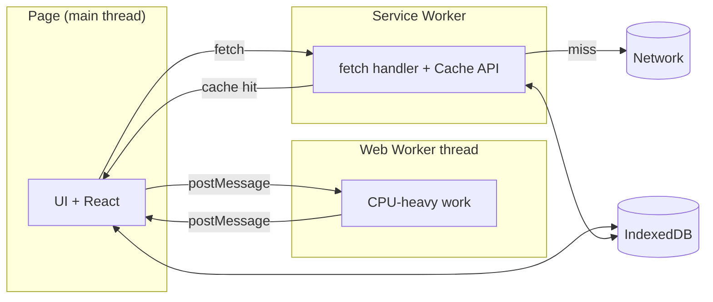

# Browser APIs, build tooling, and PWAs

## Why this matters

It's a Tuesday afternoon and a field technician using your company's inspection app is standing in a concrete parking garage with no signal. They tap "Save report," the spinner spins, and then the whole thing white-screens. Their last forty minutes of photos and notes are gone. The bug report that lands in your queue says, simply: "App lost my data again." You can't reproduce it on office wifi.

The root cause is that your app assumed the network was always there. Every save was a `fetch` to `/api/reports` with no fallback. The moment connectivity dropped, the request hung, the promise rejected, and your error boundary tore down the component tree along with all its in-memory state. None of this is exotic. It's the default behavior of an app built as if the browser were a thin terminal to your server.

The platform has had the tools to prevent this for a decade. A service worker can intercept that failed request and queue it. IndexedDB can persist the draft to disk so a white-screen costs nothing. A Web Worker can do the image compression that was freezing the main thread and triggering the user's rage-taps in the first place. This chapter is about the browser APIs that turn a web page into an application that survives a flaky network, and the build tooling that ships them without bloating your bundle. The gap between "web page" and "app" is almost entirely these APIs, and most engineers never learn them because the frameworks hide them until the day they can't.

## Mental model

A modern web app runs across several execution contexts, not one. The page's JavaScript runs on the **main thread**, which also does layout, paint, and input handling — block it and the UI freezes. A **Web Worker** is a separate thread for CPU work with no DOM access. A **service worker** is a third context entirely: a programmable proxy that sits between your page and the network, runs even when no tab is open, and can be killed and restarted by the browser at will. Persistent state that must survive a reload lives in **IndexedDB**, a transactional object store on disk. The mental shift is from "my code and my data live in one place" to "my code runs in several sandboxes that communicate by passing messages, and my data lives in a database the browser owns."



Two things follow from this picture. First, the service worker is the only piece that can answer a `fetch` when the network is down, which is why offline-first always routes through it. Second, both the page and the service worker can reach IndexedDB, so it's the natural handoff point for queued writes: the page enqueues a draft, the service worker drains the queue when connectivity returns. The contexts don't share memory; they share the database and exchange messages. This is the single most important consequence of the architecture — when you find yourself wanting to "pass an object" from the page to the worker, the answer is almost always "write it to IndexedDB and signal the worker," not "serialize it across `postMessage` and hope the worker is still alive."

A **Progressive Web App (PWA)** is not a separate technology. It's a web app that meets three conditions: it's served over HTTPS, it ships a [web app manifest](https://developer.mozilla.org/en-US/docs/Web/Manifest) so it can be installed to the home screen, and it registers a service worker so it works offline. There's no SDK to import. PWA is a label for an app that uses these platform primitives correctly.

## In practice

### Registering a service worker and caching the app shell

The service worker lifecycle has three events you care about: `install` (precache the static assets your app needs to boot), `activate` (clean up old caches), and `fetch` (decide how to answer every request). Between `install` and `activate` there is a **waiting** state that trips up almost everyone the first time: a freshly installed worker will not take over from the currently controlling one until every tab using the old worker is closed, unless you explicitly call `skipWaiting()`. That waiting state is not a bug — it's the browser protecting open tabs from a mid-session code swap — but it is the mechanism behind the version-skew problems later in this chapter, so hold onto it. The wrong instinct is to cache everything with one strategy. The right instinct is to match strategy to resource type.

```ts
// sw.ts — compiled to /sw.js and served from the origin root
/// <reference lib="webworker" />
declare const self: ServiceWorkerGlobalScope;

const VERSION = "v3";
const SHELL = `shell-${VERSION}`;
const SHELL_ASSETS = ["/", "/index.html", "/app.css", "/app.js", "/offline.html"];

self.addEventListener("install", (event) => {
  // Precache the app shell so the app boots with zero network.
  event.waitUntil(
    caches.open(SHELL).then((cache) => cache.addAll(SHELL_ASSETS)),
  );
  self.skipWaiting(); // activate this version immediately
});

self.addEventListener("activate", (event) => {
  // Drop caches from previous versions.
  event.waitUntil(
    caches.keys().then((keys) =>
      Promise.all(
        keys.filter((k) => k !== SHELL).map((k) => caches.delete(k)),
      ),
    ).then(() => self.clients.claim()),
  );
});

self.addEventListener("fetch", (event) => {
  const { request } = event;
  if (request.method !== "GET") return; // never cache mutations

  const url = new URL(request.url);

  // Strategy 1: navigation requests -> network-first, fall back to shell.
  if (request.mode === "navigate") {
    event.respondWith(
      fetch(request).catch(() => caches.match("/offline.html") as Promise<Response>),
    );
    return;
  }

  // Strategy 2: hashed static assets -> cache-first (they're immutable).
  if (url.pathname.startsWith("/assets/")) {
    event.respondWith(
      caches.match(request).then((hit) => hit ?? fetchAndCache(request, SHELL)),
    );
    return;
  }

  // Strategy 3: API GETs -> stale-while-revalidate.
  if (url.pathname.startsWith("/api/")) {
    event.respondWith(staleWhileRevalidate(request));
  }
});

async function fetchAndCache(request: Request, cacheName: string): Promise<Response> {
  const res = await fetch(request);
  const cache = await caches.open(cacheName);
  cache.put(request, res.clone());
  return res;
}

async function staleWhileRevalidate(request: Request): Promise<Response> {
  const cache = await caches.open(`api-${VERSION}`);
  const cached = await cache.match(request);
  const network = fetch(request).then((res) => {
    cache.put(request, res.clone());
    return res;
  });
  return cached ?? network; // serve cache instantly, refresh in background
}
```

Registration from the page is one line, but guard it — service workers only run on HTTPS (or `localhost`):

```ts
if ("serviceWorker" in navigator) {
  window.addEventListener("load", () => {
    navigator.serviceWorker.register("/sw.js", { scope: "/" });
  });
}
```

The three strategies above are the canonical ones, and the names come from Google's Workbox project. Cache-first for immutable hashed assets (`app.4f2a8b.js` never changes content), network-first for navigations (you want fresh HTML, but a cached shell beats a dinosaur), and stale-while-revalidate for API reads where instant-but-slightly-stale is better than a spinner. In production, prefer [Workbox](https://developer.chrome.com/docs/workbox) over hand-rolling this — it handles cache expiration, precache manifests, and the dozens of edge cases (range requests, opaque responses, navigation preload) that the snippet above glosses over.

### Persisting drafts with IndexedDB

IndexedDB's raw API is callback-based and unpleasant. Use [`idb`](https://github.com/jakearchibald/idb), a tiny promise wrapper by Jake Archibald (the same author whose offline cookbook this chapter draws on). Here's the draft-saving the parking-garage scenario needed:

```ts
import { openDB, type DBSchema } from "idb";

interface ReportDB extends DBSchema {
  drafts: {
    key: string;
    // synced is 0 | 1, not a boolean — see the note below.
    value: { id: string; body: unknown; updatedAt: number; synced: 0 | 1 };
    indexes: { "by-synced": "synced" };
  };
}

const db = await openDB<ReportDB>("reports", 1, {
  upgrade(db) {
    const store = db.createObjectStore("drafts", { keyPath: "id" });
    store.createIndex("by-synced", "synced");
  },
});

// Save on every keystroke (debounced) — survives a crash or offline white-screen.
export async function saveDraft(id: string, body: unknown) {
  await db.put("drafts", { id, body, updatedAt: Date.now(), synced: 0 });
}

// On reconnect, drain everything not yet synced.
export async function flushDrafts() {
  const pending = await db.getAllFromIndex("drafts", "by-synced", IDBKeyRange.only(0));
  for (const draft of pending) {
    const res = await fetch("/api/reports", {
      method: "POST",
      headers: { "Content-Type": "application/json" },
      body: JSON.stringify(draft.body),
    });
    if (res.ok) await db.put("drafts", { ...draft, synced: 1 });
  }
}
```

A subtle gotcha lives in that schema. IndexedDB index entries must be valid keys, and a JavaScript boolean is not one. If you index a raw `synced: boolean`, the browser either throws on `put` or silently fails to populate the index — and you discover it only when `flushDrafts` queries `by-synced` and finds nothing to flush, even though the drafts are sitting right there. Store the flag as `0 | 1`, index that, and query the pending set with `IDBKeyRange.only(0)`. The same rule rules out `undefined`, `Date` objects with invalid times, and plain objects as keys; when in doubt, key on a string or a number.

Pair this with the [Background Sync API](https://developer.mozilla.org/en-US/docs/Web/API/Background_Synchronization_API) so the browser calls `flushDrafts` for you when connectivity returns, even if the user closed the tab. The page registers a sync tag; the service worker listens for it:

```ts
// In the page, when a save fails offline:
const reg = await navigator.serviceWorker.ready;
await reg.sync.register("flush-drafts");

// In sw.ts:
self.addEventListener("sync", (event) => {
  if (event.tag === "flush-drafts") event.waitUntil(flushDrafts());
});
```

### Moving CPU work off the main thread

The image compression that froze the UI belongs in a Web Worker. Anything that runs longer than a frame budget (roughly 16ms at 60fps) and isn't waiting on I/O is a candidate: parsing large JSON, diffing, crypto, image and video processing.

```ts
// worker.ts
self.onmessage = async (e: MessageEvent<{ file: File }>) => {
  const bitmap = await createImageBitmap(e.data.file);
  const canvas = new OffscreenCanvas(bitmap.width / 2, bitmap.height / 2);
  canvas.getContext("2d")!.drawImage(bitmap, 0, 0, canvas.width, canvas.height);
  const blob = await canvas.convertToBlob({ type: "image/webp", quality: 0.8 });
  // Transfer ownership of the buffer instead of copying it.
  const buf = await blob.arrayBuffer();
  (self as unknown as Worker).postMessage({ buf }, [buf]);
};
```

```ts
// In the page — modern bundlers understand this URL form natively:
const worker = new Worker(new URL("./worker.ts", import.meta.url), { type: "module" });
worker.postMessage({ file });
worker.onmessage = (e) => uploadCompressed(e.data.buf);
```

The `[buf]` second argument to `postMessage` is a **transferable** — it hands the underlying memory to the other thread with zero copy, instead of structured-cloning a multi-megabyte buffer. Forgetting it is the difference between a worker that helps and one that just moves the jank.

### Build tooling: why the bundler matters here

All of the above ships through a bundler, and the bundler choice affects how painless it is. The 2026 landscape has consolidated around a few tools, and the dividing line is the language they're written in.

| Tool | Built on | Best for | Notes |
|---|---|---|---|
| **Vite** | esbuild (dev) + Rollup (prod) | SPAs, libraries, anything not Next.js | Native `import.meta.url` worker support, first-class `vite-plugin-pwa` |
| **esbuild** | Go | Raw speed, simple builds | The fast core inside many other tools; thin on code-splitting nuance |
| **Turbopack** | Rust | Next.js apps | Default bundler in Next.js; incremental, function-level caching |
| **Rolldown** | Rust | Vite's future production path | Rollup-compatible, folding esbuild+Rollup into one Rust engine |

The trend is unambiguous: bundlers are being rewritten from JavaScript into Go and Rust because the bottleneck is no longer features, it's wall-clock build time on large apps. esbuild ([written in Go](https://esbuild.github.io/)) made the case that a bundler could be dramatically faster than the JavaScript-based tools that preceded it — its own [published benchmarks](https://esbuild.github.io/faq/#why-is-esbuild-fast) show order-of-magnitude differences on large inputs, though your mileage depends heavily on the project. Vite adopted esbuild for dev and Rollup for production; Turbopack and Rolldown are the Rust generation closing the dev/prod consistency gap.

For a service-worker PWA, the practical recommendation is **Vite with `vite-plugin-pwa`**, which wraps Workbox and auto-generates your precache manifest from the build output (so hashed filenames stay in sync with what the service worker caches — a thing that is genuinely painful to maintain by hand):

```ts
// vite.config.ts
import { defineConfig } from "vite";
import { VitePWA } from "vite-plugin-pwa";

export default defineConfig({
  plugins: [
    VitePWA({
      registerType: "autoUpdate",
      workbox: {
        // Workbox generates the precache list from build output automatically.
        globPatterns: ["**/*.{js,css,html,svg,woff2}"],
        runtimeCaching: [
          {
            urlPattern: ({ url }) => url.pathname.startsWith("/api/"),
            handler: "StaleWhileRevalidate",
            options: { cacheName: "api", expiration: { maxEntries: 100 } },
          },
        ],
      },
      manifest: {
        name: "Field Inspection",
        short_name: "Inspect",
        start_url: "/",
        display: "standalone",
        background_color: "#ffffff",
        icons: [{ src: "/icon-512.png", sizes: "512x512", type: "image/png" }],
      },
    }),
  ],
});
```

If you're on Next.js, Turbopack is the bundler and `serwist` (the maintained Workbox successor for Next) is the equivalent integration.

> **Connect the dots:** The stale-while-revalidate strategy here is the same caching pattern you'll meet at the CDN and server layers in Part 3 (Next.js caching) and Part 5 (backend caching with Redis). "Serve a cached value instantly, refresh in the background, converge to fresh" is one idea applied at three layers of the stack. Learn it once at the service-worker boundary and it transfers up.

> **Security note:** A service worker is a programmable proxy for every request on its scope, which makes it a high-value target. Three rules keep it from becoming a foothold. First, it only runs over HTTPS for a reason — a network attacker who could inject a worker over plain HTTP would control every future request, so never relax that, even in staging. Second, scope it tightly: a worker registered at the origin root controls the whole origin, so serve `sw.js` from the narrowest path that covers your app and set its `scope` explicitly. Third, treat anything in IndexedDB or the Cache API as readable by any script on your origin — an XSS bug now also leaks whatever auth tokens or personal data you cached offline. Prefer short-lived tokens, never `cache.put` another origin's responses unless they're deliberately public, and keep the `res.type !== "opaque"` guard so a cross-origin response can't poison your cache.

## Pitfalls and anti-patterns

**1. The stuck-on-old-version trap.** A user loads your app, your service worker caches the shell, then you deploy a fix — and they keep seeing the broken version for days because the cached shell never updates. This happens when you cache-first your HTML and don't handle the waiting worker. Recognize it when bug reports describe behavior you already fixed. Fix it by using network-first (or stale-while-revalidate) for navigation requests, calling `skipWaiting()` plus `clients.claim()`, and showing a "New version available — reload" prompt when a new worker reaches the `waiting` state. Never cache-first your HTML.

**2. Caching POST requests or error responses.** A `fetch` handler that caches indiscriminately will happily store a `500`, a `401`, or the response to a mutation, then serve that garbage forever. Recognize it when users see stale or wrong data that no reload fixes. Fix it by guarding: only handle `GET`, and only `cache.put` responses where `res.ok` is true and the status isn't opaque (`res.type !== "opaque"` unless you deliberately want cross-origin caching).

**3. Treating the service worker like a long-lived server.** The browser kills idle service workers and restarts them on the next event. Any state held in a module-level variable is gone on restart. Recognize it as "my in-memory counter / auth token / queue keeps resetting." Fix it by treating the worker as stateless between events and persisting everything that must survive in IndexedDB or the Cache API. The worker is an event handler, not a daemon.

**4. Blocking the main thread and calling it a Web Worker.** Spawning a worker but then doing the heavy lifting on the main thread anyway — or copying a huge payload across `postMessage` without using transferables — gives you all the complexity of threads and none of the benefit. Recognize it with the Performance panel: long tasks still appear on the main thread. Fix it by moving the actual computation into the worker and transferring `ArrayBuffer`s instead of cloning them.

**5. Unbounded IndexedDB and cache growth.** Caches and object stores grow until the browser evicts your origin's storage entirely — silently, often at the worst time. Recognize it via `navigator.storage.estimate()` creeping toward quota. Fix it by setting expiration on runtime caches (Workbox `expiration.maxEntries` / `maxAgeSeconds`), pruning synced drafts, and calling `navigator.storage.persist()` for data you genuinely can't afford to lose so the browser deprioritizes evicting you.

## Production checklist

- [ ] Service worker served from origin root with correct scope, over HTTPS
- [ ] Navigation requests use network-first or stale-while-revalidate — never cache-first for HTML
- [ ] `fetch` handler ignores non-GET methods and never caches non-`ok` or opaque responses
- [ ] Cache versioning with cleanup of old caches in the `activate` event
- [ ] "New version available, reload" UX wired to the `waiting` service worker
- [ ] Offline fallback page precached and served on navigation failure
- [ ] All long-running CPU work (>16ms) moved to a Web Worker, with transferables for large buffers
- [ ] Drafts/mutations persisted to IndexedDB before the network call; reconciled on reconnect
- [ ] Background Sync registered for queued writes where supported
- [ ] Runtime caches have expiration limits; `navigator.storage.persist()` requested for critical data
- [ ] Web app manifest with name, icons (192 + 512), `start_url`, `display: standalone`
- [ ] Lighthouse PWA + Best Practices audit run in CI as a gate
- [ ] Precache manifest generated by the build (Workbox/serwist), not maintained by hand

## Exercises

1. **(Comprehension)** Given the three caching strategies in this chapter (cache-first, network-first, stale-while-revalidate), classify each of the following and justify it in one sentence: a hashed JS chunk `app.4f2a.js`, the `/` navigation, a `GET /api/profile` call, a logged-in user's avatar served from a third-party CDN. Which one is most likely to cause a "stuck on old version" bug if you pick wrong?

2. **(Applied)** Build a minimal offline note-taker with Vite + `vite-plugin-pwa`. Notes save to IndexedDB on every keystroke (debounced 300ms) and POST to a mock `/api/notes` when online. Use Chrome DevTools' Network "Offline" throttle to verify a note created offline survives a reload and syncs once you go back online via Background Sync. Confirm with `navigator.storage.estimate()` that you're cleaning up synced notes.

3. **(Design)** You're adding offline support to a collaborative document editor where two users may edit the same paragraph while both offline, then reconnect. The queue-and-replay approach in this chapter assumes last-write-wins, which would silently destroy one user's edits. Sketch a conflict-resolution design: where would you store the pending operations, what metadata would each operation carry, and would you reach for CRDTs, operational transforms, or a server-authoritative merge? Name the tradeoff you're most worried about.

## Further reading

- MDN, [Service Worker API](https://developer.mozilla.org/en-US/docs/Web/API/Service_Worker_API) and [Using IndexedDB](https://developer.mozilla.org/en-US/docs/Web/API/IndexedDB_API/Using_IndexedDB) — the canonical platform references
- Jake Archibald, [The offline cookbook](https://web.dev/articles/offline-cookbook) — the original taxonomy of caching strategies, still the clearest treatment
- [Workbox documentation](https://developer.chrome.com/docs/workbox) — production-grade service worker tooling and the strategies named in this chapter
- [esbuild architecture notes](https://esbuild.github.io/faq/#why-is-esbuild-fast) — why rewriting bundlers in Go/Rust changed the build-time game
- W3C, [Service Workers specification](https://www.w3.org/TR/service-workers/) — the precise lifecycle and event semantics when MDN isn't enough
- [`vite-plugin-pwa` guide](https://vite-pwa-org.netlify.app/) — the integration that keeps your precache manifest honest across builds
