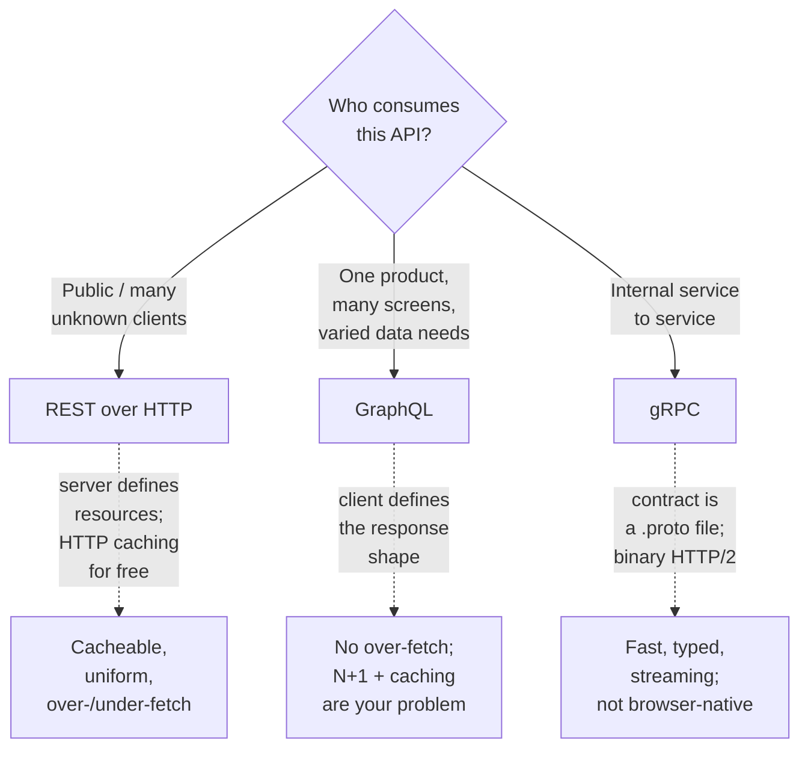

# API design: REST, GraphQL, and gRPC

## Why this matters

It's a Tuesday afternoon and the mobile team is on the phone. Their app feels slow on the profile screen, and they've traced it to your API: rendering one screen takes eleven HTTP round trips. `GET /users/42`, then `GET /users/42/posts`, then a `GET /posts/{id}/comments` for each of the five posts, then `GET /users/42/followers?count=true`. On a 4G connection with 120ms of latency each, that's over a second of waiting before a single pixel renders. The backend is fast; the *shape* of the API is the problem.

So someone proposes "let's just add an endpoint that returns everything." Now you have `GET /users/42/profile-screen`, a bespoke blob that serves exactly one screen of one client. Next sprint the web team needs a slightly different blob, and the Android team needs a third. Six months later you have forty screen-shaped endpoints, each with its own caching rules, each subtly out of sync, and nobody dares delete any of them because nobody knows who still calls them.

This is the cost of treating API design as an afterthought. The protocol you pick — and how well you use it — determines your round-trip count, your cache hit rate, how clients break when you change a field, and whether two services can talk without a 2 a.m. incident over a mismatched JSON shape. REST, GraphQL, and gRPC are three different answers to "how do two programs agree on what to send each other," and each is correct for a different problem. Knowing which is which is one of the highest-leverage decisions you make as a backend engineer.

## Mental model

Strip away the marketing and the three approaches differ on two axes: **who decides the shape of the response**, and **how strongly the contract is enforced**.



**REST** models the world as *resources* with stable URLs, manipulated through a small fixed verb set (the HTTP methods). The server decides what a resource looks like. Its superpower is that it rides on HTTP's existing machinery — caching, status codes, content negotiation, idempotency — so CDNs, proxies, and browsers already know how to handle it. Its weakness is that the response shape is fixed by the server, so clients over-fetch (get fields they don't need) or under-fetch (need more round trips).

**GraphQL** inverts control: the server publishes a typed schema of what's *available*, and the client sends a query describing exactly the shape it *wants*. One request, exactly the fields needed, no more round trips. The cost is that you give up HTTP's free caching (every query is a `POST` to one URL) and you inherit the N+1 problem as a first-class concern.

**gRPC** is RPC done with a strict contract: you define services and messages in a `.proto` file, a compiler generates typed client and server stubs in every language, and the wire format is compact binary over HTTP/2 with multiplexing and streaming. It's the fastest and most type-safe of the three, but it isn't natively callable from a browser and the binary payloads aren't human-readable.

The decision frame in one line: **REST for public and cacheable APIs, GraphQL when one product has many clients with divergent data needs, gRPC for internal service-to-service calls where latency and contracts matter.**

## In practice

### REST done right

Most "REST" APIs are HTTP endpoints that ignore most of HTTP. Here's a bad design that's depressingly common:

```http
POST /getUser?id=42
POST /updateUserEmail
POST /deleteUser
GET  /users/list/all          → returns all 2M users, no pagination
POST /users/create            → returns 200 with {"error": "email taken"}
```

Everything is a `POST`, verbs are baked into URLs, errors hide inside `200 OK` bodies, and the list endpoint will eventually take down the database. The corrected version uses HTTP the way it was designed:

```http
GET    /users/42                 → 200 OK            (read)
POST   /users                    → 201 Created       (create, returns Location: /users/43)
PATCH  /users/42                 → 200 OK            (partial update)
DELETE /users/42                 → 204 No Content    (delete)
GET    /users?cursor=eyJ...&limit=25  → 200 OK       (paginated list)
```

Resources are nouns, the HTTP method is the verb, and the **status code carries the outcome** so clients and proxies can react without parsing a body. A duplicate email is `409 Conflict`, a malformed request is `400 Bad Request`, an unknown id is `404 Not Found`, and a server fault is `500`. Use [RFC 9457 Problem Details](https://datatracker.ietf.org/doc/html/rfc9457) for the error body so the format is standard:

```json
{
  "type": "https://api.example.com/errors/email-taken",
  "title": "Email already registered",
  "status": 409,
  "detail": "A user with email ada@example.com already exists.",
  "instance": "/users"
}
```

**Pagination.** Never return an unbounded list. Offset pagination (`?page=3&size=25`) is simple but breaks under inserts — page 2 shifts when a row is added — and `OFFSET 100000` forces the database to scan and discard rows. Prefer **cursor (keyset) pagination**: the cursor encodes the last-seen sort key, and the query becomes `WHERE (created_at, id) < (:ts, :id) ORDER BY created_at DESC, id DESC LIMIT 25`. Stable under writes, and the index does the work.

**Idempotency.** A `PUT` or `DELETE` is naturally idempotent — replaying it lands you in the same state. `POST` is not, and networks retry. If a client's `POST /payments` times out and retries, you must not charge twice. Adopt the [Stripe-style idempotency key](https://docs.stripe.com/api/idempotent_requests): the client sends a unique `Idempotency-Key` header, and the server stores the first response keyed by it, replaying it on retries.

```typescript
// Express-style middleware: dedupe POSTs by Idempotency-Key
async function idempotent(req: Request, res: Response, next: NextFunction) {
  const key = req.header("Idempotency-Key");
  if (!key) return next(); // optional; require it on money-moving routes

  const cached = await store.get(`idem:${key}`);
  if (cached) {
    return res.status(cached.status).json(cached.body); // replay, don't re-run
  }

  // Capture the response so a retry replays it verbatim.
  const orig = res.json.bind(res);
  res.json = (body: unknown) => {
    store.set(`idem:${key}`, { status: res.statusCode, body }, { ttlSeconds: 86_400 });
    return orig(body);
  };
  next();
}
```

**Versioning.** Clients break when you remove or rename a field. The least-bad option is a major version in the path (`/v1/users`) — ugly but unambiguous and trivial to route. Header-based versioning (`Accept: application/vnd.example.v2+json`) is cleaner in theory but invisible in logs and easy to forget. Whatever you pick, treat *adding* fields as backward-compatible and *removing or renaming* them as a breaking change that needs a new version. Most breakage comes from clients that assumed a field would always exist.

### GraphQL where it pays off

The eleven-round-trip profile screen is GraphQL's home turf. The client asks for exactly the screen's data in one request:

```graphql
query ProfileScreen {
  user(id: "42") {
    name
    avatarUrl
    followerCount
    posts(first: 5) {
      title
      comments(first: 3) { author { name } text }
    }
  }
}
```

One round trip, no over-fetching, and the mobile and web teams can each ask for their own shape without you minting screen-shaped endpoints. That's the win. The cost arrives immediately as the **N+1 problem**: a naive resolver runs one query for the user, one per post, and one per comment — dozens of database hits for one request. The fix is a batching loader that collects all the ids requested in a single tick and issues one query:

```typescript
import DataLoader from "dataloader";

// Batches every commentsByPostId(id) called in one tick into ONE query.
const commentLoader = new DataLoader<string, Comment[]>(async (postIds) => {
  const rows = await db.query(
    `SELECT * FROM comments WHERE post_id = ANY($1)`,
    [postIds as string[]],
  );
  const byPost = Map.groupBy(rows, (r) => r.post_id);
  return postIds.map((id) => byPost.get(id) ?? []); // order MUST match input
});

const resolvers = {
  Post: { comments: (post) => commentLoader.load(post.id) },
};
```

The other cost is **caching**. REST gets HTTP caching for free; GraphQL queries are all `POST` to `/graphql`, so a CDN can't help. You move caching into the application (a per-request cache, Redis behind the loaders) or use persisted queries to make queries cacheable by hash. And you must **bound query depth and cost** — a hostile client can request `posts { comments { author { posts { comments { ... }}}}}` and melt your database. Enforce a depth limit and a cost budget at the gateway. Reach for GraphQL when you genuinely have *one product with many clients and divergent data needs*. For a public API with unknown consumers, REST's cacheability and lower operational surface usually win.

### gRPC for internal service-to-service

Between your own services, you control both ends, you don't need browser access, and you care about latency and a contract that can't drift. That's gRPC. The contract is a `.proto` file — the single source of truth both sides compile against:

```protobuf
syntax = "proto3";
package payments.v1;

service PaymentService {
  rpc Charge(ChargeRequest) returns (ChargeResponse);
  rpc StreamReceipts(ReceiptQuery) returns (stream Receipt); // server streaming
}

message ChargeRequest {
  string idempotency_key = 1;
  string customer_id     = 2;
  int64  amount_cents    = 3;
  string currency        = 4; // ISO 4217
}

message ChargeResponse {
  string charge_id = 1;
  Status status    = 2;
  enum Status { PENDING = 0; SUCCEEDED = 1; FAILED = 2; }
}
```

`protoc` generates typed stubs in Go, TypeScript, Java, Python, and more, so a field rename is a *compile error* on both sides instead of a runtime surprise. The wire format is compact binary (Protobuf) over multiplexed HTTP/2, which is meaningfully faster and smaller than JSON over HTTP/1.1, and it supports **streaming** in both directions — ideal for receipts, telemetry, or any long-lived feed. Field numbers (`= 1`, `= 2`) are the contract: you may add new fields and deprecate old ones, but you must never reuse a number, because the number, not the name, is what's on the wire.

The catch: browsers can't speak raw gRPC (you need a [grpc-web](https://github.com/grpc/grpc-web) proxy), payloads aren't human-readable, and `curl` won't help you debug. That friction is exactly why gRPC belongs *inside* your system, not at its public edge.

### The decision in a table

| | REST | GraphQL | gRPC |
|---|---|---|---|
| **Best for** | Public APIs, CRUD, cacheable reads | One product, many clients, varied shapes | Internal service-to-service |
| **Contract** | OpenAPI (optional) | Schema (enforced) | `.proto` (enforced, codegen) |
| **Transport** | HTTP/1.1+ JSON | HTTP POST + JSON | HTTP/2 + binary |
| **Caching** | Free via HTTP | Manual / app-level | Manual |
| **Streaming** | SSE / awkward | Subscriptions | First-class |
| **Browser** | Native | Native | Needs proxy |
| **Main risk** | Over/under-fetch | N+1, query cost | Not browser-native |

A common, sane production architecture uses all three: REST or GraphQL at the public edge for clients, gRPC between internal services behind it.

## Pitfalls and anti-patterns

**1. Verbs in the URL ("RPC-over-REST").** Endpoints like `POST /createUser` or `GET /getUserData` throw away HTTP's verb semantics. Recognize it by URLs that contain verbs or by everything being a `POST`. Fix it by modeling resources as nouns and letting the method be the verb: `POST /users`, `GET /users/42`. If an operation genuinely isn't CRUD (e.g. "send password reset"), model it as a sub-resource action — `POST /users/42/password-reset` — rather than a free-floating verb.

**2. Errors hidden inside `200 OK`.** Returning `200` with `{"success": false}` blinds every layer that reads status codes: load balancers, retry logic, monitoring, and CDNs all think it worked. Recognize it when your error rate dashboard shows zero but users are complaining. Fix it by mapping failures to the right 4xx/5xx code and using a standard error body (RFC 9457).

**3. The unbounded list.** `GET /orders` returning every row works fine with a thousand rows in dev and falls over at ten million in prod. Recognize it by an endpoint with no `limit` and a query plan that does a full table scan. Fix it with mandatory pagination — default and maximum page sizes enforced server-side — and prefer cursor pagination so deep pages stay fast and stable.

**4. The GraphQL N+1 resolver.** A resolver that issues one query per parent object turns a single GraphQL request into hundreds of database hits. Recognize it by query logs that explode with the size of a list, or p99 latency that scales with result count. Fix it with `DataLoader`-style per-request batching, and add database query-count assertions to your tests so a regression fails CI.

**5. Reusing or renumbering protobuf fields.** In a `.proto`, the field *number* is the wire identity. If you delete field `3` and later assign `3` to a new field, old and new clients will silently misinterpret each other's bytes — no error, just corrupted data. Recognize it in code review of `.proto` diffs. Fix it by treating field numbers as append-only: never reuse a number, mark removed ones `reserved`, and run a schema-compatibility linter (Buf) in CI.

## Production checklist

- [ ] Every list endpoint is paginated with a server-enforced default and maximum page size; reads default to cursor pagination
- [ ] Status codes are correct (201 on create, 204 on delete, 4xx for client faults, 5xx for server faults) and errors use RFC 9457 Problem Details
- [ ] Money-moving and non-idempotent `POST`s accept and honor an `Idempotency-Key`
- [ ] A breaking-change policy is written down: adding fields is safe, removing/renaming requires a new major version
- [ ] The contract is published and versioned — OpenAPI for REST, the SDL for GraphQL, `.proto` in a shared repo for gRPC — and schema-compatibility is checked in CI (e.g. Buf for protobuf)
- [ ] GraphQL has query depth and cost limits, persisted queries where possible, and `DataLoader` batching on every list resolver
- [ ] gRPC services pin field numbers as append-only and mark removed fields `reserved`
- [ ] Authentication and rate limiting sit at the edge (gateway), not duplicated per service
- [ ] Timeouts, retries (with backoff + jitter), and deadlines are set on every cross-service call

## Exercises

1. **(Comprehension)** Given the bad REST design in this chapter (`POST /getUser?id=42`, list-all with no pagination, errors in `200` bodies), rewrite all five endpoints with correct resources, methods, and status codes. For each, state which HTTP status a success and the two most likely failures should return, and explain why a CDN can cache the corrected `GET /users/42` but not the original `POST /getUser`.

2. **(Applied)** Build the profile screen two ways. First, implement the REST version and count the round trips a mobile client needs. Then implement it as a single GraphQL query with `DataLoader` batching, and instrument both to count database queries per request. Confirm the GraphQL version is one round trip and that batching keeps database queries constant as the number of posts grows from 5 to 50.

3. **(Design)** You're designing the API surface for a payments platform: a public developer API, a web dashboard, a mobile app, and a dozen internal services (fraud, ledger, notifications). Decide which protocol serves which boundary and justify each choice against latency, cacheability, contract enforcement, and client diversity. Specify how a `Charge` survives a client retry without double-charging, and how you'd evolve the schema a year later when the ledger service needs a new field — without breaking any existing caller.

## Further reading

- Roy Fielding, [*Architectural Styles and the Design of Network-based Software Architectures*](https://ics.uci.edu/~fielding/pubs/dissertation/top.htm) — the dissertation that defined REST (Chapter 5)
- [RFC 9110: HTTP Semantics](https://datatracker.ietf.org/doc/html/rfc9110) and [RFC 9457: Problem Details for HTTP APIs](https://datatracker.ietf.org/doc/html/rfc9457) — the authoritative source for methods, status codes, and error bodies
- [GraphQL Specification](https://spec.graphql.org/) and the [DataLoader](https://github.com/graphql/dataloader) source — the schema model and the canonical N+1 fix
- [gRPC official docs](https://grpc.io/docs/) and the [Protocol Buffers language guide](https://protobuf.dev/programming-guides/proto3/) — services, streaming, and field-number rules
- [Stripe API reference on idempotent requests](https://docs.stripe.com/api/idempotent_requests) — the reference design for safe retries
- [Microsoft REST API Guidelines](https://github.com/microsoft/api-guidelines) — a pragmatic, opinionated checklist for production REST

> **Connect the dots:** This chapter sets the contract; the rest of Part 5 secures and scales it. Auth (next chapter) sits at the edge gateway. Pagination and N+1 are really database access patterns (Part 6). The "all three protocols at once" architecture is a System Design decision about service boundaries (Part 7). Contract-compatibility checks belong in CI (Part 8), and the query-count assertions in Exercise 2 are exactly the kind of test that catches an N+1 regression before it ships (Part 11).

> **Security note:** GraphQL's flexibility is also an attack surface. Without a query depth limit and a cost budget, a single unauthenticated request — deeply nested `posts { comments { author { posts { ... }}}}` — can force your database to do unbounded work, a denial-of-service that needs no botnet. Disable schema introspection in production, enforce a maximum query depth and complexity score at the gateway, allowlist persisted queries for public clients, and rate-limit by query cost rather than request count. The same discipline applies to REST: an unbounded list endpoint without a maximum page size is the same DoS in a different shape.
