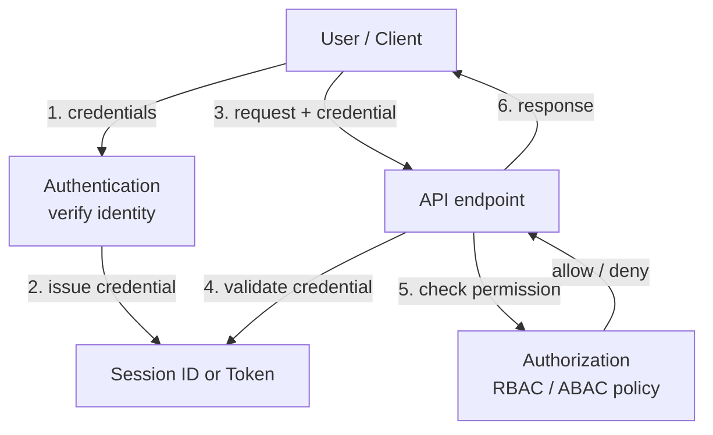
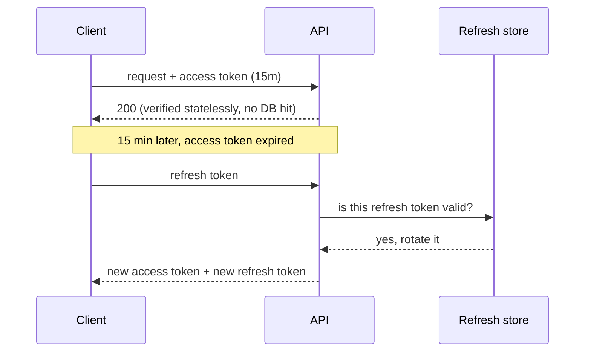
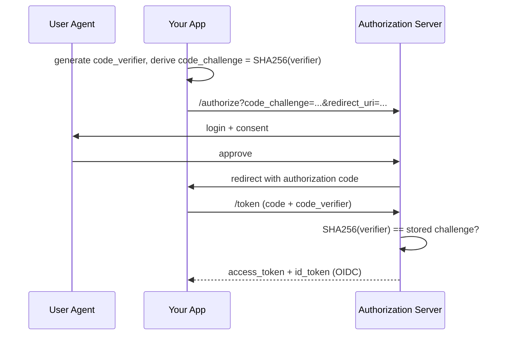

# Authentication and authorization

## Why this matters

It's a Tuesday afternoon and a security researcher just emailed your team a proof-of-concept. They logged into your app as a normal user, opened DevTools, copied the JWT out of `localStorage`, and pasted it into a request to `/api/admin/users` — and it worked. The token had a `role: "user"` claim, but your admin endpoint only checked that the token was *valid*, not what it *authorized*. Worse: the token had no expiry, so the one they stole from a logged-out laptop in a coffee shop six weeks ago still works today. You can't revoke it. You can't even tell which tokens are out there. Your only lever is to rotate the signing key, which logs out every user on the platform at once.

This is the single most common shape of a serious backend bug, and it comes from blurring two questions that are not the same question. *Authentication* (AuthN) asks "who are you?" *Authorization* (AuthZ) asks "what are you allowed to do?" The researcher's exploit chained two failures: a token store that an attacker could read (AuthN weakness) and an endpoint that trusted a claim instead of checking a permission (AuthZ weakness). Either one alone is bad. Together they're a breach.

The engineers who get this wrong treat auth as a library you bolt on once and forget. The ones who get it right know that auth is a set of deliberate decisions — where the credential lives, how long it lives, who can revoke it, and what each request is permitted to do — and that every one of those decisions has a failure mode you can name in advance. This chapter is about making those decisions on purpose.

## Mental model

Hold three layers in your head and never let them collapse into one:

1. **Identity** — proving who the principal is. The output is a verified subject (`sub`), e.g. user `42`.
2. **Session/token** — the credential the client presents on each subsequent request so it doesn't re-prove identity every time.
3. **Authorization** — the decision, made *per request*, about whether this subject may perform this action on this resource.



The key insight: step 4 (is this credential valid?) and step 5 (is this action allowed?) are *separate gates*. The coffee-shop exploit happened because someone fused them — a valid token was treated as an authorized one. Keep them apart in code and the whole class of bug disappears.

The second axis is **stateful vs. stateless** credentials. A *session* is a random opaque ID; the server keeps the real state (who it belongs to, when it expires) in a store and looks it up on every request. A *JWT* carries its own state — claims signed by the server — so the server can verify it without a lookup. That single difference drives almost every tradeoff that follows: statelessness buys you horizontal scale and cheap verification but costs you instant revocation, because a signed token is valid until it expires no matter what your database thinks.

## In practice

Let's build up the credential options from the simplest, most revocable design to the most scalable one, then decide who is allowed to do what.

### Sessions: opaque, stateful, revocable

The oldest pattern still wins for most server-rendered and single-backend apps. The server generates a high-entropy random ID, stores the session server-side (Redis, Postgres), and hands the client only the ID in a cookie.

```typescript
import { randomBytes } from "node:crypto";
import type { Request, Response } from "express";

async function login(req: Request, res: Response) {
  const user = await verifyPassword(req.body.email, req.body.password);
  if (!user) return res.status(401).json({ error: "invalid credentials" });

  const sessionId = randomBytes(32).toString("base64url"); // 256 bits of entropy
  await redis.set(`sess:${sessionId}`, JSON.stringify({ userId: user.id }), {
    EX: 60 * 60 * 24 * 7, // 7-day TTL, enforced server-side
  });

  res.cookie("sid", sessionId, {
    httpOnly: true,   // JS cannot read it — kills XSS token theft
    secure: true,     // HTTPS only
    sameSite: "lax",  // CSRF mitigation for top-level navigations
    maxAge: 1000 * 60 * 60 * 24 * 7,
    path: "/",
  });
  res.json({ ok: true });
}
```

Revocation is trivial: `redis.del('sess:' + id)` and the session is dead on the next request. The cost is a store lookup per request and a stateful tier you have to scale and replicate. For most apps that cost is negligible and the revocation guarantee is worth far more than the lookup.

### JWTs: self-contained, stateless, hard to revoke

A JWT is three base64url segments — header, payload, signature — joined by dots. The server signs it; any server with the verification key can validate it without I/O.

```typescript
import { SignJWT, jwtVerify } from "jose";

const secret = new TextEncoder().encode(process.env.JWT_SECRET!);

async function issueAccessToken(userId: string, roles: string[]) {
  return new SignJWT({ roles })
    .setProtectedHeader({ alg: "HS256" })
    .setSubject(userId)
    .setIssuer("https://api.example.com")
    .setAudience("https://api.example.com")
    .setIssuedAt()
    .setExpirationTime("15m") // SHORT. This is the whole revocation story.
    .sign(secret);
}

async function verify(token: string) {
  const { payload } = await jwtVerify(token, secret, {
    issuer: "https://api.example.com",
    audience: "https://api.example.com",
  });
  return payload; // exp, iss, aud all checked by jwtVerify
}
```

The unavoidable property: a JWT is valid until `exp`, full stop. You cannot un-issue it. The mitigation is the **access + refresh token pair**: a short-lived access token (5–15 minutes) that's stateless and fast to verify, plus a long-lived refresh token that *is* stored server-side and *can* be revoked. When the access token expires, the client trades the refresh token for a new one — and that exchange hits your store, which is your one chance to deny a revoked or rotated refresh token.



Rotate refresh tokens on every use and detect reuse: if an old refresh token is presented after it was already exchanged, treat it as theft and revoke the entire token family. This is the standard defense from the OAuth 2.0 Security Best Current Practice (RFC 9700).

### Where to store tokens

This is where the opening breach started. Ranked from best to worst for a browser:

- **`HttpOnly`, `Secure`, `SameSite` cookie** — JavaScript cannot read it, so an XSS payload cannot exfiltrate it. This is the default you should reach for. Pair it with a CSRF defense (`SameSite=Lax` plus a double-submit token for state-changing requests).
- **In-memory (a JS variable)** — survives XSS poorly but dies on tab close; acceptable for a short-lived access token in a SPA, refreshed from an `HttpOnly` cookie holding the refresh token.
- **`localStorage`** — readable by *any* JavaScript on the page, including injected XSS and compromised third-party scripts. A token here is one supply-chain incident away from theft. Do not put bearer tokens in `localStorage`.

### OAuth 2.1 and OIDC: delegated identity

When you want "Sign in with Google" or to let a third-party app act on a user's behalf, you want OAuth 2.1 (authorization, the consolidation of OAuth 2.0 + its security BCPs) plus OpenID Connect (authentication, an identity layer on top). The only flow you should use for web and mobile clients is the **Authorization Code flow with PKCE** (Proof Key for Code Exchange, RFC 7636). The implicit flow is dead — OAuth 2.1 removes it.



PKCE closes the authorization-code interception attack: even if an attacker steals the code from the redirect, they can't exchange it without the `code_verifier`, which never left your app. The OIDC `id_token` is a JWT describing *who* logged in (`sub`, `email`, `name`); the OAuth `access_token` is for calling APIs. Don't confuse them — the `id_token` is for your app to consume, never to send to a resource server as a bearer credential.

### Passkeys / WebAuthn: killing the password

Passkeys (the consumer-facing name for WebAuthn credentials, a W3C standard) replace passwords with public-key cryptography. The device holds a private key in a secure enclave; the server holds only the public key. There is no shared secret to phish, leak, or reuse, and the credential is cryptographically bound to your origin, so phishing sites can't relay it.

```typescript
// Registration: server sends a challenge, browser creates a keypair
const credential = await navigator.credentials.create({
  publicKey: {
    challenge: serverChallenge,             // random, single-use
    rp: { name: "Example", id: "example.com" },
    user: { id: userId, name: email, displayName: name },
    pubKeyCredParams: [{ type: "public-key", alg: -7 }], // ES256
    authenticatorSelection: { residentKey: "preferred", userVerification: "required" },
  },
});
// Server stores credential.id + the public key. Never a secret.
```

On login the browser signs the server's challenge with the private key; the server verifies with the stored public key. Use a library (SimpleWebAuthn, or your platform's) — the ceremony details (attestation, signature counters, origin binding) are easy to get subtly wrong by hand. In 2026 there's no good reason a new consumer app ships password-only auth; offer passkeys as the primary factor and treat passwords, if you keep them, as the fallback.

### RBAC vs. ABAC: the authorization decision

Once you know *who*, you still have to decide *what they may do*. Two models dominate.

**RBAC** (Role-Based Access Control): users have roles, roles have permissions. Simple, auditable, and right for most apps.

```typescript
const can = (roles: string[], permission: string) =>
  roles.some((r) => ROLE_PERMISSIONS[r]?.includes(permission));

// in the handler — note: SEPARATE from token validation
if (!can(user.roles, "users:delete")) return res.status(403).end();
```

**ABAC** (Attribute-Based Access Control): decisions are computed from attributes of the subject, resource, action, and environment. You need this when permissions depend on data, not just roles — "a manager may approve expenses *under $5,000* *in their own department*." Encode policy as data (a policy engine like OPA/Rego, AWS Cedar, or OpenFGA) rather than scattering `if` statements across handlers.

```rego
# OPA / Rego — policy as data, evaluated per request
package expenses
default allow = false
allow {
  input.subject.role == "manager"
  input.resource.amount < 5000
  input.resource.department == input.subject.department
}
```

What I'd pick: start with RBAC. It covers 80% of apps and stays readable. Reach for ABAC (via a policy engine) only when you find yourself encoding resource attributes into role names like `manager_dept_finance_under5k` — that's RBAC screaming that it has outgrown itself.

## Pitfalls and anti-patterns

**Bearer tokens in `localStorage`.** *Recognize it:* `localStorage.getItem("token")` anywhere in your frontend; tokens visible in DevTools → Application → Local Storage. *Fix it:* move the credential to an `HttpOnly` `Secure` cookie, or keep a short-lived access token in memory backed by a refresh token in an `HttpOnly` cookie. Any token JavaScript can read is a token XSS can steal.

**No expiry, or expiry you never enforce.** *Recognize it:* JWTs minted without `setExpirationTime`, or a verifier that decodes the payload but never checks `exp`. A token good forever is a password that can never be changed. *Fix it:* short access-token lifetimes (5–15 min), always verify `exp`/`iss`/`aud` with a library that fails closed, and use a verified refresh path for longevity.

**The `alg: none` / algorithm-confusion attack.** *Recognize it:* a verifier that reads the algorithm from the *token header* and trusts it, or that accepts `none`. An attacker flips `alg` to `none` (no signature) or downgrades RS256→HS256 to sign with the public key as if it were the HMAC secret. *Fix it:* pin the expected algorithm in your verify call (`jwtVerify(token, key, { algorithms: ["RS256"] })`) and never let the token dictate it.

**The confused deputy.** *Recognize it:* a privileged service that performs an action *on behalf of* a caller but uses *its own* elevated permissions instead of the caller's. The classic case: an internal API gateway that holds an admin token and forwards user requests without re-checking the user's authorization — so any user inherits admin power through the deputy. *Fix it:* propagate the caller's identity and authorize against *their* permissions at the resource, not the deputy's. Use token exchange (RFC 8693) or scoped, on-behalf-of tokens rather than a shared superuser credential.

**Authorizing on the client, trusting it on the server.** *Recognize it:* the server hides the "Delete" button for non-admins but the `DELETE` endpoint has no permission check. *Fix it:* the client decides what to *render*; the server decides what to *permit*. Every state-changing endpoint enforces authorization server-side, every time, regardless of what the UI showed.

## Production checklist

- [ ] AuthN and AuthZ are separate gates in code — validating a token never implies authorizing the action
- [ ] Access tokens are short-lived (5–15 min); long-lived sessions/refresh tokens are server-side and revocable
- [ ] Refresh tokens rotate on use, with reuse detection that revokes the whole token family (RFC 9700)
- [ ] Browser credentials live in `HttpOnly` `Secure` `SameSite` cookies, never `localStorage`
- [ ] JWT verification pins `alg`, checks `exp`/`iss`/`aud`, and fails closed — `none` and algorithm confusion are impossible
- [ ] OAuth flows use Authorization Code + PKCE; implicit and ROPC flows are disabled (OAuth 2.1)
- [ ] `redirect_uri` values are exact-match allowlisted on the authorization server
- [ ] Passkeys/WebAuthn offered as a primary factor for new accounts; MFA available for password fallback
- [ ] Every state-changing endpoint enforces authorization server-side, independent of the UI
- [ ] A documented, tested kill switch: how to revoke one user, and how to revoke everyone, without a full deploy
- [ ] Auth decisions (login, token issue, refresh, deny) are logged with subject and outcome for audit

## Exercises

1. **(Comprehension)** Explain, in two sentences each, why a session cookie can be revoked instantly but a JWT generally cannot, and what the access-token/refresh-token pattern does to recover *most* of the revocation guarantee without giving up stateless verification.

2. **(Applied)** Take an Express (or your framework of choice) endpoint that currently does `jwt.verify(token)` and nothing else. Split it into two explicit gates: a middleware that authenticates (verifies the token, pins the algorithm, checks `exp`/`iss`/`aud`) and a separate `requirePermission("...")` check in the handler. Then write a test that proves a *valid* token for a non-privileged user gets a `403`, not a `200`.

3. **(Design)** You're designing auth for a multi-tenant B2B SaaS where customer admins manage their own users, support staff need scoped read access to any tenant for debugging, and an internal billing service acts on behalf of tenants nightly. Sketch the AuthN mechanism, the token model (lifetimes, storage, revocation), and the authorization model (RBAC, ABAC, or a hybrid). Justify where you'd accept statelessness and where you'd insist on server-side state, and show how you'd prevent the billing service from becoming a confused deputy.

## Further reading

- [RFC 9700 — Best Current Practice for OAuth 2.0 Security](https://datatracker.ietf.org/doc/html/rfc9700) — the consolidated, current guidance behind OAuth 2.1
- [RFC 7636 — Proof Key for Code Exchange (PKCE)](https://datatracker.ietf.org/doc/html/rfc7636) — why and how authorization codes are bound to the requesting client
- [OpenID Connect Core 1.0](https://openid.net/specs/openid-connect-core-1_0.html) — the identity layer on top of OAuth, including the `id_token`
- [Web Authentication (WebAuthn) Level 3 — W3C](https://www.w3.org/TR/webauthn-3/) — the standard behind passkeys
- [OWASP Authentication Cheat Sheet](https://cheatsheetseries.owasp.org/cheatsheets/Authentication_Cheat_Sheet.html) and the [Session Management Cheat Sheet](https://cheatsheetseries.owasp.org/cheatsheets/Session_Management_Cheat_Sheet.html) — practical, regularly updated checklists
- [RFC 8693 — OAuth 2.0 Token Exchange](https://datatracker.ietf.org/doc/html/rfc8693) — the principled fix for on-behalf-of and the confused-deputy problem

> **Connect the dots:** The authorization decision you make here is enforced *across* layers. Row-level security in Postgres (Part 6) lets the database itself reject queries a user shouldn't run, so a bug in your API isn't the only thing standing between an attacker and the data. In distributed systems (Part 7), token exchange and scoped service identities are how you propagate "who is really calling" across service hops. And the threat models — XSS token theft, confused deputy, algorithm confusion — are core material in Part 10 (Security).

> **Security note:** Never invent your own token verification. The most damaging auth CVEs of the last decade were not broken crypto — they were verifiers that read the algorithm from the attacker-controlled token header and trusted it, enabling `alg: none` and RS256→HS256 confusion attacks that let anyone forge a valid-looking token. Always pin the expected algorithm and key explicitly (`{ algorithms: ["RS256"] }`), reject `none`, validate `iss`/`aud`/`exp`, and use a maintained library that fails closed. Treat the signing key like a database password: rotate it, store it in a secrets manager, and never commit it.
