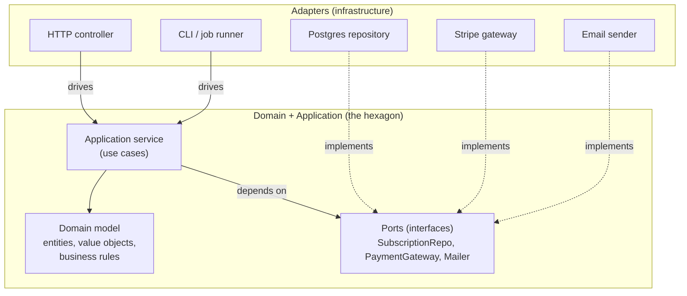

# Architectural patterns: layered, hexagonal, and DDD

## Why this matters

It's a Tuesday afternoon and the payments team needs to add a second payment provider. The first one, Stripe, was wired in eighteen months ago when the company had one engineer and a deadline. You open `createSubscription` to see what it'll take. The controller method is 340 lines. It pulls the request body, validates it inline, queries the database with raw SQL, constructs a Stripe client from a global, calls `stripe.subscriptions.create`, maps the response back into a row, writes it, sends a confirmation email through SendGrid, and emits an analytics event — all in one function, all reachable only by spinning up Express, Postgres, and a live Stripe key.

There is no place to put the second provider. The business rule — "a customer on the Pro plan with an active trial gets a 14-day grace period before the first charge" — is not a thing you can point at. It's smeared across a SQL `WHERE` clause, a conditional around the Stripe call, and the shape of the response mapping. To add Adyen you'd have to copy the whole method and fork it, or thread an `if (provider === 'stripe')` through every branch. To unit-test the grace-period rule you'd have to mock Stripe's SDK, stand up a database, and assert against an email side effect.

That's the cost of not knowing this chapter. The grace-period rule is the most valuable code in the building — it's the actual business — and it's the least testable, least findable, least reusable code you have, because it was never given a home separate from the framework and the I/O. Architectural patterns are not academic taxonomy. They are the answer to one question: *where does the business logic live, and what is it allowed to know about?* Get that boundary right and adding Adyen is a new file. Get it wrong and every change is surgery.

## Mental model

There are three layers of idea here, and they nest. **Layered (n-tier)** architecture says: stack your code in horizontal layers — presentation, application/service, domain, data access — and only let each layer call the one below it. **Hexagonal** (Hexagonal Architecture, Alistair Cockburn, 2005), also called ports and adapters, takes the same instinct but bends the stack into a ring: the domain sits in the center, and everything external — HTTP, the database, Stripe, the email provider — plugs into it through *ports* (interfaces the domain defines) implemented by *adapters* (concrete code on the outside). **Domain-Driven Design** (Eric Evans, 2003) is orthogonal: it's a set of tactical patterns — entities, value objects, aggregates, repositories, domain services — for what you put *inside* that center, plus strategic patterns for carving systems into bounded contexts.

The one rule that ties all three together is the **Dependency Inversion Principle**: high-level policy should not depend on low-level detail; both should depend on abstractions. In layered architecture as commonly built, the domain depends on the data layer — wrong direction. Hexagonal fixes this by having the domain *own* the interface and the database *implement* it. Dependencies point inward, always.



The arrows that matter: controllers and jobs *drive* the application (left, "driving" adapters); the application *depends on* ports; infrastructure *implements* ports (right, "driven" adapters). Nothing inside the hexagon imports anything from outside it. That single constraint — `domain/` and `application/` have zero imports from `express`, `pg`, `stripe`, or `@sendgrid/mail` — is the entire discipline. Everything else is taste.

## In practice

### The anti-pattern: the controller that does everything

Here is the shape of the 340-line method, compressed.

```typescript
// routes/subscriptions.ts — DO NOT DO THIS
import { Router } from 'express';
import { pool } from '../db';
import Stripe from 'stripe';
import sgMail from '@sendgrid/mail';

const stripe = new Stripe(process.env.STRIPE_KEY!);
export const router = Router();

router.post('/subscriptions', async (req, res) => {
  const { customerId, plan } = req.body;
  if (!customerId || !plan) return res.status(400).json({ error: 'bad input' });

  const { rows } = await pool.query(
    'SELECT * FROM customers WHERE id = $1', [customerId]);
  const customer = rows[0];
  if (!customer) return res.status(404).json({ error: 'no customer' });

  // business rule, buried: Pro + active trial => 14-day grace period
  const trialActive = customer.trial_ends_at && new Date(customer.trial_ends_at) > new Date();
  const trialDays = plan === 'pro' && trialActive ? 14 : 0;

  const sub = await stripe.subscriptions.create({
    customer: customer.stripe_id,
    items: [{ price: priceFor(plan) }],
    trial_period_days: trialDays,
  });

  await pool.query(
    'INSERT INTO subscriptions (id, customer_id, plan, status) VALUES ($1,$2,$3,$4)',
    [sub.id, customerId, plan, sub.status]);

  await sgMail.send({ to: customer.email, /* ... */ });
  res.status(201).json({ id: sub.id, status: sub.status });
});
```

Everything is fused. The grace-period rule can't be tested without Stripe. The provider can't be swapped. The SQL is in the HTTP handler. This is the default state of most code, and it works fine right up until it doesn't.

### The refactor: define ports the domain owns

Start from the center. The domain defines what it *needs* from the outside world as interfaces, in its own language — not Stripe's, not Postgres's.

```typescript
// domain/ports.ts — the hexagon's edge, owned by the domain
export interface PaymentGateway {
  startSubscription(input: {
    externalCustomerId: string;
    plan: Plan;
    graceDays: number;
  }): Promise<{ providerSubId: string; status: SubStatus }>;
}

export interface SubscriptionRepository {
  findCustomer(id: CustomerId): Promise<Customer | null>;
  save(sub: Subscription): Promise<void>;
}

export interface Mailer {
  sendSubscriptionConfirmation(to: Email, sub: Subscription): Promise<void>;
}
```

Note `PaymentGateway` says nothing about Stripe. Its method names and types are in *domain* vocabulary (`graceDays`, `plan`), so an Adyen adapter and a Stripe adapter satisfy the same shape. That's the swap point we lacked.

### The domain: business rules as plain objects

The grace-period rule — the valuable bit — moves into a pure domain object with no framework, no I/O. It's just types and logic.

```typescript
// domain/subscription.ts
export type Plan = 'free' | 'pro';
export type SubStatus = 'trialing' | 'active' | 'past_due';

export class Customer {
  constructor(
    readonly id: CustomerId,
    readonly email: Email,
    readonly externalId: string,
    private readonly trialEndsAt: Date | null,
  ) {}

  trialActive(now: Date): boolean {
    return this.trialEndsAt !== null && this.trialEndsAt > now;
  }
}

export class Subscription {
  private constructor(
    readonly id: string,
    readonly customerId: CustomerId,
    readonly plan: Plan,
    readonly status: SubStatus,
  ) {}

  // the rule lives here, testable in microseconds, no mocks
  static graceDaysFor(customer: Customer, plan: Plan, now: Date): number {
    return plan === 'pro' && customer.trialActive(now) ? 14 : 0;
  }

  static fromProvider(
    customerId: CustomerId, plan: Plan,
    res: { providerSubId: string; status: SubStatus },
  ): Subscription {
    return new Subscription(res.providerSubId, customerId, plan, res.status);
  }
}
```

In DDD terms, `Customer` and `Subscription` are **entities** (they have identity and a lifecycle); a wrapper like `Email` or `Plan` is a **value object** (defined entirely by its value, immutable). `graceDaysFor` is a domain rule that belongs to the model, not to a service. This file imports nothing but other domain files. You can run its tests with `vitest` and zero infrastructure.

### The application service: orchestrate the use case

The application layer (a DDD **domain service** / use-case orchestrator) wires the steps together. It depends only on ports, which arrive by constructor injection. It contains no business rules itself — it coordinates.

```typescript
// application/createSubscription.ts
import { PaymentGateway, SubscriptionRepository, Mailer } from '../domain/ports';
import { Subscription, Plan, CustomerId } from '../domain/subscription';

export class CreateSubscription {
  constructor(
    private readonly repo: SubscriptionRepository,
    private readonly gateway: PaymentGateway,
    private readonly mailer: Mailer,
    private readonly clock: () => Date = () => new Date(),
  ) {}

  async execute(input: { customerId: CustomerId; plan: Plan }): Promise<Subscription> {
    const customer = await this.repo.findCustomer(input.customerId);
    if (!customer) throw new CustomerNotFound(input.customerId);

    const graceDays = Subscription.graceDaysFor(customer, input.plan, this.clock());

    const res = await this.gateway.startSubscription({
      externalCustomerId: customer.externalId,
      plan: input.plan,
      graceDays,
    });

    const sub = Subscription.fromProvider(input.customerId, input.plan, res);
    await this.repo.save(sub);
    await this.mailer.sendSubscriptionConfirmation(customer.email, sub);
    return sub;
  }
}
```

### The adapters: where Stripe and Postgres actually live

Now the framework-specific code becomes thin adapters on the outside, each implementing a port.

```typescript
// infrastructure/stripeGateway.ts
import Stripe from 'stripe';
import { PaymentGateway } from '../domain/ports';
import { Plan } from '../domain/subscription';

export class StripeGateway implements PaymentGateway {
  constructor(private readonly stripe: Stripe) {}

  async startSubscription(input: {
    externalCustomerId: string; plan: Plan; graceDays: number;
  }) {
    const sub = await this.stripe.subscriptions.create({
      customer: input.externalCustomerId,
      items: [{ price: priceFor(input.plan) }],
      trial_period_days: input.graceDays,
    });
    return { providerSubId: sub.id, status: mapStatus(sub.status) };
  }
}
```

```typescript
// interface/http/subscriptions.ts — the driving adapter is now tiny
router.post('/subscriptions', async (req, res, next) => {
  try {
    const sub = await createSubscription.execute({
      customerId: req.body.customerId,
      plan: req.body.plan,
    });
    res.status(201).json({ id: sub.id, status: sub.status });
  } catch (err) {
    next(err); // map domain errors to HTTP in one place
  }
});
```

Composition happens once, at the edge — the **composition root**:

```typescript
// main.ts — the only place that knows every concrete type
const gateway = new StripeGateway(new Stripe(process.env.STRIPE_KEY!));
const repo = new PgSubscriptionRepository(pool);
const mailer = new SendGridMailer(sgMail);
const createSubscription = new CreateSubscription(repo, gateway, mailer);
```

Adding Adyen is now a single new file, `AdyenGateway implements PaymentGateway`, plus one line in `main.ts`. Testing the grace-period rule is a unit test with in-memory fakes:

```typescript
test('pro plan with active trial gets 14 grace days', async () => {
  const repo = new InMemoryRepo(customerWithTrial);
  const gateway = new FakeGateway();
  const uc = new CreateSubscription(repo, gateway, new NoopMailer(),
    () => new Date('2026-01-01'));
  await uc.execute({ customerId: 'c1', plan: 'pro' });
  expect(gateway.lastCall.graceDays).toBe(14);
});
```

No Stripe key, no database, runs in a millisecond.

### When *not* to reach for hexagonal

Be honest about cost. A CRUD admin panel, a glue script, a service with one data store and no swappable dependencies — these do not need ports and adapters, and the indirection will slow you down. Plain layered (controller → service → repository) is the right default for most services. Reach for the full hexagon when you have genuine substitutability needs (multiple providers, multiple delivery mechanisms), rich business rules worth isolating, or a domain complex enough that "where does this logic go?" is a recurring argument. DDD's tactical patterns earn their keep in proportion to domain complexity; on a thin domain they're ceremony.

## Pitfalls and anti-patterns

**The anemic domain model.** Your entities are bags of public getters and setters with all behavior living in "service" classes. The `graceDaysFor` rule sits in `SubscriptionService` instead of on `Subscription`. *Recognize it:* domain objects with no methods beyond accessors; services named `XxxService` that contain every rule. *Fix it:* push behavior onto the object that owns the data. If a rule reads only a `Customer`'s fields, it's a `Customer` method. Martin Fowler named this anti-pattern for a reason — it gives you the DDD vocabulary with none of the benefit.

**Leaky ports.** Your `SubscriptionRepository` interface returns a Stripe object, or a `pg` `QueryResult`, or exposes a `findByRawSql(sql: string)` method. The abstraction now depends on the detail, so the inversion is fake. *Recognize it:* infrastructure types appearing in domain interface signatures; `import Stripe` anywhere under `domain/`. *Fix it:* ports speak only in domain types. Adapters translate at the boundary. Add a lint rule (`eslint-plugin-boundaries` or an `import/no-restricted-paths`) that fails the build if `domain/**` imports from `infrastructure/**` or any framework package.

**Indirection as a substitute for design.** Every class gets an interface, every interface has exactly one implementation, and you've quadrupled the file count to support a flexibility you'll never use. *Recognize it:* `IFooService` with a single `FooService`, interfaces created reflexively rather than at real substitution points. *Fix it:* define a port only where you have, or concretely foresee, more than one implementation — including a test fake as a legitimate second implementation. One real adapter plus one test fake justifies a port; one adapter and a wish does not.

**Business logic leaking into adapters.** The grace-period calculation creeps back into `StripeGateway` because "it was convenient." Now the rule is provider-specific again and untestable without Stripe. *Recognize it:* `if`/`else` on business conditions inside an adapter; domain decisions made in the HTTP controller. *Fix it:* adapters do translation and I/O only — no decisions. If you see a business branch in an adapter, it belongs in the domain or application layer.

**Bounded contexts collapsed into one model.** You build a single `User` entity shared by billing, auth, and notifications, so a change for billing breaks auth. *Recognize it:* one god-entity imported by every module; teams blocking each other on the same class. *Fix it:* DDD strategic design — split into bounded contexts, each with its own model of the same real-world concept (`BillingCustomer` vs. `AuthAccount`), connected by explicit translation at the seams, not by sharing a class.

## Production checklist

- [ ] `domain/` and `application/` directories have **zero** imports from web frameworks, ORMs, SDKs, or `process.env` (enforced by a lint rule in CI, not by good intentions)
- [ ] Every external dependency (DB, payment provider, email, queue) is reached through a port interface owned by the domain
- [ ] A composition root (`main.ts` / a DI container) is the single place that instantiates concrete adapters
- [ ] Each port has at least one in-memory fake used in tests, so use cases run with no network or DB
- [ ] Business rules live on entities/value objects or in domain services — not in controllers, not in adapters
- [ ] Ports speak domain types only; no `Stripe`, `QueryResult`, or HTTP types cross the boundary
- [ ] Interfaces exist only at real substitution points (2+ implementations, counting test fakes)
- [ ] Domain errors are distinct types, mapped to transport-level responses (HTTP status, gRPC code) in one boundary layer
- [ ] For multi-team systems: bounded contexts are explicit, each with its own model and an anti-corruption layer at the seams

## Exercises

1. **(Comprehension)** Given the refactored code above, list every file that must change to add a second payment provider (Adyen), and every file that must *not* change. Explain in one sentence why the domain and application layers are in the "must not change" set.

2. **(Applied)** Take the anti-pattern controller from this chapter (or one from your own codebase). Extract one business rule into a pure domain object, define the ports it needs, and write a unit test that exercises the rule using in-memory fakes — no database, no network. Time how long the test takes to run versus the equivalent integration test.

3. **(Design)** You're starting a service that ingests webhooks from three payment providers, applies shared fraud rules, and writes to both Postgres and a Kafka topic. Sketch the ports, the domain model, and the adapters. Decide where the fraud rules live, how you'd test them in isolation, and where you'd draw bounded-context boundaries if billing and fraud are owned by different teams. State which parts of the hexagon you'd build now and which you'd defer — and defend the cut.

## Further reading

- Alistair Cockburn, ["Hexagonal Architecture" (Ports and Adapters)](https://alistair.cockburn.us/hexagonal-architecture/) — the original 2005 source, short and worth reading before any secondhand summary.
- Eric Evans, *Domain-Driven Design: Tackling Complexity in the Heart of Software* (2003) — entities, value objects, aggregates, repositories, and bounded contexts; the canonical text.
- Robert C. Martin, ["The Clean Architecture"](https://blog.cleancoder.com/uncle-bob/2012/08/13/the-clean-architecture.html) — the dependency-inversion-at-the-boundary argument stated as a general rule, with the concentric-circles diagram.
- Martin Fowler, ["AnemicDomainModel"](https://martinfowler.com/bliki/AnemicDomainModel.html) and ["PresentationDomainDataLayering"](https://martinfowler.com/bliki/PresentationDomainDataLayering.html) — the layered baseline and its most common failure.
- Vaughn Vernon, *Implementing Domain-Driven Design* (2013) — the pragmatic companion to Evans, with concrete code and the aggregate-design rules.

> **Security note:** Putting an SDK behind a port is also a security boundary, not just a testing one. Adapters are exactly where you enforce that secrets stay outside the domain: the `StripeGateway` holds the API key, the domain never sees it, and a leaked stack trace from a domain rule can't expose a credential it doesn't hold. Validate and normalize *at the adapter edge* — webhook signatures (Stripe's `Stripe-Signature` HMAC), request bodies, provider identifiers — so untrusted external data is sanitized before it ever reaches a domain object. A common breach pattern is trusting a provider's webhook payload as authenticated; verify the signature in the inbound adapter and treat everything past it as already-validated domain input.

> **Connect the dots:** The ports you define here are the natural seams for the rest of the stack. Your `SubscriptionRepository` is where Part 6 (Databases) decides between an ORM and raw SQL without the domain caring. The `PaymentGateway` port is where Part 11 (Testing) plugs in contract tests and in-memory fakes, and where Part 9 (Observability) wraps spans around external calls. Bounded contexts are the unit Part 7 (System Design) splits into services, and the composition root is where Part 8 (DevOps) injects environment-specific config.
