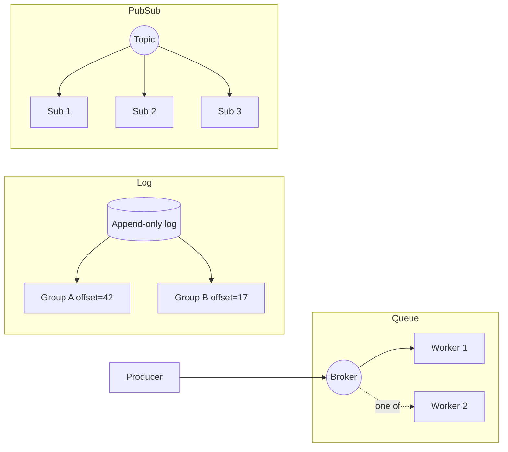

# Messaging and queues

## Why this matters

It's a Tuesday afternoon and a customer is on the phone: they paid for an order, their card was charged, and no order exists. Your payments service published an `order.paid` event; your fulfillment service was supposed to consume it and create the order. The event is gone. You check the logs — the fulfillment pod that was processing it OOM-killed mid-handler, after it had already acknowledged the message but before it wrote the row. The broker saw the ack, dropped the message, and there is nothing to redeliver. One lost message, one charged customer, no order.

The week after, you fix it the obvious way: acknowledge *after* the write, not before. Now a different ticket appears. A customer was charged once but shipped two identical orders. Same event, processed twice: the handler wrote the order, then the pod died before acking, the broker redelivered, and a fresh pod processed it again. You traded a lost message for a duplicate. This is not a bug you introduced by being careless. It is the fundamental shape of the problem, and every messaging system in production sits somewhere on this spectrum.

The engineers who treat a queue as "fire and forget, it just works" ship the bugs above and then blame the broker. The ones who understand delivery semantics design consumers that survive both failures — because they know that in any system where the network can drop a packet, *exactly-once delivery* is a fiction and *exactly-once processing* is something you build, not something you buy. This chapter is about building it.

## Mental model

Three abstractions get lumped together as "messaging," and choosing the wrong one is the most expensive mistake in this space.

- **Queue** (work distribution): a message is delivered to *one* of N competing consumers, then removed. Used to spread work across workers. SQS, RabbitMQ classic queues.
- **Log** (durable ordered replay): an append-only sequence of records, retained for a window, where *each consumer group* tracks its own read position (offset). Multiple independent readers, replay from any point. Kafka, Redpanda, Kinesis.
- **Pub/sub** (fan-out): a message is delivered to *every* subscriber. Often built on top of a queue or log. NATS, Redis pub/sub, SNS.



The second mental model is **delivery semantics**, and there are only three:

| Semantic | What it means | When you get it |
|---|---|---|
| **At-most-once** | ack before processing; may lose messages | metrics, sampled telemetry where loss is fine |
| **At-least-once** | ack after processing; may duplicate | the default and correct choice for almost everything |
| **Exactly-once** | no loss, no duplicate | only within a closed system (Kafka transactions); never across arbitrary network boundaries |

The lost-message bug from the opening was at-most-once behavior the engineer didn't know they'd chosen. The duplicate bug was at-least-once working *correctly*. At-least-once is the right target. You make duplicates harmless with **idempotent consumers**, and that's the whole game.

## In practice

### Picking the broker

| | Kafka | SQS | RabbitMQ | NATS (JetStream) |
|---|---|---|---|---|
| Model | log | queue | queue + routing | pub/sub + log |
| Ordering | per-partition | FIFO queues only | per-queue | per-subject (JetStream) |
| Replay | yes (retention) | no | no | yes |
| Throughput | very high | high (managed) | medium | very high |
| Ops burden | high (or pay for MSK/Confluent) | none (fully managed) | medium | low |
| Best for | event streaming, replay, analytics | AWS-native task queues | complex routing, RPC, priorities | low-latency edge/IoT, microservice mesh |

What I'd pick: **SQS** if you're on AWS and want a task queue with zero ops — it's the boring correct default. **Kafka** when you need replay, multiple independent consumers of the same stream, or ordered event sourcing. **RabbitMQ** when routing topology (fanout, topic exchanges, priorities) is the core requirement. **NATS** when latency and operational simplicity matter more than ecosystem maturity. Do not reach for Kafka because it's fashionable; running it yourself is a part-time job for a team.

### A producer (the easy part)

```typescript
// Kafka producer — note the key, which controls partition and therefore ordering
import { Kafka } from "kafkajs";

const kafka = new Kafka({ brokers: ["broker:9092"] });
const producer = kafka.producer({ idempotent: true }); // dedup on broker side

await producer.connect();
await producer.send({
  topic: "orders",
  messages: [{
    key: order.id,                       // same key => same partition => ordered
    value: JSON.stringify({ type: "order.paid", orderId: order.id, amount }),
    headers: { "event-id": crypto.randomUUID() }, // dedup key for the consumer
  }],
});
```

Two non-negotiables. **Set a partition key** when order matters — Kafka only guarantees ordering within a partition, and the key is what pins related messages to the same one. **Attach a stable event ID** in a header. The consumer needs it to deduplicate, and it must be generated once at the source, not regenerated on retry.

### The consumer that survives both failures

The lost-message bug is fixed by acking after the side effect. The duplicate bug is fixed by making the side effect idempotent. Here is the wrong way:

```typescript
// WRONG: ack-before-process loses messages; no dedup duplicates them
consumer.on("message", async (msg) => {
  await consumer.ack(msg);          // broker drops it now — crash below loses it
  await createOrder(JSON.parse(msg.value)); // and no dedup => double-ship on retry
});
```

The right way commits the dedup record and the business write in **one transaction**, and acks last:

```typescript
// RIGHT: idempotent handler + ack after commit = at-least-once delivery,
// exactly-once *effect*
async function handle(msg: Message) {
  const eventId = msg.headers["event-id"];
  const order = JSON.parse(msg.value.toString());

  await db.transaction(async (tx) => {
    // INSERT ... ON CONFLICT DO NOTHING: the dedup table is the idempotency guard
    const inserted = await tx.query(
      `INSERT INTO processed_events (event_id) VALUES ($1)
       ON CONFLICT (event_id) DO NOTHING RETURNING event_id`,
      [eventId],
    );
    if (inserted.rowCount === 0) return; // already processed — skip side effect

    await tx.query(
      `INSERT INTO orders (id, amount, status) VALUES ($1, $2, 'paid')`,
      [order.orderId, order.amount],
    );
  });

  await consumer.commitOffset(msg); // ack only after the DB commit durably lands
}
```

The `processed_events` row and the `orders` row commit atomically. If the pod dies before `commitOffset`, the broker redelivers; the second attempt hits `ON CONFLICT DO NOTHING`, the insert is a no-op, and no second order is created. Lost message: impossible (ack is last). Duplicate effect: impossible (dedup table). This pattern — **idempotency key in a uniqueness-constrained table, in the same transaction as the work** — is the single most important technique in this chapter.

### Dead-letter queues

Some messages will never succeed: malformed JSON, a referenced entity that was deleted, a poison pill. If you retry forever, that one message blocks the partition or spins a worker hot. Route it aside after a bounded number of attempts.

```typescript
const MAX_ATTEMPTS = 5;

async function process(msg: Message) {
  try {
    await handle(msg);
  } catch (err) {
    if (msg.deliveryCount >= MAX_ATTEMPTS) {
      await dlq.send({ ...msg, headers: { ...msg.headers, error: String(err) } });
      await consumer.commitOffset(msg); // remove from main flow
    } else {
      throw err; // let the broker redeliver with backoff
    }
  }
}
```

In SQS this is a one-line config (`RedrivePolicy` with `maxReceiveCount`); the broker moves the message after N failed receives, no code needed. Either way, **alert on DLQ depth** — a filling DLQ is a production incident, not a log line. Build a tool to inspect and re-drive DLQ messages once the bug is fixed.

### Backpressure and ordering

When producers outrun consumers, something must give. The wrong answer is an unbounded in-memory buffer that turns into an OOM kill (which is how the opening lost-message bug started). The right answer is **pull-based consumption with bounded in-flight work**: fetch a batch, process it, fetch the next. Kafka's poll loop and SQS's long-polling receive both do this naturally — the consumer asks for work at its own pace, so a slow consumer simply lags rather than crashing. Tune the batch size (`max.poll.records`, SQS `MaxNumberOfMessages`) and the visibility timeout so a batch can finish before redelivery kicks in.

For ordering: don't ask for global order, it doesn't scale. Ask for order *per entity* — all events for `order-123` in sequence — and use that entity's ID as the partition key. Within a partition Kafka is strictly ordered; across partitions there is no order, and that's the price of parallelism.

## Pitfalls and anti-patterns

**1. The dual-write problem.** Your handler writes to the database *and* publishes an event as two separate operations. The DB commit succeeds, the publish fails (or vice versa), and your systems diverge silently. *How to recognize:* downstream state that's occasionally inconsistent with the source of truth, with no error logged. *How to fix:* the **transactional outbox** — write the event into an `outbox` table in the *same* DB transaction as the business change, then a separate relay (or change-data-capture like Debezium) publishes from the outbox. One commit, two effects, no divergence.

**2. Acking before the work is durable.** The original sin from the opening. *How to recognize:* messages "disappear" under load or during deploys, with no DLQ entry. *How to fix:* ack/commit only after the side effect has durably committed. Order is: do the work, then ack. Always.

**3. Non-idempotent consumers under at-least-once delivery.** Assuming each message arrives exactly once. It won't. *How to recognize:* duplicate rows, double charges, double emails after a redeploy or a consumer restart. *How to fix:* the dedup-table pattern above, or natural idempotency (use the event's ID as the primary key so the second insert simply fails the uniqueness constraint).

**4. Treating Kafka like a queue (or SQS like a log).** Spinning up 50 consumers in one group on a 3-partition topic — 47 sit idle, because partition count caps consumer parallelism. Or expecting SQS to replay last week's messages — it can't, they're gone after processing. *How to recognize:* consumers that won't scale past partition count; "can we reprocess yesterday?" answered with "no." *How to fix:* match the tool to the model — over-partition Kafka topics up front (repartitioning is painful), and use a log, not a queue, when you need replay.

**5. Unbounded retries with no backoff.** A downstream dependency is down, your consumer retries instantly in a tight loop, and you DDoS your own database while it's trying to recover. *How to recognize:* retry storms, a thundering herd hitting a recovering service. *How to fix:* exponential backoff with jitter, a retry ceiling, then DLQ. Never retry hot.

## Production checklist

- [ ] Every consumer is idempotent — dedup table keyed on a producer-generated event ID, or natural idempotency via primary key
- [ ] Acknowledge/commit offset *after* the side effect durably commits, never before
- [ ] Events carry a stable, source-generated `event-id` header (created once, preserved across retries)
- [ ] Partition/ordering key chosen per business entity where order matters
- [ ] Dead-letter queue configured with a bounded `maxReceiveCount` / attempt limit
- [ ] Alert on DLQ depth > 0 and on consumer lag exceeding a threshold
- [ ] Retries use exponential backoff with jitter and a ceiling — never a tight loop
- [ ] Cross-system writes use the transactional outbox (or CDC), never a naive dual write
- [ ] Consumer in-flight work is bounded (batch size + visibility timeout tuned together)
- [ ] A runbook and tooling exist to inspect and re-drive the DLQ after a fix
- [ ] Message schema is versioned (schema registry or explicit `version` field) so producers and consumers can evolve independently

## Exercises

1. **(Comprehension)** Explain, in two or three sentences each, why exactly-once *delivery* is impossible across a network but exactly-once *processing* (effect) is achievable. Reference the role of the idempotency key in your answer.

2. **(Applied)** Take the WRONG consumer in this chapter and reproduce both failures locally. Run a consumer against a queue (SQS via LocalStack, or RabbitMQ in Docker), kill the process between ack and write to lose a message, then move the ack after the write and kill it before the ack to produce a duplicate. Finally, add the dedup-table transaction and prove that neither failure occurs even when you kill the process at the worst possible moment.

3. **(Design)** You're building an order pipeline: payments publishes `order.paid`, and three independent services consume it — fulfillment, email receipts, and analytics. Choose a broker and justify it. Specify the partition/ordering key, where dead-letter queues sit, how each consumer is made idempotent, and how you'd reprocess a week of events after fixing a bug in the analytics consumer without re-shipping orders or re-charging cards. Name the tradeoffs of your broker choice.

## Further reading

- Martin Kleppmann, *Designing Data-Intensive Applications* — Chapter 11, "Stream Processing." The clearest treatment of logs vs. queues and delivery semantics in print.
- [Apache Kafka documentation: Design — Message Delivery Semantics](https://kafka.apache.org/documentation/#semantics) — the canonical explanation of at-least-once, at-most-once, and Kafka's transactional exactly-once.
- [Amazon SQS Developer Guide: Dead-letter queues](https://docs.aws.amazon.com/AWSSimpleQueueService/latest/SQSDeveloperGuide/sqs-dead-letter-queues.html) and [FIFO queue semantics](https://docs.aws.amazon.com/AWSSimpleQueueService/latest/SQSDeveloperGuide/FIFO-queues.html).
- Chris Richardson, [Pattern: Transactional outbox](https://microservices.io/patterns/data/transactional-outbox.html) — the standard reference for solving the dual-write problem.
- Gunnar Morling, ["Reliable Microservices Data Exchange With the Outbox Pattern"](https://debezium.io/blog/2019/02/19/reliable-microservices-data-exchange-with-the-outbox-pattern/) — outbox plus change data capture, end to end.
- [NATS JetStream documentation](https://docs.nats.io/nats-concepts/jetstream) — for the persistence-and-replay model on top of pub/sub.

> **Connect the dots:** The idempotency key and dead-letter patterns here are the same machinery behind background jobs (Part 5, Chapter 6) and reliable webhooks. The transactional outbox depends on your database's transaction guarantees (Part 6) and is a building block of event-driven system design (Part 7). Consumer lag and DLQ depth are your two highest-signal queue metrics — wire them into your observability stack (Part 9) before you ship.

> **Security note:** Treat message payloads as an untrusted, externally-reachable input surface, because they are. A consumer that deserializes a message into a language-native object via an unsafe deserializer (Java `ObjectInputStream`, Python `pickle`, Ruby `Marshal`) hands remote code execution to anyone who can publish to the topic — and in many architectures, more services can publish than you think. Use a data-only format (JSON, Protobuf, Avro) and validate against a schema before processing. Equally: enforce authentication and per-topic authorization on the broker (Kafka ACLs, SQS IAM policies, NATS accounts), encrypt in transit (TLS) and at rest, and never put secrets or full PII in message bodies that may be retained for days and replayed — a log's whole value is that it remembers, which is exactly why it's a compliance liability if you fill it with sensitive data.
