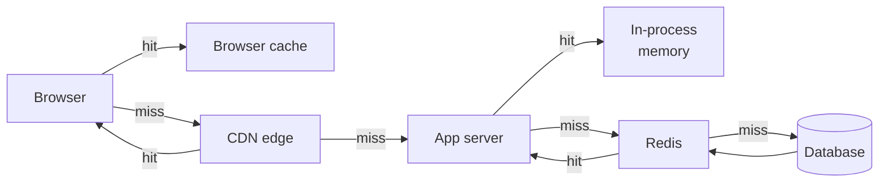
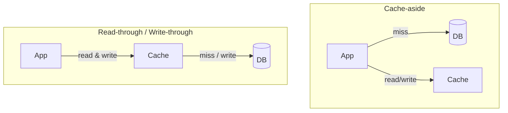

# Caching layers

## Why this matters

It's 2:14pm on a Tuesday. Your product page renders in 80ms because the user's profile, the product record, and the price calculation all come out of Redis. Then a deploy ships a one-line config change that bumps the cache TTL from 300 seconds to 60. Nobody notices. At 2:19pm the cache entries for your hottest product — the one on the homepage banner — all expire within the same second. Two thousand concurrent requests find nothing in Redis, and all two thousand run the same expensive `SELECT` against Postgres at the same instant.

Postgres has 200 connections in its pool. The first 200 requests grab them; the rest queue. The query that normally takes 40ms now takes 9 seconds because the database is thrashing on the same uncached page reads. Connections don't free up. Health checks time out. The load balancer marks instances unhealthy and pulls them, concentrating the surviving traffic onto fewer boxes, which fall over faster. By 2:21pm the site is down — not because traffic spiked, but because a cache entry expired and nothing stood between the miss and the database.

That's a cache stampede, and it's the most common way a cache *causes* an outage instead of preventing one. The cache wasn't the safety net; it was a load-bearing wall, and you removed it for one second. This chapter is about the four places caches live, the three ways to wire them up, and the handful of techniques — locks, jitter, request coalescing, stale-while-revalidate — that keep a miss from turning into a pile-up. Caching is easy to add and hard to operate. The gap between those two is where outages live.

## Mental model

A cache is a faster, smaller, *less authoritative* copy of data that lives closer to the consumer. "Closer" is the key word: every request travels through a stack of caches, and a hit at any layer short-circuits everything below it. The further out the hit, the cheaper it is.



The four layers, from closest to furthest from the data:

| Layer | Lives in | Shared across | TTL range | Best for |
|---|---|---|---|---|
| **Client** | Browser, `Cache-Control` | one user | seconds–days | static assets, immutable responses |
| **CDN** | edge POPs | all users near a POP | seconds–years | static files, cacheable GET responses |
| **In-process** | app server RAM | one process | seconds | hot config, tiny hot keys |
| **Redis** | shared memory store | all app servers | seconds–hours | session data, query results, computed values |

There is one rule that governs all of caching, and it is the hard part: **a cache trades freshness for speed, and invalidation is how you buy freshness back.** Phil Karlton's line — "there are only two hard things in computer science: cache invalidation and naming things" — is a joke that turns out to be load-bearing. Every technique below is really an answer to *when does a cached value stop being trustworthy, and how do I know?*

Two more concepts you need before the code. **Cache-aside** (the application checks the cache, and on a miss reads the source and populates the cache itself) is the default and what you'll use 90% of the time. **TTL** (time to live) is the blunt instrument: the value self-destructs after N seconds whether or not the underlying data changed. TTLs are how most teams "solve" invalidation without solving it — and they work, until they synchronize and stampede.

## In practice

### Cache-aside: the workhorse

The application owns the cache. On read, check Redis; on miss, query the source, write it back, return it.

```typescript
import { createClient } from "redis";
const redis = createClient();
await redis.connect();

const TTL_SECONDS = 300;

async function getProduct(id: string): Promise<Product> {
  const key = `product:v2:${id}`;

  const cached = await redis.get(key);
  if (cached !== null) {
    return JSON.parse(cached); // cache hit
  }

  // cache miss: read source of truth
  const product = await db.query<Product>(
    "SELECT * FROM products WHERE id = $1", [id]
  );

  // populate, with TTL so stale data self-expires
  await redis.set(key, JSON.stringify(product), { EX: TTL_SECONDS });
  return product;
}
```

This is cache-aside (also called lazy loading). The cache stays out of the read/write path of the source: the database never knows the cache exists. The cost is that the *first* reader of any key always pays the full miss penalty, and your code is responsible for invalidating on writes.

### Cache-aside vs. read-through vs. write-through

The three patterns differ in *who* talks to the database.



- **Cache-aside**: the app reads cache, falls back to DB, populates cache. The app holds all the logic. Most flexible, most common.
- **Read-through**: the app only ever talks to the cache; the cache library fetches from the DB on a miss. Centralizes the miss logic but requires a cache that supports loaders.
- **Write-through**: writes go through the cache, which synchronously writes to the DB. The cache and DB never disagree, but every write pays the cache-write latency. Pairs with read-through.
- **Write-behind** (write-back): writes hit the cache and the DB write happens asynchronously. Fast writes, but a cache crash loses unflushed data. Use only when you can tolerate that loss.

What I'd pick: **cache-aside for almost everything.** It keeps the cache an optimization rather than a dependency — if Redis is down, you fall back to the DB and degrade in latency, not in correctness. Reach for write-through only when read-after-write consistency on the same key matters more than write latency.

### Invalidation: TTL, then explicit

TTL is your floor. Set one on every key — an unbounded cache is a memory leak waiting for an OOM. But TTL alone means a write can be invisible for up to TTL seconds. For data that must reflect writes promptly, invalidate explicitly:

```typescript
async function updateProductPrice(id: string, price: number): Promise<void> {
  await db.query("UPDATE products SET price = $1 WHERE id = $2", [price, id]);
  // delete, don't update: avoids races where two writers
  // leave a stale value, and avoids caching a value nobody reads
  await redis.del(`product:v2:${id}`);
}
```

Prefer **delete-on-write over update-on-write**. Deleting lets the next read repopulate from the source of truth; updating the cache directly opens a race where two concurrent writers interleave and the cache ends up disagreeing with the DB. The next reader pays one miss — cheap insurance against a permanently-wrong cache entry.

### Cache key design

Keys are an API. Get them wrong and you get collisions (two different things share a key) or fragmentation (the same thing under many keys, so your hit rate craters). A good key is **namespaced, versioned, and includes every input that changes the value**:

```
product:v2:1234                      # entity by id
user:42:feed:page:3                  # composite, parameterized
search:v2:{normalized-query-hash}    # hash long/variable inputs
```

The `v2` is the most important and most-skipped trick. When you change the *shape* of a cached value — add a field, change serialization — bump the version prefix. Old keys (`product:v1:*`) age out via TTL while new code writes `v2`. No mass deletion, no deploy that reads a value in the new code's format but written by the old code. For inputs that are long or unbounded (search queries, filter combinations), hash them so keys stay short and bounded.

### The stampede, reproduced

Here's the outage from the intro, in code. A hot key expires; concurrent readers all miss and all hit the DB:

```typescript
// NAIVE cache-aside under concurrency — this is the bug
async function getHotProduct(id: string): Promise<Product> {
  const key = `product:v2:${id}`;
  const cached = await redis.get(key);
  if (cached) return JSON.parse(cached);

  // 2000 requests arrive here in the same 10ms window.
  // All 2000 run this query. The DB pool has 200 connections.
  const product = await db.query("SELECT ... WHERE id = $1", [id]);
  await redis.set(key, JSON.stringify(product), { EX: 300 });
  return product;
}
```

The fix has three independent parts; use all three.

### Mitigation 1: TTL jitter

The bug that synchronized expiry is that everything written in the same burst expires in the same second. Add randomness so expirations spread out:

```typescript
function jitteredTtl(base: number, spreadPct = 0.2): number {
  // 300s base ± 20% => expires somewhere in 240..360s
  const delta = base * spreadPct;
  return Math.floor(base - delta + Math.random() * 2 * delta);
}

await redis.set(key, JSON.stringify(product), { EX: jitteredTtl(300) });
```

Jitter doesn't prevent a stampede on a single key, but it stops *correlated* expiry across thousands of keys — the thing that turns a cache warm-up into a thundering herd.

### Mitigation 2: request coalescing (single-flight)

Within one process, if 500 requests miss the same key at once, only one should hit the DB; the rest wait for that result. Coalesce in-flight requests by key:

```typescript
const inflight = new Map<string, Promise<Product>>();

async function getProductCoalesced(id: string): Promise<Product> {
  const key = `product:v2:${id}`;
  const cached = await redis.get(key);
  if (cached) return JSON.parse(cached);

  // if a load for this key is already running, await it
  const existing = inflight.get(key);
  if (existing) return existing;

  const loader = (async () => {
    try {
      const product = await db.query("SELECT ... WHERE id = $1", [id]);
      await redis.set(key, JSON.stringify(product), { EX: jitteredTtl(300) });
      return product;
    } finally {
      inflight.delete(key);
    }
  })();

  inflight.set(key, loader);
  return loader;
}
```

This is Go's `singleflight` pattern in TypeScript. It collapses N concurrent misses into 1 DB read *per process*. With 20 app servers you still get up to 20 reads — better than 2000, and the cross-process case is the next mitigation.

### Mitigation 3: a distributed lock for the recompute

To collapse misses across *all* processes, let the first miss acquire a short-lived lock in Redis; others briefly wait and retry the cache:

```typescript
async function getWithLock(id: string): Promise<Product> {
  const key = `product:v2:${id}`;
  const lockKey = `lock:${key}`;

  const cached = await redis.get(key);
  if (cached) return JSON.parse(cached);

  // SET NX EX: acquire only if absent, auto-expire so a crashed
  // holder can't deadlock the key forever
  const gotLock = await redis.set(lockKey, "1", { NX: true, PX: 5000 });

  if (!gotLock) {
    // someone else is recomputing; wait briefly and re-read
    await new Promise((r) => setTimeout(r, 50));
    const retry = await redis.get(key);
    if (retry) return JSON.parse(retry);
    return getWithLock(id); // bounded retry
  }

  try {
    const product = await db.query("SELECT ... WHERE id = $1", [id]);
    await redis.set(key, JSON.stringify(product), { EX: jitteredTtl(300) });
    return product;
  } finally {
    await redis.del(lockKey);
  }
}
```

The lock's `PX` (expiry) is mandatory: if the lock holder crashes mid-query, the lock must auto-release or you've traded a stampede for a deadlock. Note this is a *best-effort* lock for performance, not correctness — for correctness-critical mutual exclusion across nodes you need a quorum algorithm like Redlock, and even that is [contested](https://martin.kleppmann.com/2016/02/08/how-to-do-distributed-locking.html). For "don't let 20 servers run the same query," a single-instance `SET NX PX` lock is the right amount of machinery.

### Stale-while-revalidate: never make the user wait for a refresh

The previous fixes still make *someone* wait for the recompute. The best UX is to serve the slightly-stale value instantly and refresh in the background. Store the value with a logical "fresh until" timestamp shorter than the physical TTL:

```typescript
type Wrapped<T> = { value: T; freshUntil: number };

async function getSWR(id: string): Promise<Product> {
  const key = `product:v2:${id}`;
  const raw = await redis.get(key);

  if (raw) {
    const w: Wrapped<Product> = JSON.parse(raw);
    if (Date.now() > w.freshUntil) {
      // stale but usable: refresh in background, return immediately
      void revalidate(key, id).catch(() => {}); // fire and forget
    }
    return w.value;
  }
  return revalidate(key, id); // cold miss: must wait
}

async function revalidate(key: string, id: string): Promise<Product> {
  const product = await db.query("SELECT ... WHERE id = $1", [id]);
  const wrapped: Wrapped<Product> = {
    value: product,
    freshUntil: Date.now() + 60_000, // logically fresh 60s
  };
  // physical TTL is longer (e.g. 600s) so stale data is still servable
  await redis.set(key, JSON.stringify(wrapped), { EX: 600 });
  return product;
}
```

This is the same `stale-while-revalidate` directive defined for HTTP in [RFC 5861](https://datatracker.ietf.org/doc/html/rfc5861), applied at the application layer. At the CDN layer you get it for free:

```
Cache-Control: max-age=60, stale-while-revalidate=600
```

The edge serves the cached response for 60s, then keeps serving the stale copy (up to 600s more) while it fetches a fresh one in the background. The user behind the refresh never feels it. Combine SWR with single-flight on the revalidate, and a hot key effectively never stampedes: readers always get an instant (possibly stale) answer, and exactly one background refresh runs.

## Pitfalls and anti-patterns

**The synchronized-expiry stampede.** Symptom: DB load spikes in periodic, sharp peaks aligned to TTL boundaries, often right after a deploy that re-warmed the cache. Recognize it by correlating DB query spikes with cache-key expiry times. Fix: TTL jitter on every key, plus single-flight or a recompute lock on hot keys, plus stale-while-revalidate so the refresh is never on the user's critical path.

**Caching nulls and errors without thinking (cache penetration).** If a lookup for a non-existent key returns null and you *don't* cache it, every request for that missing key bypasses the cache and hits the DB forever — an attacker can weaponize this by requesting random non-existent IDs. Recognize it by a low hit rate concentrated on keys that return nothing. Fix: cache the "not found" result too, with a *short* TTL (e.g. 30s) so a key that later gets created doesn't stay invisible for long. A Bloom filter in front of the cache can reject known-absent keys cheaply.

**Treating the cache as a database (no fallback path).** Symptom: Redis hiccups for 10 seconds and your whole app 500s. This happens when code does `JSON.parse(await redis.get(key))` with no handling for Redis being unreachable. Recognize it in incident timelines where a Redis blip equals a full outage. Fix: wrap cache reads so a cache failure falls through to the source of truth and logs a metric; the cache is an optimization, not a dependency. Set client connect/command timeouts low (e.g. 100ms) so a slow Redis doesn't become slow requests.

**Unbounded keys and missing TTLs.** Symptom: Redis memory climbs forever until `maxmemory` eviction kicks in and starts dropping *hot* keys under an LRU policy, tanking your hit rate. Recognize it with `redis-cli INFO memory` and `--bigkeys`. Fix: every `SET` gets an `EX`/`PX`. Set `maxmemory-policy allkeys-lru` (or `volatile-lru`) explicitly so eviction is predictable, and alert on `evicted_keys`.

**Stale-after-write because invalidation was forgotten.** Symptom: a user updates their profile, refreshes, and sees the old value for five minutes. This is the classic "the write path updated the DB but not the cache" bug. Recognize it from support tickets about changes "not saving." Fix: every write path that touches cached data must `DEL` the affected keys. Co-locate the invalidation with the write in the same function so it can't be forgotten, and write a test that asserts a read-after-write returns the new value.

## Production checklist

- [ ] Every cache key has an explicit TTL — no unbounded keys
- [ ] TTLs carry jitter (±10–25%) to prevent synchronized expiry
- [ ] Keys are namespaced and version-prefixed (`product:v2:...`); bump the version on shape changes instead of mass-deleting
- [ ] Hot keys are protected by single-flight (per-process) and/or a `SET NX PX` recompute lock (cross-process)
- [ ] Recompute locks always set an expiry so a crashed holder can't deadlock
- [ ] Stale-while-revalidate (or CDN `stale-while-revalidate`) keeps refreshes off the user's critical path for hot reads
- [ ] Cache reads degrade to the source of truth on Redis failure; client timeouts are set low (~100ms)
- [ ] "Not found" results are cached with a short TTL to prevent cache penetration
- [ ] Every write path invalidates (deletes, not updates) the keys it affects, tested with a read-after-write assertion
- [ ] `maxmemory` and `maxmemory-policy` are set explicitly; alert on `evicted_keys` and hit rate
- [ ] Dashboards track hit rate, p99 of cache ops, and DB load correlated against cache-miss rate

## Exercises

1. **(Comprehension)** Explain why delete-on-write is safer than update-on-write for cache-aside under two concurrent writers. Walk through an interleaving of two `UPDATE` + cache-write sequences that leaves the cache permanently disagreeing with the database, and show how delete-on-write avoids it.

2. **(Applied)** Reproduce a stampede locally. Run Redis and Postgres in containers, seed one hot row, then use a load tool (`k6`, `autocannon`, or a loop of 500 concurrent `fetch`es) to hammer the naive `getHotProduct` after letting the key expire. Record DB query count and p99 latency. Now add jitter, single-flight, and a recompute lock one at a time, re-running the load each time, and chart how DB query count per expiry drops with each mitigation.

3. **(Open-ended design)** Design the caching strategy for a product-detail page that must show price changes within 5 seconds of an admin edit, sustain 50k req/s on the hottest product, and stay correct (never show a price below the real one) during a Redis failover. Specify the layers, the consistency mechanism for the price field, the stampede mitigations, and what the page does when Redis is unreachable. State your tradeoffs and what you'd build first.

## Further reading

- [RFC 5861 — HTTP Cache-Control Extensions for Stale Content](https://datatracker.ietf.org/doc/html/rfc5861) — the spec defining `stale-while-revalidate` and `stale-if-error`.
- [RFC 9111 — HTTP Caching](https://datatracker.ietf.org/doc/html/rfc9111) — the authoritative semantics for `Cache-Control`, freshness, and validation at the client/CDN layers.
- Martin Kleppmann, ["How to do distributed locking"](https://martin.kleppmann.com/2016/02/08/how-to-do-distributed-locking.html) — why Redis locks are best-effort and when that's acceptable.
- [Redis documentation: key eviction and `maxmemory` policies](https://redis.io/docs/latest/develop/reference/eviction/) — the policies that decide what gets dropped under memory pressure.
- The [Go `singleflight` package](https://pkg.go.dev/golang.org/x/sync/singleflight) — the canonical reference implementation of request coalescing.
- *Designing Data-Intensive Applications*, Martin Kleppmann (O'Reilly) — chapters on derived data and consistency, the rigorous backdrop for why cache invalidation is genuinely hard.

> **Connect the dots:** Caching is consistency-vs-latency in miniature. The same tradeoff scales up to read replicas and materialized views (Part 6, Databases), to CDN and edge architecture (Part 7, System Design), and to the cache-warming and rollout strategy you need so a deploy doesn't cold-start the cache and stampede the DB (Part 8, DevOps). The hit-rate and miss-correlation dashboards in the checklist are exactly what you'll wire into Part 9, Observability.

> **Security note:** A shared cache is a cross-tenant data-leak vector if the key omits the identity dimension. The classic bug: caching an authenticated API response under a key like `feed:page:3` instead of `user:42:feed:page:3`, so user 43 gets served user 42's cached feed. Always include the authorization principal in the cache key for any per-user data, and never let a CDN cache a response that varies by `Authorization` or `Cookie` without a correct `Vary` header (or, safer, mark it `Cache-Control: private, no-store`). Cache penetration via random non-existent IDs is also a denial-of-service amplifier — rate-limit and cache negative lookups so an attacker can't turn a missing key into unbounded DB load.
