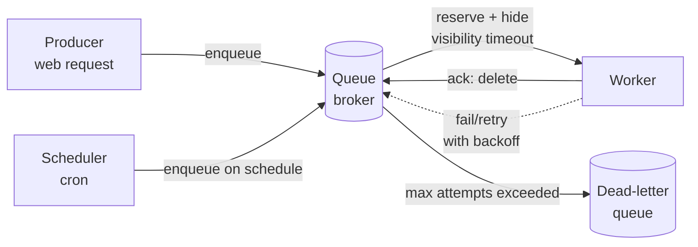

# Background jobs and schedulers

## Why this matters

It's a Tuesday afternoon and your support inbox is filling up. Customers are reporting that they were charged twice for the same order. You dig into the logs and find the culprit: your `chargeCustomer` job ran, called Stripe, succeeded — and then the worker process was killed by a deploy before it could acknowledge the job as done. The queue, seeing no acknowledgment, redelivered the job to another worker. Stripe got a second charge request. Two charges, one order, a chargeback fee, and a very awkward incident review.

Nothing here was a bug in the conventional sense. Every line of code did what it said. The failure lives in the seam between "the work happened" and "the system recorded that the work happened" — a seam that exists in every queue, every cron, every async worker you will ever run. Queues do not give you exactly-once delivery. They give you at-least-once delivery and a promise that you'll get a chance to make it idempotent. If you don't take that chance, you get double charges.

The other half of the same coin is the scheduler. A `cron` line that says "run the nightly report at 2am" looks harmless until the report starts taking three hours, the 2am run overlaps the next 2am run, and now you have report generators stacked on top of each other, all hammering the same database, until the box falls over. This chapter is about the small number of ideas — idempotency, retries with backoff, visibility timeouts, dead-letter handling, overlap prevention — that turn "jobs that mostly work" into "jobs you can sleep through a deploy with."

## Mental model

Push work async when the caller does not need the result to respond, or cannot afford to wait for it. Sending a welcome email, transcoding a video, recomputing a recommendation index, charging a card after checkout — none of these need to block the HTTP response. You write the intent (a job) to durable storage, return `202 Accepted`, and a separate worker process picks it up later. The web tier stays fast and the slow work runs where you can scale, retry, and rate-limit it independently.

The core architecture is three parts: producers enqueue jobs, a broker (Redis, SQS, RabbitMQ, a Postgres table) holds them durably, and workers pull and execute them. The single most important property to internalize is the **visibility timeout**: when a worker pulls a job, the broker doesn't delete it — it hides it for some window. If the worker acknowledges completion within the window, the job is deleted. If the worker crashes or the window expires first, the job becomes visible again and another worker picks it up. That redelivery is the source of every "job ran twice" story, and it is a feature, not a bug — it's how the system survives a worker dying mid-job.



Because redelivery is always possible, "exactly-once execution" is an illusion you construct on top of at-least-once delivery. You get it by making the job's *effect* idempotent: running the job twice with the same input produces the same end state as running it once. The delivery is at-least-once; the effect is once. That distinction is the whole game.

## In practice

The examples use [BullMQ](https://docs.bullmq.io/), a Redis-backed queue for Node, because it's the de-facto TypeScript choice and its API names the concepts directly. The patterns transfer to Sidekiq, Celery, SQS, or a hand-rolled Postgres queue without change.

### Enqueue and consume

A queue is a named channel. Producers add jobs to it; a worker binds a processor function to it.

```typescript
import { Queue, Worker } from "bullmq";

const connection = { host: "127.0.0.1", port: 6379 };

// Producer side — runs inside your web request handler.
const emailQueue = new Queue("email", { connection });

export async function onUserSignup(userId: string) {
  await emailQueue.add(
    "welcome",
    { userId },
    {
      attempts: 5,
      backoff: { type: "exponential", delay: 1000 },
      removeOnComplete: 1000, // keep last 1000 for inspection
      removeOnFail: 5000,
    },
  );
  // The HTTP handler returns now. The email sends later.
}

// Worker side — runs in a separate process, scaled independently.
new Worker(
  "email",
  async (job) => {
    const { userId } = job.data;
    await sendWelcomeEmail(userId); // must be idempotent — see below
  },
  { connection, concurrency: 10 },
);
```

`attempts: 5` with exponential backoff means a transient failure (SMTP timeout, rate limit) is retried at roughly 1s, 2s, 4s, 8s, 16s before the job is given up on. The web request that called `add` returned long ago.

### Retries with backoff and jitter

Exponential backoff prevents a flaky downstream from being hammered by retries. But naive exponential backoff has a trap: if 10,000 jobs all fail at the same instant (because a dependency went down), they all retry at exactly 1s, then exactly 2s — a synchronized thundering herd that re-DDoSes the recovering service. Add jitter so retries spread out.

```typescript
import { Worker } from "bullmq";

new Worker("email", processor, {
  connection,
  settings: {
    backoffStrategy: (attemptsMade: number) => {
      const base = 1000 * 2 ** attemptsMade; // exponential
      const jitter = Math.random() * base; // full jitter
      return base + jitter;
    },
  },
});
```

The "full jitter" strategy here is the one AWS recommends in their backoff-and-jitter analysis: it minimizes both total work and contention compared to fixed or equal-jitter schemes. Distinguish *retryable* errors (timeouts, 429s, 503s) from *terminal* ones (validation failure, 404 on a deleted resource). Retrying a terminal error five times just delays the inevitable and burns capacity — throw a non-retryable error to fail fast:

```typescript
import { UnrecoverableError } from "bullmq";

async function processor(job) {
  const user = await db.users.findById(job.data.userId);
  if (!user) {
    // The user was deleted. Retrying will never succeed.
    throw new UnrecoverableError(`user ${job.data.userId} not found`);
  }
  await sendWelcomeEmail(user);
}
```

### Idempotency: the exactly-once illusion

The double-charge incident from the opening is solved here. The fix is an **idempotency key**: a deterministic identifier for the unit of work, recorded atomically with the side effect, so a replay becomes a no-op.

The wrong way — check-then-act, with a race and no atomicity:

```typescript
// ANTI-PATTERN: not idempotent.
async function chargeOrder(orderId: string) {
  const order = await db.orders.findById(orderId);
  if (order.charged) return; // TOCTOU race: two workers both read `false`
  await stripe.charges.create({ amount: order.total });
  await db.orders.update(orderId, { charged: true }); // crash here -> recharge
}
```

Two workers can both pass the `if` before either writes. And if the process dies between the Stripe call and the DB update, the next attempt recharges. The right way uses the payment provider's own idempotency support *and* an atomic local guard:

```typescript
async function chargeOrder(orderId: string) {
  // 1. A deterministic key derived from the work, not random.
  const idempotencyKey = `charge:order:${orderId}`;

  // 2. Stripe dedupes server-side: same key within 24h returns the
  //    original charge instead of creating a new one.
  const charge = await stripe.charges.create(
    { amount: (await db.orders.findById(orderId)).total },
    { idempotencyKey },
  );

  // 3. Local guard: record the result keyed by orderId. UPSERT is atomic;
  //    a concurrent duplicate hits the unique constraint and no-ops.
  await db.query(
    `INSERT INTO order_charges (order_id, charge_id)
     VALUES ($1, $2)
     ON CONFLICT (order_id) DO NOTHING`,
    [orderId, charge.id],
  );
}
```

Now run the job twice, ten times, concurrently — Stripe creates exactly one charge and the database records exactly one row. The delivery is at-least-once; the effect is once. When the downstream has no idempotency support of its own, you provide the guard entirely on your side: a `processed_jobs` table keyed by `job.id`, written in the same transaction as the side effect, checked at the top of the processor.

### Scheduled jobs without the cron pile-up

Repeating jobs are how you replace OS `cron`. BullMQ's scheduler enqueues a job on a cron pattern; the same retry, idempotency, and visibility machinery then applies.

```typescript
await reportQueue.add(
  "nightly-report",
  {},
  {
    repeat: { pattern: "0 2 * * *", tz: "UTC" }, // 2am UTC daily
    // De-dupe overlapping runs: a run still in flight blocks the next.
    jobId: "nightly-report", // stable id => at most one queued at a time
  },
);
```

The pile-up failure is when run N+1 starts while run N is still going. Prevent it with one of three mechanisms, in order of preference:

1. **A stable `jobId`** so the scheduler won't enqueue a duplicate while one is pending.
2. **A distributed lock** the job acquires on start and releases on finish, so even across multiple worker hosts only one runs:

```typescript
async function nightlyReport(job) {
  // Redis SET NX with a TTL longer than the worst-case run time.
  const lock = await redis.set("lock:nightly-report", job.id, "NX", "EX", 4 * 3600);
  if (!lock) {
    job.log("previous run still active; skipping");
    return;
  }
  try {
    await generateReport();
  } finally {
    await redis.del("lock:nightly-report");
  }
}
```

3. **Idempotent design** so an accidental double-run is harmless anyway (the strongest guarantee — the lock is an optimization, not the correctness boundary).

### Dead-letter handling

After `attempts` is exhausted, a job is *failed*, not gone. In BullMQ it lands in a "failed" set; in SQS you configure a redrive policy to a separate dead-letter queue (DLQ). The DLQ is where you find the poison-pill jobs — the malformed payloads, the permanently-deleted referenced records — that no amount of retrying will fix. Monitor its depth, alert on it, and build a path to inspect, fix, and re-drive:

```typescript
import { Queue } from "bullmq";

const emailQueue = new Queue("email", { connection });

// Triage: list failed jobs and their reasons.
const failed = await emailQueue.getFailed(0, 100);
for (const job of failed) {
  console.log(job.id, job.failedReason, job.data);
}

// Re-drive after fixing the root cause (e.g. a downstream came back).
await Promise.all(failed.map((job) => job.retry()));
```

A DLQ that nobody watches is just a place where bugs go to hide. Wire its depth into your alerting (Part 9) on day one.

## Pitfalls and anti-patterns

**1. The non-idempotent job.** *Recognize it:* the processor performs a side effect (charge, email, external write) without a deterministic key or an atomic guard, so a replay repeats the effect. This is the single most common queue bug because everything looks fine until a worker dies at the wrong microsecond. *Fix it:* every job that mutates external state gets an idempotency key derived from its input, recorded atomically with the effect — a unique constraint, an UPSERT, or the downstream's own idempotency-key support. Assume every job runs at least twice and design so the second run is a no-op.

**2. The visibility-timeout undershoot.** *Recognize it:* a long job (video transcode, big export) gets redelivered and runs *concurrently with itself* on a second worker, often producing duplicate output or corrupt partial writes. The timeout is shorter than the job's real runtime, so the broker assumes the first worker died. *Fix it:* set the visibility timeout (SQS `VisibilityTimeout`, BullMQ `lockDuration`) above the realistic worst-case runtime, or have the worker periodically extend the lock (`job.extendLock()`) as a heartbeat. Better still, break the long job into smaller resumable steps.

**3. The cron pile-up.** *Recognize it:* a scheduled job's runtime creeps past its interval; runs overlap, contend for the same resources, and the slowdown compounds until something falls over at 2am. *Fix it:* enforce single-flight execution with a stable job id or a distributed lock with a TTL longer than the worst-case run, and alert when a run is skipped because the prior one is still active — that's your early warning that the job has outgrown its schedule.

**4. Retrying terminal errors.** *Recognize it:* the DLQ fills with jobs that failed validation or referenced a deleted record, each having burned five attempts and minutes of backoff before giving up. *Fix it:* classify errors at the throw site. Transient (timeout, 429, 503) → retry. Terminal (4xx that won't change, missing referenced row) → throw a non-retryable error (`UnrecoverableError`) so the job fails immediately and lands in the DLQ for human triage.

**5. Fat job payloads.** *Recognize it:* jobs carry entire objects — a full user record, a base64 image — in the payload. The broker (especially Redis or SQS with its 256KB limit) bloats, serialization is slow, and a schema change to the embedded object breaks in-flight jobs. *Fix it:* enqueue identifiers, not data. Put `{ userId }` in the job and have the worker fetch the current record. The job stays small, survives schema changes, and always operates on fresh data.

## Production checklist

- [ ] Every job that mutates external state has an idempotency key and an atomic guard (unique constraint / UPSERT / provider idempotency key)
- [ ] Retries use exponential backoff **with jitter**, not fixed delay
- [ ] Errors are classified: transient errors retry, terminal errors fail fast (non-retryable)
- [ ] Visibility timeout / lock duration exceeds worst-case job runtime, or the worker heartbeats to extend it
- [ ] A dead-letter queue exists, its depth is alerted on, and there's a documented re-drive runbook
- [ ] Scheduled jobs enforce single-flight (stable job id or distributed lock with TTL) and alert on skipped runs
- [ ] Job payloads carry identifiers, not full objects; payloads stay well under the broker's size limit
- [ ] Workers shut down gracefully on SIGTERM (finish or release in-flight jobs) so deploys don't orphan work mid-flight
- [ ] Queue depth, processing latency, and failure rate are dashboards, not afterthoughts (Part 9)
- [ ] Concurrency limits and rate limiters protect downstreams (third-party APIs, the database) from your worker fleet

## Exercises

1. **(Comprehension)** Explain in two or three sentences why a queue with at-least-once delivery cannot provide exactly-once *execution*, and what property a job must have for the *effect* to nonetheless happen exactly once. Name the broker mechanism that makes redelivery possible.

2. **(Applied)** Take the non-idempotent `chargeOrder` anti-pattern from this chapter and make it correct. Use a `processed_jobs` table keyed by job id, write the dedup row in the same database transaction as the side effect, and write a test that invokes the processor twice concurrently for the same order and asserts exactly one charge results. Then induce a crash between the side effect and the commit and confirm the retry is safe.

3. **(Design)** You run a nightly job that recomputes a 50-million-row recommendation index. It currently takes 90 minutes and is starting to overlap with the morning traffic ramp. Design a scheme that (a) prevents overlapping runs across a multi-host worker fleet, (b) makes the job resumable so a crash at minute 80 doesn't restart from zero, and (c) lets you safely run it more frequently than nightly later. Identify which guarantee you'd implement first and why, and where the idempotency boundary sits.

## Further reading

- Marc Brooker, AWS Architecture Blog — ["Exponential Backoff And Jitter"](https://aws.amazon.com/blogs/architecture/exponential-backoff-and-jitter/) — the canonical analysis of why full jitter wins.
- Amazon SQS Developer Guide — ["Amazon SQS visibility timeout"](https://docs.aws.amazon.com/AWSSimpleQueueService/latest/SQSDeveloperGuide/sqs-visibility-timeout.html) and the [dead-letter queue docs](https://docs.aws.amazon.com/AWSSimpleQueueService/latest/SQSDeveloperGuide/sqs-dead-letter-queues.html) — the reference semantics every queue imitates.
- Stripe API reference — ["Idempotent requests"](https://stripe.com/docs/api/idempotent_requests) — how a payments provider implements the dedup you should be using.
- BullMQ documentation — [Guide](https://docs.bullmq.io/guide/introduction) — jobs, repeatable jobs, flows, and rate limiting in the TypeScript ecosystem.
- Mike Perham, ["Sidekiq Best Practices"](https://github.com/sidekiq/sidekiq/wiki/Best-Practices) — "make your jobs idempotent and transactional" from the author of the most battle-tested job runner.
- Pat Helland, ["Idempotence Is Not a Medical Condition"](https://queue.acm.org/detail.cfm?id=2187821) (ACM Queue, 2012) — the deep treatment of why at-least-once plus idempotency is the durable design.

> **Connect the dots:** The idempotency-key-plus-atomic-guard pattern is the same outbox/inbox technique you use for reliable messaging across services (Part 5, Messaging and queues) and exactly the consistency reasoning that databases formalize as transactions and unique constraints (Part 6). The decision of *what* to push async, and how queues shed load from your request path, is a core system-design lever (Part 7), and the queue-depth and DLQ alerting above is your observability surface (Part 9).

> **Security note:** Job payloads are an injection and privilege surface that's easy to forget because the data never touches a browser. A worker often runs with broad credentials (database admin, internal service tokens), so a job whose payload is attacker-influenced — say, a `path` or `query` field that flows into a filesystem read or a SQL fragment — executes that injection with worker-level privilege, far from the request that created it. Treat every field of `job.data` as untrusted input: validate and type it at the top of the processor (Zod or equivalent), parameterize any query built from it, and never put secrets or PII in the payload itself, since brokers like Redis and SQS persist and replicate jobs in plaintext and they'll show up in your queue dashboards and DLQ dumps. Scope worker credentials to exactly the operations the job needs.
