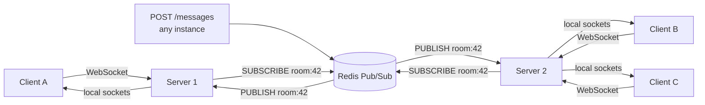

# Real-time and streaming

## Why this matters

It's a Tuesday afternoon and your team just shipped the new collaborative editor. Two engineers test it locally and it works flawlessly: User A types, User B sees the cursor move in real time over a WebSocket. You deploy to production behind an autoscaler, and within an hour the support queue fills up. "Messages don't show up." "I have to refresh to see edits." "Presence shows my coworker offline when he's right next to me."

You SSH into one box and tail the logs. The WebSocket connections are alive. Broadcasts are firing. So why is half the team not getting them? Then it clicks: you're running four instances behind a load balancer. User A's socket landed on instance 1; User B's socket landed on instance 3. Your broadcast loop iterates over `this.connections` — an in-memory array on a single process — and instance 1 has no idea instance 3 even exists. Each box is shouting into its own empty room.

The fix is not a bigger box. It's understanding that a real-time system has *connection state that lives on one machine* and *events that must reach machines that don't hold the connection*. Get the transport choice right (WebSocket vs. SSE vs. long polling), get the fan-out right (a pub/sub layer the connections subscribe to), and get the lifecycle right (heartbeats, reconnection, presence), and the system that broke in an hour runs for months. This chapter is about all three.

## Mental model

A real-time system has three layers, and most outages come from confusing them:

1. **Transport** — the wire protocol between browser and server. WebSocket (full duplex), Server-Sent Events (server→client only), or long polling (HTTP request that hangs until there's data). This is a per-connection concern.
2. **Connection state** — which user is attached to which socket on which process. This is *stateful and machine-local*. A socket is a file descriptor on one box; it cannot be load-balanced after the handshake.
3. **Fan-out** — getting an event produced anywhere (an HTTP POST on instance 1, a Kafka consumer, a cron job) to every connection that cares, regardless of which process holds it. This is the layer that must cross process boundaries.

The naive design collapses layers 2 and 3 into a single in-memory list. That works on one process and breaks on two. The correct design keeps connection state local but routes fan-out through a shared broker:



Each server still owns its own sockets. But instead of broadcasting to its local list, it *publishes* to a channel, and *every* server subscribed to that channel pushes to whatever local sockets it holds. The broker (Redis here, but Kafka, NATS, or Postgres `LISTEN/NOTIFY` work too) is the only thing that knows about all instances. Connection state stays sharded; events fan out globally.

Choosing the transport is the other half of the model:

| | WebSocket | Server-Sent Events | Long polling |
|---|---|---|---|
| Direction | Bidirectional | Server → client only | Client-initiated, one response |
| Protocol | `ws://` upgrade from HTTP | Plain HTTP, `text/event-stream` | Plain HTTP |
| Auto-reconnect | You build it | Built into `EventSource` | Trivial (just re-request) |
| Proxies/firewalls | Occasionally blocked | Always works (it's HTTP) | Always works |
| Binary frames | Yes | No (UTF-8 text only) | Yes |
| Overhead per message | ~2–6 bytes | HTTP-ish framing | Full HTTP request each time |
| Best for | Chat, games, collab editing | Live feeds, notifications, LLM token streams | Legacy fallback only |

The opinionated default: **SSE for server-push-only feeds, WebSocket when the client also streams, long polling only as a fallback.** SSE is wildly underused — it's plain HTTP, survives proxies, reconnects itself, and is exactly right for notification feeds, dashboards, and streaming LLM tokens. Reach for WebSocket when you genuinely need the client→server channel (typing indicators, cursor positions, game input). Long polling is a compatibility floor, not a design choice.

## In practice

### The naive broadcast that breaks across instances

Here's the version that passes local testing and fails in production. A minimal WebSocket chat server holding connections in process memory:

```typescript
import { WebSocketServer, WebSocket } from "ws";

const wss = new WebSocketServer({ port: 8080 });

// PROBLEM: this Set lives in ONE process. Other instances can't see it.
const room = new Set<WebSocket>();

wss.on("connection", (socket) => {
  room.add(socket);

  socket.on("message", (data) => {
    const text = data.toString();
    // Broadcast to everyone... on THIS instance only.
    for (const peer of room) {
      if (peer.readyState === WebSocket.OPEN) peer.send(text);
    }
  });

  socket.on("close", () => room.delete(socket));
});
```

Run one instance and it's perfect. Put two behind a load balancer and a message sent to instance 1 never reaches the clients on instance 2. There's no error, no log line — just silent message loss that scales with your instance count. This is the single most common real-time bug in production.

### The pub/sub fix

The fix keeps the local `Set` (you still need it — those are the actual sockets you can write to) but replaces the local broadcast loop with a publish, and adds a subscriber that pushes to local sockets when *any* instance publishes:

```typescript
import { WebSocketServer, WebSocket } from "ws";
import { createClient } from "redis";

const wss = new WebSocketServer({ port: 8080 });
const room = new Set<WebSocket>(); // local sockets on THIS instance

// Two connections: pub/sub clients can't issue normal commands.
const pub = createClient({ url: process.env.REDIS_URL });
const sub = pub.duplicate();
await Promise.all([pub.connect(), sub.connect()]);

// When ANY instance publishes, push to every local socket here.
await sub.subscribe("room:general", (message) => {
  for (const peer of room) {
    if (peer.readyState === WebSocket.OPEN) peer.send(message);
  }
});

wss.on("connection", (socket) => {
  room.add(socket);

  socket.on("message", (data) => {
    // Don't broadcast locally. Publish — the subscriber fans out everywhere.
    pub.publish("room:general", data.toString());
  });

  socket.on("close", () => room.delete(socket));
});
```

The crucial detail: **the sender's own instance also receives its publish back through the subscription**, so it delivers to its local sockets too. There is exactly one fan-out path, and it's the same for the local and remote case. No special-casing, no "also broadcast locally" branch to forget.

For per-room isolation, subscribe and publish on channels like `room:42`. Redis pattern subscriptions (`psubscribe room:*`) let one subscription handle many rooms, but at high room counts prefer one channel per active room and unsubscribe when a room empties, so a server only receives traffic for rooms it actually holds connections for.

> A note on Redis Pub/Sub semantics: it is fire-and-forget. If a subscriber is briefly disconnected, it misses messages — there is no replay. That's fine for cursor positions and presence (the next update corrects it) but wrong for chat history. Persist messages to a durable store (Postgres, see Part 6) on the write path, and use Pub/Sub only for the live push. On reconnect, the client fetches missed messages by ID from the durable store. For replayable streams, use Redis Streams or Kafka instead.

### Server-Sent Events, when you only push down

If clients never need to stream *up*, SSE is dramatically simpler and more robust. No upgrade handshake, no framing library, automatic reconnection with `Last-Event-ID` for resuming:

```typescript
import express from "express";
import { createClient } from "redis";

const app = express();
const sub = createClient({ url: process.env.REDIS_URL });
await sub.connect();

app.get("/feed/:room", async (req, res) => {
  res.writeHead(200, {
    "Content-Type": "text/event-stream",
    "Cache-Control": "no-cache",
    Connection: "keep-alive",
  });
  res.write("retry: 3000\n\n"); // tell EventSource to reconnect after 3s

  const channel = `room:${req.params.room}`;
  const listener = (msg: string) => {
    // id: lets the browser resume via Last-Event-ID after a drop
    res.write(`id: ${Date.now()}\ndata: ${msg}\n\n`);
  };
  await sub.subscribe(channel, listener);

  // Heartbeat: a comment line keeps proxies from killing an idle connection.
  const hb = setInterval(() => res.write(": ping\n\n"), 15000);

  req.on("close", () => {
    clearInterval(hb);
    sub.unsubscribe(channel, listener);
  });
});
```

On the browser the entire client is:

```typescript
const es = new EventSource("/feed/general");
es.onmessage = (e) => console.log("got", e.data);
// Reconnection, backoff, and Last-Event-ID resume are handled for you.
```

That last comment is the point. With SSE you get reconnection for free; with WebSocket you build it yourself.

### Heartbeats, reconnection, and backoff for WebSocket

WebSocket connections die silently. A laptop sleeps, a phone switches from WiFi to LTE, a load balancer reaps an idle connection — and neither end gets a clean close. You detect the dead connection with a ping/pong heartbeat, and the client recovers with reconnection plus exponential backoff and jitter:

```typescript
// Server: detect dead connections with WebSocket protocol-level ping.
const interval = setInterval(() => {
  for (const ws of wss.clients) {
    const c = ws as WebSocket & { isAlive?: boolean };
    if (c.isAlive === false) return ws.terminate(); // missed last pong → dead
    c.isAlive = false;
    ws.ping();
  }
}, 30000);
wss.on("connection", (ws) => {
  (ws as any).isAlive = true;
  ws.on("pong", () => ((ws as any).isAlive = true));
});
```

```typescript
// Client: reconnect with exponential backoff + jitter to avoid a thundering herd.
function connect(attempt = 0) {
  const ws = new WebSocket(url);
  ws.onopen = () => (attempt = 0);
  ws.onclose = () => {
    const base = Math.min(1000 * 2 ** attempt, 30000); // cap at 30s
    const delay = base / 2 + Math.random() * (base / 2); // full jitter
    setTimeout(() => connect(attempt + 1), delay);
  };
  return ws;
}
```

The jitter matters more than it looks. If your service restarts and 50,000 clients all reconnect at exactly 1s, then 2s, then 4s, you've built a self-inflicted DDoS that hammers your auth and Redis on every reconnect wave. Jitter spreads the herd. (See Part 8 for the deployment side of graceful restarts.)

### Presence

Presence — "who's online" — is a TTL key, not a boolean. Storing `online: true` on connect and `false` on disconnect leaks state the moment a process crashes without firing the disconnect handler. Instead, write a key with an expiry and refresh it on each heartbeat:

```typescript
// On connect and on every heartbeat (~every 25s, TTL 30s):
await redis.set(`presence:user:${userId}`, instanceId, { EX: 30 });
// "Online" = key exists. Crash, sleep, or network drop → key expires → offline.
// No cleanup handler required; absence is the source of truth.
```

For a presence *list* per room, use a sorted set scored by last-seen timestamp and trim anything older than the TTL window. Absence-by-expiry is self-healing; explicit-offline-flags are not.

### Sticky sessions

Because a WebSocket is bound to one process after the handshake, the load balancer must keep a given connection on the same instance for its lifetime — that's a *sticky session* (cookie- or IP-hash-based). Note that stickiness applies to the *connection*, not the user: pub/sub already handles cross-instance fan-out, so you do **not** need all of a user's tabs on the same box. SSE and long polling need stickiness too, since each carries server-side stream state. Configure it at the LB (`sessionAffinity`/`affinity: ClientIP` in Kubernetes, `stickiness` on an ALB target group) or connections will bounce between instances and break.

## Pitfalls and anti-patterns

**In-memory broadcast across instances.** The opening bug. You hold connections in a process-local list and broadcast by iterating it. *Recognize it:* messages work with one instance, silently drop with more than one; it looks fine in staging (single box) and breaks in prod. *Fix it:* route every broadcast through a shared broker (Redis Pub/Sub, NATS, Kafka) that all instances subscribe to. Never iterate a local list as your only fan-out path.

**Treating Pub/Sub as durable.** Redis Pub/Sub drops messages to any subscriber that isn't connected at publish time. *Recognize it:* messages vanish during deploys, brief network blips, or reconnection gaps; chat history has holes. *Fix it:* persist on the write path to a durable store and treat Pub/Sub as a best-effort live notification only. On reconnect, the client requests everything after its last seen ID. Use Redis Streams or Kafka when you need replay.

**Presence as a boolean flag.** Setting `online=true`/`false` on connect/disconnect. *Recognize it:* "ghost" users shown online forever after a crash, or shown offline while clearly active. *Fix it:* presence is a TTL key refreshed by heartbeat; online means "key still exists." Absence is the truth, not an explicit flag.

**Reconnect storms with no jitter.** After a deploy, every client reconnects on the same synchronized backoff schedule. *Recognize it:* CPU and Redis spike in sharp periodic waves after any restart; auth service buckles on reconnect. *Fix it:* exponential backoff *with full jitter* and a sensible cap (~30s). Spread the herd across time.

**Unbounded connections and slow consumers.** Each socket costs a file descriptor and a send buffer. A client that reads slowly (or maliciously stalls) makes the server buffer outbound messages until it OOMs. *Recognize it:* memory climbs with connection count; one bad client degrades everyone. *Fix it:* cap connections per instance, raise the FD `ulimit` deliberately, set per-socket buffer limits, and drop (or disconnect) clients whose backpressure exceeds a threshold rather than buffering forever.

## Production checklist

- [ ] Fan-out goes through a shared broker (Redis Pub/Sub, NATS, Kafka) — never a process-local list
- [ ] Durable store on the write path; Pub/Sub used only for live push; clients resync missed events by ID on reconnect
- [ ] Sticky sessions configured at the load balancer for the connection's lifetime
- [ ] Server-side heartbeat (ping/pong for WS, comment lines for SSE) terminates dead connections
- [ ] Client reconnection uses exponential backoff with full jitter, capped (~30s)
- [ ] Presence implemented as TTL keys refreshed by heartbeat, never boolean flags
- [ ] Per-instance connection limit, raised FD `ulimit`, and per-socket send-buffer/backpressure limits
- [ ] Auth on the upgrade/initial request — token validated before the socket is accepted, with re-validation on long-lived connections
- [ ] Origin (`Origin` header) checked on WebSocket handshakes to prevent cross-site hijacking
- [ ] Graceful shutdown drains connections (send a "reconnect soon" close, let jitter spread the herd) before the process exits
- [ ] Message size limits and per-connection rate limits enforced (see Part 5, Rate limiting)
- [ ] SSE chosen over WebSocket wherever the client only consumes

## Exercises

1. **(Comprehension)** Explain why the naive in-memory broadcast works with one instance but silently drops messages with two, and why the sender's own instance still delivers correctly in the Redis Pub/Sub version. Identify exactly which layer (transport, connection state, fan-out) each design gets wrong or right.

2. **(Applied)** Take the naive WebSocket server from this chapter, run two instances behind a local load balancer (e.g., `nginx` with `ip_hash`), and reproduce the dropped-message bug with two browser tabs. Then convert it to the Redis Pub/Sub version and confirm cross-instance delivery. Add a heartbeat and verify that killing one instance does not leave the other's clients stuck. Bonus: add presence as a TTL key and watch a user go "offline" 30s after you `kill -9` their instance.

3. **(Design)** Design the real-time layer for a collaborative document editor expected to reach 1 million concurrent connections across thousands of documents. Decide: transport (and why), how to shard connections and fan-out (single Redis vs. cluster vs. Kafka partitions per document), how presence and cursor positions stay consistent without overwhelming the broker, how you handle a 10,000-client reconnect storm during a rolling deploy, and where document state is persisted versus merely pushed. State your tradeoffs and what you'd build first.

## Further reading

- RFC 6455, [The WebSocket Protocol](https://datatracker.ietf.org/doc/html/rfc6455) — the framing, handshake, and close semantics, straight from the source
- [Server-Sent Events](https://html.spec.whatwg.org/multipage/server-sent-events.html), WHATWG HTML Living Standard — the `EventSource` API, `Last-Event-ID`, and reconnection behavior
- AWS Architecture Blog, ["Exponential Backoff And Jitter"](https://aws.amazon.com/blogs/architecture/exponential-backoff-and-jitter/) — why full jitter beats naive backoff, with simulations
- Redis docs, [Pub/Sub](https://redis.io/docs/latest/develop/interact/pubsub/) and [Streams](https://redis.io/docs/latest/develop/data-types/streams/) — the fire-and-forget vs. durable-replay distinction that decides your fan-out design
- Martin Kleppmann, *Designing Data-Intensive Applications*, Ch. 11 "Stream Processing" — the rigorous treatment of streams, replay, and delivery guarantees behind everything in this chapter

> **Connect the dots:** Real-time fan-out sits on top of nearly every other Part. The durable write path is a database concern (Part 6); the broker choice (Redis vs. Kafka vs. NATS) and partitioning strategy is system design (Part 7); sticky sessions, graceful connection draining, and rolling deploys are DevOps (Part 8); tracking connection counts, message lag, and reconnect-storm waves is observability (Part 9); and streaming LLM tokens to the browser over SSE is the transport behind most AI chat UIs (Part 12).

> **Security note:** A WebSocket handshake is an HTTP `Upgrade` request, and it is **not** protected by the same-origin policy or CORS — a malicious page on another origin can open a WebSocket to your server, and if you authenticate purely via cookies, the browser will attach them automatically. This is Cross-Site WebSocket Hijacking. Defend with two controls: validate the `Origin` header on the handshake against an allowlist, and authenticate with a token (passed in the connect message or a short-lived query param, not just an ambient cookie). For long-lived connections, re-validate the token periodically and force a reconnect when it expires, so a revoked session can't stream forever. See Part 10 for the broader auth model.
