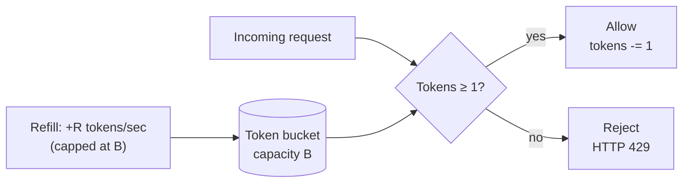

# Rate limiting and quotas

## Why this matters

It's a Tuesday afternoon and your payments API is timing out. Not down — timing out. p99 latency has climbed from 80ms to 9 seconds, the database connection pool is saturated, and Datadog shows one customer's API key accounting for 71% of all requests. They shipped a retry loop with no backoff, hit a transient 500, and now their fleet is hammering you 40,000 times a minute. Your other 3,000 customers are getting the slow, sad version of your product because one of them wrote a `while (true)`.

You scale up the pods. The retries scale up with you. You add a database read replica. The replica saturates too. None of this helps, because the problem was never capacity — it was that you let a single caller consume an unbounded share of a shared resource. The fix is one you could have shipped months ago: a rate limiter that returns `429 Too Many Requests` to the abusive key and leaves everyone else untouched.

Rate limiting is the cheapest insurance in backend engineering. It protects upstream systems you don't control (a third-party API with its own limits, a database that falls over at 5,000 QPS), it enforces fairness across tenants, it caps the blast radius of bugs and abuse, and it turns "infinite usage" into "billable usage" for your quota tiers. The engineers who treat it as an afterthought discover it during an incident. The ones who understand the algorithms ship it as a middleware before launch and forget it exists. This chapter is about being in the second group.

## Mental model

A rate limiter answers one question on every request: *has this caller exceeded their allowed rate?* The caller is identified by a **key** — an API key, a user ID, an IP address — and the "allowed rate" is some number of requests per unit of time. The interesting part is *how you count*, because the naive counter has a nasty failure mode.

There are five classic algorithms. They trade memory, accuracy, and burst behavior:

| Algorithm | Memory per key | Allows bursts? | Boundary accuracy |
|---|---|---|---|
| **Fixed window** | 1 counter | Yes (at edges) | Poor — 2x burst at window boundary |
| **Sliding window log** | N timestamps | No | Exact |
| **Sliding window counter** | 2 counters | Smoothed | Very good, approximate |
| **Token bucket** | 1 count + 1 timestamp | Yes (controlled) | Good |
| **Leaky bucket** | 1 queue/count | No (smooths output) | Good |

The mental model that matters most is **token bucket**, because it captures the two things real systems actually want: a steady allowed *rate* and a tolerance for short *bursts*. Picture a bucket that holds up to `B` tokens and refills at `R` tokens per second. Each request removes one token. If the bucket is empty, the request is rejected. A client that's been idle accumulates up to `B` tokens and can spend them in a burst; a client at steady state is limited to `R`.



Contrast that with the **fixed window** counter, which is the one everyone reaches for first and the one that bites. You bucket time into fixed intervals (say, per-minute) and keep one integer per key per window. It's trivially cheap. But because the counter resets hard at the window boundary, a client can send the full limit at `:59` and the full limit again at `:00` — double the intended rate in a two-second span. That burst is exactly what takes down the upstream you were trying to protect. We'll see it happen, then fix it.

## In practice

### The fixed-window limiter, and its burst problem

Here's the naive version. In-memory, single process, one counter per key per minute:

```typescript
type Window = { count: number; resetAt: number };
const windows = new Map<string, Window>();

function fixedWindowAllow(key: string, limit: number): boolean {
  const now = Date.now();
  const windowMs = 60_000;
  const w = windows.get(key);

  if (!w || now >= w.resetAt) {
    windows.set(key, { count: 1, resetAt: now - (now % windowMs) + windowMs });
    return true;
  }
  if (w.count < limit) {
    w.count += 1;
    return true;
  }
  return false; // over limit
}
```

With `limit = 100` per minute, watch what a client can do across a window boundary:

```text
11:00:59.500  →  sends 100 requests  →  all allowed (window A fills to 100)
11:01:00.100  →  sends 100 requests  →  all allowed (window B resets to 0)
```

That's 200 requests in 600 milliseconds against a "100 per minute" limit. The limiter reported full compliance. Your upstream saw a 2x burst. The fixed window is honest about averages and lies about bursts, and bursts are what cause incidents.

### Token bucket, which controls the burst

Token bucket fixes this by making burst capacity an explicit parameter (`B`) separate from the sustained rate (`R`). You decide how much burst you can tolerate instead of inheriting an accidental 2x at every boundary.

```typescript
type Bucket = { tokens: number; lastRefill: number };
const buckets = new Map<string, Bucket>();

function tokenBucketAllow(
  key: string,
  capacity: number,   // B: max tokens
  refillPerSec: number // R: sustained rate
): boolean {
  const now = Date.now();
  const b = buckets.get(key) ?? { tokens: capacity, lastRefill: now };

  // Refill based on elapsed time, capped at capacity.
  const elapsedSec = (now - b.lastRefill) / 1000;
  b.tokens = Math.min(capacity, b.tokens + elapsedSec * refillPerSec);
  b.lastRefill = now;

  if (b.tokens >= 1) {
    b.tokens -= 1;
    buckets.set(key, b);
    return true;
  }
  buckets.set(key, b);
  return false;
}
```

Note there's no background timer refilling buckets. Refill is computed lazily from elapsed time on each request — cheaper and exact. A client allowed `R = 100/min` with `B = 100` can burst 100 immediately, then settles to one request roughly every 600ms. The boundary-doubling problem is gone because there is no boundary.

**Leaky bucket** is token bucket's mirror: instead of tokens accumulating for the client to spend, requests drip out of a queue at a fixed rate. It produces a perfectly smooth *output* rate (good when the thing downstream hates bursts — a legacy mainframe, an SMS gateway), at the cost of queuing latency and no burst allowance. If you want smooth output, pick leaky bucket; if you want to permit controlled bursts, pick token bucket. For general API protection, token bucket is the default and the one I reach for.

### Sliding window counter, when you want accuracy without the memory

The **sliding window log** keeps a timestamp for every request and counts how many fall in the trailing window. It's exact and rejects bursts perfectly, but storing N timestamps per key is expensive at scale. The **sliding window counter** approximates it with just the current and previous window counts, weighting the previous window by how much of it still overlaps:

```typescript
// estimate = current + previous * (overlap fraction of previous window)
const elapsedInCurrent = (now % windowMs) / windowMs;
const estimate = currentCount + previousCount * (1 - elapsedInCurrent);
if (estimate < limit) { /* allow */ }
```

This smooths the boundary, uses two integers per key, and is what Cloudflare described running at scale. It's the right pick when you need tighter accuracy than fixed window but can't afford a full log.

### Distributed rate limiting with Redis

Everything above assumed one process. In production you have N stateless app servers behind a load balancer, and a per-process `Map` means a client gets `N × limit` — the limit silently multiplies by your replica count. The counter has to live in a shared store. Redis is the standard answer: fast, atomic, and everyone can reach it.

The trap is the **read-modify-write race**. If you `GET` the counter, increment in app code, then `SET` it, two servers can both read 99, both write 100, and both allow the request. You need the check-and-decrement to be atomic. Redis gives you two clean ways.

The simplest correct fixed-window limiter uses `INCR` with an `EXPIRE`, where `INCR` is atomic:

```typescript
import { createClient } from "redis";
const redis = createClient();

async function redisFixedWindow(key: string, limit: number, windowSec: number) {
  const bucket = `rl:${key}:${Math.floor(Date.now() / 1000 / windowSec)}`;
  const count = await redis.incr(bucket);
  if (count === 1) await redis.expire(bucket, windowSec);
  return count <= limit;
}
```

That's correct for fixed window but inherits the boundary burst, and the `INCR`/`EXPIRE` pair has a subtle hole: if the process dies between them, the key never expires and leaks. For token bucket — which needs to read tokens, compute refill, conditionally decrement, and write back, all atomically — you want a **Lua script**, which Redis executes as a single uninterruptible unit:

```lua
-- token_bucket.lua
-- KEYS[1] = bucket key
-- ARGV: capacity, refill_per_sec, now_ms, requested
local key       = KEYS[1]
local capacity  = tonumber(ARGV[1])
local refill    = tonumber(ARGV[2])
local now       = tonumber(ARGV[3])
local requested = tonumber(ARGV[4])

local data      = redis.call("HMGET", key, "tokens", "ts")
local tokens    = tonumber(data[1]) or capacity
local last      = tonumber(data[2]) or now

local elapsed   = math.max(0, now - last) / 1000.0
tokens          = math.min(capacity, tokens + elapsed * refill)

local allowed = 0
if tokens >= requested then
  tokens  = tokens - requested
  allowed = 1
end

redis.call("HSET", key, "tokens", tokens, "ts", now)
redis.call("PEXPIRE", key, math.ceil(capacity / refill * 1000))
return { allowed, math.floor(tokens) }
```

Called from the app, it returns whether the request is allowed plus tokens remaining (useful for response headers):

```typescript
const script = /* contents of token_bucket.lua */;
async function allow(key: string) {
  const [allowed, remaining] = (await redis.eval(script, {
    keys: [`tb:${key}`],
    arguments: ["100", "1.667", String(Date.now()), "1"], // B=100, R=100/min
  })) as [number, number];
  return { allowed: allowed === 1, remaining };
}
```

The script runs server-side in Redis, atomically, so no two app servers can race. The `PEXPIRE` reclaims memory for idle keys automatically. This pattern — Lua for atomic multi-step state transitions — is the production-grade distributed limiter, and it's what libraries like `rate-limiter-flexible` and the GCRA-based ones use under the hood.

### Choosing the key: per-user vs. per-IP vs. per-API-key

The algorithm decides *how* you count; the key decides *what* you count. Get the key wrong and a correct algorithm protects the wrong thing.

- **Per-API-key / per-user** is the right default for authenticated APIs. It maps cleanly to quotas and billing tiers, and one abusive tenant can't affect another. This is what you enforce your "10,000 requests/day on the Pro plan" with.
- **Per-IP** is for unauthenticated traffic — login, signup, password reset, public endpoints — where there's no key yet. But IPs are shared: an entire office or a mobile carrier's NAT can sit behind one address, so a tight per-IP limit punishes innocents, and attackers rotate IPs cheaply. Use it as a coarse abuse floor, not your primary control.
- **Composite keys** (`user:123:endpoint:POST /messages`) let you set different limits per route — a cheap `GET` gets a high limit, an expensive `POST /export` gets a low one.

Most mature APIs layer all three: a generous per-IP floor for unauthenticated edges, per-key quotas for billing, and per-route limits on expensive operations.

### Returning 429 correctly

When you reject, say so in a way clients can act on. RFC 6585 defines `429 Too Many Requests`, and RFC 9110 defines `Retry-After`. Send both, plus the de-facto-standard `RateLimit-*` headers so well-behaved clients can self-throttle *before* hitting the wall:

```http
HTTP/1.1 429 Too Many Requests
Retry-After: 12
RateLimit-Limit: 100
RateLimit-Remaining: 0
RateLimit-Reset: 12
Content-Type: application/json

{"error": "rate_limited", "message": "Quota exceeded. Retry after 12 seconds."}
```

`Retry-After` can be a number of seconds or an HTTP date. A client that respects it will back off cleanly; a client that ignores it (the one from the opening scenario) at least gets cheap rejections instead of consuming real work. Crucially, a 429 response must be *cheap* — reject before touching the database or upstream, or your limiter becomes a second source of load during an attack.

## Pitfalls and anti-patterns

**1. The replica-multiplied limit.** You set "100/min per key" and ship it as an in-process counter. With 8 app pods, each pod independently allows 100, so the real limit is 800/min — and it changes every time autoscaling adds a pod. *Recognize it:* observed throughput is a clean multiple of your configured limit. *Fix it:* move the counter to a shared store (Redis) with atomic operations. Per-process limiting is only correct for a single instance or as a coarse local pre-filter in front of a shared limiter.

**2. The read-modify-write race.** `GET` the count, increment in app code, `SET` it back. Under concurrency, two requests read the same value and both write the incremented one, so the limit leaks past its ceiling under exactly the high-load conditions you care about. *Recognize it:* limit is respected under light load, breached under bursts. *Fix it:* use atomic primitives — `INCR`, or a Lua script for multi-step logic. Never do the arithmetic in app code.

**3. The fixed-window boundary burst.** Covered above: a fixed-window limiter permits up to 2x the limit across a window boundary. *Recognize it:* upstream sees spikes at clean minute boundaries even though your counter never reports an overage. *Fix it:* switch to sliding window counter or token bucket, both of which eliminate the discontinuity.

**4. Fail-closed when Redis blips.** Your limiter calls Redis on every request. Redis has a 2-second hiccup. If your code treats "can't reach Redis" as "deny," your entire API returns 429 during a cache blip — you've converted a dependency wobble into a full outage. *Recognize it:* total-outage incidents correlated with Redis latency, not traffic. *Fix it:* decide the failure mode deliberately. For protecting fragile upstreams, fail-closed may be right; for general availability, fail-open (allow on limiter error) with a short timeout and a circuit breaker is usually safer. Make it a conscious, logged choice.

**5. Counting the wrong unit.** You limit "requests," but one client's requests are `GET /health` and another's are `POST /export-everything`. Equal request counts, wildly unequal load. *Recognize it:* a customer well under their request quota still melts a backend. *Fix it:* charge variable token costs (a token-bucket request can cost `N` tokens), or limit a more meaningful unit — compute-seconds, rows scanned, bytes — for expensive endpoints.

## Production checklist

- [ ] Limiter state lives in a shared store (Redis) for any multi-instance deployment, not in process memory
- [ ] Counter mutations are atomic (`INCR` or Lua script); no read-modify-write in app code
- [ ] Algorithm chosen deliberately: token bucket for controlled bursts, sliding window for accuracy, leaky bucket for smooth output
- [ ] Burst capacity (`B`) and sustained rate (`R`) are separate, documented parameters
- [ ] Keying strategy layered: per-IP floor for unauth, per-key/per-user for quotas, per-route for expensive endpoints
- [ ] 429 responses include `Retry-After` and `RateLimit-*` headers, and are cheap (no DB/upstream hit on reject)
- [ ] Failure mode on limiter-store unavailability is explicit (fail-open vs. fail-closed) with a timeout and circuit breaker
- [ ] Idle keys expire (`PEXPIRE`/`EXPIRE`) so the store doesn't grow unbounded
- [ ] Limits are configurable per tier/plan without a deploy (config or feature flag)
- [ ] Metrics: allow/deny counts and remaining-quota distribution per key, alerting on sustained deny spikes (early abuse signal)
- [ ] Variable token cost for expensive operations, not a flat per-request count

## Exercises

1. **(Comprehension)** With a fixed-window limiter set to 100 requests/minute, describe the exact request pattern that pushes 200 requests through in a two-second span, and explain why the limiter reports no violation. Then state precisely which property of token bucket eliminates this.

2. **(Applied)** Implement the Lua token-bucket limiter from this chapter against a local Redis (`docker run -p 6379:6379 redis`). Write a load test that fires 200 requests as fast as possible at a bucket with `B=100, R=10/sec`, and confirm exactly ~100 are allowed immediately and the rest trickle through at ~10/sec. Add `RateLimit-Remaining` to your responses using the script's return value.

3. **(Design)** You run a multi-tenant API with three plan tiers (Free: 1k/day, Pro: 100k/day, Enterprise: custom), a mix of cheap reads and expensive exports, and a fragile third-party provider you proxy that allows you only 50 QPS total. Design the full limiting strategy: which algorithm(s), what keys, how daily quotas coexist with per-second protection of the upstream, what you return on each kind of rejection, and what your failure mode is when Redis is unreachable. Justify each tradeoff.

## Further reading

- RFC 6585, [*Additional HTTP Status Codes*](https://datatracker.ietf.org/doc/html/rfc6585) — defines `429 Too Many Requests` (Section 4)
- RFC 9110, [*HTTP Semantics*](https://datatracker.ietf.org/doc/html/rfc9110#name-retry-after) — `Retry-After` header semantics
- IETF Draft, [*RateLimit header fields for HTTP*](https://datatracker.ietf.org/doc/html/draft-ietf-httpapi-ratelimit-headers) — the standardizing `RateLimit-Limit/Remaining/Reset` headers
- Cloudflare Engineering, ["How we built rate limiting capable of scaling to millions of domains"](https://blog.cloudflare.com/counting-things-a-lot-of-different-things/) — the sliding-window-counter approximation in production
- Redis docs, [*Rate limiting patterns*](https://redis.io/docs/latest/develop/use-cases/rate-limiting/) and [EVAL / Lua scripting](https://redis.io/docs/latest/develop/interact/programmability/eval-intro/)
- GCRA: Brandon Checketts, ["Generic Cell Rate Algorithm"](https://en.wikipedia.org/wiki/Generic_cell_rate_algorithm) — the leaky-bucket variant behind many production limiters (e.g. `throttled`, Stripe's approach)

> **Connect the dots:** Rate limiting sits at the seam of several Parts. The shared Redis counter is the same primitive you'll meet in Part 6 (Databases) when reasoning about atomicity and in Part 5's caching chapter. The fail-open/fail-closed decision and circuit breakers are core Part 7 (System Design) resilience patterns. The allow/deny metrics and deny-spike alerting belong to Part 9 (Observability), where a sustained 429 spike is one of the earliest abuse signals you'll get. And per-tier quotas are where backend engineering meets product billing.

> **Security note:** A rate limiter is a security control, and attackers probe it directly. Two specific risks: first, never trust a client-supplied IP from `X-Forwarded-For` without validation — if you key per-IP on a spoofable header, an attacker spoofs a fresh IP per request and bypasses the limit entirely. The leftmost entry in `X-Forwarded-For` is the value the *client* sent and is fully attacker-controlled; the trustworthy address is the one your own proxy appended on the right. Count back exactly the number of trusted proxy hops from the rightmost entry, and configure your framework's `trust proxy` setting to that exact hop count rather than blindly trusting the header. Second, the rejection path itself must be cheap and constant-cost: if generating a 429 does more work (a DB lookup, a log write with stack capture) than serving the real request, the limiter becomes a denial-of-service amplifier — attackers send traffic *designed* to be rejected. Reject early, reject cheaply, and put unauthenticated endpoints (login, password reset) behind a strict per-IP limit to blunt credential-stuffing and enumeration attacks.
