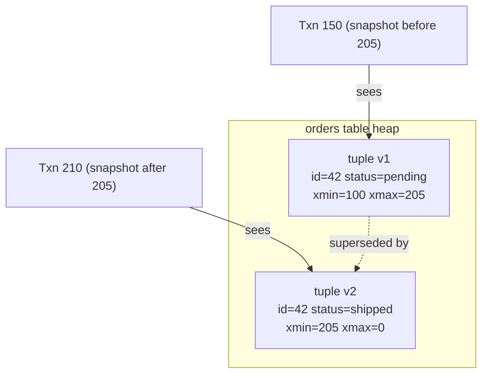

# PostgreSQL deeply

## Why this matters

It's a Tuesday afternoon and the `/dashboard` endpoint just crossed several seconds at p95, where it used to answer in tens of milliseconds. Nothing changed in the code. The on-call engineer pulls up the slow query log and finds the culprit: a query that filters `orders` by `customer_id` and `status`. It was fast in staging. In production, with tens of millions of rows, it's doing a sequential scan — reading every row in the table, on every request, because nobody added the index that the production data distribution demanded.

They add the index. p95 drops back to single-digit milliseconds. The cost was a few hours of degraded service, one angry customer escalation, and a postmortem. The fix took seconds once they read the query plan. The hard part was knowing to read the plan at all, and knowing what `Seq Scan on orders (cost=0.00..1043210)` was telling them.

That's the gap this chapter closes. Postgres is not a slow database that occasionally needs babysitting. It's a sophisticated system with a cost-based planner, multi-version concurrency control, and a handful of behaviors — bloat, transaction wraparound, connection saturation — that are invisible until they aren't. The engineers who treat Postgres as a key-value store with SQL on top get surprised in production. The ones who understand MVCC, isolation, and `EXPLAIN ANALYZE` operate with the same casual confidence the previous chapter described for Git internals. This chapter is the bridge.

## Mental model

Two ideas explain most of Postgres's behavior under concurrency: **MVCC** (multi-version concurrency control) and the **visibility rules** layered on top of it.

When you `UPDATE` a row, Postgres does not overwrite it in place. It writes a new version (a new *tuple*) and marks the old one as expired. Each tuple carries two hidden system columns: `xmin` (the transaction ID that created it) and `xmax` (the transaction ID that deleted or superseded it). A transaction sees a tuple if `xmin` is committed and visible to it, and `xmax` is not. This is why readers never block writers and writers never block readers in Postgres — they're looking at different versions of the same logical row.



The cost of this design is that old tuple versions accumulate. The `UPDATE` above left a dead `v1` behind. Multiply that across millions of updates and you get **bloat**: physical table and index files far larger than the live data they hold. `VACUUM` is the background process that reclaims dead tuples; `autovacuum` runs it automatically. Bloat is not a bug, it's the rent you pay for lock-free reads — but unpaid rent compounds.

The second mental model is the **planner**. SQL is declarative: you say what you want, not how to get it. The planner estimates the cost of each possible execution strategy (sequential scan, index scan, hash join, nested loop, merge join) using table statistics, and picks the cheapest. When it picks badly, it's almost always because its statistics are stale or its row estimates are wrong. Your job is to read its decision and understand why.

Hold these two models together and most surprises dissolve. A slow query is the planner choosing a bad plan, usually from bad estimates. A table that grows without bound on disk is MVCC producing dead tuples faster than VACUUM reclaims them. A write that mysteriously stalls is a lock waiting on another transaction's tuple version. The rest of this chapter is those three stories, told concretely.

## In practice

### A slow query and the index that fixes it

Set up a realistic table and watch the planner.

```sql
CREATE TABLE orders (
    id          bigserial PRIMARY KEY,
    customer_id bigint      NOT NULL,
    status      text        NOT NULL,
    total_cents integer     NOT NULL,
    created_at  timestamptz NOT NULL DEFAULT now()
);

-- 2 million rows, ~50k distinct customers, 4 statuses
INSERT INTO orders (customer_id, status, total_cents, created_at)
SELECT (random() * 50000)::bigint,
       (ARRAY['pending','paid','shipped','cancelled'])[1 + (random() * 3)::int],
       (random() * 20000)::int,
       now() - (random() * interval '365 days')
FROM generate_series(1, 2000000);

ANALYZE orders;
```

Now run the dashboard query and ask the planner what it intends to do, with `EXPLAIN ANALYZE` (which actually executes the query and reports real timings):

```sql
EXPLAIN ANALYZE
SELECT id, total_cents, created_at
FROM orders
WHERE customer_id = 12345 AND status = 'paid';
```

```text
 Seq Scan on orders  (cost=0.00..48334.00 rows=10 width=20)
                     (actual time=2.114..238.677 rows=9 loops=1)
   Filter: ((customer_id = 12345) AND (status = 'paid'))
   Rows Removed by Filter: 1999991
 Planning Time: 0.142 ms
 Execution Time: 238.701 ms
```

(The exact timings above are illustrative output from one run on one machine; yours will differ. Read the shape, not the digits.) Read this bottom-up and inside-out. `Seq Scan` means Postgres read the whole table. `Rows Removed by Filter: 1999991` is the tell — it examined two million rows to return nine. `cost=0.00..48334.00` is the planner's estimate in arbitrary cost units (startup cost..total cost); `actual time=2.114..238.677` is real milliseconds. Hundreds of milliseconds to return nine rows is the problem.

Add the index that matches the predicate:

```sql
CREATE INDEX idx_orders_customer_status ON orders (customer_id, status);
ANALYZE orders;
```

```sql
EXPLAIN ANALYZE
SELECT id, total_cents, created_at
FROM orders
WHERE customer_id = 12345 AND status = 'paid';
```

```text
 Index Scan using idx_orders_customer_status on orders
        (cost=0.43..43.71 rows=10 width=20)
        (actual time=0.031..0.048 rows=9 loops=1)
   Index Cond: ((customer_id = 12345) AND (status = 'paid'))
 Planning Time: 0.211 ms
 Execution Time: 0.071 ms
```

`Index Scan` with `Index Cond` (not `Filter`) means the index did the filtering, and the planner walked straight to the nine matching rows. The difference between scanning two million rows and walking an index to nine of them is several orders of magnitude — from one index, on the columns the query actually filters by.

The column order matters. A B-tree index on `(customer_id, status)` supports queries on `customer_id` alone and on `customer_id AND status`, but not on `status` alone — the leading column has to be usable. Put the more selective, more frequently-filtered column first.

### Index types beyond the default B-tree

The default B-tree handles equality and range (`=`, `<`, `>`, `BETWEEN`, `ORDER BY`). Reach for others when the workload demands it:

**Partial index** — index only the rows you query. If most orders are `cancelled` or `shipped` and you only ever query `pending` ones, don't index the rest:

```sql
CREATE INDEX idx_orders_pending ON orders (customer_id)
WHERE status = 'pending';
```

The index is a fraction of the size, stays in cache, and is cheaper to maintain on write.

**Covering index** — include extra columns so the query is answered from the index alone, never touching the heap (an "Index Only Scan"):

```sql
CREATE INDEX idx_orders_cover ON orders (customer_id, status)
INCLUDE (total_cents, created_at);
```

Now `SELECT total_cents, created_at WHERE customer_id = ? AND status = ?` can return from the index without a heap fetch. This works best when the table's visibility map is current, which is another reason to keep VACUUM healthy.

**GIN** (Generalized Inverted Index) — for values that contain multiple searchable elements: `jsonb`, arrays, and full-text `tsvector`. GIN indexes the elements, not the whole value:

```sql
CREATE INDEX idx_orders_meta ON orders USING gin (metadata jsonb_path_ops);
-- supports: WHERE metadata @> '{"channel": "mobile"}'
```

**GiST** (Generalized Search Tree) — for geometric data, ranges, and nearest-neighbor: PostGIS spatial queries, `tstzrange` overlap with exclusion constraints, `KNN` ordering. Use GiST when you need "is this near / does this overlap," GIN when you need "does this contain."

### Isolation levels and the anomalies they allow

A transaction's isolation level controls which concurrency anomalies it can observe. Postgres implements three of the four SQL standard levels (its `READ UNCOMMITTED` behaves identically to `READ COMMITTED` — Postgres never shows dirty reads).

| Level | Dirty read | Non-repeatable read | Phantom read | Serialization anomaly |
|---|---|---|---|---|
| **Read Committed** (default) | No | Possible | Possible | Possible |
| **Repeatable Read** | No | No | No* | Possible |
| **Serializable** | No | No | No | No |

*In Postgres, Repeatable Read uses a snapshot taken at the first query and prevents phantom reads too, which is stronger than the SQL standard requires.

A concrete anomaly. Under the default `READ COMMITTED`, each statement sees a fresh snapshot, so a classic read-modify-write race silently loses an update:

```sql
-- Session A                          -- Session B
BEGIN;
SELECT balance FROM accounts          -- reads 100
  WHERE id = 1;
                                       BEGIN;
                                       SELECT balance FROM accounts
                                         WHERE id = 1;   -- also reads 100
UPDATE accounts SET balance = 100-30
  WHERE id = 1;
COMMIT;
                                       UPDATE accounts SET balance = 100-50
                                         WHERE id = 1;   -- writes 50, not 20
                                       COMMIT;
```

The final balance is 50, not 20. Both sessions read 100 and computed from it. There are three correct fixes, in increasing order of strictness:

1. Do the arithmetic in SQL atomically: `UPDATE accounts SET balance = balance - 30 WHERE id = 1`. The row lock serializes the two updates and no value is lost. Prefer this.
2. Lock the row explicitly with `SELECT ... FOR UPDATE`, forcing Session B to block until A commits.
3. Use `SERIALIZABLE` isolation, which detects the dependency cycle and aborts one transaction with a `40001` serialization failure, which your application retries.

Serializable in Postgres is **Serializable Snapshot Isolation** (SSI): it runs at near-snapshot-isolation speed but tracks read/write dependencies and aborts transactions that would produce a non-serializable schedule. The cost is that you *must* write retry loops, because any serializable transaction can fail with `40001` at commit.

```python
import psycopg
from psycopg.errors import SerializationFailure

def transfer(conn, src, dst, cents, retries=5):
    for attempt in range(retries):
        try:
            with conn.transaction():
                conn.execute("SET TRANSACTION ISOLATION LEVEL SERIALIZABLE")
                conn.execute("UPDATE accounts SET balance = balance - %s WHERE id = %s", (cents, src))
                conn.execute("UPDATE accounts SET balance = balance + %s WHERE id = %s", (cents, dst))
            return
        except SerializationFailure:
            if attempt == retries - 1:
                raise
            continue  # retry with fresh snapshot
```

### VACUUM, bloat, and wraparound

Check bloat and autovacuum health before it bites:

```sql
SELECT relname,
       n_live_tup,
       n_dead_tup,
       round(n_dead_tup * 100.0 / nullif(n_live_tup + n_dead_tup, 0), 1) AS dead_pct,
       last_autovacuum
FROM pg_stat_user_tables
ORDER BY n_dead_tup DESC
LIMIT 10;
```

If `dead_pct` climbs into double digits on a hot table, autovacuum is falling behind. For a table with a high update/delete rate, lower its threshold so autovacuum runs more often:

```sql
ALTER TABLE orders SET (autovacuum_vacuum_scale_factor = 0.02);
```

`VACUUM` reclaims dead tuples for reuse; it does not shrink the file. `VACUUM FULL` rewrites the table to reclaim disk but takes an `ACCESS EXCLUSIVE` lock (full table lock) — never run it on a live hot table. For online bloat removal use the `pg_repack` extension.

There is also a correctness reason VACUUM is non-negotiable: transaction IDs are 32-bit and wrap around. VACUUM "freezes" old tuples to keep them visible across the wraparound boundary. Let autovacuum fall far enough behind and Postgres will refuse new writes to protect against wraparound corruption. Monitor `age(datfrozenxid)` and never disable autovacuum.

### Connection limits

Each Postgres connection is a separate OS process with its own memory. `max_connections` defaults to 100 for good reason: a few hundred busy connections can exhaust RAM and burn CPU on context-switching. An application pool that opens 500 connections does not get more throughput — it gets a thundering herd.

Put a pooler in front. Use **PgBouncer** in `transaction` pooling mode so hundreds of client connections multiplex onto a small set of server connections (e.g. 20). Size the server pool near your CPU core count for CPU-bound work, somewhat higher if queries wait on I/O. The rule of thumb from the pooling literature: a pool only slightly larger than your core count usually beats a huge one, because past saturation more connections just add context-switching and lock contention. Measure against your own CPU/IO mix rather than copying a number.

```ini
[databases]
app = host=10.0.0.5 dbname=app

[pgbouncer]
pool_mode = transaction
max_client_conn = 2000
default_pool_size = 20
```

Note that `transaction` mode forbids session-level features (session-scoped `SET`, advisory locks held across statements, `LISTEN/NOTIFY`); design around that or use `session` mode for those connections.

> **Connect the dots:** MVCC snapshots are a concrete instance of the isolation guarantees discussed abstractly in the ACID/BASE/CAP chapter later in this Part. And the wraparound problem is the same class of bug as the year-2038 32-bit time overflow — a counter that was "big enough" until it wasn't.

## Pitfalls and anti-patterns

**1. Idle-in-transaction connections that pin VACUUM.** A web request opens a transaction, calls a slow external API, and forgets to commit. That open transaction holds a snapshot, and VACUUM cannot reclaim any tuple newer than the oldest running transaction's snapshot — across the whole database. One forgotten `BEGIN` can bloat every table. Recognize it via `SELECT * FROM pg_stat_activity WHERE state = 'idle in transaction'`. Fix it with `idle_in_transaction_session_timeout = '30s'` and by never holding a transaction open across a network call.

**2. Indexing every column "to be safe."** Each index must be updated on every `INSERT`/`UPDATE`/`DELETE` and consumes cache and disk. Over-indexing slows writes and bloats faster. Find unused indexes with `pg_stat_user_indexes` (`idx_scan = 0` over a representative window) and drop them. Index for the queries you actually run, confirmed by `EXPLAIN`.

**3. Trusting estimated row counts over actual.** `EXPLAIN` shows estimates; `EXPLAIN ANALYZE` shows reality. When the estimate says `rows=10` but the actual is `rows=80000`, the planner chose a strategy (often a nested loop) that's catastrophic at the real cardinality. The cause is usually stale statistics (`ANALYZE` the table) or correlated columns the planner assumes are independent (fix with `CREATE STATISTICS`).

**4. `SELECT count(*)` as a cheap operation.** Because of MVCC, Postgres cannot keep an exact row count in metadata — visibility is per-transaction. `count(*)` scans the index or heap. On large tables this is slow. For an approximate count use `reltuples` from `pg_class`; for exact running totals, maintain a summary table or counter updated by trigger.

**5. Running `VACUUM FULL` to "fix slowness" in production.** It takes an exclusive lock and blocks all reads and writes for the duration, which on a large table can be a lengthy total outage. The usual real fix is tuning autovacuum or using `pg_repack` (which rebuilds online). Reserve `VACUUM FULL` for maintenance windows on tables you can afford to lock.

## Production checklist

- [ ] `autovacuum` is ON; per-table `autovacuum_vacuum_scale_factor` lowered on high-churn tables
- [ ] `idle_in_transaction_session_timeout` set (e.g. 30s) and `statement_timeout` set per workload
- [ ] A connection pooler (PgBouncer/pgcat) in front of Postgres; app pool size bounded and near core count
- [ ] Slow query logging enabled (`log_min_duration_statement`) and `pg_stat_statements` extension installed
- [ ] Every hot query path verified with `EXPLAIN ANALYZE` against production-scale data, not staging toy data
- [ ] Unused indexes audited via `pg_stat_user_indexes` and dropped; no duplicate/redundant indexes
- [ ] `age(datfrozenxid)` monitored with alerting well before wraparound limits
- [ ] Bloat monitored (`n_dead_tup` ratio); `pg_repack` available for online reclamation
- [ ] All `SERIALIZABLE` (and `FOR UPDATE`) code paths wrapped in retry loops for `40001`
- [ ] Foreign-key columns indexed (Postgres does not auto-index the referencing side)
- [ ] Backups via `pg_basebackup`/WAL archiving (PITR) tested by actually restoring, not just running

## Exercises

1. **(Comprehension)** Create the `orders` table from this chapter, run the slow query under `EXPLAIN ANALYZE`, and identify which line tells you a sequential scan is happening and how many rows were discarded. Add the composite index, re-run, and explain in one sentence why `Index Cond` is fundamentally cheaper than `Filter`.

2. **(Applied)** Reproduce the lost-update anomaly in two `psql` sessions under `READ COMMITTED` exactly as shown. Then fix it three different ways — atomic SQL arithmetic, `SELECT ... FOR UPDATE`, and `SERIALIZABLE` with a retry loop — and for each, describe what concurrency cost you paid (extra locking, blocking, or retries) to gain correctness.

3. **(Design)** You run a multi-tenant SaaS where one table holds hundreds of millions of rows across thousands of tenants, and most queries filter by `tenant_id`. Design an indexing and partitioning strategy: would you use partial indexes per tenant, declarative partitioning by `tenant_id` hash, or a covering index on `(tenant_id, ...)`? Account for how autovacuum, planner statistics, and connection pooling each behave under your choice, and name the one you'd ship first and why.

## Further reading

- PostgreSQL Documentation, ["Concurrency Control"](https://www.postgresql.org/docs/current/mvcc.html) — the authoritative description of MVCC, snapshots, and every isolation level's behavior
- PostgreSQL Documentation, ["Using EXPLAIN"](https://www.postgresql.org/docs/current/using-explain.html) — how to read every node type in a query plan
- PostgreSQL Documentation, ["Routine Vacuuming"](https://www.postgresql.org/docs/current/routine-vacuuming.html) — bloat, freezing, and transaction-ID wraparound in detail
- Cahill, Röhm, Fekete, ["Serializable Isolation for Snapshot Databases"](https://dl.acm.org/doi/10.1145/1620585.1620587) (SIGMOD 2008) — the SSI algorithm Postgres implements for `SERIALIZABLE`
- Bruce Momjian, ["MVCC Unmasked"](https://momjian.us/main/presentations/internals.html) — slide decks on Postgres internals from a core contributor
- *The Internals of PostgreSQL*, Hironobu Suzuki ([interdb.jp/pg](https://www.interdb.jp/pg/)) — chapter-by-chapter walk through the heap, vacuum, and the planner

> **Security note:** Never build SQL by string concatenation — parameterize every query (`WHERE customer_id = $1`), which both prevents SQL injection and lets the planner cache the plan. For multi-tenant data, enforce isolation in the database with Row-Level Security (`CREATE POLICY ... USING (tenant_id = current_setting('app.tenant_id')::bigint)`) rather than trusting every application query to add the right `WHERE` clause; a single missing filter in app code is a cross-tenant data leak, while an RLS policy fails closed. And remember that `DELETE`d rows survive as dead tuples until VACUUM and in WAL/backups — for true erasure of PII (GDPR right-to-be-forgotten), plan for backup retention windows and consider encryption-at-rest with per-tenant keys so that destroying a key destroys the data.
