# Data modeling that lasts

## Why this matters

It's a Tuesday afternoon and a support ticket lands: a customer says their deleted account "came back," and now they're being billed again. You open the `users` table and stare at it. There's a `deleted` column — a `varchar`, sometimes `'true'`, sometimes `'TRUE'`, sometimes `'1'`, sometimes `NULL`. There's a `status` column that *also* sometimes says `'deleted'`. There's no foreign key from `subscriptions` to `users`, so a delete (whatever "delete" means here) left orphaned subscription rows that a nightly job happily re-activated. Nobody can tell you which column is the source of truth, because all of them are, and none of them are.

You spend the afternoon reconstructing what happened from application logs because the database can't tell you. There's no record of *when* the account was deleted, *who* deleted it, or what the row looked like before. The schema captured the present (badly) and threw away the past entirely. The cost of this Tuesday is measured in hours of forensics, a refund, and a customer who no longer trusts you.

That's the gap this chapter closes. A schema is the one architectural decision that outlives your framework, your language, and usually your tenure. Application code gets rewritten; the data it wrote stays. A well-modeled schema makes whole categories of bug *unrepresentable* — the database refuses to store the broken state in the first place. A poorly-modeled one turns every invariant into a code review you have to win forever, across every service that ever touches the table. The difference between those two worlds is a handful of decisions about keys, constraints, normalization, and how you model time. Make them deliberately and the schema becomes a correctness tool. Make them by accident and it becomes a liability that compounds with every row.

## Mental model

Hold two ideas at once. The first: **the database is the last line of defense for your invariants.** Application validation is a courtesy; constraints are the law. Code paths multiply — a web handler, a batch job, a one-off migration, an admin running raw SQL at 2am — and every one of them can write garbage unless the database itself forbids it. A `CHECK`, a `NOT NULL`, a `FOREIGN KEY`, a `UNIQUE` is a promise the engine enforces no matter who is writing.

The second: **normalization is about where a fact lives.** A fact should be stored in exactly one place, so it can be changed in exactly one place. The normal forms are just increasingly strict statements of that rule.

| Normal form | Rule, in one sentence | The smell it removes |
|---|---|---|
| **1NF** | Each column holds one atomic value; no repeating groups or comma-lists. | `tags = 'urgent,billing,vip'` crammed in a string |
| **2NF** | Non-key columns depend on the *whole* primary key, not part of it. | In a `(order_id, product_id)` table, storing `product_name` |
| **3NF** | Non-key columns depend on the key and nothing but the key. | Storing `customer_city` and `customer_zip` in `orders` |

The shorthand, due to Bill Kent: every non-key fact depends on "the key, the whole key, and nothing but the key." Reach 3NF and you've eliminated the *update anomaly* — the situation where one logical fact is duplicated across many rows and an update touches some but not all of them, leaving the database internally contradictory.

```mermaid
erDiagram
    CUSTOMER ||--o{ ORDER : places
    ORDER ||--|{ ORDER_ITEM : contains
    PRODUCT ||--o{ ORDER_ITEM : "appears in"
    ORDER_STATUS ||--o{ ORDER : classifies

    CUSTOMER {
        bigint id PK
        text email UK
        timestamptz created_at
    }
    ORDER {
        bigint id PK
        bigint customer_id FK
        text status FK
        timestamptz created_at
    }
    ORDER_ITEM {
        bigint order_id FK
        bigint product_id FK
        int quantity
        numeric unit_price_at_purchase
    }
    PRODUCT {
        bigint id PK
        text sku UK
        text name
    }
    ORDER_STATUS {
        text code PK
        text label
    }
```



Each fact has one home. A customer's email lives in `customer`, a product's name lives in `product`, and `order_item` records the price *at the time of purchase* (a deliberate denormalization we'll defend later). Foreign keys wire the homes together and the engine guarantees you can never point at a home that doesn't exist.

## In practice

### Start with the schema that ships everywhere

Here's the table the opening scenario was built on. You have seen this table. You may have written this table.

```sql
-- The schema that ages badly
CREATE TABLE users (
    id          SERIAL,
    email       VARCHAR(255),
    name        VARCHAR(255),
    status      VARCHAR(50),      -- 'active'? 'ACTIVE'? 'deleted'? who knows
    deleted     VARCHAR(10),      -- 'true' / '1' / 'yes' / NULL
    role        VARCHAR(50),      -- free text: 'admin', 'Admin', 'administrator'
    country     VARCHAR(255),     -- 'US', 'USA', 'United States', 'us'
    created     VARCHAR(50)       -- a date stored as a string. always a string.
);
```

Everything is nullable. Nothing is unique. There are no foreign keys, no checks, no real timestamps. The primary key isn't even declared. Two rows can share an email. `status` and `deleted` can disagree. `created` sorts lexically, so `'9/1/2025'` comes after `'10/1/2025'`. Every one of these is a future incident.

Now the corrected version. Notice that almost every line is a constraint doing a job.

```sql
-- Lookup table: the set of valid roles lives in data, not in a CHECK list
CREATE TABLE roles (
    code  TEXT PRIMARY KEY,
    label TEXT NOT NULL
);
INSERT INTO roles (code, label) VALUES
    ('admin', 'Administrator'),
    ('member', 'Member'),
    ('viewer', 'Viewer');

CREATE TABLE users (
    id          BIGINT GENERATED ALWAYS AS IDENTITY PRIMARY KEY,
    email       CITEXT NOT NULL,
    name        TEXT   NOT NULL,
    role_code   TEXT   NOT NULL REFERENCES roles(code),
    -- 2-letter ISO country code; small, closed set -> enum is fine
    country     CHAR(2),
    created_at  TIMESTAMPTZ NOT NULL DEFAULT now(),
    updated_at  TIMESTAMPTZ NOT NULL DEFAULT now(),
    deleted_at  TIMESTAMPTZ,                       -- NULL = live row
    CONSTRAINT email_format CHECK (email ~ '^[^@]+@[^@]+\.[^@]+$')
);

-- Email is unique only among LIVE users (partial unique index)
CREATE UNIQUE INDEX users_email_live_uniq
    ON users (email) WHERE deleted_at IS NULL;
```

What changed, and why each line earns its place:

- **`BIGINT GENERATED ALWAYS AS IDENTITY`** is a surrogate key — meaningless, stable, and the SQL-standard replacement for `SERIAL`. `BIGINT` because `INT` (a signed 32-bit integer) tops out near 2.1 billion and the migration to widen it under load is miserable. `GENERATED ALWAYS` stops the application from accidentally supplying its own `id`.
- **`CITEXT`** makes email comparisons case-insensitive so `Ada@x.com` and `ada@x.com` collide as they should.
- **`role_code ... REFERENCES roles(code)`** replaces free-text roles with a foreign key into a lookup table. You cannot insert a typo'd role; the engine rejects it.
- **`deleted_at TIMESTAMPTZ`** is a soft delete that records *when*, not merely *whether*. `NULL` means live. This single column replaces the warring `status`/`deleted` pair.
- **The partial unique index** enforces "email unique among live users" while letting a deleted user's email be reused — exactly the semantics most products want.
- **`TIMESTAMPTZ`, never `TIMESTAMP`.** `TIMESTAMPTZ` stores an absolute instant (normalized to UTC); `TIMESTAMP` stores a wall-clock reading with no zone, which means two servers in two regions disagree about what it means. There is almost no correct use of bare `TIMESTAMP`.

### Surrogate vs natural keys

A **natural key** is data that already identifies the row: an email, an ISBN, a country code. A **surrogate key** is a synthetic value with no meaning: an auto-incrementing integer or a UUID. The temptation is to use the natural key as the primary key because it's "already unique." Resist it for anything mutable. People change their email; books get reissued; a `VARCHAR` business identifier that looked permanent gets a format change three years in, and now you're cascading an update across every foreign key in the database.

Use a surrogate primary key for stability, and enforce the natural key with a separate `UNIQUE` constraint so it still can't be duplicated:

```sql
CREATE TABLE products (
    id   BIGINT GENERATED ALWAYS AS IDENTITY PRIMARY KEY,  -- surrogate
    sku  TEXT NOT NULL UNIQUE,                              -- natural key, still enforced
    name TEXT NOT NULL
);
```

The remaining real debate is **integer vs UUID** for the surrogate. Integers are smaller, index tighter, and read better in logs. UUIDs (prefer UUIDv7, which is time-ordered, over random UUIDv4) can be generated client-side without a round trip and don't leak your row count or growth rate to anyone who sees a URL. For a high-write table where insert locality matters, sequential integers or UUIDv7 both keep new rows clustered at the end of the index; random UUIDv4 scatters writes across the B-tree and bloats it. I default to `BIGINT` identity for internal tables and reach for UUIDv7 when IDs are exposed in URLs or generated across distributed services.

### Enums vs lookup tables

Two ways to constrain a column to a fixed set. PostgreSQL native enums:

```sql
CREATE TYPE order_state AS ENUM ('pending', 'paid', 'shipped', 'cancelled');
```

Or a lookup table with a foreign key (the `roles` and `order_status` tables above). They trade off cleanly:

- **Native `ENUM`**: compact, fast, type-checked. But *adding* a value requires `ALTER TYPE`, *removing* or *renaming* one is painful, and you can't attach metadata (a label, a sort order, an `is_active` flag). Good for truly static sets: weekday, US/metric, `pending`/`paid`/`shipped`.
- **Lookup table**: a row is just data, so adding, deprecating, and annotating values are ordinary `INSERT`/`UPDATE`s, no DDL. You get referential integrity and can join to render labels. Costs a join and a little ceremony. Good for anything a product manager might want to change, or anything that needs an attached label or ordering.

My rule: if a non-engineer might ever want to add a value, or the value needs any companion attribute, use a lookup table. Otherwise a native enum is fine.

### Modeling time: created/updated, valid-time vs transaction-time

`created_at` and `updated_at` are table stakes. Keep `updated_at` honest with a trigger rather than trusting every writer to set it:

```sql
CREATE OR REPLACE FUNCTION set_updated_at() RETURNS trigger AS $$
BEGIN
    NEW.updated_at := now();
    RETURN NEW;
END;
$$ LANGUAGE plpgsql;

CREATE TRIGGER users_set_updated_at
    BEFORE UPDATE ON users
    FOR EACH ROW EXECUTE FUNCTION set_updated_at();
```

The deeper idea is that there are *two different times* and conflating them causes bugs. **Transaction time** is when the database learned a fact (`created_at`, `updated_at` — clock time of the write). **Valid time** is when the fact is true in the real world. A subscription that the customer scheduled today to start next month has a `created_at` of today but a valid-time range of next month onward. A salary change effective the first of next quarter is recorded now but applies later.

If your domain has effective dates, model valid-time explicitly with a range, don't smuggle it into `created_at`:

```sql
CREATE TABLE price_history (
    product_id   BIGINT NOT NULL REFERENCES products(id),
    price        NUMERIC(12,2) NOT NULL CHECK (price >= 0),
    valid_during TSTZRANGE NOT NULL,        -- when this price is in effect
    recorded_at  TIMESTAMPTZ NOT NULL DEFAULT now(),  -- when we wrote it
    -- no two overlapping validity ranges for the same product
    EXCLUDE USING gist (product_id WITH =, valid_during WITH &&)
);
```

That `EXCLUDE` constraint is the kind of thing application code can't reliably guarantee under concurrency but the database enforces effortlessly: no two price rows for the same product may have overlapping valid-time ranges.

### Soft deletes, hard deletes, and audit trails

A **hard delete** removes the row. A **soft delete** sets `deleted_at` and leaves it. Soft deletes win when you need undo, when downstream rows reference the record, or when "deleted" is a real domain state (a cancelled order still needs to be reportable). They cost you: every query must remember `WHERE deleted_at IS NULL`, unique constraints must become partial (as above), and the table never shrinks. Hard deletes win for genuinely transient data and for honoring data-deletion requests — and as we'll see, a regulator may *require* the row to actually be gone.

A soft delete tells you the row is dead but not what it looked like before, or who killed it. For that you need an **audit trail** — an append-only log of changes:

```sql
CREATE TABLE users_audit (
    audit_id    BIGINT GENERATED ALWAYS AS IDENTITY PRIMARY KEY,
    user_id     BIGINT NOT NULL,
    operation   TEXT   NOT NULL CHECK (operation IN ('INSERT','UPDATE','DELETE')),
    changed_by  TEXT   NOT NULL,            -- app sets via SET LOCAL app.user
    changed_at  TIMESTAMPTZ NOT NULL DEFAULT now(),
    old_row     JSONB,                      -- snapshot before the change
    new_row     JSONB                       -- snapshot after the change
);

CREATE OR REPLACE FUNCTION audit_users() RETURNS trigger AS $$
BEGIN
    INSERT INTO users_audit (user_id, operation, changed_by, old_row, new_row)
    VALUES (
        COALESCE(NEW.id, OLD.id),
        TG_OP,
        current_setting('app.user', true),
        CASE WHEN TG_OP <> 'INSERT' THEN to_jsonb(OLD) END,
        CASE WHEN TG_OP <> 'DELETE' THEN to_jsonb(NEW) END
    );
    RETURN COALESCE(NEW, OLD);
END;
$$ LANGUAGE plpgsql;

CREATE TRIGGER users_audit_trg
    AFTER INSERT OR UPDATE OR DELETE ON users
    FOR EACH ROW EXECUTE FUNCTION audit_users();
```

Now every change is captured with before/after snapshots and an actor, no matter which code path made it. Had the opening scenario's database carried this, the "account came back" mystery would have been a single `SELECT * FROM users_audit WHERE user_id = ? ORDER BY changed_at` — who, what, when, in one query.

### When to denormalize deliberately

Normalization is the default, not a religion. Denormalize *on purpose, with a reason you can state*, and accept the obligation to keep the copy in sync.

The clearest legitimate case is **point-in-time snapshots**: `order_item.unit_price_at_purchase` duplicates the product's price, and it *should*. The price on the product changes; the price the customer agreed to must not. Here the "duplicate" isn't a normalization violation at all — it's a different fact (the historical price) that happens to have shared a value at one moment.

The other common case is **read performance**: a denormalized `comment_count` on `posts` to avoid a `COUNT(*)` on every page load. That's a real optimization, but now you own a cache. Keep it correct with a trigger or a transactional update, and have a reconciliation job that recomputes the true value periodically. The mistake is denormalizing for performance you don't yet have a measurement for. Normalize first; denormalize when a profiler, not a hunch, tells you to.

```sql
-- Defensible denormalization: a maintained counter, with a way to verify it
ALTER TABLE posts ADD COLUMN comment_count INT NOT NULL DEFAULT 0;
-- ... maintained by trigger on comments INSERT/DELETE ...
-- Reconciliation (run periodically, compare, alert on drift):
-- SELECT p.id FROM posts p
-- WHERE p.comment_count <> (SELECT count(*) FROM comments c WHERE c.post_id = p.id);
```

## Pitfalls and anti-patterns

**1. The nullable-everything schema.** Every column accepts `NULL`, so the database can't tell you whether a missing value is unknown, not-applicable, or a bug. Recognize it when your application is littered with `?? defaultValue` and defensive null checks for fields that should always exist. Fix it by making `NOT NULL` the default and justifying each nullable column. A nullable column is a claim that "absent" is a meaningful, distinct state — if it isn't, the column lies.

**2. Status soup.** Multiple overlapping columns (`status`, `deleted`, `is_active`, `archived`) encode one logical lifecycle, and they drift out of agreement. Recognize it when you write `WHERE status = 'active' AND deleted IS NULL AND is_active = true` and still aren't sure you covered every case. Fix it by collapsing to a single source of truth: one `status` column constrained to a known set, plus `deleted_at` for the orthogonal live/dead axis. One fact, one column.

**3. Strings where types belong.** Dates as `VARCHAR`, money as `FLOAT`, booleans as `'Y'`/`'N'`. Dates-as-strings sort wrong and can't do interval math. `FLOAT` for money introduces rounding error you'll find at audit time — `0.1 + 0.2 != 0.3`. Recognize it by grepping the schema for `VARCHAR` columns named like dates or amounts. Fix with `TIMESTAMPTZ`, `DATE`, `NUMERIC(p,s)` for money (never binary float), and `BOOLEAN`. The type *is* a constraint.

**4. No foreign keys "for performance."** Someone read that foreign keys add write overhead and stripped them all, so the database now permits orphaned rows — order items pointing at deleted products, the orphaned subscriptions from our opening. Recognize it by the periodic "data cleanup" scripts that hunt for orphans. Fix by adding the keys back. The check cost is real but small, and the alternative is paying for it forever in integrity bugs and cleanup jobs. Define the `ON DELETE` behavior explicitly (`RESTRICT`, `CASCADE`, or `SET NULL`) rather than letting it default by accident.

**5. EAV (entity-attribute-value) as a default.** A generic `(entity_id, attribute_name, value)` table to store "anything," reached for to avoid schema migrations. It defeats every tool the database gives you: no type checking, no per-attribute constraints, no useful indexes, and queries that need a self-join per attribute. Recognize it by a `value` column typed `TEXT` holding numbers, dates, and JSON interchangeably. Fix by modeling real columns; if you genuinely need flexible per-row attributes, use a single typed `JSONB` column with a `CHECK` or schema validation, not a pivot table that pretends to be a schema.

## Production checklist

- [ ] Every table has an explicit `PRIMARY KEY` (surrogate `BIGINT`/UUID unless a natural key is provably immutable)
- [ ] Every relationship has a `FOREIGN KEY` with an explicit `ON DELETE` action
- [ ] `NOT NULL` is the default; each nullable column has a documented reason
- [ ] Natural keys (email, SKU) carry a `UNIQUE` constraint even when a surrogate is the PK
- [ ] Money is `NUMERIC`, timestamps are `TIMESTAMPTZ`, never bare `TIMESTAMP` or `FLOAT`/`VARCHAR` for these
- [ ] Closed value sets use a native `ENUM` (static) or a lookup table + FK (mutable/annotated), never free text
- [ ] `created_at`/`updated_at` on every mutable table, `updated_at` maintained by a trigger
- [ ] Soft-delete tables use `deleted_at` and partial unique indexes that exclude deleted rows
- [ ] Domain invariants the app "guarantees" are also enforced as `CHECK`/`UNIQUE`/`EXCLUDE` constraints
- [ ] Sensitive tables have an append-only audit trail capturing operation, actor, timestamp, and before/after
- [ ] Each deliberate denormalization is documented and has a reconciliation job that detects drift
- [ ] Schema changes ship as reviewed, reversible migrations — never hand-edited in production

## Exercises

1. **(Comprehension)** Take the broken `users` table from "In practice." For each of its eight columns, name which normal form or constraint it violates (or which type it should have) and write the single corrected column definition. Then explain in one sentence why the partial unique index on `email` is necessary once you adopt soft deletes.

2. **(Applied)** Build the `users` + `users_audit` + trigger setup in a local PostgreSQL instance. Insert a user, update their name, then soft-delete them. Query `users_audit` and confirm you can reconstruct the full lifecycle — including who made each change — from the audit table alone. Then re-insert a new user with the same email and verify the partial unique index allows it.

3. **(Design)** You're modeling employee compensation. A raise is *approved* today but *effective* the first of next quarter, and HR must be able to answer both "what is this person's salary right now?" and "what did we believe their salary was as of last March?" Design the schema. Decide how you represent valid-time vs transaction-time, whether you use a range type with an `EXCLUDE` constraint, how corrections to a past record are handled without destroying the original, and what an auditor querying "salary as known on date X, effective on date Y" would run. State your tradeoffs.

## Further reading

- E. F. Codd, ["A Relational Model of Data for Large Shared Data Banks"](https://dl.acm.org/doi/10.1145/362384.362685) (CACM, 1970) — the founding paper; the normal forms grow directly out of it.
- William Kent, ["A Simple Guide to Five Normal Forms in Relational Database Theory"](https://dl.acm.org/doi/10.1145/358024.358054) (CACM, 1983) — the clearest short treatment, source of "the key, the whole key, and nothing but the key."
- Martin Kleppmann, *Designing Data-Intensive Applications* (O'Reilly, 2017) — Chapter 2 on data models and Chapter 12 on temporal/bitemporal data.
- [PostgreSQL documentation: Constraints](https://www.postgresql.org/docs/current/ddl-constraints.html) and [Range Types](https://www.postgresql.org/docs/current/rangetypes.html) — the canonical reference for `CHECK`, `EXCLUDE`, and temporal ranges.
- Richard Snodgrass, *Developing Time-Oriented Database Applications in SQL* (Morgan Kaufmann, 1999) — the definitive treatment of valid-time and transaction-time modeling; the author has long hosted a free PDF on his University of Arizona page.

> **Connect the dots:** The constraints in this chapter only hold if your writes happen inside transactions with the right isolation level — an `EXCLUDE` constraint races under the wrong isolation. That's Chapter 3 of this Part (ACID, BASE, and CAP). And when you reach for an ORM (Chapter 8), insist it generates these constraints in migrations rather than enforcing invariants only in application code; an ORM that models keys and nullability faithfully is doing half this chapter's work for you.

> **Security note:** Soft deletes and audit trails collide head-on with data-deletion law. Under the GDPR "right to erasure" (Article 17) and similar regimes, a user who requests deletion is often entitled to have their personal data actually *removed*, not merely flagged with `deleted_at` while their email and name sit in the row and in every `users_audit` snapshot. Design for this up front: separate genuinely personal data (PII) into columns or tables you can hard-delete or crypto-shred (encrypt per-user, then destroy the key) while preserving the non-personal audit skeleton you need for integrity and accounting. Never put raw PII in audit `old_row`/`new_row` JSONB without a plan for erasing it. Pair this with PostgreSQL row-level security so the `deleted_at IS NULL` filter is enforced by the engine, not left to every query author to remember.
