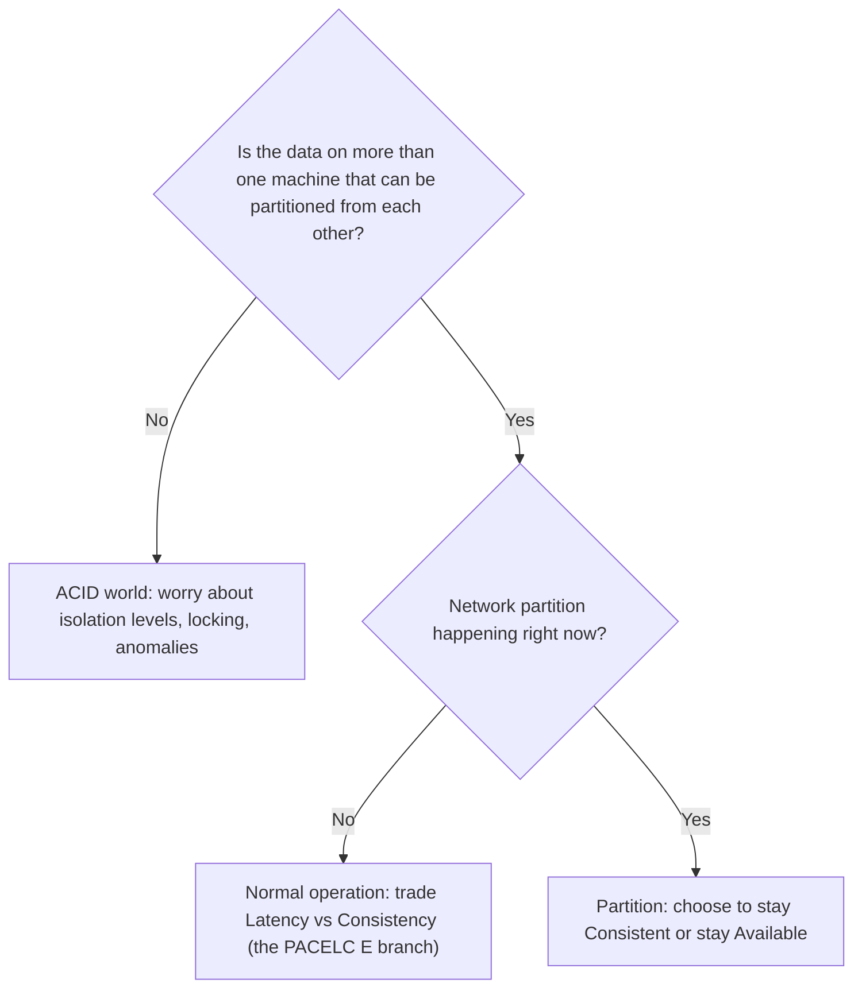

# ACID, BASE, and CAP without the slogans

## Why this matters

It's a Tuesday afternoon and your payments service has been double-charging a handful of customers. Not many — maybe one in ten thousand — but enough that support is escalating. You dig in. The charge logic reads the account balance, checks it against the order total, writes a `charged` row, and calls Stripe. In your test environment it's airtight. In production, occasionally, two requests for the same order arrive within milliseconds of each other, both read "not yet charged," and both proceed.

You reach for the obvious fix: wrap it in a transaction. You add `BEGIN ... COMMIT` around the read and the write. The double-charges keep happening. Now you're confused, because you "made it transactional." What you actually did was group the statements into one atomic unit — but a transaction at the default `READ COMMITTED` isolation level does not stop two concurrent transactions from each reading the same stale "not charged" state. Atomicity was never the problem. Isolation was. The fix is a `SELECT ... FOR UPDATE` that takes a row lock, or a unique constraint on `(order_id)` that lets the database reject the second write outright.

That gap — between "I used a transaction" and "I understand what the transaction guarantees" — is where most data-corruption incidents live. The same gap shows up one layer out, when someone reads "Cassandra is AP" or "Postgres is CP" off a slide and concludes their distributed system is doomed to lose data, or magically immune to it. ACID, BASE, and CAP are the three terms everyone repeats and few can operationalize. This chapter strips the slogans off and shows you the mechanisms underneath, so you can reason about a real incident instead of reciting a letter.

## Mental model

Three vocabularies, three different concerns. They are routinely conflated; keep them separate.

**ACID** describes guarantees a single database gives a transaction. **BASE** describes the design philosophy of systems that deliberately relax those guarantees for availability. **CAP** is a narrow theorem about what a *distributed* system can promise *during a network partition*. ACID is about correctness on one node (or one cluster behaving as one logical node); CAP is about behavior when nodes can't talk to each other.



The four ACID properties, at the mechanism level:

| Property | What it actually means | How the DB delivers it |
|---|---|---|
| **Atomicity** | All statements in a transaction commit, or none do | Write-ahead log + rollback; nothing partial survives a crash |
| **Consistency** | The transaction moves the DB from one valid state to another | Constraints, foreign keys, triggers — *your* invariants, enforced |
| **Isolation** | Concurrent transactions don't see each other's half-done work | MVCC and/or locking; tunable via isolation levels |
| **Durability** | Once committed, it survives a crash | `fsync` of the WAL to stable storage before acknowledging commit |

The one most people misread is the **C**. The "Consistency" in ACID is not the "Consistency" in CAP. ACID's C means "your declared invariants hold." CAP's C means "every read sees the most recent write" (linearizability). Same word, unrelated meanings. A system can be ACID-consistent and CAP-inconsistent in the same breath.

It helps to name the **read phenomena** isolation is defined against, because the slogans hide them. A *dirty read* sees another transaction's uncommitted write. A *non-repeatable read* sees a row change value between two reads in the same transaction because someone else committed in between. A *phantom read* sees the set of rows matching a predicate grow or shrink mid-transaction. A *lost update* is two transactions reading the same value, each computing a new one from it, and the second silently overwriting the first — exactly the double-charge. Each isolation level is just a contract about which of these it forbids. You are not choosing a vibe; you are choosing a precise set of anomalies you refuse to tolerate, in exchange for concurrency.

**BASE** — Basically Available, Soft state, Eventually consistent — is the explicit opposite stance. Instead of blocking a write until every replica agrees, accept it on one node and let it propagate. Reads may see stale data for a window; the system converges given no new writes. This is not "worse," it's a different point on the curve: you trade read-your-writes guarantees for availability and lower latency.

**CAP**, stated precisely (Gilbert & Lynch's 2002 proof of Brewer's conjecture): when a network partition (P) separates your nodes, you must choose between Consistency (C — every read reflects the latest write) and Availability (A — every request gets a non-error response). You cannot have both *during the partition*. That's the whole theorem. It says nothing about the common case when the network is healthy.

The most important correction: CAP is **not** "pick two of three." You don't get to "choose CA." Partitions are not optional — networks drop packets, switches reboot, cables get cut. P is a fact of distributed life, so the real choice is only ever C-vs-A, and only *while partitioned*. The rest of the time you have both. **PACELC** (Abadi, 2012) completes the picture: if Partitioned, choose A or C; **E**lse (normal operation), choose **L**atency or **C**onsistency. A synchronous-replication Postgres is PC/EC. Cassandra tuned for speed is PA/EL. DynamoDB with strongly-consistent reads is PC/EC for those reads, PA/EL otherwise.

## In practice

### Isolation levels are the dial most teams never touch

The opening double-charge bug is an isolation problem. SQL defines four levels, each forbidding more anomalies and costing more concurrency. PostgreSQL's defaults and behavior:

| Level | Dirty read | Non-repeatable read | Phantom | Serialization anomaly |
|---|---|---|---|---|
| READ UNCOMMITTED | (PG treats as RC) | possible | possible | possible |
| READ COMMITTED (PG default) | no | possible | possible | possible |
| REPEATABLE READ | no | no | no (PG: prevented via snapshot) | possible |
| SERIALIZABLE | no | no | no | no |

The double-charge is a *non-repeatable / lost-update* style anomaly. Two clean fixes:

```sql
-- Fix A: pessimistic row lock. The second txn blocks until the first commits,
-- then sees the updated state.
BEGIN;
SELECT status FROM orders WHERE id = $1 FOR UPDATE;   -- row is now locked
-- application checks status = 'pending'
UPDATE orders SET status = 'charged' WHERE id = $1;
COMMIT;
```

```sql
-- Fix B: let the database enforce the invariant declaratively.
-- A second insert for the same order simply fails — no race window.
CREATE UNIQUE INDEX uniq_charge_per_order ON charges (order_id);

INSERT INTO charges (order_id, amount) VALUES ($1, $2);
-- second concurrent insert -> ERROR: duplicate key value violates unique constraint
```

Fix B is the one I reach for first. A unique constraint is an invariant the database can never forget, can't be bypassed by a future code path, and costs nothing at read time. Application-level checks rot; constraints don't.

For genuinely multi-row invariants where a lock is awkward, `SERIALIZABLE` is underused. PostgreSQL implements it with Serializable Snapshot Isolation: transactions run optimistically and the engine aborts one if it detects a dependency cycle that would break serializability. You handle the abort by retrying:

```python
import psycopg
from psycopg.errors import SerializationFailure

def transfer(conn, src, dst, amount, retries=5):
    for attempt in range(retries):
        try:
            with conn.transaction():
                conn.execute("SET TRANSACTION ISOLATION LEVEL SERIALIZABLE")
                bal = conn.execute(
                    "SELECT balance FROM accounts WHERE id=%s", (src,)
                ).fetchone()[0]
                if bal < amount:
                    raise ValueError("insufficient funds")
                conn.execute("UPDATE accounts SET balance=balance-%s WHERE id=%s",
                             (amount, src))
                conn.execute("UPDATE accounts SET balance=balance+%s WHERE id=%s",
                             (amount, dst))
            return  # committed
        except SerializationFailure:
            if attempt == retries - 1:
                raise
            continue  # retry the whole transaction
```

The mental shift: at `SERIALIZABLE`, *every* transaction body must be safe to retry, because the engine may abort it through no fault of your logic. That retry loop is the price of not having to reason about every possible interleaving yourself.

### Write skew: the anomaly only SERIALIZABLE catches

There is a class of bug that a row lock and a unique constraint both miss, and it is the reason `SERIALIZABLE` exists. Picture an on-call rule: at least one engineer must remain on call at all times. Two engineers both want to go off call. Each transaction reads "how many others are still on call?", sees one other person, concludes "it's safe for me to leave," and writes its own row to off-call. Both commit. Now nobody is on call — yet no single row was updated by two transactions, and no uniqueness was violated, so `FOR UPDATE` on the rows each transaction *touches* protects nothing. The transactions read an overlapping set and then wrote to disjoint rows. This is **write skew**, and `REPEATABLE READ` snapshot isolation permits it.

`SERIALIZABLE` catches it because Serializable Snapshot Isolation tracks the read/write dependencies *between* transactions, not just the rows each one writes, and aborts one of the pair when the dependency graph contains a cycle that no serial order could produce. The practical takeaway: if your invariant spans rows that different transactions read in common but write to separately — a count, a sum, a "last one out" rule — neither locking individual rows nor a unique index will save you. Reach for `SERIALIZABLE` with the retry wrapper above, or materialize the invariant into a single row you can lock.

### Durability is a setting, not a given

"Committed" means different things depending on configuration. In PostgreSQL, `synchronous_commit = on` (the default) flushes the WAL to disk before acknowledging. Set it to `off` and commits return faster but a crash can lose the last fraction of a second of "committed" transactions. With streaming replication, `synchronous_commit = remote_apply` won't acknowledge until a replica has applied the change — stronger durability, higher latency. This single knob is where the CAP/PACELC tradeoff becomes a `postgresql.conf` line:

```ini
# Latency-optimized: ack on local flush, replicas catch up async (PA / EL)
synchronous_commit = local
synchronous_standby_names = ''

# Consistency-optimized: ack only after a sync replica confirms (PC / EC)
synchronous_commit = remote_apply
synchronous_standby_names = 'FIRST 1 (replica_a, replica_b)'
```

The second config means: if the sync replica is partitioned away, the primary *blocks commits* rather than risk acknowledging a write the replica never saw. That is choosing C over A during a partition, made concrete.

### When eventual consistency is the right call

Not everything needs linearizability. A few honest examples:

- **Like counts, view counts, "trending" widgets.** Off by a few for a few seconds? Nobody notices, nobody's harmed. Eventual is correct *and* cheaper.
- **Product catalog / CDN-cached content.** A price update propagating over seconds is fine if you reconcile at checkout (where you read strongly).
- **Activity feeds, notifications.** Order and completeness can be approximate.

And where you must have strong consistency:

- **Money movement, inventory decrement, seat/ticket allocation.** Selling the same concert seat twice is a refund, an apology, and a churned customer.
- **Authentication and authorization state.** A revoked token that's "eventually" revoked is a security hole.
- **Uniqueness constraints** (usernames, idempotency keys).

The skill is splitting one system along these lines instead of picking one consistency model for everything. Keep balances and inventory in a strongly-consistent store; serve the catalog and feeds from an eventually-consistent edge. The seat-booking flow reads-strong at the moment of commit even if it browsed weakly a second earlier.

> **Connect the dots:** The isolation anomalies here are the application-visible face of PostgreSQL's MVCC (Part 6, Chapter 1). And the "ack after replica confirms" durability knob is the same consensus problem that Raft and leader election solve in Part 7 — synchronous replication is consensus wearing a database hat.

## Pitfalls and anti-patterns

**1. "I wrapped it in a transaction, so it's safe."** A transaction gives atomicity, not mutual exclusion. At `READ COMMITTED` (the Postgres and MySQL/InnoDB default), two concurrent transactions happily read the same pre-state and both act on it — the lost-update anomaly behind the opening incident. *Recognize it:* duplicate effects under concurrency that you can't reproduce single-threaded. *Fix it:* a unique constraint, `SELECT ... FOR UPDATE`, or `SERIALIZABLE` with retry — depending on whether the invariant is one row or many.

**2. Believing you can "choose CA" and skip partition handling.** Treating partitions as something you opted out of. *Recognize it:* an architecture doc that says "we picked CA" or replication with no story for "what happens when the replica is unreachable." *Fix it:* accept that P is mandatory, then decide explicitly — does this write block (C) or proceed and reconcile later (A)? Write that decision down per data type, not per system.

**3. Conflating ACID-C with CAP-C.** Someone "proves" a system is consistent by pointing at foreign keys, then is shocked when a follower read returns stale data. *Recognize it:* the word "consistent" used without saying which definition. *Fix it:* name it precisely — "invariant-preserving" (ACID-C) vs. "linearizable / read-your-writes" (CAP-C). They're orthogonal.

**4. Reading from an async replica and expecting read-your-writes.** You write to the primary, immediately read from a load-balanced replica pool, and the row "isn't there yet." Replication lag is real and unbounded under load. *Recognize it:* "I just saved it but the next page shows the old value" bugs that vanish under low traffic. *Fix it:* route read-after-write to the primary, pin a session to one replica, or use causal/monotonic-read tokens (e.g. wait for the replica to reach the write's LSN).

**5. Cranking everything to SERIALIZABLE as a blanket safety net.** It's correct, but it raises abort rates and latency, and *every* transaction must now tolerate being retried. Teams that blindly flip the global default get mysterious throughput collapse under contention. *Recognize it:* serialization-failure errors flooding logs, p99 latency spikes on hot rows. *Fix it:* apply `SERIALIZABLE` per-transaction where the invariant demands it; leave read-heavy paths at `READ COMMITTED`.

## Production checklist

- [ ] Every money/inventory/uniqueness invariant is enforced by a **database constraint** (unique, check, foreign key), not only application code
- [ ] Isolation level is a **deliberate per-transaction choice**, documented where it deviates from the default
- [ ] All `SERIALIZABLE` (and any optimistic) transactions are wrapped in a **retry loop** with a bounded attempt count and jittered backoff
- [ ] Read-after-write paths either hit the primary or use a replica-lag / LSN guard; you've measured actual replication lag at p99
- [ ] `synchronous_commit` and `synchronous_standby_names` are set to match your stated durability/availability target (and that target is written down)
- [ ] Each data domain is classified **strong** vs **eventual**, and the classification is visible in code/docs, not folklore
- [ ] You have a monitored, exercised story for "the sync replica is partitioned away" — does the primary block, fail over, or degrade?
- [ ] Idempotency keys protect every externally-visible side effect (charges, emails, webhooks) so retries can't double-fire

## Exercises

1. **(Comprehension)** In your own words, explain why "choosing CA" in CAP is not a real option, and give a concrete example of the same word "consistency" meaning two different things in ACID vs. CAP. No code — just the distinction, in three sentences each.

2. **(Applied)** Reproduce a lost-update anomaly. In one Postgres database, open two `psql` sessions at `READ COMMITTED`. In both, `BEGIN`, `SELECT balance FROM accounts WHERE id = 1`, then in both `UPDATE accounts SET balance = balance - 10 WHERE id = 1` interleaved, and `COMMIT`. Observe the final balance versus what you intended. Then redo the experiment at `SERIALIZABLE` and show that one transaction aborts with a serialization failure. Write the retry wrapper that makes the second attempt succeed.

3. **(Design)** You're building a ticketing system: a fixed number of seats per event, a browsable catalog read by millions, and a checkout that must never oversell. Specify which data lives in a strongly-consistent store and which can be eventually consistent, where reads hit the primary vs. a replica, and exactly how you prevent two buyers from claiming the last seat. State your PACELC classification for each component and justify the latency-vs-consistency call you made.

## Further reading

- Seth Gilbert and Nancy Lynch, ["Brewer's Conjecture and the Feasibility of Consistent, Available, Partition-Tolerant Web Services"](https://groups.csail.mit.edu/tds/papers/Gilbert/Brewer2.pdf) (2002) — the actual CAP proof, not the slide version
- Daniel Abadi, ["Consistency Tradeoffs in Modern Distributed Database System Design"](http://www.cs.umd.edu/~abadi/papers/abadi-pacelc.pdf) (IEEE Computer, 2012) — introduces PACELC and why CAP alone is incomplete
- Eric Brewer, ["CAP Twelve Years Later: How the 'Rules' Have Changed"](https://www.infoq.com/articles/cap-twelve-years-later-how-the-rules-have-changed/) (2012) — Brewer himself walking back the "2 of 3" framing
- Peter Bailis et al., ["Highly Available Transactions: Virtues and Limitations"](http://www.bailis.org/papers/hat-vldb2014.pdf) (VLDB 2014) — which guarantees survive without coordination
- PostgreSQL documentation, [Chapter 13: "Transaction Isolation"](https://www.postgresql.org/docs/current/transaction-iso.html) — the definitive reference for what each level forbids, with worked anomaly examples
- Martin Kleppmann, *Designing Data-Intensive Applications*, chapters 7 ("Transactions") and 9 ("Consistency and Consensus") — the clearest book-length treatment of all three topics

> **Security note:** Isolation choices have a direct security dimension. A check-then-act on a permissions or quota table at `READ COMMITTED` is a TOCTOU (time-of-check-to-time-of-use) vulnerability: two concurrent requests can both pass an "are you under your limit?" check and both proceed, letting an attacker exceed a rate limit, redeem a single-use coupon twice, or escalate via a race. Enforce such invariants with a unique constraint or a `SERIALIZABLE`/`FOR UPDATE` lock, never an application-side read-then-write. Separately, if you offload reads to replicas, ensure access-control state (revoked tokens, disabled accounts) is read strongly from the primary — an "eventually revoked" credential is an open door for the duration of replication lag.
