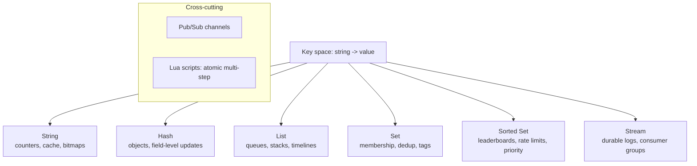
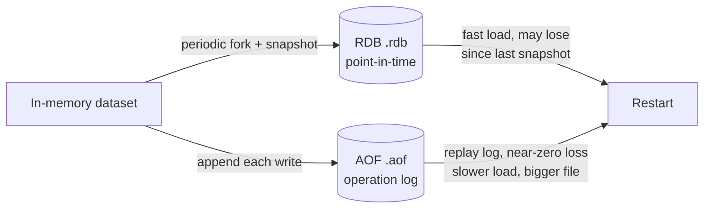

# Redis as more than a cache

## Why this matters

It's a Tuesday afternoon and the leaderboard on your game's home screen is showing stale ranks. A player who just hit 50,000 points is still listed at rank 200. The fix the previous engineer shipped was a cron job: every 60 seconds, run `SELECT id, score FROM players ORDER BY score DESC LIMIT 100` against Postgres, cache the result in Redis as a JSON blob, and serve that blob to everyone. It worked when the table was small. As the player base grew into the millions, that `ORDER BY` became a full sort of a multi-million-row table every minute, the query stretched into seconds, and during those seconds the database CPU pinned and unrelated checkout requests started timing out. The leaderboard, a cosmetic feature, is now taking down payments.

The actual fix is four Redis commands and zero cron jobs. A sorted set keyed by score gives you `ZADD leaderboard 50000 player:8821` on every score change — O(log N) — and `ZREVRANGE leaderboard 0 99 WITHSCORES` to read the top 100 in O(log N + 100). The rank of any single player is `ZREVRANK`, also O(log N). There is no periodic recompute because the structure is always sorted. Postgres never sees the read traffic at all.

That gap between "Redis is where I stash JSON to avoid hitting the database" and "Redis has data structures with algorithmic guarantees I can build features on" is what this chapter closes. Treating Redis as a dumb key-value cache leaves most of its value on the table. Its real power is a small set of server-side data structures with well-understood complexity, an atomic single-threaded execution model, and a scripting layer that lets you compose operations safely. Once you see Redis as a toolbox of data structures rather than a string-to-string map, whole categories of problems — rate limiting, leaderboards, work queues, presence, deduplication — collapse into a handful of commands.

The engineers who treat Redis as a JSON drawer end up rebuilding sorting, counting, and deduplication in application code, then guarding it all with locks. The ones who know the type system push that work into the server, where it runs atomically and in logarithmic time. This chapter is the bridge.

## Mental model

Redis is a single-threaded, in-memory data-structure server. Three words carry the whole model.

*In-memory*: the working set lives in RAM, which is why it's fast and also why durability is a deliberate choice rather than a default. *Single-threaded*: one command runs to completion before the next begins (for the data path), so every individual command is atomic and you never reason about two commands interleaving. *Data-structure server*: keys don't just map to opaque strings; they map to typed structures, and the command set is specialized per type.



The six core types each unlock a family of use cases:

| Type | Core operations | Buys you |
|---|---|---|
| **String** | `SET`, `GET`, `INCR`, `SETEX` | caches, atomic counters, bitfields |
| **Hash** | `HSET`, `HGET`, `HINCRBY` | objects where you update one field without rewriting the whole value |
| **List** | `LPUSH`, `RPOP`, `BLPOP` | simple FIFO/LIFO queues, recent-items timelines |
| **Set** | `SADD`, `SISMEMBER`, `SINTER` | membership tests, deduplication, tag intersections |
| **Sorted Set** | `ZADD`, `ZREVRANGE`, `ZRANGEBYSCORE` | leaderboards, sliding-window rate limits, priority queues |
| **Stream** | `XADD`, `XREADGROUP`, `XACK` | durable append-only logs with consumer groups and at-least-once delivery |

The single-threaded model is the unifying idea. Because no two commands run concurrently, `INCR` is a safe atomic counter with no compare-and-swap dance, `ZADD` can't lose an update to a race, and a Lua script runs as one indivisible unit. The cost is the flip side: one slow command (a `KEYS *` over millions of keys, a giant `ZRANGEBYSCORE` returning a million elements) blocks every other client for its full duration. Command complexity isn't academic in Redis; an O(N) command on a large structure is a latency incident.

A second piece of the model is the key, which carries metadata of its own. Any key can have a TTL — `EXPIRE key 60` or `SET key val EX 60` — after which Redis removes it lazily (on the next access) and via a sampling background sweep. This is why time-bucketed keys (`leaderboard:2026-06-14`, `rl:user:8821`) are such a common pattern: the data cleans itself up and you never write a deletion cron job. Expiration is also the seam where "cache" and "data structure" meet, because a TTL on a sorted set or a stream gives you a self-pruning structure rather than a static blob.

The third piece is that everything is one logical keyspace per database, and under Redis Cluster that keyspace is sharded across nodes by the CRC16 hash of the key. A single command touches one key and routes cleanly; a multi-key command (or a Lua script) requires every key to live on the same shard. That constraint — invisible on a single node, fatal under Cluster — shows up repeatedly below, and the fix is always the same: declare your keys up front and, when several must move together, pin them to one slot with a hash tag.

## In practice

### A leaderboard with a sorted set

A sorted set stores members each with a floating-point score, kept ordered by score. Every read and write is logarithmic. Here is the full leaderboard from the opening scenario.

```bash
# Record scores (idempotent: re-ADDing a member updates its score)
ZADD leaderboard 50000 player:8821
ZADD leaderboard 31200 player:1455
ZADD leaderboard 47900 player:9003

# Top 3, highest first, with scores
ZREVRANGE leaderboard 0 2 WITHSCORES
# 1) "player:8821"  2) "50000"
# 3) "player:9003"  4) "47900"
# 5) "player:1455"  6) "31200"

# One player's rank (0-based, highest score = rank 0)
ZREVRANK leaderboard player:9003   # -> 1

# Atomically bump a score by a delta and get the new value
ZINCRBY leaderboard 1500 player:1455   # -> 32700

# "Players within a few ranks of me" — a slice around my position
ZREVRANGE leaderboard 10 20 WITHSCORES
```

In application code, the read path that used to be a multi-second sort becomes a single round trip:

```typescript
import { createClient } from "redis";
const redis = createClient();
await redis.connect();

async function recordScore(playerId: string, score: number) {
  // O(log N). Overwrites the member's score if it already exists.
  await redis.zAdd("leaderboard", { score, value: `player:${playerId}` });
}

async function topN(n: number) {
  // REV = descending. Returns [{ value, score }, ...]
  return redis.zRangeWithScores("leaderboard", 0, n - 1, { REV: true });
}

async function rankOf(playerId: string) {
  const rank = await redis.zRevRank("leaderboard", `player:${playerId}`);
  return rank === null ? null : rank + 1; // present rank as 1-based
}
```

For per-day or per-season boards, key the set by period — `leaderboard:2026-06-14` — and set a TTL so old boards expire themselves. Sorted sets also power sliding-window rate limiting: store request timestamps as scores, `ZREMRANGEBYSCORE` to drop entries older than the window, `ZCARD` to count what remains.

### Objects and membership: hashes and sets

Two everyday types round out the toolbox before the heavier machinery. A **hash** stores an object as a flat set of fields, so you can update one field without serializing and rewriting the whole value — the trap you fall into when you stash a JSON blob in a string.

```bash
HSET session:8821 user_id 8821 last_seen 1718370000 plan pro
HINCRBY session:8821 page_views 1      # bump one counter, leave the rest
HGET session:8821 plan                 # -> "pro", no full-object read
```

A **set** gives you O(1) membership and cheap algebra over groups. Deduplication, "have I seen this event id," tag intersections, and "users online in both regions" are all one command.

```bash
SADD seen:event 9f2a-77c1             # returns 1 if new, 0 if duplicate
SISMEMBER online:us player:8821       # O(1) membership test
SINTER tag:rust tag:hiring            # users with both tags, set intersection
```

Neither type needs application-side locking or read-modify-write, because each command is atomic on the server. That is the recurring payoff: the structure already knows how to mutate itself correctly under concurrency.

### A durable work queue with a stream

Lists give you a queue with `LPUSH`/`BRPOP`, but a list queue has no record that a job was delivered — if a worker pops a job and crashes before finishing, the job is gone. Streams fix this. A stream is an append-only log; consumer groups track which entries each consumer has read and which have been acknowledged, giving at-least-once delivery and crash recovery.

```bash
# Producer appends an entry; * means "assign an ID for me"
XADD jobs '*' type resize image_id 7781
# -> "1718370000123-0"   (millisecond timestamp + sequence)

# Create a consumer group reading from the start of the stream
XGROUP CREATE jobs workers 0

# A worker reads up to 10 new (never-delivered) entries, blocking 5s
XREADGROUP GROUP workers worker-1 COUNT 10 BLOCK 5000 STREAMS jobs '>'

# After successfully processing, acknowledge so it's not redelivered
XACK jobs workers 1718370000123-0
```

The `>` is the key symbol: it means "entries never delivered to any consumer in this group." Entries that were delivered but never `XACK`ed stay in the consumer's Pending Entries List (PEL). A supervisor recovers work from a dead worker by inspecting the PEL and reassigning:

```bash
# What's pending for the group? (count, min-id, max-id, per-consumer)
XPENDING jobs workers

# Claim entries idle for >30s and reassign to a healthy worker
XAUTOCLAIM jobs workers worker-2 30000 0
```

```typescript
async function consumeForever(group = "workers", consumer = "worker-1") {
  while (true) {
    const res = await redis.xReadGroup(
      group, consumer,
      [{ key: "jobs", id: ">" }],
      { COUNT: 10, BLOCK: 5000 }
    );
    if (!res) continue; // timed out with nothing new; loop
    for (const { messages } of res) {
      for (const { id, message } of messages) {
        try {
          await handleJob(message);
          await redis.xAck("jobs", group, id); // only ack on success
        } catch (err) {
          // leave unacked: it stays in the PEL for XAUTOCLAIM recovery
          console.error("job failed, will be reclaimed", id, err);
        }
      }
    }
  }
}
```

Streams aren't a Kafka replacement (no partition rebalancing protocol, no infinite retention by default), but for in-process job queues and event fan-out where you already run Redis, they remove an entire class of "lost job" bugs that list-based queues quietly carry. The price of admission is discipline: a consumer that reads but never acknowledges grows the PEL without bound, and a stream with no `MAXLEN` grows forever — both are covered in the pitfalls below.

### Pub/Sub for fire-and-forget fan-out

```bash
# Terminal A
SUBSCRIBE notifications
# Terminal B
PUBLISH notifications '{"user":8821,"event":"badge_earned"}'
```

Pub/Sub delivers to whoever is connected *right now* — there is no persistence, no replay, no acknowledgment. If no subscriber is listening, the message vanishes. That makes it perfect for ephemeral signals (cache-invalidation broadcasts, live presence, WebSocket fan-out across app servers) and wrong for anything you can't afford to lose. The distinction is the whole point: a stream remembers and redelivers, Pub/Sub forgets the instant it sends. When you need delivery guarantees, use a stream; when you need a cheap broadcast and don't care who was listening, use Pub/Sub.

### Lua scripting for atomicity

The single-threaded model makes one command atomic, but a *sequence* of commands from your app (read, decide, write) is not — another client can act between your `GET` and your `SET`. A Lua script runs server-side as one atomic unit; nothing else executes until it returns. This is how you build correct check-then-act logic. A canonical example is an atomic fixed-window rate limiter:

```lua
-- KEYS[1] = rate-limit key, ARGV[1] = limit, ARGV[2] = window seconds
local current = redis.call('INCR', KEYS[1])
if current == 1 then
  redis.call('EXPIRE', KEYS[1], ARGV[2])
end
if current > tonumber(ARGV[1]) then
  return 0   -- denied
end
return 1     -- allowed
```

```typescript
const ALLOW = `...the Lua above...`;
async function allowRequest(userId: string, limit = 100, windowSec = 60) {
  const ok = await redis.eval(ALLOW, {
    keys: [`rl:${userId}`],
    arguments: [String(limit), String(windowSec)],
  });
  return ok === 1;
}
```

The `INCR`-then-conditional-`EXPIRE` cannot interleave with another request, so two simultaneous calls can't both see `current == 1` and both reset the TTL. Keep scripts short — they block the whole server while running — and always pass keys via `KEYS`, never interpolate them into the script body, so the script works correctly under Redis Cluster sharding.

### Persistence: RDB vs AOF

Redis offers two durability mechanisms, and the choice is a real tradeoff, not a default to ignore.



**RDB** forks the process and writes a compact point-in-time snapshot every N seconds/M changes. Fast to load, small files, great for backups — but a crash loses everything since the last snapshot (potentially minutes). **AOF** appends every write command to a log and `fsync`s it (by default once per second), so a crash loses at most roughly one second of writes. The file is larger and replay-on-restart is slower. The modern recommendation is to run **both**: AOF for low data loss, RDB for fast restarts and backups. Set `appendfsync everysec` (the sane middle ground; `always` is durable but slow, `no` lets the OS decide and can lose a lot). Critically: if you run Redis purely as a cache with no persistence, *say so explicitly* and design for a cold, empty Redis after any restart.

### Eviction policies

When `maxmemory` is reached, Redis applies an eviction policy. The default in many builds is `noeviction` (writes start failing with an error). For a cache you want `allkeys-lru` (evict least-recently-used across all keys) or `allkeys-lfu` (least-frequently-used, usually better for skewed access). Use a `volatile-*` policy only when you've set TTLs and want non-TTL keys protected from eviction. The choice interacts with the use case: a pure cache should evict freely, but a queue or a leaderboard you can't rebuild from elsewhere wants `noeviction` so you find out at write time instead of silently losing members.

```bash
CONFIG SET maxmemory 4gb
CONFIG SET maxmemory-policy allkeys-lfu
```

## Pitfalls and anti-patterns

**Using `KEYS` in production.** `KEYS pattern` scans the entire keyspace in O(N) and, because Redis is single-threaded, blocks every other client until it finishes. On a multi-million-key instance it can freeze the server for seconds. *Recognize it* by latency spikes correlated with a `KEYS` call in your code or in a debugging script someone ran live. *Fix it* with `SCAN`, which returns a cursor and pages through the keyspace in small chunks without blocking.

**Treating Redis as a durable primary store by accident.** Redis can persist, but its consistency model under failover is weak: replication is asynchronous, so a write acknowledged by a primary that then crashes before replicating is lost, and a network partition can briefly produce a split brain. *Recognize it* when "source of truth" data only lives in Redis and you have no Postgres/S3 behind it. *Fix it* by treating Redis as derived or cached state for anything that must survive — keep the authoritative copy in a system built for durability and use `WAIT` only when you understand it doesn't make writes fully durable.

**Unbounded data structures.** A list used as an event log that's never trimmed, a sorted set that only grows, a stream with no `MAXLEN` — each silently consumes RAM until eviction or OOM. *Recognize it* with `redis-cli --bigkeys` or `MEMORY USAGE key`. *Fix it* by capping at write time: `LPUSH ...` followed by `LTRIM list 0 999`, `XADD jobs MAXLEN ~ 100000 ...`, or TTLs on time-bucketed keys.

**One giant hot key.** A single hash or sorted set holding millions of fields becomes a hotspot: every operation on it serializes through one shard and one thread, and big-range reads are O(N). *Recognize it* via `--bigkeys` flagging one key far larger than the rest, or one shard hotter than others in Cluster. *Fix it* by sharding the key (`leaderboard:{region}`) or splitting the structure.

**Interpolating keys into Lua, breaking Cluster.** Building a script that touches keys not declared in `KEYS` works on a single node but fails under Redis Cluster, which routes scripts by the hash slot of `KEYS`. *Recognize it* by `CROSSSLOT` errors in production after enabling Cluster. *Fix it* by passing every key through `KEYS` and, when multiple keys must be touched atomically, forcing them to the same slot with hash tags: `{user:8821}:rl`, `{user:8821}:session`.

## Production checklist

- [ ] `maxmemory` set explicitly, with an eviction policy chosen on purpose (`allkeys-lfu` for caches, `noeviction` for queues/primary-ish data)
- [ ] Persistence decided and documented: AOF (`appendfsync everysec`) + RDB for durable use, or "no persistence, cache only" stated in the runbook
- [ ] No `KEYS`, `FLUSHALL`, or unbounded `ZRANGE`/`LRANGE` in any code path; `SCAN`/`HSCAN`/`SSCAN` used for iteration
- [ ] Every growing structure has a bound: `LTRIM`, `XADD MAXLEN`, TTLs on time-bucketed keys
- [ ] Lua scripts pass all keys via `KEYS[]`; multi-key atomic ops use hash tags for Cluster safety
- [ ] `requirepass`/ACLs enabled, `bind` restricted, TLS on, and dangerous commands renamed/disabled (`rename-command KEYS ""`)
- [ ] Slow-query visibility: `SLOWLOG` monitored, and latency alerts wired to your dashboards
- [ ] Backups for any persistent instance: scheduled RDB snapshots shipped off-box and restore-tested
- [ ] Stream consumers acknowledge with `XACK` and a supervisor runs `XAUTOCLAIM` to recover dead-worker jobs
- [ ] Client connection pooling and timeouts configured; `CLIENT NO-EVICT`/output-buffer limits reviewed for pub/sub fan-out

## Exercises

1. **(Comprehension)** Explain, in terms of the single-threaded model, why `INCR` needs no locking but a read-modify-write done as two separate client commands (`GET` then `SET`) is unsafe under concurrency. Then explain why wrapping those two operations in a Lua script makes them safe again.

2. **(Applied)** Build the sliding-window rate limiter using a sorted set: on each request, `ZADD` the current timestamp as both member and score, `ZREMRANGEBYSCORE` to drop entries older than the window, `ZCARD` to count, and set a TTL on the key. Wrap the whole sequence in a Lua script so it's atomic. Compare its memory and accuracy against the fixed-window `INCR`/`EXPIRE` version in this chapter and state when each is the right pick.

3. **(Design)** Your team wants to replace a Postgres-backed `jobs` table (polled with `SELECT ... FOR UPDATE SKIP LOCKED`) with a Redis Stream and consumer groups. Sketch the migration: how producers enqueue, how workers claim and acknowledge, how you recover jobs from a crashed worker, how you cap memory, and how you guarantee a job is processed at least once. Then argue the case *against* the migration — what does the Postgres queue give you (durability, transactional enqueue with business data, queryability) that the Redis version makes you give up? State which you'd choose and why.

## Further reading

- [Redis documentation: Data types](https://redis.io/docs/latest/develop/data-types/) — the authoritative per-type command reference, including streams and consumer groups
- [Redis persistence](https://redis.io/docs/latest/operate/oss_and_stack/management/persistence/) — official explanation of RDB, AOF, and the durability tradeoffs
- Salvatore Sanfilippo, ["Redis persistence demystified"](http://oldblog.antirez.com/post/redis-persistence-demystified.html) — the creator's own deep dive on why the durability story is what it is
- [Redis Streams introduction](https://redis.io/docs/latest/develop/data-types/streams/) — consumer groups, PEL, `XAUTOCLAIM`, and at-least-once semantics
- [EVAL and Lua scripting](https://redis.io/docs/latest/develop/interact/programmability/eval-intro/) — atomicity guarantees, the `KEYS`/`ARGV` contract, and Cluster routing rules
- Martin Kleppmann, ["How to do distributed locking"](https://martin.kleppmann.com/2016/02/08/how-to-do-distributed-locking.html) — a rigorous, skeptical look at Redlock and why "Redis as a lock" is subtler than it appears

> **Connect the dots:** The durability tradeoff here is the same one formalized in Chapter 3 of this Part (ACID, BASE, and CAP). Redis's asynchronous replication and "acknowledged but not yet durable" writes are a concrete instance of choosing availability and latency over strong consistency — read that chapter and Redis's failover behavior stops being surprising and starts being a deliberate point on the CAP spectrum.

> **Security note:** A Redis instance reachable on the network with no password is one of the most common breach vectors on the internet, because by default Redis trusts every connection and exposes commands like `CONFIG SET` that can rewrite the RDB save path and `MODULE LOAD`/`SLAVEOF` tricks that lead to remote code execution. Always enable `requirepass` or, better, ACL users with least-privilege command sets; `bind` to private interfaces only; require TLS for any traffic crossing a network boundary; and `rename-command` (or disable) `FLUSHALL`, `CONFIG`, `KEYS`, and `DEBUG` in production. Never store unencrypted PII or secrets in Redis as if it were a vault — at-rest encryption depends on disk-level controls for the RDB/AOF files, and anyone with `KEYS`/`SCAN` access can read the entire dataset.
