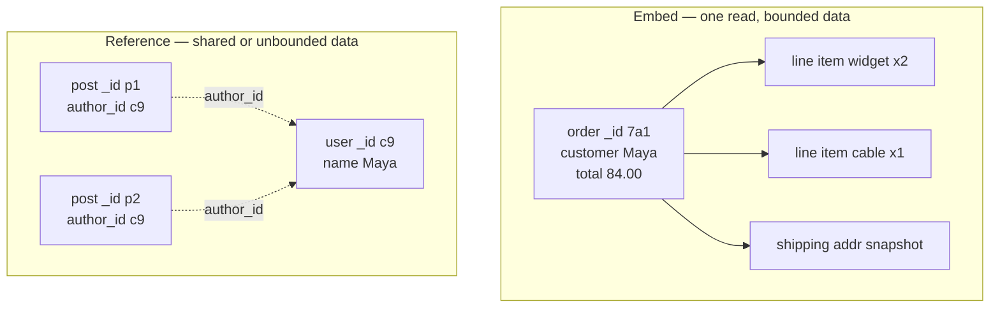

# MongoDB and document stores

## Why this matters

It's a Tuesday afternoon and a new product manager wants to ship "custom fields" on user profiles. Marketing wants a `referral_source`, the growth team wants a `signup_experiment_bucket`, support wants a free-form `notes` array. In your PostgreSQL schema this is a migration, a deploy, a backfill, and a code review — three days of lead time for what the PM thinks is a five-minute change. Someone on the team says "this is why we should've used Mongo," and someone else says "this is why we should never use Mongo," and now you have a religious war instead of a design decision.

Both of them are partly right, and the disagreement is the whole point of this chapter. MongoDB's document model genuinely removes friction for shapes that vary per record and get read as a unit. It also genuinely removes the guardrails that keep your data from rotting — and a year later you have nine slightly different spellings of `referralSource` living in the same collection because nothing ever stopped them.

The engineers who get burned by MongoDB are the ones who reached for it to avoid writing migrations, then discovered that "schemaless" means "schema enforced in scattered application code that you can't query against." The engineers who get value from it understood that a document is a denormalized aggregate optimized for being read and written whole, picked workloads that fit that shape, and reached for PostgreSQL the moment they needed joins, multi-row transactions, or strong relational integrity. This chapter is about telling those two situations apart before you've committed a year of data to the wrong one.

## Mental model

A relational database stores normalized rows and assembles them into the shape your application wants at query time, using joins. A document database stores the assembled shape directly. That single sentence drives almost every tradeoff that follows.

In MongoDB the units are: a **document** (a BSON object, like JSON with extra types — `ObjectId`, `Date`, `Decimal128`, binary), a **collection** (a bag of documents, loosely analogous to a table), and a **database**. There is no enforced schema by default; two documents in the same collection can have entirely different fields. Indexes, the aggregation pipeline, and the consistency knobs are where the real engineering lives.

The framing that keeps you out of trouble is to treat a document as an **aggregate** — a self-contained cluster of data that the application treats as a single unit for reads, writes, and consistency. Your document boundaries should follow your access patterns, not an idealized normalized model. Ask "what does one request need to load, and what does one request change atomically?" The answer is the shape of your document. When access patterns disagree — one path reads an order whole, another path reports across all line items in the company — that tension is the signal that you may need either a second access pattern (an index, a materialized rollup) or a second store entirely.

The central modeling decision is **embed vs. reference**: do you nest related data inside the parent document, or store it separately and link by `_id`?



The heuristics, in order of importance:

- **Embed when the data is read together, written together, and bounded.** An order and its line items: you always load them as a unit, they don't change independently, and an order won't have a million line items. Embed.
- **Reference when the data is shared, large, or grows without bound.** A user and their posts: posts are queried on their own, there can be unboundedly many, and you don't want to rewrite a large user document to add a comment. Reference.
- **Snapshot, don't reference, for point-in-time facts.** The shipping address on an order should be a *copy* of the address as it was when the order was placed, not a link to the user's current address. This is a feature of the document model, not a bug: denormalization captures history naturally, and it means a later edit to the user's profile can never silently rewrite what an old order shipped to.

The hard limit that disciplines all of this: a single BSON document cannot exceed **16 MB**. If embedding could ever blow past that — a chat room embedding every message, a post embedding every comment — you must reference. Unbounded arrays are the single most common modeling mistake in MongoDB, and the limit is not the only reason: long before you hit 16 MB, an ever-growing array makes every write more expensive and every read pull more data off disk than the request actually needed.

## In practice

### A workload that fits documents well: an event/audit log or a product catalog

Consider a product catalog where every category has wildly different attributes — a book has an ISBN and page count, a t-shirt has sizes and colors, a laptop has RAM and a CPU. In relational land this is the dreaded entity-attribute-value table or a forest of sparse nullable columns. As documents it's natural:

```javascript
// Two documents in the same `products` collection, different shapes
db.products.insertMany([
  {
    _id: ObjectId(),
    sku: "BK-1001",
    type: "book",
    title: "Designing Data-Intensive Applications",
    price: { amount: 4499, currency: "USD" },   // store money as integer cents
    attributes: { isbn: "978-1449373320", format: "paperback" },
    tags: ["databases", "distributed-systems"]
  },
  {
    _id: ObjectId(),
    sku: "TS-2002",
    type: "tshirt",
    title: "Logo Tee",
    price: { amount: 1999, currency: "USD" },
    attributes: { material: "cotton" },
    variants: [
      { size: "M", color: "black", stock: 12 },
      { size: "L", color: "black", stock: 3 }
    ]
  }
]);
```

A query reads exactly what it needs without joining five tables:

```javascript
db.products.find(
  { type: "tshirt", "variants.size": "L", "variants.stock": { $gt: 0 } },
  { title: 1, sku: 1, "variants.$": 1 }   // projection: return only the matching variant
);
```

The catalog and an append-only audit log share a trait that makes documents shine: records are written once (or rarely), read as a unit, and have shapes that legitimately differ from row to row. Store money as integer cents rather than floats, because BSON doubles carry the same rounding hazards as any IEEE-754 float; if you need exact decimal arithmetic, use `Decimal128`.

### Indexing: the part that decides whether you have a database or a spreadsheet

Everything except `_id` is unindexed by default, and a collection scan on a few million documents is exactly as slow as it sounds. Create indexes on your query predicates and sort keys. The order of fields in a compound index follows the **ESR rule**: **E**quality fields first, then **S**ort fields, then **R**ange fields. The reasoning is mechanical: an equality match pins the index to a contiguous slice, a sort field lets the engine read that slice in order without an in-memory sort, and a range scan then walks a bounded run within it. Put a range field before a sort field and the engine can no longer use the index to satisfy the sort, so it buffers and sorts in memory — the silent cost behind many "the index exists but the query is still slow" tickets.

```javascript
// Query: equality on type, range on price, sorted by title
db.products.createIndex({ type: 1, title: 1, "price.amount": 1 });

// Always confirm the index is actually used:
db.products.find({ type: "book", "price.amount": { $lt: 5000 } })
           .sort({ title: 1 })
           .explain("executionStats");
// Look for stage IXSCAN, not COLLSCAN. Check totalDocsExamined close to nReturned.
```

If `explain` shows `COLLSCAN` or `totalDocsExamined` far larger than `nReturned`, your index isn't selective enough for the query. A **covered query** — one whose predicate, sort, and projection all draw only on indexed fields — never touches a document at all, which is the fastest read MongoDB can serve. Two more wrinkles worth knowing: an index on an array field is a **multikey** index (it stores one entry per array element, so a single document can match many index keys), and MongoDB will rarely intersect two separate indexes but almost always prefers a single well-ordered compound index over index intersection. Design the compound index for the query rather than hoping the planner stitches two together.

### The aggregation pipeline

The aggregation framework is where MongoDB stops being a glorified key-value store. It's a sequence of stages, each transforming the stream of documents from the previous one. Push filtering (`$match`) and limiting as early as possible so later stages process fewer documents, and so an early `$match` can use an index before the pipeline turns the data into intermediate shapes that no index covers.

```javascript
// Revenue per product type for shipped orders in Q1, top 5 by revenue
db.orders.aggregate([
  { $match: { status: "shipped", placedAt: { $gte: ISODate("2026-01-01"),
                                              $lt:  ISODate("2026-04-01") } } },
  { $unwind: "$lineItems" },
  { $group: {
      _id: "$lineItems.type",
      revenue: { $sum: { $multiply: ["$lineItems.price", "$lineItems.qty"] } },
      orders:  { $addToSet: "$_id" }
  }},
  { $project: { type: "$_id", _id: 0, revenue: 1, orderCount: { $size: "$orders" } } },
  { $sort: { revenue: -1 } },
  { $limit: 5 }
]);
```

`$lookup` exists and performs a left outer join, but treat it as a code smell in hot paths: if you're reaching for `$lookup` on every request, the data probably wanted to be embedded, or the workload wanted a relational database. Aggregation is also the right tool for building precomputed rollups on a schedule — write the result of a heavy pipeline into a summary collection with `$merge`, then serve dashboards from the cheap collection instead of recomputing on every page load.

### Write concern and read preference: the consistency knobs

This is where "MongoDB lost my data" stories actually come from — almost always a misconfigured **write concern**. Write concern controls how many replica-set members must acknowledge a write before the driver calls it done.

```javascript
// Durable default for anything you care about: majority + journaled
db.orders.insertOne(
  { /* ... */ },
  { writeConcern: { w: "majority", j: true } }
);
```

- `w: 1` — acknowledged by the primary only. Fast, but if the primary crashes before replicating, that write can be rolled back when a new primary is elected. **This is the default that bites people.**
- `w: "majority"` — acknowledged by a majority of voting members. Survives a primary failover. Use this for orders, payments, anything you'd be paged about.
- `j: true` — the write is on disk in the journal, not just in memory.

**Read preference** is the dual knob:

- `primary` (default) — strongly consistent reads (combined with `readConcern: "majority"` for the durable view).
- `secondaryPreferred` — read from replicas to offload the primary, at the cost of possibly-stale data. Fine for analytics dashboards, dangerous for "did my write land" reads.

MongoDB gives you tunable consistency per operation. The mental model from Kleppmann applies directly: with `w: "majority"` writes and `readConcern: "majority"` reads from the primary, you get read-your-writes within a causal session; relax either knob and you've opted into staleness. Causally-consistent sessions are the precise tool here — they let you read from a secondary and still observe your own prior write, by carrying a logical timestamp the secondary must catch up to before answering. Since 4.0, multi-document **ACID transactions** exist across a replica set, but they're a tool for the rare case where your document boundaries didn't capture an atomic unit — not a license to model relationally inside MongoDB. If you find yourself wrapping most writes in a transaction, the document boundaries are wrong.

### A workload that fits relational better: anything with many-to-many and integrity

Now the honest counter-example. Picture an accounting ledger: accounts, transactions, and entries, where every transaction must have entries summing to zero, entries reference accounts that must exist, and you report across all of it constantly. In MongoDB you'd either embed entries in transactions (fine) but then can't efficiently answer "all entries for account X" without scanning, or reference accounts and lose foreign-key enforcement, or denormalize and fight drift forever. PostgreSQL gives you foreign keys, a `CHECK` that entries balance, a multi-row transaction that's atomic by default, and `JOIN`s that are first-class rather than a `$lookup` you're warned away from.

The rule of thumb: **if your data has lots of many-to-many relationships, requires cross-entity invariants, and is queried from many different angles, relational is the better default.** Reach for documents when records are read and written as self-contained aggregates.

## Pitfalls and anti-patterns

**1. The unbounded array.** Embedding a growing list — comments on a post, messages in a channel, events on a device — directly inside a parent document. Recognize it when an array field has no natural upper bound. Two failure modes: you eventually hit the 16 MB document limit and writes start failing, and long before that, every append rewrites the entire document and moves it on disk. Fix: reference (one document per comment with a `postId`), or use the **bucket pattern** (one document per N items or per time window).

**2. Schemaless meaning "schema nobody can see."** Without enforcement, field names and types drift: `referralSource` vs `referral_source`, prices stored sometimes as `4499` and sometimes as `"$44.99"`. Recognize it when application code is full of defensive `if (doc.x ?? doc.X)` checks. Fix: enable **JSON Schema validation** on the collection (`db.createCollection("products", { validator: { $jsonSchema: {...} } })`) so MongoDB rejects malformed documents, and treat the validator as your real schema under version control.

**3. Trusting the default write concern for critical data.** `w: 1` acknowledges before replication, so a failover can silently roll back acknowledged writes. Recognize it when you find writes that "definitely happened" missing after a primary election. Fix: `w: "majority", j: true` on every collection where loss is unacceptable; make it the driver-level default in your connection string.

**4. Reading from secondaries and being surprised by staleness.** `secondaryPreferred` reads replication-lagged data; a user updates their profile and the next page load shows the old value. Recognize it when "it works on my machine" bugs correlate with read load. Fix: route read-your-writes paths to `primary` with a causally-consistent session; reserve secondary reads for genuinely tolerant analytics.

**5. Using `$lookup` to rebuild a relational database.** Heavy join-emulation on every request means you modeled relational data in a document store. Recognize it when most queries have a `$lookup` (often several). Fix: either embed the joined data if it's bounded and read together, or accept that this workload wanted PostgreSQL.

## Production checklist

- [ ] Every query predicate and sort key backed by an index; verified with `explain("executionStats")` showing `IXSCAN` and `totalDocsExamined` close to `nReturned`
- [ ] Compound indexes ordered by the ESR rule (Equality, Sort, Range)
- [ ] No unbounded embedded arrays; growing lists referenced or bucketed
- [ ] `$jsonSchema` validator on every collection, version-controlled alongside application code
- [ ] Default write concern `w: "majority", j: true` for any data whose loss would be an incident
- [ ] Read preference deliberately chosen per query path; read-your-writes paths pinned to `primary`
- [ ] Connecting to a **replica set** (minimum 3 voting members), never a standalone, in production
- [ ] Authentication enabled, network bound to private subnets, never `0.0.0.0` exposed to the internet
- [ ] Encryption at rest and TLS in transit enabled
- [ ] Backups tested by actually restoring (point-in-time recovery via oplog), not just scheduled
- [ ] Monitoring on replication lag, slow queries (profiler), and working-set-vs-RAM ratio

## Exercises

1. **(Comprehension)** Given an `orders` collection where each order embeds its `lineItems`, write the index that supports "find shipped orders placed in the last 30 days, sorted by total descending," then run `explain("executionStats")` and identify which stage proves the index is used and which counter proves it's selective. Explain why ESR puts `status` before `placedAt`.

2. **(Applied)** Take a blog with `users` and `posts` where posts currently embed an unbounded `comments` array. Migrate to a referenced `comments` collection without downtime: write the new collection, dual-write for a transition window, backfill existing comments, then cut reads over. Add a `$jsonSchema` validator to `comments` and demonstrate that a malformed insert is rejected.

3. **(Design)** You're handed a multi-tenant SaaS where each customer can define custom fields on a core "contact" entity, but the platform also needs to run cross-tenant analytics and enforce that no contact references a deleted tenant. Decide what lives in MongoDB and what lives in PostgreSQL (a polyglot-persistence design is allowed and encouraged). Justify each placement against embed-vs-reference, the 16 MB limit, integrity requirements, and the cost of keeping two stores in sync.

## Further reading

- *Designing Data-Intensive Applications*, Martin Kleppmann — Chapter 2 (the relational-vs-document debate) and Chapter 5 (replication, write concerns) are the rigorous treatment of everything in this chapter.
- [MongoDB Manual — Data Modeling](https://www.mongodb.com/docs/manual/data-modeling/) — the official embed-vs-reference guidance and design patterns (bucket, outlier, computed).
- [MongoDB Manual — Aggregation Pipeline](https://www.mongodb.com/docs/manual/core/aggregation-pipeline/) — stage reference and optimization rules.
- [MongoDB Manual — Write Concern](https://www.mongodb.com/docs/manual/reference/write-concern/) and [Read Concern](https://www.mongodb.com/docs/manual/reference/read-concern/) — the precise semantics of the consistency knobs.
- [MongoDB Manual — Schema Validation](https://www.mongodb.com/docs/manual/core/schema-validation/) — how to make "schemaless" enforce a schema when you want one.

> **Connect the dots:** The embed-vs-reference decision is the same denormalization tradeoff from "Data modeling that lasts" (Part 6, Ch. 2), and the tunable write concern / read preference knobs are a concrete instance of the ACID-vs-BASE and CAP tradeoffs covered without slogans in Part 6, Ch. 3. A document store doesn't escape those laws — it just exposes the dials.

> **Security note:** MongoDB's query language takes structured objects, which makes it vulnerable to **operator injection** when untrusted input flows directly into a query. If a login handler does `db.users.findOne({ username, password })` and an attacker submits `{ "password": { "$ne": null } }` as JSON, the `$ne` operator matches any user and authenticates them. Defend by validating and coercing input types before querying (a password must be a string, never an object), using an ODM or driver layer that rejects operator-shaped input, and never building queries by spreading raw request bodies. Pair this with collection-level `$jsonSchema` validation, least-privilege database users, and field-level encryption for PII so that even a successful read returns ciphertext.
