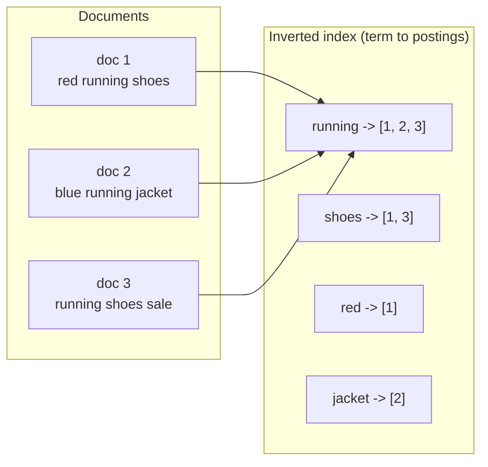
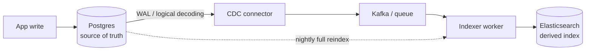

# Search engines

## Why this matters

It's a Tuesday afternoon and the support inbox is on fire. The product team shipped a search box on the catalog page last sprint, and it's backed by the obvious thing: `SELECT * FROM products WHERE name ILIKE '%' || $1 || '%'`. It worked great in the demo with 200 rows. Now there are millions of products, and every keystroke in the search box runs a leading-wildcard `ILIKE` that no B-tree index can serve, so Postgres falls back to a sequential scan. Each search is a full-table read that takes seconds. A few dozen users typing at once and the database CPU saturates, checkout queries start timing out, and the on-call engineer is staring at a dashboard wondering why the *search feature* took down *payments*.

The deeper problem isn't the missing index. It's that `ILIKE '%term%'` doesn't do what your users think search does. It can't rank "iPhone 15 Pro case" above "case for older iPhone, fits 15 maybe" when someone types `iphone 15 case`. It doesn't handle plurals, typos, stemming, or stop words. It matches substrings, not *meaning*. The moment a product manager says "results should be ranked by relevance" or "search should still find it if they type *runing shoes*," you have left the world of `WHERE` clauses and entered the world of inverted indexes and relevance scoring.

This chapter is about that boundary: what a real search engine does that your primary database can't, why you almost never want search traffic hitting your system of record, and how to stand up Elasticsearch or OpenSearch (or Postgres full-text search, when the scale doesn't justify a cluster) with an index you can actually tune. The engineers who understand the inverted index treat relevance as a knob they can turn. The ones who don't keep adding `ILIKE` clauses and wondering why search "feels wrong."

## Mental model

A relational index answers "where is the row whose column equals X?" A search engine answers a different question: "which documents contain these terms, and how relevant is each one?" That difference is built on a data structure called the **inverted index**.

A normal (forward) index maps document to contents. An inverted index flips it: it maps each *term* to the list of documents containing that term (the **postings list**), along with where and how often it appears. To find every document containing "shoes," you don't scan documents, you look up one key and get a precomputed list.



Getting from raw text to those terms is the job of an **analyzer**, which is a pipeline: a *character filter* (e.g. strip HTML), a *tokenizer* (split "red running shoes" into `[red, running, shoes]`), and a chain of *token filters* (lowercase, remove stop words, stem `running` to `run`). The same analyzer runs at index time *and* query time. That symmetry is why a search for `Running` matches a document that stored `run`. Get the analyzers out of sync and your queries silently return nothing.

When multiple documents match, the engine ranks them with **BM25** (the default since Elasticsearch 5.0 and in OpenSearch). BM25 rewards a term that appears often in a document (term frequency), discounts terms that appear in *many* documents because they're less discriminating (inverse document frequency), and normalizes for document length so a long article doesn't beat a tight product title just by mentioning the term more. You don't need the formula memorized; you need the intuition: rare terms that appear often in a short field score highest.

The last structural idea is **query context versus filter context**. A *query* asks "how well does this match?" and produces a relevance score. A *filter* asks "does this match, yes or no?" with no scoring, and the result is cacheable. `price < 100` and `in_stock = true` belong in filter context: they're cheap, cacheable, and shouldn't affect ranking. The free-text match belongs in query context. Mixing these up is the single most common cause of both slow and badly-ranked search.

## In practice

The examples below use Elasticsearch/OpenSearch REST syntax (the two are API-compatible for everything here). I'll show the lightweight Postgres alternative at the end.

### Define a mapping with analyzers

Don't let the engine guess your schema. A **mapping** is the index's schema: field types and which analyzer each field uses.

```json
PUT /products
{
  "settings": {
    "analysis": {
      "analyzer": {
        "english_custom": {
          "type": "custom",
          "tokenizer": "standard",
          "filter": ["lowercase", "english_stop", "english_stemmer"]
        }
      },
      "filter": {
        "english_stop":    { "type": "stop", "stopwords": "_english_" },
        "english_stemmer": { "type": "stemmer", "language": "english" }
      }
    }
  },
  "mappings": {
    "properties": {
      "name":        { "type": "text", "analyzer": "english_custom" },
      "description": { "type": "text", "analyzer": "english_custom" },
      "brand":       { "type": "keyword" },
      "price":       { "type": "scaled_float", "scaling_factor": 100 },
      "in_stock":    { "type": "boolean" },
      "created_at":  { "type": "date" }
    }
  }
}
```

The distinction that bites everyone: `text` fields are analyzed (tokenized, stemmed) and are for full-text search; `keyword` fields are stored verbatim and are for exact match, filtering, sorting, and aggregations. `brand` is a `keyword` because you want to filter on `brand = "Nike"` exactly and aggregate counts per brand, and you never want it stemmed into `nik`. A field can be both via a multi-field, e.g. `name` as `text` for search plus `name.raw` as `keyword` for sorting.

### Index documents

```bash
# Single document
curl -X POST localhost:9200/products/_doc/sku-1001 -H 'Content-Type: application/json' -d '{
  "name": "Nike Pegasus 41 Running Shoes",
  "description": "Responsive road running shoe with a breathable mesh upper.",
  "brand": "Nike",
  "price": 139.99,
  "in_stock": true,
  "created_at": "2026-03-01"
}'
```

In production you never index one at a time. Use the **bulk API**, which takes newline-delimited action/document pairs and amortizes network and indexing overhead across thousands of docs per request:

```json
POST /products/_bulk
{ "index": { "_id": "sku-1001" } }
{ "name": "Nike Pegasus 41 Running Shoes", "brand": "Nike", "price": 139.99, "in_stock": true }
{ "index": { "_id": "sku-1002" } }
{ "name": "Adidas Ultraboost Running Shoe", "brand": "Adidas", "price": 189.99, "in_stock": false }
```

### A relevance-tuned query

Here's the query that replaces the `ILIKE` disaster. It searches the free-text fields, boosts the title, applies stock and price as cheap cacheable filters, and nudges newer products up.

```json
POST /products/_search
{
  "query": {
    "bool": {
      "must": [
        {
          "multi_match": {
            "query": "running shoes",
            "fields": ["name^3", "description"],
            "fuzziness": "AUTO"
          }
        }
      ],
      "filter": [
        { "term":  { "in_stock": true } },
        { "range": { "price": { "lte": 200 } } }
      ]
    }
  }
}
```

Read it piece by piece. `must` puts the text match in **query context**, so it scores. `name^3` boosts title matches to three times the weight of description matches, because a product whose *name* contains "running shoes" is far more relevant than one that merely mentions running in a paragraph. `fuzziness: AUTO` makes `runing` match `running` by allowing a Levenshtein edit distance based on term length. The `filter` block is **filter context**: `in_stock` and `price` are yes/no constraints that don't touch the score and *are cached* by the engine, so repeated searches with the same filters get faster.

When the PM says "rank by relevance but break ties toward fresher and cheaper," reach for `function_score` rather than sorting by a single field (which throws relevance away entirely):

```json
POST /products/_search
{
  "query": {
    "function_score": {
      "query": { "multi_match": { "query": "running shoes", "fields": ["name^3", "description"] } },
      "functions": [
        { "gauss": { "created_at": { "origin": "now", "scale": "30d", "decay": 0.5 } } }
      ],
      "boost_mode": "multiply"
    }
  }
}
```

The `gauss` decay function multiplies each document's relevance score by a factor that smoothly falls off as the product ages, so recency *modulates* relevance instead of replacing it. This is the difference between "newest first" (often useless) and "the best matches, freshness as a tiebreaker."

### Aggregations: search and analytics in one pass

Aggregations compute facets and metrics over the matched set, the "N results, M Nike, K Adidas" sidebar on every shopping site.

```json
POST /products/_search
{
  "size": 0,
  "query": { "match": { "name": "running shoes" } },
  "aggs": {
    "by_brand": { "terms": { "field": "brand" } },
    "avg_price": { "avg": { "field": "price" } }
  }
}
```

`size: 0` says "I don't want the documents, just the aggregations." `by_brand` works *because* `brand` is a `keyword`. You cannot aggregate on an analyzed `text` field without enabling `fielddata`, which is a memory trap you should almost never spring.

### The lightweight alternative: Postgres full-text search

If you have a few hundred thousand rows and don't need fuzzy matching, faceting, or a separate cluster to operate, Postgres has built-in full-text search and you should reach for it before standing up Elasticsearch. It gives you an inverted index (a GIN index over `tsvector`) and rank-based ordering without a second system to keep in sync.

```sql
-- A generated column holds the analyzed document, weighted by field.
ALTER TABLE products
  ADD COLUMN search_doc tsvector
  GENERATED ALWAYS AS (
    setweight(to_tsvector('english', coalesce(name, '')), 'A') ||
    setweight(to_tsvector('english', coalesce(description, '')), 'B')
  ) STORED;

CREATE INDEX products_search_idx ON products USING GIN (search_doc);

-- Query with ranking; 'A' weight (name) outranks 'B' (description).
SELECT id, name, ts_rank(search_doc, query) AS rank
FROM products, websearch_to_tsquery('english', 'running shoes') AS query
WHERE search_doc @@ query
  AND in_stock = true
  AND price <= 200
ORDER BY rank DESC
LIMIT 20;
```

`to_tsvector('english', ...)` is the analyzer: it tokenizes, lowercases, drops stop words, and stems. `websearch_to_tsquery` parses user input the way a search box should (quoted phrases, `or`, `-exclusion`). `setweight` gives `name` matches a higher weight than `description`, the equivalent of `name^3`. The `@@` operator is the match; `ts_rank` is the score. For typo tolerance, add the `pg_trgm` extension and a trigram index. This handles a surprising amount of real product search. The line you cross into Elasticsearch is roughly: tens of millions of documents, heavy faceting, fuzzy-at-scale, or search QPS that you don't want competing with transactional load.

### Keeping the index in sync with the source of truth

This is where most search projects rot. Your system of record is Postgres; Elasticsearch is a **derived, eventually-consistent copy**. Treat it as disposable: you must always be able to rebuild it from scratch.



Three viable patterns, in increasing order of robustness:

1. **Dual write** — the app writes to Postgres and Elasticsearch in the same request. Simple, and *wrong* for anything that matters: there's no transaction spanning both stores, so a crash between the two writes leaves them permanently diverged. Acceptable only as a first prototype.
2. **Transactional outbox** — the app writes the row *and* an `outbox` event row in one Postgres transaction. A separate worker reads the outbox and pushes to Elasticsearch, marking events done. Now the write is atomic and the index update is at-least-once. This is the pragmatic default.
3. **Change Data Capture (CDC)** — a connector (Debezium reading Postgres logical replication, for example) streams every committed change to a queue, and an indexer consumes it. Decoupled, ordered, and replayable; the price is operating the pipeline.

Whichever you pick, make every document version-aware so out-of-order updates can't resurrect stale data. Use the row's `updated_at` (or a monotonic version) as the document's external version:

```bash
# Reject the write if a newer version is already indexed.
curl -X PUT "localhost:9200/products/_doc/sku-1001?version_type=external&version=1717286400" \
  -H 'Content-Type: application/json' -d '{ "name": "Nike Pegasus 41", "price": 129.99 }'
```

And always have a **full reindex** path: index into a new index `products_v2`, then atomically swing an **alias** from `products_v1` to `products_v2`. Applications query the alias `products`, never the concrete index, so a rebuild is invisible and instantly reversible.

```json
POST /_aliases
{ "actions": [
  { "remove": { "index": "products_v1", "alias": "products" } },
  { "add":    { "index": "products_v2", "alias": "products" } }
]}
```

## Pitfalls and anti-patterns

**1. Running search on your primary database.** The `ILIKE '%term%'` from the opening scenario is the canonical version, but even Postgres full-text search becomes a problem when search QPS competes with transactional writes for the same buffer cache and CPU. The failure mode: a feature that's "just a query" couples your search availability to your checkout availability. Recognize it when search latency and database write latency rise together. Fix it by isolating search load, either a read replica dedicated to FTS, or a separate search engine entirely once volume justifies it.

**2. Analyzer mismatch between index and query.** You index `name` with an English stemmer but query a sub-field that uses the `standard` analyzer (no stemming). A search for `runs` doesn't match the indexed `run`, and you get zero results for queries that "obviously" should match. Recognize it by testing with the `_analyze` API: `POST /products/_analyze {"analyzer":"english_custom","text":"running shoes"}` shows exactly what tokens are produced. Fix it by ensuring index-time and search-time analyzers agree (or set `search_analyzer` deliberately when you *want* them to differ).

**3. Putting cheap constraints in query context.** Writing `price < 100` and `in_stock = true` inside `must` instead of `filter`. This computes a meaningless relevance contribution for boolean constraints and defeats the filter cache, so identical filtered searches never speed up. Recognize it with the Profile API showing scoring time on fields that shouldn't score. Fix it by moving every yes/no constraint into the `filter` clause.

**4. Mapping explosion and the keyword/text confusion.** Letting dynamic mapping infer types from arbitrary JSON, so every new field key creates a mapping entry until the index hits the field limit and rejects writes. Closely related: indexing a high-cardinality identifier as `text` and then trying to sort or aggregate on it, forcing `fielddata` into the JVM heap and OOMing the node. Recognize it via mapping growth alerts or heap pressure on aggregation queries. Fix it with an explicit mapping, `dynamic: strict` (or `false`), and `keyword` for anything you filter, sort, or aggregate.

**5. Treating the search index as a system of record.** Reading data back from Elasticsearch as if it were authoritative, with no rebuild path. When (not if) the index is corrupted, deleted, or its mapping needs a breaking change, you discover you can't regenerate it and you've lost data that lived only there. Recognize it by asking "can we drop this index and rebuild it from Postgres in an hour?" If the answer is no, you have this bug. Fix it by keeping the index strictly derived and scripting a full reindex from the source of truth.

## Production checklist

- [ ] Explicit mapping defined; `dynamic` set to `strict` or `false` so unexpected fields don't silently expand the schema
- [ ] Every filterable/sortable/aggregatable field is `keyword` (or a multi-field), never analyzed `text`
- [ ] Index-time and search-time analyzers verified with the `_analyze` API
- [ ] All yes/no constraints (status, stock, price ranges, dates) in `filter` context, not `query` context
- [ ] Free-text search uses `multi_match` with deliberate field boosts; relevance validated against a labeled judgment set, not vibes
- [ ] Indexing uses the `_bulk` API with backpressure, not per-document requests
- [ ] Documents carry an external version so out-of-order updates can't overwrite newer data
- [ ] Applications query an **alias**, never a concrete index name, enabling zero-downtime reindex
- [ ] A tested, scripted **full reindex from the source of truth** exists and is run regularly, not just in emergencies
- [ ] Sync pipeline is outbox or CDC, not naive dual writes
- [ ] Cluster has more than one node, replica shards configured, and snapshots scheduled to durable storage (S3/GCS)
- [ ] Slow-query and indexing-rejection logs monitored; heap and shard count within recommended limits

## Exercises

1. **(Comprehension)** Using the `_analyze` API (or `to_tsvector` in Postgres), run the text `"The Runners were RUNNING quickly"` through a standard analyzer and then through an English-stemming analyzer. List the resulting tokens for each. Explain why a user searching `run` will or won't match this document under each analyzer, and what that implies about keeping index-time and query-time analysis in sync.

2. **(Applied)** Build the catalog search from this chapter. Create the `products` mapping, bulk-index at least 20 documents across three brands and a range of prices, then write one query that: full-text matches a phrase across `name` (boosted) and `description`, filters to `in_stock` and a price ceiling, applies a recency decay, and returns a `terms` aggregation by brand. Verify that moving the price/stock constraints from `must` to `filter` changes neither the result set nor the relative ranking (only the scores).

3. **(Design)** You're adding search to an app whose source of truth is a 30-table Postgres database, where a "product" document is denormalized from products, variants, inventory, and reviews. Design the indexing pipeline end to end: how a change to any of those tables propagates to the search index, how you guarantee at-least-once delivery and correct ordering, how you handle a breaking mapping change with zero downtime, and how you'd do a full rebuild. State which sync pattern (dual write, outbox, CDC) you'd choose and defend the tradeoff.

## Further reading

- Elasticsearch Guide — [Mapping](https://www.elastic.co/guide/en/elasticsearch/reference/current/mapping.html) and [Query DSL](https://www.elastic.co/guide/en/elasticsearch/reference/current/query-dsl.html) (official docs; OpenSearch's docs mirror these closely)
- Stephen Robertson and Hugo Zaragoza, ["The Probabilistic Relevance Framework: BM25 and Beyond"](https://www.staff.city.ac.uk/~sbrp622/papers/foundations_bm25_review.pdf) — the primary source on the scoring function every engine now defaults to
- Manning, Raghavan, and Schütze, *Introduction to Information Retrieval* (Cambridge, free online at https://nlp.stanford.edu/IR-book/) — chapters 1-2 build the inverted index and analyzers from first principles
- PostgreSQL Documentation — [Chapter 12, Full Text Search](https://www.postgresql.org/docs/current/textsearch.html)
- Debezium Documentation — [PostgreSQL connector](https://debezium.io/documentation/reference/stable/connectors/postgresql.html) for CDC-based index synchronization

> **Connect the dots:** The sync problem here is the same eventual-consistency and CAP tradeoff from Chapter 3 of this Part: your search index is an AP replica of a CP source of truth. The outbox and CDC patterns are the data-layer cousins of the event-driven architectures in Part 7, an inverted index is just one more materialized view fed by a change stream.

> **Security note:** A search index is a notorious place for data to leak. First, never expose the raw query DSL to clients, accepting arbitrary JSON queries lets an attacker run expensive aggregations, scripts, or scroll your entire corpus; build queries server-side from a constrained API. Second, search indexes routinely *over-collect*: a denormalized product document can drag in internal cost, supplier, or PII fields that were never meant to be searchable, and once indexed they're trivially dumpable. Index only the fields a query needs, and enforce per-tenant or per-user authorization as a mandatory `filter` clause on every search (document-level security in the X-Pack/OpenSearch Security plugin, or an unconditional `term` filter you add server-side) so one tenant can never retrieve another's documents. Finally, encrypt snapshots at rest, a search backup is a full copy of your searchable data and is exactly what shows up in breach dumps.
