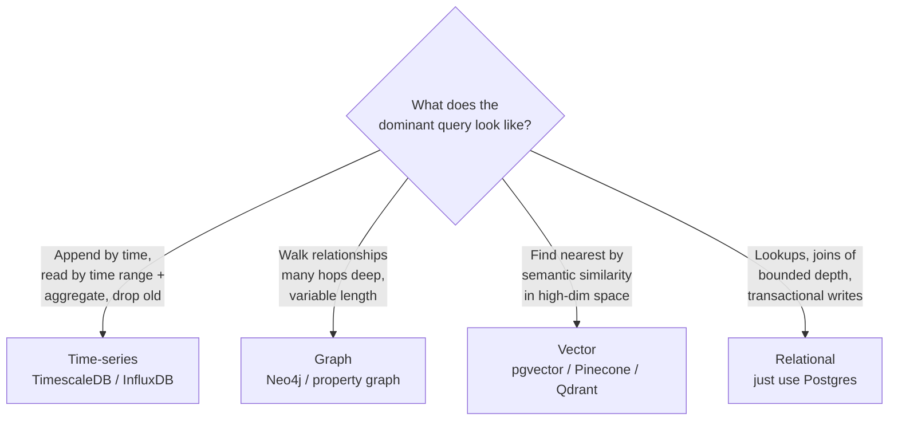

# Time-series, graph, and vector databases

## Why this matters

It's a Tuesday afternoon and the dashboard team is filing a ticket: the "CPU usage, last 7 days" chart on the ops page takes 40 seconds to load, and sometimes the query times out entirely. You look at the table. It's a Postgres table called `metrics` with 1.4 billion rows: `(host_id, metric_name, ts, value)`. The query rolls up per-minute samples into per-hour averages across 200 hosts. Postgres is doing a sequential scan over a B-tree that's larger than RAM, sorting hundreds of millions of rows into hourly buckets on every page load. You add an index. It helps for one host and falls over for the "all hosts" view. You add a covering index. The table is now half index. The writes — 30,000 samples a second streaming in from agents — start lagging because every insert touches a fat index.

This is the moment a lot of engineers reach for "we need a different database," and half the time they're wrong. The other half, they're right but pick the wrong one. The metrics table is a genuine time-series workload: append-heavy, time-ordered, queried in ranges with aggregation, and old data is worth less than new data. A time-series store eats this for breakfast. But the "recommended products" feature two sprints later, which someone also wants to move to a "specialized database," is a relational join problem dressed up as a graph problem, and moving it to Neo4j would be a mistake.

The skill this chapter builds is not "how to run InfluxDB." It's the judgment to recognize which of three specialized shapes your workload actually has — time-series, graph, or vector — and, just as importantly, when it has none of them and Postgres with the right extension is the correct answer. Specialized databases buy enormous wins on the workload they're built for and impose real operational tax everywhere else. Premature specialization is how you end up running five datastores to serve one product.

## Mental model

Each of these three databases exists because a specific access pattern is expensive or awkward in a row-oriented relational engine. The trick is to recognize the *shape of the query*, not the shape of the data. The same data can belong in different stores depending on how you read it.



The unifying idea: a specialized store earns its place when the **dominant** query is one a B-tree cannot answer efficiently.

- **Time-series** workloads are append-mostly with a monotonic time axis. The win comes from time-partitioned storage (so old chunks compress and drop cheaply), columnar compression of repetitive metric values, and aggregate pre-computation. The query that justifies it: range scan plus downsample over a high-cardinality, high-ingest stream. The query that doesn't: occasional point lookups on a few thousand rows — that's just an indexed table.

- **Graph** workloads traverse relationships of *variable, often unbounded depth*. The win comes from index-free adjacency: each node stores direct pointers to its neighbors, so a traversal is pointer-chasing, not repeated index lookups. The query that justifies it: "friends-of-friends-of-friends who bought X," shortest path, cycle detection. The query that doesn't: a two-table `JOIN` you could write in your sleep. Relational joins only become pathological when the number of joins grows with the depth of the question.

- **Vector** workloads find the *k* nearest neighbors to a query point in a 384-to-3072-dimensional embedding space. Exact nearest-neighbor search is O(n) per query; the win comes from approximate nearest-neighbor (ANN) indexes (HNSW, IVF) that trade a little recall for logarithmic-ish search. The query that justifies it: semantic search, recommendations, retrieval for RAG (Part 12). The query that doesn't: anything you can answer with `WHERE category = 'shoes'`. Vectors are for "similar to," not "equal to."

## In practice

### Time-series: TimescaleDB

For most teams already on Postgres, the right first move is not InfluxDB — it's TimescaleDB, a Postgres extension that turns a regular table into a time-partitioned **hypertable** while keeping full SQL. You don't migrate your application's query language or your auth or your backups.

```sql
CREATE EXTENSION IF NOT EXISTS timescaledb;

CREATE TABLE metrics (
    ts          timestamptz   NOT NULL,
    host_id     int           NOT NULL,
    metric      text          NOT NULL,
    value       double precision NOT NULL
);

-- Partition into 1-day chunks on the time column.
SELECT create_hypertable('metrics', by_range('ts', INTERVAL '1 day'));

CREATE INDEX ON metrics (host_id, metric, ts DESC);
```

The slow rollup from the opening scenario becomes a **continuous aggregate** — a materialized, incrementally-refreshed view that pre-buckets the data so the dashboard reads a small table instead of scanning a billion rows:

```sql
CREATE MATERIALIZED VIEW metrics_hourly
WITH (timescaledb.continuous) AS
SELECT
    time_bucket('1 hour', ts) AS bucket,
    host_id,
    metric,
    avg(value)  AS avg_value,
    max(value)  AS max_value
FROM metrics
GROUP BY bucket, host_id, metric;

-- Keep it fresh automatically.
SELECT add_continuous_aggregate_policy('metrics_hourly',
    start_offset => INTERVAL '3 hours',
    end_offset   => INTERVAL '1 hour',
    schedule_interval => INTERVAL '1 hour');
```

Then the two policies that make time-series economical — compression of cold chunks and automatic deletion of data past its useful life:

```sql
-- Columnar-compress chunks older than 7 days; segment by the
-- columns you filter on so compressed reads stay selective.
ALTER TABLE metrics SET (
    timescaledb.compress,
    timescaledb.compress_segmentby = 'host_id, metric',
    timescaledb.compress_orderby   = 'ts DESC'
);
SELECT add_compression_policy('metrics', INTERVAL '7 days');

-- Drop raw data after 90 days; the hourly rollup lives on.
SELECT add_retention_policy('metrics', INTERVAL '90 days');
```

That last pair is the heart of a time-series system: **downsample, compress, retain, drop**. You keep high-resolution data while it's hot, roll it into coarser aggregates as it ages, and discard the raw samples once nobody queries them at full fidelity.

When would you reach past TimescaleDB to a purpose-built engine like InfluxDB? When ingest is so high (millions of points per second) and the schema so uniform that Postgres's row overhead and WAL become the bottleneck, or when you want a push-based query language (Flux/InfluxQL) and a tightly-integrated agent ecosystem (Telegraf). For the majority of "we have metrics and they're slow" problems, that's over-buying.

### Graph: Neo4j and Cypher

Here's the workload that justifies a graph database. You have users, products, and purchases, and the product question is: "Customers who bought what *this* customer bought also bought what — going two hops out?" In SQL, every hop is another self-join:

```sql
-- The relational anti-shape: joins multiply with traversal depth.
SELECT DISTINCT p2.name
FROM purchases pu1
JOIN purchases pu2 ON pu2.product_id = pu1.product_id AND pu2.user_id <> pu1.user_id
JOIN purchases pu3 ON pu3.user_id   = pu2.user_id
JOIN products  p2  ON p2.id         = pu3.product_id
WHERE pu1.user_id = 42
  AND pu3.product_id <> pu1.product_id;
```

Two hops is already four joins. Ask for "friends of friends of friends" on a social graph and you're writing a join per level, with each join exploding the intermediate result set. Six degrees of separation is a six-way self-join over a table with hundreds of millions of rows. That's the pathology graph databases exist to kill.

In a property graph, relationships are first-class and stored as direct adjacency. Cypher expresses the traversal declaratively, and depth is a pattern, not a join count:

```cypher
// Model
(:User {id: 42})-[:BOUGHT]->(:Product {name: 'Trail Runners'})

// "Also bought" -- co-purchase recommendation, two hops, one statement.
MATCH (me:User {id: 42})-[:BOUGHT]->(p:Product)
      <-[:BOUGHT]-(other:User)-[:BOUGHT]->(rec:Product)
WHERE NOT (me)-[:BOUGHT]->(rec)
RETURN rec.name, count(*) AS strength
ORDER BY strength DESC
LIMIT 10;
```

Variable-length traversal — the thing SQL genuinely cannot do without recursive CTEs that get ugly fast — is a single operator:

```cypher
// Shortest connection path between two people, up to 6 hops.
MATCH path = shortestPath(
  (a:User {id: 42})-[:KNOWS*..6]-(b:User {id: 9001})
)
RETURN path;
```

The honest tradeoff: graph databases shine when traversal depth is **variable or large and central to the product** — fraud rings, network/dependency analysis, knowledge graphs, identity resolution, recommendations driven by multi-hop relationships. They do *not* earn their place for a relationship two joins deep that you query occasionally. And Postgres can do real graph work with recursive CTEs or the AGE extension; reach for Neo4j when graph queries are the *primary* workload, not a side feature, because you'll pay for a second datastore, a second query language, and a second operational runbook.

### Vector: pgvector and ANN search

A support tool needs "find the 5 most semantically similar past tickets." You embed each ticket with a model (the embedding generation belongs to Part 12; here we store and search the resulting vectors). With `pgvector`, this stays inside Postgres:

```sql
CREATE EXTENSION IF NOT EXISTS vector;

CREATE TABLE tickets (
    id         bigserial PRIMARY KEY,
    body       text,
    team       text,
    embedding  vector(1536)        -- dimensionality of your embedding model
);

-- HNSW index for approximate nearest-neighbor search.
-- vector_cosine_ops matches the distance metric you query with.
CREATE INDEX ON tickets
USING hnsw (embedding vector_cosine_ops);
```

The query uses a distance operator (`<=>` is cosine distance in pgvector) and an `ORDER BY ... LIMIT` that the HNSW index accelerates:

```sql
SELECT id, body, 1 - (embedding <=> $1) AS similarity
FROM tickets
WHERE team = 'billing'          -- ordinary SQL filter, composes with ANN
ORDER BY embedding <=> $1       -- $1 is the query embedding
LIMIT 5;
```

The win that pure vector databases (Pinecone, Qdrant, Weaviate, Milvus) offer over pgvector is at scale: very large vector counts, sharding, GPU-accelerated indexing, and tunable recall/latency knobs as first-class operations. The win pgvector offers is that your vectors live next to your relational data, so you can filter, join, and transactionally update them with the rest of your schema — no dual-write, no consistency gap between "the row exists" and "its vector is searchable."

My default: start with pgvector. Move to a dedicated vector store when your vector count grows into a range where a single Postgres node's memory can no longer hold the index, when you need consistently low tail latency at high QPS, or when your ANN index no longer fits comfortably in RAM. Both HNSW and IVF indexes are memory-resident structures; the moment the index spills to disk, latency degrades sharply, and that's usually the real signal to specialize.

## Pitfalls and anti-patterns

**1. Premature specialization (the five-datastore startup).** The most common failure isn't using the wrong specialized DB — it's using one at all before the workload demands it. Recognize it when someone proposes a new datastore for a feature that runs fine as an indexed Postgres table, or when your architecture diagram has more databases than engineers. Fix: prove the relational version is the bottleneck first. Postgres with TimescaleDB, AGE, and pgvector covers the long tail of all three workloads at small-to-medium scale with one backup strategy and one set of credentials. Add a specialized store when you have a profiled query that Postgres genuinely can't serve, not when you have a hunch.

**2. Unbounded cardinality in time-series tags.** Recognize it when ingest throughput collapses or memory balloons after you add a "tag" or dimension like `request_id`, `user_id`, or `session_id` to every metric point. Time-series engines build per-series state, and a high-cardinality tag multiplies series count combinatorially. InfluxDB calls this a cardinality explosion and it can OOM the process. Fix: tags/dimensions are for low-cardinality grouping keys (host, region, metric name). Put high-cardinality identifiers in fields/values or, better, don't store per-event IDs in a metrics system at all — that's logging or tracing, a different tool.

**3. Treating a graph database as a general-purpose primary store.** Recognize it when you're writing Cypher to fetch a single node by ID and render a form, or running aggregate reports that scan the whole graph. Graph engines are optimized for traversal, not for scans, bulk analytics, or high-write transactional CRUD. Fix: keep the system of record in Postgres and project the relationship subset into the graph, or restrict the graph to the genuinely traversal-heavy queries. Don't make Neo4j your users table.

**4. ANN recall surprises (the "where did my result go" bug).** Recognize it when a vector that you *know* is in the table doesn't appear in the top-k results. Approximate indexes trade recall for speed by design; an HNSW or IVF search can miss true neighbors. With IVF this is acute if `lists`/`probes` are mistuned. Fix: tune the recall knob (`hnsw.ef_search` in pgvector, `nprobe` for IVF) and measure recall against a brute-force baseline on a sample. For correctness-critical lookups, accept that "nearest neighbor" is approximate and never use it where you need exact equality.

**5. Forgetting retention and compression policies until disk fills.** Recognize it at 2 a.m. when the time-series volume hits 100% and writes start failing. Time-series data grows without bound by definition. Fix: set retention and compression policies on day one, alongside the table definition, not after the incident. The `add_retention_policy` and `add_compression_policy` calls should be in the same migration as `create_hypertable`.

## Production checklist

- [ ] Confirmed the workload's *dominant* query shape (time-range+aggregate / variable-depth traversal / nearest-neighbor) before adopting any specialized store
- [ ] Benchmarked the Postgres-extension version (TimescaleDB / AGE / pgvector) against the dedicated engine on *your* data and query mix, not a vendor demo
- [ ] Time-series: retention, compression, and continuous-aggregate policies defined in the same migration as the hypertable
- [ ] Time-series: tag/dimension cardinality audited; no per-event unique IDs used as series keys
- [ ] Graph: system of record identified (graph as primary store vs. projection); write path and reindex/sync strategy documented
- [ ] Vector: ANN recall measured against a brute-force baseline; `ef_search`/`nprobe` tuned to a recall target; index confirmed to fit in RAM
- [ ] Vector: distance metric in the index (`vector_cosine_ops`) matches the operator used in queries (`<=>`)
- [ ] Backup, restore, and PITR tested for each specialized store — they do *not* share Postgres's backup tooling unless they're Postgres extensions
- [ ] On-call runbook updated for the new store's failure modes (cardinality OOM, index spill, traversal timeout)
- [ ] Cost of the additional operational surface (monitoring, upgrades, expertise) explicitly weighed against the query win

## Exercises

1. **(Comprehension)** For each of these queries, name which store fits best and state the one-sentence reason: (a) "average API latency per endpoint, per 5-minute bucket, last 24 hours"; (b) "all accounts within 4 transaction hops of a flagged fraud account"; (c) "the 10 product descriptions most similar in meaning to this one"; (d) "the email address for user id 8842." One of these should *not* go to a specialized store — identify it.

2. **(Applied)** Take the `metrics` table from this chapter, load it with a synthetic stream (e.g., 50 hosts x 3 metrics x per-minute samples for 30 days). Build the continuous aggregate, compression, and retention policies. Measure the dashboard rollup query's latency against the raw hypertable versus the continuous aggregate, and report the speedup you observe. Then add a high-cardinality `request_id` dimension and observe the effect on ingest and memory.

3. **(Design)** You're architecting a product-recommendation feature with three signals: co-purchase relationships (graph-shaped), recent browsing time-series, and semantic similarity of product descriptions (vector-shaped). Design the data layer. Decide what stays in Postgres (with extensions) versus what justifies a dedicated store, define how data flows and stays consistent between systems, and identify the single scaling metric that would trigger you to split out each specialized store. State what you'd build first and why.

## Further reading

- Martin Kleppmann, *Designing Data-Intensive Applications* (O'Reilly, 2017) — the rigorous reference on storage engines, indexing, and the access patterns that justify specialized stores.
- TimescaleDB documentation — hypertables, continuous aggregates, compression, and retention (https://docs.timescale.com/).
- Ian Robinson, Jim Webber & Emil Eifrem, *Graph Databases*, 2nd ed. (O'Reilly, free at https://neo4j.com/graph-databases-book/) — index-free adjacency and the traversal workloads that defeat relational joins.
- Yu. A. Malkov & D. A. Yashunin, ["Efficient and robust approximate nearest neighbor search using Hierarchical Navigable Small World graphs"](https://arxiv.org/abs/1603.09320) — the HNSW paper behind most modern vector indexes.
- pgvector documentation and README (https://github.com/pgvector/pgvector) — HNSW vs. IVFFlat, distance operators, and recall tuning in Postgres.
- The openCypher specification (https://opencypher.org/) — the query language reference, now the basis for the ISO GQL standard.

> **Connect the dots:** Vector search is the storage half of Retrieval-Augmented Generation (Part 12). The embeddings you index here are produced by the models covered there, and the quality of your RAG answers is gated as much by your ANN recall and chunking strategy as by the LLM itself. Time-series and graph stores also feed the observability and fraud/identity systems discussed in Parts 8 and 11.

> **Security note:** Vector embeddings are not anonymized data — they are a lossy but invertible-enough projection of the source text, and embedding-inversion attacks can reconstruct meaningful fragments of the original input from the vector alone. Treat an `embedding` column derived from PII (support tickets, medical notes, private messages) with the same access controls, encryption-at-rest, and row-level security you'd apply to the raw text. In Postgres, enforce this with RLS policies on the table holding the vectors, and never expose raw embeddings or distance scores across tenant boundaries in a multi-tenant system, since even similarity scores can leak information about other tenants' data.
