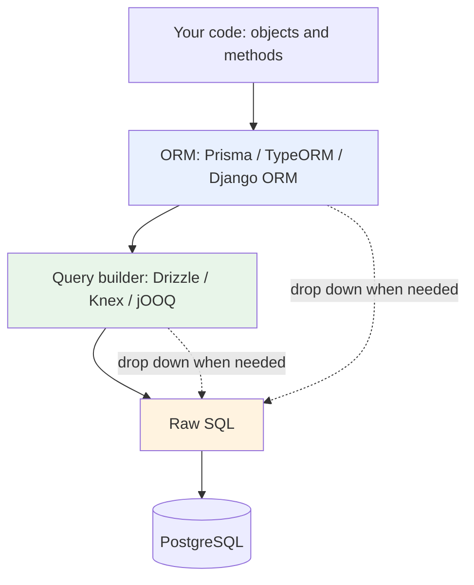
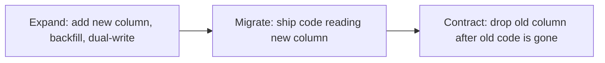

# ORMs and query builders

## Why this matters

It's a Tuesday afternoon and the dashboard is timing out. Not down — timing out. The page that lists a customer's projects with their owners and latest activity used to load in about 200ms. Now it's nine seconds, sometimes thirty, and the on-call graph shows the database pinned near full CPU with nothing obviously wrong. No slow query stands out in the logs because there is no slow query. There are thousands of fast ones.

You open the APM trace and there it is: one query to fetch the projects, then one query per project to fetch each owner, then one more per project for each latest activity. The code that did this is three lines long and looks completely innocent:

```typescript
const projects = await prisma.project.findMany({ where: { orgId } });
for (const p of projects) {
  console.log(p.name, (await p.owner()).name); // one query per iteration
}
```

Nobody wrote a loop full of SQL. The ORM wrote it, silently, on your behalf. This is the N+1 query problem, and it is the single most common way ORMs turn a clean codebase into a database fire. The abstraction that made the happy path one line long also hid the cost of that line until it showed up in production under real data volume.

The engineers who fear their ORM disable it for everything important and hand-write SQL strings, reintroducing injection bugs and losing type safety. The engineers who trust it blindly ship N+1 storms and `SELECT *` over forty-column tables. The ones who are actually productive understand exactly what SQL their ORM emits, know when to let it drive and when to take the wheel, and treat migrations as a discipline rather than an afterthought. This chapter is about becoming the third kind. The goal is not to love or hate your ORM. It is to stop being surprised by it.

## Mental model

An ORM (Object-Relational Mapper) sits between two data models that fundamentally disagree. Your application thinks in objects with references and method calls and lazy traversal. The database thinks in flat rows, sets, and joins. The gap between them is the **object-relational impedance mismatch**, and no ORM closes it completely — it papers over it, and the paper tears under load.

It helps to see the three layers as a stack, each trading abstraction for control:



At the top, an **ORM** maps tables to classes and rows to objects. It gives you relations as object properties, change tracking, and migrations. The cost is distance from the SQL: you express intent in the ORM's vocabulary and trust it to generate good SQL, which it usually does and occasionally does catastrophically.

In the middle, a **query builder** (Drizzle, Knex, jOOQ) is a thin, type-safe layer over SQL. You still write `select`, `from`, `where`, `join` — but as composable, type-checked function calls instead of string concatenation. There is almost no hidden behavior: the SQL you build is the SQL that runs. You lose automatic relation loading and identity mapping; you gain predictability.

At the bottom, **raw SQL** gives you everything PostgreSQL can do — window functions, CTEs, `DISTINCT ON`, lateral joins, `FOR UPDATE SKIP LOCKED` — at the cost of writing and maintaining strings, and the burden of parameterizing them safely.

The key insight: these are not competing religions, they are layers of the same stack, and a healthy codebase uses all three. The ORM handles the large majority of queries that are simple CRUD — fetch by id, insert a row, update a field. The query builder handles the dynamic-filter and reporting queries where you want type safety but precise control over the shape and the joins. Raw SQL handles the small remainder that needs a feature the abstraction can't express. The skill is knowing which layer a given query belongs in — and being able to drop down one level without rewriting your whole data access strategy. A team that treats the choice as all-or-nothing ends up either fighting the ORM on every report or hand-rolling SQL for trivial lookups. Both extremes cost more than the disciplined middle.

## In practice

### The N+1 query, and three ways to kill it

Start with the disaster from the opening, written explicitly so we can fix it. Using a Prisma-style API:

```typescript
// WRONG: N+1. One query for projects, then one per project for the owner.
const projects = await prisma.project.findMany({ where: { orgId } });
const rows = [];
for (const p of projects) {
  const owner = await prisma.user.findUnique({ where: { id: p.ownerId } });
  rows.push({ project: p.name, owner: owner.name });
}
```

If `orgId` has five hundred projects, that's 501 round trips to the database. Each is fast in isolation, but each pays the full network and query-planning round-trip cost, and they run serially — every iteration waits for the previous one to return before it starts. The query time is negligible; the waiting is not. Wall-clock latency scales linearly with row count, which is exactly why the page was fine in staging with ten rows and fell over in production with five hundred. The cost was always there; it only became visible at scale.

**Fix 1 — eager loading via the relation.** Tell the ORM to fetch the relation in the same logical operation. Prisma does this with `include`:

```typescript
// RIGHT: the ORM batches the relation load.
const projects = await prisma.project.findMany({
  where: { orgId },
  include: { owner: { select: { id: true, name: true } } },
});
const rows = projects.map((p) => ({ project: p.name, owner: p.owner.name }));
```

Under the hood Prisma issues two queries total, regardless of project count: one for the projects, one `SELECT ... WHERE id IN (...)` for all the owners, then stitches them together in memory. Two queries instead of 501, and the count no longer grows with the data. Note the `select` narrowing the owner columns — fetch what you display, not the whole row.

**Fix 2 — a single join, via a query builder.** When you want one round trip and full control of the shape, drop to Drizzle:

```typescript
import { eq } from "drizzle-orm";

const rows = await db
  .select({ project: projects.name, owner: users.name })
  .from(projects)
  .innerJoin(users, eq(projects.ownerId, users.id))
  .where(eq(projects.orgId, orgId));
```

This emits exactly one `SELECT ... INNER JOIN ... WHERE` and returns precisely the two columns you asked for. The SQL is obvious from the code, and the result types are inferred from the column selection, so a typo in a column name is a compile error, not a runtime one. There is no lazy loading to accidentally trigger.

**Fix 3 — raw SQL for the shape the abstraction can't express.** Suppose you also need each project's single most recent activity. That's a `DISTINCT ON` or a lateral subquery, a PostgreSQL feature most ORMs can't express directly:

```sql
SELECT p.id,
       p.name        AS project,
       u.name        AS owner,
       a.created_at  AS last_activity
FROM projects p
JOIN users u ON u.id = p.owner_id
LEFT JOIN LATERAL (
  SELECT created_at
  FROM activities
  WHERE activities.project_id = p.id
  ORDER BY created_at DESC
  LIMIT 1
) a ON true
WHERE p.org_id = $1;
```

Parameterized with `$1` — never string-interpolated. One query, the exact shape you need, using a `LATERAL` join that no mainstream ORM's fluent API can produce cleanly. This is the case where dropping to SQL is the right call, not a failure. The discipline is to keep these queries rare, named, and tested, not to let them metastasize into a parallel data layer.

### Detecting N+1 before production does

Don't rely on noticing nine-second page loads. Make the database tell you. In development, log every query and count them per request:

```typescript
const prisma = new PrismaClient({ log: ["query"] });
```

Then watch the count per request in your logs or APM. A request that should issue two or three queries but issues two hundred is an N+1 you can catch in code review. Tools like Prisma's query logging, Django's `assertNumQueries` in tests, and the `nplusone` family of linters turn this from a production incident into a failing test. The single highest-leverage habit with any ORM: **always know how many queries a request makes, and assert on it in tests for hot paths.** A query-count assertion is cheap to write and catches the entire class of regression — someone adding an innocent `.map()` over a relation six months from now will fail the test instead of paging you.

### Migration discipline: reversible, backward-compatible, zero-downtime

Migrations are where ORMs earn their keep and where they cause outages. The rule that matters most: **a migration must be backward-compatible with the currently-running application code, because during a deploy both old and new code run against the same schema simultaneously.**

This means you cannot rename or drop a column in one step if old code still reads it. The disaster:

```sql
-- WRONG: old pods still SELECT email_address; they now error on every request.
ALTER TABLE users RENAME COLUMN email_address TO email;
```

The moment that migration runs, every still-running instance of the old code that selects `email_address` starts throwing errors, and it keeps throwing until the rollout finishes — a self-inflicted partial outage that lasts the length of your deploy window. The correct approach is the **expand/contract** (also called parallel-change) pattern, spread across multiple deploys:



In SQL, the expand phase:

```sql
-- Migration 1 (expand): additive only, safe with old code running.
ALTER TABLE users ADD COLUMN email TEXT;
UPDATE users SET email = email_address WHERE email IS NULL; -- backfill in batches for large tables
```

Application code is then deployed to write both columns and read the new one. Only after every old pod is gone — and you have verified nothing still references the old column — do you run the contract migration:

```sql
-- Migration 2 (contract): runs in a LATER deploy, once no code reads email_address.
ALTER TABLE users DROP COLUMN email_address;
```

Two more PostgreSQL-specific rules that prevent locking outages:

- **Adding an index locks writes unless you use `CONCURRENTLY`.** `CREATE INDEX CONCURRENTLY idx_projects_org ON projects(org_id);` builds without taking an `ACCESS EXCLUSIVE` lock that would block writes for the duration of the build. It can't run inside a transaction, so configure your migration tool to run it outside one. The tradeoff is that a concurrent build can fail and leave an invalid index behind, which you then drop and rebuild.
- **Backfilling a huge table in one `UPDATE` holds a long transaction and bloats the table.** A single statement touching every row keeps one transaction open for its whole duration, blocking vacuum and accumulating dead tuples. Batch it: update a bounded number of rows at a time in a loop, committing between batches, so each transaction is short.

Every migration should be reversible. Prisma and most tools generate a `down` step; write it, and test that `migrate up` then `migrate down` returns to the prior schema. A migration you can't roll back is a deploy you can't safely abort, and the time to discover that is not at 2 a.m. during an incident.

## Pitfalls and anti-patterns

**1. The silent N+1.** *How to recognize:* a request that should make a handful of queries makes hundreds; database CPU spikes with no single slow query; the offending code is an innocent-looking loop or a relation accessed inside `.map()`. *How to fix:* use eager loading (`include` / `with` / `select_related`), or drop to a join. Add a test that asserts the query count on hot paths so the regression can't return. Enable query logging in dev so you see the count while writing the code.

**2. `SELECT *` by default.** *How to recognize:* most ORMs fetch every column unless told otherwise; you're pulling a large `description` field and a `jsonb` blob to render a list that shows only a name and a date. Wide rows balloon network transfer and defeat index-only scans. *How to fix:* always project the columns you actually use (`select: { id, name }`). For list endpoints, narrowing the projection alone can cut payload and latency substantially.

**3. Business logic hidden in lazy-loading proxies.** *How to recognize:* code reads `order.customer.address.country` and each dotted access secretly fires a query; the same object graph triggers different query counts depending on which fields a caller happens to touch. *How to fix:* prefer explicit eager loading at the query boundary so the data access is visible and bounded. Treat lazy loading as a footgun; some teams disable it entirely (Prisma does not do implicit lazy loading by design, which is a point in its favor).

**4. Destructive migrations without expand/contract.** *How to recognize:* a deploy that renames or drops a column causes a burst of errors from old pods during the rollout window; rollbacks are impossible because the column is already gone. *How to fix:* never make a breaking schema change in a single step. Expand (add), migrate (deploy code), contract (drop) across separate deploys, and only contract once you're certain no running code depends on the old shape.

**5. String-interpolated raw SQL.** *How to recognize:* a query built by concatenating user input into a string, such as appending an unescaped value into a `WHERE` clause. This is a SQL injection vulnerability, full stop. *How to fix:* always use parameterized queries — `$1` placeholders with a values array, or your ORM's tagged-template raw helper (`prisma.$queryRaw` with `${userInput}` interpolated into the tagged template, which parameterizes rather than concatenates). Never build SQL by gluing user input into a string.

> **Connect the dots:** The expand/contract migration pattern is the database mirror of the backward-compatible API versioning you'll see in Part 4 (APIs) and the rolling-deploy strategies in Part 8 (Deployment). In all three, the core constraint is identical: during a rollout, old and new versions run simultaneously, so every change must be compatible with the version it's replacing.

## Production checklist

- [ ] Query logging enabled in development so query counts are visible while writing code
- [ ] Hot-path endpoints have tests asserting the number of database queries (catches N+1 regressions)
- [ ] Eager loading (`include` / `with` / `select_related`) used for relations rendered in lists
- [ ] Column projection (`select`) used instead of fetching full rows on read-heavy paths
- [ ] All raw SQL is parameterized (`$1`, tagged templates) — zero string interpolation of user input
- [ ] Migrations follow expand/contract; no rename/drop in the same deploy as code that uses the column
- [ ] Indexes created with `CREATE INDEX CONCURRENTLY` (outside a transaction) on tables with live writes
- [ ] Large backfills batched (bounded rows per commit), not one giant `UPDATE`
- [ ] Every migration has a tested `down` / rollback step
- [ ] A connection pool (PgBouncer or the ORM's pool) sized against the database's `max_connections`, especially for serverless where each instance can open its own connections
- [ ] Slow-query logging on in PostgreSQL (`log_min_duration_statement`) to catch what the ORM hides

## Exercises

1. **(Comprehension)** Take the N+1 example from this chapter. Enable query logging and run both the naive loop version and the `include` version against a table with 100 rows. Count the queries each emits and explain, in one sentence each, why the counts differ and what the `IN (...)` query in the fixed version is doing.

2. **(Applied)** You have a `users` table with a `full_name TEXT` column and an application reading it everywhere. Write the complete expand/contract migration sequence to split it into `first_name` and `last_name` without downtime: the additive migration, the batched backfill, the dual-write/read application change, and the contract migration. State explicitly which step each deploy contains and what must be true before you run the contract step.

3. **(Design)** Your team's codebase is entirely ORM-based and a reporting feature now needs window functions, `DISTINCT ON`, and a `LATERAL` join that the ORM can't express. Design a policy for when code is allowed to drop to raw SQL versus the query builder versus staying in the ORM. Address: how raw SQL stays parameterized and type-checked, where these queries live in the repo, how they're tested, and how a reviewer can tell at a glance which layer a query belongs to. Identify the tradeoff you're most worried about and how your policy mitigates it.

## Further reading

- *Patterns of Enterprise Application Architecture*, Martin Fowler — the canonical treatment of Data Mapper, Active Record, Identity Map, and Lazy Load (the patterns every ORM implements)
- Martin Fowler, ["OrmHate"](https://martinfowler.com/bliki/OrmHate.html) — the clearest essay on what ORMs are actually for and why the impedance mismatch is real
- [PostgreSQL documentation: `CREATE INDEX` — Building Indexes Concurrently](https://www.postgresql.org/docs/current/sql-createindex.html#SQL-CREATEINDEX-CONCURRENTLY)
- [PostgreSQL documentation: `SELECT` — `LATERAL` subqueries and `DISTINCT ON`](https://www.postgresql.org/docs/current/sql-select.html)
- [Prisma documentation: Relation queries and avoiding N+1](https://www.prisma.io/docs/orm/prisma-client/queries/relation-queries)
- [Drizzle ORM documentation](https://orm.drizzle.team/docs/overview) — a modern, SQL-first, type-safe query builder for TypeScript
- *Refactoring Databases: Evolutionary Database Design*, Scott Ambler and Pramod Sadalage — the book-length treatment of expand/contract and migration discipline; see also Fowler's ["Evolutionary Database Design"](https://martinfowler.com/articles/evodb.html)

> **Security note:** The most dangerous thing an ORM tempts you to do is bypass it with string-built SQL the moment its API feels limiting. Every raw query must be parameterized — use `$1` placeholders or your ORM's tagged-template raw helper, which sends the SQL and the values to PostgreSQL separately so user input can never be parsed as SQL. Beyond injection, remember that an ORM enforces no access control: a query for "this user's orders" that forgets the `WHERE user_id = $1` clause will happily return everyone's orders. For multi-tenant systems, defense-in-depth means pairing application-level scoping with PostgreSQL Row-Level Security (RLS) policies, so a forgotten filter in the ORM layer fails closed at the database instead of leaking another tenant's data.
