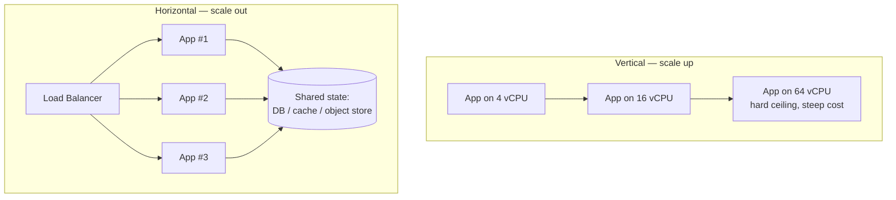
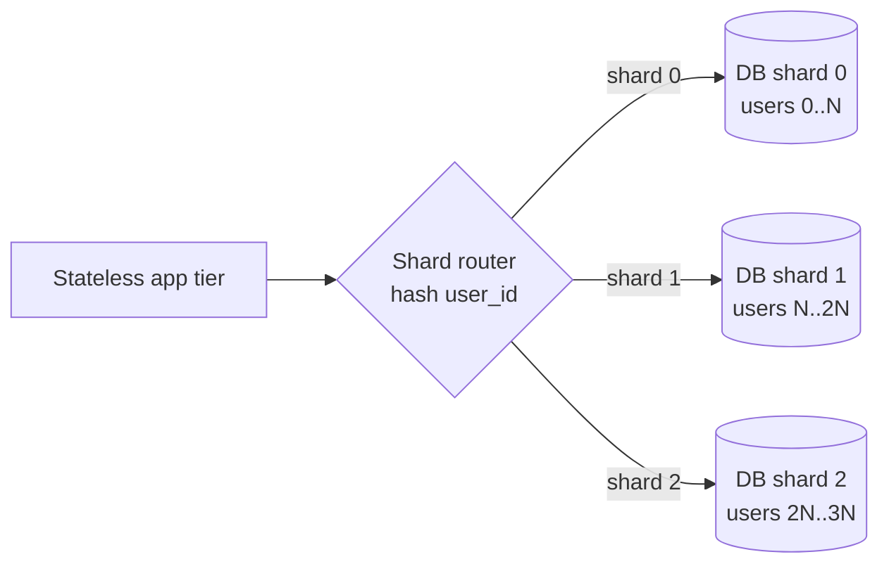

# Scaling vertically, then horizontally

## Why this matters

It's a Tuesday afternoon and your product just got mentioned by someone with a large following. Traffic is up 8x in twenty minutes. You watch the dashboard: CPU on the single app server is pinned at 100%, p99 latency has climbed from 80ms to 6 seconds, and requests are starting to time out. The on-call playbook says "scale up," so you do the fast thing first: resize the instance from 4 vCPUs to 16. Ten minutes later latency is back under control. You've bought yourself the afternoon.

Then the spike keeps growing. The next instance size up costs four times as much and there isn't one after that big enough. So you do the thing that should have been possible all along: put a load balancer in front and run three copies of the app. You deploy. And immediately, half your users are getting logged out mid-session, their shopping carts are empty, and a flood of "why did it forget my login?" tickets arrives. The app stored session state in a local in-memory map. Each of the three instances has its own map. A user's second request lands on a different instance that has never heard of them.

That second outage is the one this chapter is about. Vertical scaling — a bigger machine — is the move you can make without changing your code, and it's the right first move more often than architecture astronauts admit. But it runs out, and the wall you hit when you finally go horizontal is rarely CPU. It's *state*. The engineers who scale smoothly are the ones who decided, early and on purpose, where state lives — so that adding the third, tenth, and hundredth instance is a config change rather than an incident.

## Mental model

Two axes, two completely different cost curves.

**Vertical scaling (scale up)** means giving one machine more resources: more vCPUs, more RAM, faster disk. It requires no code changes and no distributed-systems reasoning. It is bounded by the largest machine your cloud sells, and the price-per-unit-of-capacity rises steeply at the top end — the biggest instances cost far more per core than mid-range ones.

**Horizontal scaling (scale out)** means running more machines behind a load balancer. Capacity becomes roughly additive and roughly linear in cost, and it gives you redundancy for free: if one of ten instances dies, you lose 10% of capacity, not 100%. The catch is that horizontal scale only works cleanly if a request can be served by *any* instance. That property — that instances hold no client-specific state between requests — is **statelessness**, and it is the single enabler of everything horizontal.



The reason vertical comes first is not laziness — it's that the two curves cross. At low scale, one larger machine is cheaper and far simpler than a load balancer, multiple instances, a shared cache, and the operational weight of running a fleet. Vertical scaling has no distributed-systems tax: no cache to keep coherent, no replication lag to reason about, no "which instance served this" debugging. You pay for that simplicity at the top of the curve, where the largest instance is a hard ceiling and its price per unit of capacity climbs sharply. The engineering judgment is to ride vertical scaling for as long as the simplicity is worth more than the premium, and to have already made the app horizontally-ready before you hit the ceiling — so the switch is a config change, not a rewrite under fire. The expensive mistake is discovering on the worst possible afternoon that your code was never able to run as more than one copy.

The trick that makes statelessness work is not that the application has *no* state. It's that the state moves *out* of the process and into a shared backing service that is itself designed to be shared: a database, a cache like Redis, an object store. The app process becomes a pure function of (request, shared state). Any instance can serve any request because they all read and write the same source of truth.

There is a design fork inside that idea worth naming early: a session token can carry its state *with it* (a signed JWT whose claims are the session) or *point at* state held server-side (an opaque token that is a key into Redis). The JWT keeps the app process truly stateless without even a Redis round-trip, at the cost that you cannot revoke a token before it expires — a logged-out or compromised JWT stays valid until its `exp`. The opaque-token-plus-Redis approach costs one fast network read per request but lets you delete the key the instant a user logs out or you detect abuse. Most systems want revocation, so they reach for the opaque token; pick the JWT only when the per-request read genuinely hurts and short expiry plus a denylist is an acceptable revocation story. Either way the app process holds nothing, which is the whole point.

Databases follow the same two axes but in a harder order. You scale a database up first (bigger box) because it's easy. Then you scale *reads* out with **read replicas** — copies that asynchronously follow the primary and serve read-only queries. When even the primary's write capacity or dataset size becomes the bottleneck, you scale writes out by **sharding** (also called horizontal partitioning): splitting rows across multiple independent databases by some key, so each shard owns a slice of the data. Sharding is the most expensive move on the board, which is why it's the last one.

> **Connect the dots:** The load balancer in front of those stateless instances is its own deep topic — L4 vs. L7, health checks, sticky sessions, traffic shifting — covered in the next chapter, "Load balancing." Sticky sessions are the tempting shortcut that lets you avoid externalizing state; this chapter argues you should externalize state instead, and that chapter explains why stickiness undermines the very redundancy you scaled out to get.

> **Security note:** Externalizing session state turns a shared store into part of your authentication surface. Treat session tokens as bearer credentials: generate them with a CSPRNG (`secrets.token_urlsafe`, not `random`), store only an opaque key client-side, and set an explicit TTL so an abandoned session expires on its own. If you choose signed JWTs instead, the revocation gap is the real risk — a stolen token is valid until `exp`, so keep expiry short and pair it with a server-side denylist for logout and compromise. And because every instance now trusts the same Redis, that connection must be authenticated and network-isolated: an attacker who can write to your session store can forge any user's session.

## In practice

### The app that can't scale out

Here is the failure from the opening, in code. A small Python web app that keeps sessions in a module-level dictionary:

```python
# app.py — DO NOT SHIP THIS BEHIND A LOAD BALANCER
from flask import Flask, request, jsonify
import secrets

app = Flask(__name__)

# In-memory session store. Lives inside THIS process only.
SESSIONS: dict[str, dict] = {}

@app.post("/login")
def login():
    user = request.json["user"]
    token = secrets.token_urlsafe(16)
    SESSIONS[token] = {"user": user, "cart": []}
    return jsonify(token=token)

@app.post("/cart/add")
def add_to_cart():
    token = request.headers["Authorization"]
    session = SESSIONS.get(token)        # KeyError-equivalent on a different instance
    if session is None:
        return jsonify(error="not logged in"), 401
    session["cart"].append(request.json["item"])
    return jsonify(cart=session["cart"])
```

Run one copy and it works perfectly. The bug is invisible until the second instance exists. With three instances behind a round-robin balancer, a login that lands on instance #1 writes the token into #1's `SESSIONS`. The follow-up `/cart/add` round-robins to instance #2, whose `SESSIONS` has never seen that token, and the user gets a 401. The application is *correct* and *unscalable* at the same time. No amount of CPU fixes it.

The seductive bad fix is to enable sticky sessions on the load balancer so every user is pinned to the instance that logged them in. It works until that instance restarts during a deploy — and now everyone pinned to it is logged out at once, and your load is unevenly distributed because the balancer can't freely rebalance. Stickiness trades away the redundancy you scaled out to get.

### The refactor: externalize the state

Move sessions into Redis, which all instances share. The app process now holds nothing between requests.

```python
# app.py — stateless, safe behind any number of instances
from flask import Flask, request, jsonify
import redis, json, secrets, os

app = Flask(__name__)
r = redis.Redis.from_url(os.environ["REDIS_URL"], decode_responses=True)

SESSION_TTL = 60 * 60 * 24  # 24h, enforced by Redis, no cleanup code needed

@app.post("/login")
def login():
    user = request.json["user"]
    token = secrets.token_urlsafe(16)
    r.set(f"sess:{token}", json.dumps({"user": user, "cart": []}), ex=SESSION_TTL)
    return jsonify(token=token)

@app.post("/cart/add")
def add_to_cart():
    token = request.headers["Authorization"]
    raw = r.get(f"sess:{token}")
    if raw is None:
        return jsonify(error="not logged in"), 401
    session = json.loads(raw)
    session["cart"].append(request.json["item"])
    r.set(f"sess:{token}", json.dumps(session), ex=SESSION_TTL)  # refreshes TTL -> sliding expiry
    return jsonify(cart=session["cart"])
```

Now any instance can serve any request because the source of truth is Redis, not a local dict. You can run 1 instance or 100; the load balancer is free to send each request anywhere. Scaling out becomes a number you change:

```yaml
# docker-compose.yml — scale the app tier with one flag
services:
  app:
    build: .
    environment:
      REDIS_URL: redis://redis:6379/0
    deploy:
      replicas: 3        # docker compose up --scale app=10 at will
  redis:
    image: redis:7-alpine
  lb:
    image: nginx:alpine
    ports: ["80:80"]
    volumes: ["./nginx.conf:/etc/nginx/nginx.conf:ro"]
```

The same principle covers every kind of in-process state: file uploads go to object storage (S3/GCS) instead of local disk, background jobs go to a queue instead of an in-memory list, and rate-limit counters go to Redis instead of a per-process counter. The rule of thumb: *if losing this instance would lose data a user cares about, that data is in the wrong place.*

### Scaling the database: replicas before shards

Once the app tier is stateless, the database becomes the bottleneck, because now it's the one thing all instances share. The progression is up, then read replicas, then shards.

Most workloads are read-heavy, so the first horizontal move is **read replicas**: the primary handles all writes and streams its changes to one or more replicas that serve reads. You route queries by intent:

```python
# Route reads to a replica, writes to the primary.
def get_user(user_id):                 # read path -> replica
    return replica_pool.query("SELECT * FROM users WHERE id = %s", user_id)

def update_email(user_id, email):      # write path -> primary
    primary_pool.execute("UPDATE users SET email = %s WHERE id = %s", email, user_id)
```

The cost you pay is **replication lag**: a replica is some milliseconds-to-seconds behind the primary. If a user updates their email and the very next page-load reads from a lagging replica, they see the old value. The fix is *read-your-writes* — route a user's reads to the primary for a short window after they write, or read from the primary for flows where staleness is unacceptable (e.g. "did my payment go through?").

When write throughput or raw dataset size outgrows a single primary, you **shard**: partition rows across N independent databases by a shard key.



Choosing the shard key is the entire game. A good key spreads load evenly *and* keeps queries that must be answered together on the same shard. Shard a B2B SaaS by `tenant_id` and almost every query — which is naturally scoped to one tenant — stays on one shard. Shard the same data by `user_id` and a query like "all users in this tenant" now fans out across every shard, slow and complex. The thing sharding takes away is the cross-shard `JOIN` and the cross-shard transaction: those become application-level work or are designed out entirely.

There is also a step between replicas and shards that is easy to skip: caching. A read replica still runs the query; a cache in front of the database (Redis again, or a CDN for whole responses) answers the hottest reads without touching the database at all, and it's the cheapest order-of-magnitude you'll find. The cost is invalidation — stale entries and the work of evicting them when the underlying data changes — but for read-heavy workloads with reusable results, caching buys you more headroom per dollar than another replica and far more than a shard. Exhaust it before you shard. When you finally do shard, prefer a scheme that lets you add a shard without rehashing everything: consistent hashing or an explicit shard-lookup table, rather than `id % N`, where bumping `N` relocates almost every row. Resharding a live system is among the hardest operations in this entire book, so design the key and the placement scheme to make adding capacity a routine event rather than a migration project.

## Pitfalls and anti-patterns

**1. Hidden in-process state.** The session dict is the obvious case, but the same bug hides in local-disk file uploads, in-memory caches that assume cache coherence, per-process counters for rate limiting, and sticky WebSocket connections. *How to recognize:* the app works on one instance and misbehaves intermittently on many; bugs correlate with which instance served the request. *How to fix:* audit for everything that survives between requests inside the process and move it to a shared store. The test: kill any instance mid-flight and no user-visible data should be lost.

**2. Sticky sessions as a state strategy.** Reaching for load-balancer session affinity to avoid externalizing state. *How to recognize:* deploys log users out; load is unevenly distributed; one instance runs hot. *How to fix:* externalize the state (Redis/JWT) so any instance can serve any request, and reserve stickiness for cases where it's genuinely unavoidable, like in-memory WebSocket fan-out.

**3. Reading your own writes from a lagging replica.** Sending all reads to replicas without accounting for replication lag. *How to recognize:* "I saved it but it didn't save" reports that vanish on refresh; flaky tests that pass alone and fail under load. *How to fix:* route post-write reads to the primary for a short window, or pin staleness-sensitive flows (auth, payment confirmation) to the primary outright.

**4. Sharding too early — or by the wrong key.** Sharding before read replicas and caching are exhausted, or picking a key that doesn't match access patterns. *How to recognize:* every other query is a cross-shard fan-out; "hot" shards pin while others idle (a celebrity user, a giant tenant); resharding is on the roadmap within a year of launching shards. *How to fix:* exhaust vertical scaling, replicas, and caching first; choose the key from real query patterns; prefer consistent hashing or a lookup table over `id % N` so adding a shard doesn't rehash everything.

**5. Confusing stateless with no-database.** Believing a "stateless app" means the system has no state. *How to recognize:* someone proposes putting business data in JWTs to "stay stateless," or treats the cache as the source of truth. *How to fix:* state still exists — it lives in purpose-built shared services (DB, cache, queue, object store). Stateless means the *app process* is disposable, not that data has vanished.

## Production checklist

- [ ] No client-specific state lives in process memory or on local disk (sessions, uploads, job queues, counters all externalized)
- [ ] Any instance can be killed mid-request with zero user-visible data loss (chaos-test this, don't assume it)
- [ ] Sessions in a shared store (Redis) or signed stateless tokens (JWT) with explicit TTLs
- [ ] App tier scales by changing a replica count, with no code change required
- [ ] Health/readiness endpoints exist so the load balancer can route around dead instances
- [ ] Read traffic routed to replicas; staleness-sensitive flows pinned to the primary
- [ ] Replication lag monitored and alerted, with a defined acceptable threshold
- [ ] Vertical scaling, read replicas, and caching exhausted before any sharding decision
- [ ] If sharded: shard key chosen from real access patterns; cross-shard queries enumerated and budgeted; resharding plan documented (consistent hashing or lookup table, not `id % N`)
- [ ] Cost-per-request tracked across instance sizes so the vertical ceiling is a known number, not a surprise

## Exercises

1. **(Comprehension)** Explain, in your own words, why the in-memory `SESSIONS` version of the app works flawlessly on one instance but logs users out intermittently behind a round-robin load balancer with three instances. Trace a single user's `/login` then `/cart/add` request pair through the system and identify exactly where the data is lost.

2. **(Applied)** Take the in-memory app from this chapter and run two instances behind nginx locally (Docker Compose is fine). Reproduce the intermittent-logout bug with a script that logs in once, then adds to the cart ten times, and counts the 401s. Then apply the Redis refactor and rerun the same script — confirm zero 401s and that scaling to five instances changes nothing.

3. **(Design)** You operate a B2B SaaS where the largest tenant generates 40% of all traffic and the database primary is at write capacity. Vertical scaling and read replicas are exhausted. Design a sharding strategy: choose a shard key, justify it against your access patterns, explain how you'd handle the one tenant that's larger than a single shard can hold, and describe the resharding/rebalancing plan for when you add the next shard. Name the cross-shard query you can no longer run cheaply and how you'd answer it instead.

## Further reading

- Martin Kleppmann, *Designing Data-Intensive Applications* — Chapter 5 (Replication) and Chapter 6 (Partitioning) are the definitive treatment of replicas, lag, and shard-key selection (O'Reilly, 2017).
- *The Twelve-Factor App*, factor VI ("Processes: execute the app as one or more stateless processes") — https://12factor.net/processes
- Werner Vogels, ["Eventually Consistent"](https://www.allthingsdistributed.com/2008/12/eventually_consistent.html) — why read replicas can return stale data and what consistency you actually need.
- AWS, ["Amazon RDS Read Replicas"](https://docs.aws.amazon.com/AmazonRDS/latest/UserGuide/USER_ReadRepl.html) — concrete operational mechanics of replica creation, lag, and promotion.
- David Karger et al., ["Consistent Hashing and Random Trees"](https://dl.acm.org/doi/10.1145/258533.258660) (STOC 1997) — the technique that lets you add shards without rehashing the world.
- Redis documentation (https://redis.io/docs/latest/) — reference for `SET ... EX`, TTLs, and using Redis as the externalized-state store shown above.
