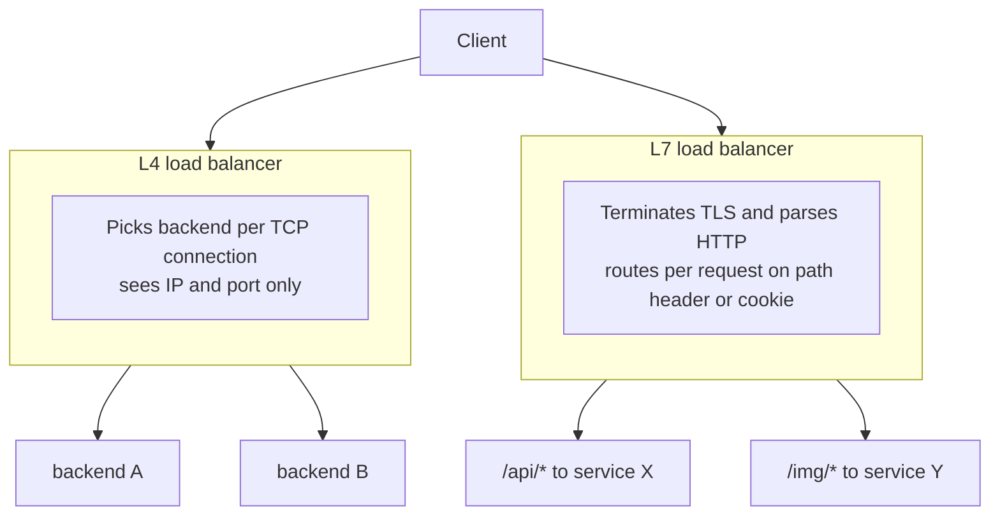
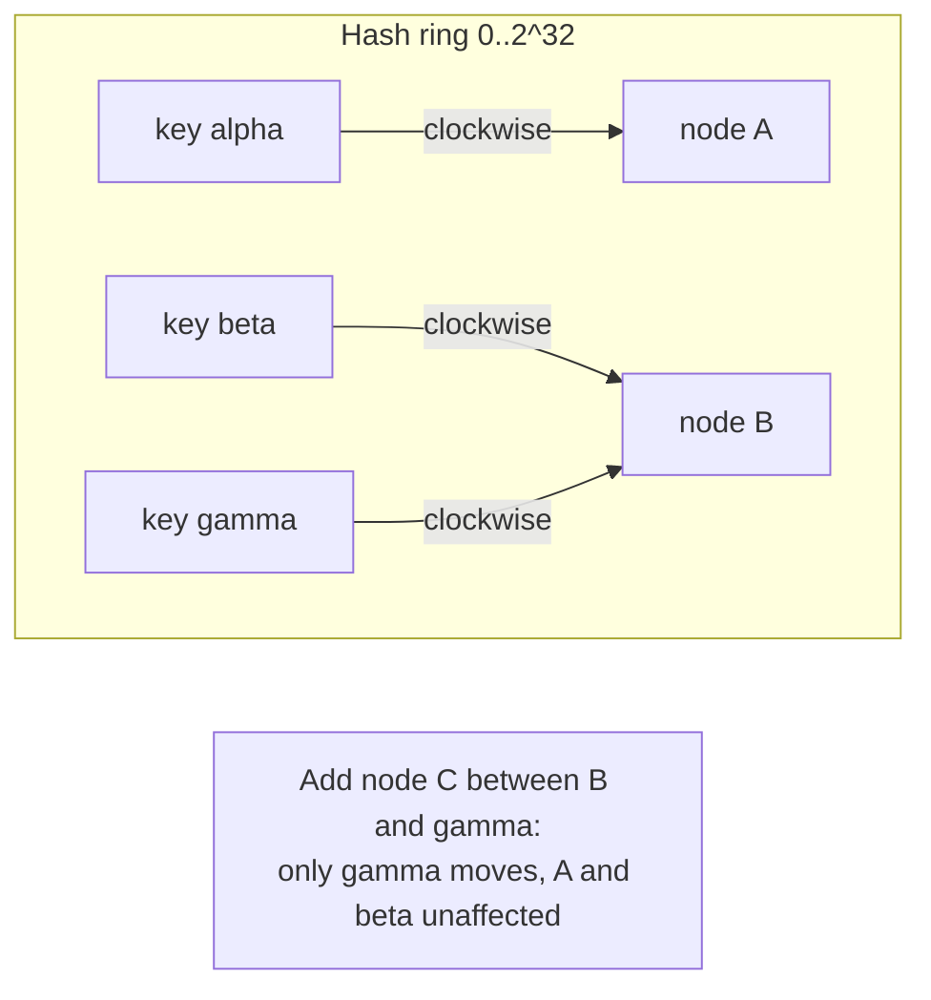
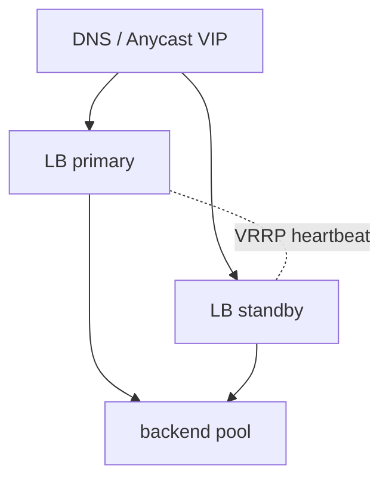

# Load balancing

## Why this matters

It's a Tuesday afternoon and your checkout service is melting. The dashboard shows 8 healthy pods behind your load balancer, CPU averaging 30%, plenty of headroom. But p99 latency just crossed two seconds and customers are seeing spinners at the payment step. You scale to 16 pods. Nothing improves. You scale to 24. Still nothing.

Someone finally pulls the per-pod metrics instead of the average, and there it is: two pods are pinned at 100% CPU while the other 22 idle near zero. Your load balancer is using sticky sessions keyed on a cookie, and a marketing campaign drove a burst of traffic from a single corporate NAT — one source IP, one cookie pool, two unlucky backends carrying the entire load. The "average" was a lie. The load was never balanced; it was just spread across machines that mostly weren't doing the work.

That afternoon costs you a postmortem, a refund batch, and a hard lesson: a load balancer is not a magic box that makes traffic even. It's a policy engine making a routing decision on every connection or request, and the policy you picked — often by accepting a default — determines whether 24 machines behave like 24 machines or like 2. This chapter is about understanding those policies well enough to predict the failure before it pages you. We'll cover where the balancer sits in the stack (L4 vs. L7), the algorithms it can run, why sticky sessions are usually a smell, how health checks decide who's in the pool, how to shift traffic safely during a deploy, and the uncomfortable fact that the thing protecting all your backends is itself a single point of failure until you design it not to be.

## Mental model

A load balancer is a reverse proxy that accepts client traffic and forwards it to one of N backends according to a selection algorithm, while continuously deciding which backends are eligible (health checks). The single most important distinction is *what layer it reads*.

An **L4 load balancer** operates at the transport layer. It sees IP addresses and TCP/UDP ports, nothing more. It picks a backend when the connection is established and pins the entire TCP connection to that backend. It cannot read URLs, headers, or cookies because it never terminates TLS or parses HTTP. It's fast, cheap, and protocol-agnostic — it's just shuffling packets, so it can push very high throughput on modest hardware.

An **L7 load balancer** terminates the connection, parses the application protocol (usually HTTP), and can route per *request* on path, header, method, or cookie. One TCP connection from a client can have its requests fanned out to different backends. It can retry failed requests, rewrite headers, and do canary routing. It costs more CPU and adds a hop of latency, and it must hold your TLS private keys.



On top of the layer choice sits the **selection algorithm**: round-robin (rotate through backends in order), least-connections (pick the backend with the fewest in-flight connections), weighted variants of both (send more to bigger machines), and consistent hashing (map a request key onto a hash ring so the same key lands on the same backend). The right default for stateless HTTP backends is least-connections or its modern cousin, "power of two choices" — pick two backends at random and send the request to the less busy of the two. Round-robin is fine when every request costs roughly the same; it falls apart when request cost varies wildly, because it ignores how busy each backend already is. A round-robin balancer will happily hand a cheap health check and a 30-second report-generation request to the same backend on consecutive turns and call it fair.

The last piece of the model: the balancer must know which backends are alive. It runs **health checks** — active probes to a `/healthz` endpoint, or passive observation of error rates — and removes failing backends from the eligible pool. Get this wrong in either direction and you either route to dead machines or eject healthy ones during a blip and cause the very outage you were avoiding. The health check is not a side feature; it is the control loop that decides, second by second, what "the pool" even means.

## In practice

### A least-connections L7 config

Here's an NGINX configuration that terminates TLS, balances by least-connections, runs passive health checks, and retries idempotent requests against the next backend. This is a sane default for a stateless HTTP service.

```nginx
upstream checkout_backends {
    least_conn;

    # max_fails + fail_timeout = passive health checking:
    # eject a backend after 3 failures, retry it after 10s.
    server 10.0.1.11:8080 max_fails=3 fail_timeout=10s;
    server 10.0.1.12:8080 max_fails=3 fail_timeout=10s;
    server 10.0.1.13:8080 max_fails=3 fail_timeout=10s;

    keepalive 64;   # reuse upstream connections, avoid TCP setup per request
}

server {
    listen 443 ssl;
    server_name checkout.example.com;

    ssl_certificate     /etc/ssl/checkout.crt;
    ssl_certificate_key /etc/ssl/checkout.key;

    location / {
        proxy_pass http://checkout_backends;
        proxy_http_version 1.1;
        proxy_set_header Connection "";

        # Only retry on connection-level failures, and cap it.
        # Never blindly retry non-idempotent POSTs.
        proxy_next_upstream error timeout;
        proxy_next_upstream_tries 2;
        proxy_next_upstream_timeout 5s;

        proxy_connect_timeout 2s;
        proxy_read_timeout 10s;
    }
}
```

Two details that bite people. `proxy_next_upstream` by default does *not* retry POST/PUT, which is correct — retrying a non-idempotent write can double-charge a customer. And `keepalive` plus `proxy_http_version 1.1` is what lets NGINX reuse upstream TCP connections instead of paying a fresh TCP and TLS handshake per request; omit it and you'll wonder why your latency floor sits noticeably higher than it should, especially for small, fast requests where setup cost dominates.

### Active health checks done right

Passive checks (eject after observed failures) react to damage already done. Active checks probe ahead of traffic. The endpoint should be cheap and *meaningful* — it must verify the things that make this instance able to serve, not just that the process is running.

```python
# Flask: distinguish liveness from readiness.
# Liveness  = "am I alive?" (restart me if not)
# Readiness = "can I serve traffic right now?" (pull me from the LB if not)

@app.route("/livez")
def livez():
    return "ok", 200  # cheap; only fails if the process is wedged

@app.route("/readyz")
def readyz():
    checks = {
        "db": db_pool.healthy(),          # can I reach my primary dependency?
        "cache": redis.ping_ok(),
        "warm": model_loaded(),           # finished startup warmup?
    }
    if all(checks.values()):
        return jsonify(checks), 200
    return jsonify(checks), 503           # 503 -> LB stops sending traffic
```

*The same idea in TypeScript:*

```typescript
// Express: distinguish liveness from readiness.
// Liveness  = "am I alive?" (restart me if not)
// Readiness = "can I serve traffic right now?" (pull me from the LB if not)

app.get("/livez", (_req, res) => {
  res.status(200).send("ok"); // cheap; only fails if the process is wedged
});

app.get("/readyz", (_req, res) => {
  const checks = {
    db: dbPool.healthy(),        // can I reach my primary dependency?
    cache: redis.pingOk(),
    warm: modelLoaded(),         // finished startup warmup?
  };
  if (Object.values(checks).every(Boolean)) {
    res.status(200).json(checks);
  } else {
    res.status(503).json(checks); // 503 -> LB stops sending traffic
  }
});
```

The split matters. A `/livez` failure means "kill and restart me." A `/readyz` failure means "stop sending traffic but leave me alone — I might recover." Wiring the load balancer to liveness instead of readiness is a classic mistake: a backend that's briefly busy reloading config gets killed instead of merely drained. The inverse mistake is just as common — wiring the orchestrator's *restart* decision to a readiness check that fails whenever a downstream dependency hiccups, so a brief database blip triggers a restart storm across every pod at once.

### Consistent hashing and cache affinity

Round-robin and least-connections are stateless. But sometimes you *want* the same key to hit the same backend — most often for cache affinity. If you have 8 cache nodes and you route requests by `hash(key) % 8`, each key consistently hits one node, so each node caches a distinct slice of the keyspace and your hit rate is high.

The problem is the `% N`. Add or remove one node and `N` changes, so `hash(key) % N` changes for *almost every key*. Going from 8 nodes to 9 remaps roughly 8/9 of all keys to a different node. Every cache misses at once. This is the thundering-herd cache stampede that takes your database down the moment you scale your cache tier — the failure arrives precisely when you were trying to add capacity, which makes it especially cruel.

**Consistent hashing** fixes this. Map both keys *and* nodes onto the same circular hash space (the "ring"). A key is served by the first node found walking clockwise from the key's position. Add a node and only the keys between it and its predecessor move; remove a node and only its keys move to the next node clockwise. Adding the 9th node remaps roughly 1/9 of keys, not 8/9.



A minimal implementation, with virtual nodes so the keyspace divides evenly (a single point per node leaves you with lumpy, unbalanced arcs):

```python
import bisect, hashlib

class ConsistentHashRing:
    def __init__(self, nodes, vnodes=150):
        self.vnodes = vnodes
        self.ring = {}          # hash position -> node
        self.sorted_keys = []   # sorted positions for binary search
        for n in nodes:
            self.add(n)

    def _hash(self, s: str) -> int:
        return int(hashlib.md5(s.encode()).hexdigest(), 16)

    def add(self, node):
        for i in range(self.vnodes):
            h = self._hash(f"{node}#{i}")
            self.ring[h] = node
            bisect.insort(self.sorted_keys, h)

    def remove(self, node):
        for i in range(self.vnodes):
            h = self._hash(f"{node}#{i}")
            del self.ring[h]
            self.sorted_keys.remove(h)

    def get(self, key: str):
        if not self.ring:
            return None
        h = self._hash(key)
        idx = bisect.bisect(self.sorted_keys, h) % len(self.sorted_keys)
        return self.ring[self.sorted_keys[idx]]

ring = ConsistentHashRing(["cache-a", "cache-b", "cache-c"])
print(ring.get("user:1042"))   # deterministic; stable when nodes change
```

*The TypeScript equivalent:*

```typescript
import { createHash } from "node:crypto";

class ConsistentHashRing {
  private vnodes: number;
  private ring = new Map<bigint, string>(); // hash position -> node
  private sortedKeys: bigint[] = [];          // sorted positions for binary search

  constructor(nodes: string[], vnodes = 150) {
    this.vnodes = vnodes;
    for (const n of nodes) this.add(n);
  }

  private hash(s: string): bigint {
    return BigInt("0x" + createHash("md5").update(s).digest("hex"));
  }

  add(node: string): void {
    for (let i = 0; i < this.vnodes; i++) {
      const h = this.hash(`${node}#${i}`);
      this.ring.set(h, node);
      this.insort(h);
    }
  }

  remove(node: string): void {
    for (let i = 0; i < this.vnodes; i++) {
      const h = this.hash(`${node}#${i}`);
      this.ring.delete(h);
      const idx = this.sortedKeys.indexOf(h);
      if (idx !== -1) this.sortedKeys.splice(idx, 1);
    }
  }

  get(key: string): string | null {
    if (this.ring.size === 0) return null;
    const h = this.hash(key);
    const idx = this.bisect(h) % this.sortedKeys.length;
    return this.ring.get(this.sortedKeys[idx])!;
  }

  // Insert keeping sortedKeys sorted (binary search insert).
  private insort(value: bigint): void {
    let lo = 0;
    let hi = this.sortedKeys.length;
    while (lo < hi) {
      const mid = (lo + hi) >>> 1;
      if (this.sortedKeys[mid] < value) lo = mid + 1;
      else hi = mid;
    }
    this.sortedKeys.splice(lo, 0, value);
  }

  // Index of the first element strictly greater than value (bisect_right).
  private bisect(value: bigint): number {
    let lo = 0;
    let hi = this.sortedKeys.length;
    while (lo < hi) {
      const mid = (lo + hi) >>> 1;
      if (value < this.sortedKeys[mid]) hi = mid;
      else lo = mid + 1;
    }
    return lo;
  }
}

const ring = new ConsistentHashRing(["cache-a", "cache-b", "cache-c"]);
console.log(ring.get("user:1042")); // deterministic; stable when nodes change
```

The `vnodes=150` is the load-smoothing knob. Each physical node owns 150 small arcs scattered around the ring instead of one big arc, so adding or removing a node redistributes its share fairly across the survivors. (The exact count is a tradeoff: more virtual nodes smooth the distribution but cost memory and lookup time; production systems commonly use values in the low hundreds.) This is the same idea behind Amazon's Dynamo and the partitioning in Cassandra and modern CDNs. NGINX exposes it directly with `hash $request_uri consistent;` and Envoy with the `ring_hash` and `maglev` policies.

One caveat worth stating plainly: consistent hashing keeps the *mapping* stable, but it does not by itself make load *even* when keys are hot. If one key (one celebrity user, one viral product) accounts for a large share of traffic, the node that owns it becomes a hot spot no matter how many virtual nodes you configure. Hot-key problems need a different fix — replication of that key across nodes, or a request-coalescing cache in front — and no hashing scheme rescues you from them.

### Eliminating the balancer as a single point of failure

The balancer sits in front of everything, so if it dies, all your healthy backends are unreachable. You never run one. The standard pattern is a pair (or more) of balancers sharing a virtual IP via VRRP/keepalived, with DNS or anycast in front:



In a cloud environment this is mostly handled for you — an AWS ALB or GCP load balancer is a managed, horizontally-scaled, multi-AZ service, not a single box. But the principle still applies one layer up: a single region's balancer is a regional SPOF, which is why global services use DNS-based or anycast traffic distribution across regions. Note the tradeoff with DNS: clients and resolvers cache records past their TTL, so DNS-level failover is slow and partial. Anycast (announcing the same IP from multiple locations and letting BGP route to the nearest healthy one) fails over faster but is harder to operate and reasons at the granularity of network paths, not individual backends.

### Canary and traffic shifting

L7 balancers let you route a *fraction* of traffic to a new version, watch its error and latency metrics, and ramp up only if it's healthy. Here's an Envoy weighted-cluster split sending 5% to the canary:

```yaml
route:
  weighted_clusters:
    clusters:
      - name: checkout_stable
        weight: 95
      - name: checkout_canary
        weight: 5
```

You shift 5% -> 25% -> 50% -> 100% over minutes or hours, with an automated rollback if the canary's error rate exceeds the stable baseline. This is strictly safer than a flip-the-switch deploy because the blast radius of a bad release is bounded to the canary weight. The discipline that makes it work is choosing the rollback signal *before* you start: an absolute error-rate threshold and a comparison against the stable cohort over the same window, so a site-wide spike doesn't get blamed on the canary and a genuinely bad canary can't hide behind a quiet baseline.

> **Connect the dots:** Traffic shifting is the load-balancer half of the deployment strategies in Part 9 (CI/CD). Blue-green and canary deploys are *implemented* by reweighting clusters here; the pipeline decides *when* to shift, the balancer decides *how*.

## Pitfalls and anti-patterns

**1. Sticky sessions as a substitute for shared state.** Recognize it when sessions live in a backend's local memory and the balancer pins each client to "their" backend via a cookie or source-IP hash. The failure modes are everything from the opening scenario: uneven load (one NAT, one hot backend), lost sessions when a backend dies or is redeployed, and the inability to drain a node without logging users out. Fix it by making backends stateless — push session state into Redis or a signed JWT — so any request can hit any backend. Reserve stickiness for the rare case where it's genuinely cheaper (large in-process caches you can't externalize), and even then prefer consistent hashing over cookie pinning so the distribution stays even.

**2. Averaging away the imbalance.** Recognize it when your dashboard shows healthy *aggregate* CPU and latency while a minority of backends are saturated. Averages hide hot spots. Fix it by alerting on per-instance p99 and max, not the mean, and by switching from round-robin to least-connections (or power-of-two-choices) so the algorithm itself accounts for in-flight load instead of blindly rotating.

**3. Health checks that lie.** Recognize it two ways. A check that's too shallow (`return 200` while the DB connection pool is exhausted) keeps routing to broken backends. A check that's too aggressive (1s interval, 1 failure to eject) ejects healthy backends during a GC pause or a brief dependency blip, shrinking the pool until the survivors overload and *they* start failing checks — a cascading ejection that takes down the whole pool. Fix it by checking real readiness (dependencies, warmup) on a sane interval with a failure threshold (for example, probe every few seconds, eject after a small number of consecutive failures, and require a couple of successes to re-add), and never let health checks cascade by capping how much of the pool can be ejected at once.

**4. Retrying non-idempotent requests.** Recognize it when `proxy_next_upstream` or your service mesh retry policy is configured to retry *all* methods, including POST. A timed-out-but-actually-succeeded POST gets retried and the customer is charged twice. Fix it by retrying only idempotent methods (GET, HEAD, PUT, DELETE) or requests carrying an idempotency key, and capping retries (a small number of attempts with backoff). See Part 7's idempotency chapter for the key-based pattern that makes *any* request safe to retry.

**5. Naive modulo hashing for cache routing.** Recognize it when cache routing uses `hash(key) % N` and scaling the cache tier triggers a database-melting miss storm. Fix it with consistent hashing (ring or Maglev) so adding or removing a node remaps only a small fraction of keys instead of nearly all of them.

> **Security note:** When an L7 balancer terminates TLS, it holds your private keys and sees plaintext — it becomes a high-value target and the place to enforce mTLS to backends, rate limiting, and WAF rules. Equally important: if the balancer adds an `X-Forwarded-For` header, backends must trust it *only* from the balancer's IP. A backend that reads `X-Forwarded-For` from arbitrary clients can be fed a spoofed IP to bypass IP allowlists or poison audit logs. Strip and re-set forwarding headers at the trust boundary.

## Production checklist

- [ ] Backends are stateless; session state lives in Redis/JWT, not local memory (no reliance on stickiness)
- [ ] Algorithm chosen deliberately: least-connections or power-of-two for variable-cost requests, consistent hashing for cache affinity, round-robin only for uniform workloads
- [ ] Separate `/livez` (liveness) and `/readyz` (readiness) endpoints; the LB routes on readiness
- [ ] Health-check interval, failure threshold, and success threshold tuned to avoid both slow ejection and flapping; max-ejection-percent caps cascading removal
- [ ] Retries limited to idempotent methods or idempotency-keyed requests, with a cap and backoff
- [ ] Connection reuse to backends enabled (HTTP/1.1 keepalive or HTTP/2)
- [ ] Alerts fire on per-instance p99/max, not just averages
- [ ] No single balancer in the request path: managed multi-AZ LB, or VRRP/keepalived pair with a shared VIP
- [ ] TLS termination secured: private keys protected, mTLS or re-encryption to backends, forwarding headers stripped and re-set at the trust boundary
- [ ] Deploys use weighted traffic shifting (canary) with automated rollback on error-rate regression
- [ ] Graceful connection draining on backend shutdown (deregistration delay) so in-flight requests complete

## Exercises

1. **(Comprehension)** Explain, in two or three sentences each, why an L4 load balancer cannot do path-based routing or per-request canary splitting, and what an L7 balancer must do (and pay for) to gain those abilities. Then state one workload where you'd deliberately choose L4 over L7 and why.

2. **(Applied)** Take the `ConsistentHashRing` above. Distribute 100,000 keys across 8 nodes and record which node each key maps to. Now add a 9th node and re-map all keys. Measure the fraction of keys that changed nodes, and compare it to the fraction you'd get from `hash(key) % N` going from 8 to 9. Then vary `vnodes` from 1 to 500 and chart how evenly load spreads across the 8 original nodes; explain what `vnodes` is buying you.

3. **(Design)** You run a stateful WebSocket service: each client holds a long-lived connection, and the server keeps per-connection in-memory state (a game session, a collaborative document). Sticky sessions feel unavoidable, but you also need zero-downtime deploys and even load. Design the routing and state strategy: how do you balance connections, what happens to a client when its backend is drained for a deploy, and how do you keep load even when connections are long-lived and unequal in cost? Name your tradeoffs and state what you'd build first.

## Further reading

- Eisenbud et al., ["Maglev: A Fast and Reliable Software Network Load Balancer"](https://www.usenix.org/conference/nsdi16/technical-sessions/presentation/eisenbud) (NSDI 2016) — Google's L4 balancer and the consistent-hashing variant now widely copied
- Karger et al., ["Consistent Hashing and Random Trees"](https://dl.acm.org/doi/10.1145/258533.258660) (STOC 1997) — the original consistent-hashing paper
- DeCandia et al., ["Dynamo: Amazon's Highly Available Key-value Store"](https://www.allthingsdistributed.com/files/amazon-dynamo-sosp2007.pdf) (SOSP 2007) — consistent hashing with virtual nodes in production
- Mitzenmacher, ["The Power of Two Choices in Randomized Load Balancing"](https://www.eecs.harvard.edu/~michaelm/postscripts/tpds2001.pdf) — why picking the better of two random backends beats both round-robin and global least-connections at scale
- [Envoy proxy documentation: load balancing](https://www.envoyproxy.io/docs/envoy/latest/intro/arch_overview/upstream/load_balancing/overview) — production reference for ring_hash, maglev, least-request, and outlier detection
- [Kubernetes: Configure Liveness, Readiness and Startup Probes](https://kubernetes.io/docs/tasks/configure-pod-container/configure-liveness-readiness-startup-probes/) — the canonical liveness-vs-readiness split
