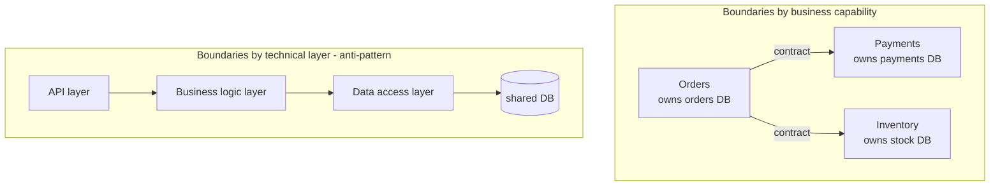

# Microservices in practice

## Why this matters

It's a Tuesday afternoon and a one-line copy change — updating the text on the checkout button — is stuck in a release train behind four other teams' changes. The deploy fails because someone's database migration in the `recommendations` module didn't run cleanly in staging. Now the button copy, the new tax logic, and a fraud-detection tweak are all blocked on a migration that has nothing to do with any of them. Three teams are in a Slack thread arguing about whose change broke the build. The actual fix ships Thursday.

This is the pain that pushes teams toward microservices. The promise is seductive: each team owns a service, deploys on its own schedule, and a broken migration in `recommendations` can't block a button-copy change in `checkout`. Independent deployability is the real prize, and when it works, it's transformative.

But here's the Tuesday that comes eighteen months later. Now the checkout button calls an `order` service, which calls `pricing`, which calls `tax`, which calls `inventory`, which calls back into `order` to check fulfillment status. A single button click fans out into nine network hops. One of them times out intermittently. You can't reproduce it locally because locally you run everything in one process. The release train is gone, but it's been replaced by a distributed system where a latency spike in `tax` cascades into checkout failures, and nobody can deploy `pricing` without coordinating with the `order` team anyway because their contract is coupled. You've paid the full operational cost of microservices and kept the coupling of the monolith. That's the distributed monolith, and it's the most common failure mode in this entire field. This chapter is about earning the benefits without landing in that trap.

## Mental model

A microservice architecture is a set of independently deployable services, each owning its own data, communicating only over the network through explicit contracts. The two load-bearing words are *independently deployable* and *own its own data*. If you can't deploy a service without coordinating the deploy of another, or two services share a database table, you don't have microservices — you have a monolith with extra network latency.

The single most important decision is where you draw the boundaries. Draw them by **business capability**, not by technical layer. A boundary around "everything that decides whether an order can be fulfilled and charges the customer" is a good boundary: it changes for one business reason, it owns its data, and a team can reason about it end to end. A boundary around "the data-access layer" or "the validation layer" is a bad boundary, because every feature change cuts across all of them, so every change requires deploying all of them in lockstep. Conway's Law is the underlying force: your service boundaries will come to mirror your team boundaries whether you plan for it or not, so plan for it.



The top arrangement lets the Payments team ship without asking anyone. The bottom arrangement looks like services on an architecture diagram but behaves like one program spread across three deploys: every feature touches all three, the shared database couples them at the data layer, and nothing can be released alone.

The other half of the mental model is the **contract**. A contract is the explicit, versioned promise a service makes about its interface — the request and response shapes, the error codes, the events it emits. Inside a monolith, a function signature is checked by the compiler. Across services, nothing checks the contract for you unless you make it explicit. The contract is what lets two teams move independently, and a contract you can't evolve without breaking callers is a contract that re-couples your services.

## In practice

### Draw the boundary, then make the contract explicit

Start from a business capability and define the contract before you write the service. Here's a payments capability expressed as a versioned schema. Protobuf is shown because the IDL forces you to think about field numbers and compatibility from day one, but an OpenAPI spec serves the same role for REST.

```protobuf
// payments/v1/payments.proto
syntax = "proto3";
package payments.v1;

service Payments {
  rpc AuthorizeCharge(AuthorizeChargeRequest) returns (AuthorizeChargeResponse);
}

message AuthorizeChargeRequest {
  string order_id        = 1;
  int64  amount_cents    = 2;
  string currency        = 3;  // ISO 4217
  string idempotency_key = 4;  // caller-generated, see Security note
}

message AuthorizeChargeResponse {
  string charge_id = 1;
  Status status    = 2;
  enum Status { STATUS_UNSPECIFIED = 0; AUTHORIZED = 1; DECLINED = 2; }
}
```

The field numbers (`= 1`, `= 2`) are the contract. You may add new fields with new numbers and old clients ignore them; you may never reuse or renumber a field. That single rule — additive, never destructive — is what makes the service independently evolvable. In practice that means: a new optional field gets a fresh number and a safe default; a field you want to retire stays in the schema but gets marked `reserved` so its number is never recycled into a different meaning; and a semantic change that old clients can't tolerate forces a new package version (`payments.v2`) running alongside `v1` until every caller has migrated. The version lives in the package path, not in a header you can forget to read, so an old client physically cannot reach the new shape by accident. The `idempotency_key` is not optional polish; it's what makes a retry over an unreliable network safe, and a payments call without one is a bug waiting for a timeout.

### Communicate synchronously only when you must

Every synchronous call is a coupling: the caller's availability is now bounded by the callee's availability. If `checkout` synchronously calls four services and each is independently available 99.9% of the time, checkout's ceiling is roughly 0.999⁴ ≈ 99.6% — and that's before adding latency, because each hop's response time adds to the user's wait. The fix is to make work asynchronous wherever the business allows it. The customer needs to know the charge was *authorized* synchronously; they do not need the loyalty-points update, the receipt email, and the analytics event to complete before the page returns.

```python
# checkout handler: synchronous only for what the user must wait on
def complete_checkout(order):
    charge = payments.authorize_charge(           # sync: user waits on this
        order_id=order.id,
        amount_cents=order.total,
        currency=order.currency,
        idempotency_key=order.id,                 # natural key, safe to retry
    )
    if charge.status != "AUTHORIZED":
        return decline(charge)

    # everything below happens after the response; emit an event, don't call
    events.publish("order.authorized", {
        "order_id": order.id,
        "charge_id": charge.charge_id,
    })
    return confirm(order)                          # return immediately
```

*In TypeScript:*

```typescript
// checkout handler: synchronous only for what the user must wait on
async function completeCheckout(order: Order) {
  const charge = await payments.authorizeCharge({   // sync: user waits on this
    orderId: order.id,
    amountCents: order.total,
    currency: order.currency,
    idempotencyKey: order.id,                        // natural key, safe to retry
  });
  if (charge.status !== "AUTHORIZED") {
    return decline(charge);
  }

  // everything below happens after the response; emit an event, don't call
  events.publish("order.authorized", {
    order_id: order.id,
    charge_id: charge.chargeId,
  });
  return confirm(order);                             // return immediately
}
```

The `order.authorized` event is consumed by loyalty, email, and analytics on their own time. None of those services can take down checkout, and each can be deployed, scaled, and fail independently. This is the boundary between this chapter and the event-driven architecture chapter that follows — synchronous contracts for "the user is waiting," events for everything else.

The synchronous calls you can't avoid need three guardrails, or one slow dependency will drag the whole request down with it. A **timeout** bounds how long you'll wait — set it below the caller's own deadline so you fail with budget left to respond, never relying on the default (often infinite) socket timeout. A **retry with backoff** handles the transient blip, but only for idempotent operations, and only with jittered exponential backoff and a hard cap, because naive immediate retries turn one struggling service into a self-inflicted thundering herd. A **circuit breaker** watches the recent error rate and, once it crosses a threshold, stops calling the dependency entirely for a cooldown window — failing fast and shedding load instead of piling thousands of doomed requests onto a service that's already on fire. Without the breaker, a single slow callee holds your worker threads hostage until your own service exhausts its pool and goes down too; that thread-pool exhaustion is exactly how a non-critical dependency takes a critical path with it.

### Verify contracts before they reach production

The fear with independent deploys is that the Payments team changes a response and silently breaks Checkout. Don't rely on a shared staging environment to catch this — catch it in each team's own CI with consumer-driven contract tests. The consumer (Checkout) publishes the shape it depends on; the provider (Payments) runs that expectation against its build:

```bash
# Payments CI: fail the build if a change breaks any known consumer
$ pact-provider-verifier \
    --provider Payments \
    --pact-broker https://pacts.internal \
    --provider-base-url http://localhost:8080
Verifying against expectations published by: Checkout, Mobile-BFF
  AuthorizeCharge returns charge_id and status ... OK
  AuthorizeCharge declined response includes reason ... OK
```

When a Payments change would break a consumer, the Payments build goes red before merge — not in a 3 AM page. This is the mechanism that makes "deploy without coordinating" actually true rather than aspirational. The contract test pins only the fields a given consumer actually reads, which is what lets the provider add and change everything else freely; that asymmetry — consumers assert the little they depend on, providers stay free everywhere else — is the whole point.

### Make every service observable from day one

In a monolith, a stack trace tells you the whole story. Across services, a single user action is spread over many processes, so you need distributed tracing to reconstruct it. Propagate a trace context (the W3C `traceparent` header) on every hop and emit spans:

```python
from opentelemetry import trace
tracer = trace.get_tracer("checkout")

with tracer.start_as_current_span("complete_checkout") as span:
    span.set_attribute("order.id", order.id)
    charge = payments.authorize_charge(...)   # trace context auto-propagates
```

*The TypeScript equivalent:*

```typescript
import { trace } from "@opentelemetry/api";
const tracer = trace.getTracer("checkout");

await tracer.startActiveSpan("complete_checkout", async (span) => {
  span.setAttribute("order.id", order.id);
  const charge = await payments.authorizeCharge(...); // trace context auto-propagates
  span.end();
});
```

With this in place, the "intermittent checkout timeout" from the opening becomes a trace you can open and read: nine spans, and the one for `tax` lit up red with a tail-latency outlier the others don't have. Without it, that's a week of guessing. Tracing, structured logs with a correlation ID, and per-service RED metrics (Rate, Errors, Duration) are not optional add-ons for microservices; they're the cost of admission. Budget them before the first service ships, because retrofitting observability onto a running fleet is brutal.

## Pitfalls and anti-patterns

**The distributed monolith.** Services that must be deployed together, in a specific order, are not microservices — they're a monolith with network latency and partial-failure modes bolted on. *How to recognize it:* your release notes say "deploy `order` before `pricing`"; a schema change in one service requires a coordinated deploy in another; you have a shared "common" library that every service must upgrade in lockstep. *How to fix it:* find the coupling and break it. Usually it's a shared database (split it, give each service its own store) or a contract that breaks on every change (make it additive-only and version it). If you genuinely can't decouple two services, that's evidence they should be one service — merge them back.

**The shared database.** Two services reading and writing the same tables cannot evolve independently: a schema migration for one breaks the other, and you've recreated the lockstep deploy you were trying to escape. *How to recognize it:* more than one service has credentials to the same database; a migration PR touches tables another team owns. *How to fix it:* each service owns its data and exposes it only through its API or events. If service B needs service A's data, B calls A's API or keeps a local read-model populated from A's events — B never reaches into A's tables.

**The chatty fan-out.** A single request triggers a cascade of synchronous calls, multiplying latency and slashing availability. *How to recognize it:* one user action produces a deep call tree in your traces; tail latency is dominated by the slowest dependency; an outage in a non-critical service (recommendations) takes down a critical path (checkout). *How to fix it:* push non-essential work onto async events, add a backend-for-frontend that aggregates calls, cache read-models locally, and put timeouts plus circuit breakers on every synchronous dependency so a slow callee fails fast instead of holding your threads hostage.

**Premature decomposition.** Splitting into services before you understand the domain means you draw the boundaries in the wrong places, and moving a boundary across services is far more expensive than moving a function within a monolith. *How to recognize it:* a small team running more services than there are engineers; "features" that routinely require changes to three or four services at once. *How to fix it:* start with a well-modularized monolith, let the boundaries prove themselves under real change, and extract a service only when a clear seam and a real pressure (independent scaling, independent deploy cadence, separate team ownership) both exist.

**Synchronous distributed transactions.** Trying to keep two services' databases consistent with a synchronous "update both or roll back both" is fragile: there's no two-phase commit across HTTP, and a crash between calls leaves you inconsistent. *How to recognize it:* code that writes to service A, then calls service B, with a comment like "TODO: what if this fails?" *How to fix it:* embrace eventual consistency through the saga pattern (covered later in this Part) — each step is a local transaction plus a compensating action, coordinated by events.

> **Security note:** Idempotency keys are not just a reliability tool, they're a security boundary. A caller-generated key on `AuthorizeCharge` lets the server deduplicate retries so a network timeout doesn't double-charge a customer. But the server must store and check the key *atomically* with the charge, scope it to the caller, and reject a reused key whose payload differs from the original — otherwise an attacker can replay a captured request, or a buggy client can reuse a key for a different amount and corrupt state. Treat the idempotency key like a nonce: store it, bind it to the request body, and expire it on a defined window.

> **Connect the dots:** Service-to-service calls need authentication too. The mTLS, token issuance, and traffic policy that secure these hops belong to the service mesh and load-balancing material (Part 7, earlier chapters), and the deploy isolation that makes independent releases real depends on the containerization and orchestration patterns in Part 8.

## Production checklist

- [ ] Every service boundary maps to a single business capability and a single owning team
- [ ] Each service owns its own datastore; no two services share tables
- [ ] Every cross-service interface is a versioned, additive-only contract (Protobuf/OpenAPI) in source control
- [ ] Consumer-driven contract tests run in each provider's CI and block merges that break a known consumer
- [ ] Synchronous calls are reserved for "the user is waiting"; everything else is an async event
- [ ] Every synchronous dependency has a timeout, a retry policy with backoff, and a circuit breaker
- [ ] All state-changing cross-service calls carry an idempotency key, checked atomically by the receiver
- [ ] Distributed tracing (W3C `traceparent`) propagates on every hop, plus structured logs with a correlation ID
- [ ] Per-service RED metrics (Rate, Errors, Duration) and SLOs are defined before launch
- [ ] A documented decision record exists for *why* this is a service and not a module in the monolith

## Exercises

1. **(Comprehension)** Given a system with `checkout` synchronously calling four downstream services, each independently available 99.9% of the time, estimate checkout's availability ceiling. Then identify which of the four calls genuinely need to be synchronous from the user's perspective, and recompute the ceiling if the rest are converted to async events. Explain in two sentences why the second number is higher.

2. **(Applied)** Take a feature in a codebase you know (or the `order`/`payments`/`inventory` model here) and write the Protobuf or OpenAPI contract for one service boundary. Add a consumer-driven contract test that asserts the fields the consumer depends on. Then make a *breaking* change to the provider (rename a field) and confirm the contract test goes red. Finally, make the same change *non-breakingly* (add a new field, deprecate the old one) and confirm it stays green.

3. **(Design)** You inherit a large monolith with three teams stepping on each other in a shared release train. Propose the *first two* services you would extract, justified by business capability and the specific coupling each extraction relieves. Specify how each new service owns its data (including how you split the shared tables), what the contract looks like, and how you'd run both old and new paths in parallel during migration. Then argue the opposite case: under what team size, change rate, and operational maturity would you keep the monolith and just modularize it instead?

## Further reading

- Sam Newman, *Building Microservices*, 2nd ed. (O'Reilly, 2021) — the standard reference on boundaries, contracts, and decomposition; the chapters on splitting the monolith are the most practical in print.
- Martin Fowler and James Lewis, ["Microservices"](https://martinfowler.com/articles/microservices.html) and Fowler's ["MonolithFirst"](https://martinfowler.com/bliki/MonolithFirst.html) — the original articulation of the pattern and the strongest argument for starting with a monolith.
- Chris Richardson, [microservices.io](https://microservices.io/patterns/index.html) — a catalog of patterns (Database per Service, Saga, API Composition, Circuit Breaker) with their tradeoffs spelled out.
- [W3C Trace Context](https://www.w3.org/TR/trace-context/) — the `traceparent`/`tracestate` standard that makes cross-service tracing interoperable.
- Pact, [Consumer-Driven Contracts documentation](https://docs.pact.io/) — the canonical implementation of provider/consumer contract testing.
- Mike Amundsen et al., *Microservice Architecture* (O'Reilly) — useful complement on the organizational and Conway's-Law dimension of where boundaries actually come from.
