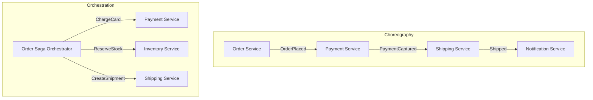
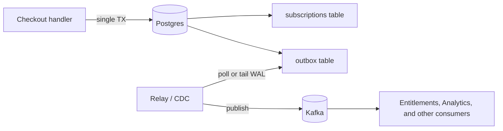

# Event-driven architecture

## Why this matters

It's a Tuesday afternoon and a customer is on the phone with support: they paid for the annual plan twenty minutes ago, the charge shows on their card, but the app still says "Free tier." You open the database. The `subscriptions` row says `active`, `plan = annual`. So billing worked. You open the analytics dashboard and the entitlements service that gates premium features. It never heard about this customer. As far as it knows, they're still on Free.

You go digging and find the offending code in the checkout handler. After Stripe confirms the charge, it does two things: writes the subscription row to Postgres, then publishes a `SubscriptionActivated` event to Kafka so the entitlements service can grant access. Both lines are right there, one after the other. The problem is that between them, the pod got OOM-killed. The Postgres transaction had already committed. The Kafka publish never ran. The database and the event stream now disagree, and nothing in the system will ever reconcile them, because from the checkout handler's perspective the request is long over.

This is the dual-write problem, and it is the single most common way event-driven systems quietly corrupt themselves. It doesn't show up in tests, it doesn't show up under light load, and it produces no error log — just a slow drift between what your database believes and what the rest of your system was told. By the time you notice, you have a backlog of "I paid and got nothing" tickets and no clean way to find which customers are affected. This chapter is about why events are worth the trouble, how to wire services together without an orchestrator becoming a bottleneck, how to evolve event schemas without breaking consumers a year later, and how to make that Tuesday afternoon impossible.

## Mental model

Start with a distinction that the field routinely blurs: **commands** versus **events**.

A *command* is a request for something to happen, addressed to a specific service. `ChargeCard`, `SendEmail`, `ReserveInventory`. It is imperative, it expects a single owner to act, and it can be rejected. An *event* is a statement that something already happened. `OrderPlaced`, `PaymentCaptured`, `SubscriptionActivated`. It is past-tense, it is broadcast, and it cannot be rejected — it's a fact. The sender of a command knows who should handle it and usually cares about the result. The publisher of an event does not know or care who is listening. That last property is the whole point: events decouple the producer from the consumers, so you can add a fraud-detection service or an analytics pipeline later without touching the checkout code.

The second axis is how you coordinate a multi-step workflow across services. There are two shapes:



In **choreography**, each service listens for events and reacts by emitting its own events. No one is in charge. The workflow emerges from the chain of reactions. It's beautifully decoupled and it scales without a central bottleneck, but the business process exists only implicitly, smeared across five services' subscription handlers. Ask "what happens when an order is placed?" and the only honest answer is "read all five services and trace the events." Debugging a stuck order means grepping logs across services.

In **orchestration**, one component — usually a saga (Chapter 6) — explicitly drives the steps, sending commands and waiting for replies. The process lives in one readable place and failure handling has a home. The cost is coupling: the orchestrator must know about every participant, and it becomes a thing you scale and protect.

My default: choreography for simple fan-out where steps are genuinely independent ("when an order ships, notify the customer and update analytics"), orchestration the moment you have a sequence with compensation logic ("charge, then reserve stock, and if stock fails, refund the charge"). Don't choreograph a transaction. The implicit-state problem will bury you.

The third concept is the one that bites a year in: **schema evolution**. Events are persisted facts that outlive the code that wrote them. A consumer reading today's events might be running code deployed many months ago, or replaying events from years back. So event schemas must evolve under **compatibility rules** — most often *backward compatibility* (new consumers can read old events) and *forward compatibility* (old consumers can read new events). The practical rule: only add optional fields, never remove or repurpose one.

## In practice

### The dual-write bug, concretely

Here's the checkout handler from the opening scenario. It looks correct to most reviewers.

```python
def activate_subscription(user_id: str, plan: str):
    with db.transaction():                       # (1)
        db.execute(
            "INSERT INTO subscriptions (user_id, plan, status) "
            "VALUES (%s, %s, 'active')",
            (user_id, plan),
        )
    # transaction has COMMITTED here

    producer.send(                               # (2)
        "subscription-events",
        SubscriptionActivated(user_id=user_id, plan=plan),
    )
```

Two separate systems, two separate writes, no shared transaction. Postgres and Kafka cannot enlist in the same commit. Every interleaving that fails between (1) and (2) — process crash, network blip, broker unavailable, a `NameError` in a line you added later — leaves the database ahead of the stream. Reordering the two writes doesn't help: publish first and a DB failure leaves an event for a subscription that doesn't exist. There is no ordering of two independent writes that is safe under partial failure. That's the dual-write problem in one sentence.

A tempting "fix" is to publish *after* commit with retries:

```python
with db.transaction():
    db.execute("INSERT INTO subscriptions ...")

for attempt in range(3):                         # still broken
    try:
        producer.send("subscription-events", event)
        break
    except KafkaError:
        time.sleep(2 ** attempt)
```

This narrows the window. It does not close it. If the process dies during the retry loop — or Kafka is down longer than your retries — the event is gone and nothing remembers it was owed. Retries reduce probability; they don't restore the atomicity you actually need.

### The transactional outbox pattern

The fix is to stop doing two writes. Write the event *into the same database, in the same transaction* as the business change. Because it's one transaction, it's atomic: either both the subscription row and the event row commit, or neither does. A separate process then reads the event rows and publishes them to Kafka.



The outbox table:

```sql
CREATE TABLE outbox (
    id            BIGSERIAL PRIMARY KEY,
    aggregate_id  TEXT        NOT NULL,
    event_type    TEXT        NOT NULL,
    payload       JSONB       NOT NULL,
    created_at    TIMESTAMPTZ NOT NULL DEFAULT now(),
    published_at  TIMESTAMPTZ
);
CREATE INDEX idx_outbox_unpublished ON outbox (id) WHERE published_at IS NULL;
```

The handler now does exactly one atomic write:

```python
def activate_subscription(user_id: str, plan: str):
    with db.transaction():
        db.execute(
            "INSERT INTO subscriptions (user_id, plan, status) "
            "VALUES (%s, %s, 'active')",
            (user_id, plan),
        )
        db.execute(
            "INSERT INTO outbox (aggregate_id, event_type, payload) "
            "VALUES (%s, 'SubscriptionActivated', %s)",
            (user_id, json.dumps({"user_id": user_id, "plan": plan})),
        )
    # both rows committed together, or neither did
```

If the process dies anywhere — before commit, after commit, mid-publish — the invariant holds: an event exists in the outbox if and only if the subscription change is durable. Nothing is silently owed.

A separate relay drains the outbox:

```python
def relay_loop():
    while True:
        rows = db.query(
            "SELECT id, event_type, payload FROM outbox "
            "WHERE published_at IS NULL ORDER BY id LIMIT 100 "
            "FOR UPDATE SKIP LOCKED"          # safe with multiple relays
        )
        for row in rows:
            producer.send("subscription-events", key=row["aggregate_id"],
                          value=row["payload"])
            db.execute(
                "UPDATE outbox SET published_at = now() WHERE id = %s",
                (row["id"],),
            )
        if not rows:
            time.sleep(0.5)
```

Note what this gives you: **at-least-once delivery**. If the relay publishes a row and crashes before the `UPDATE`, it will publish that row again on restart. That's the correct tradeoff — you cannot get exactly-once across two systems (Chapter 8), so you choose at-least-once and make consumers idempotent. Keying by `aggregate_id` preserves per-aggregate ordering in Kafka. `FOR UPDATE SKIP LOCKED` lets you run several relay instances without double-publishing the same row.

> **Security note:** Outbox payloads are events that fan out to many consumers, so never serialize secrets, full card numbers, or raw PII into them — store a reference and let consumers fetch what they're authorized to see. Because delivery is at-least-once, give each event a stable unique ID (a UUID, or the outbox `id`) and have consumers deduplicate on it; this is the same idempotency-key discipline that defends against replay attacks (Chapter 8).

### Polling versus change data capture

The relay above polls. It's simple, it's portable, and for most systems it's fine. The alternative is **change data capture (CDC)**: a tool like Debezium tails the database's write-ahead log and emits a message for every committed outbox row, with no polling and lower latency. CDC removes the relay code entirely but adds operational weight — a Kafka Connect cluster, WAL retention tuning, and a new thing to monitor. Start with polling. Move to CDC when polling latency or load actually hurts, not before.

### Schema evolution that survives

Use a schema registry (Confluent Schema Registry with Avro or Protobuf) and set the compatibility mode to `BACKWARD` or `FULL`. The registry then *rejects* an incompatible schema at deploy time instead of letting it break a consumer at 2 a.m. The discipline is small but absolute:

```protobuf
message SubscriptionActivated {
  string user_id = 1;
  string plan    = 2;
  // v2: added later. New field, new tag, optional. Old consumers ignore it.
  string promo_code = 3;
}
```

Add fields with new tag numbers. Never reuse or renumber a tag. Never remove a required field. To retire a field, stop writing it but keep it reserved (`reserved 2;` in Protobuf) so no future field accidentally claims its slot. If you genuinely need a breaking change, publish a new event type (`SubscriptionActivatedV2`) and run both until every consumer has migrated.

## Pitfalls and anti-patterns

**The dual write.** Writing to the database and then publishing to a broker as two separate operations. Recognize it by the shape: a committed transaction followed by a `producer.send` (or vice versa), with no shared atomicity. It produces no errors — just silent divergence you discover via support tickets. Fix it with the transactional outbox so the event and the state change commit together.

**Event-carried god objects.** Stuffing the entire aggregate into every event ("here's the full customer record on every field change") so consumers never have to call back. It feels convenient until the schema is impossible to evolve, every consumer is coupled to your full internal model, and a PII field leaks into six downstream systems. Recognize it when events grow without bound and every field change ripples everywhere. Fix it by sending thin events (IDs plus what changed) and letting consumers query for detail, or by deliberately choosing event-carried state transfer only for fields consumers truly need.

**Choreography for transactions.** Modeling a multi-step process with compensation as a chain of services each reacting to the previous one's event. Recognize it when no single place answers "what's the state of order #123?" and a failure mid-chain leaves orphaned side effects (card charged, stock never reserved, no refund). Fix it by promoting the workflow to an explicit orchestrator/saga (Chapter 6) that owns the steps and the compensations.

**Treating the broker as a database.** Querying Kafka to answer "what's this user's current plan?" by scanning the topic. Topics are ordered logs optimized for streaming, not point lookups, and retention may have already dropped the event you need. Recognize it by code that consumes a whole topic to compute current state on demand. Fix it by materializing the state you need into a queryable store (a projection — Chapter 5) and querying that.

**Non-idempotent consumers under at-least-once delivery.** Assuming each event arrives exactly once, so `balance += amount` runs twice on a redelivery and double-charges. Recognize it when retries or relay restarts cause duplicated effects. Fix it by deduplicating on a stable event ID, or by making the operation naturally idempotent (upsert to a known state rather than increment).

## Production checklist

- [ ] Every state change that must be observed externally writes its event to an **outbox table in the same transaction** — no bare `producer.send` after a commit
- [ ] Events carry a **stable unique ID**; every consumer deduplicates on it (assume at-least-once)
- [ ] Events are named in the **past tense** and represent facts, not commands
- [ ] A **schema registry** enforces `BACKWARD` or `FULL` compatibility at deploy time; CI fails on incompatible schemas
- [ ] Schema changes only **add optional fields**; retired field tags are `reserved`, never reused
- [ ] Producer keys messages by **aggregate ID** to preserve per-entity ordering
- [ ] Multi-step transactional workflows use an **explicit orchestrator/saga**, not implicit choreography
- [ ] No **secrets or unminimized PII** in event payloads
- [ ] The relay/CDC pipeline has a **dead-letter queue** and lag/error alerting
- [ ] A documented **reconciliation job** can detect and repair drift between source-of-truth tables and the stream

## Exercises

1. **(Comprehension)** Explain why moving the `producer.send` to *before* the database commit does not fix the dual-write problem. Describe the specific failure interleaving for each ordering (publish-then-write, write-then-publish) and state in one sentence why no ordering of two independent writes is safe.

2. **(Applied)** Implement the outbox pattern end to end against a local Postgres and a single-broker Kafka (or Redpanda). Write the handler that inserts the business row and the outbox row in one transaction, and a polling relay using `FOR UPDATE SKIP LOCKED`. Then prove it works: kill the relay process mid-batch and confirm on restart that every event is delivered at least once and the consumer, deduplicating on event ID, applies each effect exactly once.

3. **(Design)** You're designing order fulfillment across four services: Orders, Payments, Inventory, Shipping. A successful order must charge the card, reserve stock, and create a shipment; if stock reservation fails after the charge, the charge must be refunded. Decide choreography versus orchestration and justify it. Specify the event/command catalog, the compatibility strategy for evolving `OrderPlaced` over two years, where the outbox lives, and how you'd answer "what is the state of order #123?" at any moment. Name the tradeoff you're least comfortable with.

## Further reading

- Martin Kleppmann, *Designing Data-Intensive Applications* (O'Reilly, 2017) — the stream-processing chapter, for events, logs, and CDC done rigorously
- Chris Richardson, [*Pattern: Transactional outbox*](https://microservices.io/patterns/data/transactional-outbox.html) and the surrounding microservices.io pattern catalog (saga, event sourcing, CQRS)
- Gunnar Morling, ["Reliable Microservices Data Exchange With the Outbox Pattern"](https://debezium.io/blog/2019/02/19/reliable-microservices-data-exchange-with-the-outbox-pattern/) — the canonical CDC-based outbox write-up from the Debezium team
- Martin Fowler, ["What do you mean by 'Event-Driven'?"](https://martinfowler.com/articles/201701-event-driven.html) — disentangles the distinct things people call "event-driven"
- Confluent, [Schema Registry documentation](https://docs.confluent.io/platform/current/schema-registry/index.html) — compatibility modes and how they're enforced
- Apache Kafka, [official documentation](https://kafka.apache.org/documentation/) — delivery semantics and the log abstraction from the source

> **Connect the dots:** The outbox gives you at-least-once delivery, which is exactly why Chapter 8 (Idempotency and the exactly-once illusion) is mandatory reading for anyone building this — and the events you persist here are the raw material for the event sourcing and CQRS projections in Chapter 5. The "hash the data, store the log, replay it" instinct is the same content-addressable thinking from the Git internals chapter in Part 3.
