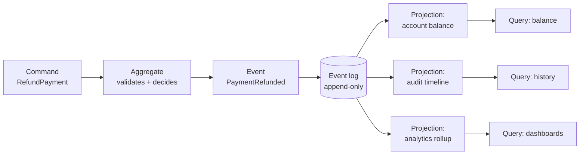

# Event sourcing and CQRS

## Why this matters

It's a Tuesday afternoon and a customer support lead drops a Slack message into your channel: "A merchant says we charged them $4,200 but their dashboard shows a balance of $1,800. They want to know exactly what happened, and Compliance is on the thread." You open the database. The `accounts` table has one row for that merchant: `balance = 1800`, `updated_at = 14:32`. That's it. The number is wrong, or the customer is wrong, and you have no way to tell which, because the table only stores the *current* state. Every UPDATE overwrote the one before it. The history that would answer the question was destroyed the moment it was written.

You spend the next six hours grep-ing application logs across four services, correlating timestamps, and reconstructing a timeline by hand. You eventually find it: a refund was applied twice because a webhook was redelivered, and a retry race double-debited a hold. You can explain it now, but only because you got lucky that the logs hadn't rotated.

This is the failure that event sourcing is designed to make impossible. If instead of storing `balance = 1800` you had stored the *sequence of facts* that produced it — `Charged 4200`, `Refunded 2400`, `Refunded 2400`, `HoldPlaced 200`, `HoldPlaced 200` — the answer would have been a single query against an append-only log, with timestamps, causes, and actors attached to every entry. The current balance becomes a *derivation*, not a destination. The cost of not having that log is measured in incident hours, failed audits, and customer trust. The cost of having it is the complexity this chapter is about — which is real, and which you should not pay unless the audit trail or temporal queries earn it.

## Mental model

In a CRUD system, the database row *is* the truth, and every write mutates it in place. In an event-sourced system, the truth is an **append-only log of immutable events**, and the row you query is a *projection* — a cache built by replaying those events. You never UPDATE or DELETE state; you only append new facts. Current state is `fold(events)`: start from empty, apply each event in order, and whatever you have at the end is "now."

Two ideas travel together but are separable. **Event sourcing** is the storage decision: the log is the source of truth. **CQRS** (Command Query Responsibility Segregation) is the modeling decision: the path that *writes* (handles commands, appends events) is a different model from the path that *reads* (serves queries from projections). You can do CQRS without event sourcing, and event sourcing without strict CQRS, but they reinforce each other — once your writes are events, building multiple read models from those events is natural.



The write side accepts a command, an aggregate decides whether it's valid given current state, and on success it appends one or more events. The read side consumes the log and maintains as many projections as you have query shapes — a relational table for balances, a denormalized timeline for the audit view, a columnar rollup for analytics. Each projection is disposable: delete it, replay the log, and it rebuilds. That single property — *projections are rebuildable from the log* — is what makes the whole pattern recoverable. The log is precious; everything downstream is a cache.

The mental shift that trips people up: events are named in the **past tense** and describe things that *already happened* (`PaymentRefunded`), while commands are imperative and describe an *intent that may be rejected* (`RefundPayment`). A command can fail validation. An event, once written, is a fact you can never retract — you can only append a compensating event (`RefundReversed`).

## In practice

### Modeling events and folding state

Start with the events as plain data, then derive state by folding. Here's a minimal account aggregate in Python.

```python
from dataclasses import dataclass
from typing import Iterable

# Events: immutable facts, past tense. Amounts in integer cents.
@dataclass(frozen=True)
class AccountOpened:    account_id: str
@dataclass(frozen=True)
class Charged:          account_id: str; amount: int; cause: str
@dataclass(frozen=True)
class Refunded:         account_id: str; amount: int; cause: str

# State is a pure fold over the event sequence.
@dataclass(frozen=True)
class Account:
    balance: int = 0
    opened: bool = False

def apply(state: Account, event) -> Account:
    match event:
        case AccountOpened():
            return Account(balance=0, opened=True)
        case Charged(amount=a):
            return Account(balance=state.balance + a, opened=state.opened)
        case Refunded(amount=a):
            return Account(balance=state.balance - a, opened=state.opened)
    return state

def rebuild(events: Iterable) -> Account:
    state = Account()
    for e in events:
        state = apply(state, e)
    return state
```

*The same idea in TypeScript:*

```typescript
// Events: immutable facts, past tense. Amounts in integer cents.
interface AccountOpened { type: "AccountOpened"; accountId: string }
interface Charged { type: "Charged"; accountId: string; amount: number; cause: string }
interface Refunded { type: "Refunded"; accountId: string; amount: number; cause: string }

type Event = AccountOpened | Charged | Refunded;

// State is a pure fold over the event sequence.
interface Account {
  readonly balance: number;
  readonly opened: boolean;
}

const emptyAccount: Account = { balance: 0, opened: false };

function apply(state: Account, event: Event): Account {
  switch (event.type) {
    case "AccountOpened":
      return { balance: 0, opened: true };
    case "Charged":
      return { balance: state.balance + event.amount, opened: state.opened };
    case "Refunded":
      return { balance: state.balance - event.amount, opened: state.opened };
    default:
      return state;
  }
}

function rebuild(events: Iterable<Event>): Account {
  let state = emptyAccount;
  for (const e of events) {
    state = apply(state, e);
  }
  return state;
}
```

The command handler is where validation lives. It loads current state by folding, decides, and returns *new* events — it does not mutate anything itself:

```python
def handle_refund(history: list, account_id: str, amount: int, cause: str) -> list:
    state = rebuild(history)
    if not state.opened:
        raise ValueError("account not open")
    if amount > state.balance:
        raise ValueError("refund exceeds balance")
    return [Refunded(account_id=account_id, amount=amount, cause=cause)]
```

*In TypeScript:*

```typescript
function handleRefund(
  history: Event[],
  accountId: string,
  amount: number,
  cause: string,
): Event[] {
  const state = rebuild(history);
  if (!state.opened) {
    throw new Error("account not open");
  }
  if (amount > state.balance) {
    throw new Error("refund exceeds balance");
  }
  return [{ type: "Refunded", accountId, amount, cause }];
}
```

Notice the symmetry with Git from Part 3: events are immutable, content is append-only, and "state" is a walk over an ordered history. If that model felt natural for commits, it will feel natural here.

### The event store

The log itself is boring on purpose. A single table with a monotonic sequence and an optimistic-concurrency guard handles the write side:

```sql
CREATE TABLE events (
    global_seq    BIGSERIAL PRIMARY KEY,        -- total order for projections
    stream_id     TEXT      NOT NULL,            -- e.g. 'account-42'
    version       INT       NOT NULL,            -- per-stream, for concurrency
    event_type    TEXT      NOT NULL,
    payload       JSONB     NOT NULL,
    occurred_at   TIMESTAMPTZ NOT NULL DEFAULT now(),
    UNIQUE (stream_id, version)                  -- rejects concurrent writers
);
```

The `UNIQUE (stream_id, version)` constraint is the whole concurrency story: a writer reads the stream at version N, decides, and tries to append at version N+1. If another writer got there first, the insert fails the unique constraint and you retry from the new state. This is optimistic concurrency control, and it's how you avoid lost updates without locking the stream.

### Building a projection

A projection consumer reads events in `global_seq` order and writes a query-optimized table. It tracks its own position so it can resume after a crash:

```python
def project_balances(conn):
    pos = conn.fetchval("SELECT last_seq FROM projection_offsets WHERE name='balances'")
    rows = conn.fetch(
        "SELECT global_seq, stream_id, event_type, payload "
        "FROM events WHERE global_seq > $1 ORDER BY global_seq", pos)
    for r in rows:
        if r["event_type"] in ("Charged", "Refunded"):
            delta = r["payload"]["amount"]
            sign = 1 if r["event_type"] == "Charged" else -1
            conn.execute(
                "INSERT INTO balances(account_id, balance) VALUES($1,$2) "
                "ON CONFLICT (account_id) DO UPDATE SET balance = balances.balance + $2",
                r["stream_id"], sign * delta)
        # advance offset in the SAME transaction as the write
        conn.execute("UPDATE projection_offsets SET last_seq=$1 WHERE name='balances'",
                     r["global_seq"])
```

*The TypeScript equivalent:*

```typescript
import type { PoolClient } from "pg";

async function projectBalances(conn: PoolClient): Promise<void> {
  const { rows: offsetRows } = await conn.query(
    "SELECT last_seq FROM projection_offsets WHERE name='balances'",
  );
  const pos = offsetRows[0].last_seq;
  const { rows } = await conn.query(
    "SELECT global_seq, stream_id, event_type, payload " +
      "FROM events WHERE global_seq > $1 ORDER BY global_seq",
    [pos],
  );
  for (const r of rows) {
    if (r.event_type === "Charged" || r.event_type === "Refunded") {
      const delta = r.payload.amount;
      const sign = r.event_type === "Charged" ? 1 : -1;
      await conn.query(
        "INSERT INTO balances(account_id, balance) VALUES($1,$2) " +
          "ON CONFLICT (account_id) DO UPDATE SET balance = balances.balance + $2",
        [r.stream_id, sign * delta],
      );
    }
    // advance offset in the SAME transaction as the write
    await conn.query(
      "UPDATE projection_offsets SET last_seq=$1 WHERE name='balances'",
      [r.global_seq],
    );
  }
}
```

The critical detail: advance the offset in the **same transaction** as the projection write. If they're separate, a crash between them either double-applies an event or skips one. Atomic offset + write gives you exactly-once *effect* on the projection even though delivery is at-least-once (see Part 7's idempotency chapter).

### Snapshotting

Replaying ten years of events to answer "what's the balance?" is wasteful once a stream is long. A **snapshot** is a cached fold at a known version: store `{state, version}` periodically, and on load, start from the snapshot and replay only the events after it.

```python
def load(stream_id, store):
    snap = store.latest_snapshot(stream_id)       # {state, version} or None
    state = snap.state if snap else Account()
    after = snap.version if snap else 0
    for e in store.events_after(stream_id, after):
        state = apply(state, e)
    return state
```

*In TypeScript:*

```typescript
interface Snapshot {
  state: Account;
  version: number;
}

interface Store {
  latestSnapshot(streamId: string): Snapshot | null; // {state, version} or null
  eventsAfter(streamId: string, version: number): Iterable<Event>;
}

function load(streamId: string, store: Store): Account {
  const snap = store.latestSnapshot(streamId); // {state, version} or null
  let state = snap ? snap.state : emptyAccount;
  const after = snap ? snap.version : 0;
  for (const e of store.eventsAfter(streamId, after)) {
    state = apply(state, e);
  }
  return state;
}
```

Snapshots are an *optimization, never a source of truth*. They must always be reconstructible by replaying the log, which means the rule is: if you change the `apply` logic in a way that alters folded state, you must discard and regenerate snapshots, or they'll silently serve stale shapes. Take them on a cadence (every N events, or by age), not on every write.

### Recovering a broken projection

This is the payoff. A projection bug shipped last week computed refunds with the wrong sign, so balances are corrupt. In a CRUD system this is a forensic nightmare. Here it's a rebuild:

```sql
-- 1. Stop the projector. 2. Truncate the read model and its offset.
TRUNCATE balances;
UPDATE projection_offsets SET last_seq = 0 WHERE name = 'balances';
-- 3. Deploy the fixed projector and let it replay from global_seq 0.
```

The log was never wrong; only the derived view was. Because the projection is a pure function of the log, fixing the function and replaying produces correct state with zero data archaeology. For large logs, rebuild into a *new* table (`balances_v2`), let it catch up to live while the old one still serves reads, then atomically swap — the same blue/green idea you'd use for any cutover, applied to read models.

> **Connect the dots:** The replay-to-rebuild property here is the same mechanism as a Kafka consumer resetting its offset to re-derive a materialized view (Part 7, Event-driven architecture), and the same insight as restoring a database from a write-ahead log. Append-only log + deterministic fold = recoverable state, everywhere it appears.

## Pitfalls and anti-patterns

**1. Putting behavior or external lookups inside events.** An event must be a self-contained, replayable fact. If your `apply` function calls a service, reads the clock, or depends on config that changes, replay produces different state than the original run — and your "rebuildable" projection isn't. *Recognize it* when a rebuild yields numbers that differ from production. *Fix it* by capturing every input as event data at write time: store the resolved exchange rate in the `PaymentRefunded` event, don't look it up during projection. Events are facts, not function calls.

**2. Unversioned event schemas.** Events live forever, so the `PaymentRefunded` you wrote in 2024 must still deserialize in 2027 after you've added three fields and renamed one. Teams that change event shapes in place break replay of historical events. *Recognize it* when old events fail to parse or silently lose data on rebuild. *Fix it* with explicit versioning and an upcasting layer: every old event format has a deterministic transform to the current shape, applied on read. Never mutate historical events; only add new versions.

**3. Leaking the write model into the read model (CQRS done halfway).** People adopt CQRS, then build projections that mirror the aggregate structure one-to-one and join across them at query time — recreating the normalized schema they were trying to escape. *Recognize it* when your "read model" needs five joins to answer a dashboard query. *Fix it* by denormalizing aggressively: shape each projection for exactly one query, duplicate data freely across projections, and accept that storage is cheap and the log can always rebuild any of them.

**4. Treating eventual consistency as a bug to suppress.** Read models lag the write log by milliseconds to seconds. A user refunds a payment and immediately reloads the page; the balance projection hasn't caught up, and they see the old number. Teams paper over this with synchronous projection updates that destroy the scalability CQRS bought them. *Recognize it* in "the data is wrong right after I save" tickets that resolve themselves on refresh. *Fix it* honestly: surface "processing" states in the UI, read-your-own-writes by serving the writer's view from the freshly-folded aggregate, or use the command's returned version to wait for the projection to reach it. Don't pretend the system is synchronous.

**5. Event sourcing where CRUD would do.** This is the most expensive mistake, and it's an architecture-selection error, not a code bug. Event sourcing imposes real cost: schema evolution, projection management, eventual consistency, snapshotting, harder debugging. *Recognize it* when the team can't name a temporal query or audit requirement that a plain `updated_at` plus an audit-log table wouldn't satisfy. *Fix it* by reserving event sourcing for domains where the *history is the product* — ledgers, order lifecycles, regulated workflows, anything where "how did we get here?" is a first-class question. For a user-profile CRUD table, it's pure overhead.

> **Security note:** The append-only log is also a tamper-evident audit trail, which makes it attractive for compliance — but only if you protect it. Events frequently carry PII and money movement, so encrypt payloads at rest and restrict who can append. Because you cannot DELETE an event, "right to be forgotten" (GDPR) requires crypto-shredding: encrypt personal fields per-subject and discard the key to render those events unreadable while preserving the log's integrity. Decide this *before* you put PII in events, not after a deletion request arrives. And because consumers replay at-least-once, every command handler that has external side effects needs an idempotency key (Part 7, Idempotency) so a redelivered event doesn't double-charge.

## Production checklist

- [ ] Events are named past-tense, immutable, and self-contained (no external lookups in `apply`)
- [ ] Every event payload carries a schema version, with an upcasting path from every old version to current
- [ ] Optimistic concurrency enforced on the write side (`UNIQUE (stream_id, version)` or equivalent)
- [ ] Projection offset is advanced in the same transaction as the projection write (exactly-once effect)
- [ ] Each projection is shaped for one query and fully rebuildable from the log alone
- [ ] A documented, tested runbook for truncate-and-replay rebuild, including blue/green swap for large read models
- [ ] Snapshots are taken on a cadence, treated as disposable cache, and regenerated when fold logic changes
- [ ] Eventual consistency is surfaced in the UX (processing states or read-your-own-writes), not hidden
- [ ] PII in events is encrypted per-subject to support crypto-shredding for deletion requests
- [ ] Command handlers with external side effects are idempotent under at-least-once redelivery
- [ ] You can state, in one sentence, the audit or temporal-query requirement that justifies the complexity

## Exercises

1. **(Comprehension)** Given the event stream `[AccountOpened, Charged 5000, Refunded 2000, Charged 1500]` (amounts in cents), hand-trace the `apply` fold and state the final balance. Then explain in two sentences why this answer is *more* trustworthy than reading a single `balance` column, and what extra information the log gives you that the column cannot.

2. **(Applied)** Implement the `balances` projection from "In practice" against a real Postgres instance. Seed the event table with a stream that includes a double-applied refund (the same `Refunded` event at two `global_seq` values), then introduce a sign bug in the projector, observe the corrupted balance, fix the projector, and recover correct state using only truncate-and-replay. Verify the offset advances atomically by killing the projector mid-replay and confirming no event is double-applied on restart.

3. **(Design)** You're designing the backend for a multi-currency wallet that must produce a regulator-ready statement for any account at any historical date, support instant balance reads at high throughput, and comply with GDPR deletion requests. Decide which parts are event-sourced and which are plain CRUD, define three projections and the exact query each serves, specify your snapshotting cadence, and explain how you handle crypto-shredding without breaking historical-statement replay. Name the one piece you would *not* event-source and defend it.

## Further reading

- Martin Fowler, ["Event Sourcing"](https://martinfowler.com/eaaDev/EventSourcing.html) and ["CQRS"](https://martinfowler.com/bliki/CQRS.html) — the canonical definitions, including Fowler's own cautions about overuse
- Greg Young, ["CQRS Documents"](https://cqrs.files.wordpress.com/2010/11/cqrs_documents.pdf) — the foundational long-form treatment from the pattern's primary popularizer
- Martin Kleppmann, *Designing Data-Intensive Applications*, Chapter 11 ("Stream Processing") — change data capture, event logs, and materialized views from first principles
- Pat Helland, ["Immutability Changes Everything"](https://cacm.acm.org/research/immutability-changes-everything/) (CACM, 2016) — why append-only, immutable data is the substrate of large-scale systems
- Microsoft, ["Event Sourcing pattern"](https://learn.microsoft.com/en-us/azure/architecture/patterns/event-sourcing) and ["CQRS pattern"](https://learn.microsoft.com/en-us/azure/architecture/patterns/cqrs) — pragmatic guidance with explicit "when not to use this" sections
- Jay Kreps, ["The Log: What every software engineer should know about real-time data's unifying abstraction"](https://engineering.linkedin.com/distributed-systems/log-what-every-software-engineer-should-know-about-real-time-datas-unifying) — the log as the universal primitive behind sourcing, replication, and stream processing
