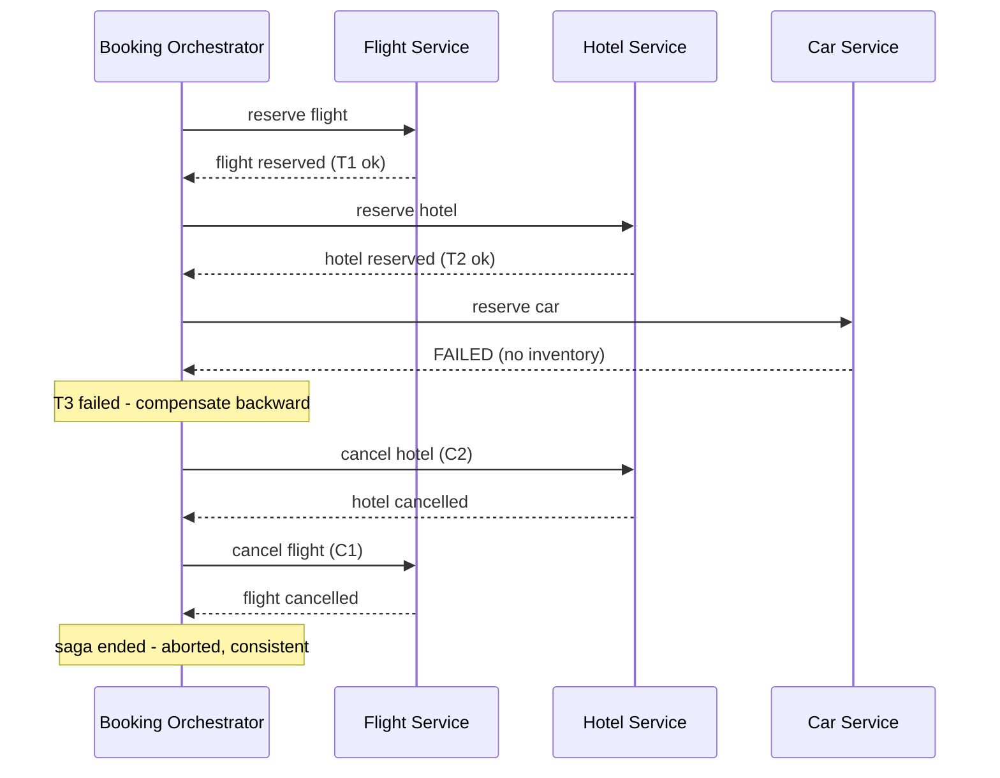

# The saga pattern

## Why this matters

It's a Tuesday afternoon and a customer emails support with a screenshot: their card was charged for a hotel room, but the trip they booked has no flight and no rental car. Your booking flow calls three services — flight, hotel, car — and somewhere in the middle the flight service timed out. The hotel charge already went through. Now you have a half-finished booking that exists nowhere as a coherent unit, money has moved, and there's no `ROLLBACK` statement that spans three databases owned by three teams.

The instinct of an engineer trained on single-database transactions is to reach for distributed two-phase commit (2PC): have all three services prepare, then commit together, atomically. That instinct is wrong here, and learning why is the point of this chapter. 2PC needs a coordinator that holds locks across every participant for the duration of the transaction. The flight provider is a third-party API that can take many seconds to respond at the tail; the hotel inventory service is owned by another team; the car service is occasionally down for deploys. Holding a lock on hotel inventory while you wait on a flaky external flight API is how you turn one slow dependency into a system-wide stall. Worse, 2PC has a blocking failure mode: if the coordinator dies after participants have voted to commit but before it broadcasts the decision, every participant sits with locks held, unable to safely proceed or abort, until the coordinator recovers. And the third-party APIs don't speak the 2PC protocol at all — there is no "prepare" verb on a payment gateway.

The saga pattern is the answer the industry converged on: model the long-lived, multi-service operation as a sequence of local transactions, each of which commits independently, and for each step write a *compensating* transaction that semantically undoes it if a later step fails. There's no global lock and no atomicity. What you get instead is availability — no single slow participant freezes the others — and loose coupling, because each service commits to its own database on its own schedule. What you give up is isolation and the free `ROLLBACK`. There's eventual consistency, explicit failure handling, and compensation logic you write by hand. That last part is the cost. Sagas trade the comfort of atomic rollback for availability and loose coupling, and they make you responsible for the "undo" that a database used to give you for free. The rest of this chapter is about doing that trade deliberately rather than discovering it in an incident review.

## Mental model

A saga is a sequence of steps `T1, T2, …, Tn`, where each `Ti` is a local transaction in one service. For each `Ti` you define a compensating transaction `Ci` that semantically reverses its effect. If the saga runs all the way through, you're done. If `Tk` fails, you run `Ck-1, Ck-2, …, C1` in reverse order to unwind everything that already committed. The term comes from Garcia-Molina and Salem's 1987 paper "Sagas," which formalized long-lived transactions exactly this way.

The critical word is *semantically*. `C1` does not roll back `T1` at the storage layer — `T1` already committed and is visible to everyone. `C1` issues a *new* transaction that counteracts it: if `T1` charged a card, `C1` issues a refund; if `T1` reserved a seat, `C1` releases it. Other transactions may have observed the intermediate state in between. Sagas are not isolated, and you must design for that.

That missing isolation is the part newcomers underestimate, so name the anomalies explicitly. Because intermediate states are visible, a saga can expose a *dirty read* (another transaction reads a value the saga will later compensate away), a *lost update* (the saga and another transaction both write the same record, and one clobbers the other), and a *fuzzy read* (the saga reads a value, a concurrent transaction changes it, and the saga's later steps act on stale data). The standard countermeasures are semantic locks — a status flag like `PENDING` that says "this record is mid-saga, treat it as not-yet-final" — and reread-and-revalidate before any step that depends on a value an earlier step read. Sagas give you eventual consistency, not the snapshot isolation a single database hands you, and the design work is deciding which anomalies you can tolerate and which you must lock against.

There are two ways to coordinate the sequence. In **orchestration**, a central coordinator (the "saga orchestrator") explicitly tells each service what to do and listens for the result. In **choreography**, there is no coordinator: each service emits an event when it finishes, and the next service reacts to that event. The booking saga, drawn as an orchestration:



There are two recovery directions you can build, and they are not interchangeable. *Backward recovery* is what the diagram shows: a step fails, and you compensate everything already done, ending in the aborted-but-consistent state. *Forward recovery* assumes the saga must complete — there is no acceptable "undo" past a certain point — so instead of compensating, you retry the failing step until it succeeds. Most real sagas use both: backward recovery before a designated *pivot transaction*, forward recovery after it. The pivot is the point of no return — the step after which compensation is impossible or unacceptable (the irreversible charge, the email that's already sent). Everything before the pivot must be compensatable; everything after it must be retriable to success. Identifying the pivot is the single most important design decision in a saga, because it tells you which half of the saga each step lives in.

The mental model to hold: a saga has a forward path and a backward (compensating) path, and the orchestrator is a state machine that is always in exactly one well-defined state. "Reserved flight, reserving hotel" is a state. "Car failed, compensating hotel" is a state. If you can draw the state machine, you can build the saga; if you can't, you don't understand your failure modes yet.

## In practice

### Orchestration: an explicit state machine

The orchestrator owns a persistent record of where each saga is. The single most important rule: **persist the state transition in the same local transaction that records the step result, before you act on the next step.** If the orchestrator crashes, it must be able to resume from durable state, not from memory.

```python
# Saga state persisted in the orchestrator's own database.
# Each step records its outcome so a crashed orchestrator can resume.

from enum import Enum

class Step(str, Enum):
    FLIGHT = "flight"
    HOTEL = "hotel"
    CAR = "car"

FORWARD = [Step.FLIGHT, Step.HOTEL, Step.CAR]

def run_booking_saga(saga_id: str, req: BookingRequest):
    saga = load_or_create(saga_id, req)   # durable row keyed by saga_id

    # ---- forward path ----
    for step in FORWARD[saga.completed_count:]:
        try:
            result = invoke_forward(step, saga)        # idempotent call
            saga.record_success(step, result)          # one local txn
            persist(saga)
        except StepFailed as e:
            saga.mark_failed(step, reason=str(e))
            persist(saga)
            return compensate(saga)                    # switch to backward path

    saga.mark_completed()
    persist(saga)
    return saga

def compensate(saga):
    # walk completed steps in reverse, running each compensation
    for step in reversed(saga.completed_steps()):
        invoke_compensation(step, saga)   # MUST be idempotent + retried to success
        saga.record_compensated(step)
        persist(saga)
    saga.mark_aborted()
    persist(saga)
    return saga
```

*The same idea in TypeScript:*

```typescript
// Saga state persisted in the orchestrator's own database.
// Each step records its outcome so a crashed orchestrator can resume.

enum Step {
  FLIGHT = "flight",
  HOTEL = "hotel",
  CAR = "car",
}

const FORWARD: Step[] = [Step.FLIGHT, Step.HOTEL, Step.CAR];

async function runBookingSaga(sagaId: string, req: BookingRequest): Promise<Saga> {
  const saga = await loadOrCreate(sagaId, req); // durable row keyed by sagaId

  // ---- forward path ----
  for (const step of FORWARD.slice(saga.completedCount)) {
    try {
      const result = await invokeForward(step, saga); // idempotent call
      saga.recordSuccess(step, result); // one local txn
      await persist(saga);
    } catch (e) {
      if (e instanceof StepFailed) {
        saga.markFailed(step, String(e));
        await persist(saga);
        return compensate(saga); // switch to backward path
      }
      throw e;
    }
  }

  saga.markCompleted();
  await persist(saga);
  return saga;
}

async function compensate(saga: Saga): Promise<Saga> {
  // walk completed steps in reverse, running each compensation
  for (const step of [...saga.completedSteps()].reverse()) {
    await invokeCompensation(step, saga); // MUST be idempotent + retried to success
    saga.recordCompensated(step);
    await persist(saga);
  }
  saga.markAborted();
  await persist(saga);
  return saga;
}
```

Notice that the forward loop resumes from `saga.completed_count`: a crashed-and-restarted orchestrator reloads the durable row and picks up exactly where it left off, never replaying a step it already recorded. That resume-from-durable-state property is the whole reason the state lives in a database row rather than a local variable.

The forward calls themselves go to each service. A reservation endpoint and its compensation, on the hotel service:

```python
# Hotel service. Note the reservation carries the saga_id as an
# idempotency key so retries don't double-book or double-charge.

@app.post("/reservations")
def reserve(req):
    key = req.headers["Idempotency-Key"]   # == saga_id + step
    existing = reservations.find_by_key(key)
    if existing:
        return existing                    # safe to call again

    with db.transaction():
        if not inventory.hold(req.room_type, req.dates):
            raise StepFailed("no inventory")
        return reservations.create(key=key, status="RESERVED", **req.body)

@app.post("/reservations/{id}/cancel")     # the compensation C2
def cancel(id):
    with db.transaction():
        r = reservations.get(id)
        if r.status == "CANCELLED":        # idempotent: already done
            return r
        inventory.release(r.room_type, r.dates)
        r.status = "CANCELLED"
        return r
```

*The TypeScript equivalent:*

```typescript
// Hotel service. Note the reservation carries the saga_id as an
// idempotency key so retries don't double-book or double-charge.

app.post("/reservations", async (req, res) => {
  const key = req.headers["idempotency-key"] as string; // == saga_id + step
  const existing = await reservations.findByKey(key);
  if (existing) {
    return res.json(existing); // safe to call again
  }

  await db.transaction(async (tx) => {
    if (!(await inventory.hold(req.body.roomType, req.body.dates))) {
      throw new StepFailed("no inventory");
    }
    const r = await reservations.create({ key, status: "RESERVED", ...req.body });
    res.json(r);
  });
});

// the compensation C2
app.post("/reservations/:id/cancel", async (req, res) => {
  await db.transaction(async (tx) => {
    const r = await reservations.get(req.params.id);
    if (r.status === "CANCELLED") {
      return res.json(r); // idempotent: already done
    }
    await inventory.release(r.roomType, r.dates);
    r.status = "CANCELLED";
    res.json(r);
  });
});
```

Two details carry the weight here. First, the idempotency key is derived from `saga_id + step`, so a retried forward call lands on the same key and returns the existing reservation instead of holding inventory twice. Second, both endpoints do their work inside a single local `db.transaction()` — the hold and the row write commit together, so there is no window where inventory is held but no reservation exists, or vice versa. A forward step that is not atomic at its own service is a forward step you cannot reliably compensate.

A forward call also needs a timeout. The reason 2PC failed for us was a slow dependency stalling the system; a saga only avoids that if each forward call gives up after a bounded wait and treats the timeout as a failure that triggers compensation. A forward step with no timeout reintroduces the exact blocking behavior the saga was supposed to escape.

### Choreography: events, no coordinator

In choreography each service publishes a fact and the next one subscribes. There is no central state machine; the saga's state is the implicit sum of events on the bus.

```python
# Hotel service reacts to FlightReserved, then emits its own event.
@on_event("FlightReserved")
def on_flight_reserved(evt):
    try:
        r = reserve_room(evt.booking_id, evt.dates)     # idempotent on booking_id
        publish("HotelReserved", booking_id=evt.booking_id, reservation_id=r.id)
    except NoInventory:
        publish("HotelFailed", booking_id=evt.booking_id)

# Compensation is also event-driven: hotel listens for the failure
# of any downstream step and releases its own hold.
@on_event("CarFailed")
def on_car_failed(evt):
    release_room(evt.booking_id)   # idempotent
    publish("HotelReleased", booking_id=evt.booking_id)
```

*In TypeScript:*

```typescript
// Hotel service reacts to FlightReserved, then emits its own event.
onEvent("FlightReserved", async (evt) => {
  try {
    const r = await reserveRoom(evt.bookingId, evt.dates); // idempotent on bookingId
    await publish("HotelReserved", { bookingId: evt.bookingId, reservationId: r.id });
  } catch (e) {
    if (e instanceof NoInventory) {
      await publish("HotelFailed", { bookingId: evt.bookingId });
    } else {
      throw e;
    }
  }
});

// Compensation is also event-driven: hotel listens for the failure
// of any downstream step and releases its own hold.
onEvent("CarFailed", async (evt) => {
  await releaseRoom(evt.bookingId); // idempotent
  await publish("HotelReleased", { bookingId: evt.bookingId });
});
```

The seductive part of choreography is that adding a participant looks like just subscribing to an event — no central code to edit. The hidden cost shows up at failure time: the compensation graph is the *transitive closure* of "who must react to whose failure," and every service has to know which downstream failures oblige it to unwind. With three participants that's manageable; with eight it becomes a web of event subscriptions that no single person can hold in their head, and there is no one place to put a breakpoint.

### Which to pick

For a 3-step booking with clear ownership, I'd pick **orchestration**. The state machine is explicit, queryable ("show me every saga stuck in COMPENSATING"), and testable as a unit; failure handling lives in one place instead of being smeared across event handlers. Choreography shines when steps are genuinely independent and you want zero coupling between services — but it pays for that with cyclic event dependencies that are murder to reason about, and there is no single place to ask "what state is booking 4821 in?" The rule of thumb I use: more than three or four participants, or any compensation that depends on multiple prior steps, means reach for an orchestrator. Tools like Temporal, AWS Step Functions, and Netflix's Conductor exist precisely because hand-rolled orchestrators converge on the same durable-state-machine shape — and getting durable execution wrong by hand is a deep enough hole that adopting one of these is often the right first move rather than the last.

> Security note: The idempotency key that protects against duplicate reservations is also a replay-attack surface. A saga step that accepts `Idempotency-Key` must treat it as untrusted input: scope it to the authenticated caller, never let one tenant's key collide with another's, and store it server-side rather than trusting a client to be consistent. For money-moving steps, sign the saga payload (HMAC) so a replayed request with a tampered amount is rejected even if the key matches. The same applies to the events on a choreography bus: a consumer must authenticate the publisher and reject events it can't attribute, or a forged `CarFailed` becomes a free way to make another tenant's booking unwind. See Part 7's idempotency chapter for the exactly-once illusion this rests on.

## Pitfalls and anti-patterns

**Non-idempotent compensations.** Compensation runs in the worst conditions — after a failure, often after a retry, sometimes twice because the orchestrator crashed mid-compensation. If "cancel hotel" isn't idempotent, the second invocation double-releases inventory or throws because the reservation is already cancelled, and your unwinding stalls. *Recognize it* when retried compensations produce errors or negative inventory. *Fix it* by making every compensation check-then-act inside a transaction and return success when the work is already done, keyed by the saga ID.

**The uncompensatable step done too early.** Some actions can't be cleanly undone: sending the confirmation email, charging a non-refundable fee, calling an external API with no reversal. The anti-pattern is putting such a step in the *middle* of the saga, where a later failure forces you to "compensate" something that has no inverse. *Recognize it* by asking, for each step, "what does `Ci` actually do?" — if the honest answer is "apologize," the step is in the wrong place. *Fix it* by reordering so unrecoverable steps run last (the "pivot transaction"), or by splitting the action into a reversible reservation now and an irreversible commit after the pivot.

**Treating compensation as storage rollback.** Engineers new to sagas assume `C1` returns the system to its exact prior state. It doesn't — other transactions saw the intermediate state. A reserved-then-released hotel room may have shown as unavailable to another customer for those seconds, and an analytics pipeline may already have counted the reservation. *Recognize it* in bug reports about phantom counts or "I saw it available then it vanished." *Fix it* with semantic locks (a `PENDING` status that downstream consumers learn to ignore) and by accepting that sagas give you eventual, not snapshot, consistency.

**Lost saga state on orchestrator crash.** If the orchestrator holds progress only in memory and the process dies between "hotel reserved" and persisting that fact, on restart it either re-reserves (double booking) or abandons the saga (orphaned hold). *Recognize it* as orphaned reservations after deploys or OOM kills. *Fix it* by persisting state transitions durably before acting on the next step, and by making forward calls idempotent so a re-issued step is harmless.

**Compensation that can fail with nowhere to go.** A compensation can itself fail (the service is down). If you have no retry-to-success and no alerting, the saga is wedged half-unwound and money is stuck. *Recognize it* as sagas parked in `COMPENSATING` for hours. *Fix it* by retrying compensations with backoff indefinitely (they must eventually succeed), and routing any compensation that exhausts a sane retry budget to a dead-letter queue with a human-facing alert. Compensations are not allowed to silently give up.

**No timeout on a forward step.** A forward call with no deadline reintroduces exactly the blocking failure that pushed you off 2PC: one hung dependency holds the saga open indefinitely, accumulating held inventory and tied-up money. *Recognize it* as sagas stuck in a forward state with no error logged, just silence. *Fix it* by putting a bounded timeout on every forward call and treating the timeout as a `StepFailed` that triggers compensation — combined with idempotency keys so that a step which actually succeeded after the timeout is reconciled rather than double-applied.

## Production checklist

- [ ] Saga state is persisted durably (a state row or event log), updated *before* invoking the next step, so a crashed orchestrator resumes correctly
- [ ] Every forward step accepts an idempotency key (scoped per tenant) and is safe to retry
- [ ] Every compensation is idempotent and returns success when its work is already done
- [ ] Unrecoverable / non-reversible steps are ordered last, after the pivot transaction
- [ ] Compensations are retried to success with backoff; exhausted retries go to a dead-letter queue with an alert
- [ ] A query / dashboard answers "what state is saga X in?" and "which sagas are stuck in COMPENSATING?"
- [ ] Timeouts on every forward call so a hung dependency triggers compensation instead of an indefinite stall
- [ ] Downstream consumers handle `PENDING` / semantic-lock states rather than treating intermediate writes as final
- [ ] Money-moving steps sign their payloads so a replayed-but-tampered request is rejected
- [ ] Saga tests cover failure injected at *each* step and assert the system ends fully compensated

## Exercises

1. **(Comprehension)** For the flight+hotel+car saga, write out the compensating transaction for each forward step in one sentence each, and explain why "send booking confirmation email" cannot be one of the first two steps. Identify the pivot transaction.

2. **(Applied)** Implement the orchestrator state machine for the booking saga (orchestration style). Persist state to a database table keyed by `saga_id`. Inject a failure on the car-reservation step and assert that the hotel and flight compensations both run, in reverse order, and that re-running the entire saga after a simulated crash mid-compensation produces no double-cancellation.

3. **(Design)** Your company is adding a fourth participant — a loyalty-points service that *debits* points at booking time and where the provider's "credit points back" API is rate-limited and occasionally returns success-but-didn't-apply. Design how this step fits the saga: where in the order it belongs, how its compensation reaches eventual success despite the flaky credit API, and whether you'd switch from orchestration to choreography or keep the orchestrator. Justify the tradeoffs.

## Further reading

- Hector Garcia-Molina and Kenneth Salem, ["Sagas"](https://www.cs.cornell.edu/andru/cs711/2002fa/reading/sagas.pdf) (SIGMOD, 1987) — the original paper that defined long-lived transactions and compensation
- Chris Richardson, *Microservices Patterns* (Manning, 2018), and the [Saga pattern](https://microservices.io/patterns/data/saga.html) entry on microservices.io — the canonical modern treatment of orchestration vs. choreography
- Martin Kleppmann, *Designing Data-Intensive Applications* (O'Reilly, 2017), chapter 9 — why distributed transactions and 2PC are hard, and what eventual consistency really costs
- Caitie McCaffrey, ["Applying the Saga Pattern"](https://www.youtube.com/watch?v=xDuwrtwYHu8) (GOTO 2015) — a battle-tested account of running sagas at scale, including failure handling
- [Temporal documentation](https://docs.temporal.io/encyclopedia/workflows) — a durable-execution engine whose workflow model is, in effect, a production-grade saga orchestrator

> Connect the dots: Sagas only work because their steps are idempotent and their state is durable — the exact guarantees explored in this Part's idempotency chapter and built on the event-driven and event-sourcing patterns two and three chapters back. The compensating-transaction idea also rhymes with the reflog from Part 3: you never truly delete state, you record a new, counteracting fact and let the log tell the whole story.
