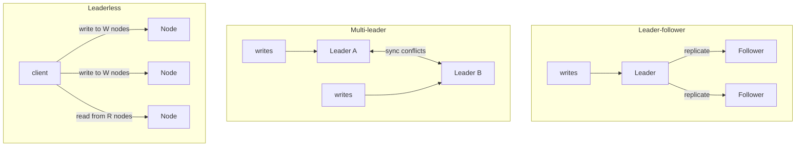

# Consensus and replication

## Why this matters

It's a Tuesday afternoon and your primary Postgres just failed over. The orchestrator promoted a standby, the application reconnected, and for ninety seconds everything looked fine. Then support starts paging: customers report orders they placed have vanished, and a few report being double-charged. You pull the logs and your stomach drops. The old primary never actually died — it was network-partitioned. It kept accepting writes the whole time. For ninety seconds you had two primaries, each convinced it was the only one, each acknowledging writes the other never saw. When the partition healed, one node's writes won and the other's were silently discarded.

That is split-brain, and it is the single most expensive failure mode in distributed data systems. The fix is not a better failover script. It's understanding that "which node is allowed to accept writes" is itself a distributed agreement problem — a consensus problem — and that you cannot solve it correctly with timeouts and heartbeats alone. Every system that survives partitions without losing data (etcd, ZooKeeper, Consul, CockroachDB, the control plane of Kubernetes) does so because a real consensus algorithm sits underneath, refusing to let a minority of nodes make progress.

The engineers who treat replication as "copy the writes to the other box" get paged at 3 a.m. for data they can never get back. The ones who understand quorums, leader election, and why a majority is the magic number can look at a degraded cluster and say, with confidence, "we have two of three nodes, we're still safe to write" or "we've lost quorum, stop writing now." This chapter gets you to the second group: enough theory to reason correctly, and enough operational detail to debug a real cluster when it wedges.

## Mental model

Replication means keeping copies of the same data on multiple nodes. The hard part is not copying — it's deciding the *order* of writes so that every copy ends up identical, even when nodes crash and networks drop messages. There are three classic topologies, and they differ entirely in how they answer "who decides the order?"



**Leader-follower** (also called primary-replica or single-leader) routes every write through one node. The leader assigns an order, then ships its log to followers. Reads can be served by any replica. This is what Postgres, MySQL, MongoDB, and Redis use by default. It's simple and gives you a single source of truth, but the leader is a bottleneck and a single point of failure — which is exactly why electing a *new* leader safely is the whole ballgame.

**Multi-leader** lets several nodes accept writes, then reconcile. This buys you write availability across regions but forces you to resolve conflicting concurrent edits (last-write-wins, CRDTs, or application merge logic). It's the right tool for offline-capable clients and multi-datacenter writes, and the wrong tool when you need a single authoritative value.

**Leaderless** (Dynamo-style, used by Cassandra and Riak) has clients write to several nodes directly and read from several, using quorum overlap to guarantee freshness. No election, no failover, graceful degradation — at the cost of weaker, tunable consistency.

The unifying idea across all of them is the **quorum**. If you have *N* replicas, require *W* nodes to acknowledge a write and *R* nodes to serve a read, then as long as `W + R > N` the read set and write set must overlap in at least one node — so a read always sees the latest acknowledged write. The most common choice is a strict majority: `W = R = ⌊N/2⌋ + 1`. Two majorities of the same set always intersect, which is precisely why majority quorums prevent split-brain. A minority can never form a quorum, so a partitioned-off minority simply cannot make progress. That single fact — *two majorities always overlap* — is the seed of every consensus algorithm.

Consensus is the problem of getting a group of nodes to agree on one value (or one ordered log of values) despite crashes and message loss. The FLP impossibility result (Fischer, Lynch, and Paterson, 1985) proved that in a fully asynchronous network you cannot guarantee both safety and liveness with even one faulty node — there's no way to distinguish a crashed node from a slow one. Real algorithms sidestep this by assuming *partial synchrony*: they stay safe always, and make progress whenever the network behaves for long enough. Raft and Paxos are the two algorithms that matter in practice.

## In practice

### Raft: the model you should actually carry in your head

Raft was designed for understandability (Ongaro and Ousterhout, "In Search of an Understandable Consensus Algorithm," 2014). It decomposes consensus into three sub-problems you can reason about separately: leader election, log replication, and safety.

Every node is in one of three states — `follower`, `candidate`, or `leader` — and time is divided into **terms**, monotonically increasing integers that act as a logical clock. Each term has at most one leader.

```text
follower  --(election timeout, no heartbeat)-->  candidate
candidate --(wins majority of votes)----------->  leader
candidate --(sees higher term / new leader)---->  follower
leader    --(sees higher term)----------------->  follower
```

Election works like this. A follower that hasn't heard a heartbeat within its randomized election timeout (the Raft paper uses a 150–300 ms range as a worked example) increments its term, votes for itself, and requests votes from everyone. A node grants its vote at most once per term, and only to a candidate whose log is at least as up-to-date as its own. If the candidate collects votes from a majority, it becomes leader and starts sending heartbeats. The randomized timeouts make split votes rare and self-correcting — if two candidates tie, both back off by different random amounts and one wins the next round.

Once elected, the leader handles all writes. Each write is an entry appended to the leader's log, then replicated via `AppendEntries` RPCs. An entry is **committed** once it's stored on a majority of nodes; only then does the leader apply it to its state machine and tell the client it succeeded.

```python
# Simplified Raft AppendEntries handler (follower side).
# This is the heart of replication safety — reject anything
# that would create a divergent log.
def handle_append_entries(self, req):
    # 1. Reject stale leaders.
    if req.term < self.current_term:
        return AppendResult(term=self.current_term, success=False)

    # A valid leader exists for this term: reset our election timer.
    self.reset_election_timeout()
    self.current_term = req.term
    self.state = FOLLOWER

    # 2. Log-matching check: our log must contain an entry at
    #    prev_log_index whose term equals prev_log_term.
    if not self.log_matches(req.prev_log_index, req.prev_log_term):
        return AppendResult(term=self.current_term, success=False)

    # 3. Delete conflicting suffix, then append new entries.
    self.truncate_conflicts(req.entries, req.prev_log_index)
    self.append(req.entries)

    # 4. Advance commit index to what the leader has committed,
    #    but never past what we actually hold.
    if req.leader_commit > self.commit_index:
        self.commit_index = min(req.leader_commit, self.last_log_index())

    return AppendResult(term=self.current_term, success=True)
```

*The same idea in TypeScript:*

```typescript
// Simplified Raft AppendEntries handler (follower side).
// This is the heart of replication safety — reject anything
// that would create a divergent log.
handleAppendEntries(req: AppendEntriesRequest): AppendResult {
  // 1. Reject stale leaders.
  if (req.term < this.currentTerm) {
    return { term: this.currentTerm, success: false };
  }

  // A valid leader exists for this term: reset our election timer.
  this.resetElectionTimeout();
  this.currentTerm = req.term;
  this.state = State.Follower;

  // 2. Log-matching check: our log must contain an entry at
  //    prevLogIndex whose term equals prevLogTerm.
  if (!this.logMatches(req.prevLogIndex, req.prevLogTerm)) {
    return { term: this.currentTerm, success: false };
  }

  // 3. Delete conflicting suffix, then append new entries.
  this.truncateConflicts(req.entries, req.prevLogIndex);
  this.append(req.entries);

  // 4. Advance commit index to what the leader has committed,
  //    but never past what we actually hold.
  if (req.leaderCommit > this.commitIndex) {
    this.commitIndex = Math.min(req.leaderCommit, this.lastLogIndex());
  }

  return { term: this.currentTerm, success: true };
}
```

The log-matching property in step 2 is the safety lever: if two logs contain an entry with the same index and term, they are identical in all preceding entries. A follower that's behind keeps rejecting until the leader walks its `prev_log_index` backward to the last point they agree on, then streams forward. This is how a node that missed messages catches up without ever applying a write out of order.

The crucial safety rule: a leader may only consider an entry committed if it's replicated on a majority *and* the entry belongs to the leader's current term. This prevents a subtle bug where an old entry from a previous term appears committed and is then overwritten — the scenario Figure 8 in the Raft paper walks through.

### Operating Raft: what etcd actually tells you

You don't implement Raft; you operate it. Here's etcd, the Raft store behind Kubernetes:

```bash
$ etcdctl endpoint status --cluster -w table
+----------------+------------------+---------+-----------+-----------+------------+
|    ENDPOINT    |        ID        | VERSION | IS LEADER | RAFT TERM | RAFT INDEX |
+----------------+------------------+---------+-----------+-----------+------------+
| 10.0.1.10:2379 | 8e9e05c52164694d | 3.5.12  | true      |        47 |    1839204 |
| 10.0.1.11:2379 | 91bc3c398fb3c146 | 3.5.12  | false     |        47 |    1839204 |
| 10.0.1.12:2379 | fd422379fda50e48 | 3.5.12  | false     |        47 |    1839198 |
+----------------+------------------+---------+-----------+-----------+------------+
```

Read this like a doctor reads a chart. All three nodes agree on `RAFT TERM 47` — the cluster has had a stable leader through its recent election history. Exactly one `IS LEADER`. The third node's `RAFT INDEX` lags by a handful of entries; that's normal replication latency, not a problem, as long as it keeps converging. If you saw two different terms, or two leaders, or a follower's index frozen while others advance, you'd have a real incident. A cluster that has lost quorum (two of three nodes down) will refuse writes entirely and `endpoint health` will report the cluster as unhealthy — that refusal is the system protecting your data, not failing you.

### Paxos, briefly, and why you'll meet it as Multi-Paxos

Paxos (Lamport, "The Part-Time Parliament," 1998; restated in "Paxos Made Simple," 2001) solves single-value consensus through a two-phase protocol — *prepare/promise* then *accept/accepted* — where a proposer needs a majority to promise before its value can be chosen. Plain Paxos agrees on one value; real systems need an ordered log, so they run **Multi-Paxos**, which elects a stable leader to skip the prepare phase on every entry, making it converge structurally with Raft. Spanner, Chubby, and many Google systems are Paxos-based. The honest operational summary: Paxos and Raft give you the same guarantees; Raft is easier to reason about and debug, which is why most new systems pick it. Choose the algorithm your storage engine already ships; never roll your own.

> **Security note:** Consensus protocols as described tolerate *crash* faults (nodes that stop), not *Byzantine* faults (nodes that lie). On an untrusted network, a malicious node can forge `RequestVote` or `AppendEntries` messages and corrupt the log. Always run Raft/Paxos traffic over mutual TLS with peer authentication (etcd's `--peer-cert-file` / `--peer-client-cert-auth`), and treat the consensus ports as a private control plane. If you genuinely need to tolerate malicious nodes — as blockchains do — you need Byzantine fault-tolerant consensus (PBFT, Tendermint), which costs an extra round and a larger quorum (`3f+1` nodes to tolerate `f` liars).

## Pitfalls and anti-patterns

**Even-numbered clusters.** Running 2, 4, or 6 nodes is almost always wrong. A 4-node cluster tolerates only one failure — the same as 3 — but has *more* ways to fail and a larger majority (3) to coordinate. Worse, an even split (2 vs 2) means neither side has a majority and the whole cluster stalls. Always run an odd number: 3 for most workloads, 5 when you need to tolerate two simultaneous failures. Recognize it by counting your members; fix it by adding or removing one node to reach the next odd number.

**Confusing failover with consensus.** A heartbeat-plus-timeout failover script (the classic "if the primary doesn't respond in 10s, promote the standby") is *not* consensus. It cannot distinguish a dead primary from a partitioned one, so under partition it cheerfully creates two primaries — the split-brain in this chapter's opening. Recognize it when your HA setup is "a script and a virtual IP." Fix it by putting a real quorum-based coordinator in charge of promotion (Patroni + etcd for Postgres, for example), so a node that can't reach a majority refuses to be primary. Fencing — forcibly killing or STONITHing the old primary before promoting — is the backstop.

**Synchronous replication with no quorum, or async replication you think is safe.** With fully asynchronous replication, an acknowledged write can be lost if the leader dies before shipping it. With synchronous replication to *one* specific follower, losing that follower stalls all writes. The robust middle is quorum/semi-sync replication: acknowledge once a majority (or any *k*-of-*n*) has the write. Recognize the danger by asking "if the leader's disk dies right now, can I lose an acknowledged transaction?" If yes, you're running async and calling it durable.

**Reading from a stale follower and calling it consistent.** In leader-follower systems, followers lag. A client that writes to the leader then reads from a follower can fail to see its own write. Recognize it as "I just saved it, why is it gone?" bugs after you add read replicas. Fix it with read-your-writes routing (route a user's reads to the leader for a window after their write), or by reading from a quorum, or by using a "read index" the way etcd's linearizable reads do.

**Tuning election timeouts too aggressively.** Set the Raft election timeout near your network's tail latency and a transient GC pause or a slow link triggers a needless election; the cluster spends its time re-electing leaders instead of serving traffic ("flapping"). Recognize it by a `RAFT TERM` that climbs steadily with no node failures. The rule of thumb from the Raft paper: `broadcastTime ≪ electionTimeout ≪ MTBF`. Keep election timeout an order of magnitude above your typical round-trip time.

## Production checklist

- [ ] Odd number of voting members (3 or 5); never run an even count
- [ ] Members spread across failure domains (racks/AZs), but within latency that keeps `electionTimeout` comfortable — cross-region consensus needs deliberate timeout tuning
- [ ] Quorum-based promotion (e.g. Patroni/etcd, not a bare heartbeat script) with fencing/STONITH of the demoted node
- [ ] Replication mode chosen and documented: quorum/semi-sync for durability, with the data-loss window written down for the async case
- [ ] Mutual TLS with peer authentication on all consensus/replication ports; ports firewalled to the cluster
- [ ] `electionTimeout` ≫ p99 RTT and heartbeat interval; alert on rising `RAFT TERM` (election storms)
- [ ] Alerting on quorum loss, leader changes, and follower replication lag/`RAFT INDEX` divergence
- [ ] Read-consistency policy explicit per query path (linearizable from leader vs. eventual from follower) so stale reads are a choice, not a surprise
- [ ] Backups and disaster-recovery snapshots independent of the consensus layer (a quorum loss or quorum corruption can still take the cluster down)
- [ ] A documented, rehearsed runbook for "lost quorum" — including the dangerous `--force-new-cluster` style recovery, which discards uncommitted entries and must be a last resort

## Exercises

1. **(Comprehension)** A cluster has `N = 5` nodes with `W = 3` and `R = 3`. Prove that any read observes the most recent acknowledged write. Then explain what consistency guarantee you get if you instead set `W = 1, R = 1`, and what real workload that weaker setting is appropriate for.

2. **(Applied)** Spin up a local 3-node etcd cluster (Docker Compose or `goreman`). Write a key, then use `iptables` or `docker network disconnect` to partition the leader away from the other two. Observe: which side elects a new leader, what happens to writes on the partitioned-off old leader, and what happens to the key when you heal the partition. Capture `endpoint status --cluster` before, during, and after.

3. **(Design)** You operate a Postgres-backed service that must survive the loss of any one availability zone with zero acknowledged-write loss, while keeping p99 write latency under 20 ms within a region. Design the replication and failover topology. Specify node count and placement, synchronous vs. quorum replication, how a new primary is elected and how the old one is fenced, and how application reads are routed. Name the one failure scenario your design still can't survive, and justify accepting it.

## Further reading

- Diego Ongaro and John Ousterhout, ["In Search of an Understandable Consensus Algorithm (Extended Version)"](https://raft.github.io/raft.pdf) — the Raft paper; read Sections 5 and 8 closely, and visualize it at https://raft.github.io
- Leslie Lamport, ["Paxos Made Simple"](https://lamport.azurewebsites.net/pubs/paxos-simple.pdf) (2001) — the readable restatement of the original protocol
- Fischer, Lynch, Paterson, ["Impossibility of Distributed Consensus with One Faulty Process"](https://groups.csail.mit.edu/tds/papers/Lynch/jacm85.pdf) (1985) — the FLP result that explains why partial synchrony is necessary
- Martin Kleppmann, *Designing Data-Intensive Applications* — Chapters 5 (Replication) and 9 (Consistency and Consensus) are the definitive practitioner treatment
- etcd documentation, ["etcd learning: Why etcd"](https://etcd.io/docs/latest/learning/why/) and the [operations guide](https://etcd.io/docs/latest/op-guide/) — how a production Raft store is run and recovered

> **Connect the dots:** The quorum-overlap and read-your-writes problems here are two faces of the same coin as idempotency and the exactly-once illusion (next chapter): both are about what a client can safely assume after the network has acknowledged — or failed to acknowledge — a request. And the leader-elects-then-replicates-an-ordered-log structure of Raft is exactly the ordering guarantee that event-driven systems and event sourcing (Chapters 4 and 5) lean on underneath their logs.
